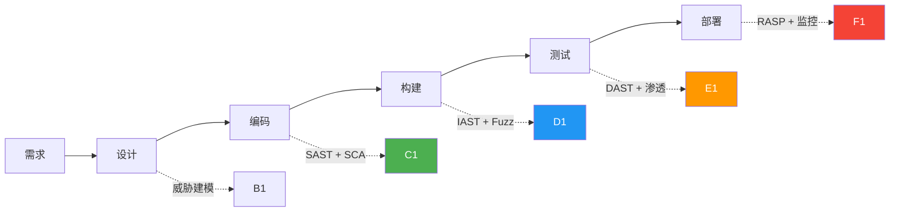
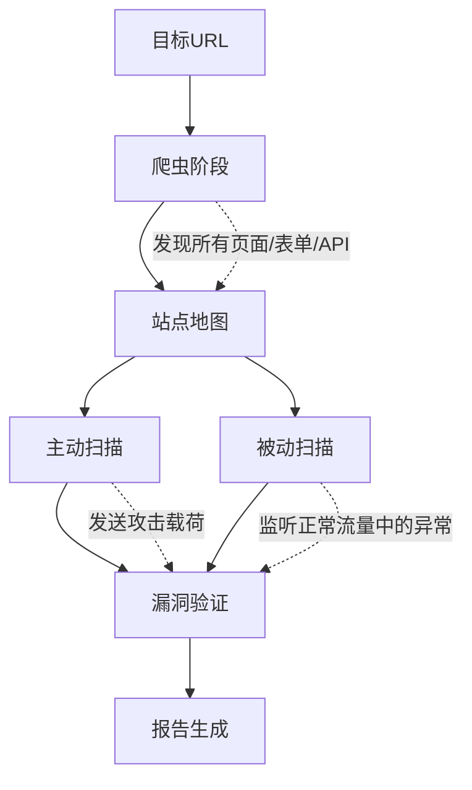
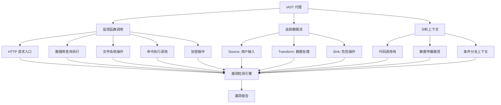
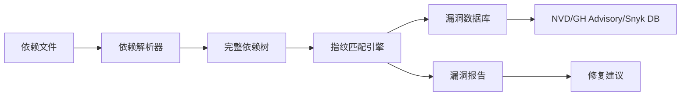
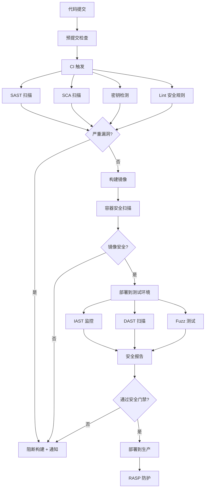
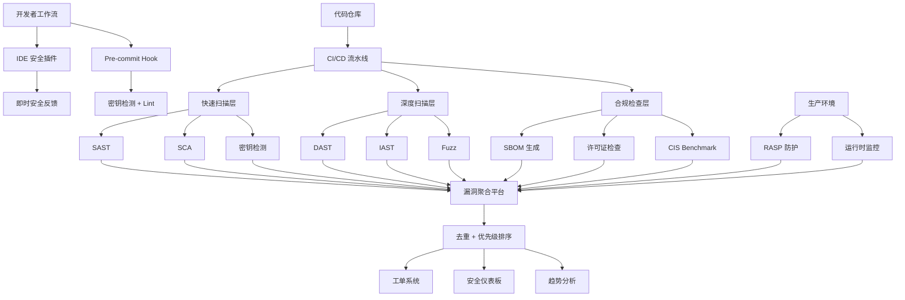

## 十二、自动化安全测试

手工安全测试是发现深层逻辑漏洞的利器，但它有一个根本性的瓶颈：**无法规模化**。一个中等规模的应用可能有数百个端点、数千种参数组合，手工逐一测试既不现实也不经济。自动化安全测试的核心使命，是在软件交付流水线中嵌入持续的安全验证能力，让安全检测像单元测试一样自动运行、即时反馈。

本节系统讲解自动化安全测试的六大技术方向——SAST、DAST、IAST、SCA、Fuzz Testing、RASP——以及如何将它们编排成一套完整的安全测试流水线。

### 12.1 为什么需要自动化安全测试

#### 12.1.1 手工测试的根本局限

| 维度 | 手工测试 | 自动化测试 |
|------|---------|-----------|
| 覆盖速度 | 一个资深工程师日均审查 2,000-5,000 行代码 | SAST 工具 10 分钟扫描 100 万行 |
| 一致性 | 取决于个人经验和疲劳程度 | 相同规则每次扫描结果一致 |
| 回归检测 | 容易遗漏已修复漏洞的再次引入 | 每次构建自动回归验证 |
| 覆盖范围 | 聚焦高风险区域，低风险区域易被忽略 | 全量覆盖，无死角 |
| 成本 | 人力成本高，周期长 | 前期投入后边际成本趋近于零 |
| 适用阶段 | 渗透测试、代码审计 | 全生命周期持续运行 |

但这不意味着自动化可以替代手工测试。两者的关系是**互补而非替代**：自动化负责广度覆盖和持续监控，手工测试负责深度挖掘和逻辑漏洞发现。

#### 12.1.2 安全测试的"左移"（Shift-Left）

传统安全测试放在上线前的渗透测试阶段，发现问题时修复成本已经很高。OWASP 的研究表明，在编码阶段发现并修复一个漏洞的成本是 1x，在测试阶段是 5x，在生产环境是 15x-100x。



左移的核心思想是：**越早发现漏洞，修复成本越低，安全效率越高**。自动化安全测试是实现左移的技术基础。

#### 12.1.3 安全测试成熟度模型

组织的安全测试能力可以分为五个级别：

| 级别 | 特征 | 典型实践 |
|------|------|---------|
| L1 初始级 | 安全测试完全手工，无标准化 | 上线前偶尔做渗透测试 |
| L2 基础级 | 引入单一自动化工具 | CI 中集成 SAST 或 SCA |
| L3 定义级 | 多工具组合，流程标准化 | SAST + DAST + SCA 编排执行 |
| L4 管理级 | 量化度量，持续优化 | 覆盖率、误报率、修复时效等 KPI 跟踪 |
| L5 优化级 | 安全即代码，自动化驱动 | 安全策略即代码、自动修复建议、AI 辅助分析 |

### 12.2 SAST（静态应用安全测试）

SAST 在不运行代码的情况下分析源代码、字节码或二进制代码，通过数据流分析、控制流分析、污点传播等技术发现安全漏洞。它是最容易左移的测试手段——可以直接集成到 IDE 和代码提交阶段。

#### 12.2.1 SAST 的核心检测原理

SAST 工具的底层技术主要有三类：

**数据流分析（Data Flow Analysis）**：追踪用户输入从 Source（如 `request.getParameter()`）到 Sink（如 `Statement.execute()`）的传播路径。如果数据在传播过程中未经过充分的验证或编码，就标记为潜在漏洞。

```text
Source: request.getParameter("id")
  ↓ [未经过滤直接拼接]
Sink: Statement.execute("SELECT * FROM users WHERE id=" + id)
  → 报告: SQL Injection
```

**控制流分析（Control Flow Analysis）**：分析程序的执行路径，判断安全关键操作是否在所有分支中都被正确保护。例如检查是否所有路径都经过了认证检查。

**语义模式匹配（Semantic Pattern Matching）**：基于已知漏洞模式的规则匹配，比简单的正则表达式更精确，能理解代码语义。例如检测硬编码密钥、不安全的加密算法使用等。

#### 12.2.2 主流 SAST 工具深度对比

| 工具 | 类型 | 支持语言 | 检测原理 | CI/CD 集成 | 学习曲线 | 适用场景 |
|------|------|---------|---------|-----------|---------|---------|
| **Semgrep** | 开源/商业 | 30+ | 语义模式匹配 | GitHub Actions, GitLab CI, Jenkins | 低 | 快速扫描、自定义规则、开源项目 |
| **CodeQL** | 免费(GitHub) | 10+ | 数据流分析 + 查询语言 | GitHub Code Scanning | 中高 | 深度代码审计、安全研究 |
| **SonarQube** | 社区版/商业 | 30+ | 多引擎混合 | 所有主流 CI | 低 | 日常开发质量门禁 |
| **Fortify** | 商业 | 20+ | 深度数据流 + 控制流 | Jenkins, Azure DevOps | 高 | 企业级安全审计 |
| **Checkmarx** | 商业 | 25+ | 源码级数据流 | 所有主流 CI | 中 | 企业 DevSecOps |
| **Bandit** | 开源 | Python | AST 模式匹配 | 任何 CI | 极低 | Python 项目快速扫描 |
| **ESLint Security** | 开源 | JavaScript/TS | 规则匹配 | 任何 CI | 极低 | JS/TS 前端项目 |
| **Gosec** | 开源 | Go | AST 分析 | 任何 CI | 低 | Go 项目安全扫描 |

#### 12.2.3 实操：Semgrep 自定义规则

Semgrep 的最大优势是规则编写极其直观——规则本身就像你想要匹配的代码模式：

```yaml
# .semgrep/rules.yaml
rules:
  # 检测 SQL 注入：未经参数化直接拼接用户输入
  - id: sql-injection-string-format
    patterns:
      - pattern: |
          $QUERY = $STRING.format(...)
          $CURSOR.execute($QUERY, ...)
    message: "使用字符串格式化构建SQL查询，存在SQL注入风险。请使用参数化查询。"
    languages: [python]
    severity: ERROR
    metadata:
      cwe:
        - "CWE-89: Improper Neutralization of Special Elements used in an SQL Command"
      owasp:
        - A03:2021 - Injection
      confidence: HIGH

  # 检测硬编码密钥
  - id: hardcoded-secret
    pattern-either:
      - pattern: |
          $VAR = "AKIA..."
      - pattern: |
          $VAR = "sk-..."
      - pattern: |
          $VAR = "ghp_..."
      - pattern: |
          api_key = "..."
      - pattern: |
          secret_key = "..."
    message: "检测到疑似硬编码密钥，应使用环境变量或密钥管理服务。"
    languages: [python, javascript, java]
    severity: WARNING
    metadata:
      cwe:
        - "CWE-798: Use of Hard-coded Credentials"

  # 检测不安全的随机数生成（用于安全上下文）
  - id: insecure-random-security-context
    patterns:
      - pattern: |
          random.randint(...)
      - pattern-not-inside: |
          random.randint(...) # nosec
    message: "安全上下文中不应使用random模块，应使用secrets模块生成安全随机数。"
    languages: [python]
    severity: WARNING
```

运行扫描：

```bash
# 安装 semgrep
pip install semgrep

# 使用自定义规则扫描
semgrep --config .semgrep/rules.yaml ./src

# 使用 OWASP 规则集扫描
semgrep --config "p/owasp-top-ten" ./src

# 使用 p/security-audit 规则集（更全面）
semgrep --config "p/security-audit" ./src

# 只扫描变更的文件（适合 CI）
git diff --name-only HEAD~1 | xargs semgrep --config "p/owasp-top-ten"

# 生成 SARIF 格式报告（可导入 GitHub Security）
semgrep --config "p/owasp-top-ten" --sarif -o results.sarif ./src
```

#### 12.2.4 实操：CodeQL 深度查询

CodeQL 是 GitHub 推出的代码分析引擎，它将代码转化为可查询的数据库，使用类似 SQL 的查询语言进行深度分析：

```ql
// 查询 Python 中的 SQL 注入漏洞
import python
import semmle.python.security.dataflow.SqlInjectionQuery

from SqlInjectionFlow::PathNode source, SqlInjectionFlow::PathNode sink
where SqlInjectionFlow::flowPath(source, sink)
select sink.getNode(), source, sink,
  "SQL 查询使用了未经验证的用户输入 $@.", source.getNode(), "user input"
```

```bash
# 创建 CodeQL 数据库
codeql database create my-db --language=python --source-root=./src

# 运行查询
codeql database analyze my-db python-sql-injection.ql --format=sarif-latest --output=results.sarif

# 使用 GitHub 官方查询套件
codeql database analyze my-db codeql/python-queries --format=sarif-latest --output=results.sarif
```

#### 12.2.5 SAST 的误报管理

SAST 最大的痛点是**误报率**。一个未经调优的 SAST 扫描，误报率可达 50%-80%。有效的误报管理策略：

1. **基线建立**：首次全量扫描后，对所有发现进行人工审核，将确认的误报标记为基线
2. **抑制规则**：对已确认的误报模式编写抑制规则，避免重复报告
3. **优先级排序**：按严重程度、可利用性、业务影响三个维度综合排序
4. **渐进式引入**：不要一次性开启所有规则，先从高置信度规则开始
5. **定期校准**：每季度回顾误报和漏报，调整规则权重

```python
# 误报率计算公式
precision = true_positives / (true_positives + false_positives)  # 准确率
recall = true_positives / (true_positives + false_negatives)     # 召回率
f1_score = 2 * (precision * recall) / (precision + recall)       # F1 分数

# 目标：precision > 0.8, recall > 0.6
```

### 12.3 DAST（动态应用安全测试）

DAST 从外部视角测试运行中的应用程序，模拟真实攻击者的行为。它不需要访问源代码，因此可以测试任何技术栈构建的应用，包括第三方系统。

#### 12.3.1 DAST 的工作原理

DAST 的扫描流程通常分为四个阶段：



**爬虫阶段**：自动遍历应用的所有页面、表单、API 端点，构建完整的站点地图。现代 DAST 工具支持 SPA（单页应用）的 JavaScript 渲染爬虫。

**主动扫描**：向每个端点发送恶意载荷（SQL 注入 payload、XSS payload、路径遍历 payload 等），检测应用是否返回了异常响应。

**被动扫描**：在正常浏览流量中检测安全问题，如缺少安全头、敏感信息泄露、不安全的 Cookie 配置等。

**漏洞验证**：对发现的疑似漏洞进行二次验证，降低误报率。

#### 12.3.2 主流 DAST 工具深度对比

| 工具 | 类型 | 核心能力 | API 测试 | 认证支持 | 自动化 | 适用场景 |
|------|------|---------|---------|---------|--------|---------|
| **OWASP ZAP** | 开源 | 全面扫描、脚本引擎 | 支持 | 多种 | 命令行+API | 学习、中小项目、CI集成 |
| **Burp Suite** | 商业 | 专业级扫描+手动测试 | 支持 | 多种 | 插件+API | 专业渗透测试 |
| **Nuclei** | 开源 | 模板化扫描、社区模板库 | 支持 | 基础 | 命令行 | 大规模资产扫描 |
| **Nikto** | 开源 | Web 服务器扫描 | 不支持 | 基础 | 命令行 | 服务器配置检查 |
| **Acunetix** | 商业 | 高自动化、低误报 | 支持 | 多种 | API+CI | 企业持续扫描 |
| **Invicti** | 商业 | Proof-Based 扫描 | 支持 | 多种 | API+CI | 企业级验证型扫描 |

#### 12.3.3 实操：OWASP ZAP 自动化扫描

```bash
# 安装 ZAP
docker pull ghcr.io/zaproxy/zaproxy:stable

# 快速扫描（适合 CI/CD）
docker run -t ghcr.io/zaproxy/zaproxy:stable zap-full-scan.py \
    -t https://target.example.com \
    -r report.html \
    -x report.xml \
    -a  # 包含 alpha 规则

# API 扫描（适合 REST API）
docker run -t ghcr.io/zaproxy/zaproxy:stable zap-api-scan.py \
    -t https://target.example.com/openapi.json \
    -f openapi \
    -r api-report.html

# 被动扫描（只监听不攻击，适合生产环境）
docker run -t ghcr.io/zaproxy/zaproxy:stable zap-baseline.py \
    -t https://target.example.com \
    -r baseline-report.html

# 带认证扫描
docker run -v $(pwd):/zap/wrk/:rw -t ghcr.io/zaproxy/zaproxy:stable zap-full-scan.py \
    -t https://target.example.com \
    -z "-configfile /zap/wrk/zap-auth.conf" \
    -r report.html
```

ZAP 认证配置文件 `zap-auth.conf` 示例：

```json
{
  "authentication": {
    "method": "form",
    "parameters": {
      "loginUrl": "https://target.example.com/login",
      "loginRequestData": "username=&password="
    },
    "verification": {
      "method": "response",
      "loggedInRegex": "\\QWelcome\\E"
    }
  },
  "users": [
    {
      "name": "test-user",
      "credentials": {
        "username": "admin",
        "password": "password123"
      }
    }
  ]
}
```

#### 12.3.4 实操：Nuclei 模板化扫描

Nuclei 是 ProjectDiscovery 出品的扫描工具，使用 YAML 模板定义攻击逻辑，社区维护了超过 8,000 个模板：

```bash
# 安装 nuclei
go install -v github.com/projectdiscovery/nuclei/v3/cmd/nuclei@latest

# 更新模板库
nuclei -update-templates

# 全量扫描
nuclei -u https://target.example.com -t cves/ -t vulnerabilities/

# 只扫描特定漏洞类型
nuclei -u https://target.example.com -t cves/ -severity critical,high

# 批量扫描
nuclei -l urls.txt -t technologies/ -t misconfigurations/

# 自定义模板示例：检测目录遍历
```

```yaml
# templates/directory-traversal.yaml
id: directory-traversal-test
info:
  name: Directory Traversal Test
  author: security-team
  severity: high
  description: 检测路径遍历漏洞
  tags: traversal,lfi

requests:
  - method: GET
    path:
      - "{{BaseURL}}/download?file=../../../etc/passwd"
      - "{{BaseURL}}/download?file=....//....//....//etc/passwd"
      - "{{BaseURL}}/download?file=%2e%2e%2f%2e%2e%2f%2e%2e%2fetc%2fpasswd"
    matchers-condition: and
    matchers:
      - type: regex
        regex:
          - "root:.*:0:0:"
      - type: status
        status:
          - 200
```

#### 12.3.5 DAST 的局限性与应对

DAST 有其天然局限，了解这些才能合理安排测试策略：

| 局限性 | 原因 | 应对方案 |
|--------|------|---------|
| 无法定位具体代码行 | 只能从外部观察 | 结合 SAST/IAST 定位 |
| 扫描速度慢 | 需要发送大量请求 | 增量扫描、范围限定 |
| 对 SPA 支持有限 | JS 渲染页面难以爬取 | 使用 headless 浏览器爬虫 |
| 无法检测编译型漏洞 | 运行时表现正常 | 结合 SAST 补充 |
| 可能触发真实攻击 | 扫描载荷可能导致副作用 | 使用专用测试环境 |
| 认证维护成本高 | Token/Session 过期 | 自动化认证刷新脚本 |

### 12.4 IAST（交互式应用安全测试）

IAST 通过在应用程序中部署轻量级代理（Agent），在运行时实时监控应用的内部行为。它结合了 SAST 的代码级精度和 DAST 的运行时视角，是目前准确率最高的自动化安全测试技术之一。

#### 12.4.1 IAST 的工作原理

IAST 代理通过字节码插桩（Java）、运行时 Hook（.NET）或动态链接库注入（C/C++）的方式嵌入应用进程内部，监控以下关键操作：



核心检测逻辑：当用户输入（Source）未经安全处理（Transform）直接到达危险操作（Sink）时，IAST 判定存在漏洞。由于它能看到完整的数据流路径和代码上下文，误报率远低于 SAST。

#### 12.4.2 IAST 工具对比

| 工具 | 类型 | 支持平台 | 部署方式 | 特点 |
|------|------|---------|---------|------|
| **Contrast Assess** | 商业 | Java, .NET, Node.js, Python, Ruby | Agent 部署 | 行业标杆，漏洞覆盖全面 |
| **Checkmarx CxIAST** | 商业 | Java, .NET | Agent 部署 | 与 CxSAST 联动 |
| **OpenRASP** | 开源 | Java, PHP | Agent 部署 | 百度开源，社区活跃 |
| **Hdiv/Hdiv Security** | 商业 | Java | Agent 部署 | 专注 Java 生态 |

#### 12.4.3 实操：OpenRASP 部署

OpenRASP 是百度开源的 RASP/IAST 方案，适合 Java 和 PHP 应用：

```bash
# 下载 OpenRASP
wget https://github.com/baidu/openrasp/releases/latest/download/rasp-java.tar.gz
tar -xzf rasp-java.tar.gz

# Java 应用部署 - 添加 JVM 参数
java -javaagent:/path/to/rasp/rasp.jar \
     -Drasp.app_id=your-app-id \
     -Drasp.offline_mode=false \
     -jar your-application.jar

# 或在 Tomcat 中配置
# 编辑 catalina.sh，添加：
export JAVA_OPTS="$JAVA_OPTS -javaagent:/path/to/rasp/rasp.jar"
```

OpenRASP 检测规则配置示例：

```json
{
  "plugins": {
    "official": {
      "sql_injection": {
        "action": "block",
        "min_length": 10,
        "stack": true
      },
      "directory_traversal": {
        "action": "log",
        "white_list": ["/var/www/uploads/"]
      },
      "command_injection": {
        "action": "block",
        "white_list": ["ping", "nslookup"]
      }
    }
  }
}
```

#### 12.4.4 IAST 的适用与不适用

**适合使用 IAST 的场景**：
- 功能测试阶段的安全增强（QA 测试时自动发现安全漏洞）
- 微服务架构中需要精确定位漏洞所在服务
- 合规审计需要漏洞精确证据链
- 安全测试覆盖率的量化评估

**不适合使用 IAST 的场景**：
- 纯静态内容（静态 HTML、前端资源文件）
- 嵌入式系统或无法插桩的环境
- 性能极端敏感的核心交易链路（IAST 有 1%-5% 的性能开销）
- 无法修改部署配置的第三方应用

### 12.5 SCA（软件成分分析）

现代应用中，第三方组件（开源库、框架、依赖包）通常占代码总量的 60%-80%。SCA 的目标是识别这些组件中的已知漏洞（CVE），以及许可证合规风险。

#### 12.5.1 SCA 的检测原理

SCA 的工作流程：

1. **依赖解析**：分析 `package.json`、`pom.xml`、`requirements.txt`、`go.mod` 等依赖文件，构建完整的依赖树（包括传递依赖）
2. **指纹匹配**：计算组件的哈希值（SHA-256），与漏洞数据库中的指纹进行匹配
3. **版本比对**：将依赖版本与已知受影响版本范围进行比对
4. **漏洞关联**：从 NVD、GitHub Advisory、Snyk Vulnerability Database 等数据源获取 CVE 详情
5. **修复建议**：推荐安全的升级版本或替代方案



#### 12.5.2 主流 SCA 工具深度对比

| 工具 | 类型 | 数据源 | SBOM 生成 | 自动修复 | CI 集成 | 适用场景 |
|------|------|--------|----------|---------|--------|---------|
| **Snyk** | 商业(免费层) | Snyk DB | 支持 | 自动 PR | 所有主流 CI | 开发者友好，开源项目 |
| **GitHub Dependabot** | 免费 | GH Advisory | 支持 | 自动 PR | GitHub 原生 | GitHub 项目首选 |
| **OWASP Dep-Check** | 开源 | NVD | 支持 | 不支持 | 任何 CI | 离线环境、合规需求 |
| **Trivy** | 开源 | 多数据源 | 支持 | 不支持 | 任何 CI | 容器+代码一站式扫描 |
| **Grype** | 开源 | 多数据源 | 支持 | 不支持 | 任何 CI | 轻量级、速度快 |
| **Black Duck** | 商业 | Black Duck KB | 支持 | 不支持 | 所有主流 CI | 企业级合规 |

#### 12.5.3 实操：多语言 SCA 扫描

```bash
# Trivy - 全能扫描工具（推荐）
# 安装
curl -sfL https://raw.githubusercontent.com/aquasecurity/trivy/main/contrib/install.sh | sh -s -- -b /usr/local/bin

# 扫描项目依赖
trivy fs --scanners vuln ./my-project

# 扫描并生成 SBOM
trivy fs --scanners vuln --format spdx-json -o sbom.json ./my-project

# 只显示高危和严重漏洞
trivy fs --scanners vuln --severity HIGH,CRITICAL ./my-project

# Python 项目扫描
trivy fs --scanners vuln ./python-app --requirement-files requirements.txt

# Node.js 项目扫描
trivy fs --scanners vuln ./node-app

# Java 项目扫描（Maven）
trivy fs --scanners vuln ./java-app --include-dev-deps false


# Snyk - 开发者友好型
# 安装
npm install -g snyk

# 认证
snyk auth

# 扫描并修复
snyk test
snyk fix  # 自动创建修复 PR

# 监控（持续跟踪漏洞）
snyk monitor


# OWASP Dependency-Check - 离线扫描
# 安装
wget https://github.com/jeremylong/DependencyCheck/releases/latest/download/dependency-check-*-release.zip

# 扫描
dependency-check.sh --project "My Project" --scan ./src --format HTML --format JSON

# 仅扫描特定依赖
dependency-check.sh --project "My Project" --scan ./pom.xml --format HTML
```

#### 12.5.4 SBOM（软件物料清单）实践

SBOM 是 SCA 的重要产出，也是越来越多合规要求的必备项（如美国行政令 14028）：

```bash
# 使用 Syft 生成 SBOM
curl -sSfL https://raw.githubusercontent.com/anchore/syft/main/install.sh | sh -s -- -b /usr/local/bin

# 生成 CycloneDX 格式 SBOM
syft ./my-project -o cyclonedx-json=sbom.cdx.json

# 生成 SPDX 格式 SBOM
syft ./my-project -o spdx-json=sbom.spdx.json

# 容器镜像 SBOM
syft my-app:latest -o cyclonedx-json=image-sbom.cdx.json

# 使用 Grype 分析 SBOM 中的漏洞
grype sbom:sbom.cdx.json
```

#### 12.5.5 许可证合规风险

SCA 不仅检测安全漏洞，还需要关注开源许可证的合规性：

| 风险级别 | 许可证类型 | 示例 | 注意事项 |
|---------|----------|------|---------|
| 高风险 | Copyleft（强传染性） | GPL-3.0, AGPL-3.0 | 修改后的代码必须以相同许可证开源 |
| 中风险 | Copyleft（弱传染性） | LGPL-2.1, MPL-2.0 | 动态链接通常安全，静态链接需注意 |
| 低风险 | 宽松许可证 | MIT, Apache-2.0, BSD | 保留版权声明即可 |
| 无风险 | 公共领域 | Unlicense, CC0 | 无任何限制 |

### 12.6 Fuzz Testing（模糊测试）

Fuzz Testing 通过向程序输入大量随机或半随机的畸形数据，检测程序的崩溃、内存泄漏、未处理异常等问题。它是最有效的发现未知漏洞的方法之一——Google 的 OSS-Fuzz 项目已在开源软件中发现了超过 10,000 个漏洞。

#### 12.6.1 Fuzz 测试的三种策略

| 策略 | 原理 | 优点 | 缺点 | 适用场景 |
|------|------|------|------|---------|
| **黑盒 Fuzz** | 完全随机生成输入 | 无需源码 | 覆盖率低 | 闭源应用、协议测试 |
| **白盒 Fuzz** | 基于代码约束求解生成输入 | 覆盖率高 | 需要源码，速度慢 | 安全关键模块 |
| **灰盒 Fuzz** | 基于代码覆盖率反馈调整输入 | 平衡效率与覆盖 | 需要编译插桩 | 最常用，libFuzzer/AFL |

#### 12.6.2 实操：AFL++ 灰盒 Fuzz

AFL++ 是 AFL（American Fuzzy Lop）的增强版，是目前最流行的灰盒模糊测试工具：

```bash
# 安装 AFL++
git clone https://github.com/AFLplusplus/AFLplusplus.git
cd AFLplusplus
make
sudo make install

# 准备测试目标 - 以 C 程序为例
# 编译目标程序（使用 AFL++ 的编译器）
afl-clang-fast -o target_fuzz target.c

# 创建种子输入目录
mkdir -p input
echo "test input" > input/sample.txt

# 运行 Fuzz
afl-fuzz -i input -o output -- ./target_fuzz @@

# 多核并行 Fuzz
# 主 fuzzer
afl-fuzz -i input -o output -M main -- ./target_fuzz @@
# 从 fuzzer（开多个）
afl-fuzz -i input -o output -S worker1 -- ./target_fuzz @@
afl-fuzz -i input -o output -S worker2 -- ./target_fuzz @@
```

AFL++ 发现的崩溃结果保存在 `output/crashes/` 目录中，每个文件都是一个能触发崩溃的输入。使用 `afl-tmin` 可以最小化崩溃用例：

```bash
# 最小化崩溃用例
afl-tmin -i output/crashes/id:000000 -o crash_minimized -- ./target_fuzz @@
```

#### 12.6.3 实操：libFuzzer 覆盖率引导 Fuzz

libFuzzer 是 LLVM 项目内置的 Fuzz 引擎，适合对库函数进行精确 Fuzz：

```c
// fuzz_target.c - libFuzzer 测试入口
#include <stdint.h>
#include <stddef.h>
#include "target_library.h"

// Fuzz 入口函数，libFuzzer 会反复调用此函数并传入随机数据
int LLVMFuzzerTestOneInput(const uint8_t *data, size_t size) {
    // 将 fuzzer 输入传递给被测函数
    parse_input(data, size);
    return 0;
}
```

```bash
# 编译
clang -g -O1 -fsanitize=fuzzer,address fuzz_target.c target_library.c -o fuzz_target

# 运行 Fuzz
./fuzz_target -max_len=4096 -timeout=10 -jobs=4

# 使用字典提高效率
./fuzz_target -dict=dict.txt

# 从已有的语料库开始
./fuzz_target corpus/
```

#### 12.6.4 实操：Python 项目 Fuzz（atheris）

```python
# fuzz_target.py
import atheris
import sys

# 导入被测模块
with atheris.instrument_imports():
    import json_parser  # 被测模块

def TestOneInput(data):
    fdp = atheris.FuzzedDataProvider(data)
    try:
        # 将 fuzzer 数据传递给被测函数
        json_parser.parse(fdp.ConsumeString(fdp.remaining_bytes()))
    except (ValueError, TypeError):
        # 预期的解析错误不算崩溃
        pass

atheris.Setup(sys.argv, TestOneInput)
atheris.Fuzz()
```

```bash
# 安装 atheris
pip install atheris

# 运行
python fuzz_target.py
```

#### 12.6.5 OSS-Fuzz：开源项目的免费 Fuzz

Google 的 OSS-Fuzz 为开源项目提供免费的持续模糊测试服务：

```yaml
# project.yaml - OSS-Fuzz 项目配置
homepage: "https://github.com/your/project"
language: c  # c, c++, python, go, java, rust, javascript
primary_contact: "security@example.com"
auto_ccs:
  - "developer@example.com"
sanitizers:
  - address
  - undefined
  - memory
fuzzing_engines:
  - libfuzzer
  - afl
  - honggfuzz
```

```dockerfile
# Dockerfile - 构建 Fuzz 目标
FROM gcr.io/oss-fuzz-base/base-builder
RUN git clone --depth 1 https://github.com/your/project.git
WORKDIR project
COPY build.sh $SRC/
RUN compile
```

### 12.7 RASP（运行时应用自我保护）

RASP 将安全防护逻辑直接嵌入应用程序运行时，能够实时检测和阻断攻击。与 WAF 从外部拦截不同，RASP 从应用内部监控，拥有完整的上下文信息，因此误报率极低。

#### 12.7.1 RASP vs WAF

| 维度 | WAF | RASP |
|------|-----|------|
| 部署位置 | 应用外部（网络层） | 应用内部（运行时） |
| 检测视角 | HTTP 请求/响应 | 应用内部函数调用 |
| 误报率 | 较高（只看请求，不知上下文） | 极低（有完整调用栈和数据流） |
| 绕过难度 | 较容易（编码、分块传输等） | 极难（需绕过应用内部防护） |
| 性能影响 | 网络延迟增加 | 应用延迟增加 1%-5% |
| 覆盖范围 | 所有 HTTP 流量 | 只保护部署了 Agent 的应用 |
| 适用场景 | 通用 Web 防护 | 高价值应用深度防护 |

#### 12.7.2 RASP 的检测机制

RASP 通过 Hook 关键 API 实现运行时监控：

```text
应用代码
  ↓
调用: Statement.execute("SELECT * FROM users WHERE id=1 OR 1=1")
  ↓
RASP Hook 拦截
  ↓
分析:
  - SQL 语句结构（是否包含 UNION、注释、永真条件）
  - 参数来源（是否来自 HTTP 请求）
  - 调用栈（是否有合理的业务逻辑）
  ↓
判定: 恶意 → 阻断 + 告警
判定: 正常 → 放行
```

#### 12.7.3 主流 RASP 工具

| 工具 | 类型 | 支持平台 | 特点 |
|------|------|---------|------|
| **OpenRASP** | 开源 | Java, PHP | 百度开源，社区活跃，规则可定制 |
| **Contrast Protect** | 商业 | Java, .NET, Node.js, Python, Ruby | 与 Contrast Assess 联动 |
| **Imperva RASP** | 商业 | Java, .NET, Node.js | 与 Imperva WAF 联动 |
| **Sqreen** | 商业 | Java, Python, Ruby, Node.js, Go | 轻量级，SaaS 部署 |

### 12.8 CI/CD 安全测试流水线编排

将上述工具孤立使用效果有限，真正的价值在于将它们编排成一套自动化的安全测试流水线。

#### 12.8.1 流水线设计原则

1. **尽早开始**：在代码提交阶段就触发安全检查
2. **快速反馈**：开发者在 5 分钟内收到结果
3. **分级执行**：快速检查在每次提交运行，深度扫描在每日/每周运行
4. **自动阻断**：严重漏洞自动阻断流水线
5. **结果归一**：所有工具的结果汇入统一的安全仪表板

#### 12.8.2 完整流水线示例



#### 12.8.3 GitHub Actions 完整实现

```yaml
# .github/workflows/security-pipeline.yml
name: Security Pipeline

on:
  push:
    branches: [main, develop]
  pull_request:
    branches: [main]
  schedule:
    - cron: '0 2 * * 1'  # 每周一凌晨2点深度扫描

env:
  DOCKER_IMAGE: myapp:${{ github.sha }}

jobs:
  # 阶段一：快速检查（每次 PR/推送）
  fast-scan:
    name: "Fast Security Scan"
    runs-on: ubuntu-latest
    timeout-minutes: 10
    steps:
      - uses: actions/checkout@v4

      # 密钥泄露检测
      - name: Secret Detection
        uses: trufflesecurity/trufflehog@main
        with:
          path: ./
          base: ${{ github.event.repository.default_branch }}

      # SAST 扫描
      - name: Semgrep SAST
        uses: returntocorp/semgrep-action@v1
        with:
          config: >-
            p/owasp-top-ten
            p/security-audit
            p/secrets
        env:
          SEMGREP_APP_TOKEN: ${{ secrets.SEMGREP_APP_TOKEN }}

      # SCA 依赖扫描
      - name: Trivy Dependency Scan
        uses: aquasecurity/trivy-action@master
        with:
          scan-type: 'fs'
          scan-ref: '.'
          severity: 'CRITICAL,HIGH'
          exit-code: '1'  # 发现高危漏洞时失败

      # SBOM 生成
      - name: Generate SBOM
        uses: anchore/sbom-action@v0
        with:
          format: spdx-json
          output-file: sbom.spdx.json

  # 阶段二：镜像安全（构建后）
  image-scan:
    name: "Container Image Scan"
    needs: fast-scan
    runs-on: ubuntu-latest
    steps:
      - uses: actions/checkout@v4

      - name: Build Image
        run: docker build -t ${{ env.DOCKER_IMAGE }} .

      - name: Trivy Image Scan
        uses: aquasecurity/trivy-action@master
        with:
          image-ref: ${{ env.DOCKER_IMAGE }}
          severity: 'CRITICAL,HIGH'
          exit-code: '1'
          format: 'sarif'
          output: 'trivy-results.sarif'

      - name: Upload Trivy Results
        uses: github/codeql-action/upload-sarif@v3
        if: always()
        with:
          sarif_file: 'trivy-results.sarif'

  # 阶段三：深度扫描（定时或手动触发）
  deep-scan:
    name: "Deep Security Scan"
    if: github.event_name == 'schedule' || github.event.inputs.deep_scan == 'true'
    runs-on: ubuntu-latest
    steps:
      - uses: actions/checkout@v4

      # DAST 扫描
      - name: ZAP Full Scan
        uses: zaproxy/action-full-scan@v0.10.0
        with:
          target: 'https://staging.example.com'
          rules_file_name: '.zap/rules.tsv'
          cmd_options: '-a'

      # Fuzz 测试
      - name: Fuzz Test
        run: |
          # 运行预编译的 fuzzer
          ./fuzz_target -max_total_time=3600 -jobs=4
          # 检查是否发现新崩溃
          if ls output/crashes/id:* 2>/dev/null; then
            echo "Fuzz testing discovered crashes!"
            exit 1
          fi
```

#### 12.8.4 GitLab CI 完整实现

```yaml
# .gitlab-ci.yml
stages:
  - fast-scan
  - build
  - image-scan
  - deploy-test
  - deep-scan
  - deploy-prod

variables:
  TRIVY_NO_PROGRESS: "true"
  TRIVY_EXIT_CODE: "1"
  TRIVY_SEVERITY: "CRITICAL,HIGH"

# 快速扫描
semgrep-sast:
  stage: fast-scan
  image: returntocorp/semgrep
  script:
    - semgrep --config p/owasp-top-ten --config p/security-audit --sarif -o semgrep.sarif .
  artifacts:
    paths: [semgrep.sarif]

dependency-scan:
  stage: fast-scan
  image:
    name: aquasec/trivy:latest
    entrypoint: [""]
  script:
    - trivy fs --exit-code $TRIVY_EXIT_CODE --severity $TRIVY_SEVERITY .
    - trivy fs --format spdx-json -o sbom.json .

# 镜像扫描
container-scan:
  stage: image-scan
  image:
    name: aquasec/trivy:latest
    entrypoint: [""]
  script:
    - trivy image --exit-code $TRIVY_EXIT_CODE --severity $TRIVY_SEVERITY $CI_REGISTRY_IMAGE:$CI_COMMIT_SHA

# DAST 扫描
dast-scan:
  stage: deep-scan
  image:
    name: ghcr.io/zaproxy/zaproxy:stable
    entrypoint: [""]
  script:
    - zap-full-scan.py -t https://staging.example.com -r report.html -x report.xml
  artifacts:
    paths: [report.html, report.xml]
  only:
    - schedules
```

### 12.9 安全测试 KPI 与度量

没有度量就没有改进。以下是衡量自动化安全测试效果的关键指标：

| KPI | 计算方式 | 目标值 | 说明 |
|-----|---------|--------|------|
| **漏洞检出率** | 自动化发现数 / 总发现数 | >70% | 自动化覆盖能力 |
| **误报率** | 误报数 / 总报告数 | <20% | 工具调优效果 |
| **平均修复时间（MTTR）** | 发现到修复的时间均值 | 严重 <24h, 高危 <7d | 安全响应速度 |
| **扫描覆盖率** | 已扫描代码量 / 总代码量 | 100% | 无遗漏 |
| **安全门禁通过率** | 首次通过 / 总提交数 | >90% | 开发者安全意识 |
| **漏洞密度** | 漏洞数 / KLOC | <0.5 | 代码安全质量 |
| **回归率** | 已修复漏洞再次引入数 / 总修复数 | <5% | 修复质量 |

```python
# 安全测试仪表板数据采集脚本示例
import json
from datetime import datetime, timedelta

def calculate_security_metrics(scan_results, fix_records):
    """计算安全测试 KPI"""
    total_findings = len(scan_results)
    false_positives = len([r for r in scan_results if r.get('verified') == 'false_positive'])
    true_positives = total_findings - false_positives
    
    metrics = {
        'scan_date': datetime.now().isoformat(),
        'total_findings': total_findings,
        'false_positive_rate': false_positives / total_findings if total_findings > 0 else 0,
        'precision': true_positives / total_findings if total_findings > 0 else 0,
        'critical_findings': len([r for r in scan_results if r.get('severity') == 'CRITICAL']),
        'high_findings': len([r for r in scan_results if r.get('severity') == 'HIGH']),
        'mttr_critical': calculate_mttr(fix_records, 'CRITICAL', hours=True),
        'mttr_high': calculate_mttr(fix_records, 'HIGH', days=True),
        'vulnerability_density': true_positives / (code_lines / 1000) if code_lines > 0 else 0,
    }
    
    # 健康度评分（0-100）
    score = 100
    score -= metrics['false_positive_rate'] * 30      # 误报率影响 30 分
    score -= min(metrics['critical_findings'] * 10, 30)  # 严重漏洞影响 30 分
    score -= min(metrics['mttr_critical'] / 24 * 5, 20)  # MTTR 影响 20 分
    score -= min(metrics['vulnerability_density'] * 5, 20)  # 漏洞密度影响 20 分
    metrics['health_score'] = max(0, round(score))
    
    return metrics

def calculate_mttr(fix_records, severity, hours=False, days=False):
    """计算平均修复时间"""
    relevant = [r for r in fix_records if r.get('severity') == severity and r.get('fixed_at')]
    if not relevant:
        return None
    deltas = []
    for r in relevant:
        found = datetime.fromisoformat(r['found_at'])
        fixed = datetime.fromisoformat(r['fixed_at'])
        deltas.append((fixed - found).total_seconds())
    avg_seconds = sum(deltas) / len(deltas)
    if hours:
        return round(avg_seconds / 3600, 1)
    elif days:
        return round(avg_seconds / 86400, 1)
    return avg_seconds
```

### 12.10 容器与基础设施安全扫描

现代应用大量使用容器和基础设施即代码（IaC），安全扫描需要覆盖这些层面。

#### 12.10.1 容器镜像安全扫描

```bash
# Trivy 扫描容器镜像
trivy image nginx:latest
trivy image --severity CRITICAL,HIGH myapp:latest

# 扫描 Dockerfile
trivy config Dockerfile

# Grype 扫描（更快，适合 CI）
grype myapp:latest
grype myapp:latest --fail-on high

# Docker Scout（Docker 官方）
docker scout cves myapp:latest
```

#### 12.10.2 基础设施即代码（IaC）安全扫描

```bash
# Checkov - IaC 安全扫描（支持 Terraform, CloudFormation, K8s, Dockerfile）
pip install checkov
checkov -d ./terraform/
checkov -d ./k8s/

# tfsec - Terraform 专用
tfsec ./terraform/

# kube-score - Kubernetes 清单评分
kube-score score k8s/*.yaml

# kubesec - Kubernetes 安全评估
kubesec scan k8s/deployment.yaml
```

#### 12.10.3 Kubernetes 安全扫描

```bash
# kube-bench - CIS Benchmark 检查
docker run --pid=host -v /etc:/node/etc:ro -v /var:/node/var:ro \
    -ti aquasec/kube-bench:latest --benchmark cis-1.8

# kube-hunter - 集群渗透测试
kubectl run kube-hunter --rm -it --image=aquasec/kube-hunter -- --pod

# Falco - 运行时安全监控
helm install falco falcosecurity/falco
```

### 12.11 安全测试常见误区

#### 误区一："扫描器扫过了就安全了"

**现实**：自动化工具只能发现已知模式的漏洞，对业务逻辑漏洞（如越权访问、竞态条件、支付绕过）几乎无能为力。自动化扫描的合理预期是覆盖 60%-70% 的常见漏洞类型，剩余部分需要手工测试和代码审查。

#### 误区二："所有漏洞都必须立即修复"

**现实**：资源有限，需要根据风险排序。一个存在于内部管理后台的低危 XSS，和一个暴露在公网的 SQL 注入，优先级完全不同。使用 CVSS 评分结合业务上下文（暴露面、数据敏感度、可利用性）进行风险评估。

#### 误区三："只在上线前做一次安全扫描"

**现实**：安全是持续过程。依赖库每周都可能披露新 CVE，一次扫描只能代表当时的快照。必须将安全扫描集成到 CI/CD 流水线中持续运行，并建立新漏洞的监控告警机制。

#### 误区四："开启所有规则扫描最全面"

**现实**：盲目开启所有规则会产生海量误报，导致开发者产生"告警疲劳"，真正的问题被淹没在噪声中。应该从高置信度规则开始，逐步扩展，并持续调优。

#### 误区五："安全测试会影响开发效率"

**现实**：设计良好的安全流水线不会成为瓶颈。快速扫描（SAST + SCA + 密钥检测）通常在 2-5 分钟内完成，对开发体验的影响微乎其微。真正的效率损失来自于没有安全测试导致的线上事故和紧急修复。

### 12.12 进阶：安全测试自动化架构设计

对于中大型组织，需要设计一套完整的安全测试自动化平台：



**架构要点**：

1. **分层执行**：快速扫描每次提交运行，深度扫描定时或手动触发
2. **结果聚合**：所有工具结果汇入统一平台，避免信息孤岛
3. **自动去重**：不同工具发现的同一漏洞需要自动合并
4. **智能排序**：结合 CVSS、暴露面、业务上下文自动排序
5. **闭环管理**：发现→工单→修复→验证→关闭的完整生命周期
6. **度量驱动**：持续跟踪 KPI，推动安全能力成熟度提升

### 12.13 本节小结

自动化安全测试不是一个工具的问题，而是一个体系的问题。核心要点：

- **SAST** 在编码阶段发现源码漏洞，左移最彻底，但需要持续调优以控制误报
- **DAST** 从外部视角验证运行时漏洞，覆盖面广但无法定位代码
- **IAST** 结合两者优势，准确率最高，但需要侵入式部署
- **SCA** 解决第三方组件的已知漏洞和许可证风险，是供应链安全的基础
- **Fuzz Testing** 发现未知漏洞的最有效手段，覆盖率引导的灰盒 Fuzz 是主流
- **RASP** 为生产环境提供最后一道防线，从应用内部检测和阻断攻击
- **流水线编排** 将上述工具串联成自动化的持续安全验证体系
- **度量驱动** 通过 KPI 跟踪持续改进安全测试效果

选择工具时不要追求"最好的工具"，而是追求"最适合的组合"。根据团队规模、技术栈、安全成熟度，从最小可行方案开始，逐步完善。一个在 CI 中运行 Semgrep + Trivy 的小团队，安全水平可能远高于购买了全套商业工具但从未调优的大企业。
