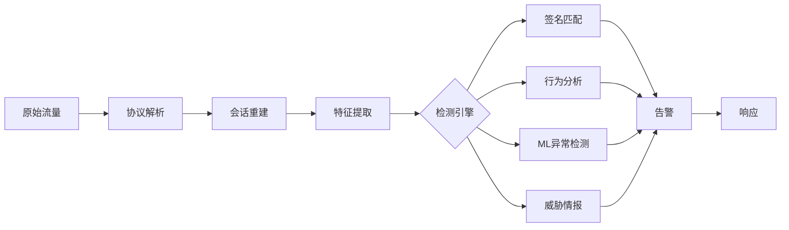
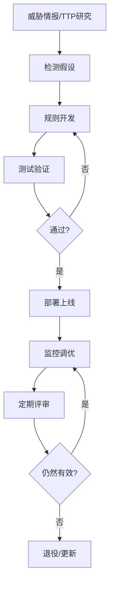

## 十三、安全监控与检测

安全监控与检测是将安全思维落地为工程实践的关键环节。威胁建模告诉你"敌人可能从哪来"，风险评估告诉你"哪些资产最值钱"，而监控与检测系统则是你在阵地上部署的哨兵和雷达——它们 7×24 小时不知疲倦地观察、记录、分析、报警，将抽象的威胁转化为可操作的告警。

本节从日志管理这一基础开始，依次深入 SIEM、EDR、NDR 三大核心平台，再到检测工程、威胁狩猎、告警治理和监控体系度量，最终给出从零搭建监控体系的实战路径。

### 13.1 日志管理：监控体系的基石

没有日志就没有检测。日志是安全监控的"原材料"，日志质量直接决定检测能力的上限。

#### 13.1.1 日志分类与采集范围

一个成熟的监控体系需要采集以下层级的日志：

| 日志层级 | 具体来源 | 关键字段 | 采集方式 |
|---------|---------|---------|---------|
| 操作系统 | Windows事件日志、syslog、auditd | 用户、进程、文件路径、时间戳 | Agent/转发器 |
| 网络设备 | 防火墙、路由器、交换机、VPN | 源IP、目的IP、端口、协议、字节数 | Syslog/NetFlow/SPAN |
| 应用层 | Web服务器、数据库、中间件 | 请求URL、响应码、SQL语句、会话ID | 日志库/AppAgent |
| 身份认证 | AD/LDAP、SSO、MFA | 登录结果、源IP、设备指纹、时间 | API/Syslog |
| 终端 | EDR Agent、DLP | 进程树、文件操作、注册表、网络连接 | 专用Agent |
| 云平台 | AWS CloudTrail、Azure Monitor、GCP Audit | API调用、资源变更、IAM操作 | Cloud API |
| 容器/K8s | kubelet、容器运行时、服务网格 | Pod、镜像、namespace、网络策略 | DaemonSet/Fluentd |

#### 13.1.2 日志质量的黄金标准

日志不是越多越好，而是要满足以下标准：

**结构化**：JSON 或 CEF 格式优于纯文本。结构化日志可以被 SIEM 直接解析和索引，而无需复杂的正则提取。

```json
// 好的日志：结构化，字段完整
{
  "timestamp": "2026-06-25T08:23:45.123Z",
  "event_type": "authentication",
  "action": "login_failed",
  "src_ip": "203.0.113.42",
  "user": "admin@example.com",
  "reason": "invalid_password",
  "attempt_count": 5,
  "user_agent": "Mozilla/5.0...",
  "geo_country": "CN"
}

// 差的日志：纯文本，需要正则解析
Jun 25 08:23:45 web01 sshd[12345]: Failed password for admin from 203.0.113.42 port 22 ssh2
```

**时间同步**：所有日志源必须使用 NTP 同步时间，精度至少到秒级，关键系统到毫秒级。时间不同步会导致关联分析失效——攻击者在一个系统上的操作可能被错误地排在另一个系统操作之前或之后。

**完整性**：日志必须覆盖"谁在什么时间对什么资源做了什么操作"这四个要素。缺少任何一项都会造成盲区。

**保留策略**：合规要求通常为 6-12 个月在线存储，3-7 年归档。实际操作建议：热数据（最近 30 天）存高速存储，温数据（30-180 天）存标准存储，冷数据（180 天以上）归档到对象存储。

#### 13.1.3 日志集中化的架构模式

```text
模式一：Agent-Collector-Storage（最常见）

终端/服务器 → Agent(Filebeat/Fluentd/Winlogbeat)
    ↓
Collector(Kafka/Logstash) ← 解析、过滤、富化
    ↓
Storage(Elasticsearch/Splunk/S3)
    ↓
SIEM/UI(查询、告警、仪表板)

模式二：Agentless Syslog转发

网络设备/传统服务器 → Syslog(UDP/TCP/TLS)
    ↓
Syslog Server(rsyslog/syslog-ng)
    ↓
Collector → Storage → SIEM

模式三：云原生集成

Cloud Service → Cloud Logging(CloudWatch/Cloud Logging)
    ↓
Subscription/Export(Kinesis/Pub-Sub)
    ↓
SIEM/数据湖(Splunk/S3+Athena)
```

**架构选型建议**：

- **日志量 < 10GB/天**：单节点 ELK 或 Wazuh 即可，成本可控
- **日志量 10-100GB/天**：Kafka 缓冲 + 多节点 Elasticsearch，考虑引入索引生命周期管理（ILM）
- **日志量 > 100GB/天**：需要数据湖架构，热数据进 SIEM，全量进 S3/数据湖做离线分析
- **云原生环境**：优先使用云厂商原生日志服务，通过订阅/导出对接 SIEM

### 13.2 SIEM：安全信息与事件管理

SIEM 是安全运营的"大脑"，负责将分散的日志汇聚、关联、分析，转化为安全告警。

#### 13.2.1 SIEM 的核心能力

SIEM 不是简单的日志搜索工具，它具备以下核心能力：

1. **日志聚合**：从数百个数据源收集和标准化日志
2. **实时关联**：将多个独立事件串联成完整的攻击链
3. **规则检测**：基于预定义规则匹配已知攻击模式
4. **行为分析**：通过基线建模发现异常行为（UEBA）
5. **威胁情报**：集成外部情报源，识别已知恶意指标
6. **告警管理**：生成告警并路由到相应人员
7. **合规报告**：生成满足法规要求的审计报告

#### 13.2.2 主流 SIEM 系统深度对比

| 维度 | Splunk Enterprise | Elastic Security | IBM QRadar | Microsoft Sentinel | Wazuh |
|------|------------------|-----------------|------------|-------------------|-------|
| 部署模式 | 自建/SaaS | 自建/云 | 自建 | 纯SaaS | 自建 |
| 数据摄入成本 | 高（按量计费） | 中（开源免费） | 中高 | 中（按量） | 低（开源） |
| 查询语言 | SPL | KQL/Lucene | AQL | KQL | REST API |
| 关联能力 | 强 | 中强 | 强 | 中强 | 中 |
| UEBA | 有（付费） | 有（付费） | 有 | 有（内置） | 有限 |
| 生态 | 最大 | 大 | 中 | 大（Azure生态） | 中 |
| 最佳场景 | 大企业/SOC | 技术团队 | 合规驱动 | 云原生/Azure | 入门/中小 |
| 学习曲线 | 中 | 中高 | 中 | 低 | 中 |

#### 13.2.3 SIEM 关联规则设计

关联规则是 SIEM 的灵魂。好的规则将多个低可信度事件串联成高可信度告警，显著降低误报率。

**单事件规则（基础）**：
```yaml
# 暴力破解检测
rule:
  name: "暴力破解 - 单IP多次登录失败"
  condition:
    source: "authentication"
    action: "login_failed"
    threshold: 10        # 10次失败
    window: "5m"         # 5分钟内
    group_by: "src_ip"   # 按源IP聚合
  severity: "medium"
  action:
    - alert
    - enrich_with_geo
    - check_threat_intel
```

**多事件关联规则（进阶）**：
```yaml
# 横向移动检测：登录失败后的异常进程
rule:
  name: "疑似横向移动 - 登录失败后成功+异常进程"
  stages:
    - name: "暴力破解"
      source: "authentication"
      action: "login_failed"
      threshold: 5
      window: "10m"
      group_by: "src_ip"
    - name: "登录成功"
      source: "authentication"
      action: "login_success"
      correlate_with: "src_ip"  # 与上一阶段的src_ip匹配
      window: "30m"
    - name: "异常进程"
      source: "endpoint"
      process_name: ["powershell.exe", "cmd.exe", "wscript.exe", "psexec.exe"]
      correlate_with: "dst_host"  # 登录目标主机
      window: "5m"
  severity: "high"
  confidence: 0.85
```

**规则设计的核心原则**：

- **低→高聚合**：将多个低危事件聚合成一个高危告警，而非每个低危事件都告警
- **上下文富化**：告警必须附带足够的上下文（用户信息、资产信息、威胁情报命中）
- **抑制窗口**：同一事件在短时间内不重复告警，避免告警风暴
- **可调参数**：阈值、窗口、分组方式都应该可配置，适应不同环境

#### 13.2.4 SIEM 查询语言实战

掌握 SIEM 查询语言是安全分析师的核心技能。以 Splunk SPL 和 Elastic KQL 为例：

**Splunk SPL 常用查询**：

```spl
# 查找某IP的所有活动
index=main src_ip="203.0.113.42" earliest=-24h

# 统计登录失败次数 Top 10
index=main sourcetype=auth action=failed
| stats count by src_ip, user
| sort -count
| head 10

# 检测异常数据传输
index=main sourcetype=firewall
| bin _time span=1h
| stats sum(bytes_out) as total_bytes by src_ip, _time
| where total_bytes > 1073741824  # 超过1GB

# 关联用户行为时间线
index=main (user="jsmith")
| sort _time
| table _time, sourcetype, action, src_ip, dest
```

**Elastic KQL / Elasticsearch 查询**：

```kql
# KQL基础查询
event.action: "login_failed" and source.ip: "203.0.113.42"

# Elasticsearch DSL聚合查询 - 暴力破解检测
{
  "query": {
    "bool": {
      "must": [
        {"term": {"event.action": "login_failed"}},
        {"range": {"@timestamp": {"gte": "now-5m"}}}
      ]
    }
  },
  "aggs": {
    "by_source_ip": {
      "terms": {"field": "source.ip", "size": 10},
      "aggs": {
        "failure_count": {"value_count": {"field": "event.action"}}
      }
    }
  }
}
```

#### 13.2.5 SIEM 部署的常见陷阱

| 陷阱 | 表现 | 解决方案 |
|------|------|---------|
| 日志全收不筛选 | 存储成本爆炸，查询变慢 | 按数据分类分级决定采集范围和保留周期 |
| 规则过多不维护 | 告警疲劳，真正威胁被淹没 | 建立规则生命周期管理，定期评审和退役 |
| 缺少上下文 | 告警只有"IP+事件"，无法判断优先级 | 集成CMDB、威胁情报、资产画像 |
| 只建不运营 | 部署完就没人管了 | 建立SOC运营流程，明确值班和响应SLA |
| 时间不同步 | 关联分析失败，攻击链断裂 | 强制NTP同步，监控时间偏差 |

### 13.3 EDR：端点检测与响应

EDR 系统是终端安全的"黑匣子"，持续记录端点上的所有活动，提供深度可见性和快速响应能力。

#### 13.3.1 EDR 的工作原理

EDR 的核心原理是"记录一切，按需分析"：

```text
端点活动
  ↓
Agent（轻量级内核驱动/用户态Hook）
  ├── 进程创建/终止
  ├── 文件读写/删除/重命名
  ├── 注册表操作（Windows）
  ├── 网络连接（TCP/UDP/DNS）
  ├── DLL加载
  ├── 命令行参数
  ├── 用户登录/注销
  └── 外设接入（USB等）
  ↓
本地缓存 + 云端上传
  ↓
检测引擎
  ├── 签名匹配（已知恶意）
  ├── 行为分析（可疑行为序列）
  ├── 机器学习（异常检测）
  └── 威胁情报匹配
  ↓
告警 + 响应动作
  ├── 进程终止
  ├── 文件隔离
  ├── 网络隔离（端点隔离）
  ├── 脚本执行
  └── 人工调查
```

#### 13.3.2 EDR 检测能力分层

EDR 的检测能力不是一蹴而就的，而是分层递进的：

**第一层：已知威胁检测**
- 文件哈希匹配（对比恶意样本库）
- YARA 规则匹配（模式匹配恶意特征）
- IOC 匹配（IP、域名、URL 黑名单）

**第二层：行为检测**
- 进程注入检测（CreateRemoteThread、APC注入）
- 持久化检测（注册表自启动、计划任务、WMI事件订阅）
- 凭证窃取检测（LSASS 访问、Mimikatz 特征）
- 勒索软件行为（大量文件加密、删除影子副本）

**第三层：异常检测**
- 进程行为基线偏离（异常父子进程关系）
- 网络连接异常（DNS隧道、异常外联）
- 用户行为异常（非工作时间操作、异常权限使用）

**第四层：高级威胁检测**
- 文件无恶意（Living off the Land）攻击
- 内存驻留恶意软件
- 供应链攻击
- 零日漏洞利用

#### 13.3.3 EDR 选型关键指标

| 指标 | 说明 | 建议值 |
|------|------|--------|
| 检测率 | 对已知和未知威胁的检出比例 | > 95%（已知），> 80%（未知） |
| 误报率 | 正常行为被误判为威胁的比例 | < 5% |
| 性能影响 | Agent对终端CPU/内存的占用 | CPU < 3%，内存 < 100MB |
| 响应时间 | 从检测到告警的延迟 | < 1分钟 |
| 遥测覆盖 | 能观察到的端点活动类型 | 覆盖进程/文件/网络/注册表 |
| 响应能力 | 支持的远程响应操作 | 隔离、终止、脚本执行 |
| 部署复杂度 | 安装配置的难度 | 无重启安装，策略统一下发 |

#### 13.3.4 EDR 检测规则示例

```yaml
# 检测LSASS内存访问（凭证窃取）
rule:
  name: "Credential Dumping - LSASS Memory Access"
  description: "检测对LSASS进程内存的可疑访问，可能是Mimikatz等工具"
  severity: critical
  category: credential_access
  mitre_attack: T1003.001
  condition:
    - process.access.target_name: "lsass.exe"
    - process.access.access_mask: "0x1010" or "0x1410"  # PROCESS_VM_READ
    - NOT process.name: ["csrss.exe", "wininit.exe", "smss.exe"]
  action:
    - alert
    - terminate_process
    - isolate_endpoint
```

```yaml
# 检测可疑的PowerShell执行
rule:
  name: "Suspicious PowerShell Execution"
  severity: high
  category: execution
  mitre_attack: T1059.001
  condition:
    - process.name: "powershell.exe"
    - process.command_line contains any:
      - "-enc"          # 编码命令
      - "bypass"        # 绕过执行策略
      - "downloadstring" # 远程下载
      - "invoke-expression"
      - "iex"
      - "hidden"        # 隐藏窗口
    - NOT process.parent.name: ["sccm.exe", "ansible.exe", "puppet.exe"]
```

### 13.4 NDR：网络检测与响应

NDR 系统是网络层面的"X光机"，通过分析网络流量发现隐藏的威胁。

#### 13.4.1 NDR 的技术原理

NDR 不是传统的入侵检测系统（IDS），它采用了更先进的分析方法：

**流量采集方式**：
- **镜像端口（SPAN/TAP）**：在网络交换机上配置端口镜像，复制流量到 NDR 探针
- **NetFlow/IPFIX**：路由器和交换机导出的流量元数据（不含载荷）
- **Packet Broker**：专用的流量汇聚和分发设备，适合大型网络

**分析引擎**：



#### 13.4.2 NDR 检测的典型场景

**DNS 隧道检测**：
DNS 隧道是数据外泄的隐蔽通道。NDR 通过以下特征识别：
- 单个域名的 DNS 查询频率异常高（正常用户每分钟 1-5 次，隧道可达 100+ 次）
- DNS 响应数据长度异常（正常域名解析响应 < 200 字节，隧道 > 500 字节）
- 子域名编码异常（长随机字符串，如 `aGVsbG8gd29ybGQ.evil.com`）
- TXT 记录查询占比异常

**横向移动检测**：
- SMB/RPC 连接模式异常（单主机短时间内连接大量内网主机）
- PsExec 类工具的特征（命名管道 `\PSEXESVC`、服务创建事件）
- RDP 跳板行为（RDP 连接到多台内部主机）
- WMI 远程执行的 DCOM 流量

**数据外泄检测**：
- 异常的出站数据量（超过基线的 3σ）
- 非工作时间的大量数据传输
- 连接到已知恶意 IP/域名
- 非常规协议的数据传输（DNS、ICMP 隧道）

**加密流量分析**：
即使流量被 TLS 加密，NDR 仍然可以通过元数据进行分析：
- JA3/JA3S 指纹（TLS 客户端/服务器握手特征，可识别恶意工具）
- 证书特征（自签名、过期、异常签发者）
- 连接模式（持续长连接、定期心跳）
- 数据量模式（定期的小数据包 = C2 信标）

#### 13.4.3 NDR 部署最佳实践

```text
                    ┌──────────────┐
                    │  互联网出口   │
                    └──────┬───────┘
                           │
                    ┌──────┴───────┐
                    │  防火墙/NGFW  │
                    └──────┬───────┘
                           │
              ┌────────────┼────────────┐
              │            │            │
        ┌─────┴─────┐ ┌───┴────┐ ┌────┴─────┐
        │  DMZ 区域  │ │ 核心交换│ │ 服务器区  │
        │  (探针A)   │ │(探针B) │ │  (探针C)  │
        └───────────┘ └────────┘ └──────────┘
                           │
                    ┌──────┴───────┐
                    │  NDR 管理平台 │
                    │  (集中分析)   │
                    └──────────────┘
```

**部署要点**：

1. **探针位置**：核心交换机、互联网出口、数据中心边界、关键业务网段
2. **镜像配置**：双向流量（入站+出站），确保能看到完整的会话
3. **基线建立**：部署后先学习 2-4 周，建立正常流量基线，再开启告警
4. **与 SIEM 联动**：NDR 告警发送到 SIEM 进行关联分析，不要孤立运营

### 13.5 XDR：统一检测与响应

XDR（Extended Detection and Response）是 SIEM + EDR + NDR 的融合演进，打破数据孤岛，提供跨层级的统一检测和响应。

#### 13.5.1 XDR 的核心价值

传统架构中，SIEM、EDR、NDR 各自独立运营，存在以下问题：

| 问题 | 传统架构 | XDR 解决方案 |
|------|---------|-------------|
| 数据孤岛 | EDR告警和NDR告警在不同系统 | 统一数据湖，跨源关联 |
| 误报率高 | 单维度判断，缺乏上下文 | 多维度交叉验证 |
| 响应碎片化 | 需要在多个系统中操作 | 统一编排和自动化 |
| 运维复杂 | 维护多个平台的规则和策略 | 统一规则管理 |

#### 13.5.2 XDR 检测场景示例

以一个完整的攻击链为例，展示 XDR 如何跨层级关联检测：

```text
攻击链：钓鱼邮件 → 恶意文档 → PowerShell下载 → C2通信 → 横向移动 → 数据外泄

邮件网关层：检测到可疑附件（恶意文档）
    ↓ 关联
终端层（EDR）：Word进程启动PowerShell（进程链异常）
    ↓ 关联
终端层（EDR）：PowerShell执行编码命令下载文件
    ↓ 关联
网络层（NDR）：检测到连接已知C2域名
    ↓ 关联
网络层（NDR）：内部主机之间的异常SMB连接
    ↓ 关联
终端层（EDR）：凭据提取工具执行
    ↓ 关联
网络层（NDR）：大量数据通过DNS隧道外泄

XDR 输出：高置信度告警 "APT攻击链 - 完整攻击生命周期"
置信度：95% | 影响范围：3台主机 | 建议动作：全网隔离+取证
```

### 13.6 检测工程

检测工程是将安全检测从"手工作坊"提升为"工业化生产"的系统化方法论。

#### 13.6.1 检测开发流程



#### 13.6.2 MITRE ATT&CK 映射

所有检测规则都应映射到 MITRE ATT&CK 框架，确保覆盖的全面性：

```yaml
# 检测覆盖度自检示例
coverage_matrix:
  initial_access:
    T1566_phishing: "已覆盖 - 邮件网关规则"
    T1190_exploit_public_app: "已覆盖 - WAF规则"
    T1078_valid_accounts: "部分覆盖 - 需要加强异常登录检测"
  execution:
    T1059_command_script: "已覆盖 - EDR进程监控"
    T1053_scheduled_task: "需要加强 - 当前仅监控创建，未监控修改"
  persistence:
    T1547_boot_autostart: "已覆盖 - 注册表监控"
    T1053_scheduled_task: "同上"
  lateral_movement:
    T1021_remote_services: "部分覆盖 - 缺少WinRM监控"
  exfiltration:
    T1048_exfiltration_over_alternative: "需要加强 - DNS隧道检测规则"
```

**ATT&CK 覆盖度评审流程**：

1. 从 ATT&CK Navigator 导出当前覆盖热力图
2. 识别高风险空白区域（高概率 × 高影响的 TTP）
3. 优先补充这些区域的检测规则
4. 每季度更新一次覆盖度评估

#### 13.6.3 检测即代码（Detection as Code）

将检测规则纳入版本控制和 CI/CD 流程：

```yaml
# 检测规则的CI/CD流程
detection_pipeline:
  source:
    - detection_rules/     # 规则仓库（Git）
    - sigma_rules/         # Sigma格式通用规则
  
  validate:
    - schema_check:        # 格式校验
        tool: "sigma-cli"
    - syntax_test:         # 语法测试
        tool: "elasticsearch-test"
    - false_positive_test: # 误报测试
        test_data: "benign_logs/"
    - coverage_check:      # 覆盖度检查
        framework: "mitre_attack"
  
  deploy:
    staging:               # 先在测试环境验证
      auto: true
      duration: "48h"
      metrics: ["alert_count", "false_positive_rate"]
    production:            # 通过后上线
      approval: true       # 需要人工审批
```

**Sigma 规则示例**（通用检测规则格式，可转换到任意 SIEM）：

```yaml
title: Suspicious PowerShell Download Cradle
id: 8b123456-7890-abcd-ef01-234567890abc
status: stable
description: Detects PowerShell download cradles commonly used by attackers
references:
  - https://attack.mitre.org/techniques/T1059/001/
author: Security Team
date: 2026/06/25
modified: 2026/06/25
tags:
  - attack.execution
  - attack.t1059.001
logsource:
  category: process_creation
  product: windows
detection:
  selection:
    Image|endswith: '\powershell.exe'
    CommandLine|contains:
      - 'downloadstring'
      - 'downloadfile'
      - 'invoke-webrequest'
      - 'net.webclient'
      - 'bitstransfer'
  filter:
    ParentImage|endswith:
      - '\sccm.exe'
      - '\ansible-runner.exe'
  condition: selection and not filter
falsepositives:
  - Legitimate software deployment tools
level: high
```

### 13.7 威胁狩猎（Threat Hunting）

威胁狩猎是主动搜索隐藏威胁的活动，不依赖告警，而是基于假设驱动的主动调查。

#### 13.7.1 威胁狩猎 vs 被动监控

| 维度 | 被动监控 | 威胁狩猎 |
|------|---------|---------|
| 驱动方式 | 规则/告警驱动 | 假设驱动 |
| 时机 | 实时 | 定期/触发式 |
| 目标 | 已知模式 | 未知威胁 |
| 方法 | 自动化检测 | 人工分析+自动化辅助 |
| 产出 | 告警 | 洞察+新检测规则 |

#### 13.7.2 威胁狩猎的假设驱动方法

**狩猎假设的来源**：

1. **威胁情报**：收到新的 IOC 或 TTP 情报 → 假设"攻击者可能在使用这个技术"
2. **MITRE ATT&CK**：覆盖度空白 → 假设"这个技术可能被利用而我们没检测到"
3. **行业事件**：同行遭受攻击 → 假设"同样的攻击可能针对我们"
4. **内部异常**：奇怪但未触发告警的事件 → 假设"这可能是攻击的一部分"

**狩猎实战示例：检测隐蔽的持久化**

```text
假设：攻击者可能通过WMI事件订阅实现持久化

步骤1：查询所有WMI事件订阅
  - CommandLine: Get-WMIObject -Namespace root\Subscription -Class __EventFilter
  - CommandLine: Get-WMIObject -Namespace root\Subscription -Class __EventConsumer

步骤2：分析结果
  - 检查是否有非标准的事件订阅
  - 检查消费者中是否有可疑命令
  - 对比生产环境基线

步骤3：深挖可疑项
  - 检查创建时间（异常时间创建的更可疑）
  - 检查创建者（非管理员账户创建的WMI订阅）
  - 检查触发条件（什么事件触发了什么动作）

步骤4：验证和响应
  - 在沙箱中模拟触发条件，观察行为
  - 确认恶意 → 清除持久化 → 扩展排查范围
  - 生成新的检测规则，防止同类攻击
```

#### 13.7.3 威胁狩猎工具链

| 工具 | 用途 | 适用阶段 |
|------|------|---------|
| Velociraptor | 终端取证和搜索 | 数据收集 |
| Sysmon | 细粒度端点日志 | 数据收集 |
| RITA | 网络流量分析（C2检测） | 数据分析 |
| Jupyter Notebook | 自定义数据分析 | 数据分析 |
| ATT&CK Navigator | 覆盖度可视化 | 计划阶段 |
| YARA | 恶意文件匹配 | 检测 |
| osquery | SQL查询终端状态 | 数据收集 |

### 13.8 告警治理与降噪

告警疲劳是安全运营的头号杀手。当分析师每天面对数千条告警时，真正的威胁会被淹没在噪声中。

#### 13.8.1 告警疲劳的数据

根据 SANS 2024 年度 SOC 调查报告：
- 平均每个 SOC 每天收到 11,000+ 条告警
- 其中 45% 是误报或低价值告警
- 分析师平均只调查了 50% 的告警
- 32% 的真实事件因告警疲劳而被忽略

#### 13.8.2 告警分层与优先级

```text
告警优先级矩阵：

              影响资产关键程度
              低      中      高      核心
         ┌───────┬───────┬───────┬───────┐
    高   │  P3   │  P2   │  P1   │  P0   │  威胁
确       ├───────┼───────┼───────┼───────┤  可信度
信       │  P4   │  P3   │  P2   │  P1   │
度       ├───────┼───────┼───────┼───────┤
    低   │忽略/P5│  P4   │  P3   │  P2   │
         └───────┴───────┴───────┴───────┘

P0：立即响应（15分钟内），自动触发应急预案
P1：紧急调查（1小时内），值班分析师立即处理
P2：优先处理（4小时内），工作时间处理
P3：常规处理（24小时内），批量处理
P4：低优先级（72小时内），自动化处理或归档
```

**威胁可信度评估因子**：

| 因子 | 高可信度 | 低可信度 |
|------|---------|---------|
| 告警来源 | EDR行为检测 | 单一日志规则 |
| 威胁情报 | 命中多个情报源 | 单一情报源且无更新 |
| 资产上下文 | 核心服务器/域控 | 测试环境 |
| 用户上下文 | 特权账户/高管 | 普通用户 |
| 关联事件 | 多系统关联告警 | 孤立事件 |
| 时间上下文 | 非工作时间 | 工作时间正常操作 |

#### 13.8.3 降噪策略

**策略一：白名单机制**
```yaml
# 基于上下文的智能白名单
whitelist_rules:
  - name: "已知安全扫描器"
    condition:
      src_ip: ["10.0.0.100", "10.0.0.101"]  # 漏扫IP
      event_type: "vulnerability_scan"
    action: suppress
    expire: "90d"  # 定期审查

  - name: "自动化运维工具"
    condition:
      process.parent: ["ansible.exe", "puppet.exe", "terraform.exe"]
      user: "svc_automation"
    action: suppress_and_log  # 仍然记录，但不告警

  - name: "已知误报模式"
    condition:
      rule_id: "edr-powershell-001"
      src_host: ["dev-*", "test-*"]  # 开发测试环境
    action: downgrade  # 降低优先级而非完全抑制
```

**策略二：告警聚合**
```yaml
# 将同类告警聚合成一个事件
aggregation:
  - name: "暴力破解聚合"
    group_by: ["src_ip", "dst_service"]
    window: "15m"
    condition: "count >= threshold"
    output: "single_alert_with_count"
    suppress_individual: true  # 抑制单条告警

  - name: "扫描行为聚合"
    group_by: ["src_ip"]
    window: "1h"
    condition: "unique_dst_ports >= 20"
    output: "port_scan_summary"
```

**策略三：自动处置低风险告警**
```yaml
# 低风险告警自动化处置
auto_triage:
  - condition:
      severity: "low"
      confidence: "< 0.3"
      no_threat_intel_hit: true
    action:
      - enrich_with_context
      - auto_close_with_note
      - log_for_audit

  - condition:
      rule: "known_false_positive_pattern"
    action:
      - auto_close
      - update_whitelist
```

### 13.9 安全监控体系度量

"无法度量就无法改进"——安全监控体系需要持续度量和优化。

#### 13.9.1 核心指标

| 指标 | 定义 | 目标值 | 意义 |
|------|------|--------|------|
| MTTD（平均检测时间） | 从攻击发生到被检测到的时间 | < 1小时 | 检测能力的直接体现 |
| MTTR（平均响应时间） | 从检测到完成响应的时间 | < 4小时 | 响应能力的直接体现 |
| 误报率 | 误报告警占总告警的比例 | < 20% | 告警质量，影响分析师效率 |
| 漏报率 | 未检测到的真实攻击比例 | < 10% | 检测覆盖度 |
| ATT&CK 覆盖率 | 已检测的TTP占总TTP的比例 | > 60% | 检测全面性 |
| 告警调查率 | 被调查的告警占总告警的比例 | > 80% | SOC运营效率 |
| 规则健康度 | 活跃且有效的规则占比 | > 85% | 规则维护质量 |
| 数据源完整度 | 已接入的日志源占应接入的比例 | > 95% | 可见性 |

#### 13.9.2 度量仪表板设计

```text
安全监控健康度仪表板：

┌─────────────────────────────────────────────────────────┐
│  MTTD: 23min    MTTR: 2.1h    误报率: 15%    漏报率: 7% │
├─────────────────────────────────────────────────────────┤
│                                                         │
│  ATT&CK覆盖热力图          告警趋势图（30天）            │
│  ████████████░░░░░         ▁▂▃▅▆▇█▇▆▅                  │
│  覆盖率: 67%               趋势: ↓ 下降                  │
│                                                         │
├─────────────────────────────────────────────────────────┤
│  Top 5 告警类型           Top 5 未覆盖TTP               │
│  1. 暴力破解 (2340)       1. T1072 软件部署              │
│  2. 可疑PowerShell (890)  2. T1556 认证修改              │
│  3. 异常登录 (670)        3. T1218 系统二进制代理         │
│  4. 恶意URL (450)         4. T1562 防御规避              │
│  5. 数据外泄 (120)        5. T1486 数据加密影响           │
│                                                         │
├─────────────────────────────────────────────────────────┤
│  数据源状态：在线 48/50 (96%)    离线: FW-03, IDS-07     │
│  规则状态：活跃 342 | 过期 28 | 禁用 15 | 总计 385        │
└─────────────────────────────────────────────────────────┘
```

### 13.10 云环境安全监控

云环境的安全监控与传统环境有显著差异——没有物理网络可以镜像，IAM 是新的边界，API 调用是新的审计对象。

#### 13.10.1 云安全监控的核心数据源

| 云平台 | 审计日志 | 网络监控 | 身份监控 | 配置审计 |
|--------|---------|---------|---------|---------|
| AWS | CloudTrail | VPC Flow Logs + GuardDuty | IAM Access Analyzer | Config + Security Hub |
| Azure | Activity Log + Diagnostic Logs | NSG Flow Logs + Traffic Analytics | Entra ID Sign-in Logs | Policy + Defender for Cloud |
| GCP | Cloud Audit Logs | VPC Flow Logs | Cloud Identity Logs | Security Command Center |

#### 13.10.2 云环境特有的检测场景

**IAM 异常检测**：
- 异常的 AssumeRole 调用（跨账号、跨区域）
- 权限提升（从普通用户到管理员）
- 长期凭证使用（AccessKey 超过 90 天未轮换）
- 非预期的 API 调用（S3 bucket 策略变更、安全组修改）

**容器安全监控**：
- 异常镜像拉取（非白名单 registry）
- 特权容器启动
- 容器内异常进程（反向Shell、挖矿）
- Kubernetes RBAC 变更
- NetworkPolicy 绕过

**Serverless 安全监控**：
- Lambda 函数的异常调用模式
- 函数权限变更
- 冷启动时间异常（可能是恶意代码注入）
- 函数间调用链异常

### 13.11 从零搭建安全监控体系

以下是从零开始搭建安全监控体系的实战路径，适合中小型企业参考。

#### 13.11.1 阶段一：基础可见性（第1-2周）

**目标**：能看到发生了什么

```bash
# 部署 Wazuh（开源 SIEM + EDR 一体化）
# 1. 使用 Docker Compose 快速部署
cat > docker-compose.yml << 'EOF'
version: '3.8'
services:
  wazuh:
    image: wazuh/wazuh-manager:4.8.0
    ports:
      - "1514:1514/udp"   # Agent日志
      - "1515:1515"       # Agent注册
      - "55000:55000"     # API
    volumes:
      - wazuh_data:/var/ossec/data

  elasticsearch:
    image: elasticsearch:7.17.16
    environment:
      - discovery.type=single-node
      - "ES_JAVA_OPTS=-Xms2g -Xmx2g"
    volumes:
      - es_data:/usr/share/elasticsearch/data

  kibana:
    image: kibana:7.17.16
    ports:
      - "5601:5601"
    environment:
      - ELASTICSEARCH_HOSTS=http://elasticsearch:9200
EOF

# 2. 部署 Agent 到关键服务器
curl -so wazuh-agent.deb https://packages.wazuh.com/4.x/apt/pool/main/w/wazuh-agent/wazuh-agent_4.8.0-1_amd64.deb
sudo WAZUH_MANAGER='10.0.0.10' dpkg -i wazuh-agent.deb
sudo systemctl enable wazuh-agent
sudo systemctl start wazuh-agent
```

**接入的日志源**：
1. 服务器操作系统日志（syslog、Windows事件日志）
2. 防火墙日志
3. Web 服务器访问日志
4. SSH/RDP 登录日志

#### 13.11.2 阶段二：检测能力（第3-4周）

**目标**：能检测常见攻击

- 启用 Wazuh 预置规则（4000+ 条规则覆盖常见攻击）
- 配置 Sysmon 增强 Windows 端点可见性
- 接入威胁情报源（OTX、AbuseIPDB）
- 配置基本的告警通知

```xml
<!-- Sysmon 配置：增强进程和网络监控 -->
<Sysmon schemaversion="4.90">
  <HashAlgorithms>md5,sha256,IMPHASH</HashAlgorithms>
  <EventFiltering>
    <ProcessCreate onmatch="include">
      <ParentImage condition="contains">powershell</ParentImage>
      <ParentImage condition="contains">cmd</ParentImage>
      <CommandLine condition="contains">-enc</CommandLine>
      <CommandLine condition="contains">bypass</CommandLine>
    </ProcessCreate>
    <NetworkConnect onmatch="include">
      <DestinationPort condition="is">4444</DestinationPort>
      <DestinationPort condition="is">5555</DestinationPort>
    </NetworkConnect>
  </EventFiltering>
</Sysmon>
```

#### 13.11.3 阶段三：关联分析（第5-8周）

**目标**：能发现复杂攻击链

- 编写自定义关联规则（基于前文的关联规则设计方法）
- 集成资产管理系统（CMDB），为告警添加资产上下文
- 建立基线，开启异常检测
- 对接 SOAR 工具，实现基本的自动化响应

#### 13.11.4 阶段四：持续优化（持续进行）

**目标**：不断降低误报、提高检测覆盖

- 建立规则评审机制（每月评审告警 Top 20，优化或退役低效规则）
- 开展威胁狩猎（每季度至少一次假设驱动的狩猎）
- 持续扩展数据源（接入云平台日志、容器日志、数据库审计日志）
- 度量和改进（跟踪 MTTD、MTTR、误报率等指标）

### 13.12 常见误区与纠正

| 误区 | 实际情况 | 正确做法 |
|------|---------|---------|
| "买了SIEM就安全了" | 工具只是载体，规则和运营才是核心 | 70%预算用于人员和流程，30%用于工具 |
| "告警越多越安全" | 告警疲劳会导致真实威胁被忽略 | 精心调优规则，宁缺毋滥 |
| "只监控边界就够了" | 内部横向移动是APT的标配 | 零信任架构，内部也需要监控 |
| "日志全存最安全" | 存储成本爆炸，查询变慢 | 分级存储，热/温/冷分层 |
| "威胁情报订阅了就行" | IOC的半衰期很短，需要持续更新 | 自动化集成+人工研判+定期更新 |
| "开源方案不如商业产品" | Wazuh+ELK对中小场景足够 | 根据实际需求选型，不盲目追求高端 |
| "安全监控是一次性项目" | 威胁持续演进，监控需要持续迭代 | 建立持续改进机制 |

### 13.13 本节小结

安全监控与检测是安全运营的技术核心，其本质是将"看不见的威胁"转化为"可操作的告警"。本节覆盖了从日志管理到 SIEM、EDR、NDR、XDR 的完整技术栈，以及检测工程、威胁狩猎、告警治理等关键运营能力。

**关键要点**：

1. **日志是基础**：没有好的日志就没有好的检测，日志质量和采集范围直接决定监控上限
2. **分层防御**：SIEM（全局关联）+ EDR（端点深度）+ NDR（网络广度）三层互补
3. **检测工程化**：将检测规则纳入版本控制和 CI/CD，确保质量和可维护性
4. **主动狩猎**：不依赖告警，基于假设主动搜索隐藏威胁
5. **持续优化**：通过度量驱动改进，持续降低误报、提高覆盖
6. **告警治理**：对抗告警疲劳是长期战役，需要白名单、聚合、自动化多管齐下

安全监控不是部署完就结束的项目，而是一个需要持续投入和优化的运营过程。最好的监控体系不是告警最多的，而是能让分析师在正确的时间看到正确的信息并做出正确判断的。
