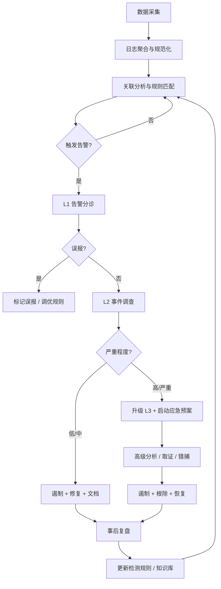
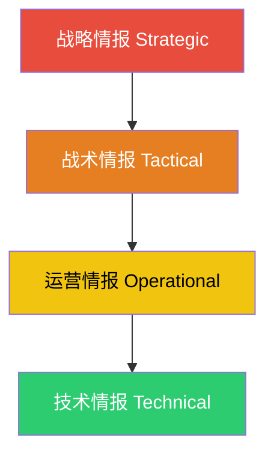
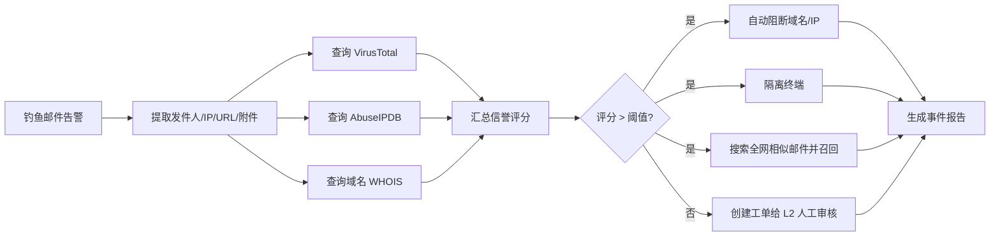
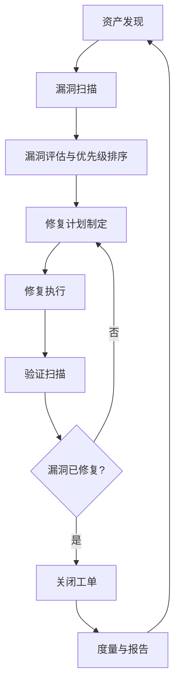
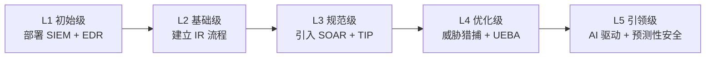

## 十四、安全运营最佳实践

安全运营（Security Operations）是将安全思维从"理论分析"转化为"持续防护"的关键环节。如果说威胁建模是"想清楚敌人怎么打"，安全评估是"看清自己的弱点在哪"，那么安全运营就是"建立一套机制，让组织在真实攻击面前始终处于戒备状态"。本节从 SOC 建设、威胁情报、安全编排与自动化、漏洞管理、事件响应、度量体系、成熟度模型七个维度，系统阐述安全运营的方法论与实操框架。

### 14.1 安全运营中心（SOC）建设

安全运营中心（Security Operations Center, SOC）是组织安全能力的核心枢纽。一个成熟的 SOC 不是"买了 SIEM 加上几个人值班"，而是组织架构、流程制度、技术平台三位一体的系统工程。

#### 14.1.1 SOC 组织架构

```text
SOC 总监 / 经理
├── L1 监控分析师（Tier 1 — 监控与初步分类）
│   ├── 7×24 告警监控
│   ├── 告警初步分类与优先级判定
│   ├── 误报过滤与工单创建
│   └── 标准化处置流程执行
├── L2 调查分析师（Tier 2 — 深入调查与响应）
│   ├── 告警关联分析
│   ├── 事件调查与取证
│   ├── 遏制措施实施
│   └── 威胁情报应用
├── L3 威胁专家（Tier 3 — 高级威胁猎捕）
│   ├── 高级持续威胁（APT）分析
│   ├── 恶意软件逆向工程
│   ├── 威胁猎捕（Threat Hunting）
│   └── 新型攻击向量研究
├── 威胁情报团队（Threat Intelligence Team）
│   ├── 多源情报收集与聚合
│   ├── 情报分析与上下文关联
│   ├── 情报产品生产（IOB/IOC/TTP 报告）
│   └── 行业情报共享（ISAC/ISAO）
└── 安全工程团队（Security Engineering Team）
    ├── 安全工具平台运维（SIEM/EDR/SOAR）
    ├── 检测规则与用例开发
    ├── 自动化剧本编写
    └── 平台性能优化与扩展
```

**L1/L2/L3 的职责边界与协作**：

| 层级 | 核心能力 | 典型任务 | 耗时目标 |
|------|---------|---------|---------|
| L1 | 监控、分类、标准流程执行 | 日常告警分诊、误报过滤、工单创建 | 每条告警 < 15 分钟 |
| L2 | 调查、关联、应急响应 | 事件调查、遏制措施、取证分析 | 事件处置 < 4 小时 |
| L3 | 高级分析、猎捕、逆向 | APT 分析、恶意软件样本分析、新威胁研究 | 深度分析 1-7 天 |

**实际建设中的关键决策**：

- **自建 vs. 外包（MSSP/MDR）**：中小型企业通常没有预算维持 7×24 自建 SOC，可选择托管安全服务提供商（MSSP）或托管检测与响应（MDR）。自建 SOC 的年运营成本通常在 200-500 万美元（包含人力、工具、培训），MSSP 的年费通常在 30-100 万美元之间，适合 500 人以下的组织。
- **Follow-the-Sun 模式**：跨国企业可在不同地理区域设立 SOC 节点，利用时区差异实现 7×24 覆盖而无需任何单点值班。
- **混合模式**：核心能力自建（L3、情报、工程），L1 监控外包，是大中型企业的常见选择。

#### 14.1.2 SOC 技术栈

一个成熟的 SOC 通常由以下技术组件构成：

| 组件 | 功能 | 典型产品 |
|------|------|---------|
| SIEM | 日志聚合、关联分析、告警生成 | Splunk、Elastic SIEM、IBM QRadar、Microsoft Sentinel |
| EDR | 终端检测与响应 | CrowdStrike Falcon、SentinelOne、Microsoft Defender for Endpoint |
| NDR | 网络流量检测与响应 | Darktrace、ExtraHop、Vectra AI |
| SOAR | 安全编排、自动化与响应 | Palo Alto XSOAR、Splunk SOAR、Tines |
| TIP | 威胁情报平台 | MISP、OpenCTI、ThreatConnect |
| 案例管理 | 事件追踪与协作 | TheHive、ServiceNow SecOps、Jira |
| 资产管理 | CMDB、资产发现与风险画像 | Axonius、JupiterOne |

**SIEM 是 SOC 的中枢神经系统**。所有安全遥测数据——终端日志、网络流量、云审计日志、身份认证日志、应用日志——最终汇聚到 SIEM 进行关联分析。SIEM 的价值不在于收集日志（这很廉价），而在于关联引擎——将看似独立的事件串联成完整的攻击链。例如：单一的 DNS 查询到可疑域名不会触发告警，但如果同一主机在 30 分钟内出现了 DNS 查询可疑域名 → PowerShell 异常执行 → 外联 C2 服务器 → 新建定时任务，关联引擎会将这四个事件合并为一条高优先级告警。

#### 14.1.3 SOC 运营流程



**关键流程节点详解**：

**（1）数据采集与规范化**

数据源的覆盖面直接决定了 SOC 的检测能力。必须采集的数据源包括：

- **终端遥测**：进程创建、文件写入、注册表修改、网络连接（通过 EDR Agent）
- **网络流量**：NetFlow/PCAP、DNS 查询日志、HTTP 代理日志、防火墙日志
- **身份认证**：Active Directory 事件日志、SSO 平台日志、MFA 验证日志
- **云平台**：AWS CloudTrail、Azure Activity Log、GCP Audit Log
- **应用层**：Web 应用访问日志、API 网关日志、数据库审计日志
- **邮件安全**：邮件网关日志、SPF/DKIM/DMARC 验证结果

数据规范化使用通用事件格式（如 CEF、OCSF、ECS），确保不同来源的日志能够被统一查询和关联。

**（2）告警分诊与误报管理**

告警疲劳（Alert Fatigue）是 SOC 最大的敌人。如果每天产生 10,000 条告警而其中 95% 是误报，分析师很快会丧失对告警的敏感度。解决方法：

- 建立告警置信度评分机制（基于规则匹配度、上下文丰富度、历史误报率）
- 持续优化检测规则，定期回顾 Top 20 高频误报规则
- 设置告警抑制策略（同一攻击源 5 分钟内重复告警合并为一条）
- 引入用户与实体行为分析（UEBA）降低基于规则的误报

**（3）事件升级与应急预案**

定义清晰的升级矩阵，避免"该升级时犹豫、不该升级时恐慌"：

| 严重程度 | 判定条件 | 响应时间要求 | 升级目标 |
|---------|---------|------------|---------|
| P1-严重 | 数据泄露确认、勒索软件爆发、核心业务中断 | 15 分钟内响应 | L3 + CISO + 法务 + 公关 |
| P2-高 | 内部主机失陷、特权账户异常、APT 迹象 | 1 小时内响应 | L3 + SOC 经理 |
| P3-中 | 可疑外联、钓鱼邮件成功投递、异常登录 | 4 小时内响应 | L2 |
| P4-低 | 策略违规、低置信度告警 | 下一工作日 | L1 |

### 14.2 威胁情报运营

威胁情报（Threat Intelligence）是将安全运营从"被动响应"提升到"主动防御"的核心驱动力。没有威胁情报的 SOC 就像没有雷达的防空系统——只能看到已经落在头上的炸弹。

#### 14.2.1 威胁情报的金字塔模型



**四个层级的详细解析**：

| 层级 | 受众 | 内容 | 时效性 | 实例 |
|------|------|------|--------|------|
| 战略情报 | CISO、高管、董事会 | 威胁趋势、行业风险画像、地缘政治影响 | 季度/年度 | "金融行业面临供应链攻击趋势上升 40%" |
| 战术情报 | 安全架构师、SOC 经理 | 攻击者的 TTP（战术、技术和程序） | 周/月 | "APT29 最近偏好利用 OAuth 令牌刷新机制维持持久化" |
| 运营情报 | 事件响应人员 | 即将发生的攻击信息、活动目标 | 天/周 | "某黑客组织计划在 Q4 对本行业发起钓鱼攻击" |
| 技术情报 | L1/L2 分析师、自动化系统 | IOC（入侵指标）、恶意软件签名、YARA 规则 | 实时/小时 | "恶意域名 evil-c2.example.com 活跃中" |

#### 14.2.2 威胁情报来源与集成

**开源情报（OSINT）来源**：

| 来源 | 类型 | 访问方式 | 适合场景 |
|------|------|---------|---------|
| AlienVault OTX | IOC 社区共享 | REST API / Web | 快速查询 IP/域名/哈希信誉 |
| MISP | 情报共享平台 | REST API / Web | 组织内部情报管理与行业共享 |
| VirusTotal | 恶意样本分析 | REST API | 文件/URL/域名/IP 多引擎扫描结果 |
| AbuseIPDB | 恶意 IP 数据库 | REST API | IP 信誉查询与社区举报 |
| URLhaus | 恶意 URL 数据库 | REST API / CSV | URL 类 IOC 批量查询 |
| Shodan/Censys | 互联网资产暴露面 | REST API | 暴露面监控、漏洞影响评估 |
| GreyNoise | 互联网背景噪声分析 | REST API | 区分针对性攻击与随机扫描 |

**商业情报平台**：Recorded Future、Mandiant Advantage、CrowdStrike Falcon Intelligence、Flashpoint 等提供更深入的分析报告、暗网监控和定制化情报订阅。

**情报集成的工作流**：

1. **收集（Collection）**：从多个来源自动拉取 IOC 和 TTP 信息
2. **规范化（Normalization）**：使用 STIX 2.1 格式统一表示不同来源的情报
3. **丰富（Enrichment）**：将 IOC 关联到内部遥测数据（"这个 IP 在我们的防火墙日志中出现过吗？"）
4. **生产（Production）**：生成可操作的情报产品（检测规则、阻断列表、报告）
5. **分发（Dissemination）**：将情报推送到 SIEM、EDR、防火墙等执行层
6. **反馈（Feedback）**：收集消费方反馈，持续优化情报质量

#### 14.2.3 IOC 的生命周期管理

IOC 有保质期。一个恶意 IP 地址可能在 24 小时后就被攻击者抛弃，一个恶意域名可能在 3 天后过期。盲目信任过期 IOC 会导致误报暴增或漏检。

**IOC 衰减模型**：

```text
IOC 置信度 = 初始置信度 × e^(-λt)

其中：
- 初始置信度：情报来源的可信度评分（0-100）
- λ：衰减系数（不同类型 IOC 衰减速度不同）
- t：自首次观察到的时间

典型衰减系数：
- 恶意 IP 地址：λ = 0.1（半衰期约 7 天）
- 恶意域名：λ = 0.15（半衰期约 5 天）
- 恶意文件哈希：λ = 0.01（半衰期约 70 天，因为哈希不变）
- YARA 规则：λ ≈ 0（除非攻击者改变模式）
```

在 MISP 或 OpenCTI 中，可以为每个 IOC 设置过期时间和自动衰减策略。当置信度降至阈值以下时，自动从检测规则中移除，避免告警疲劳。

### 14.3 安全编排、自动化与响应（SOAR）

SOAR 是将 SOC 从"人肉运维"提升到"自动化运营"的关键技术。当 SOC 每天处理数千条告警时，手工操作不仅低效，而且极易出错。

#### 14.3.1 SOAR 的核心能力

**（1）编排（Orchestration）**

将多个安全工具串联成统一工作流。例如一条钓鱼告警的自动化处理流程：



**（2）自动化（Automation）**

将重复性操作编写为自动化剧本（Playbook）。高价值自动化场景包括：

| 场景 | 自动化动作 | 节省时间 |
|------|----------|---------|
| 钓鱼邮件处置 | IOC 提取 → 多源查询 → 阻断 → 邮件召回 | 30-60 分钟/事件 → 2 分钟 |
| 恶意 IP 阻断 | IP 提取 → 信誉确认 → 防火墙/EDL 更新 → 全网阻断 | 15 分钟/事件 → 30 秒 |
| 漏洞响应 | CVE 发布 → 影响资产扫描 → 工单创建 → 修复跟踪 | 数小时 → 自动触发 |
| 告警富化 | IP/域名/哈希 → 多平台查询 → 注入告警上下文 | 5-10 分钟/告警 → 实时 |
| 员工离职安全处置 | 账户禁用 → 权限回收 → 设备回收 → 日志审计 | 2-4 小时 → 15 分钟 |

**（3）案例管理（Case Management）**

每个安全事件作为案例跟踪，关联告警、IOC、时间线、取证证据、处置动作和复盘文档。案例管理的价值在于事后审计、知识沉淀和合规证明。

#### 14.3.2 SOAR 剧本设计原则

1. **原子化**：每个剧本步骤是独立的、可复用的（如"查询 VirusTotal"是一个原子动作）
2. **幂等性**：重复执行不会产生副作用（避免重复发送阻断命令导致告警风暴）
3. **失败回退**：每个步骤都有失败处理逻辑，不会因一个 API 超时导致整个剧本卡死
4. **人机协同**：高风险动作（如隔离生产服务器、禁用管理员账户）设置人工审批环节
5. **可审计**：每个步骤的输入、输出、执行时间、结果都记录在案

**Tines / XSOAR Playbook 示例（伪代码）**：

```yaml
playbook: phishing_email_response
trigger:
  type: alert
  source: email_gateway
  condition: "alert.type == 'phishing'"

steps:
  - name: extract_iocs
    action: extract_from_alert
    inputs:
      fields: [sender_email, sender_ip, urls, attachment_hashes]

  - name: enrich_iocs
    action: parallel
    steps:
      - action: virustotal_lookup
        input: "{{ steps.extract_iocs.urls }}"
      - action: abuseipdb_lookup
        input: "{{ steps.extract_iocs.sender_ip }}"
      - action: urlscan_submit
        input: "{{ steps.extract_iocs.urls }}"

  - name: calculate_risk
    action: calc_risk_score
    inputs:
      vt_score: "{{ steps.enrich_iocs.virustotal.malicious_count }}"
      abuse_score: "{{ steps.enrich_iocs.abuseipdb.abuse_confidence }}"
    formula: "max(vt_score, abuse_score) > 5 ? 'high' : 'low'"

  - name: decision
    action: condition
    condition: "{{ steps.calculate_risk.result }} == 'high'"
    true_branch: auto_block
    false_branch: manual_review

  - name: auto_block
    action: parallel
    steps:
      - action: block_on_firewall
        input: "{{ steps.extract_iocs.sender_ip }}"
      - action: quarantine_email
        input: "{{ alert.message_id }}"
      - action: search_and_recall
        input: "{{ steps.extract_iocs.sender_email }}"
      - action: create_case
        inputs:
          severity: high
          assignee: L2_on_call

  - name: manual_review
    action: create_case
    inputs:
      severity: medium
      assignee: L2_queue
      note: "Low confidence phishing, requires manual review"
```

### 14.4 漏洞管理最佳实践

漏洞管理是安全运营中最基础、最高频、也最容易做差的环节。很多组织的漏洞管理停留在"扫一遍出报告"的层面，完全没有形成闭环。

#### 14.4.1 漏洞管理生命周期



**（1）资产发现——你不能保护你不知道的东西**

资产发现是漏洞管理的起点，也是最容易被忽视的环节。组织中通常存在 20-40% 的"影子资产"——IT 部门不知道它们的存在。

资产发现方法：
- **主动扫描**：Nmap/Masscan 网络扫描，发现存活主机和开放端口
- **被动发现**：监听网络流量（ARP/DNS/HTTP），被动发现活跃资产
- **云资产枚举**：通过 AWS/Azure/GCP API 枚举云资源
- **Agent 采集**：通过 EDR/CMDB Agent 上报主机资产信息
- **CMDB 整合**：从 IT 服务管理系统（ServiceNow、Jira CMDB）获取已知资产

**（2）漏洞评估——CVSS 评分只是起点**

通用漏洞评分系统（CVSS）提供基础严重程度评分，但仅依赖 CVSS 进行优先级排序是漏洞管理中最常见的错误。一个 CVSS 9.8 的漏洞如果影响的是内网隔离环境中的测试服务器，其实际风险远低于一个 CVSS 7.5 但影响面向互联网的生产数据库的漏洞。

**优先级排序应该考虑的因素**：

| 因素 | 权重 | 说明 |
|------|------|------|
| CVSS 基础评分 | 20% | 漏洞的固有严重程度 |
| 资产重要性 | 25% | 资产的业务关键程度（生产/开发/测试） |
| 暴露面 | 25% | 是否面向互联网、是否在 DMZ |
| 可利用性 | 15% | 是否有公开 PoC、是否被主动利用（CISA KEV） |
| 补偿措施 | 10% | 是否有 WAF 规则、网络隔离等缓解措施 |
| 业务影响 | 5% | 修复对业务的影响（停机窗口等） |

使用 SSVC（Stakeholder-Specific Vulnerability Categorization）或 CISA 的 KEV（Known Exploited Vulnerabilities）列表可以显著提高优先级排序的准确性。

**（3）修复执行——SLA 驱动**

| 漏洞等级 | 修复 SLA | 审批流程 |
|---------|---------|---------|
| 严重（CVSS 9.0-10.0） | 72 小时 | 紧急变更，事后审批 |
| 高（CVSS 7.0-8.9） | 7 天 | 加急变更 |
| 中（CVSS 4.0-6.9） | 30 天 | 正常变更窗口 |
| 低（CVSS 0.1-3.9） | 90 天 | 正常变更窗口 |

对于无法在 SLA 内修复的漏洞（如第三方组件、老旧系统），必须制定补偿措施（Compensating Control）：网络隔离、WAF 虚拟补丁、访问控制收紧、监控增强。

### 14.5 安全事件响应

事件响应（Incident Response, IR）是安全运营的"最终防线"——当所有预防措施都失败时，事件响应的质量决定了损失的大小。

#### 14.5.1 NIST 事件响应生命周期

NIST SP 800-61 定义了四个阶段：

**阶段一：准备（Preparation）**

在事件发生之前做好准备，这是最重要的阶段，却最常被忽视。

准备清单：
- [ ] 事件响应计划（IR Plan）文档化并定期演练
- [ ] 响应团队组建并明确职责（RACI 矩阵）
- [ ] 通信计划（内部通知、外部通报、监管报告）
- [ ] 工具预部署（取证工具包、干净镜像、备用网络）
- [ ] 法律顾问和外部 IR 团队的合同已签署
- [ ] 取证证据保管链（Chain of Custody）流程已建立
- [ ] 备份与恢复能力已验证

**阶段二：检测与分析（Detection & Analysis）**

- 确认事件真实性（区分安全事件与安全事件告警）
- 确定事件范围（哪些系统受影响、哪些数据可能泄露）
- 评估影响程度（业务影响、数据影响、合规影响）
- 保留取证证据（内存转储、磁盘镜像、网络流量捕获）
- 建立时间线（攻击的起点、关键节点、当前状态）

**阶段三：遏制、根除与恢复（Containment, Eradication, Recovery）**

遏制策略选择：

| 策略 | 适用场景 | 优点 | 缺点 |
|------|---------|------|------|
| 网络隔离 | 确认失陷主机 | 快速阻断横向移动 | 可能触发攻击者的"死开关" |
| 账户禁用 | 凭据泄露 | 阻断攻击者的合法访问 | 影响正常用户 |
| DNS 黑洞 | C2 通信 | 阻断对外通信，不中断内部网络 | 攻击者可能切换 IP 直连 |
| 全面断网 | 大规模勒索软件 | 彻底阻断攻击 | 业务全面中断 |
| 蜜罐引诱 | 高级威胁 | 收集攻击者行为，争取时间 | 需要成熟技术能力 |

**阶段四：事后复盘（Post-Incident Activity）**

每次重大事件后必须进行复盘（Lessons Learned），输出包括：
- 事件时间线完整记录
- 根因分析（Root Cause Analysis）
- 检测能力差距（哪些环节没检测到？）
- 响应效率评估（响应时间是否满足 SLA？）
- 改进措施清单（更新检测规则、修复配置、加强培训）

### 14.6 安全度量指标体系

"不能度量的东西就不能管理。"安全度量是向管理层证明安全投入价值、指导安全资源分配的核心手段。

#### 14.6.1 核心度量指标

**检测与响应指标**：

| 指标 | 计算方法 | 行业基准 | 优秀水平 |
|------|---------|---------|---------|
| 平均检测时间（MTTD） | 从入侵到检测的时间 | < 24 小时 | < 1 小时 |
| 平均响应时间（MTTR） | 从检测到遏制的时间 | < 4 小时 | < 30 分钟 |
| 平均修复时间（MTTC） | 从遏制到完全修复的时间 | < 7 天 | < 24 小时 |
| 告警准确率 | 真阳性 / 总告警数 | > 80% | > 95% |
| 告警处理率 | 已处理告警 / 总告警数 | > 95% | 100% |
| L1→L2 升级率 | 升级到 L2 的告警占比 | 10-20% | < 15%（说明 L1 过滤有效） |

**漏洞管理指标**：

| 指标 | 计算方法 | 行业基准 | 优秀水平 |
|------|---------|---------|---------|
| 严重漏洞修复率 | SLA 内修复的严重漏洞 / 总严重漏洞 | > 95% | 100% |
| 平均修复时间（按严重程度） | 各等级漏洞从发现到修复的平均天数 | 严重 < 3 天，高 < 7 天 | 严重 < 1 天 |
| 漏洞密度 | 漏洞数 / 资产数 | < 5 | < 1 |
| 扫描覆盖率 | 已扫描资产 / 总资产 | > 90% | 100% |
| 重复出现率 | 修复后再次出现的漏洞占比 | < 10% | < 2% |

**安全态势指标**：

| 指标 | 计算方法 | 说明 |
|------|---------|------|
| 安全事件数量趋势 | 每月安全事件数（按严重程度分类） | 逐年下降说明检测和预防能力提升 |
| 合规性得分 | 合规检查通过率 | 应持续 > 95% |
| 安全培训覆盖率 | 完成安全培训的员工 / 总员工 | 应 > 95% |
| 钓鱼测试点击率 | 钓鱼测试中点击链接的员工占比 | 应 < 5% |
| 特权账户 MFA 覆盖率 | 启用 MFA 的特权账户 / 总特权账户 | 应 100% |
| 安全投入占比 | 安全预算 / IT 总预算 | 行业通常 5-15% |

#### 14.6.2 度量驱动的持续改进

度量不是目的，改进才是。建立"度量→分析→行动→验证"的闭环：

1. **基线建立**：首次收集指标数据，建立当前状态基线
2. **目标设定**：根据行业基准和业务需求设定改进目标
3. **差距分析**：识别基线与目标之间的差距
4. **行动方案**：针对差距制定改进措施
5. **持续监控**：跟踪指标变化趋势
6. **定期报告**：向管理层汇报安全态势和改进进展

使用仪表板（Dashboard）实时展示关键指标。推荐的仪表板视图：
- **高管视图**：安全态势总览、风险趋势、合规状态
- **SOC 经理视图**：告警量、MTTD/MTTR、人员工作负载、SLA 达成率
- **分析师视图**：当前待处理事件、IOC 热力图、威胁趋势

### 14.7 安全运营成熟度模型

评估安全运营的成熟度，识别当前所处阶段和改进方向。以下是一个五级成熟度模型：

| 等级 | 名称 | 特征 | 典型指标 |
|------|------|------|---------|
| L1 | 初始级 | 无正式流程，依赖个人经验，被动响应 | MTTD > 30 天，无标准 IR 流程 |
| L2 | 基础级 | 有基本的安全工具和流程，但未体系化 | MTTD < 7 天，有 IR Plan 但未演练 |
| L3 | 规范级 | 流程标准化，有度量体系，主动检测 | MTTD < 24 小时，MTTR < 4 小时 |
| L4 | 优化级 | 自动化运营，威胁猎捕，持续改进 | MTTD < 1 小时，70% 告警自动处置 |
| L5 | 引领级 | 预测性安全，AI 驱动，行业输出 | MTTD < 15 分钟，90% 自动处置，主动发现 0day |

**从 L1 到 L5 的演进路径**：



**每个阶段的关键建设重点**：

- **L1 → L2**：部署基础安全工具（SIEM、EDR、防火墙日志集中化），编写 IR Plan，组建基础 SOC 团队
- **L2 → L3**：标准化运营流程（告警分诊 SOP、事件升级矩阵），建立度量体系，引入威胁情报
- **L3 → L4**：部署 SOAR 实现告警自动处置，启动威胁猎捕计划，引入 UEBA 进行行为分析
- **L4 → L5**：利用 AI/ML 进行异常检测和预测性分析，建立红蓝对抗常态化机制，向行业输出情报

### 14.8 安全运营中的常见误区

**误区一：重技术轻流程**

很多组织投入大量预算购买安全工具，但没有建立配套的运营流程。买了 SIEM 却没有人分析告警，买了 EDR 却没有配置检测规则，买了 SOAR 却没有编写剧本。工具是手段，流程才是骨架。

**纠正方法**：在采购任何安全工具之前，先回答三个问题：谁来用？怎么用？怎么衡量效果？

**误区二：追求零告警**

一些 SOC 经理将"零告警"作为目标，不断调低检测灵敏度以减少告警量。这就像把烟雾报警器的灵敏度调到最低——确实不会误报了，但真正着火时也不会响。

**纠正方法**：目标不是零告警，而是高信噪比。告警准确率 > 80% 是合理目标，同时通过自动化处置降低人工处理压力。

**误区三：忽视内部威胁**

大多数安全运营聚焦于外部攻击者，但内部威胁（员工误操作、恶意员工、凭据被盗）造成的损失同样严重。Verizon DBIR 报告显示，约 20% 的数据泄露涉及内部人员。

**纠正方法**：部署 UEBA（用户与实体行为分析），监控特权账户操作，实施最小权限原则和数据分级保护。

**误区四：安全运营与业务脱节**

安全团队关起门来做安全，不了解业务流程，不了解哪些系统对业务最关键。结果是把安全资源花在保护不重要的资产上，而真正关键的业务系统缺乏防护。

**纠正方法**：安全运营必须与业务对齐。与业务部门定期沟通，了解业务优先级，将安全资源集中在保护最关键业务流程上。

**误区五：事件响应只在纸面**

很多组织有精美的 IR Plan 文档，但从未进行过桌面推演（Tabletop Exercise）或实战演练。当真正的安全事件发生时，团队才发现计划根本不可行——联系方式过期、审批流程太慢、取证工具没部署。

**纠正方法**：每季度至少进行一次桌面推演，每年至少进行一次实战演练。演练后立即复盘，更新 IR Plan。

### 14.9 本节小结

安全运营不是一个项目，而是一个持续演进的过程。从建设 SOC 的第一天起，组织就踏上了一条没有终点的路——威胁在演变，技术在更新，攻击面在扩大，安全运营也必须持续进化。

**核心要点回顾**：

1. **SOC 是体系，不是工具**：组织架构、流程制度、技术平台三者缺一不可
2. **威胁情报是眼睛**：没有情报的 SOC 是盲人摸象，要建立情报驱动的运营模式
3. **自动化是杠杆**：SOAR 将有限的人力从重复劳动中解放出来，聚焦高价值分析
4. **漏洞管理要闭环**：从发现到修复到验证，不能只扫描不修复
5. **事件响应要演练**：纸面计划没有价值，只有经过演练的计划才能在实战中生效
6. **度量驱动改进**：没有度量就没有改进，建立指标体系并持续跟踪
7. **成熟度是路线图**：明确自己在哪一级，知道下一级需要什么，稳步前进

安全运营的终极目标不是消除所有风险（这是不可能的），而是在有限的资源下，将风险控制在组织可接受的范围内，并在安全事件发生时能够快速检测、有效响应、最小化损失。
