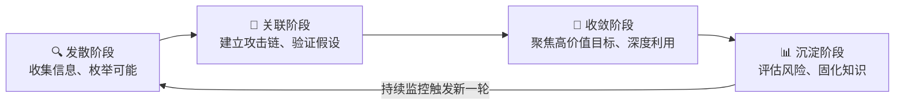
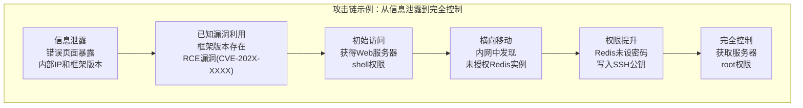
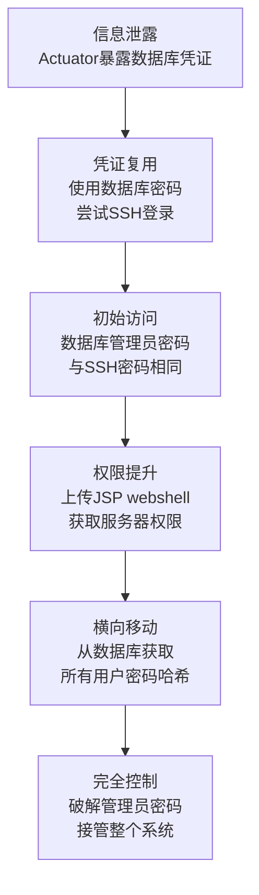
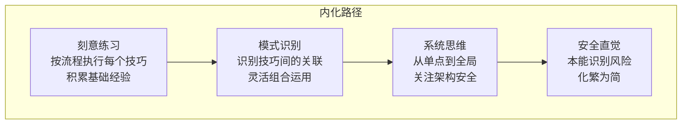

## 十五、综合运用

前十四节分别介绍了逆向思维、系统分解、假设验证、攻击面枚举、风险评估、对比分析、类比推理、情景推演、持续监控、安全评估方法论、自动化安全测试、安全监控与检测、安全运营最佳实践等核心技巧。这些技巧并非彼此孤立的工具——在真实的安全分析场景中，它们如同交响乐团中的不同乐器，只有协调配合才能奏出完整的乐章。本节将这些技巧融合为一套可重复、可迭代的综合分析方法论，并通过完整实战案例演示如何在真实项目中落地。

---

### 15.1 综合分析的底层逻辑

安全分析的本质是一个**信息逐步收敛**的过程：从"不知道目标有什么弱点"到"精确定位可利用的漏洞并量化其影响"。这个过程天然遵循一个四阶段模型：



每个阶段对应不同的技巧组合：

| 阶段 | 核心技巧 | 目标 | 产出物 |
|------|---------|------|--------|
| 发散阶段 | 系统分解、攻击面枚举、类比推理 | 最大化覆盖面，不遗漏任何入口 | 组件清单、攻击面地图 |
| 关联阶段 | 逆向思维、假设验证、情景推演 | 将孤立发现串联为攻击链 | 可行攻击路径、PoC |
| 收敛阶段 | 对比分析、风险评估、自动化测试 | 量化风险、确定修复优先级 | 风险矩阵、修复方案 |
| 沉淀阶段 | 持续监控、安全评估、安全运营 | 建立长效机制、防止问题复发 | 监控规则、知识库 |

理解这个模型后，你不再需要记住每个技巧的独立流程——只需判断当前处于哪个阶段，然后选用对应的技巧组合即可。

---

### 15.2 完整分析流程：八步法

将上述四阶段模型展开为可操作的八步流程。每一步都标注了对应的核心技巧和具体操作方法。

#### 第一步：目标定义与范围界定

在动手之前，必须回答三个问题：

1. **分析什么？** 明确目标系统的边界——是一个Web应用、一套微服务架构、还是整个企业网络？
2. **为什么分析？** 渗透测试、合规审计、架构评审、应急响应——不同目的决定了分析深度和关注重点。
3. **约束条件是什么？** 时间窗口、授权范围、生产环境保护要求——这些决定了方法选择。

**范围界定模板：**

```text
目标系统：[系统名称及版本]
分析类型：[渗透测试/安全审计/架构评审/应急响应]
授权范围：[IP范围/域名/应用列表]
时间窗口：[开始日期] 至 [结束日期]
禁止操作：[如：禁止DoS测试、禁止在生产环境写入数据]
联系人：[技术联系人] / [应急联系人]
交付物：[报告格式/发现等级定义/修复建议要求]
```

> **常见误区**：跳过范围界定直接开干。结果要么越权操作引发法律风险，要么遗漏关键系统导致结论不可靠。范围界定不是官僚流程，而是保护你自己和客户的必要步骤。

#### 第二步：系统分解与信息收集

**对应技巧：系统分解法（第二节）、类比推理法（第七节）**

将目标系统逐层拆解为可独立分析的组件。分解的粒度决定了后续分析的精度。

**分解维度矩阵：**

| 维度 | 分解对象 | 关注点 | 常用工具 |
|------|---------|--------|---------|
| 架构层 | 前端/后端/中间件/数据库/基础设施 | 各层之间的信任关系 | 架构图、文档审查 |
| 网络层 | 外网DMZ/内网/管理网/VPC | 网络隔离、流量控制 | Nmap、traceroute |
| 应用层 | Web/API/移动App/桌面客户端 | 认证授权、输入处理 | Burp Suite、Postman |
| 数据层 | 数据库/缓存/消息队列/文件存储 | 数据分类、加密状态 | 数据流图 |
| 人员层 | 开发/运维/管理员/终端用户 | 权限分配、安全意识 | 组织架构图 |

**实操示例——分解一个电商系统：**

```text
电商系统
├── 用户端
│   ├── Web商城（React SPA + Nginx）
│   ├── 移动App（Flutter，Android/iOS）
│   └── 小程序（微信/支付宝）
├── 业务服务
│   ├── 用户服务（认证、授权、用户信息）
│   ├── 商品服务（SKU、库存、价格）
│   ├── 订单服务（下单、支付、退款）
│   ├── 支付服务（对接第三方支付）
│   └── 搜索服务（Elasticsearch）
├── 中间件
│   ├── API网关（Kong/Nginx）
│   ├── 消息队列（RabbitMQ/Kafka）
│   └── 缓存（Redis）
├── 数据层
│   ├── 主数据库（MySQL主从）
│   ├── 搜索索引（ES）
│   └── 对象存储（OSS/S3）
└── 基础设施
    ├── 容器编排（K8s）
    ├── CI/CD（Jenkins/GitLab CI）
    ├── 监控（Prometheus+Grafana）
    └── 日志（ELK Stack）
```

**类比推理的运用**：将目标系统与已知安全事件中的同类系统做对比。例如，如果目标是电商系统，可以参考以下公开事件的攻击模式：

- **Magento Shoplift（2015）**：SQL注入绕过认证 → 检查目标的认证实现
- **Shopify XSS（2020）**：模板注入 → 检查目标的模板渲染引擎
- **某电商平台支付逻辑漏洞**：金额篡改 → 检查目标的支付签名机制

类比推理不是直接套用漏洞，而是借鉴攻击思路。同类系统往往存在相似的设计缺陷，因为它们面对相同的业务需求和架构约束。

#### 第三步：攻击面枚举与资产发现

**对应技巧：攻击面枚举法（第四节）**

系统分解告诉你"目标有什么"，攻击面枚举告诉你"从哪里入手"。

**三层枚举框架：**

**1. 外部可见攻击面（黑盒视角）**

```bash
# 子域名枚举
subfinder -d target.com -o subdomains.txt
amass enum -passive -d target.com >> subdomains.txt
cat subdomains.txt | sort -u | httpx -o live_hosts.txt

# 端口与服务扫描
nmap -sV -sC -T4 -iL live_hosts.txt -oX nmap_results.xml

# Web技术指纹
whatweb -i live_hosts.txt --log-json=whatweb.json

# URL与端点发现
katana -u https://target.com -d 5 -jc -o urls.txt
paramspider -d target.com -o params.txt
```

**2. 逻辑攻击面（灰盒视角）**

- API文档与Swagger端点（`/swagger-ui.html`、`/api-docs`）
- 认证机制类型（Session/JWT/OAuth2/SAML）
- 角色与权限模型（RBAC/ABAC的粒度）
- 文件上传入口与类型限制
- 第三方集成点（支付网关、短信服务、邮件服务）
- 数据导入导出功能

**3. 内部攻击面（白盒视角）**

- 代码仓库中的敏感信息（硬编码密钥、注释中的TODO/FIXME）
- 依赖组件的已知漏洞（`npm audit`、`pip-audit`、OWASP Dependency-Check）
- CI/CD流水线中的权限配置
- 容器镜像中的安全基线偏差
- 云资源配置（IAM策略、安全组、存储桶ACL）

**攻击面优先级排序：**

| 优先级 | 条件 | 原因 |
|--------|------|------|
| P0 | 互联网直接暴露 + 处理敏感数据 | 攻击成本最低，影响最大 |
| P1 | 内网暴露 + 已有初始访问 | 横向移动的跳板 |
| P2 | 需要认证才能访问 + 权限模型复杂 | 逻辑漏洞高发区 |
| P3 | 仅内部管理访问 + 有访问控制 | 攻击面较小但不可忽视 |

#### 第四步：假设构建与验证

**对应技巧：假设验证法（第三节）、逆向思维法（第一节）**

这一步是从"信息收集"转向"主动分析"的关键转折点。不要漫无目的地测试——先建立假设，再用实验验证。

**假设构建的三种来源：**

1. **经验驱动**：基于常见漏洞模式提出假设
   - "这个API可能没有对用户输入做充分的参数校验"
   - "JWT token可能没有设置合理的过期时间"
   - "文件上传可能只检查了Content-Type而未检查文件内容"

2. **逆向驱动**：从攻击目标反推实现路径
   - 目标：获取管理员权限 → 假设：权限校验可能只在前端实现
   - 目标：访问其他用户数据 → 假设：API可能使用自增ID且无鉴权
   - 目标：绕过支付 → 做设：支付回调可能未验证签名来源

3. **数据驱动**：基于已收集信息中的异常点
   - Nmap发现非标准端口运行HTTP服务 → 可能是管理后台
   - 响应头暴露服务器版本 → 该版本存在已知CVE
   - 错误页面显示堆栈信息 → 可能泄露内部架构细节

**假设验证的实操方法——以"JWT未验证签名"为例：**

```python
import jwt
import requests

# 原始token
original_token = "eyJhbGciOiJIUzI1NiIsInR5cCI6IkpXVCJ9..."

# 假设1：后端不验证alg字段
# 攻击：将alg改为none
payload = jwt.decode(original_token, options={"verify_signature": False})
forged_none = jwt.encode(payload, "", algorithm="none")
# 尝试使用forged_none访问受保护资源

# 假设2：使用弱密钥
# 攻击：字典爆破JWT密钥
import subprocess
result = subprocess.run(
    ["hashcat", "-a", "0", "-m", "16500", original_token, "wordlists/jwt.secrets.list"],
    capture_output=True, text=True
)

# 假设3：未绑定jti（token重放）
# 攻击：在token过期前，用同一token访问不同资源
headers = {"Authorization": f"Bearer {original_token}"}
r1 = requests.get("https://api.target.com/user/123/profile", headers=headers)
r2 = requests.get("https://api.target.com/user/456/profile", headers=headers)
# 如果r2也成功，说明未做资源-用户绑定
```

**验证结果记录模板：**

```text
假设ID：H-001
假设内容：JWT签名未验证
验证方法：使用alg=none的伪造token访问API
验证结果：✅ 确认 / ❌ 证伪 / ⚠️ 部分成立
证据：HTTP请求/响应记录
影响范围：所有使用JWT认证的API端点
风险等级：严重
修复建议：强制验证JWT签名，服务端设置允许的alg白名单
```

#### 第五步：攻击链构建与情景推演

**对应技巧：情景推演法（第八节）、逆向思维法（第一节）**

单个漏洞的价值往往有限，真正的安全风险来自**攻击链**——将多个低危发现串联为高危攻击路径。

**攻击链构建方法：**



**常见攻击链模式：**

| 攻击链类型 | 典型路径 | 防御难点 |
|-----------|---------|---------|
| 外网→内网渗透 | 信息收集→漏洞利用→内网穿透→横向移动 | 各环节单独看风险不高，串联后影响巨大 |
| 认证绕过→权限提升 | 弱口令→低权限用户→水平越权→垂直越权 | 认证和授权机制分离，缺乏统一校验 |
| 供应链攻击 | 恶意依赖→CI/CD注入→生产环境后门 | 信任链过长，验证点不足 |
| 社会工程→技术攻击 | 钓鱼邮件→凭证获取→VPN接入→内网扫描 | 人是最薄弱的环节 |

**情景推演的六个关键问题：**

1. 攻击者的**入口**在哪里？（初始访问向量）
2. 攻击者需要什么**前置条件**？（权限、信息、工具）
3. 每一步操作的**成功率**有多高？
4. 防御方有什么**检测手段**？
5. 攻击者如何**规避检测**？
6. 攻击的**最终影响**是什么？

#### 第六步：风险评估与优先级排序

**对应技巧：风险评估法（第五节）、对比分析法（第六节）**

发现了漏洞还不够，必须回答"先修哪个"。这需要一套可量化的风险评估体系。

**CVSS 3.1 评分实操：**

以一个SQL注入漏洞为例，逐步填写CVSS向量：

```text
攻击向量(AV): 网络(N) —— 通过互联网可达
攻击复杂度(AC): 低(L) —— 无需特殊条件
权限要求(PR): 无(N) —— 无需认证
用户交互(UI): 无(N) —— 无需用户参与
范围(S): 不变(U) —— 影响限于本组件
机密性影响(C): 高(H) —— 可读取全部数据库
完整性影响(I): 高(H) —— 可修改任意数据
可用性影响(A): 高(H) —— 可删除数据库

CVSS向量: CVSS:3.1/AV:N/AC:L/PR:N/UI:N/S:U/C:H/I:H/A:H
基础分: 9.8 (严重)
```

**风险矩阵——业务视角：**

| | 影响-低 | 影响-中 | 影响-高 | 影响-严重 |
|---|--------|--------|--------|----------|
| **可能性-高** | 中 | 高 | 严重 | 严重 |
| **可能性-中** | 低 | 中 | 高 | 严重 |
| **可能性-低** | 低 | 低 | 中 | 高 |

> **关键原则**：CVSS分数只是参考起点。一个CVSS 7.5的漏洞如果暴露在互联网且处理支付数据，其实际风险可能高于一个CVSS 9.8但仅在内网且不处理敏感数据的漏洞。风险评估必须结合**业务上下文**。

**修复优先级决策树：**

```text
发现漏洞
├── 是否在互联网暴露？
│   ├── 是 → 优先级 +2
│   └── 否 → 继续评估
├── 是否处理敏感数据（PII/支付/医疗）？
│   ├── 是 → 优先级 +2
│   └── 否 → 继续评估
├── 是否已有公开PoC/在野利用？
│   ├── 是 → 优先级 +2
│   └── 否 → 继续评估
├── 利用难度如何？
│   ├── 无需认证/自动化可利用 → 优先级 +1
│   └── 需要特定条件 → 维持当前优先级
└── 检测能力如何？
    ├── 无法检测 → 优先级 +1
    └── 已有监控 → 维持当前优先级
```

#### 第七步：自动化测试与持续验证

**对应技巧：自动化安全测试（第十二节）、安全监控与检测（第十三节）**

手动分析发现的问题需要通过自动化手段固化为可重复执行的测试用例，确保修复有效且不会复发。

**将手动发现转化为自动化规则：**

```yaml
# Semgrep规则示例：将"JWT未验证签名"的手动发现固化
rules:
  - id: jwt-none-algorithm
    patterns:
      - pattern: jwt.decode($TOKEN, ..., algorithms=["none", ...])
      - pattern-not: jwt.decode($TOKEN, ..., algorithms=["RS256", ...])
    message: >
      JWT token使用了none算法，攻击者可以伪造任意token。
      应强制指定允许的签名算法白名单。
    severity: ERROR
    languages: [python]
    metadata:
      cwe: "CWE-345: Insufficient Verification of Data Authenticity"
      owasp: "A07:2021 - Identification and Authentication Failures"
```

```bash
# DAST自动化扫描配置（OWASP ZAP示例）
zap-cli quick-scan \
  --self-contained \
  --start-options '-config api.key=your-api-key' \
  --spider https://target.com \
  --ajax-spider \
  --scan-all \
  --output-format json \
  --output zap_report.json

# 依赖漏洞持续检查（集成到CI/CD）
# .github/workflows/security-scan.yml
# trivy image --severity HIGH,CRITICAL your-image:latest
# npm audit --production --audit-level=high
# pip-audit --desc --output json
```

**自动化测试分层策略：**

| 层级 | 工具类型 | 集成阶段 | 发现问题类型 | 执行频率 |
|------|---------|---------|-------------|---------|
| L1 | SAST（静态分析） | 代码提交 | SQL注入、XSS、硬编码密钥 | 每次提交 |
| L2 | SCA（依赖扫描） | 构建阶段 | 已知CVE组件 | 每次构建 |
| L3 | DAST（动态扫描） | 测试环境部署后 | 配置错误、认证缺陷 | 每日/每次部署 |
| L4 | IAST（交互式扫描） | 集成测试 | 运行时漏洞 | 测试执行期间 |
| L5 | 渗透测试 | 上线前/定期 | 业务逻辑漏洞 | 季度/年度 |

#### 第八步：知识沉淀与持续改进

**对应技巧：持续监控思维（第九节）、安全运营最佳实践（第十四节）**

分析结束不是终点，而是下一轮分析的起点。将本轮分析的经验固化为组织的安全资产。

**知识沉淀清单：**

1. **漏洞模式库**：将发现的漏洞模式抽象化，添加到内部知识库
```text
   模式名称：[JWT签名验证缺失]
   漏洞类型：[认证绕过]
   发现方法：[手动构造none算法token]
   检测规则：[Semgrep rule ID: jwt-none-algorithm]
   修复方案：[强制指定algorithms白名单 + 服务端校验]
   验证方法：[使用none算法token应返回401]
   ```

2. **攻击面台账**：维护一份实时更新的资产清单
   - 所有对外暴露的服务及端口
   - 每个服务的认证方式和权限模型
   - 最近一次安全评估的时间和结论

3. **监控规则更新**：将新发现的攻击模式转化为检测规则
   - WAF规则更新
   - SIEM关联规则添加
   - EDR行为检测策略调整

4. **流程改进建议**：分析漏洞产生的根因，提出流程层面的改进
   - 如果是编码问题 → 增加SAST规则 + 代码审查清单
   - 如果是配置问题 → 增加安全基线检查 + 自动化合规
   - 如果是设计问题 → 在架构评审中增加安全评审环节

---

### 15.3 实战案例：Web应用综合安全分析

以下是一个完整的实战案例，演示如何将八步法应用于一个真实目标（所有细节已脱敏处理）。

**目标背景**：某中型企业的内部管理系统（HR+OA+CRM），采用Spring Boot + Vue.js架构，部署在企业内网，通过VPN远程访问。

#### 阶段一：信息收集与系统分解

```bash
# 信息收集结果（已脱敏）
目标域名: internal.company.com
前端: Vue.js 3.x + Element Plus
后端: Spring Boot 2.7.x + MyBatis-Plus
数据库: MySQL 8.0
认证方式: JWT (自定义实现)
部署方式: Docker + Nginx反向代理
```

系统分解为四个模块：用户认证模块、HR人事模块、OA办公模块、CRM客户模块。每个模块独立部署为微服务，通过内部API网关统一路由。

#### 阶段二：攻击面枚举

通过目录扫描和API文档发现以下攻击面：

- `/swagger-ui.html` 对已认证用户开放（暴露完整API定义）
- `/actuator/env` 和 `/actuator/heapdump` 未关闭（Spring Boot Actuator）
- 文件上传接口接受任何文件类型（仅前端校验）
- 密码重置接口存在时间戳参数（可预测）
- 用户ID使用自增整数（`/api/user/1`, `/api/user/2`）

#### 阶段三：假设验证

**假设1：Actuator端点泄露敏感配置**

验证：
```bash
curl -s https://internal.company.com/actuator/env | jq '.propertySources[0].properties'
# 结果：暴露了数据库连接字符串、Redis密码、第三方API密钥
```
结论：确认。Actuator端点泄露了生产环境的数据库凭证和多个第三方服务密钥。

**假设2：水平越权访问其他用户数据**

验证：
```bash
# 以用户A的身份访问用户B的数据
curl -H "Authorization: Bearer $USER_A_TOKEN" \
  https://internal.company.com/api/user/2/profile
# 返回了用户B的完整个人信息（姓名、身份证号、薪资）
```
结论：确认。API仅验证token有效性，未校验token所属用户与请求资源的归属关系。

**假设3：文件上传导致远程代码执行**

验证：
```bash
# 上传JSP webshell
curl -X POST https://internal.company.com/api/upload \
  -H "Authorization: Bearer $TOKEN" \
  -F "file=@shell.jsp"
# 返回上传成功，可直接访问 /uploads/shell.jsp 执行命令
```
结论：确认。后端未校验文件类型和内容，上传目录在Web根目录下，且Nginx配置允许解析JSP。

#### 阶段四：攻击链构建

将三个发现串联为完整的攻击链：



**攻击链影响力评估**：

- 单独看每个发现：Actuator信息泄露（中危）、水平越权（高危）、文件上传（严重）
- 串联后：可以从互联网访问到完全控制整个内部管理系统（严重）
- 业务影响：全部员工个人信息泄露、客户数据泄露、业务系统瘫痪

#### 阶段五：风险评估与报告

| 漏洞 | CVSS分 | 业务风险 | 修复优先级 | 修复建议 | 修复周期 |
|------|--------|---------|-----------|---------|---------|
| Actuator端点未鉴权 | 7.5 | 高 | P0 | 禁用或添加认证 | 1天 |
| 水平越权 | 8.1 | 严重 | P0 | 后端强制校验资源归属 | 3天 |
| 任意文件上传 | 9.8 | 严重 | P0 | 后端白名单+存储隔离+禁止执行 | 2天 |
| 密码策略弱 | 6.5 | 中 | P1 | 强制密码复杂度+定期轮换 | 1周 |
| JWT长期有效 | 5.3 | 中 | P1 | 设置合理过期时间+refresh token | 1周 |

#### 阶段六：自动化固化

将手动发现转化为自动化检测：

```yaml
# 内部安全扫描脚本的核心检查项
checks:
  - name: "Actuator端点暴露检查"
    type: http
    method: GET
    paths: ["/actuator/env", "/actuator/heapdump", "/actuator/configprops"]
    expected_status: 403
    severity: high

  - name: "水平越权检测"
    type: api
    method: "使用User-A的token访问User-B的资源"
    pattern: "/api/user/{other_user_id}/*"
    expected: "403或空数据"
    severity: critical

  - name: "文件上传类型限制"
    type: http
    method: POST
    path: "/api/upload"
    payloads: ["test.jsp", "test.php", "test.exe", "../../etc/passwd"]
    expected: "拒绝非白名单文件类型"
    severity: critical
```

---

### 15.4 不同场景的技巧组合策略

安全分析并非一成不变的套路——不同场景需要不同的技巧组合。以下是常见场景的推荐策略。

#### 场景一：红队评估（模拟真实攻击）

**目标**：检验防御体系的实际效果，不以发现漏洞数量为目标。

| 阶段 | 主要技巧 | 关键操作 |
|------|---------|---------|
| 侦察 | 攻击面枚举、类比推理 | OSINT、供应链分析、物理侦察 |
| 武器化 | 逆向思维、假设验证 | 定制payload、免杀处理 |
| 投递 | 情景推演 | 钓鱼邮件、物理入侵、WiFi攻击 |
| 利用 | 假设验证、系统分解 | 漏洞利用、权限提升 |
| 横向移动 | 对比分析、攻击面枚举 | 凭证复用、协议利用 |
| 目标达成 | 风险评估 | 数据窃取、持久化 |

**关键心法**：红队评估的核心是**模拟真实威胁行为体（APT）**的TTPs，而不是机械地运行扫描工具。要像真正的攻击者一样思考——最小化噪声、最大化隐蔽性。

#### 场景二：安全架构评审（设计阶段介入）

**目标**：在系统设计阶段就识别安全缺陷，避免漏洞进入代码。

| 阶段 | 主要技巧 | 关键操作 |
|------|---------|---------|
| 架构审查 | 系统分解 | 绘制数据流图、识别信任边界 |
| 威胁建模 | 逆向思维、攻击面枚举 | STRIDE分析、攻击树构建 |
| 设计验证 | 假设验证、情景推演 | 攻击模拟、故障注入测试 |
| 基线检查 | 对比分析 | 对标CIS基准、行业最佳实践 |
| 风险定级 | 风险评估 | 业务影响分析、残余风险评估 |

**关键心法**：架构评审的价值在于**左移安全**——越早发现问题，修复成本越低。一个设计阶段发现的认证缺陷，修复成本可能只是一次架构讨论；而到了生产环境才发现，可能需要重构整个认证模块。

#### 场景三：应急响应（事件已发生）

**目标**：快速定位攻击路径、遏制影响、恢复业务、防止复发。

| 阶段 | 主要技巧 | 关键操作 |
|------|---------|---------|
| 检测与确认 | 持续监控、安全监控与检测 | 告警分析、日志关联 |
| 遏制 | 系统分解、风险评估 | 隔离受影响系统、评估影响范围 |
| 根因分析 | 逆向思维、攻击面枚举 | 还原攻击路径、识别入侵向量 |
| 消除 | 假设验证 | 验证后门清除、补丁有效性 |
| 恢复 | 情景推演 | 验证恢复方案、防止攻击者重返 |
| 复盘 | 对比分析 | 与最佳实践对比、改进防御体系 |

**关键心法**：应急响应的第一原则是**遏制优先于调查**。在确认攻击已经停止或被限制之前，不要为了取证而放任攻击者继续活动。

---

### 15.5 从技巧到直觉：内化路径

技巧是外在的方法论，直觉是内在的反应速度。从"知道怎么做"到"本能地做出正确判断"，需要经历四个阶段：

**阶段一：刻意练习（0-6个月）**

- 按照八步法的顺序，逐个技巧地练习
- 使用CTF靶场（HackTheBox、TryHackMe、VulnHub）作为练习场
- 每次分析后，写下"我用了哪些技巧、效果如何、下次怎么改进"
- 目标：能够独立完成完整的分析流程

**阶段二：模式识别（6-18个月）**

- 开始识别不同技巧之间的关联和切换时机
- 能够根据现场情况灵活选择技巧组合
- 建立个人的"漏洞模式库"——见过的漏洞类型和利用方式
- 目标：看到一个系统时，能在脑中自动生成潜在的攻击路径

**阶段三：系统思维（18-36个月）**

- 从单点漏洞思考转向系统性风险思考
- 能够评估一个安全决策对整个系统的连锁影响
- 开始关注安全架构而非单个漏洞
- 目标：能够设计安全的系统，而不只是发现不安全的系统

**阶段四：安全直觉（36个月以上）**

- 面对新系统时，能够快速"嗅到"不安全的设计
- 在设计评审中，本能地指出"这里可能会出问题"
- 能够将复杂的安全问题用简单的语言向非技术人员解释
- 目标：安全思维成为你的第二本能



**加速内化的五个习惯：**

1. **每次分析后复盘**：用5分钟回顾"这次用了什么技巧、跳过了什么步骤、遗漏了什么"
2. **阅读真实安全报告**：研究Google Project Zero、Microsoft MSRC、各大CTF writeup，看别人如何分析问题
3. **参与安全社区**：加入漏洞赏金平台（HackerOne、Bugcrowd），在真实目标上练习
4. **教是最好的学**：尝试向同事解释你发现的漏洞，或者写技术博客
5. **保持好奇心**：对每个"正常运行"的系统，问自己"如果我是攻击者，我会怎么做"

---

### 15.6 常见误区与纠正

| 误区 | 表现 | 纠正 |
|------|------|------|
| 工具依赖症 | 离开Nmap和Burp Suite就不会分析了 | 工具是辅助，思维是核心。先想清楚"我要验证什么"，再选择工具 |
| 漏洞清单思维 | 只关心找到了多少漏洞，不关心攻击路径 | 一个串联的攻击链比10个孤立的低危漏洞更有价值 |
| 忽略业务上下文 | 对所有目标使用相同的分析套路 | 不同业务的安全重点不同——金融关注数据完整性，医疗关注隐私，电商关注可用性 |
| 重攻轻防 | 只会找漏洞，不会给修复建议 | 好的安全分析不仅要指出"哪里有问题"，还要说明"怎么修"和"为什么这样修" |
| 跳过范围界定 | 不写授权书就开始扫描 | 没有授权的渗透测试就是非法入侵，不管你的意图多好 |
| 忽视误报 | 扫描器报了就写进报告 | 每个发现都需要人工验证，误报会消耗信任和修复资源 |
| 分析即结束 | 报告交了就完事 | 跟踪修复进度、验证修复有效性、更新检测规则，才是完整的闭环 |

---

### 15.7 综合分析工具链推荐

以下是一套经过实战验证的工具链，覆盖从信息收集到持续监控的全流程：

| 阶段 | 工具 | 用途 | 开源/商业 |
|------|------|------|----------|
| 信息收集 | Amass + Subfinder + httpx | 子域名枚举和存活检测 | 开源 |
| 端口扫描 | Nmap + Masscan | 快速端口发现 + 详细服务识别 | 开源 |
| Web分析 | Burp Suite + nuclei | 代理抓包 + 漏洞扫描 | 商业+开源 |
| 代码审计 | Semgrep + CodeQL | 静态代码分析 | 开源 |
| 依赖检查 | Trivy + Dependency-Check | 容器和依赖漏洞扫描 | 开源 |
| 密码审计 | Hashcat + John the Ripper | 密码哈希破解 | 开源 |
| 漏洞利用 | Metasploit + sqlmap | 漏洞利用框架 | 开源 |
| 后渗透 | BloodHound + Impacket | AD攻击、横向移动 | 开源 |
| 报告生成 | pwndoc + SysReptor | 自动化报告撰写 | 开源 |
| 持续监控 | ELK + Wazuh + Falco | 日志分析、入侵检测、容器监控 | 开源 |

**工具链集成示例（自动化流水线）：**

```bash
#!/bin/bash
# 综合安全分析自动化脚本框架
TARGET=$1
OUTPUT_DIR="./results/$(date +%Y%m%d_$TARGET)"
mkdir -p $OUTPUT_DIR

# Phase 1: 信息收集
echo "[*] Phase 1: Reconnaissance"
subfinder -d $TARGET -o $OUTPUT_DIR/subdomains.txt
cat $OUTPUT_DIR/subdomains.txt | httpx -o $OUTPUT_DIR/live_hosts.txt
nmap -iL $OUTPUT_DIR/live_hosts.txt -oX $OUTPUT_DIR/nmap.xml

# Phase 2: 漏洞扫描
echo "[*] Phase 2: Vulnerability Scanning"
nuclei -l $OUTPUT_DIR/live_hosts.txt -o $OUTPUT_DIR/nuclei_results.txt

# Phase 3: 报告生成
echo "[*] Phase 3: Report Generation"
# 自定义报告脚本，整合所有扫描结果
python3 generate_report.py $OUTPUT_DIR
```

---

### 15.8 总结

安全分析不是孤立技巧的简单叠加，而是一套**系统化的思维方法论**。本节的核心思想可以归纳为：

1. **四阶段模型**：发散→关联→收敛→沉淀，每个阶段有对应的技巧组合
2. **八步流程**：从目标定义到知识沉淀，形成可重复的分析闭环
3. **场景化策略**：不同场景（红队/架构评审/应急响应）需要不同的技巧组合
4. **内化路径**：从刻意练习到安全直觉，需要时间和实战的积累

> "技巧可以学习，但真正的安全直觉来自于不断的实践和思考。"

当你能够不假思索地在分析过程中自然地切换各种技巧——在信息收集时本能地做系统分解，在发现异常时自动建立假设去验证，在评估风险时自然地考虑业务上下文——你就已经将这些技巧内化为了真正的安全思维。这就是综合运用的最终目标：不是机械地执行流程，而是让安全分析成为你的第二天性。
