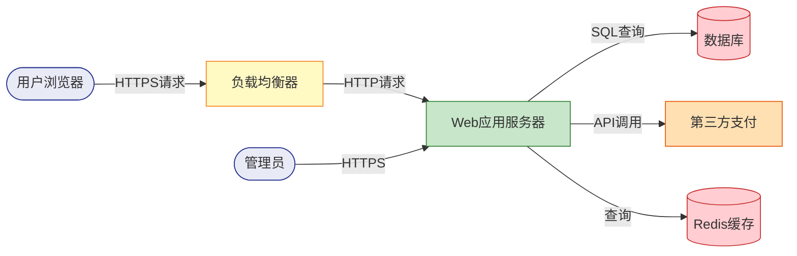
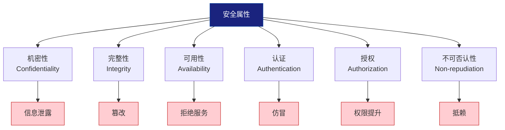
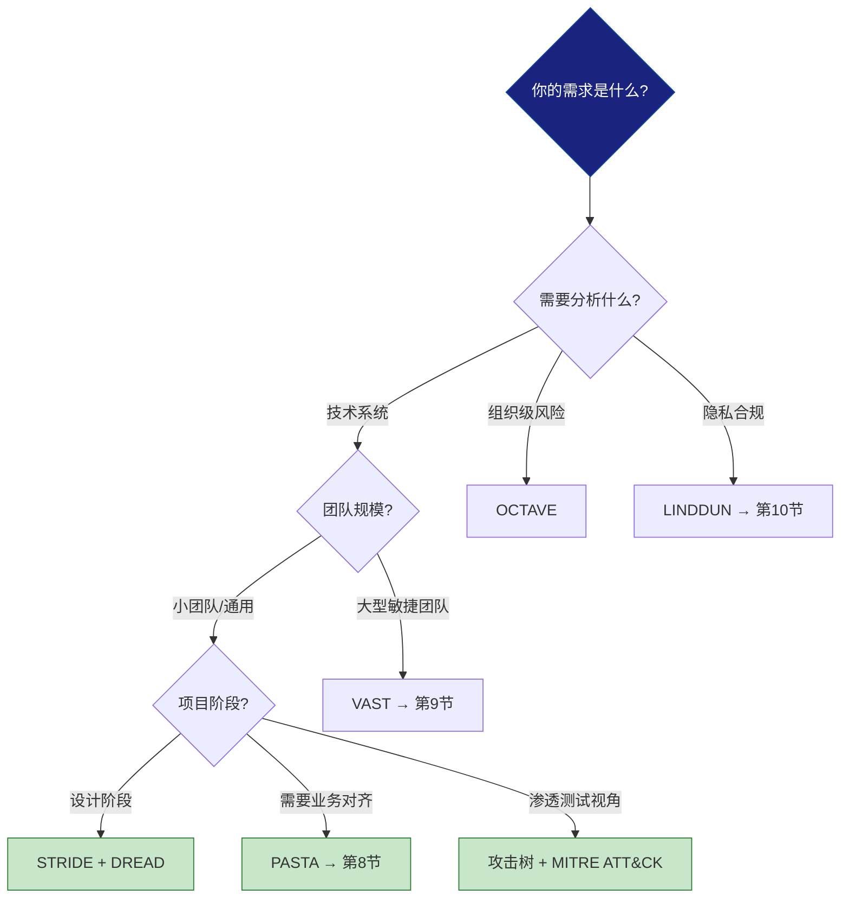

## 二、威胁建模（Threat Modeling）

> **威胁建模是安全工程中最核心的结构化思维方法。** 它不是某个工具或某份表格，而是一套回答"什么东西可能出错"的系统化流程。从微软的SDL到OWASP的SAMM，从NIST的SSDF到ISO 27005，所有主流安全框架都将威胁建模列为安全开发生命周期中不可省略的环节。

### 2.1 为什么需要威胁建模

#### 2.1.1 没有威胁建模的世界

想象一个团队开发了一套在线支付系统。他们做了代码审计、跑了渗透测试、部署了WAF。上线三个月后，攻击者通过一个从未被测试覆盖的第三方回调接口，绕过了所有防护，窃取了 200 万条用户支付记录。

问题出在哪？不是他们做得不够多，而是他们没有在设计阶段系统性地问过："这个系统的所有可能被攻击的方式是什么？"

这就是威胁建模要解决的核心问题：**在攻击者之前，发现系统中所有可能被利用的弱点。**

#### 2.1.2 威胁建模的四大价值

| 价值维度 | 没有威胁建模 | 有威胁建模 |
|----------|-------------|-----------|
| 发现时机 | 上线后被攻击才发现 | 设计阶段就识别风险 |
| 覆盖范围 | 依赖测试人员经验，容易遗漏 | 系统性枚举，覆盖率高 |
| 修复成本 | 上线后修复成本是设计阶段的 30-100 倍 | 设计阶段修复成本最低 |
| 安全投入 | 盲目投入，不知道重点在哪 | 基于风险排序，精准投入 |

根据 IBM《数据泄露成本报告 2024》，在设计阶段发现并修复安全问题的平均成本约为 60 美元，而在生产环境中修复同一问题的成本超过 5,000 美元，差距接近 100 倍。

#### 2.1.3 威胁建模不是什么

理解威胁建模，同样需要理解它不是什么：

- **不是渗透测试**：渗透测试是验证已有防护是否有效；威胁建模是在设计阶段发现应该有什么防护
- **不是代码审计**：代码审计关注实现层面的缺陷；威胁建模关注架构和设计层面的风险
- **不是合规检查**：合规检查确认是否满足最低标准；威胁建模追求理解系统真实的风险全景
- **不是一次性活动**：威胁建模应该在系统生命周期中持续进行，每次重大变更都要重新评估

### 2.2 威胁建模的通用流程

无论使用哪种具体方法论，威胁建模都遵循一个通用的四步流程：


#### 第一步：分解系统（Decompose the System）

将系统拆解为可分析的组件。核心工具是**数据流图（Data Flow Diagram, DFD）**。

数据流图用四种基本元素描述系统：

| 元素 | 符号 | 含义 | 示例 |
|------|------|------|------|
| 外部实体 | 矩形 | 系统边界外的参与者 | 用户、第三方API、邮件服务器 |
| 进程 | 圆形 | 处理数据的组件 | Web服务器、认证模块、支付引擎 |
| 数据存储 | 两条平行线 | 持久化或临时存储 | 数据库、缓存、文件系统 |
| 数据流 | 箭头 | 数据移动的方向 | HTTP请求、数据库查询、API调用 |
| 信任边界 | 虚线 | 权限或信任级别变化的位置 | 内网/外网边界、用户态/内核态 |

**以一个典型的Web应用为例，其数据流图如下：**



绘制数据流图时的关键原则：

1. **从入口开始**：从用户交互点出发，追踪数据流经的每一个组件
2. **标注信任边界**：用虚线标出信任级别变化的地方——每一条穿越信任边界的数据流都是潜在攻击面
3. **不要遗漏存储**：数据库、缓存、日志文件、配置文件都是数据存储
4. **包含外部依赖**：第三方API、CDN、邮件服务等外部组件都应纳入分析

#### 第二步：识别威胁（Identify Threats）

使用威胁分类框架（如STRIDE）对数据流图中的每个元素和每条数据流进行系统性分析。详见下一节。

#### 第三步：评估风险（Assess Risk）

对识别出的威胁进行风险评级，确定优先级。可以使用DREAD模型、CVSS评分或定性风险矩阵。详见2.5节。

#### 第四步：制定对策（Determine Mitigations）

针对高优先级威胁设计缓解措施。对策分为四类：

| 策略 | 含义 | 示例 |
|------|------|------|
| 消除（Eliminate） | 移除产生威胁的功能或组件 | 不存储不必要的敏感数据 |
| 缓解（Mitigate） | 降低威胁发生的可能性或影响 | 添加输入验证、加密传输 |
| 转移（Transfer） | 将风险转移给第三方 | 使用CDN抵御DDoS、购买网络保险 |
| 接受（Accept） | 明确接受残余风险并记录 | 低影响、低概率的威胁 |

**关键原则：不接受未被记录的风险。** 每一个"接受"的决定都必须有文档记录，包括接受的理由、责任人和定期复审日期。

### 2.3 STRIDE威胁分类模型

STRIDE是微软在2002年提出的经典威胁分类框架，至今仍是使用最广泛的威胁分类方法。它将所有安全威胁归入六个类别，每个类别对应一个被破坏的安全属性。

#### 2.3.1 STRIDE六类威胁详解

| 威胁类型 | 英文全称 | 被破坏的安全属性 | 攻击者目标 |
|----------|----------|-----------------|-----------|
| 仿冒（Spoofing） | Spoofing | 认证（Authentication） | 冒充合法用户或系统 |
| 篡改（Tampering） | Tampering | 完整性（Integrity） | 修改数据或代码 |
| 抵赖（Repudiation） | Repudiation | 不可否认性（Non-repudiation） | 否认执行过的操作 |
| 信息泄露（Information Disclosure） | Information Disclosure | 机密性（Confidentiality） | 获取未授权的信息 |
| 拒绝服务（Denial of Service） | Denial of Service | 可用性（Availability） | 使系统或服务不可用 |
| 权限提升（Elevation of Privilege） | Elevation of Privilege | 授权（Authorization） | 获取超出授权的权限 |

这六类威胁与信息安全的CIA三元组（机密性、完整性、可用性）以及认证、授权、不可否认性形成了完整的映射关系：



#### 2.3.2 STRIDE-per-Element：针对元素类型的威胁分析

原始STRIDE模型对系统中每个元素应用全部六类威胁，但这会产生大量不适用的条目。微软后来改进为**STRIDE-per-Element**，针对不同类型的系统元素只分析适用的威胁：

| 元素类型 | S（仿冒） | T（篡改） | R（抵赖） | I（信息泄露） | D（拒绝服务） | E（权限提升） |
|----------|----------|----------|----------|-------------|-------------|-------------|
| 外部实体 | ✓ | — | ✓ | — | — | — |
| 进程 | ✓ | ✓ | ✓ | ✓ | ✓ | ✓ |
| 数据存储 | — | ✓ | — | ✓ | ✓ | — |
| 数据流 | — | ✓ | — | ✓ | ✓ | — |

**解读：**
- 外部实体（如用户）可以被仿冒，也可以抵赖操作，但外部实体本身不存在被篡改或拒绝服务的概念
- 数据存储不能被"仿冒"（它不是主动实体），但其中的数据可以被篡改、泄露或被锁定（拒绝服务）
- 进程是最复杂的元素——所有六类威胁都适用

#### 2.3.3 STRIDE实战：Web登录系统深度分析

以下是对一个Web登录系统进行完整STRIDE分析的过程。

**系统描述：** 用户通过浏览器访问登录页面，输入用户名和密码，Web服务器验证凭据后创建会话，将会话ID写入Cookie返回给浏览器。

**逐元素分析：**

**S — 仿冒（Spoofing）**

| 攻击场景 | 威胁描述 | 风险等级 | 缓解措施 |
|----------|---------|---------|---------|
| 暴力破解 | 攻击者尝试大量密码组合 | 高 | 账户锁定策略、验证码、多因素认证 |
| 会话令牌预测 | 会话ID可被猜测或枚举 | 高 | 使用密码学安全的随机数生成器（CSPRNG） |
| Cookie窃取 | 通过XSS窃取会话Cookie | 高 | HttpOnly、Secure标志、SameSite属性 |
| 凭据填充 | 使用其他网站泄露的凭据登录 | 中 | 检测已泄露密码库、强制密码唯一性 |
| 钓鱼攻击 | 伪造登录页面获取凭据 | 中 | WebAuthn/FIDO2、域名监控 |

**T — 篡改（Tampering）**

| 攻击场景 | 威胁描述 | 风险等级 | 缓解措施 |
|----------|---------|---------|---------|
| 传输中篡改 | 中间人修改HTTP请求内容 | 高 | 强制HTTPS（HSTS）、证书固定 |
| Cookie篡改 | 修改Cookie中的用户标识 | 高 | 服务端会话管理、签名/加密Cookie |
| 参数篡改 | 修改隐藏表单字段 | 中 | 服务端验证所有输入、CSRF Token |

**R — 抵赖（Repudiation）**

| 攻击场景 | 威胁描述 | 风险等级 | 缓解措施 |
|----------|---------|---------|---------|
| 否认登录 | 用户否认曾登录系统 | 中 | 记录登录时间、IP、设备指纹到审计日志 |
| 否认操作 | 用户否认执行过敏感操作 | 中 | 操作日志+数字签名、二次确认机制 |

**I — 信息泄露（Information Disclosure）**

| 攻击场景 | 威胁描述 | 风险等级 | 缓解措施 |
|----------|---------|---------|---------|
| 用户枚举 | 登录错误信息区分"用户不存在"和"密码错误" | 中 | 统一错误信息："用户名或密码错误" |
| 时序侧信道 | 根据响应时间判断用户是否存在 | 低 | 恒定时间比较、统一处理逻辑 |
| 错误详情泄露 | 500错误暴露堆栈信息和SQL语句 | 高 | 自定义错误页面、生产环境关闭调试 |

**D — 拒绝服务（Deniction of Service）**

| 攻击场景 | 威胁描述 | 风险等级 | 缓解措施 |
|----------|---------|---------|---------|
| 账户锁定滥用 | 通过故意输错密码锁定他人账户 | 中 | 渐进式延迟替代硬锁定、IP维度限速 |
| 登录接口洪泛 | 大量请求耗尽服务器资源 | 高 | CDN防护、速率限制、CAPTCHA |
| 哈希资源耗尽 | 大量登录请求消耗CPU（密码哈希计算） | 中 | 前置速率限制、验证码 |

**E — 权限提升（Elevation of Privilege）**

| 攻击场景 | 威胁描述 | 风险等级 | 缓解措施 |
|----------|---------|---------|---------|
| 水平越权 | 通过修改会话中的用户ID访问他人账户 | 高 | 服务端会话验证、不可预测的标识符 |
| 垂直越权 | 普通用户访问管理员接口 | 高 | 基于角色的访问控制（RBAC）、最小权限原则 |
| JWT算法攻击 | 将JWT的alg改为none绕过验证 | 高 | 固定算法白名单、验证签名 |

#### 2.3.4 STRIDE的局限性

STRIDE虽然是经典框架，但也有其边界：

1. **不包含业务逻辑威胁**：STRIDE关注技术安全属性，但不覆盖业务逻辑缺陷（如价格篡改、竞态条件）
2. **不包含隐私威胁**：数据收集、追踪、关联分析等隐私问题不在STRIDE范围内（LINDDUN模型专门解决此问题，见第10节）
3. **不量化风险**：STRIDE只分类威胁，不评估风险等级——需要配合DREAD或其他风险评估模型使用
4. **规模化困难**：大型系统中，逐元素逐属性分析会产生海量条目，需要工具辅助

### 2.4 攻击树（Attack Trees）

攻击树由Bruce Schneier在1999年提出，是威胁建模中最重要的思维工具之一。它用树状结构表示达成攻击目标的所有可能路径，迫使分析人员系统性地思考每一种攻击方式。

#### 2.4.1 基本结构

攻击树由节点和边组成：

- **根节点（Root）**：攻击者的最终目标
- **子节点（Children）**：达成父节点目标的不同方法
- **叶节点（Leaf）**：不可再分解的原子攻击动作

节点之间的关系有两种：

| 关系类型 | 符号 | 含义 | 示例 |
|----------|------|------|------|
| OR关系 | 任意子节点成立即可 | 任一子方法都能达成目标 | "获取管理员密码"或"利用未授权访问漏洞" |
| AND关系 | 所有子节点必须同时成立 | 必须同时满足所有子方法 | "获取用户名"且"获取密码"才能登录 |

#### 2.4.2 完整示例：获取数据库中的用户数据

```text
根目标：获取数据库中的用户数据 [OR]
├── 方法1：直接访问数据库 [OR]
│   ├── 1.1 获取数据库凭据 [OR]
│   │   ├── 1.1.1 从配置文件读取（服务器被入侵后）
│   │   ├── 1.1.2 从环境变量获取（容器逃逸后）
│   │   ├── 1.1.3 从代码仓库获取（.env文件泄露）
│   │   └── 1.1.4 社工数据库管理员
│   ├── 1.2 利用数据库漏洞 [OR]
│   │   ├── 1.2.1 SQL注入（通过Web应用）
│   │   ├── 1.2.2 已知未补丁CVE
│   │   └── 1.2.3 默认凭据
│   └── 1.3 物理访问 [AND]
│       ├── 1.3.1 进入数据中心
│       └── 1.3.2 接触存储设备
├── 方法2：窃取传输中的数据 [OR]
│   ├── 2.1 中间人攻击 [AND]
│   │   ├── 2.1.1 ARP欺骗或DNS劫持
│   │   └── 2.1.2 证书伪造或降级攻击
│   ├── 2.2 网络嗅探（未加密连接）
│   └── 2.3 日志泄露（查询被记录到日志）
├── 方法3：通过应用层获取 [OR]
│   ├── 3.1 SQL注入 [AND]
│   │   ├── 3.1.1 发现注入点
│   │   ├── 3.1.2 绕过WAF/过滤
│   │   └── 3.1.3 提取数据（联合查询/盲注）
│   ├── 3.2 IDOR（不安全的直接对象引用）
│   ├── 3.3 SSRF（服务端请求伪造）访问内网数据库
│   └── 3.4 API未授权访问
└── 方法4：备份数据泄露 [OR]
    ├── 4.1 访问未加密的数据库备份
    ├── 4.2 云存储桶配置错误（公开S3）
    └── 4.3 过期但仍可访问的测试环境
```

#### 2.4.3 如何构建攻击树

构建攻击树的方法论步骤：

**步骤一：明确根目标**

根目标应该是攻击者视角的具体目标，而不是模糊的"入侵系统"。好的根目标示例：
- "获取所有用户的信用卡号"
- "以管理员身份执行任意命令"
- "使目标网站宕机超过1小时"

**步骤二：头脑风暴攻击方法**

从根目标开始，列出所有能达成目标的方法。这一阶段重在覆盖面，不要过早评估可行性。每个方法用OR或AND关系连接。

**步骤三：递归分解**

对每个方法节点继续分解，直到达到叶节点——叶节点是具体、可执行的攻击动作。

**步骤四：修剪与标注**

- 用 AND/OR 标注节点关系
- 对叶节点标注成本、难度、所需技能
- 修剪明显不可行的分支（但记录修剪理由）

**步骤五：分析与排序**

基于攻击树的分析结果：

```python
# 攻击树风险评估伪代码
def evaluate_attack_path(path):
    """评估一条攻击路径的综合风险"""
    difficulty = max(leaf.difficulty for leaf in path.leaves)  # 取最难的环节
    cost = sum(leaf.cost for leaf in path.leaves)
    detectability = min(leaf.detectability for leaf in path.leaves)  # 取最难检测的
    impact = path.root.impact
    
    # 风险 = 影响 × (1 / 难度) × (1 / 可检测性)
    risk_score = impact * (10 - difficulty) * (10 - detectability) / cost
    return risk_score
```

#### 2.4.4 攻击树的高级用法

**反向攻击树（Defense Trees）：** 将每个攻击节点替换为对应的防御措施，用于评估安全投入的边际效益。如果一条攻击路径上有多个防御节点覆盖，该路径的风险就大大降低。

**攻击树与MITRE ATT&CK映射：** 将叶节点映射到ATT&CK矩阵中的具体技术（T-code），可以快速识别哪些战术阶段被覆盖、哪些存在盲区。

**概率攻击树：** 为每个叶节点赋予成功概率，通过AND（概率相乘）和OR（概率相加后减去交集）计算每条路径的总体成功概率。

### 2.5 DREAD风险评估模型

DREAD模型用于对识别出的威胁进行量化风险评分，帮助在众多威胁中确定修复优先级。

#### 2.5.1 DREAD五个维度

| 维度 | 英文全称 | 评估问题 | 评分标准 |
|------|----------|---------|---------|
| D - 潜在损害 | Damage Potential | 如果攻击成功，损害有多大？ | 1=无影响, 3=用户不便, 5=完全系统接管 |
| R - 可重现性 | Repudiation | 攻击的稳定性如何？ | 1=极难重现, 3=需要特定条件, 5=每次都能成功 |
| E - 可利用性 | Exploitability | 发动攻击有多容易？ | 1=需要高级技能和特殊工具, 3=需要一定技术, 5=浏览器就能做到 |
| A - 受影响范围 | Affected Users | 多少人/系统会受影响？ | 1=极少数, 3=部分用户, 5=所有用户 |
| D - 可发现性 | Discoverability | 发现这个漏洞有多容易？ | 1=极难发现, 3=需要一定侦察, 5=明显可见 |

#### 2.5.2 DREAD评分实战

以Web登录系统为例，对关键威胁进行DREAD评分：

| 威胁 | D | R | E | A | D | 总分 | 风险等级 | 优先级 |
|------|---|---|---|---|---|------|---------|--------|
| SQL注入窃取数据库 | 5 | 5 | 3 | 5 | 4 | 22 | 严重 | P0 |
| XSS窃取会话Cookie | 4 | 4 | 4 | 3 | 4 | 19 | 高 | P1 |
| 暴力破解用户密码 | 4 | 5 | 3 | 2 | 5 | 19 | 高 | P1 |
| 用户枚举（登录错误信息） | 2 | 5 | 4 | 3 | 5 | 19 | 高 | P1 |
| CSRF修改用户信息 | 3 | 4 | 3 | 2 | 3 | 15 | 中 | P2 |
| 账户锁定DoS | 2 | 4 | 4 | 2 | 5 | 17 | 中 | P2 |
| 时序侧信道用户枚举 | 1 | 3 | 2 | 3 | 2 | 11 | 低 | P3 |

**风险等级划分（参考值，可根据组织调整）：**
- 20-25分：严重（Critical）—— 立即修复，阻断发布
- 15-19分：高（High）—— 当前迭代内修复
- 10-14分：中（Medium）—— 下个迭代修复
- 5-9分：低（Low）—— 排入待办，择机修复
- 1-4分：信息（Info）—— 记录备案

#### 2.5.3 DREAD的争议与替代

DREAD模型存在一些争议：

1. **可发现性（Discoverability）的伦理问题**：安全社区中有观点认为，不应该因为一个漏洞难以发现就降低其风险评级——攻击者可能知道我们不知道的发现方法。一些组织选择将D改为固定的1或移除此维度。
2. **主观性**：不同评估者可能给出差异较大的评分。建议使用团队评审机制，多人独立评分后取平均值。
3. **微软已弃用DREAD**：微软自身已转向使用CVSS（Common Vulnerability Scoring System）进行评分。CVSS v3.1提供更标准化的评分框架。

**CVSS v3.1评分框架**作为更现代的替代方案：

| 维度 | 分组 | 指标 |
|------|------|------|
| 攻击向量（AV） | 基础指标-可利用性 | 网络/相邻/本地/物理 |
| 攻击复杂度（AC） | 基础指标-可利用性 | 低/高 |
| 所需权限（PR） | 基础指标-可利用性 | 无/低/高 |
| 用户交互（UI） | 基础指标-可利用性 | 无/需要 |
| 范围（S） | 基础指标 | 不变/改变 |
| 机密性影响（C） | 基础指标-影响 | 无/低/高 |
| 完整性影响（I） | 基础指标-影响 | 无/低/高 |
| 可用性影响（A） | 基础指标-影响 | 无/低/高 |

CVSS的完整评分可通过在线计算器获得：`https://www.first.org/cvss/calculator/3.1`

### 2.6 其他威胁建模方法论概览

除STRIDE外，还有多种成熟的威胁建模方法论，各有侧重。本书后续章节将对其中几种进行详细讲解，这里先给出全局视野：

| 方法论 | 提出者 | 核心特点 | 适用场景 | 详细章节 |
|--------|--------|---------|---------|---------|
| STRIDE | 微软 | 基于安全属性的威胁分类 | 通用系统分析 | 本章 |
| PASTA | OWASP | 以风险为中心，七阶段流程 | 企业级应用 | 第8节 |
| VAST | ThreatModeler | 敏捷集成，可视化 | 大型敏捷团队 | 第9节 |
| LINDDUN | KU Leuven | 隐私威胁建模 | 隐私敏感系统 | 第10节 |
| OCTAVE | CMU SEI | 组织级风险评估 | 企业安全战略 | — |
| Trike | 开源社区 | 以风险为驱动 | 独立安全审计 | — |
| Kill Chain | Lockheed Martin | 攻击链阶段分析 | 高级威胁防护 | — |

**方法论选择指南：**



### 2.7 威胁建模在SDLC中的集成

威胁建模不是独立活动，而是安全开发生命周期（SDLC）的有机组成部分。

#### 2.7.1 各阶段的威胁建模活动

| SDLC阶段 | 威胁建模活动 | 产出物 |
|----------|-------------|--------|
| 需求分析 | 识别安全需求和合规要求 | 安全需求清单、数据分类 |
| 架构设计 | 绘制DFD、识别信任边界 | 系统数据流图、信任边界图 |
| 详细设计 | 对每个组件进行STRIDE分析 | 威胁列表、风险评估报告 |
| 编码实现 | 对照威胁列表实施安全控制 | 安全控制检查清单 |
| 测试验证 | 验证威胁对策是否有效 | 测试用例、渗透测试报告 |
| 部署运维 | 监控新出现的威胁、更新威胁模型 | 威胁模型更新记录 |
| 退役 | 评估数据残留和系统残余风险 | 退役安全检查清单 |

#### 2.7.2 敏捷环境中的威胁建模

敏捷开发中，威胁建模需要适应快速迭代的节奏：

**Sprint 0（初始建模）：**
- 绘制整体系统架构DFD
- 进行首轮STRIDE分析
- 建立威胁列表基线

**每个Sprint（增量更新）：**
- 对新增/变更的功能进行威胁分析
- 更新受影响的DFD区域
- 新增威胁加入待办列表
- 耗时控制在Sprint容量的5-10%

**里程碑评审（全面审查）：**
- 每季度对完整威胁模型进行审查
- 纳入新发现的攻击技术和威胁情报
- 调整风险评级

### 2.8 威胁建模工具

#### 2.8.1 工具对比

| 工具 | 类型 | 特点 | 适用场景 |
|------|------|------|---------|
| Microsoft Threat Modeling Tool | 桌面应用 | 微软官方、DFD绘制+自动STRIDE分析 | Windows/.NET项目 |
| OWASP Threat Dragon | 开源Web应用 | 轻量级、GitHub集成 | 小团队、开源项目 |
| IriusRisk | 商业SaaS | 自动化威胁建模、CI/CD集成 | 企业级DevSecOps |
| ThreatModeler | 商业SaaS | VAST方法论、大规模建模 | 大型组织 |
| Draw.io + 手动分析 | 免费图表工具 | 灵活、无锁定 | 快速原型、学习阶段 |

#### 2.8.2 无工具也能做

工具不是必须的。一个白板、一支笔、一个会议室，就可以进行有效的威胁建模。关键步骤：

1. 在白板上画出系统架构（5-10分钟）
2. 标注数据流和信任边界（5分钟）
3. 对每个组件提问"什么东西可能出错"（20-30分钟）
4. 记录发现的威胁到表格或Issue系统（10分钟）
5. 评估并排序威胁（10分钟）
6. 为每个高风险威胁分配责任人（5分钟）

整个过程控制在1小时以内——这就是所谓的"威胁建模周会"（Threat Modeling Monday）模式。

### 2.9 常见误区与纠正

#### 误区一：威胁建模只是安全团队的事

**真相：** 威胁建模需要开发人员、架构师、产品经理和安全团队共同参与。开发人员最了解系统的实现细节，架构师了解全局设计，产品经理了解业务价值——只有协作才能产生全面的威胁模型。Adam Shostack（微软威胁建模方法论的主要推动者）强调："威胁建模是一种团队运动。"

#### 误区二：威胁建模型太耗时，拖慢开发

**真相：** 一次聚焦的威胁建模会议通常不超过1小时。相比于在生产环境中处理安全事件（平均耗时277天才能检测到泄露，来源：IBM 2024），在设计阶段投入1小时的投资回报率极高。关键是把它做成固定流程而不是临时活动。

#### 误区三：只需要做一次就够了

**真相：** 系统在不断演化，威胁也在不断演化。OWASP Top 10每隔几年就会更新，新的攻击技术持续出现。威胁模型应该像代码一样被版本管理，随系统变更持续更新。

#### 误区四：威胁建模能发现所有安全问题

**真相：** 威胁建模关注设计和架构层面的风险，不替代代码审计（发现实现缺陷）、渗透测试（验证防护有效性）或安全监控（发现运行时攻击）。它们是互补关系：

| 活动 | 关注层面 | 发现时机 | 发现什么 |
|------|---------|---------|---------|
| 威胁建模 | 设计/架构 | 设计阶段 | 设计缺陷、架构风险 |
| 代码审计 | 实现 | 编码/测试阶段 | 编码错误、逻辑漏洞 |
| 渗透测试 | 运行时 | 测试/上线后 | 可被利用的漏洞 |
| 安全监控 | 运行时 | 持续进行 | 正在发生的攻击 |

#### 误区五：照搬模板就行，不需要理解原理

**真相：** 模板和检查清单是好的起点，但每个系统都有其独特性。盲目套用模板会导致两个问题：遗漏系统特有的威胁，以及浪费时间分析不适用的威胁。理解STRIDE的原理比记住STRIDE的清单更重要——原理能让你在面对任何新系统时都知道该如何思考。

### 2.10 进阶：威胁建模与MITRE ATT&CK

将威胁建模与MITRE ATT&CK框架结合，可以大幅提升分析的实战价值。

#### 2.10.1 ATT&CK简介

MITRE ATT&CK（Adversarial Tactics, Techniques, and Common Knowledge）是一个全球可访问的攻击者战术和技术知识库。它将攻击行为分为14个战术阶段（Tactics），每个阶段下包含具体的技术（Techniques）：

```text
侦察 → 资源开发 → 初始访问 → 执行 → 持久化 → 提权 → 防御规避
→ 凭据访问 → 发现 → 横向移动 → 收集 → 命令控制 → 数据泄露 → 影响
```

#### 2.10.2 映射方法

将威胁建模中识别的威胁映射到ATT&CK技术：

| 威胁建模发现 | STRIDE分类 | ATT&CK技术 | ATT&CK战术 |
|-------------|-----------|-----------|-----------|
| SQL注入获取数据 | 信息泄露 | T1190 (Exploit Public-Facing App) | 初始访问 |
| XSS窃取Cookie | 仿冒 | T1539 (Steal Web Session Cookie) | 凭据访问 |
| 暴力破解登录 | 仿冒 | T1110 (Brute Force) | 凭据访问 |
| 利用SSRF横向移动 | 权限提升 | T1021 (Remote Services) | 横向移动 |
| 加密数据勒索 | 拒绝服务 | T1486 (Data Encrypted for Impact) | 影响 |

这种映射的价值在于：你可以基于ATT&CK矩阵快速评估——"我们的防御体系对哪些战术阶段的覆盖存在盲区？"

#### 2.10.3 与防御矩阵结合

将威胁建模结果叠加到ATT&CK防御矩阵上，识别防护缺口：

```python
# 伪代码：基于ATT&CK的防御覆盖评估
threat_model_findings = [
    {"technique": "T1190", "risk": "critical", "defense_status": "partial"},
    {"technique": "T1539", "risk": "high", "defense_status": "none"},
    {"technique": "T1110", "risk": "high", "defense_status": "good"},
    {"technique": "T1021", "risk": "medium", "defense_status": "none"},
]

# 识别关键防御缺口
gaps = [t for t in threat_model_findings 
        if t["risk"] in ("critical", "high") and t["defense_status"] != "good"]
# 结果：需要优先投入资源的防御领域
```

### 2.11 本节小结

威胁建模回答了安全思维中最核心的问题："什么东西可能出错？"本节涵盖的内容框架如下：

| 主题 | 核心要点 | 何时使用 |
|------|---------|---------|
| 通用四步流程 | 分解→识别→评估→应对 | 任何威胁建模场景 |
| STRIDE | 六类威胁覆盖六个安全属性 | 系统设计阶段的技术威胁分析 |
| 攻击树 | 树状结构枚举攻击路径 | 分析特定攻击目标的实现方式 |
| DREAD | 五维度量化风险评分 | 在多个威胁中确定修复优先级 |
| SDLC集成 | 设计→编码→测试→运维全流程 | 将威胁建模嵌入开发流程 |
| ATT&CK映射 | 威胁与实战技术对应 | 评估防御体系的覆盖度 |

**威胁建模的终极检验标准：** 一个没有安全背景的开发人员，看完你的威胁模型后，应该能够明确知道——在我的代码中，哪些地方需要加什么样的安全控制，以及为什么。

> **下一步学习建议：**
> - 第3节将介绍攻击面分析——识别系统中所有可被攻击的入口点
> - 第8节将深入讲解PASTA——以风险为中心的七阶段威胁建模方法
> - 第9节将介绍VAST——面向大型敏捷团队的威胁建模方法
> - 第10节将介绍LINDDUN——专注于隐私威胁的建模方法
