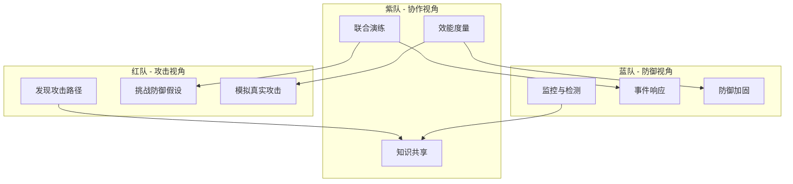
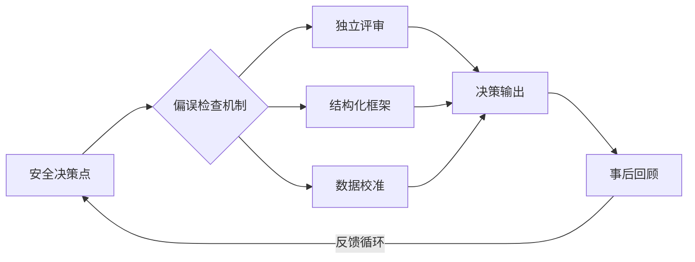

## 六、认知偏误与安全思维

安全分析本质上是一种认知活动——人类大脑在不确定性条件下做出判断和决策。然而，人类的认知系统并非为精确的安全推理而设计。数百万年的进化塑造了一套依赖启发式（heuristics）的快速判断机制，这套机制在日常生活中高效运作，却在安全分析中频频制造盲区。

认知偏误不是"愚蠢"的表现，而是人类认知架构的固有特征。即便是经验丰富的安全专家，也无法仅凭意志力消除偏误——只能通过结构化方法和工具来识别、对冲和缓解它们。

理解认知偏误对安全从业者有三重价值：第一，提升自身分析的准确性和完整性；第二，理解攻击者如何利用目标的认知偏误实施社会工程；第三，在团队协作和安全文化建设中设计"防偏误"的流程和制度。

### 6.1 认知偏误的心理学基础

#### 6.1.1 双系统理论与安全决策

诺贝尔经济学奖得主 Daniel Kahneman 在《思考，快与慢》中提出的双系统理论，是理解安全领域认知偏误的核心框架：

| 维度 | 系统 1（快思考） | 系统 2（慢思考） |
|------|------------------|------------------|
| 运行方式 | 自动、无意识、快速 | 刻意、有意识、缓慢 |
| 能耗 | 低（节能模式） | 高（费力模式） |
| 安全场景示例 | "这个端口一看就是 SSH" | "让我逐步分析这个协议的握手过程" |
| 偏误风险 | 高（依赖经验和直觉） | 低（但容易疲劳和放弃） |
| 典型偏误 | 可得性偏误、锚定效应 | 确认偏误（有意识地选择性搜索） |

安全分析中的大部分严重失误来自系统 1 的自动判断——当分析师凭"直觉"排除某个攻击路径时，往往是系统 1 在用最少的认知资源做了一个看似合理的判断。而系统 2 虽然更精确，但认知资源有限，长时间高强度分析后容易退化为系统 1 主导。

**实践启示**：关键安全决策（如上线审批、渗透测试范围界定、漏洞定级）必须强制触发系统 2——通过检查清单、结构化评审和强制等待期来实现。

#### 6.1.2 进化视角：为什么大脑"设计"了偏误

认知偏误并非缺陷，而是在资源有限条件下实现近似最优决策的适应性机制：

- **节能**：大脑消耗身体约 20% 的能量，快速启发式判断大幅降低能耗
- **速度**：在危险环境中，快速反应比精确判断更有生存价值（"宁可误报也不漏报"）
- **信息压缩**：面对海量信息，大脑通过模式匹配和经验法则压缩信息

但安全分析恰恰需要反直觉的思考方式：攻击者寻找的正是被大多数人忽略的路径。这意味着安全从业者需要有意识地对抗大脑的默认模式。

### 6.2 安全领域核心认知偏误

以下按安全分析中的危害程度排序，逐一深入分析每种偏误的机制、表现、真实案例和识别方法。

#### 6.2.1 确认偏误（Confirmation Bias）

**定义**：倾向于搜索、解释和记忆支持已有假设的信息，同时忽略或低估与之矛盾的信息。

**认知机制**：大脑为维护认知一致性，会主动过滤"不协调"信息。这不是有意为之，而是自动发生的认知过滤过程。

**安全场景中的典型表现**：

- 渗透测试人员认定了 SQL 注入是主要风险后，只专注于寻找 SQL 注入点，忽略了同样严重的 SSRF 漏洞
- 安全审计中，审计人员已经"感觉"某个模块有漏洞，于是只在这个模块深入挖掘，跳过了其他模块的常规检查
- 事件响应中，团队认定了入侵路径是 A，于是所有取证工作都围绕 A 展开，错过了攻击者的真正入口 B
- 安全产品评估时，评估者已有偏好，只关注该产品的优势指标，忽略其短板

**真实案例**：2013 年 Target 数据泄露事件中，安全团队的 FireEye 系统多次发出告警，但值班人员将注意力集中在他们预期的威胁模式上，忽略了异常的数据外传行为。告警被标记为"误报"后未进一步调查，最终导致 4000 万张信用卡信息泄露。

**识别信号**：

- 你在分析开始前就已经有了结论
- 你只搜索支持某个假设的证据
- 你对反面证据的第一反应是"这个不重要"或"这是误报"
- 团队讨论中没有人提出反对意见

**对冲方法**：

1. **逆向假设法**：主动假设自己的结论是错的，然后寻找反驳证据。例如："如果这个系统不是通过 SQL 注入被入侵的，那可能是哪些途径？"
2. **竞争假设分析（ACH）**：维护多个竞争假设，系统性地评估每个证据对每个假设的支持/削弱程度（详见 6.3.1 节）
3. **红队强制视角**：指定团队成员专门扮演反对者角色，负责挑战主流观点

#### 6.2.2 锚定效应（Anchoring Effect）

**定义**：决策过度依赖最初接收到的信息（"锚点"），后续判断围绕锚点进行调整，但调整通常不充分。

**认知机制**：大脑将锚点作为参考原点，所有后续判断都相对于这个原点进行。即使锚点明显不相关，这种效应依然存在。

**安全场景中的典型表现**：

- 客户声称"我们的系统很安全"，后续渗透测试的范围和深度可能因此被无意识地缩减
- CVSS 评分 7.5 的漏洞在特定业务场景下可能实际危害远超评分 9.0 的漏洞，但评分成了锚点
- 第一个被发现的漏洞成为攻击者能力的锚点，导致低估后续攻击的复杂度
- 预算审批时，安全项目的第一份报价成为后续所有讨论的基准，即使该报价本身不合理

**真实案例**：许多渗透测试报告中的风险评估受到初始 CVSS 评分的锚定。一个 CVSS 3.1 评分 6.5 的 XSS 漏洞，在单页应用（SPA）中配合 HttpOnly cookie 缺失，实际可以实现完整账户接管，危害远超评分暗示的"中等"水平。但测试人员和管理者都倾向于参考数字锚点做出判断。

**识别信号**：

- 你的分析起点来自他人的结论或预设数值
- 后续发现的新信息没有导致结论的显著修正
- 你在评估时频繁引用某个初始数值或判断

**对冲方法**：

1. **独立评估优先**：在查看任何外部评分、报告或他人的分析之前，先形成自己的独立判断
2. **多锚点校准**：从不同的起点（极高风险 / 极低风险）分别推理，观察结论是否收敛
3. **场景化定级**：不依赖通用评分，而是根据具体业务场景、数据敏感度和攻击面重新评估风险

#### 6.2.3 可得性偏误（Availability Heuristic）

**定义**：倾向于高估容易回忆起来的事件的发生概率。最近发生的、印象深刻的或情绪强烈的事件在记忆中更"可得"。

**安全场景中的典型表现**：

- 勒索软件攻击频繁上新闻后，企业将全部安全预算投入防勒索软件，忽略了更可能发生的钓鱼攻击和内部威胁
- 读完一篇关于零日漏洞利用的报告后，高估零日攻击的风险，低估已知漏洞未修补带来的风险
- 最近成功修复了一个 SSRF 漏洞，于是把 SSRF 列为"我们的主要风险"，忽略了未做测试的其他 OWASP Top 10 类别
- 团队中某人经历过 APT 攻击，导致整个团队过度关注 APT 而忽视基础安全卫生

**数据对比**：根据 Verizon DBIR 报告多年数据统计：

| 威胁类型 | 实际占比 | 公众/媒体感知 | 偏差方向 |
|----------|----------|--------------|----------|
| 钓鱼/社会工程 | ~35-40% | "老套路了" | 严重低估 |
| Web 应用漏洞利用 | ~25-30% | 中等关注 | 基本准确 |
| 零日漏洞利用 | <1% | "最大威胁" | 严重高估 |
| APT/国家级攻击 | <5% | "无处不在" | 高估 |
| 内部威胁 | ~20-25% | "不常见" | 低估 |

**识别信号**：

- 风险评估结果与近期新闻/事件高度相关
- 安全投资集中于某一两个威胁类型
- "老生常谈"的风险被降级处理

**对冲方法**：

1. **数据驱动的威胁情报**：用实际数据（行业报告、自身日志统计）替代直觉判断
2. **年度威胁回顾**：定期回顾过去一年的真实安全事件，用统计数据校准感知
3. **威胁类型轮换评估**：强制按 OWASP Top 10 / MITRE ATT&CK 分类逐一评估，不跳过任何类别

#### 6.2.4 过度自信偏误（Overconfidence Bias）

**定义**：高估自己判断的准确性和知识的完备性。表现为置信区间过窄——"我 95% 确定这个系统没有 SQL 注入"实际上只覆盖了约 60-70% 的真实情况。

**安全场景中的典型表现**：

- 渗透测试人员在有限时间内宣布"系统没有发现严重漏洞"，客户将其理解为"系统是安全的"
- 开发者认为自己已经理解了所有安全风险，拒绝进行安全代码审查
- 安全架构师认为自己的设计方案"无懈可击"，不愿进行威胁建模评审
- CISO 基于有限信息向董事会保证"我们的安全态势良好"

**经典实验**：心理学研究表明，当人们说"我 99% 确定"时，实际正确率通常只有 70-80%。在安全领域，这种校准偏差更加严重——安全分析涉及大量未知变量和隐蔽因素。

**识别信号**：

- 使用"绝对安全"、"肯定没问题"、"100% 确定"等绝对化表述
- 拒绝接受进一步测试或审查的建议
- 无法明确说出自己的判断存在哪些假设和局限

**对冲方法**：

1. **校准训练**：通过大量二选一问题练习概率估计，然后对照答案校准（例如：GJP 超级预测者项目的方法）
2. **显式假设清单**：每项判断必须附带"此判断基于以下假设"的清单，强制暴露隐含前提
3. **预承诺区间**：在分析前声明"我预计发现 3-7 个中高危漏洞"，事后对比实际结果，训练校准能力

#### 6.2.5 幸存者偏差（Survivorship Bias）

**定义**：只关注"幸存者"（通过筛选的对象）而忽略"阵亡者"（未通过筛选的对象），导致对整体情况的错误判断。

**安全场景中的典型表现**：

- 只研究已被公开披露的漏洞利用案例，忽略了大量被成功防御或从未被发现的攻击
- 参考其他公司的安全方案时，只看到成功的案例（存活的公司会宣传），看不到失败的案例
- 安全工具评估只看"检测到了多少威胁"，看不到"遗漏了多少威胁"
- 研究安全从业者的职业路径时，只看到成功转型的人，忽略了大量失败转行的人

**识别信号**：

- 分析的数据来源只包含"成功的"或"被发现的"案例
- 结论缺乏对"未观察到的"样本的讨论
- "大家都这么做"的论证缺乏对"失败案例"的调查

**对冲方法**：

1. **主动寻找失败案例**：研究安全事件的"未遂"报告、被驳回的漏洞报告、失败的安全项目
2. **全样本思维**：在评估安全方案时，追问"采用这个方案但失败的案例有哪些？"
3. **基准率忽视检测**：当结论缺少基准率（base rate）数据时，标记为"信息不完整"

#### 6.2.6 正常化偏差（Normalcy Bias）

**定义**：倾向于低估灾难性事件发生的可能性和影响，认为"事情会像往常一样继续"。

**安全场景中的典型表现**：

- "我们已经用了 5 年都没出过安全事件，所以我们的安全措施是足够的"
- 面对安全告警时的第一反应是"可能是误报"而不是"可能是真实攻击"
- 发现异常日志后，倾向于寻找正常解释而非攻击解释
- 安全预算在和平时期被不断削减，直到事件发生后才紧急增加

**真实案例**：Equifax 在 2017 年泄露 1.47 亿用户数据之前，其安全团队已经多次报告了 Apache Struts 漏洞的风险，但组织内部的正常化偏差导致修补工作被无限期推迟——"之前一直没出事"的惯性思维压过了及时响应的紧迫性。

**识别信号**：

- 对安全告警的响应时间持续增长
- 安全预算/人员持续缩减但无人提出异议
- "没出过事"被当作安全性的证据

**对冲方法**：

1. **红队演练常态化**：定期进行不预告的红队/紫队演练，打破"岁月静好"的幻觉
2. **"假设今天被入侵"练习**：定期问自己"如果我们今天被入侵了，攻击者可能是从哪里进来的？"
3. **安全事件桌面推演**：每季度进行一次事件响应桌面推演，保持应急状态的敏锐度

#### 6.2.7 后见之明偏差（Hindsight Bias）

**定义**：事后认为事件的发生是"显而易见的"或"完全可以预见的"——"我早就知道会这样"。

**安全场景中的典型表现**：

- 安全事件事后分析中，团队认为"漏洞很明显，不应该被遗漏"
- 渗透测试报告的读者认为发现的漏洞"一看就知道"，低估了发现它们所需的专业能力
- 安全培训中使用已知案例教学，学员误以为实际分析也是这么"显而易见"
- 对安全从业者的不公正指责："这么明显的漏洞你怎么没发现？"

**危害**：后见之明偏差严重阻碍从安全事件中真正学习。当人们认为事件是"显而易见"的，就不会深入分析真正的根因和系统性问题。

**对冲方法**：

1. **时间线还原法**：事件复盘时，严格按事件发生前的信息状态重建分析过程，不使用事后信息
2. **"如果当时知道"清单**：明确列出"在事件发生时，我们不知道哪些关键信息"
3. **无指责事后分析（Blameless Postmortem）**：建立不追究个人责任、专注于系统改进的事后分析文化

#### 6.2.8 群体思维（Groupthink）

**定义**：团队为了维护和谐和一致性，压制异见和批判性思考，导致集体做出不合理的决策。

**安全场景中的典型表现**：

- 安全评审会议中，初级成员不敢质疑高级成员的判断
- 团队对某个安全方案达成快速共识，没有经过充分的利弊分析
- "大家都在用这个框架/工具，所以它一定是好的"
- 安全事件响应中，权威人士过早下结论，其他人不再提出替代假设

**经典案例**：1986 年挑战者号航天飞机灾难中，工程师对 O 型环在低温下的安全性存在担忧，但在群体压力下未能有效阻止发射决策。安全领域中，类似场景每天都在发生——有人注意到了异常，但群体一致性压力阻止了深入调查。

**识别信号**：

- 会议中一致通过，无人提出反对意见
- 异见者被贴上"不合群"或"过度焦虑"的标签
- 决策过程过快，缺少对立观点的充分讨论

**对冲方法**：

1. **指定魔鬼代言人**：每次安全评审指定一人专门负责提出反对意见和替代假设
2. **匿名反馈机制**：允许团队成员匿名提交安全顾虑
3. **分组独立评估**：重大决策由两个独立小组分别评估，然后对比结论
4. **外部专家引入**：定期引入外部安全顾问提供独立视角

#### 6.2.9 沉没成本谬误（Sunk Cost Fallacy）

**定义**：因为已经投入了大量资源（时间、金钱、精力），而继续坚持一个明显不合理的决策。

**安全场景中的典型表现**：

- 已经部署了某安全产品多年，即使它已不适应当前威胁环境，也不愿更换
- 渗透测试中花了 3 天分析一个可疑行为，即使证据表明它是合法的，也不愿放弃
- 安全项目已经投入大量预算但方向错误，因为"已经花了这么多钱"而继续追加
- 自研安全工具已经开发了 80%，即使市面上有更好的开源替代方案，也坚持完成开发

**对冲方法**：

1. **零基假设**：定期问自己"如果今天从零开始，我还会做同样的选择吗？"
2. **增量评估**：只评估"继续投入的增量收益"，不考虑已投入的成本
3. **预设止损点**：在项目开始前定义明确的"放弃条件"

#### 6.2.10 达克效应（Dunning-Kruger Effect）

**定义**：能力不足的人倾向于高估自己的能力，而真正有能力的人反而倾向于低估自己。

**安全场景中的典型表现**：

- 初学安全的人在成功完成几个 CTF 题目后，认为自己可以胜任真实渗透测试
- 安全培训后的开发者认为自己已经"学会了安全"，对安全编码产生虚假的自信
- 经验丰富的安全专家反而对自己的判断过度谨慎，导致决策迟缓
- "学了两个月渗透测试"的新人在安全评审中对资深架构师的安全设计提出"质疑"

**安全领域的特殊危害**：达克效应在安全领域尤其危险，因为安全是一个"不知道自己不知道什么"的领域。表面上的安全测试通过可能给人虚假的安全感。

**对冲方法**：

1. **能力自评校准**：定期进行标准化安全能力测试，将自评与客观成绩对比
2. **知识边界标注**：在安全报告中明确标注"我擅长的领域"和"超出我专业范围的部分"
3. **渐进式授权**：安全职责按能力等级逐步授予，不因自评而跳级

#### 6.2.11 框架效应（Framing Effect）

**定义**：同一信息以不同方式呈现时，会导致截然不同的决策。

**安全场景中的典型表现**：

- "这个漏洞影响 10% 的用户" vs "90% 的用户不受影响"——同一个事实导致不同的风险感知
- "部署 WAF 后可防御 85% 的 Web 攻击" vs "部署 WAF 后仍有 15% 的 Web 攻击无法防御"
- 安全预算审批中，"投入 100 万可降低 60% 风险"比"不投入 100 万可能损失 500 万"更容易通过
- 漏洞报告的措辞影响开发团队的修复优先级

**对冲方法**：

1. **双向陈述**：每项关键判断同时用正面和负面两种方式陈述
2. **绝对数字 + 比例并列**：同时提供绝对数量和百分比（"影响 10,000 个用户，占 10%"）
3. **独立撰写报告**：不同分析师独立撰写同一评估，对比框架差异

### 6.3 结构化去偏方法论

单靠"意识到偏误的存在"无法有效对抗它们。需要借助结构化的分析框架和工具，将去偏过程嵌入分析流程本身。

#### 6.3.1 竞争假设分析（Analysis of Competing Hypotheses, ACH）

ACH 是 CIA 分析师 Richards Heuer 开发的结构化分析方法，专门用于对抗确认偏误。

**操作步骤**：

1. **列出所有可能的假设**：不少于 3 个，包括你认为不太可能的假设
2. **列出相关证据**：收集所有与判断相关的证据和信息
3. **创建矩阵**：假设为列，证据为行
4. **评估一致性**：每条证据对每个假设是一致（+）、不一致（-）还是中性（0）
5. **评估证据可靠性**：为每条证据标注可靠性权重（高/中/低）
6. **计算总分**：汇总每个假设的一致性得分
7. **重新审视**：重点关注"不一致"的证据，而非"一致"的证据

**示例——安全事件根因分析**：

| 证据 / 假设 | H1: SQL 注入 | H2: 凭据泄露 | H3: 内部人员 |
|------------|-------------|-------------|-------------|
| 数据库日志显示异常查询 | + | - | + |
| 无暴力破解告警 | + | + | + |
| 受影响账户使用了强密码 | - | - | + |
| 攻击发生在非工作时间 | + | + | - |
| Web 应用存在未修补的输入验证缺陷 | + | - | - |
| VPN 日志无异常 | + | + | - |

ACH 的核心价值：迫使分析者系统性地考虑所有假设和所有证据，特别是关注"不一致"的证据——这些恰恰是确认偏误最容易忽略的。

#### 6.3.2 预mortem 分析（Pre-Mortem Analysis）

由心理学家 Gary Klein 提出，在项目或决策实施前，假设"这个项目已经失败了"，然后倒推可能的失败原因。

**在安全分析中的应用**：

1. 假设"这次渗透测试遗漏了一个严重漏洞"
2. 团队成员各自独立列出可能的遗漏原因：
   - "测试范围定义过于狭窄"
   - "对新技术栈（如 GraphQL）的攻击手法不熟悉"
   - "时间压力导致跳过了某些测试用例"
   - "客户的网络拓扑信息不完整"
3. 汇总所有原因，制定针对性的预防措施

**与事后分析的区别**：事后分析在事件发生后进行，容易受后见之明偏差影响；预mortem 在事件发生前进行，能提前识别被低估的风险。

#### 6.3.3 红队/蓝队/紫队协作模型

通过组织结构设计来对抗个体和群体的认知偏误：



红队天然对抗蓝队的正常化偏差和确认偏误，而紫队协作确保对抗过程中产生的知识被系统性地吸收。

#### 6.3.4 结构化分析检查清单

在每次安全分析的关键节点，过一遍以下检查清单：

**分析开始前**：

- [ ] 我是否已经有一个"直觉上"的结论？如果有，主动寻找反面证据
- [ ] 我是否受到了某个初始信息的锚定？尝试从不同起点重新分析
- [ ] 我最近关注的安全事件是否影响了我对当前风险的判断？
- [ ] 团队中是否有人持不同意见？如果有，花时间认真听取

**分析过程中**：

- [ ] 我是否只搜索了支持当前假设的证据？
- [ ] 我是否考虑了至少 3 种不同的攻击路径/假设？
- [ ] 我的判断有哪些隐含假设？这些假设是否经过验证？
- [ ] 我是否因为已经在某个方向上投入了大量时间而不愿改变方向？

**分析完成后**：

- [ ] 如果我的结论是错的，最可能的原因是什么？
- [ ] 我的置信度是否合理？是否有过度自信的迹象？
- [ ] 一个持不同观点的同行会如何评价我的分析？
- [ ] 我是否将"未发现漏洞"正确地表述为"在给定范围内未发现"而非"系统安全"？

### 6.4 攻击者如何利用认知偏误

理解认知偏误不仅是防御者的需求，攻击者早已将利用认知偏误发展为系统性的攻击技术。

#### 6.4.1 社会工程中的偏误利用

| 攻击技术 | 利用的偏误 | 具体手法 |
|----------|-----------|---------|
| 钓鱼邮件 | 权威偏误、紧迫感 | 伪装成 CEO/CFO 发出"紧急"转账指令 |
| 预文本攻击 | 锚定效应 | 先建立一个可信身份（锚点），再提出后续请求 |
| 水坑攻击 | 可得性偏误 | 攻击目标经常访问的网站，利用"熟悉的=安全的"心理 |
| 诱饵攻击 | 好奇心偏误 | 在停车场留下标注"薪资表"的 USB 设备 |
| 尾随进入 | 从众效应 / 礼貌偏误 | 双手抱满文件等在门禁旁，利用路人的"帮忙开门"本能 |
| CEO 欺诈 | 权威偏误 + 紧迫感 | 冒充高层发出"保密且紧急"的指令 |
| 假冒技术支持 | 专业权威偏误 | 伪装 IT 部门要求"验证密码" |

#### 6.4.2 技术攻击中的偏误利用

攻击者不仅在社会工程中利用认知偏误，在技术攻击中同样如此：

1. **隐蔽通道利用正常化偏差**：将恶意流量伪装成正常的 HTTPS/DNS 流量，利用防御者"这些都是正常流量"的心理
2. **低慢速攻击利用可得性偏误**：以极低频率发动攻击（如每天尝试一次密码），不在告警阈值内，利用防御者只关注"大量异常"的思维
3. **多阶段攻击利用注意力偏误**：第一阶段制造一个明显的"小事件"吸引防御者注意力，第二阶段在防御者忙于处理"小事件"时实施真正的攻击
4. **供应链攻击利用信任偏误**：攻击可信的第三方供应商，利用下游用户对"可信来源"的不加验证

### 6.5 组织层面的去偏机制

个人层面的去偏方法效果有限，因为认知偏误是系统性的。真正有效的是在组织层面设计"防偏误"的流程和制度。

#### 6.5.1 安全流程中的去偏设计



**具体制度设计**：

| 流程 | 防偏机制 | 对抗的偏误 |
|------|---------|-----------|
| 安全架构评审 | 要求至少 2 名独立评审者 | 确认偏误、群体思维 |
| 漏洞定级 | 结合 CVSS + 业务场景评估，不依赖单一评分 | 锚定效应 |
| 告警分流 | 设置固定的最大误报容忍率，避免因疲劳而忽略告警 | 正常化偏差、疲劳效应 |
| 安全预算 | 用威胁情报数据而非直觉驱动预算分配 | 可得性偏误 |
| 事件响应 | 预定义的剧本（playbook）+ 强制检查清单 | 压力下的系统 1 退化 |
| 渗透测试范围 | 由独立于开发团队的人员定义测试范围 | 利益冲突、确认偏误 |

#### 6.5.2 安全文化建设中的去偏

1. **无指责文化**：鼓励报告安全问题而不担心被追责，降低群体思维的抑制效应
2. **安全冠军计划**：在每个开发团队中培养安全冠军，提供多元视角
3. **定期红队演练**：通过真实的对抗打破组织的正常化偏差
4. **安全指标仪表盘**：用数据而非故事驱动安全决策，对抗可得性偏误
5. **轮岗制度**：安全分析师定期轮换负责的系统/领域，防止对特定系统形成锚定

### 6.6 认知偏误的自我训练

#### 6.6.1 偏误日记

建立日常的偏误意识训练：

1. **记录偏误时刻**：每天回顾一次分析或决策过程，识别可能的偏误影响
2. **标注偏误类型**：对每个识别出的偏误标注具体类型
3. **制定替代策略**：对每个偏误场景设计一个"如果重来我会怎么做"的替代方案
4. **月度回顾**：每月统计偏误类型分布，识别自己的"偏误模式"

**偏误日记模板**：

```text
日期：YYYY-MM-DD
场景描述：[什么分析/决策中出现了偏误？]
偏误类型：[确认偏误 / 锚定效应 / ...]
表现形式：[具体表现是什么？]
影响程度：[对分析/决策造成了多大影响？]
识别时机：[事前/事中/事后 识别到的？]
替代策略：[下次遇到类似场景应如何应对？]
```

#### 6.6.2 校准训练

定期进行概率校准训练，提升对不确定性的判断精度：

- **二选一校准**：回答大量"哪个更大/更多？"的问题，练习给出准确的概率估计
- **置信区间练习**：给出数值范围估计（"我 90% 确定这个数值在 X 到 Y 之间"），检验实际命中率
- **安全场景模拟**：基于历史安全事件数据，练习风险概率估计，事后与实际统计对比

#### 6.6.3 推荐阅读

| 书名 | 作者 | 核心价值 |
|------|------|---------|
| 《思考，快与慢》 | Daniel Kahneman | 认知偏误的经典理论框架 |
| 《超预测》 | Philip Tetlock | 概率校准和预测训练方法 |
| 《情报分析心理学》 | Richards Heuer | ACH 方法和情报分析去偏技术 |
| 《助推》 | Richard Thaler, Cass Sunstein | 通过选择架构设计对抗偏误 |
| 《黑天鹅》 | Nassim Taleb | 对抗正常化偏差和过度自信 |
| 《清单革命》 | Atul Gawande | 用检查清单对抗系统性失误 |

### 6.7 AI 时代的认知偏误新维度

随着 AI/ML 在安全领域的广泛应用，认知偏误呈现出新的形式：

#### 6.7.1 自动化偏误（Automation Bias）

**定义**：过度信任自动化系统的输出，放松了人类自身的判断和验证。

**安全场景**：

- SIEM 系统未告警 → 分析师认为"没有问题"（实际可能是检测规则未覆盖）
- AI 代码扫描工具报告"无漏洞" → 开发者跳过人工安全审查
- 自动化渗透工具输出"低风险" → 测试人员不进行深入手动测试

**数据警示**：研究表明，在有自动化辅助的情况下，人类的漏检率反而可能上升——因为人们对自动化系统产生了依赖，降低了自身的警惕性。

**对冲方法**：

1. **人工复核强制要求**：关键安全决策中，自动化工具的输出必须经过人工复核
2. **工具能力边界标注**：明确每个安全工具的覆盖范围和已知盲区
3. **定期"无工具"演练**：在不依赖自动化工具的条件下进行安全分析，保持核心能力

#### 6.7.2 AI 输出中的偏误传播

AI 模型本身可能继承和放大数据偏误：

- 训练数据中某类漏洞被过度代表 → AI 模型对该类漏洞过度敏感
- 训练数据缺乏某些场景 → AI 模型对这些场景存在系统性盲区
- AI 安全工具的"置信度"输出可能被用户错误地理解为"准确度"

**实践建议**：将 AI 安全工具的输出视为"参考信息"而非"最终判断"，始终保持批判性审视。

### 6.8 总结

认知偏误是安全分析中最隐蔽也最普遍的风险因素。它不像技术漏洞那样可以被扫描器发现，也不像配置错误那样可以通过基线检查来预防。它根植于人类认知的底层架构，只能通过持续的意识培养、结构化的分析方法和组织层面的制度设计来对抗。

核心要点回顾：

1. **偏误是系统性的**：不是个人缺陷，而是人类认知的固有特征，需要系统性对策
2. **意识是必要但不充分的**：知道偏误的存在无法消除它，必须借助结构化工具
3. **组织设计比个人努力更有效**：通过流程、角色和制度设计来嵌入去偏机制
4. **持续训练是关键**：偏误意识和校准能力需要像技术技能一样持续练习
5. **攻击者也在利用偏误**：理解偏误不仅是为了提升防御，也是为了理解攻击者的策略

安全从业者的核心竞争力之一，就是在高压、不确定和信息不完整的条件下做出尽可能准确的判断——而对抗认知偏误正是这项能力的基石。
