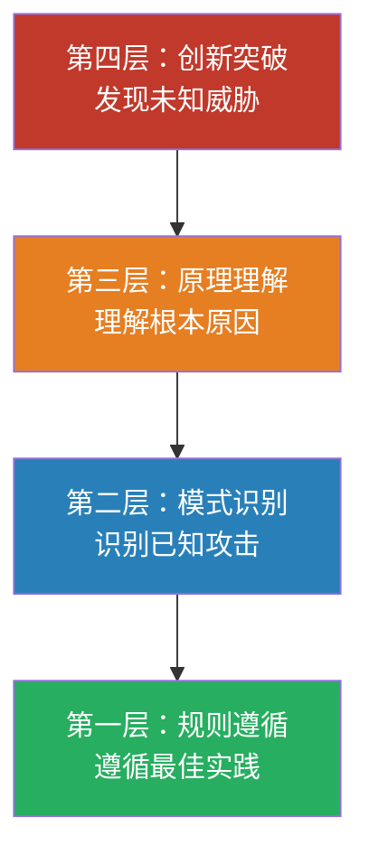
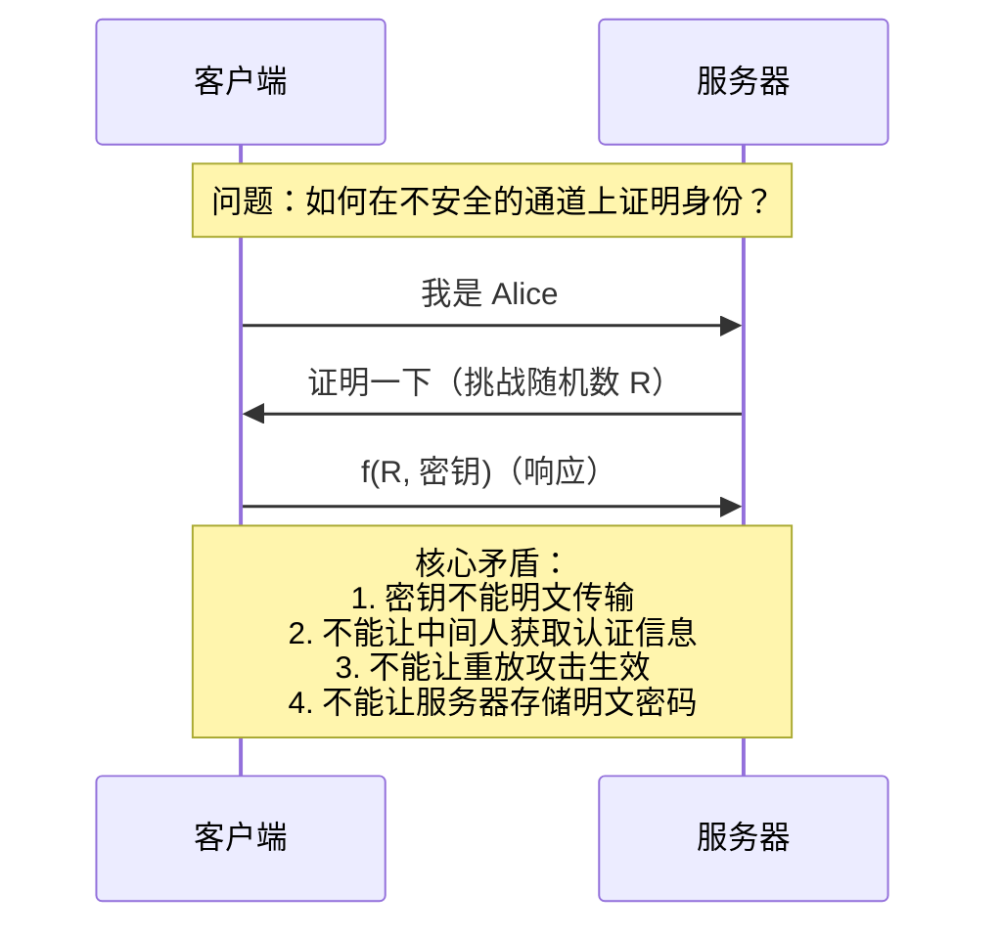
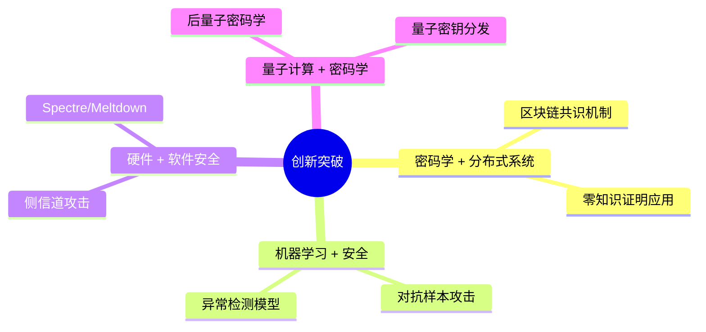
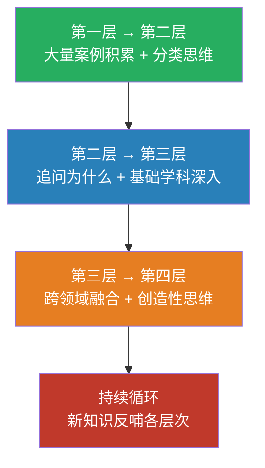

## 七、安全思维的层次模型

安全思维不是一蹴而就的能力，而是沿着一条清晰的路径逐步进阶的过程。理解这条路径上的层次划分，能帮助你准确定位自己当前所处的阶段，明确下一步的提升方向，避免在错误的层次上投入过多精力。

本节提出的四层模型——**规则遵循、模式识别、原理理解、创新突破**——并非凭空创造，而是对大量安全从业者成长轨迹的归纳总结。每一层都建立在前一层的基础之上，跳层学习往往导致根基不稳。



### 7.1 第一层：规则遵循（Rule Following）

**核心特征**：依赖已知的安全规则、最佳实践和合规要求来保护系统。

这一层是所有安全从业者的起点。你不需要理解规则背后的深层原理，只需要知道"应该做什么"和"不应该做什么"，然后严格执行。

**典型行为模式**：

| 行为类别 | 具体表现 | 实际案例 |
|---------|---------|---------|
| 密码安全 | 使用强密码、定期更换、不同系统不同密码 | 遵循 NIST SP 800-63B 密码指南，长度≥12位 |
| 补丁管理 | 及时应用安全更新 | 每月第二个周二跟进微软补丁星期二 |
| 编码规范 | 遵循 OWASP 安全编码实践 | 输入验证、参数化查询、输出编码 |
| 工具部署 | 按照厂商指南安装安全工具 | 部署 WAF、IDS/IPS、SIEM |
| 合规遵循 | 满足行业安全标准要求 | PCI DSS、ISO 27001、等保要求 |

**实际场景示例**：

一个初级开发者接到任务，需要实现用户登录功能。他在规则遵循层的典型做法是：

1. 密码存储使用 bcrypt（因为安全规范说"不要用 MD5 存密码"）
2. 登录接口添加速率限制（因为最佳实践要求"防止暴力破解"）
3. 使用 HTTPS 传输（因为合规要求"必须加密传输"）
4. 实现密码复杂度检查（因为公司安全策略规定了密码规则）

每一步都是正确的，但他可能并不清楚 bcrypt 为什么比 MD5 安全、速率限制的阈值应该如何设定、HTTPS 的握手过程如何防止中间人攻击。

**这一层的价值**：

规则遵循层的最大价值在于**建立安全基线**。它确保了最基本的防护措施到位，避免了低级错误。根据 Verizon《数据泄露调查报告》，超过 80% 的数据泄露涉及弱密码、未打补丁的漏洞等基本安全缺失——这些恰恰是规则遵循层能够解决的问题。

**局限性**：

- **只能防御已知威胁**：规则是基于历史经验总结的，面对零日漏洞或新型攻击无能为力
- **容易僵化**：当环境变化时，旧规则可能不再适用，但执行者仍在机械遵循
- **缺乏优先级判断**：无法判断哪些规则在当前场景下最重要
- **容易产生虚假安全感**：认为"遵循了所有规则就安全了"

**如何判断自己是否在这一层**：

- 你的安全决策主要来自文档、规范、检查清单
- 你很少问"为什么"，更多是执行"怎么做"
- 面对新场景时，你的第一反应是查找相关规范
- 你对安全工具的理解停留在"怎么配置"，而非"怎么工作"

### 7.2 第二层：模式识别（Pattern Recognition）

**核心特征**：能够识别攻击的共性模式，将具体案例归类到已知攻击类型中。

从第一层到第二层的跨越，意味着你开始**主动思考**安全问题，而不仅仅是被动遵循规则。你不再只是"按清单操作"，而是能够看到不同攻击之间的共性。

**模式识别的核心能力**：

**1. 攻击特征识别**

你能从系统日志、网络流量、代码片段中识别出攻击的"指纹"：

```python
# 模式识别层：看到这段代码，立刻识别出 SQL 注入模式
query = f"SELECT * FROM users WHERE name = '{user_input}'"
# 特征：字符串直接拼接到 SQL 语句中，没有参数化

# 更隐蔽的模式——二次注入
# 第一步：存储恶意数据（看起来无害）
cursor.execute("INSERT INTO users (name) VALUES (%s)", [user_input])
# 第二步：在另一个查询中不安全地使用存储的数据
cursor.execute(f"UPDATE profiles SET bio = '{stored_name}' WHERE id = 1")
# 模式识别：即使输入时做了验证，使用时不做处理仍然存在风险
```

**2. 攻击链识别**

你能够看到单个事件之间的关联，识别出完整的攻击链：


**3. 社会工程学模式**

你能够识别社会工程学攻击的典型套路：

- **紧迫感制造**："您的账户将在 24 小时内被冻结"
- **权威伪装**："我是 IT 部门，需要验证您的密码"
- **互惠原则**："这是免费的安全工具，请安装"
- **信息拼凑**：攻击者从多个公开来源收集目标信息，使攻击看起来更可信

**模式识别的进阶工具**：

| 工具/方法 | 用途 | 适用场景 |
|----------|------|---------|
| MITRE ATT&CK | 攻击技术分类与映射 | 威胁情报分析、红队规划 |
| YARA 规则 | 恶意软件特征匹配 | 恶意代码检测、威胁狩猎 |
| Sigma 规则 | SIEM 检测规则标准化 | 安全监控、事件响应 |
| 攻击树 | 攻击路径可视化 | 风险评估、渗透测试规划 |
| STRIDE 威胁分类 | 威胁类型结构化识别 | 应用安全评审 |

**实际场景示例**：

安全分析师在监控 SIEM 告警时，看到以下事件序列：

1. 某员工在非工作时间从境外 IP 登录 VPN
2. 该账户在 30 分钟内访问了 15 台内部服务器
3. 其中一台服务器上出现了 PowerShell 异常执行
4. 大量数据从文件服务器流向一个外部 IP

模式识别层的分析师会立刻意识到这是一个典型的 **APT 横向移动 + 数据外泄** 模式，而不是孤立处理每个告警。

**从第一层到第二层的跃迁关键**：

- **大量案例积累**：阅读安全事件报告、CVE 分析、CTF 题解
- **分类思维训练**：将零散知识归类到攻击类型框架中
- **实战演练**：通过 CTF、靶场、漏洞复盘加深理解
- **跨领域类比**：将网络攻击模式与现实世界的安全威胁类比

### 7.3 第三层：原理理解（Principle Understanding）

**核心特征**：不仅知道"是什么"和"怎么做"，还深刻理解"为什么"。

这是安全思维的关键分水岭。从第二层到第三层的跨越，意味着你不再满足于识别已知模式，而是深入到安全问题的**根本原因**。你能够从系统设计、协议原理、计算机科学基础的层面理解安全问题。

**原理理解的核心维度**：

**1. 漏洞的根本原因**

以缓冲区溢出为例，不同层次的理解深度截然不同：

| 层次 | 理解内容 |
|------|---------|
| 规则遵循层 | "不要使用 strcpy，要用 strncpy" |
| 模式识别层 | "这段代码存在栈溢出的风险，因为没有检查输入长度" |
| 原理理解层 | "C 语言不进行数组边界检查，栈上的返回地址可以被覆盖，从而劫持控制指令流。这源于冯·诺依曼架构中数据和指令共享同一地址空间的根本设计" |

**2. 协议设计的根本挑战**

以认证协议为例：



在原理理解层，你明白认证协议设计的根本挑战在于**在不可信的通信环境中建立可信的身份绑定**。这涉及到密码学、协议设计、分布式系统一致性等多个基础领域的交叉。

**3. 权限模型的内在张力**

安全的核心矛盾之一是**可用性与安全性的平衡**。在原理理解层，你能看到这个矛盾在不同场景下的具体表现：

- **最小权限原则 vs. 操作便利性**：权限越小越安全，但频繁的权限申请会降低效率
- **默认拒绝 vs. 功能开放**：默认拒绝最安全，但可能阻碍合法使用
- **集中控制 vs. 分布式自治**：集中管理便于审计，但单点故障风险高
- **透明审计 vs. 隐私保护**：全面监控有助于安全，但可能侵犯用户隐私

**4. 密码学的基本原理和限制**

原理理解层对密码学的理解不是"会调用加密 API"，而是理解：

- **对称加密**：为什么 AES 的 S-Box 设计能抵抗差分密码分析和线性密码分析
- **非对称加密**：为什么 RSA 的安全性基于大整数分解的计算困难性，而椭圆曲线密码在更短的密钥长度下提供等价安全性
- **哈希函数**：为什么 SHA-256 的抗碰撞性对数字签名至关重要
- **密钥交换**：Diffie-Hellman 协议如何在公开信道上安全地协商共享密钥
- **前向保密**：为什么每次会话使用临时密钥能防止历史通信被解密

**原理理解的培养路径**：

1. **阅读经典论文和标准**：不要只读博客，去读原始的 RFC、论文和标准文档
2. **动手实现**：自己实现一个简单的加密协议，亲身体验设计中的坑
3. **逆向分析**：通过逆向工程理解软件的内部工作原理
4. **系统性学习**：计算机体系结构、操作系统、网络协议、密码学——这些基础学科是原理理解的根基
5. **质疑一切**：对每个"最佳实践"都追问"为什么这是最佳实践"

**实际场景示例**：

团队在讨论是否应该在微服务架构中使用 JWT 进行服务间认证。不同层次的思考：

- **规则遵循层**："JWT 是行业标准，我们应该使用它"
- **模式识别层**："JWT 有已知的安全问题，比如算法混淆攻击（alg:none），需要防范"
- **原理理解层**："JWT 的无状态特性意味着一旦签发就无法撤销。在微服务场景中，如果某个服务被攻陷，攻击者可以使用窃取的 JWT 在整个系统中横向移动。我们需要权衡无状态带来的性能优势与可控撤销的安全需求，可能需要引入短期 Token + 刷新机制"

### 7.4 第四层：创新突破（Innovation Breakthrough）

**核心特征**：能够发现全新的攻击向量，设计创新的安全方案，在看似安全的系统中找到弱点。

这是安全思维的最高层次，也是安全研究者追求的境界。创新突破层不是简单的"更高级的第三层"，而是一种**思维方式的根本转变**——从"学习已有知识"转向"创造新知识"。

**创新突破的核心表现**：

**1. 发现全新的漏洞类型**

历史上，每一次新的漏洞类型被发现，都深刻改变了安全行业：

| 年份 | 漏洞类型 | 发现者/事件 | 影响 |
|------|---------|------------|------|
| 1988 | 缓冲区溢出 | Morris 蠕虫 | 开创了内存安全研究 |
| 1996 | 格式化字符串漏洞 | 影子攻击者 | 扩展了代码审计范围 |
| 1998 | 缓冲区溢出利用 | Solar Designer | 开创了漏洞利用技术 |
| 2007 | XSS（跨站脚本） | 正式命名和分类 | Web 安全的基础威胁 |
| 2011 | 原型污染 | JavaScript 生态 | 动态语言安全新领域 |
| 2014 | Heartbleed | OpenSSL 漏洞 | 重新审视开源代码安全 |
| 2021 | Log4Shell | Log4j 漏洞 | 供应链安全的警钟 |

**2. 跨领域创新**

真正的突破往往来自于跨领域的知识融合：



**3. 逆向工程思维的极致**

在创新突破层，你不仅能够理解系统的设计意图，还能看到设计意图之外的可能性：

- **Spectre/Meltdown**：利用 CPU 推测执行的副作用来读取本应受保护的内存——这不是传统意义上的"漏洞"，而是硬件设计特性的意外安全后果
- **Rowhammer**：通过频繁访问 DRAM 的特定行来翻转相邻行的比特——利用的是物理硬件的物理特性
- **GSM 降级攻击**：强制移动网络使用较弱的加密算法——利用的是向后兼容性设计

**创新突破的培养条件**：

创新突破层没有捷径，但有几个关键条件：

1. **深厚的基础积累**：多年的技术积累，对计算机系统的各个层面都有深入理解
2. **跨领域知识**：不仅懂安全，还懂硬件、密码学、分布式系统、人工智能等
3. **创造性思维**：能够跳出既定框架，从全新的角度看问题
4. **耐心和毅力**：创新往往需要长时间的深入思考和反复试验
5. **社区参与**：与顶级安全研究者交流，参与前沿研究项目
6. **保持好奇心**：对"为什么这个系统是安全的"保持质疑

**实际场景示例**：

想象一个安全研究者在分析一个"理论上安全"的系统。该系统使用了行业标准的加密算法、遵循了最佳实践、通过了所有合规审计。

创新突破层的研究者可能会：

1. 不质疑加密算法本身，而是质疑**随机数生成器的熵源质量**
2. 不攻击认证协议，而是攻击**实现中的时序差异**（侧信道）
3. 不找代码漏洞，而是找**业务逻辑中的竞态条件**
4. 不破坏系统，而是利用**系统的合法功能组合**产生意外行为

### 7.5 层次间的跃迁与融合

四个层次不是彼此割裂的，而是相互渗透、持续融合的过程。

**跃迁的关键驱动力**：



**层次融合的实际表现**：

一个成熟的安全专家在实际工作中会同时运用所有层次：

- **日常运维**：遵循规则（第一层），确保基本安全措施到位
- **事件响应**：运用模式识别（第二层），快速判断攻击类型
- **架构评审**：运用原理理解（第三层），从根本上评估设计方案
- **安全研究**：运用创新突破（第四层），探索未知的攻击面

**避免的误区**：

1. **跳层学习**：没有扎实的第一、二层基础就急于追求创新，结果是空中楼阁
2. **停层不前**：满足于某一层次的舒适区，不再追求更高层次的理解
3. **层次割裂**：认为不同层次是不同的"专业方向"，而不是同一个能力体系的不同维度
4. **忽视基础**：追求新奇的攻击技术，却忽略了基本的安全原则

### 7.6 自我评估框架

以下问题可以帮助你判断自己当前所处的层次。回答"是"的越多，你在该层次上的位置越稳固：

**第一层评估**：

- [ ] 我能够按照安全检查清单完成系统的安全加固
- [ ] 我了解公司/行业的安全合规要求
- [ ] 我知道常见的安全工具（WAF、IDS、SIEM）的基本配置方法
- [ ] 我在编码时会遵循安全编码规范

**第二层评估**：

- [ ] 我能够从日志中识别出攻击模式
- [ ] 我了解 MITRE ATT&CK 框架中的主要战术和技术
- [ ] 我能够分析一个安全事件的完整攻击链
- [ ] 我能够区分不同类型的网络攻击（DDoS、APT、勒索软件等）

**第三层评估**：

- [ ] 我能够解释为什么某个漏洞存在，而不是只知道怎么利用
- [ ] 我理解常见加密算法的工作原理和安全假设
- [ ] 我能够从系统设计的角度评估安全架构
- [ ] 我理解操作系统安全机制（ASLR、DEP、沙箱）的工作原理

**第四层评估**：

- [ ] 我发现过此前未知的漏洞类型或攻击技术
- [ ] 我能够将不同领域的知识融合，产生新的安全洞察
- [ ] 我在安全社区分享过原创的研究成果
- [ ] 我能够在"理论上安全"的系统中找到设计层面的弱点

### 7.7 总结

安全思维的层次模型不是一条死板的阶梯，而是一个动态的能力发展框架。每个安全从业者都应该：

1. **诚实评估自己的位置**——不高估，不低估
2. **在当前层次打牢基础**——不要急于跃迁
3. **明确下一层次的差距**——有针对性地学习
4. **保持全层次的运用能力**——日常工作中同时使用多个层次
5. **理解创新需要积累**——第四层是前三层自然积累的结果，不是刻意追求的目标

记住：80% 的安全问题可以通过扎实的第一层和第二层能力解决。在追求更高层次之前，先确保基础足够稳固。
