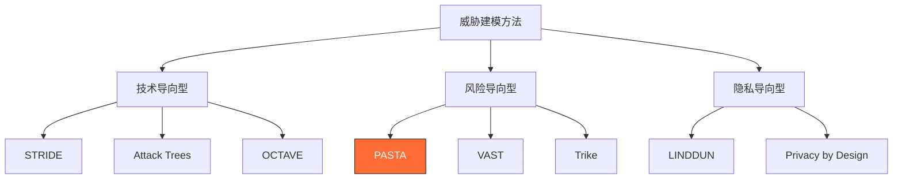
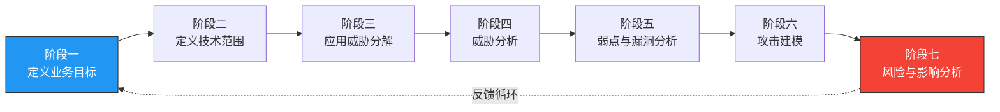
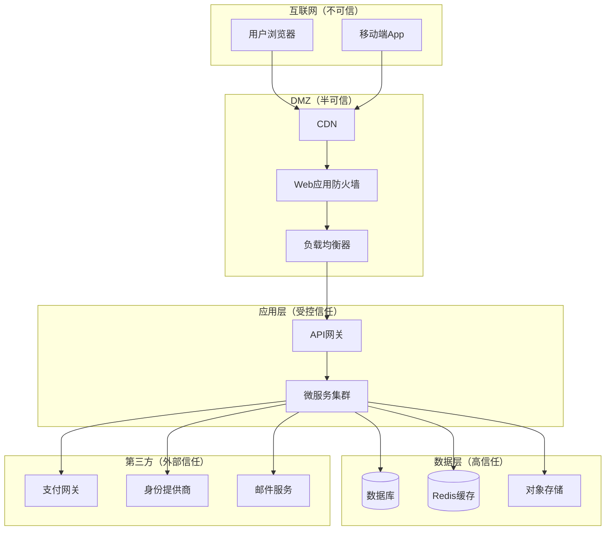
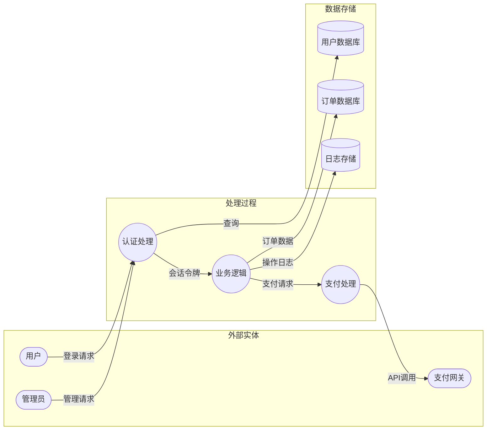
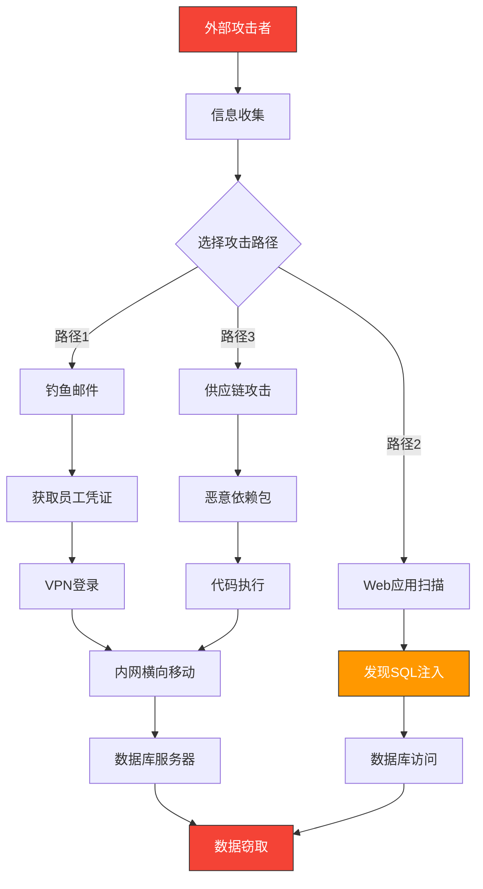

## 八、PASTA威胁建模方法（Process for Attack Simulation and Threat Analysis）

### 8.1 PASTA概述与起源

PASTA（Process for Attack Simulation and Threat Analysis，攻击模拟与威胁分析流程）是由安全专家Tony UcedaVélez和Marco M. Morana于2015年在著作《Risk Centric Threat Modeling》中提出的以风险为中心的威胁建模框架。该框架被OWASP收录并推荐，是目前业界最完整的七阶段威胁建模方法论之一。

PASTA的核心理念可以用一句话概括：**安全不是技术问题，而是业务风险管理问题**。传统威胁建模（如STRIDE）从技术组件出发，列出所有可能的威胁；PASTA则反其道而行，从业务目标和风险承受能力出发，让安全分析始终服务于业务决策。

#### 8.1.1 为什么需要PASTA

在PASTA出现之前，威胁建模领域存在一个根本性矛盾：

| 问题 | 表现 | 后果 |
|------|------|------|
| 技术与业务脱节 | 安全团队列出数百个威胁，业务团队无法判断优先级 | 安全投入缺乏方向，资源浪费 |
| 威胁清单过长 | 穷举式枚举导致"威胁疲劳" | 真正关键的威胁被淹没在噪音中 |
| 缺乏量化依据 | "高/中/低"标签过于主观 | 无法向管理层证明安全投资的必要性 |
| 静态分析 | 建模完成后不再更新 | 无法适应快速迭代的开发节奏 |

PASTA通过将业务目标作为起点，将威胁分析的每一步都与业务风险挂钩，从根本上解决了这些问题。

#### 8.1.2 PASTA的核心特征

- **风险驱动（Risk-Driven）**：以业务风险而非技术漏洞为中心
- **攻击者视角（Attacker-Centric）**：模拟真实攻击者的行为路径
- **阶段化流程（Staged Process）**：七个阶段层层递进，每阶段有明确输入输出
- **可量化输出（Quantifiable Output）**：最终产出风险评分和优先级排序
- **跨团队协作（Cross-Functional）**：需要业务、开发、安全、运维多方参与

#### 8.1.3 PASTA在威胁建模方法谱系中的位置



### 8.2 PASTA七个阶段详解

PASTA的七个阶段构成一个完整的分析管道，每个阶段的输出是下一阶段的输入。理解这个管道的整体结构至关重要：



---

#### 8.2.1 阶段一：定义业务目标（Define Business Objectives）

**目标**：将安全分析锚定在业务价值上，避免"为安全而安全"的陷阱。

这一阶段是PASTA区别于其他方法的根本所在。很多安全团队一上来就画数据流图、列威胁清单，结果产出的报告业务团队看不懂、用不上。PASTA要求你先回答一个根本问题：**这个系统为什么存在？它要保护什么价值？**

**具体执行步骤：**

**步骤1：识别核心业务目标**

与业务负责人、产品经理、架构师进行访谈，回答以下问题：

```text
业务目标访谈清单：
1. 系统解决什么业务问题？目标用户是谁？
2. 系统的核心收入来源或价值主张是什么？
3. 哪些业务流程是关键路径（停机1小时损失多少）？
4. 系统处理哪些敏感数据（PII、支付、健康记录）？
5. 有哪些合规要求（GDPR、PCI DSS、HIPAA、等保）？
6. 利益相关者对安全的期望是什么？
7. 过去是否发生过安全事件？教训是什么？
8. 业务可接受的停机时间（RTO）和数据丢失量（RPO）？
```

**步骤2：建立业务目标-安全需求映射**

将每个业务目标转化为具体的安全需求：

| 业务目标 | 安全需求 | 关键指标 |
|----------|----------|----------|
| 用户增长 | 保护用户账户不被盗用 | 账户接管率 < 0.01% |
| 交易收入 | 确保支付数据完整性 | 欺诈交易率 < 0.1% |
| 品牌声誉 | 防止数据泄露事件 | 零重大数据泄露 |
| 合规运营 | 满足GDPR/PCI DSS要求 | 审计零重大发现 |
| 业务连续性 | 确保系统可用性 | 可用性 > 99.95% |

**步骤3：确定风险承受能力**

风险承受能力不是安全团队单方面决定的，而是需要与业务方共同确认：

```text
风险承受能力矩阵：

                低影响          中影响          高影响
高可能性    | 不可接受(红) | 不可接受(红) | 不可接受(红) |
中可能性    | 可接受(绿)   | 需评估(黄)   | 不可接受(红) |
低可能性    | 可接受(绿)   | 可接受(绿)   | 需评估(黄)   |
```

**阶段一输出物：**
- 业务目标清单（带优先级排序）
- 安全需求矩阵
- 风险承受能力声明
- 利益相关者清单及职责

---

#### 8.2.2 阶段二：定义技术范围（Define Technical Scope）

**目标**：明确威胁建模的技术边界，确保分析范围既不遗漏关键组件，也不过度扩展导致资源分散。

**具体执行步骤：**

**步骤1：绘制系统架构概览**

收集系统的技术架构信息，包括但不限于：

```yaml
# 技术范围定义模板
system_overview:
  architecture_type: "微服务" | "单体" | "Serverless" | "混合"
  deployment_model: "公有云" | "私有云" | "本地" | "混合"
  cloud_provider: "AWS" | "Azure" | "GCP" | "阿里云"
  
components:
  - name: "用户服务"
    technology: "Node.js + Express"
    database: "PostgreSQL"
    api_gateway: true
    
  - name: "支付服务"
    technology: "Java + Spring Boot"
    database: "MySQL"
    pci_scope: true

third_party_dependencies:
  - name: "Stripe SDK"
    version: "v12.x"
    data_access: "payment_cards"
    
  - name: "Auth0"
    version: "v2"
    data_access: "user_credentials"

infrastructure:
  container_orchestration: "Kubernetes 1.28"
  ci_cd: "GitHub Actions"
  secrets_management: "HashiCorp Vault"
  monitoring: "Prometheus + Grafana"
```

**步骤2：识别技术边界和信任域**



**步骤3：记录技术资产清单**

每个需要纳入分析范围的技术资产都应记录：

| 资产类别 | 具体资产 | 敏感等级 | 数据类型 | 所有者 |
|----------|----------|----------|----------|--------|
| 应用服务 | 用户认证服务 | 高 | 凭证、会话 | 平台团队 |
| 数据库 | 用户主库 | 高 | PII、密码哈希 | 数据团队 |
| API | 支付API | 极高 | 卡号、交易记录 | 支付团队 |
| 基础设施 | K8s集群 | 高 | 配置、密钥 | 运维团队 |
| 第三方 | Stripe | 极高 | 支付数据 | 外部 |

**阶段二输出物：**
- 系统架构图（含信任域标注）
- 技术资产清单
- 第三方依赖清单
- 数据流概览

---

#### 8.2.3 阶段三：应用威胁分解（Application Threat Decomposition）

**目标**：将系统拆解为可分析的最小单元，绘制完整的数据流图，标注所有信任边界和入口点。

这是整个PASTA流程中技术含量最高的阶段。你需要像一个侦探一样，追踪数据从进入到离开系统的每一步路径。

**步骤1：绘制详细数据流图（DFD）**

数据流图是威胁分解的核心工具。使用标准的DFD符号：



**步骤2：识别并标注信任边界**

信任边界是威胁分析的关键——大部分安全问题都发生在信任边界上：

```text
信任边界清单模板：

TB-01: 客户端 ↔ CDN/WAF
  - 协议：HTTPS (TLS 1.3)
  - 认证方式：无（公开访问）或Token
  - 风险点：CSRF、XSS、请求伪造

TB-02: WAF ↔ API网关
  - 协议：HTTPS (mTLS)
  - 认证方式：服务间证书
  - 风险点：绕过WAF规则、证书泄露

TB-03: 应用层 ↔ 数据库
  - 协议：TLS加密连接
  - 认证方式：服务账号+连接池
  - 风险点：SQL注入、权限提升、连接泄露

TB-04: 应用层 ↔ 第三方服务
  - 协议：HTTPS + API Key/OAuth
  - 认证方式：API密钥或OAuth令牌
  - 风险点：密钥泄露、供应链攻击、数据泄露
```

**步骤3：枚举所有入口点和出口点**

入口点（Entry Points）是攻击者可以向系统注入输入的地方；出口点（Exit Points）是系统向外部输出数据的地方：

| 类型 | 编号 | 入口/出口 | 协议 | 暴露级别 | 当前保护措施 |
|------|------|-----------|------|----------|--------------|
| 入口 | EP-01 | Web登录表单 | HTTPS | 公开 | WAF + Rate Limiting |
| 入口 | EP-02 | REST API端点 | HTTPS | 公开 | OAuth2 + API Key |
| 入口 | EP-03 | WebSocket连接 | WSS | 公开 | Token认证 |
| 入口 | EP-04 | Webhook回调 | HTTPS | 半公开 | HMAC签名验证 |
| 入口 | EP-05 | 文件上传接口 | HTTPS | 认证后 | 文件类型白名单 |
| 出口 | EX-01 | 邮件通知 | SMTP | 内部 | TLS + SPF/DKIM |
| 出口 | EX-02 | 第三方API调用 | HTTPS | 内部 | API Key加密存储 |
| 出口 | EX-03 | 日志输出 | 内部 | 内部 | 脱敏处理 |

**步骤4：数据分类**

对系统中的数据进行分类，确定每类数据的保护级别：

```text
数据分类标准：

S-极密（Top Secret）：
  - 支付卡号（PCI DSS范围）
  - 加密密钥、私钥
  - 生物特征数据

A-机密（Confidential）：
  - 用户密码（哈希后）
  - 个人身份信息（PII）
  - 会话令牌

B-内部（Internal）：
  - 业务逻辑代码
  - 系统配置
  - 内部API文档

C-公开（Public）：
  - 产品公开页面
  - 公开API文档
  - 市场营销内容
```

**阶段三输出物：**
- 完整的数据流图（DFD）
- 信任边界清单
- 入口点/出口点清单
- 数据分类表

---

#### 8.2.4 阶段四：威胁分析（Threat Analysis）

**目标**：基于前三阶段的信息，系统性地识别系统面临的威胁，分析威胁来源、动机和能力。

**步骤1：使用STRIDE对每个入口点进行威胁分类**

STRIDE模型为每个入口点提供结构化的威胁分类：

| 入口点 | S-仿冒 | T-篡改 | R-抵赖 | I-信息泄露 | D-拒绝服务 | E-权限提升 |
|--------|--------|--------|--------|-----------|-----------|-----------|
| EP-01 登录 | 假冒用户登录 | 篡改登录参数 | 删除登录日志 | 暴力破解密码 | 登录接口洪水 | 绕过认证 |
| EP-02 API | 伪造API身份 | 篡改请求体 | 伪造请求来源 | API响应泄露 | API限速绕过 | 越权访问 |
| EP-04 Webhook | 伪造回调 | 篡改回调数据 | 否认发送回调 | 回调含敏感数据 | 回调风暴攻击 | 利用回调执行命令 |

**步骤2：威胁源分析**

识别并分析可能的威胁源：

```yaml
threat_actors:
  script_kiddies:
    motivation: "好奇心、炫耀"
    skill_level: "低（使用现成工具）"
    resources: "低"
    likelihood: "高"
    typical_targets: "公开暴露的Web应用"
    
  cybercriminals:
    motivation: "经济利益"
    skill_level: "中到高"
    resources: "中到高（可购买0day）"
    likelihood: "高"
    typical_targets: "支付系统、用户数据、勒索"
    
  insider_threats:
    motivation: "报复、经济利益、疏忽"
    skill_level: "中（了解内部系统）"
    resources: "高（有内部访问权限）"
    likelihood: "中"
    typical_targets: "核心数据库、源代码、客户数据"
    
  nation_state_apt:
    motivation: "情报收集、破坏"
    skill_level: "极高（0day开发能力）"
    resources: "极高"
    likelihood: "低（除非是高价值目标）"
    typical_targets: "关键基础设施、知识产权"
    
  hacktivists:
    motivation: "政治/社会目的"
    skill_level: "中"
    resources: "低到中"
    likelihood: "中"
    typical_targets: "公开网站、品牌声誉"
```

**步骤3：利用威胁情报丰富分析**

结合外部威胁情报源，使分析基于真实世界数据而非猜测：

- **CVE/NVD数据库**：查询系统使用的组件的已知漏洞
- **MITRE ATT&CK**：映射攻击者使用的具体技术（TTPs）
- **行业威胁报告**：参考Verizon DBIR、CrowdStrike年报等行业报告
- **暗网情报**：监控是否有本系统/组织的数据在暗网交易
- **漏洞赏金平台**：查看HackerOne、Bugcrowd上同类应用的常见漏洞类型

**步骤4：威胁场景编写**

为每个识别的威胁编写具体场景描述：

```text
威胁场景模板：

威胁ID：T-001
威胁名称：用户账户接管
威胁类型：仿冒（Spoofing）
关联入口点：EP-01（登录接口）
威胁描述：攻击者通过凭证填充（Credential Stuffing）攻击，
  使用从其他数据泄露中获取的用户名/密码对，批量尝试登录。
  由于用户习惯复用密码，攻击者可以成功接管部分账户。
攻击者画像：网络犯罪分子，动机为经济利益
前置条件：
  - 存在大量泄露的凭证数据库
  - 登录接口未实施有效的频率限制
  - 用户未启用多因素认证
影响评估：
  - 用户资金被盗取
  - 个人数据泄露
  - 品牌信誉受损
  - 可能触发GDPR数据泄露通知义务
```

**阶段四输出物：**
- STRIDE威胁矩阵
- 威胁源画像
- 威胁场景清单（带编号和详细描述）
- 威胁情报摘要

---

#### 8.2.5 阶段五：弱点和漏洞分析（Weakness and Vulnerability Analysis）

**目标**：识别系统中实际存在的弱点和漏洞，将理论威胁落地为具体可验证的技术问题。

如果说阶段四是"可能发生什么"，阶段五就是"实际上有什么漏洞"。

**步骤1：多维度漏洞扫描**

```cpp
漏洞分析方法矩阵：

┌─────────────┬──────────────────┬──────────────────┬─────────────┐
│ 分析维度     │ 方法             │ 工具              │ 覆盖范围     │
├─────────────┼──────────────────┼──────────────────┼─────────────┤
│ 静态代码     │ SAST扫描         │ SonarQube,       │ 代码缺陷     │
│ 分析         │                  │ Semgrep, Checkmarx│ SQL注入模式  │
│             │                  │                  │ 硬编码密钥   │
├─────────────┼──────────────────┼──────────────────┼─────────────┤
│ 动态应用     │ DAST扫描         │ OWASP ZAP,       │ XSS          │
│ 安全测试     │                  │ Burp Suite       │ CSRF         │
│             │                  │                  │ 认证绕过     │
├─────────────┼──────────────────┼──────────────────┼─────────────┤
│ 依赖分析     │ SCA扫描          │ Snyk, Dependabot │ 已知CVE      │
│             │                  │ Trivy            │ 许可证风险   │
├─────────────┼──────────────────┼──────────────────┼─────────────┤
│ 基础设施     │ 配置审计         │ ScoutSuite,      │ 云配置错误   │
│ 安全         │                  │ Prowler          │ 开放端口     │
│             │                  │                  │ 弱权限配置   │
├─────────────┼──────────────────┼──────────────────┼─────────────┤
│ 渗透测试     │ 人工测试         │ Burp Suite,      │ 业务逻辑漏洞 │
│             │                  │ Metasploit       │ 链式攻击     │
│             │                  │                  │ 绕过安全控制 │
└─────────────┴──────────────────┴──────────────────┴─────────────┘
```

**步骤2：漏洞分类和优先级评估**

使用CVSS v3.1对每个发现的漏洞进行评分：

```python
# CVSS v3.1 评分计算示例
# 以一个SQL注入漏洞为例

漏洞: 用户搜索接口SQL注入
CVSS向量: CVSS:3.1/AV:N/AC:L/PR:N/UI:N/S:U/C:H/I:H/A:H

解读:
  AV:N (Attack Vector: Network) - 网络可达，无需物理访问
  AC:L (Attack Complexity: Low) - 利用难度低
  PR:N (Privileges Required: None) - 无需认证
  UI:N (User Interaction: None) - 无需用户交互
  S:U (Scope: Unchanged) - 不影响其他组件
  C:H (Confidentiality: High) - 可读取全部数据
  I:H (Integrity: High) - 可修改全部数据
  A:H (Availability: High) - 可导致系统不可用

CVSS基础分: 9.8 (Critical)
```

**步骤3：漏洞与威胁关联**

将发现的漏洞与阶段四的威胁场景关联，确认哪些威胁可以通过哪些漏洞实现：

| 威胁场景 | 关联漏洞 | CVSS | 可利用性 | 关联程度 |
|----------|----------|------|----------|----------|
| T-001 账户接管 | 弱密码策略 + 无限速 | 7.5 | 高 | 直接 |
| T-003 数据泄露 | SQL注入（搜索接口） | 9.8 | 高 | 直接 |
| T-003 数据泄露 | S3桶配置公开 | 7.5 | 中 | 直接 |
| T-005 拒绝服务 | 无请求频率限制 | 5.3 | 高 | 间接 |

**阶段五输出物：**
- 漏洞清单（带CVSS评分）
- 漏洞与威胁关联矩阵
- 漏洞利用可行性分析
- 修复建议

---

#### 8.2.6 阶段六：攻击建模（Attack Modeling）

**目标**：构建真实的攻击场景模型，将独立的漏洞串联成完整的攻击链，模拟攻击者的真实行为路径。

**步骤1：攻击树建模**

攻击树（Attack Tree）是将复杂攻击分解为层次化子任务的经典方法：

```text
                    [窃取用户支付数据]
                           |
            ┌──────────────┼──────────────┐
            |              |              |
      [直接入侵DB]   [中间人攻击]   [社会工程]
            |              |              |
      ┌─────┼─────┐    ┌──┴──┐    ┌──────┼──────┐
      |     |     |    |     |    |      |      |
  [SQL注入] [凭据] [配置] [DNS劫持] [ARP欺骗] [钓鱼邮件] [电话诈骗] [内部线人]
      |     |     |    |     |    |      |      |
  [搜索接口] [暗网购买] [S3公开] [DNS缓存] [同网段] [定制诱饵] [冒充IT] [收买员工]
```

**步骤2：攻击图（Attack Graph）**

攻击图展示攻击者从初始访问点到最终目标的可能路径：



**步骤3：MITRE ATT&CK映射**

将每条攻击路径映射到MITRE ATT&CK框架中的具体技术：

```yaml
attack_chain_mapping:
  - phase: "初始访问 (Initial Access)"
    techniques:
      - T1566.001: "鱼叉式钓鱼附件"
      - T1190: "利用面向公众的应用"
      
  - phase: "执行 (Execution)"
    techniques:
      - T1059.007: "JavaScript执行"
      - T1053.005: "计划任务"
      
  - phase: "持久化 (Persistence)"
    techniques:
      - T1098: "账户操纵"
      - T1505.003: "Web Shell"
      
  - phase: "横向移动 (Lateral Movement)"
    techniques:
      - T1021.001: "远程桌面协议"
      - T1021.002: "SMB/Windows管理共享"
      
  - phase: "数据窃取 (Exfiltration)"
    techniques:
      - T1041: "通过C2通道外传"
      - T1567: "通过Web服务外传"
```

**步骤4：攻击可行性评估**

对每条攻击路径进行可行性评估，确定最现实的威胁：

| 攻击路径 | 技术难度 | 所需时间 | 所需资源 | 检测难度 | 综合可行性 |
|----------|----------|----------|----------|----------|------------|
| 路径1: 钓鱼→内网→DB | 低 | 1-2周 | 低 | 中 | **高** |
| 路径2: SQL注入→DB | 低 | 1-3天 | 低 | 中 | **高** |
| 路径3: 供应链攻击 | 高 | 数月 | 高 | 高 | 低 |
| 路径4: 0day利用 | 极高 | 数月-年 | 极高 | 极高 | 极低 |

**阶段六输出物：**
- 攻击树（至少覆盖前3个高风险威胁）
- 攻击图（完整攻击路径可视化）
- MITRE ATT&CK映射表
- 攻击可行性评估报告

---

#### 8.2.7 阶段七：风险和影响分析（Risk and Impact Analysis）

**目标**：将前面所有阶段的分析结果转化为可量化的风险评估，输出业务决策者可以理解和使用的风险报告。

**步骤1：风险量化计算**

使用以下公式计算每个威胁场景的风险值：

```text
风险值 = 可能性 × 影响

其中：
  可能性 = f(威胁源能力, 漏洞可利用性, 现有控制措施有效性)
  影响   = f(数据敏感性, 业务关键性, 合规影响, 声誉影响)

评分标准（1-10分）：

可能性评分：
  1-2: 需要国家级攻击者，极不可能
  3-4: 需要高级技能和资源，不太可能
  5-6: 中等技能即可，有可能
  7-8: 低技能即可，很可能
  9-10: 自动化可实现，几乎确定

影响评分：
  1-2: 仅影响少量非敏感数据
  3-4: 影响部分用户或内部运营
  5-6: 影响大量用户或重要业务流程
  7-8: 重大数据泄露或业务中断
  9-10: 灾难性影响，可能导致企业倒闭
```

**步骤2：风险优先级排序**

```python
# 风险优先级排序示例

risks = [
    {
        "id": "R-001",
        "threat": "SQL注入导致数据泄露",
        "likelihood": 8,    # 自动化工具可利用
        "impact": 9,        # 全量用户数据泄露
        "cvss": 9.8,
        "risk_score": 8 * 9,  # 72
        "priority": "P0-Critical",
        "action": "立即修复"
    },
    {
        "id": "R-002", 
        "threat": "凭证填充攻击",
        "likelihood": 7,    # 大量泄露凭证可用
        "impact": 6,        # 部分账户被接管
        "cvss": 7.5,
        "risk_score": 7 * 6,  # 42
        "priority": "P1-High",
        "action": "两周内修复"
    },
    {
        "id": "R-003",
        "threat": "S3桶配置公开",
        "likelihood": 5,    # 需要发现桶名
        "impact": 8,        # 可能含备份数据
        "cvss": 7.5,
        "risk_score": 5 * 8,  # 40
        "priority": "P1-High",
        "action": "两周内修复"
    },
    {
        "id": "R-004",
        "threat": "供应链恶意包",
        "likelihood": 3,    # 需要针对性攻击
        "impact": 9,        # 完全控制应用
        "cvss": 8.1,
        "risk_score": 3 * 9,  # 27
        "priority": "P2-Medium",
        "action": "一个月内修复"
    },
]

# 按风险分数降序排列
risks_sorted = sorted(risks, key=lambda x: x["risk_score"], reverse=True)
```

**步骤3：制定风险应对策略**

对每个风险选择适当的应对策略（遵循ISO 31000）：

```text
风险应对策略矩阵：

┌──────────────┬──────────────────────────────────────────────────┐
│ 策略         │ 说明                                              │
├──────────────┼──────────────────────────────────────────────────┤
│ 消除(Remove) │ 从根本上消除风险源                                │
│              │ 例：移除不需要的功能或接口                         │
├──────────────┼──────────────────────────────────────────────────┤
│ 缓解(Mitigate│ 实施安全控制降低可能性或影响                       │
│              │ 例：输入验证、WAF规则、加密                        │
├──────────────┼──────────────────────────────────────────────────┤
│ 转移(Transfer│ 将风险转移给第三方                                 │
│              │ 例：购买网络安全保险、使用托管安全服务              │
├──────────────┼──────────────────────────────────────────────────┤
│ 接受(Accept) │ 在充分了解风险后接受                               │
│              │ 例：低风险+高修复成本的情况                        │
└──────────────┴──────────────────────────────────────────────────┘
```

**步骤4：安全控制措施推荐**

针对每个高优先级风险，给出具体的安全控制措施：

```text
风险R-001: SQL注入 - 控制措施

技术控制：
  1. [必须] 使用参数化查询/预编译语句替代字符串拼接
     - Java: PreparedStatement
     - Python: 使用ORM或参数化查询
     - Node.js: 使用参数化查询库（pg, mysql2）
     
  2. [必须] 实施输入验证
     - 白名单验证输入格式
     - 限制输入长度
     - 过滤特殊字符
     
  3. [推荐] 部署WAF规则
     - ModSecurity CRS规则集
     - 自定义SQL注入检测规则
     
  4. [推荐] 最小权限原则
     - 数据库账号仅授予必要权限
     - 禁用xp_cmdshell等危险功能

管理控制：
  1. [必须] 代码审查中加入SQL注入检查清单
  2. [必须] CI/CD管道集成SAST扫描
  3. [推荐] 定期渗透测试验证修复效果
```

**步骤5：生成风险报告**

```markdown
# PASTA威胁建模报告 - [项目名称]

## 执行摘要
- 分析范围：[系统名称及版本]
- 分析日期：[YYYY-MM-DD]
- 分析团队：[成员列表]
- 整体风险等级：[高/中/低]

## 关键发现
1. 发现 P0 级风险 X 个，需要立即处理
2. 发现 P1 级风险 X 个，需要两周内处理
3. 发现 P2 级风险 X 个，需要一个月内处理

## Top 5 风险
[按风险分数排序的前5个风险，含描述、评分、建议]

## 安全控制建议
[按优先级排序的安全控制措施]

## 后续行动
[时间表、责任人、检查点]
```

**阶段七输出物：**
- 风险评估矩阵（量化）
- 风险优先级排序表
- 安全控制措施推荐
- PASTA威胁建模完整报告

### 8.3 PASTA完整实施流程示例

以下是一个完整的PASTA实施案例，以一个电商系统为例：

**案例背景：**

某中型电商平台，日活用户50万，年交易额10亿元。近期计划上线新的跨境支付功能，需要进行威胁建模。

**阶段执行时间线：**

```text
第1周：阶段一（业务目标）+ 阶段二（技术范围）
  - 2天：利益相关者访谈
  - 2天：架构评审和技术文档收集
  - 1天：输出物整理

第2周：阶段三（威胁分解）
  - 3天：绘制DFD、识别入口点
  - 1天：数据分类
  - 1天：评审和确认

第3周：阶段四（威胁分析）+ 阶段五（漏洞分析）
  - 2天：威胁识别和场景编写
  - 2天：漏洞扫描和验证
  - 1天：关联分析

第4周：阶段六（攻击建模）+ 阶段七（风险分析）
  - 2天：攻击树和攻击图构建
  - 2天：风险量化和报告撰写
  - 1天：报告评审和发布
```

### 8.4 PASTA与其他威胁建模方法的对比

| 维度 | STRIDE | PASTA | VAST | LINDDUN | Attack Trees |
|------|--------|-------|------|---------|--------------|
| **核心理念** | 系统性威胁分类 | 风险驱动分析 | 敏捷+可视化 | 隐私威胁建模 | 层次化攻击分解 |
| **起始点** | 数据流图 | 业务目标 | 用户故事 | 数据流图 | 攻击目标 |
| **输出** | 威胁清单 | 风险评估报告 | 用户故事级威胁 | 隐私威胁映射 | 攻击路径分析 |
| **业务对齐** | 弱 | 强 | 中 | 中 | 弱 |
| **敏捷友好** | 低 | 低 | 高 | 中 | 高 |
| **学习曲线** | 低 | 高 | 中 | 中 | 低 |
| **团队规模** | 小型 | 中大型 | 任意 | 中型 | 任意 |
| **最佳场景** | 快速威胁识别 | 全面风险评估 | DevSecOps集成 | 隐私合规 | 特定攻击分析 |
| **典型耗时** | 1-2天 | 2-4周 | 持续进行 | 1-2周 | 1-3天 |

### 8.5 PASTA的适用场景与局限性

#### 8.5.1 最佳适用场景

1. **高监管行业**：金融、医疗、政府等需要向监管机构证明安全投入合理性的行业
2. **大型复杂系统**：多团队、多服务、多集成点的系统，需要结构化的分析框架
3. **安全预算审批**：需要向管理层提交量化的风险评估报告来申请安全预算
4. **新产品上线前**：在架构设计阶段进行PASTA分析，可以发现设计层面的安全缺陷
5. **重大变更评估**：系统架构重大变更、新技术引入、新业务线扩展时

#### 8.5.2 局限性与应对

| 局限性 | 具体表现 | 应对策略 |
|--------|----------|----------|
| 资源消耗大 | 完整七阶段需要2-4周，多人参与 | 对小型项目可裁剪为3阶段核心流程 |
| 业务理解门槛 | 安全人员需要理解业务逻辑 | 建立跨职能威胁建模团队 |
| 时效性问题 | 完整分析完成后，系统可能已变更 | 结合VAST的敏捷方法，迭代执行 |
| 量化主观性 | 风险评分依赖专家判断 | 使用历史数据校准评分标准 |
| 文档负担 | 每阶段都需要正式输出物 | 使用模板和自动化工具降低负担 |

### 8.6 PASTA的裁剪与轻量化实施

并非每个项目都需要完整的七阶段PASTA。根据项目规模和风险等级，可以进行适当裁剪：

```text
PASTA裁剪指南：

小型项目（低风险）：
  保留：阶段一（简化版）+ 阶段三 + 阶段四
  跳过：阶段二、五、六、七
  耗时：1-2天

中型项目（中风险）：
  保留：全部七阶段，但每个阶段简化
  简化策略：
    - 阶段一：使用模板而非访谈
    - 阶段三：核心数据流而非完整DFD
    - 阶段六：攻击树而非攻击图
  耗时：1-2周

大型项目（高风险）：
  保留：全部七阶段，完整执行
  增强：
    - 阶段四：引入自动化威胁情报
    - 阶段五：多工具交叉验证
    - 阶段六：红队模拟验证
  耗时：3-6周
```

### 8.7 PASTA实践中的常见误区

**误区一：跳过阶段一直接做技术分析**

这是最常见的错误。很多安全团队直接从阶段三开始画数据流图，结果产出的威胁报告与业务脱节，无法获得管理层支持。

正确做法：阶段一至少花1-2天时间与业务方对齐，确保安全分析的方向正确。

**误区二：阶段三的DFD过于粗略或过于详细**

过于粗略会遗漏关键入口点；过于详细会导致分析范围爆炸。

正确做法：DFD保持在3层深度，最外层是系统边界，中间层是主要组件，最内层是关键子组件。如果一个组件的子组件超过5个，考虑将其合并。

**误区三：阶段四只使用STRIDE**

STRIDE是一个有用的分类工具，但不应是唯一的威胁分析方法。

正确做法：结合MITRE ATT&CK、行业威胁报告、历史安全事件数据，多维度分析威胁。

**误区四：阶段五只依赖自动化扫描**

自动化工具只能发现已知模式的漏洞，大量逻辑漏洞需要人工发现。

正确做法：自动化扫描作为基线，关键接口和业务逻辑必须进行人工渗透测试。

**误区五：阶段七的风险评分过于保守**

很多团队倾向于将所有风险都评为"高"，导致失去优先级区分能力。

正确做法：使用相对评分而非绝对评分，强制分布（不超过30%评为高或极高）。

### 8.8 支持PASTA实施的工具生态

| 阶段 | 推荐工具 | 用途 |
|------|----------|------|
| 阶段一 | Jira + Confluence | 业务目标文档化和追踪 |
| 阶段二 | Draw.io, Lucidchart | 架构图绘制 |
| 阶段三 | OWASP Threat Dragon, Microsoft TMT | DFD绘制和威胁建模 |
| 阶段四 | MITRE ATT&CK Navigator, ThreatConnect | 威胁情报和ATT&CK映射 |
| 阶段五 | SonarQube, Snyk, OWASP ZAP, Burp Suite | 漏洞扫描和代码审计 |
| 阶段六 | SecuriCAD, AttackTree Tool | 攻击建模和仿真 |
| 阶段七 | RiskLens, FAIR Model | 风险量化分析 |
| 全流程 | IriusRisk, ThreatModeler | 自动化威胁建模平台 |

### 8.9 本节小结

PASTA是目前最完整的以风险为中心的威胁建模方法论。它的七个阶段从业务目标出发，经过技术分析、威胁识别、漏洞验证、攻击建模，最终回到风险量化，形成了一个完整的闭环。

**PASTA的核心价值在于：**

1. **让安全说业务语言**：风险报告可以直接呈现给CEO和董事会
2. **让安全投入有据可依**：量化风险优先级，支撑安全预算审批
3. **让安全分析有深度**：从表面漏洞深入到攻击路径和业务影响
4. **让安全工作可衡量**：每个阶段有明确的输入输出和质量标准

**关键记忆点：**
- PASTA = 7个阶段，从业务到风险的完整管道
- 与STRIDE的核心区别：PASTA从业务出发，STRIDE从技术出发
- 最佳实践：根据项目规模裁剪，不要教条地执行全部七阶段
- 最大价值：将安全从技术部门的自说自话，转变为业务决策的核心输入
