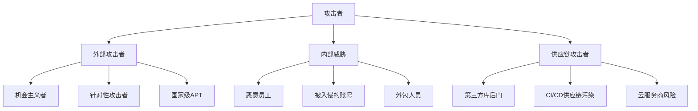

## 九、VAST敏捷威胁建模（Visual, Agile, and Simple Threat modeling）

### 9.1 VAST的诞生背景与设计动机

传统威胁建模方法（如STRIDE、PASTA）虽然在理论上完善，但在实际落地时面临一个根本性矛盾：它们是为瀑布式开发流程设计的，而现代软件团队早已全面转向敏捷和DevOps。STRIDE需要完整的系统架构图才能开始分析，PASTA的七个阶段动辄耗时数周——在一个两周冲刺就交付新功能的团队里，这种节奏根本跟不上。

2012年，威胁建模专家Marco Morana和信息安全公司ThreatModeler提出了VAST方法论。VAST的全称是**Visual, Agile, and Simple Threat modeling**（可视化、敏捷、简单威胁建模），其核心设计目标只有一个：**让威胁建模能够真正嵌入敏捷开发流程，而不是成为开发流程的负担**。

VAST的设计基于三个观察：

1. **传统威胁建模的瓶颈不在方法论本身，而在参与门槛**。开发人员不愿意花几天时间画数据流图、填写威胁矩阵，不是因为他们不关心安全，而是因为这些活动与他们的日常工作流程脱节。
2. **威胁建模的产出必须能直接转化为开发任务**，否则它就只是一个独立的安全审计报告，看完就束之高阁。
3. **自动化是规模化威胁建模的唯一出路**。当一个组织有数百个微服务时，手动威胁建模的覆盖率注定是杯水车薪。

### 9.2 VAST的三大设计原则

#### 9.2.1 Visual（可视化）

VAST强调以可视化的方式呈现威胁模型，而非依赖文本描述或表格矩阵。可视化不是为了美观，而是为了降低认知负荷——当开发人员能够在一张图上直观看到数据流向、信任边界和潜在攻击点时，威胁分析的效率会显著提升。

VAST使用的可视化工具包括：

- **应用流程图（Application Flow Diagrams）**：展示应用内部的数据流转路径，类似简化版的数据流图（DFD），但更贴近开发人员日常使用的架构图。
- **基础设施图（Infrastructure Diagrams）**：展示部署环境的拓扑结构，包括网络分段、负载均衡、数据库集群等。
- **威胁叠加层（Threat Overlays）**：在现有架构图上叠加威胁标识，用颜色编码区分威胁等级（红色=高危、橙色=中危、黄色=低危），让风险一目了然。

#### 9.2.2 Agile（敏捷）

VAST不是在敏捷流程之外再加一个安全活动，而是将威胁建模拆解为可嵌入每个冲刺的微活动：

| 敏捷活动 | VAST嵌入点 | 产出物 |
|----------|-----------|--------|
| 用户故事编写 | 威胁故事（Abuse Story） | 威胁场景列表 |
| Sprint规划 | 威胁建模工作坊（30分钟） | 当前冲刺的威胁清单 |
| 设计评审 | 架构威胁审查 | 需要缓解的威胁 |
| 代码审查 | 安全代码检查点 | 安全编码任务 |
| Sprint回顾 | 威胁模型更新 | 更新后的威胁模型 |
| 发布评审 | 威胁模型签收 | 发布前安全确认 |

这种嵌入式设计的关键在于：**每个安全活动的时间成本控制在30分钟以内**，与冲刺节奏兼容。

#### 9.2.3 Simple（简单）

VAST刻意降低了威胁建模的入门门槛。与STRIDE需要理解六种威胁类别及其与安全属性的映射关系不同，VAST使用更直观的分类方式：

- **基于角色的威胁分类**：外部攻击者、内部恶意用户、特权用户、第三方集成
- **基于影响的威胁分类**：数据泄露、服务中断、资金损失、合规违规
- **基于攻击阶段的威胁分类**：侦察、初始访问、横向移动、数据外泄

这种分类方式更符合开发人员的直觉思维，不需要额外的安全知识背景就能参与讨论。

### 9.3 VAST的双视图模型

VAST的核心架构创新是将威胁模型拆分为两个独立但互补的视图，分别服务于不同的利益相关者和不同的分析需求。

#### 9.3.1 应用威胁模型（Application Threat Model, ATM）

应用威胁模型聚焦于单个应用或微服务的威胁分析，回答的问题是："这个应用有哪些安全风险？"

**ATM的构建步骤：**

**第一步：绘制应用流程图**

以一个电商系统的订单服务为例：

```text
┌──────────┐    HTTPS    ┌──────────────┐    gRPC    ┌──────────────┐
│  移动端   │ ──────────→ │  API Gateway │ ─────────→ │  订单服务    │
│  客户端   │            │  (Kong)      │            │  (Go)        │
└──────────┘            └──────────────┘            └──────┬───────┘
                                                           │
                        ┌──────────────┐    TCP:5432       │ TCP:6379
                        │  支付服务    │ ←─────┐           │
                        │  (Java)      │       │    ┌──────▼───────┐
                        └──────────────┘       │    │  PostgreSQL  │
                                               │    │  (主库)      │
                                               │    └──────────────┘
                                               │
                                               │    ┌──────────────┐
                                               └───→│  Redis       │
                                                    │  (缓存)      │
                                                    └──────────────┘
```

**第二步：识别入口点和信任边界**

在流程图上标注：
- 入口点（Entry Points）：API端点、消息队列消费者、定时任务触发器
- 信任边界（Trust Boundaries）：公网与内网之间、微服务之间、应用与数据库之间
- 资产（Assets）：用户数据、支付凭证、会话令牌、业务逻辑

**第三步：针对每个入口点进行威胁分析**

以订单服务的"创建订单"API为例：

| 入口点 | 威胁场景 | 攻击手法 | 影响 | 优先级 |
|--------|---------|---------|------|--------|
| POST /orders | 价格篡改 | 修改请求体中的单价字段 | 资金损失 | 高 |
| POST /orders | 批量下单攻击 | 自动化脚本大量提交订单 | 资源耗尽 | 中 |
| POST /orders | 订单关联其他用户 | 修改user_id参数 | 数据泄露 | 高 |
| POST /orders | 超大订单金额 | 溢出或负数利用 | 资金损失 | 高 |
| POST /orders | 认证绕过 | 伪造JWT令牌 | 未授权访问 | 高 |

**第四步：输出安全需求**

将威胁分析转化为具体的开发任务：

- 实施服务端价格校验（从数据库读取商品价格，不信任客户端传入值）
- 添加请求速率限制（每用户每分钟最多10个订单）
- 实施用户身份绑定（从JWT中提取用户ID，不信任请求体中的user_id）
- 添加金额范围校验（单笔订单不超过999,999元）
- 强化JWT验证（检查签名、过期时间、颁发者）

#### 9.3.2 基础设施威胁模型（Infrastructure Threat Model, ITM）

基础设施威胁模型聚焦于部署环境的威胁分析，回答的问题是："这个系统的运行环境有哪些安全风险？"

**ITM的构建步骤：**

**第一步：绘制基础设施拓扑图**

```text
┌─────────────────────────────────────────────────────────────┐
│                        互联网                                │
└──────────────────────────┬──────────────────────────────────┘
                           │
                    ┌──────▼──────┐
                    │   WAF/CDN   │  ← 信任边界1
                    │  (Cloudflare)│
                    └──────┬──────┘
                           │
                    ┌──────▼──────┐
                    │  公网子网    │
                    │  ┌────────┐ │
                    │  │ Nginx  │ │
                    │  │ LB x2  │ │
                    │  └────────┘ │
                    └──────┬──────┘
                           │  ← 信任边界2
                    ┌──────▼──────┐
                    │  应用子网    │
                    │  ┌────────┐ │
                    │  │ K8s    │ │
                    │  │ 集群   │ │
                    │  └────────┘ │
                    └──────┬──────┘
                           │  ← 信任边界3
                    ┌──────▼──────┐
                    │  数据子网    │
                    │  ┌────────┐ │
                    │  │ DB集群 │ │
                    │  └────────┘ │
                    └─────────────┘
```

**第二步：分析基础设施威胁**

| 组件 | 威胁场景 | 攻击手法 | 缓解措施 |
|------|---------|---------|---------|
| WAF/CDN | 配置绕过 | 直接IP访问后端 | 仅允许WAF IP段访问LB |
| Nginx LB | SSL剥离 | 降级HTTP请求 | 强制HSTS + TLS 1.3 |
| K8s集群 | 容器逃逸 | 内核漏洞利用 | 只读根文件系统 + seccomp |
| K8s集群 | 未授权API访问 | kubelet API暴露 | RBAC + 网络策略 |
| PostgreSQL | SQL注入链 | 通过应用层注入 | 参数化查询 + 最小权限 |
| Redis | 未授权访问 | 默认无密码 | requirepass + 网络隔离 |

**第三步：输出运维安全需求**

- 网络分段策略（子网间ACL规则）
- 密钥管理方案（Vault/KMS集成）
- 日志审计配置（集中式日志 + 告警规则）
- 灾备与恢复策略（RPO/RTO目标）

#### 9.3.3 双视图的协同关系

应用威胁模型和基础设施威胁模型并非独立存在，它们之间存在交叉影响：

```text
应用威胁模型                    基础设施威胁模型
┌─────────────────┐           ┌─────────────────┐
│  应用层漏洞      │           │  基础设施漏洞    │
│  - 注入攻击     │◄─────────►│  - 网络分段不足  │
│  - 认证缺陷     │  交叉影响  │  - 配置错误     │
│  - 业务逻辑漏洞  │           │  - 权限过宽     │
└────────┬────────┘           └────────┬────────┘
         │                             │
         └──────────┬──────────────────┘
                    │
              ┌─────▼─────┐
              │  融合分析   │
              │  攻击路径   │
              │  组合利用   │
              └───────────┘
```

例如，一个应用层的SQL注入漏洞（ATM发现的），如果数据库部署在与应用相同的子网且无额外网络隔离（ITM发现的），那么攻击者一旦突破应用层就能直接访问数据库——单独看两个威胁都不算严重，但组合起来就是高危。

### 9.4 VAST与敏捷框架的集成实践

#### 9.4.1 与Scrum的集成

在Scrum框架中，VAST通过以下方式嵌入各个仪式：

**Sprint规划会中的威胁建模（15-30分钟）：**

```text
Sprint规划会议程（标准2小时）
├── 第一部分：产品待办列表梳理（60分钟）
├── 第二部分：威胁建模工作坊（20分钟）  ← VAST嵌入点
│   ├── 回顾上个冲刺的威胁状态（5分钟）
│   ├── 审查本冲刺新功能的威胁（10分钟）
│   └── 确定安全任务优先级（5分钟）
└── 第三部分：任务分解和估算（40分钟）
```

**威胁故事（Abuse Story）的编写：**

与用户故事（User Story）对应，威胁故事描述的是攻击者的视角：

```text
用户故事：
作为注册用户，我希望修改我的收货地址，以便收到商品。

威胁故事：
作为攻击者，我尝试通过修改API请求中的user_id参数，
修改其他用户的收货地址，从而将商品送到我指定的地点。
```

威胁故事的验收标准（Acceptance Criteria）应转化为安全测试用例：

```text
验收标准：
- [ ] 修改请求中的user_id不会影响其他用户的地址
- [ ] 系统记录所有地址修改操作的审计日志
- [ ] 异常地址修改触发安全告警
- [ ] 地址修改需要二次身份验证
```

#### 9.4.2 与Kanban的集成

在Kanban流程中，VAST通过在看板中添加安全泳道来实现：

```text
┌──────────┬──────────┬──────────┬──────────┬──────────┐
│  待办     │  分析中   │  开发中   │  测试中   │  完成     │
├──────────┼──────────┼──────────┼──────────┼──────────┤
│ 功能任务  │ 功能任务  │ 功能任务  │ 功能任务  │ 功能任务  │
│ 功能任务  │ 功能任务  │ 功能任务  │          │          │
├──────────┼──────────┼──────────┼──────────┼──────────┤
│ 安全任务  │ 安全任务  │ 安全任务  │ 安全任务  │ 安全任务  │
│ (威胁故事)│ (威胁分析)│ (安全编码)│ (安全测试)│ (已验证)  │
└──────────┴──────────┴──────────┴──────────┴──────────┘
```

安全泳道的WIP（Work In Progress）限制建议设置为2-3，确保安全任务不会被无限积压。

#### 9.4.3 CI/CD管线中的安全门禁

VAST的自动化集成是其与传统方法最大的区别。以下是一个完整的CI/CD安全门禁配置示例：

```yaml
# .github/workflows/security-gates.yml
name: Security Gates

on:
  pull_request:
    branches: [main, develop]

jobs:
  # 第1阶段：静态分析（每次PR触发）
  sast:
    runs-on: ubuntu-latest
    steps:
      - uses: actions/checkout@v4
      - name: Run Semgrep
        uses: returntocorp/semgrep-action@v1
        with:
          config: >-
            p/owasp-top-ten
            p/security-audit
            p/secrets

  # 第2阶段：依赖扫描（每次PR触发）
  dependency-check:
    runs-on: ubuntu-latest
    steps:
      - uses: actions/checkout@v4
      - name: Run Trivy
        uses: aquasecurity/trivy-action@master
        with:
          scan-type: 'fs'
          severity: 'CRITICAL,HIGH'
          exit-code: '1'

  # 第3阶段：容器镜像扫描（main分支合并触发）
  container-scan:
    if: github.event.pull_request.merged == true
    runs-on: ubuntu-latest
    steps:
      - name: Build image
        run: docker build -t app:${{ github.sha }} .
      - name: Scan image
        uses: aquasecurity/trivy-action@master
        with:
          image-ref: 'app:${{ github.sha }}'
          severity: 'CRITICAL,HIGH'
          exit-code: '1'

  # 第4阶段：DAST扫描（staging部署后触发）
  dast:
    needs: [sast, dependency-check]
    runs-on: ubuntu-latest
    steps:
      - name: Run OWASP ZAP
        uses: zaproxy/action-baseline@v0.10.0
        with:
          target: 'https://staging.example.com'
```

安全门禁的分级策略：

| 门禁级别 | 触发条件 | 检查内容 | 阻断策略 |
|---------|---------|---------|---------|
| L1-基础 | 每次PR | SAST + 依赖扫描 | 发现高危漏洞阻断合并 |
| L2-容器 | 合并到main | 容器镜像扫描 | 发现严重漏洞阻断部署 |
| L3-运行时 | 部署到staging | DAST扫描 | 发现可利用漏洞阻断发布 |
| L4-合规 | 发布到生产 | 合规检查清单 | 未完成威胁模型阻断发布 |

### 9.5 VAST的威胁分类体系

VAST不使用STRIDE的六分类法，而是采用更贴近实际的多维分类：

#### 9.5.1 按攻击者类型分类



#### 9.5.2 按攻击目标分类

| 攻击目标 | 典型威胁 | 防御重点 |
|---------|---------|---------|
| 数据机密性 | SQL注入、未授权访问、配置泄露 | 加密、访问控制、数据脱敏 |
| 数据完整性 | 参数篡改、中间人攻击、重放攻击 | 签名验证、TLS、防重放机制 |
| 服务可用性 | DDoS、资源耗尽、死锁 | 限流、熔断、弹性伸缩 |
| 身份认证 | 暴力破解、凭证填充、会话劫持 | MFA、速率限制、安全会话管理 |
| 业务逻辑 | 价格篡改、竞态条件、越权操作 | 服务端校验、幂等性、权限隔离 |
| 合规性 | 数据跨境、日志缺失、数据留存违规 | 数据分类、审计日志、隐私设计 |

### 9.6 自动化威胁建模工具深度评测

#### 9.6.1 开源工具

**OWASP Threat Dragon**

Threat Dragon是OWASP维护的开源威胁建模工具，提供Web版和桌面版两种形态。

核心特性：
- 基于STRIDE的自动化威胁生成
- 拖拽式数据流图编辑器
- JSON格式的威胁模型存储（便于版本控制）
- 与GitHub集成（威胁模型文件存储在代码仓库中）

适用场景：中小团队、个人项目、学习威胁建模的最佳入门工具。

局限性：自动化程度有限，需要手动绘制数据流图，不支持CI/CD集成。

```bash
# 安装Threat Dragon桌面版（Windows/Mac/Linux）
# 从 https://github.com/OWASP/threat-dragon/releases 下载

# 或使用Docker运行Web版
docker run -it -p 3000:3000 \
  -v $(pwd)/threat-models:/app/ThreatDragonModels \
  owasp/threat-dragon:stable

# 访问 http://localhost:3000 开始建模
```

**PyTM（Pythonic Threat Modeling）**

PyTM是OWASP推出的"威胁建模即代码"工具，允许用Python代码定义系统架构并自动生成威胁报告。

```python
from pytm import TM, Server, Dataflow, Boundary, Actor

# 定义威胁模型
tm = TM("E-Commerce System")
tm.description = "在线电商系统威胁模型"

# 定义信任边界
internet = Boundary("Internet")
internal = Boundary("Internal Network")
db_zone = Boundary("Database Zone")

# 定义参与者和组件
user = Actor("User", in_boundary=internet)
web_server = Server("Web Server", in_boundary=internal)
db_server = Server("Database", in_boundary=db_zone)

# 定义数据流
user_to_web = Dataflow(user, web_server, "HTTPS Request")
web_to_db = Dataflow(web_server, db_server, "SQL Query")

# 配置数据流属性
web_to_db.protocol = "TCP"
web_to_db.dst_port = 5432

# 生成报告
tm.process()
tm.report("output/report.html")
```

PyTM的优势在于威胁模型可以纳入版本控制系统，与CI/CD管线无缝集成。每次代码变更时自动重新生成威胁报告。

#### 9.6.2 商业工具

**IriusRisk**

IriusRisk是目前市场上自动化程度最高的商业威胁建模平台。其核心能力包括：

- 自动检测架构变更并更新威胁模型
- 内置超过2000个威胁模式和安全控制
- 与Jira、Azure DevOps等项目管理工具集成
- 自动生成安全需求并映射到开发任务
- 支持合规框架（PCI DSS、HIPAA、SOC 2）

IriusRisk的工作流程：

```text
架构设计 → 自动识别组件 → 匹配威胁模式 → 生成安全需求
    │                                              │
    └──────────── 持续反馈循环 ◄─────────────────────┘
                  (代码变更触发威胁模型更新)
```

**ThreatModeler**

ThreatModeler定位为企业的可扩展威胁建模平台，其独特价值在于：

- 支持从AWS/Azure/GCP的IaC模板自动导入架构
- 提供威胁模型模板库（微服务、Serverless、IoT等）
- 支持多团队协作和威胁模型审批流程
- 生成可直接导入SIEM的安全规则

#### 9.6.3 工具选型决策矩阵

| 维度 | OWASP Threat Dragon | PyTM | IriusRisk | ThreatModeler |
|------|-------------------|------|-----------|---------------|
| 成本 | 免费 | 免费 | 商业（按席位） | 商业（按席位） |
| 自动化程度 | 低 | 中 | 高 | 高 |
| CI/CD集成 | 无 | 原生支持 | 支持 | 支持 |
| 学习曲线 | 低 | 中（需Python） | 中 | 中 |
| 团队协作 | 有限 | 通过Git | 内置 | 内置 |
| 适用团队规模 | 1-10人 | 5-50人 | 50-500人 | 50-1000人 |
| 威胁模式库 | STRIDE基础 | 可扩展 | 2000+模式 | 丰富模板 |

### 9.7 VAST实施的完整案例

#### 9.7.1 案例背景

某金融科技公司的移动支付应用，技术栈：
- 前端：Flutter（iOS + Android）
- 后端：Spring Boot微服务（8个服务）
- 数据库：PostgreSQL + Redis
- 部署：AWS EKS（Kubernetes）
- CI/CD：GitHub Actions + ArgoCD

团队：6名开发、1名安全工程师、2名运维，两周一个冲刺。

#### 9.7.2 VAST实施过程

**第1周：建立基础**

1. 安全工程师与开发团队召开VAST启动工作坊（2小时）
2. 绘制8个微服务的应用流程图（使用draw.io）
3. 绘制AWS部署架构的基础设施图
4. 在GitHub仓库中创建`/threat-models`目录，存储所有威胁模型文件

**第2-3周：嵌入Sprint流程**

在Sprint规划会中加入20分钟的威胁建模环节：

```text
Sprint 12 威胁建模输出
━━━━━━━━━━━━━━━━━━━━━━
新功能：用户转账
威胁故事：
1. 攻击者通过修改转账金额字段实现负数转账（反向转账）
2. 攻击者通过并发请求实现双重支付（竞态条件）
3. 攻击者通过篡改收款方账户实现资金劫持

安全任务（纳入Sprint Backlog）：
- [ ] [高] 转账金额服务端校验（正数、范围、精度）
- [ ] [高] 转账操作分布式锁（Redis SETNX）
- [ ] [中] 转账操作幂等性设计（幂等键）
- [ ] [中] 异常转账实时告警（大额、高频、夜间）
```

**第4周起：自动化集成**

在GitHub Actions中配置安全门禁：

```yaml
# 每次PR自动运行
- SAST扫描（Semgrep + 自定义规则）
- 依赖漏洞扫描（Trivy）
- 威胁模型变更检测（如果/app有变更但/threat-models未更新，提醒开发者）

# 合并到main后自动运行
- 容器镜像扫描
- IaC安全扫描（Checkov扫描Terraform/K8s配置）
- 威胁模型自动更新（PyTM重新生成报告）
```

#### 9.7.3 实施效果

| 指标 | 实施前 | 实施后（6个月） | 变化 |
|------|-------|---------------|------|
| 安全漏洞发现阶段 | 生产环境（70%） | 开发阶段（65%） | 左移显著 |
| 威胁建模覆盖率 | 手动覆盖20%服务 | 自动覆盖100%服务 | +400% |
| 平均漏洞修复时间 | 14天 | 3天 | -79% |
| 生产环境安全事件 | 每月2-3次 | 每季度1次 | -85% |
| 开发人员安全满意度 | 3.2/5 | 4.1/5 | +28% |

### 9.8 VAST的常见误区与纠正

#### 误区一：VAST太简单，不适合复杂系统

**错误认知**：VAST只是STRIDE的简化版，对于金融、医疗等高安全要求的系统不够用。

**纠正**：VAST的"简单"指的是参与门槛低，不是分析深度浅。VAST可以与任何威胁分类框架（STRIDE、MITRE ATT&CK、OWASP Top 10）结合使用。应用威胁模型中完全可以使用STRIDE进行详细分析，基础设施威胁模型可以使用MITRE ATT&CK进行攻击链分析。VAST提供的是流程框架，不是分析方法。

#### 误区二：有了自动化就不需要人工分析

**错误认知**：配置了SAST/DAST工具链就是VAST了。

**纠正**：自动化工具只能发现已知模式的漏洞。业务逻辑漏洞（如价格篡改、竞态条件、越权操作）需要人工分析。VAST的Sprint规划会中的威胁建模工作坊是不可替代的——它是开发人员和安全人员交流威胁认知的关键环节。自动化是补充，不是替代。

#### 误区三：VAST只适用于微服务架构

**错误认知**：VAST的双视图模型是为微服务设计的，单体应用用不了。

**纠正**：VAST的双视图模型适用于任何架构。单体应用同样有应用逻辑和部署环境的区分。应用威胁模型分析的是业务逻辑和数据流，基础设施威胁模型分析的是服务器、网络和中间件——这与是否使用微服务无关。

#### 误区四：威胁模型一次建好就不用更新

**错误认知**：项目初期做一次威胁建模就够了。

**纠正**：威胁模型是活文档，必须随系统演进持续更新。VAST的敏捷集成设计正是为了解决这个问题——每次Sprint的威胁建模工作坊既是审查新功能的威胁，也是更新已有威胁模型的机会。一个过时的威胁模型比没有威胁模型更危险，因为它会给你虚假的安全感。

### 9.9 VAST与其他威胁建模方法的对比

| 维度 | STRIDE | PASTA | LINDDUN | VAST |
|------|--------|-------|---------|------|
| 设计目标 | 通用威胁分类 | 风险驱动分析 | 隐私威胁分析 | 敏捷流程集成 |
| 起点 | 系统组件 | 业务目标 | 数据流 | 用户故事 |
| 复杂度 | 中等 | 高 | 中等 | 低-中 |
| 时间成本 | 1-3天 | 1-4周 | 2-5天 | 每冲刺30分钟 |
| 自动化支持 | 有限 | 有限 | 有限 | 强 |
| 敏捷兼容性 | 差 | 差 | 差 | 优秀 |
| 输出物 | 威胁清单 | 风险报告 | 隐私风险报告 | 安全需求+任务 |
| 适用阶段 | 设计阶段 | 项目初期 | 需求/设计阶段 | 全生命周期 |
| 最佳组合 | +DREAD评分 | +攻击树 | +STRIDE | +STRIDE+ATT&CK |

在实际项目中，VAST不是要取代其他方法，而是提供一个框架，让其他方法的精华能够在敏捷流程中发挥作用。一个成熟的团队可能在Sprint规划中使用VAST的流程框架，同时在应用威胁模型中使用STRIDE进行详细分析，在基础设施威胁模型中使用MITRE ATT&CK进行攻击链建模。

### 9.10 VAST的进阶实践

#### 9.10.1 威胁建模即代码（Threat Modeling as Code）

将威胁模型纳入版本控制系统是VAST自动化的核心。推荐的目录结构：

```text
project-root/
├── src/
├── threat-models/
│   ├── README.md              # 威胁模型总览
│   ├── application/
│   │   ├── order-service.yaml  # 订单服务威胁模型
│   │   ├── payment-service.yaml
│   │   └── user-service.yaml
│   ├── infrastructure/
│   │   ├── aws-production.yaml # 生产环境基础设施威胁模型
│   │   └── aws-staging.yaml
│   ├── templates/
│   │   ├── microservice.yaml   # 微服务威胁模型模板
│   │   └── api-gateway.yaml    # API网关威胁模型模板
│   └── scripts/
│       ├── validate.py         # 威胁模型验证脚本
│       └── report-gen.py       # 报告生成脚本
└── .github/
    └── workflows/
        └── threat-model.yml    # CI/CD集成
```

威胁模型的YAML格式示例：

```yaml
# threat-models/application/order-service.yaml
meta:
  name: "Order Service Threat Model"
  version: "2.1"
  last_review: "2026-06-15"
  owner: "order-team"
  reviewers: ["security-team"]

system:
  name: "Order Service"
  description: "处理用户订单的创建、查询、取消等操作"
  tech_stack:
    language: "Go 1.22"
    framework: "Gin"
    database: "PostgreSQL 16"
    cache: "Redis 7"

entry_points:
  - name: "Create Order"
    method: "POST"
    path: "/api/v1/orders"
    authentication: "JWT"
    authorization: "authenticated_user"

  - name: "Get Order"
    method: "GET"
    path: "/api/v1/orders/{id}"
    authentication: "JWT"
    authorization: "order_owner_or_admin"

threats:
  - id: "ORD-001"
    entry_point: "Create Order"
    category: "integrity"
    scenario: "攻击者修改请求中的商品单价"
    likelihood: "high"
    impact: "high"
    mitigation:
      - "服务端从数据库获取商品价格"
      - "不信任客户端传入的价格字段"
      - "订单金额与商品价格不匹配时拒绝请求"
    status: "mitigated"
    verified_by: "security-test-001"

  - id: "ORD-002"
    entry_point: "Create Order"
    category: "availability"
    scenario: "自动化脚本大量提交订单消耗资源"
    likelihood: "medium"
    impact: "medium"
    mitigation:
      - "每用户每分钟最多10个订单"
      - "新用户首日最多50个订单"
      - "异常订单模式触发人工审核"
    status: "in_progress"
    jira_ticket: "SEC-1234"
```

#### 9.10.2 威胁情报集成

将外部威胁情报自动集成到VAST流程中，提升威胁识别的时效性：

```python
# scripts/threat-intel-update.py
"""
定期从威胁情报源拉取最新威胁信息，
与现有威胁模型交叉比对，生成告警。
"""

import yaml
import requests
from pathlib import Path

THREAT_INTEL_SOURCES = {
    "nvd": "https://services.nvd.nist.gov/rest/json/cves/2.0",
    "mitre_attack": "https://raw.githubusercontent.com/mitre/cti/master/enterprise-attack/enterprise-attack.json",
    "github_advisories": "https://api.github.com/advisories",
}

def load_threat_models(model_dir: str) -> list[dict]:
    """加载所有威胁模型文件"""
    models = []
    for yaml_file in Path(model_dir).rglob("*.yaml"):
        with open(yaml_file) as f:
            models.append({
                "path": str(yaml_file),
                "model": yaml.safe_load(f)
            })
    return models

def check_technology_stack(models: list[dict]) -> list[dict]:
    """检查技术栈中是否存在已知漏洞"""
    alerts = []
    for model_info in models:
        model = model_info["model"]
        tech_stack = model.get("system", {}).get("tech_stack", {})
        # 查询NVD检查技术栈组件的已知漏洞
        for component, version in tech_stack.items():
            # 实际实现中调用NVD API查询
            pass
    return alerts

def generate_alert_report(alerts: list[dict]) -> str:
    """生成威胁情报告警报告"""
    report = "# 威胁情报更新告警\n\n"
    report += f"扫描时间：{datetime.now().isoformat()}\n\n"
    for alert in alerts:
        report += f"## {alert['title']}\n"
        report += f"- 严重程度：{alert['severity']}\n"
        report += f"- 影响组件：{alert['component']}\n"
        report += f"- 建议操作：{alert['recommendation']}\n\n"
    return report
```

#### 9.10.3 威胁模型度量指标

建立可量化的威胁建模度量体系，衡量VAST的实施效果：

| 指标类别 | 具体指标 | 计算方式 | 目标值 |
|---------|---------|---------|--------|
| 覆盖率 | 服务威胁模型覆盖率 | 已建模服务数/总服务数 | >95% |
| 覆盖率 | Sprint威胁建模参与率 | 包含威胁建模的Sprint/总Sprint数 | 100% |
| 时效性 | 威胁模型更新延迟 | 代码变更到威胁模型更新的天数 | <3天 |
| 质量 | 威胁识别准确率 | 真阳性/（真阳性+假阳性） | >80% |
| 质量 | 威胁缓解完成率 | 已缓解威胁/已识别威胁 | >90% |
| 效率 | 威胁建模时间投入 | 每Sprint用于威胁建模的小时数 | <4小时 |
| 效果 | 安全漏洞左移率 | 开发阶段发现的漏洞/总漏洞 | >60% |
| 效果 | 生产安全事件数 | 每季度生产环境安全事件数 | <2次 |

### 9.11 VAST实施的组织准备

#### 9.11.1 角色与职责

VAST的成功实施需要明确的角色分工：

| 角色 | 职责 | 时间投入 | 人选 |
|------|------|---------|------|
| 安全冠军（Security Champion） | 每个开发团队中的安全倡导者，参与威胁建模工作坊，推动安全任务落地 | 每Sprint 2-4小时 | 对安全有兴趣的资深开发 |
| 安全工程师 | 提供威胁建模方法论指导，维护基础设施威胁模型，审查安全需求 | 每Sprint 8-16小时 | 专职安全人员 |
| 开发人员 | 参与威胁建模工作坊，实现安全任务，更新应用威胁模型 | 每Sprint 1-2小时 | 全体开发 |
| 产品经理 | 在用户故事中纳入安全需求，优先级排序时考虑安全因素 | 每Sprint 0.5-1小时 | 产品负责人 |

#### 9.11.2 培训路线图

```text
第1周：VAST基础培训（全员，2小时）
├── VAST理念与价值
├── 应用流程图绘制练习
└── 威胁故事编写练习

第2-4周：安全冠军进阶培训（安全冠军，每周2小时）
├── STRIDE威胁分类深度讲解
├── 基础设施威胁建模
├── 威胁优先级评估方法
└── 工具使用培训（Threat Dragon / PyTM）

第5-8周：实战演练（全员，每Sprint 30分钟）
├── 在真实Sprint中实践VAST
├── 安全工程师现场指导
└── 逐步过渡到团队自主运行

持续改进：每月回顾（全员，1小时）
├── 威胁建模效果评估
├── 流程优化讨论
└── 案例分享和知识沉淀
```

### 9.12 本节小结

VAST敏捷威胁建模不是一种全新的威胁分类方法，而是一种让威胁建模在现代软件开发流程中真正落地的工程实践。它的核心贡献在于解决了传统威胁建模的三个根本问题：

1. **参与门槛高** → 通过简化流程和可视化手段降低门槛
2. **与开发脱节** → 通过嵌入Sprint流程实现无缝集成
3. **无法规模化** → 通过自动化工具链实现全量覆盖

VAST不是要取代STRIDE或PASTA，而是为它们提供了一个在敏捷环境中运行的框架。一个完整的VAST实施，可能同时使用STRIDE进行威胁分类、MITRE ATT&CK进行攻击链分析、DREAD进行风险评分——VAST的价值在于把这些方法论的产出转化为开发团队可以执行的具体任务，并通过自动化确保这些任务不会被遗忘。

对于刚开始实践威胁建模的团队，建议从以下路径入手：

1. **第1个月**：选择一个核心服务，手动绘制应用流程图，用STRIDE进行威胁分析
2. **第2个月**：将威胁建模嵌入Sprint规划会，编写威胁故事
3. **第3个月**：配置基础的CI/CD安全门禁（SAST + 依赖扫描）
4. **第4-6个月**：扩展到所有服务，建立基础设施威胁模型，完善自动化工具链
5. **第6个月以后**：引入威胁情报集成，建立度量体系，持续优化

威胁建模是一个持续改进的过程，不是一个一次性的项目。VAST的价值在于让这个过程变得可持续。
