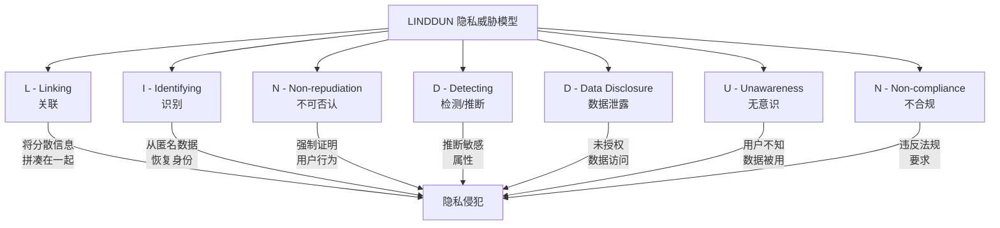
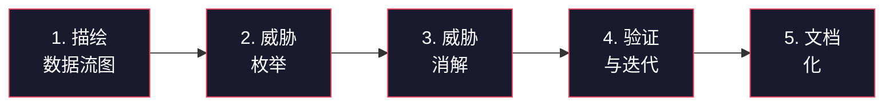
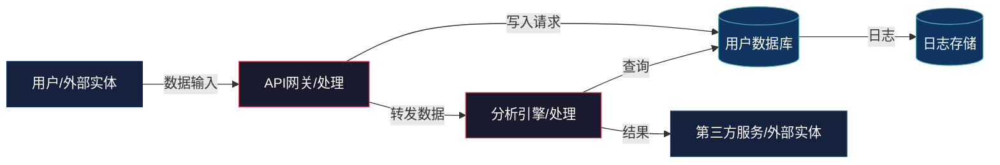

## 十、LINDDUN隐私威胁建模

传统威胁建模（如STRIDE）聚焦于系统安全属性——完整性、可用性、机密性等，但对"隐私"这个独立维度的覆盖严重不足。一个系统可以完全"安全"（没有SQL注入、没有越权访问），却在隐私层面一塌糊涂：用户行为被关联、身份被推断、数据主体完全不知道自己的信息被如何使用。

LINDDUN正是为填补这一空白而生。它由比利时鲁汶大学（KU Leuven）的研究团队于2010年代初提出，是目前学术界和工业界公认的最系统化的隐私威胁建模框架。与STRIDE对安全威胁的分类方式类似，LINDDUN将隐私威胁分为七大类，覆盖了从数据关联到合规性的完整隐私风险光谱。

### 10.1 为什么需要专门的隐私威胁建模

#### 10.1.1 安全与隐私的本质区别

安全（Security）和隐私（Privacy）经常被混为一谈，但它们是两个不同的关注维度：

| 维度 | 安全（Security） | 隐私（Privacy） |
|------|------------------|------------------|
| 核心关注 | 保护系统免受未授权访问和破坏 | 保护个人数据免受不当处理 |
| 威胁来源 | 外部攻击者、恶意内部人员 | 合法的数据处理者、合法的数据流 |
| 典型问题 | "谁能闯进来？" | "数据被用来做什么？用户知道吗？" |
| 合规框架 | ISO 27001、等保 | GDPR、CCPA、PIPL |
| 保护对象 | 系统的CIA三元组 | 个人的知情权、控制权、被遗忘权 |

一个典型的例子：某健康App使用HTTPS加密传输数据（安全性良好），但同时将用户步数数据卖给保险公司用于精算定价（隐私灾难）。STRIDE看不到这个问题，因为它认为"合法的数据流"不构成威胁——但LINDDUN可以。

#### 10.1.2 隐私威胁的独特性

隐私威胁具有几个安全威胁不具备的特征：

**延迟性**：隐私伤害往往在数据收集后很长时间才显现。今天收集的GPS轨迹数据，五年后可能被用于政治迫害。

**累积性**：单条数据无害，大量数据聚合后构成威胁。单独知道一个人的邮编、生日、性别不构成隐私问题，但三个组合在一起可以唯一识别87%的美国人口（Sweeney, 2000）。

**上下文依赖性**：同样的数据在不同上下文中的隐私含义完全不同。医疗记录在医院是诊疗必需，在保险公司就是歧视依据。

**主体无感知性**：数据主体往往完全不知道自己的数据正在被处理，更不知道被如何处理。这是安全威胁中几乎不存在的维度。

### 10.2 LINDDUN七类隐私威胁详解

LINDDUN这个缩写本身就是七类威胁的首字母组合。以下逐一展开，每类都包含威胁定义、攻击原理、真实案例和防御策略。



#### 10.2.1 L — Linking（关联攻击）

**定义**：将来自不同数据源的信息关联起来，从而推断出超出各数据源单独暴露范围的隐私信息。

**攻击原理**：数据最小化原则要求每个系统只收集必要的数据。但攻击者可以通过跨系统的数据关联，将"最小化"的碎片拼凑成完整的用户画像。这不是某个系统的安全漏洞——每个系统都"合法"地持有自己的数据——但组合后构成了严重的隐私侵犯。

**经典案例**：

Netflix推荐竞赛攻击（2007年）：Netflix发布了包含50万用户电影评分的"匿名"数据集用于算法竞赛。研究者将这些数据与IMDb上的公开评分进行关联，成功去匿名化了大量用户，甚至推断出了用户的性取向和政治倾向。这是关联攻击的教科书级案例——Netflix的数据集和IMDb各自单独看都没有隐私问题，但关联后问题严重。

AOL搜索数据泄露（2006年）：AOL发布了2000万条"匿名"搜索查询。《纽约时报》记者通过分析搜索内容，仅用几天就识别出了搜索者本人——一位62岁的乔治亚州女性。

**防御策略**：

- 数据隔离：不同用途的数据存储在不同系统中，物理或逻辑隔离
- 去关联化处理：为不同系统使用不同的用户标识符，且不可逆向映射
- 差分隐私：在数据发布时添加校准噪声，使关联攻击在统计上不可行
- 数据最小化：每个系统只收集绝对必要的数据，减少可供关联的素材
- 时间/空间模糊化：对时间戳和地理位置进行适当粒度的聚合

#### 10.2.2 I — Identifying（识别攻击）

**定义**：通过数据分析手段识别数据主体的真实身份，即使数据已被"匿名化"处理。

**攻击原理**：很多系统在设计时认为"去掉姓名就是匿名"。但研究表明，只要数据集中包含足够多的准标识符（quasi-identifiers）——邮编、生日、性别、职业等——就可能重新识别个人身份。

**量化理解**：Sweeney教授的研究表明，美国87%的人口可以通过邮编+出生日期+性别三元组唯一识别。这意味着所谓"匿名化"的医疗记录、消费记录、出行记录，在绝大多数情况下可以被重新关联到具体个人。

**真实案例**：

纽约出租车数据泄露（2014年）：纽约市公开了2013年的出租车出行记录，声称已对车牌号进行哈希处理。但研究者利用哈希的确定性特征，结合少量已知信息就恢复了大量司机的身份，甚至推算出了名人给小费的习惯。

共享单车数据去匿名化（2019年）：某城市的共享单车系统公开了出行数据用于学术研究，仅对用户ID做了哈希。研究者通过分析出发时间、地点和到达时间、地点的模式，成功识别出了特定用户的家庭住址和工作地点。

**防御策略**：

- k-匿名性：确保每条记录至少与其他k-1条记录在准标识符上不可区分
- l-多样性：在每个等价类中，敏感属性至少有l个不同的值
- t-接近性：等价类中敏感属性的分布与整个数据集的分布偏差不超过阈值t
- 泛化与抑制：将精确值替换为范围值（如精确年龄替换为年龄段），或完全抑制某些字段
- 合成数据：使用生成模型创建保持统计特性但不对应真实个人的合成数据集

#### 10.2.3 N — Non-repudiation（不可否认性）

**定义**：系统设计使得数据主体无法否认其执行过的操作，从而剥夺了用户的否认权。

**攻击原理**：在安全语境下，不可否认性通常是正面属性——我们希望确保操作记录不可抵赖。但在隐私语境下，它变成了威胁——用户可能需要否认自己做过某件事（例如浏览了某个网站、购买了某本书），而系统的设计使得这种否认不可能。

**典型场景**：

区块链上的交易记录：区块链的设计天然具有不可否认性，每笔交易都永久记录且不可篡改。当区块链用于记录涉及隐私的交易时（如医疗记录、投票），这个特性就从安全保障变成了隐私威胁。

集中式日志系统：某些系统记录了用户的每一次操作，且这些日志被设计为不可删除、不可修改。这在审计角度是好的，但如果日志内容涉及用户隐私行为，就构成了不可否认性威胁。

企业内网监控：雇主监控员工的每一次网络访问、每一封邮件、每一次文件操作。这种监控使得员工在工作中的任何"不完美"行为都成为不可否认的记录。

**防御策略**：

- 匿名凭证：允许用户执行操作但不绑定到具体身份（如匿名投票系统）
- 可否认通信：设计支持否认的通信协议（如OTR即时通讯协议）
- 日志生命周期管理：设置日志保留期限，到期后自动清除
- 分离审计：将审计日志与业务数据分离，限制审计日志的访问权限
- 混淆技术：在需要不可否认性的场景中引入可否认的模糊层

#### 10.2.4 D — Detecting（检测/推断攻击）

**定义**：通过观察数据主体的行为模式、属性特征或数据内容，推断出其不愿暴露的敏感属性。

**攻击原理**：即使数据没有直接包含敏感信息，攻击者也可以通过统计分析、机器学习等手段推断出敏感属性。这与关联攻击的区别在于：关联攻击需要多个数据源，检测/推断攻击可以在单一数据源上完成。

**经典案例**：

Target怀孕预测（2012年）：Target超市通过分析顾客的购物模式变化（如突然开始购买无味乳液、特定维生素组合），成功在顾客自己告知家人之前就推断出了怀孕状态，并向其寄送了婴儿用品优惠券。一位父亲在投诉后才知道自己十几岁的女儿怀孕了。

Facebook点赞推断（2013年）：剑桥大学的研究表明，通过分析用户的Facebook点赞记录，可以高精度推断出性取向（准确率88%）、种族（准确率95%）、政治倾向（准确率85%）、是否使用毒品（准确率73%）等极度敏感的个人信息。

学生成绩推断（2019年）：研究者通过分析学生在学习管理系统中的行为日志（登录时间、页面停留时长、作业提交时间），成功推断出了学生的课程成绩，准确率超过80%。

**防御策略**：

- 数据最小化：不收集可能被用于推断的间接数据
- 查询审计：监控异常的数据访问和查询模式
- 访问控制粒度化：限制查询结果的精确度和返回记录数
- 差分隐私：在统计查询结果中添加噪声
- 推断检测系统：部署ML模型检测异常的推断行为

#### 10.2.5 D — Data Disclosure（数据泄露）

**定义**：个人数据被未授权方访问、获取或暴露，包括外部攻击和内部泄露。

**攻击原理**：这是最"传统"的隐私威胁类型，与安全威胁中的信息泄露高度重叠。但隐私视角的数据泄露更关注泄露内容对个人的影响，而不仅仅是"数据被偷了"。

**分类体系**：

| 泄露类型 | 说明 | 典型案例 |
|----------|------|----------|
| 外部入侵 | 攻击者突破系统防线获取数据 | Equifax数据泄露（1.47亿人） |
| 内部泄露 | 员工或合作伙伴滥用权限 | Cambridge Analytica事件 |
| 配置错误 | 云存储桶、数据库未设访问控制 | Facebook 5.4亿用户数据泄露 |
| 供应链泄露 | 第三方服务商数据被泄露 | SolarWinds供应链攻击 |
| 副通道泄露 | 通过非预期渠道泄露信息 | 推断攻击、侧信道攻击 |

**防御策略**：

- 数据加密：传输中加密（TLS）+ 静态加密（AES-256）+ 字段级加密
- 访问控制：最小权限原则 + 基于角色/属性的访问控制（RBAC/ABAC）
- 数据脱敏：根据使用场景选择脱敏策略（掩码、泛化、截断）
- 泄露检测：DLP（数据防泄露）系统 + 异常访问告警
- 数据生命周期管理：过期数据自动清除，减少泄露面

#### 10.2.6 U — Unawareness（无意识）

**定义**：数据主体不知道自己的数据正在被收集、处理或分享，也没有被赋予知情和控制的权利。

**攻击原理**：这是LINDDUN中最具"隐私特色"的威胁类型。它不依赖于技术漏洞，而是系统设计本身就剥夺了用户的知情权。用户甚至不知道有什么需要保护的。

**典型表现**：

- 没有隐私政策，或隐私政策晦涩难懂
- 数据收集前没有获得有效同意
- 用户不知道数据被分享给了哪些第三方
- 用户不知道数据被用于什么目的
- 用户不知道自己有哪些权利（访问、删除、可携带等）
- 暗模式（Dark Patterns）设计，诱导用户放弃隐私权利

**真实案例**：

智能电视监听（2017年）：Vizio智能电视在用户不知情的情况下收集观看习惯数据，并将其出售给广告商。FTC对其处以220万美元罚款。用户完全不知道自己的电视在"看"自己。

Cookie同意暗模式：大量网站将"接受全部Cookie"按钮设计得醒目易点击，而"管理偏好"或"拒绝"按钮被设计得小、灰、难找。这不是"违规"，但本质上剥夺了用户的知情选择权。

**防御策略**：

- 隐私通知：清晰、简洁、分层的隐私通知（不是5000字的法律文件）
- 有效同意：明确的、主动的、知情的、自由的同意机制
- 隐私仪表板：让用户随时查看和管理自己的数据和隐私设置
- 数据流可视化：向用户展示数据的流向、用途和接收方
- 隐私影响评估（PIA）：在系统上线前评估对用户隐私意识的影响

#### 10.2.7 N — Non-compliance（不合规）

**定义**：系统的数据处理方式不符合适用的隐私法规、标准或承诺。

**攻击原理**：即使系统在技术上没有其他隐私问题，如果其数据处理方式违反了法律法规或对用户的承诺，仍然构成隐私威胁。这一类往往不是技术问题，而是治理问题。

**主要合规框架**：

| 法规/标准 | 适用范围 | 核心要求 |
|-----------|----------|----------|
| GDPR | 欧盟公民数据 | 合法性基础、数据最小化、用户权利、DPIA |
| CCPA/CPRA | 加州消费者 | 知情权、删除权、拒绝出售权 |
| PIPL | 中国境内个人信息 | 告知同意、最小必要、跨境传输限制 |
| LGPD | 巴西 | 与GDPR类似，增加了数据保护官要求 |
| POPIA | 南非 | 处理的合法目的、数据质量、安全保障 |

**合规检查要点**：

- 是否有合法的数据处理基础（同意、合同、法律义务等）
- 是否遵守数据最小化原则
- 是否满足数据主体权利请求（访问、删除、可携带、纠正等）
- 跨境数据传输是否有合法机制（SCC、充分性认定等）
- 是否按要求进行了数据保护影响评估（DPIA）
- 数据泄露时是否在规定时间内通知监管机构

**防御策略**：

- 合规映射：建立系统数据处理活动与法规要求的映射矩阵
- 定期审计：持续性合规审计而非一次性检查
- DPO/隐私团队：设立专职数据保护官或隐私合规团队
- 培训与意识：定期对开发、运营团队进行隐私合规培训
- 自动化合规工具：使用OneTrust、TrustArc等工具管理合规流程

### 10.3 LINDDUN威胁建模方法论

LINDDUN不仅仅是一个威胁分类法，更是一套完整的建模方法论。其核心流程分为五个步骤：



#### 10.3.1 步骤一：绘制数据流图（DFD）

数据流图是LINDDUN建模的基础。需要识别系统中的四个核心元素：

- **外部实体（External Entity）**：系统之外的数据发送者或接收者（用户、第三方API）
- **处理过程（Process）**：系统内部对数据进行处理的组件（服务器、微服务、算法）
- **数据存储（Data Store）**：存储个人数据的组件（数据库、缓存、日志文件）
- **数据流（Data Flow）**：元素之间的数据传输路径



#### 10.3.2 步骤二：威胁枚举

对DFD中的每一条数据流，逐一检查是否可能存在七类LINDDUN威胁。可以借助LINDDUN提供的威胁树（Threat Trees）来系统化地枚举。

以"用户注册信息写入数据库"这条数据流为例：

| 威胁类型 | 是否适用 | 分析 |
|----------|----------|------|
| Linking | 是 | 注册信息中的邮箱/手机号可能与其他系统关联 |
| Identifying | 是 | 注册信息直接包含身份标识 |
| Non-repudiation | 是 | 注册记录可证明用户使用过该服务 |
| Detecting | 可能 | 可从注册信息推断人口学属性 |
| Data Disclosure | 是 | 注册数据库可能被入侵 |
| Unawareness | 可能 | 用户可能不知道注册数据被如何使用 |
| Non-compliance | 可能 | 注册数据处理可能不满足最小化原则 |

#### 10.3.3 步骤三：威胁消解

对识别出的威胁，选择并设计对应的隐私保护策略。LINDDUN提供了与威胁类型对应的消解技术映射：

| 威胁类型 | 主要消解技术 |
|----------|-------------|
| Linking | 数据分离、匿名化、差分隐私 |
| Identifying | k-匿名、l-多样性、泛化 |
| Non-repudiation | 匿名通信、可否认认证 |
| Detecting | 查询限制、差分隐私、访问控制 |
| Data Disclosure | 加密、访问控制、数据最小化 |
| Unawareness | 隐私通知、同意管理、透明度机制 |
| Non-compliance | 合规审计、隐私影响评估、治理框架 |

#### 10.3.4 步骤四：验证与迭代

消解措施设计完成后，需要验证其有效性：

- 威胁是否被有效消解或降低到可接受水平
- 消解措施是否引入了新的威胁
- 消解措施是否影响了系统的功能性需求
- 消解措施的成本是否在预算范围内

#### 10.3.5 步骤五：文档化

完整的文档应包括：数据流图、威胁枚举结果、消解措施、验证结论、残余风险评估。这份文档既是隐私合规的证据，也是后续系统变更时的参考基线。

### 10.4 LINDDUN与STRIDE的对比与协作

| 对比维度 | STRIDE | LINDDUN |
|----------|--------|---------|
| 关注点 | 系统安全 | 个人隐私 |
| 提出者 | Microsoft | KU Leuven |
| 威胁分类 | 6类（欺骗、篡改、抵赖、信息泄露、拒绝服务、提权） | 7类（关联、识别、不可否认、检测、泄露、无意识、不合规） |
| 建模基础 | DFD | DFD |
| 合规关联 | 间接（安全合规） | 直接（GDPR/CCPA/PIPL等） |
| 适用阶段 | 系统设计全生命周期 | 系统设计全生命周期 |

在实际项目中，建议同时使用STRIDE和LINDDUN进行威胁建模。两者基于相同的DFD基础，但关注不同的威胁维度。STRIDE告诉你"系统是否安全"，LINDDUN告诉你"系统是否尊重隐私"。

### 10.5 LINDDUN GO：轻量级快速评估

完整的LINDDUN建模可能需要数天到数周时间。对于需要快速评估的场景，研究团队还推出了LINDDUN GO——一套基于卡片的快速隐私威胁评估工具。

**工作流程**：

1. 准备系统的简化数据流图
2. 使用LINDDUN GO卡片组（每张卡片对应一种常见的隐私威胁模式）
3. 对每条数据流，翻阅卡片，判断威胁是否存在
4. 对识别出的威胁，卡片背面提供消解建议
5. 快速生成威胁报告

**适用场景**：

- 敏捷开发中的快速隐私审查
- 概念验证阶段的初步评估
- 团队隐私意识培训
- 作为完整LINDDUN建模前的预筛选

### 10.6 在CI/CD中集成隐私威胁建模

隐私威胁建模不应是一次性活动，而应嵌入到持续交付流程中：

```yaml
# .github/workflows/privacy-check.yml 示例
name: Privacy Threat Model Check

on:
  pull_request:
    paths:
      - 'src/**'
      - 'docs/data-flow*'

jobs:
  privacy-review:
    runs-on: ubuntu-latest
    steps:
      - uses: actions/checkout@v4

      - name: Check DFD changes
        run: |
          # 检查数据流图是否有变更
          git diff --name-only origin/main | grep -q "data-flow" \
            && echo "DFD changed - privacy review required" \
            && exit 1 \
            || echo "No DFD changes"

      - name: Lint privacy annotations
        run: |
          # 检查代码中的隐私注解完整性
          python scripts/privacy_lint.py --check-annotations

      - name: Verify consent flows
        run: |
          # 自动化测试同意流程
          python -m pytest tests/privacy/consent_flows.py -v
```

### 10.7 LINDDUN实操模板

以下是一个简化的LINDDUN威胁建模模板，可以直接用于项目实践：

```markdown
# 隐私威胁建模报告

## 1. 系统概述
- 系统名称：[名称]
- 数据类型：[处理的个人数据类型]
- 数据主体：[谁的数据被处理]
- 建模日期：[日期]
- 参与人员：[隐私、安全、产品、开发]

## 2. 数据流图
[插入DFD图]

## 3. 威胁枚举

### 数据流 1：[用户注册数据写入DB]
| 威胁ID | 威胁类型 | 威胁描述 | 风险等级 |
|--------|----------|----------|----------|
| T-001 | Linking | 邮箱可与其他服务关联 | 高 |
| T-002 | Identifying | 注册信息直接标识身份 | 高 |
| ... | ... | ... | ... |

### 数据流 2：[...]

## 4. 消解措施
| 威胁ID | 消解措施 | 实施状态 | 残余风险 |
|--------|----------|----------|----------|
| T-001 | 使用不可关联的用户标识符 | 已实施 | 低 |
| T-002 | 注册数据加密存储+访问控制 | 实施中 | 中 |

## 5. 验证结果
[验证方法和结论]

## 6. 残余风险评估
[需要接受的残余风险及其理由]
```

### 10.8 常见误区与纠正

**误区一：匿名化就安全了**

纠正：匿名化只是起点，不是终点。通过关联攻击和推断攻击，绝大多数"匿名化"数据可以被重新识别。真正的匿名化需要满足k-匿名、l-多样性等严格条件，且要持续评估新的攻击技术。

**误区二：隐私威胁建模只在项目初期做一次**

纠正：隐私威胁模型是活文档。每次新增数据流、引入新的第三方服务、变更数据处理目的时，都需要重新评估。建议在每个Sprint的规划阶段进行增量隐私审查。

**误区三：GDPR不适用于我们**

纠正：GDPR适用于任何处理欧盟公民数据的组织，无论组织在哪里。同理，PIPL适用于任何处理中国境内个人信息的活动。在数据全球化的今天，几乎所有互联网服务都可能受到某种隐私法规的约束。

**误区四：隐私保护和业务目标是对立的**

纠正：隐私保护（Privacy by Design）从长远看是竞争优势。用户信任度提升、合规风险降低、数据泄露罚款避免——这些都可以转化为商业价值。Apple的隐私策略就成为了其品牌差异化的核心要素。

**误区五：技术手段足以解决隐私问题**

纠正：LINDDUN的七类威胁中，Unawareness和Non-compliance主要不是技术问题。有效的隐私保护需要技术、流程、组织和文化的综合治理。技术只是其中一环。

### 10.9 进阶：LINDDUN与其他框架的协同

在成熟的隐私工程实践中，LINDDUN通常与以下框架协同使用：

- **NIST隐私框架**：提供高层次的隐私风险管理框架，LINDDUN提供具体的威胁分析能力
- **ISO 27701**：隐私信息管理体系标准，LINDDUN的技术分析结果可以作为其输入
- **Privacy by Design（PbD）七原则**：安大略信息与隐私委员会提出的七项设计原则，LINDDUN是实现"主动预防"原则的具体工具
- **威胁情报共享（MITRE ATT&CK + LINDDUN）**：将MITRE ATT&CK中的攻击技术映射到LINDDUN威胁类型，构建更完整的威胁图谱

随着隐私法规的持续收紧（欧盟正在推进AI Act、美国多个州正在立法），以及用户隐私意识的持续提升，LINDDUN隐私威胁建模将从"最佳实践"变为"必备能力"。掌握这套方法论，不仅是技术能力的体现，更是职业素养的要求。
