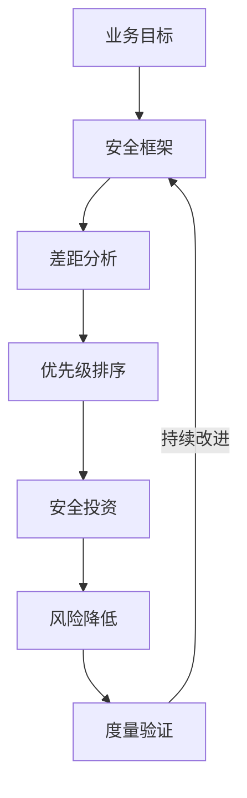
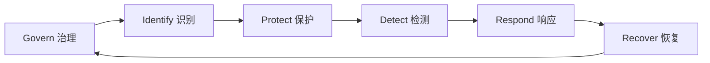
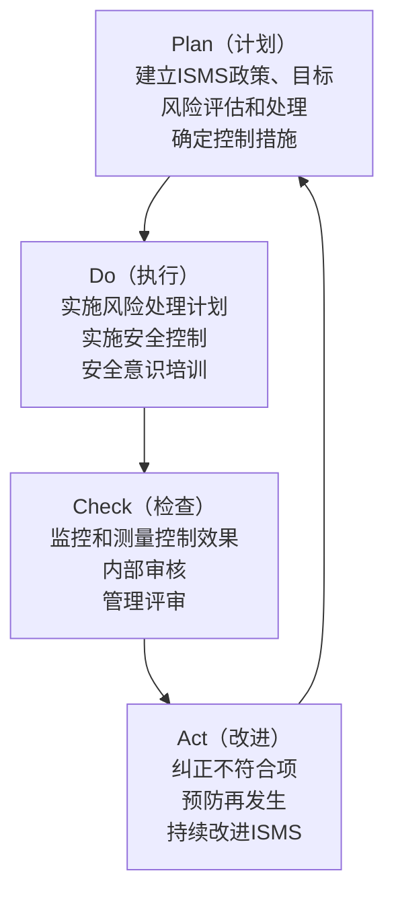
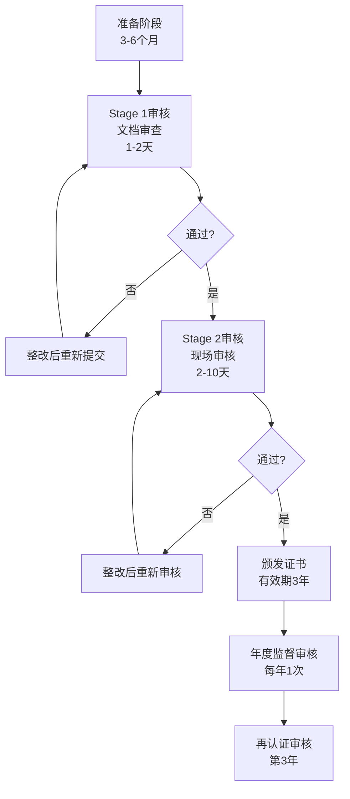
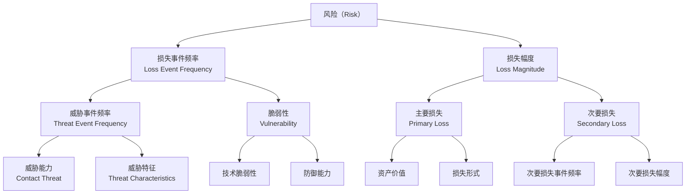
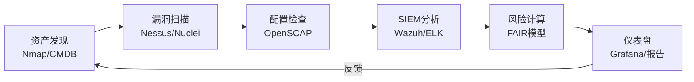

## 十一、安全评估框架

安全评估框架是组织系统化管理网络安全风险的"骨架"——它回答的不是"某个漏洞怎么修"，而是"我们整体安全水位在哪里、该往哪走、怎么走"。没有框架的安全建设就像没有蓝图的施工：投入大量资源却不知道是否覆盖了关键风险。

本节从四个主流框架切入：NIST CSF（治理视角）、ISO 27001（认证视角）、FAIR（量化视角）、OCTAVE（实操视角），然后对比选型并给出落地方法论。

### 11.1 为什么需要安全评估框架

**零散安全建设的典型困境：**

| 困境 | 表现 | 后果 |
|------|------|------|
| 覆盖盲区 | 只关注Web安全，忽略物理安全和供应链 | 攻击者从最薄弱环节突破 |
| 重复投入 | 多个团队各自采购SIEM、WAF、EDR | 工具重叠但告警无人响应 |
| 无法度量 | "我们安全吗？""大概还行？" | 无法向管理层证明安全投资回报 |
| 合规被动 | 监管检查前突击补文档 | 罚款 + 声誉损失 |
| 缺乏持续性 | 项目制安全，做完就停 | 安全水位逐年退化 |

**框架的价值：** 提供结构化的评估维度、统一的安全语言、可度量的成熟度模型、以及持续改进的路线图。



### 11.2 NIST网络安全框架（Cybersecurity Framework）

NIST CSF 由美国国家标准与技术研究院发布，是全球采用最广泛的网络安全框架。2024年发布的CSF 2.0版本将适用范围从关键基础设施扩展到所有组织，并新增了"治理（Govern）"核心功能。

#### 11.2.1 六大核心功能

CSF 2.0 采用六功能模型，形成"识别→保护→检测→响应→恢复→治理"的闭环：



**Govern（治理）—— CSF 2.0新增：**

治理功能是整个框架的"大脑"，确保安全策略与业务目标对齐：

- **组织上下文（GV.OC）**：理解组织的使命、利益相关方和法律义务，确定风险管理的范围和优先级。例如一家医疗机构需要优先保护患者健康信息（PHI），而金融机构则需优先保障交易完整性。
- **风险管理策略（GV.RM）**：建立组织的风险偏好声明（Risk Appetite Statement），明确可接受的风险水平。例如"我们接受单次安全事件造成的直接损失不超过50万元，但不接受任何导致客户数据大规模泄露的风险"。
- **角色、职责和权限（GV.RR）**：明确董事会、CISO、安全团队、业务部门在安全治理中的具体职责。关键点：安全不能只是IT部门的事，业务负责人必须承担"数据所有者"角色。
- **政策（GV.PO）**：将安全要求文档化为可执行的政策体系，包括信息安全政策、可接受使用政策、数据分类政策等。
- **监督（GV.SO）**：建立对安全策略执行效果的监督机制，包括定期审查、内部审计和管理层汇报。

**Identify（识别）：**

识别功能是所有其他功能的基础——你无法保护不知道自己拥有的东西。

- **资产管理（ID.AM）**：建立并维护所有资产的清单，包括硬件、软件、数据、人员、设施和外部服务。实操要点：使用CMDB（配置管理数据库）自动化资产发现，而非依赖人工Excel。推荐工具：Snipe-IT（开源资产管理系统）、Nessus（资产发现+漏洞扫描一体化）。
- **风险评估（ID.RA）**：定期识别资产面临的威胁和脆弱性，评估风险的可能性和影响。关键区别：漏洞扫描≠风险评估，前者只找技术漏洞，后者还需评估业务影响和威胁动机。
- **改进（ID.IM）**：从安全评估、审计、事件和测试中识别改进机会，将经验教训反馈到安全策略中。
- **供应链风险管理（ID.SC）**：识别、评估和管理与供应商、合作伙伴相关的安全风险。这是近年攻击热点——SolarWinds供应链攻击影响了18000个组织，包括美国政府机构。

**Protect（保护）：**

保护功能实施安全控制以防止或减少安全事件的影响：

- **身份管理、认证和访问控制（PR.AA）**：实施最小权限原则、多因素认证（MFA）、基于角色的访问控制（RBAC）。实操：对所有特权账户强制MFA，对远程访问使用零信任架构（ZTNA）替代传统VPN。
- **意识和培训（PR.AT）**：对所有员工进行安全意识培训，对特定角色（开发人员、系统管理员）进行专项安全培训。度量标准：钓鱼模拟测试的点击率应低于5%，培训覆盖率应达100%。
- **数据安全（PR.DS）**：实施数据分类、加密（传输中和静态）、数据防泄漏（DLP）、备份和恢复策略。常见错误：只加密数据库不加密备份，只加密外部通信不加密内部微服务间通信。
- **平台安全（PR.PS）**：确保系统和软件的安全配置和维护，包括补丁管理、安全基线配置、安全开发生命周期（SDLC）。
- **技术基础设施韧性（PR.IR）**：构建能够抵御攻击并快速恢复的技术基础设施，包括冗余设计、灾难恢复、业务连续性计划。

**Detect（Detect）：**

检测功能确保能够及时发现安全事件：

- **持续监控（DE.CM）**：部署SIEM、NDR、EDR等安全监控工具，实现7×24小时持续监控。关键：不是部署了工具就完事，需要有专人分析告警——Gartner报告显示平均每天10000+条安全告警中，只有不到5%真正需要响应。
- **不良事件分析（DE.AE）**：建立安全事件分析流程，将告警关联分析，识别真实的安全事件。推荐方法：使用MITRE ATT&CK框架构建检测规则，覆盖TTP（战术、技术、程序）而非仅检测IOC（威胁指标）。

**Respond（响应）：**

响应功能确保在安全事件发生时能够有效应对：

- **事件管理（RS.MA）**：建立事件响应计划（IRP），包括事件分类、升级流程、角色职责、沟通计划。关键：事件响应计划必须定期演练（至少每年两次桌面推演，一次实战演练），否则在真实事件面前会手忙脚乱。
- **事件分析（RS.AN）**：对安全事件进行根因分析（RCA），确定事件的范围、影响和根本原因。
- **事件响应报告和沟通（RS.CO）**：在事件响应过程中和之后进行有效沟通，包括向管理层、监管机构、受影响方的通报。
- **事件缓解（RS.MI）**：采取措施遏制事件、消除威胁、恢复受影响系统。

**Recover（恢复）：**

恢复功能确保在安全事件后能够恢复正常运营：

- **事件恢复计划执行（RC.RP）**：按照预先制定的恢复计划恢复受影响的服务和系统。
- **事件恢复沟通（RC.CO）**：在恢复过程中与利益相关方保持沟通。

#### 11.2.2 CSF实施层级（Implementation Tiers）

CSF定义了四个实施层级，帮助组织评估当前的安全治理成熟度：

| 层级 | 名称 | 特征 | 适用场景 |
|------|------|------|----------|
| Tier 1 | 部分（Partial） | 安全活动是临时和被动的，缺乏组织级风险管理意识 | 刚起步的小型组织 |
| Tier 2 | 风险知情（Risk-Informed） | 管理层了解风险但未形成组织级政策，安全实践不一致 | 有一定安全意识但未体系化的组织 |
| Tier 3 | 可重复（Repeatable） | 有正式的安全政策，安全实践可重复执行，定期更新 | 中大型组织的标准目标 |
| Tier 4 | 自适应（Adaptive） | 根据历史经验和预测分析持续调整安全实践，主动适应威胁变化 | 金融、国防等高安全需求组织 |

#### 11.2.3 CSF落地路径

**Step 1：创建当前状态画像（Current Profile）**

对照CSF子类（Subcategories），逐项评估当前安全实践的实施情况：

```text
示例 — PR.AC-1（身份和凭证管理）：
- 当前状态：使用Active Directory管理用户，部分系统使用LDAP集成
- 存在问题：共享账户仍然存在，离职员工账户未及时禁用，MFA仅覆盖VPN
- 目标状态：100%个人账户，离职24小时内禁用，所有外部访问强制MFA
```

**Step 2：执行差距分析**

将当前状态与目标状态逐项对比，识别差距并按优先级排序。优先级矩阵：

| 优先级 | 条件 | 示例 |
|--------|------|------|
| P0-紧急 | 高影响 + 高可能性 + 合规要求 | 客户数据库未加密存储 |
| P1-重要 | 高影响 + 中可能性 | 缺乏事件响应计划 |
| P2-一般 | 中影响 + 中可能性 | 安全意识培训覆盖率不足 |
| P3-优化 | 低影响或低可能性 | 部分日志未集中收集 |

**Step 3：制定目标状态（Target Profile）**

根据业务目标、风险偏好和合规要求，设定每个子类的目标实施层级。不必追求所有子类都达到Tier 4——成本收益最优的选择通常是将关键资产相关子类推到Tier 3，非关键子类维持Tier 2。

**Step 4：制定行动计划并执行**

将差距转化为具体的行动计划，分配资源、设定时间表、指定负责人。建议使用项目管理工具跟踪执行进度。

**Step 5：持续度量和改进**

建立KPI和KRI（关键风险指标）体系，定期评估安全水位变化：

```yaml
安全度量指标示例：
  # 保护类指标
  补丁合规率: ">95% 关键漏洞7天内修复"
  MFA覆盖率: ">99% 所有用户账户"
  # 检测类指标
  MTTD(平均检测时间): "<24小时"
  安全告警误报率: "<60%"
  # 响应类指标
  MTTR(平均响应时间): "<4小时 P0事件"
  事件响应计划演练频率: ">=2次/年"
  # 恢复类指标
  RTO(恢复时间目标): "<4小时 核心业务"
  RPO(恢复点目标): "<1小时 核心数据"
```

### 11.3 ISO 27001信息安全管理体系

ISO/IEC 27001是信息安全管理体系（ISMS）的国际标准，是唯一可通过认证的主流安全框架。2022年发布的ISO 27001:2022对控制措施进行了重大重组。

#### 11.3.1 ISMS与PDCA循环

ISO 27001的核心思想是"建立、实施、维护和持续改进"信息安全管理体系。PDCA循环贯穿始终：



#### 11.3.2 ISO 27001:2022 Annex A控制措施

2022版将原来114项控制措施重组为93项，分为4个主题域：

**A.5 组织控制（37项）：**

组织控制是ISMS的治理基础，重点包括：

- **A.5.1 信息安全策略**：制定由管理层批准的信息安全策略，并在整个组织内传达。策略不是一份文档就完事——需要至少每年评审一次，确保与业务变化和技术发展保持同步。
- **A.5.3 职责分离**：关键操作必须由不同人员执行，防止一人独揽大权。例如：开发人员不能直接在生产环境部署代码，财务审批和执行必须分离。
- **A.5.9 信息和其他相关资产清单**：维护所有信息资产的清单，明确资产所有者。这通常是ISO 27001认证审核的第一个检查点。
- **A.5.12 信息分类**：根据信息的敏感性、法律要求和业务价值进行分类。典型分类方案：

| 级别 | 定义 | 处理要求 | 示例 |
|------|------|----------|------|
| 公开 | 可自由公开的信息 | 无特殊要求 | 产品手册、公开网页 |
| 内部 | 仅限组织内部使用 | 不得对外传播 | 内部通讯录、会议纪要 |
| 机密 | 仅限授权人员访问 | 加密存储和传输、访问审批 | 客户数据、财务报表 |
| 绝密 | 严格限制访问 | 特殊安全措施、知情需知原则 | 核心源代码、并购计划 |

- **A.5.14 信息传输**：建立信息传输的安全规则和程序，包括电子邮件加密、文件传输协议选择、物理介质运输要求。
- **A.5.23 云服务信息安全**：这是2022新增的控制措施，要求建立云服务使用的安全策略，包括云服务商评估、数据驻留要求、云安全配置管理。
- **A.5.28 信息安全事件的收集证据**：建立收集、保存和呈现数字证据的程序，确保事件调查的证据链完整性和法律可采性。

**A.6 人员控制（8项）：**

- **A.6.1 入职筛选**：对候选人进行背景调查，验证身份、学历、工作经历和犯罪记录。
- **A.6.2 信息安全意识、教育和培训**：为所有员工提供适当的安全意识培训。新员工入职一周内必须完成基础安全培训。
- **A.6.3 纪律处分过程**：建立违反安全政策的纪律处分流程，确保公平和一致。
- **A.6.6 保密或不披露协议**：与员工和第三方签订保密协议（NDA），明确保密义务和违约后果。
- **A.6.8 信息安全事件报告**：建立事件报告机制，鼓励员工及时报告可疑事件，不因报告而受惩罚。

**A.7 物理控制（14项）：**

- **A.7.1 物理安全边界**：使用围墙、门禁、监控等措施保护安全区域。
- **A.7.2 物理入口控制**：对进入安全区域的人员进行身份验证和授权。
- **A.7.4 物理安全监控**：使用CCTV、入侵检测等手段监控物理环境。
- **A.7.9 信息处理设施的安全处置或再利用**：在处置或再利用存储介质前，安全擦除所有数据。关键：简单的格式化或删除文件不够——需要使用DoD 5220.22-M或NIST SP 800-88标准进行数据销毁。
- **A.7.10 资产的搬迁**：控制设备和存储介质的搬迁，防止未授权移动。

**A.8 技术控制（34项）：**

- **A.8.2 特权访问权限**：限制和管理特权账户的使用。特权账户必须启用MFA，操作全程录像或日志记录。
- **A.8.5 安全认证**：建立安全的认证机制，包括密码策略、MFA实施、生物识别等。
- **A.8.9 配置管理**：建立安全配置基线，使用自动化工具（如Ansible、Puppet）确保系统配置一致性。
- **A.8.12 数据防泄漏（DLP）**：实施DLP措施防止敏感数据泄露。
- **A.8.16 监控活动**：部署安全信息和事件管理（SIEM）系统，实现集中化日志收集和分析。
- **A.8.25 安全开发生命周期**：在软件开发过程中嵌入安全实践，包括安全需求分析、安全设计评审、安全编码、安全测试、安全部署。
- **A.8.28 安全编码**：建立安全编码标准，使用静态应用安全测试（SAST）和动态应用安全测试（DAST）工具。

#### 11.3.3 ISO 27001认证流程



**认证成本估算（中型企业，50-200人）：**

| 项目 | 费用范围（人民币） | 说明 |
|------|---------------------|------|
| 咨询服务 | 15-40万 | 差距分析、体系建立、内审培训 |
| 认证审核 | 8-15万 | Stage 1 + Stage 2 审核费 |
| 工具和技术 | 10-30万 | SIEM、DLP、加密等技术投入 |
| 人员投入 | 隐性成本 | 内部团队至少投入3-6个月精力 |
| 年度维护 | 5-10万/年 | 监督审核 + 体系维护 |

#### 11.3.4 ISO 27001:2022的变化要点

2022版相比2013版的主要变化：

1. **控制措施重组**：从14个域114项变为4个主题93项，新增11项控制措施
2. **新增控制措施**：威胁情报（A.5.7）、云服务信息安全（A.5.23）、ICT业务连续性准备（A.5.30）、物理安全监控（A.7.4）、配置管理（A.8.9）、信息删除（A.8.10）、数据防泄漏（A.8.12）、监控活动（A.8.16）、网页过滤（A.8.23）、安全编码（A.8.28）
3. **属性标记**：为每项控制措施添加5个属性（控制类型、信息安全属性、网络安全概念、运营能力、安全域），支持灵活筛选和映射
4. **更强调风险管理**：要求组织根据自身风险评估结果选择和调整控制措施

### 11.4 FAIR风险分析框架

FAIR（Factor Analysis of Information Risk）是唯一成熟的定量信息安全风险分析模型。它将信息安全风险量化为财务损失，让安全团队能够用业务语言（钱）与管理层沟通。

#### 11.4.1 FAIR核心模型

FAIR将风险分解为两个核心要素的组合：



**核心公式：**

```text
风险 = 损失事件频率(LEF) × 损失幅度(LM)

其中：
  损失事件频率(LEF) = 威胁事件频率(TEF) × 脆弱性(VUL)
  损失幅度(LM) = 主要损失(PL) + 次要损失(SL)

  威胁事件频率(TEF)：威胁源与资产接触并试图利用的频率
  脆弱性(VUL)：威胁尝试成功的概率（0-100%）
  主要损失(PL)：事件对组织的直接影响（运营中断、数据修复等）
  次要损失(SL)：事件的间接影响（声誉损失、监管罚款、诉讼等）
```

#### 11.4.2 FAIR风险计算示例

**场景：某电商平台客户数据库泄露风险**

```text
Step 1：评估威胁事件频率(TEF)
  - 历史数据：过去3年该行业遭受数据库攻击的平均频率
  - 威胁情报：当前针对电商平台的攻击活跃度
  - 估算：TEF = 约 0.8次/年（每15个月可能发生一次威胁尝试）

Step 2：评估脆弱性(VUL)
  - 数据库已加密：降低成功概率
  - 访问控制较完善：进一步降低
  - 但存在SQL注入风险：增加成功概率
  - 估算：VUL = 30%（威胁尝试成功的概率）

Step 3：计算损失事件频率(LEF)
  LEF = TEF × VUL = 0.8 × 30% = 0.24次/年（约每4年一次）

Step 4：评估主要损失(PL)
  - 响应和调查成本：50-100万元
  - 通知成本（通知受影响客户）：20-50万元
  - 信用监控服务：30-80万元
  - 运营中断损失：10-30万元
  - 主要损失估算：110-260万元，取中间值185万元

Step 5：评估次要损失(SL)
  - 客户流失（预计5-15%客户减少使用）：200-500万元
  - 监管罚款（《个人信息保护法》最高5000万或上年营收5%）：500-2000万元
  - 诉讼和和解：100-500万元
  - 品牌价值损失：难以量化，暂估100-300万元
  - 次要损失估算：900-3300万元，取中间值2100万元

Step 6：计算年化预期损失(ALE)
  ALE = LEF × LM = 0.24 × (185 + 2100) = 0.24 × 2285 = 548.4万元/年

结论：该数据库泄露风险的年化预期损失约548万元。
如果投资300万元实施加密增强+WAF+数据库审计可将VUL从30%降到10%，
则新ALE = 0.8 × 10% × 2285 = 182.8万元/年，
年风险降低收益 = 548.4 - 182.8 = 365.6万元，
投资回报率(ROI) = (365.6 - 300) / 300 = 21.9%。
```

#### 11.4.3 FAIR实施要点

**数据收集的挑战：** FAIR最大的难点不是模型本身，而是获取可靠的输入数据。推荐数据来源：

- 内部历史事件记录（最可靠）
- 行业报告（Verizon DBIR、IBM数据泄露成本报告）
- 威胁情报平台（Mandiant、Recorded Future）
- 专家判断（Delphi法，多位专家独立评估后取共识）

**概率分布而非点估计：** FAIR推荐使用Monte Carlo模拟而非单点估计。例如TEF不是"0.8次/年"而是"最小0.2，最可能0.8，最大2.0"的三角分布，通过10000次模拟得到风险的概率分布。

**常用工具：**

| 工具 | 类型 | 特点 |
|------|------|------|
| RiskLens | 商业SaaS | FAIR官方推荐，企业级Monte Carlo分析 |
| FAIR-U | 免费（OpenFAIR） | 简化版FAIR分析，适合入门 |
| FAIR Spreadsheet | Excel模板 | 开源社区提供的计算模板 |
| Python + NumPy | 自定义 | 灵活度最高，可集成到内部系统 |

### 11.5 OCTAVE风险评估方法

OCTAVE（Operationally Critical Threat, Asset, and Vulnerability Evaluation）由卡内基梅隆大学CERT/CC开发，是一种以资产为中心的自导向（self-directed）风险评估方法。与依赖外部顾问不同，OCTAVE强调由组织内部团队主导评估过程。

#### 11.5.1 OCTAVE的演进

| 版本 | 特点 | 适用场景 |
|------|------|----------|
| OCTAVE | 原始版本，文档量大、过程复杂 | 大型组织，有充足资源和时间 |
| OCTAVE-S | 简化版，减少文档工作量 | 中型组织（500人以下） |
| OCTAVE Allegro | 最新版本，专注于信息安全风险 | 所有规模组织，可定制流程 |

#### 11.5.2 OCTAVE Allegro八步法

OCTAVE Allegro是最实用的版本，采用结构化的八步评估流程：

**步骤1：建立风险测量标准**

在评估开始前，组织需要先定义风险的度量标准。这不是技术问题而是业务问题——需要管理层参与定义什么是"高风险"、"中风险"、"低风险"：

```text
影响度量标准示例：
  高（H）：收入损失>100万、监管罚款>50万、核心业务中断>4小时
  中（M）：收入损失10-100万、监管罚款5-50万、业务中断1-4小时
  低（L）：收入损失<10万、无罚款、业务中断<1小时

可能性度量标准示例：
  高（H）：过去1年内发生过，或行业普遍发生
  中（M）：过去3年内发生过，或行业偶有发生
  低（L）：从未发生过，但理论上可行
```

**步骤2：识别关键信息资产**

不是识别所有资产，而是聚焦于对业务运营至关重要的信息资产。评估维度：

- 资产支撑的业务流程是什么？
- 资产的机密性、完整性、可用性需求分别是什么？
- 资产的当前保护措施是什么？
- 谁是资产的所有者（Accountable）和管理者（Responsible）？

**步骤3：识别资产面临的需求**

对每个关键资产，识别其面临的安全需求——即需要保护的属性：

- 机密性需求：谁可以访问？访问什么？
- 完整性需求：数据准确性有多重要？可以容忍什么程度的篡改？
- 可用性需求：可以容忍多长时间的中断？恢复时间要求？

**步骤4：识别威胁源和威胁场景**

针对每个资产的安全需求，识别可能的威胁源和威胁场景：

| 威胁源 | 动机 | 典型攻击手段 |
|--------|------|--------------|
| 外部黑客 | 经济利益、黑客主义 | SQL注入、钓鱼、勒索软件 |
| 内部人员（恶意） | 报复、经济利益 | 数据窃取、权限滥用 |
| 内部人员（无意） | 疏忽 | 误操作、数据外发错误 |
| 供应链合作伙伴 | - | 第三方系统入侵、数据共享风险 |
| 自然灾害 | - | 火灾、洪水、地震 |
| 竞争对手 | 商业利益 | 商业间谍、DDoS攻击 |

**步骤5：识别风险**

将威胁场景转化为具体的风险项，评估每个风险的影响和可能性，形成风险矩阵：

```text
          可能性
          低    中    高
  影响  高  [中]  [高]  [高]
        中  [低]  [中]  [高]
        低  [低]  [低]  [中]
```

**步骤6：选择并分析风险缓解方法**

对每个高风险和中风险项，评估三种应对策略：

- **接受**：风险在可接受范围内，记录决策理由
- **降低**：实施安全控制措施降低风险
- **转移**：通过保险或外包将风险转移给第三方

**步骤7：执行风险缓解计划**

制定具体的风险缓解行动计划，包括：控制措施描述、实施时间表、资源需求、负责人、验证标准。

**步骤8：建立持续监控机制**

建立定期重评估的机制，确保风险评估结果持续有效。建议频率：高风险项每季度重评估，中风险项每半年，低风险项每年。

### 11.6 其他重要评估框架

除了上述四大框架，以下框架在特定场景中同样重要：

#### 11.6.1 CIS关键安全控制（CIS Controls）

CIS Controls由互联网安全中心发布，是一套优先级明确的技术安全控制清单。最新版本（v8）包含18个控制组，细分为153个子控制。最大特点是"优先级驱动"——从最基础的"基本卫生"（IG1）到"高级"（IG3），组织可根据自身成熟度逐步实施。

**18个CIS控制组概览：**

| 编号 | 控制组 | 核心内容 |
|------|--------|----------|
| CIS 1 | 资产清单和控制 | 建立和维护IT资产清单 |
| CIS 2 | 服务提供商管理 | 管理服务提供商的安全风险 |
| CIS 3 | 数据保护 | 识别和保护敏感数据 |
| CIS 4 | 安全配置 | 建立和维护安全配置基线 |
| CIS 5 | 账户管理 | 建立和维护账户管理流程 |
| CIS 6 | 访问控制管理 | 建立和维护访问控制策略 |
| CIS 7 | 持续漏洞管理 | 建立和维护漏洞管理流程 |
| CIS 8 | 审计日志管理 | 建立和维护审计日志 |
| CIS 9 | 电子邮件和浏览器保护 | 提高电子邮件和浏览器安全性 |
| CIS 10 | 恶意软件防御 | 建立和维护恶意软件防御 |
| CIS 11 | 数据恢复 | 建立和维护数据恢复流程 |
| CIS 12 | 网络基础设施管理 | 建立和维护网络安全管理 |
| CIS 13 | 网络监控和防御 | 建立和维护网络监控 |
| CIS 14 | 安全意识和技能培训 | 建立和维护安全意识培训 |
| CIS 15 | 服务提供商管理 | 管理第三方服务安全 |
| CIS 16 | 应用软件安全 | 建立和维护应用安全 |
| CIS 17 | 事件响应管理 | 建立和维护事件响应流程 |
| CIS 18 | 渗透测试 | 建立和维护渗透测试程序 |

#### 11.6.2 CMMI安全成熟度模型

CMMI（Capability Maturity Model Integration）的安全变体将安全能力分为五个成熟度等级：

| 等级 | 名称 | 安全特征 | 典型表现 |
|------|------|----------|----------|
| 1 | 初始级 | 安全活动无序 | 救火式安全响应，无标准流程 |
| 2 | 管理级 | 项目级安全管理 | 有基本安全流程但各项目不统一 |
| 3 | 定义级 | 组织级安全管理 | 统一的安全标准和流程全组织推广 |
| 4 | 量化管理级 | 量化安全度量 | 用数据驱动安全决策，可预测安全绩效 |
| 5 | 优化级 | 持续安全改进 | 基于量化数据持续优化安全过程 |

#### 11.6.3 中国网络安全等级保护（等保2.0）

等保2.0是中国的网络安全基本制度，所有在中国运营的网络运营者都必须遵守。它将信息系统分为五个安全保护等级：

| 等级 | 适用对象 | 安全要求 | 典型场景 |
|------|----------|----------|----------|
| 第一级 | 用户自主保护 | 基本安全保护 | 个人网站、小型企业非核心系统 |
| 第二级 | 系统审计保护 | 较强安全保护 | 一般企业内部系统、非敏感数据 |
| 第三级 | 安全标记保护 | 强制安全保护 | 政府机关、金融机构、大型企业核心系统 |
| 第四级 | 结构化保护 | 强制安全保护+增强 | 国家关键基础设施、大型银行核心系统 |
| 第五级 | 访问验证保护 | 最高等级保护 | 国防、军事、核设施 |

**等保2.0十大安全域：**

1. 安全物理环境
2. 安全通信网络
3. 安全区域边界
4. 安全计算环境
5. 安全管理中心
6. 安全管理制度
7. 安全管理机构
8. 安全管理人员
9. 安全建设管理
10. 安全运维管理

等保2.0的特色是"一个中心三重防护"——以安全管理中心为核心，构建安全通信网络、安全区域边界、安全计算环境三重防护体系。

#### 11.6.4 MITRE ATT&CK框架

虽然MITRE ATT&CK严格来说不是评估框架，但它是安全评估中不可或缺的参考矩阵。它将攻击者行为系统化为14个战术域和200+技术，可用于：

- **红队评估**：根据ATT&CK矩阵规划攻击路径
- **蓝队检测**：对照ATT&CK构建检测覆盖度矩阵
- **差距分析**：识别当前安全控制未能覆盖的攻击技术
- **威胁建模**：针对特定APT组织的TTP评估防御能力

### 11.7 框架选型与组合使用

#### 11.7.1 框架对比

| 维度 | NIST CSF | ISO 27001 | FAIR | OCTAVE | CIS Controls | 等保2.0 |
|------|----------|-----------|------|--------|--------------|---------|
| 性质 | 指南 | 认证标准 | 风险模型 | 评估方法 | 控制清单 | 法规要求 |
| 是否可认证 | 否 | 是 | 否 | 否 | 否 | 是（等保测评） |
| 风险量化 | 否 | 否 | 是 | 半定量 | 否 | 否 |
| 控制粒度 | 中 | 高 | 低 | 中 | 极高 | 高 |
| 实施难度 | 中 | 高 | 中 | 中 | 低-中 | 中-高 |
| 适用范围 | 所有组织 | 所有组织 | 所有组织 | 中大型组织 | 技术团队 | 中国境内组织 |
| 主要价值 | 治理框架 | 管理体系认证 | 风险沟通 | 风险识别 | 技术实施优先级 | 合规要求 |

#### 11.7.2 推荐组合策略

不同规模和需求的组织应选择不同的框架组合：

**初创企业/小型组织（<50人）：**
```text
CIS Controls IG1（基础技术控制）
+ NIST CSF Tier 1-2（基本治理框架）
+ 等保2.0二级（合规要求）
```
重点：先做好基础卫生——资产清单、补丁管理、访问控制、备份恢复、安全意识培训。

**中型企业（50-500人）：**
```text
NIST CSF Tier 2-3（体系建设）
+ ISO 27001（认证驱动体系化）
+ CIS Controls IG1-2（技术实施）
+ FAIR（关键风险量化）
+ 等保2.0三级（合规要求）
```
重点：建立可重复的安全管理体系，用FAIR量化关键风险来支撑安全投资决策。

**大型企业/关键基础设施（500+人）：**
```text
NIST CSF Tier 3-4（成熟治理体系）
+ ISO 27001 + ISO 27017/27018（云安全和隐私扩展）
+ FAIR（全面风险量化）
+ CIS Controls IG1-3（全量技术控制）
+ MITRE ATT&CK（攻防能力评估）
+ 等保2.0三级/四级（合规要求）
```
重点：用量化数据驱动安全决策，建立自适应安全体系，覆盖供应链和云环境。

### 11.8 安全评估框架落地实操

#### 11.8.1 评估启动清单

在启动安全评估前，确保以下前提条件就绪：

```yaml
评估启动检查清单:
  获得管理层支持:
    - [ ] 获得CEO/CTO/CIO的书面授权
    - [ ] 明确评估范围和目标
    - [ ] 确认预算和资源分配
  组建评估团队:
    - [ ] 指定项目负责人（通常为CISO或安全经理）
    - [ ] 组建跨部门评估小组（IT、业务、法务、HR）
    - [ ] 必要时聘请外部顾问
  准备评估工具:
    - [ ] 选定评估框架
    - [ ] 准备评估问卷/检查表
    - [ ] 准备资产发现工具（如Nmap、Nessus）
    - [ ] 准备文档模板
  数据收集:
    - [ ] 收集现有安全政策文档
    - [ ] 收集组织架构和职责分工
    - [ ] 收集资产清单（至少是初版）
    - [ ] 收集历史安全事件记录
```

#### 11.8.2 常见落地陷阱

**陷阱1：只建文档不落地**

ISO 27001认证过程中最常见的问题——团队花了6个月写了一堆精美的安全文档，但实际操作中没人按文档执行。审核时发现日志没人看、事件响应计划从未演练、访问控制列表半年没更新。

**应对：** 安全文档必须是"做过的记录"而非"要做的计划"。每份文档对应一个实际运行的流程，每条流程对应一个可验证的输出物。

**陷阱2：追求全面覆盖忽视风险优先级**

试图一次性将所有CSF子类都推到Tier 4，结果预算爆表、团队疲惫、重点模糊。

**应对：** 用FAIR或类似方法识别TOP 10风险，优先将与这些风险相关的控制措施做到位。80/20法则——20%的控制措施解决80%的风险。

**陷阱3：安全评估变成一次性项目**

评估完成后写一份报告，然后束之高阁，三年后发现环境已经完全不同但评估报告还是旧的。

**应对：** 建立持续评估机制——用自动化工具持续监控安全控制的执行情况，每季度进行一次轻量级重评估，每年进行一次全面评估。

**陷阱4：忽视人的因素**

投入大量资金购买安全工具，但安全团队人手不足、技能不够，工具买来不会用、没人看告警。

**应对：** 安全预算应至少30%分配给人员培训和能力建设。安全工具的有效性取决于使用它的人——没有合格的安全分析师，SIEM只是一堆昂贵的硬盘。

**陷阱5：评估脱离业务上下文**

技术团队主导评估，只关注技术漏洞，完全不了解业务流程和业务需求，评估结果与业务脱节。

**应对：** 评估团队必须包含业务部门代表，风险评估必须考虑业务影响，安全投资回报必须用业务语言表达。

#### 11.8.3 评估报告模板

一份合格的安全评估报告应包含以下内容：

```text
1. 执行摘要（1-2页）
   - 评估范围和方法
   - 关键发现总结（不超过10条）
   - 整体安全成熟度评级
   - 高层建议

2. 评估方法论
   - 使用的框架和标准
   - 评估范围和边界
   - 评估团队和时间表
   - 数据收集方法

3. 当前状态评估
   - 逐项评估结果（对照框架要求）
   - 成熟度评级（每个功能域/控制域）
   - 已有优势和良好实践

4. 差距分析
   - 与目标状态的差距清单
   - 差距的风险等级（高/中/低）
   - 差距的业务影响说明

5. 风险评估
   - TOP 10风险清单
   - 每个风险的描述、影响、可能性
   - 当前控制措施和剩余风险

6. 改进建议
   - 短期建议（0-3个月）：快速修复关键风险
   - 中期建议（3-12个月）：体系建设
   - 长期建议（1-3年）：成熟度提升
   - 每个建议的投资估算和预期收益

7. 附录
   - 详细评估结果表
   - 参考的法规和标准清单
   - 术语表
```

### 11.9 安全评估的自动化与工具

#### 11.9.1 自动化评估工具矩阵

| 评估维度 | 开源工具 | 商业工具 | 自动化程度 |
|----------|----------|----------|------------|
| 资产发现 | Nmap、Masscan | Qualys、Rapid7 | 高 |
| 漏洞扫描 | OpenVAS、Nuclei | Nessus、Qualys VMDR | 高 |
| 配置合规 | OpenSCAP、Lynis | Tenable.sc、CIS-CAT | 高 |
| 代码安全 | Semgrep、Bandit | Checkmarx、Fortify | 高 |
| 云安全 | ScoutSuite、Prowler | Prisma Cloud、Wiz | 高 |
| 渗透测试 | Metasploit、Burp Suite | Core Impact、Cobalt Strike | 中 |
| 风险评估 | FAIR-U、RiskMatrix | RiskLens、RSA Archer | 低-中 |
| 合规管理 | - | ServiceNow GRC、OneTrust | 中 |

#### 11.9.2 持续安全评估架构

现代安全评估不再是一年一次的"运动式"评估，而是持续的自动化监控和度量：



### 11.10 总结与最佳实践

安全评估框架不是目的而是手段——最终目标是降低风险、保护业务。以下最佳实践供参考：

1. **框架是骨架，业务是血肉**：任何框架都必须根据组织的业务上下文进行定制，生搬硬套只会制造文档垃圾
2. **量化优于定性**：尽可能用数据说话——"风险很高"不如"年化预期损失548万元"有说服力
3. **持续优于一次性**：建立持续评估机制比一年做一次大评估更有效
4. **人比工具重要**：再好的框架和工具都需要有能力的人来执行和解读
5. **合规是底线不是目标**：满足等保或ISO认证只是起点，真正的安全需要超越合规要求
6. **从最重要的一件事开始**：不要试图一次性做所有事，识别最高风险并优先解决
