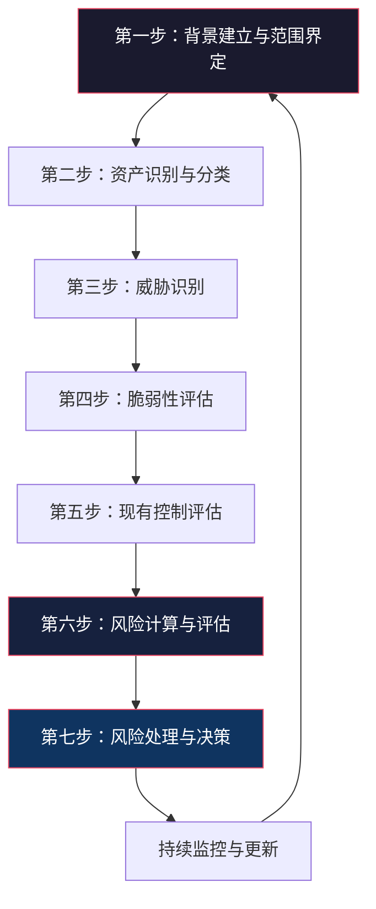
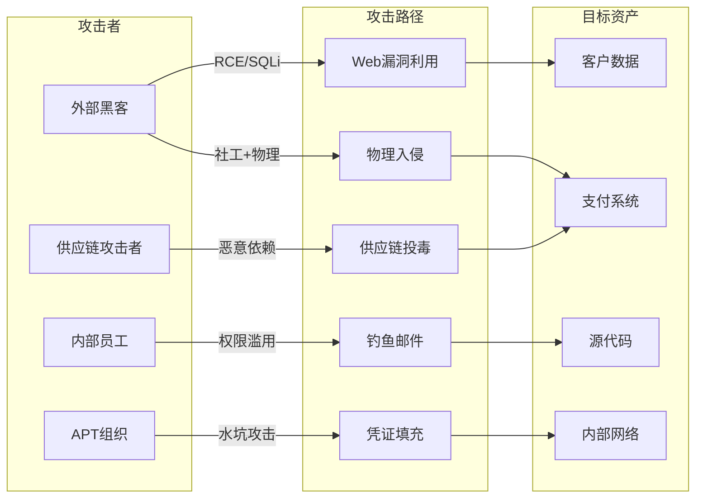
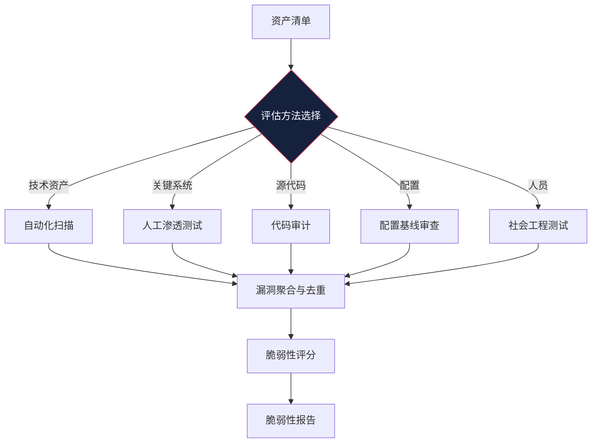
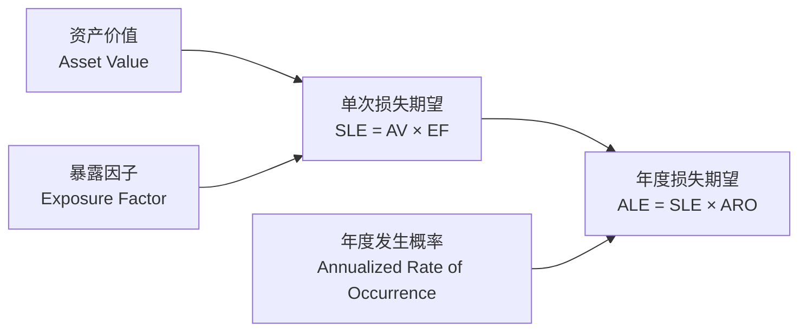
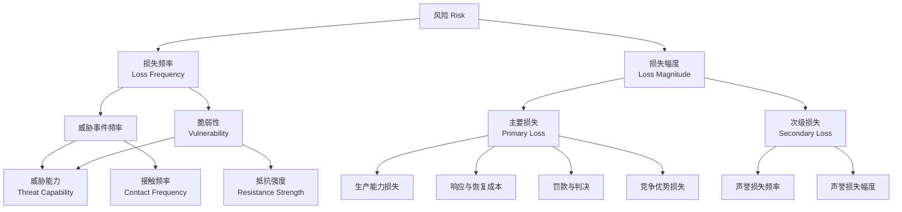
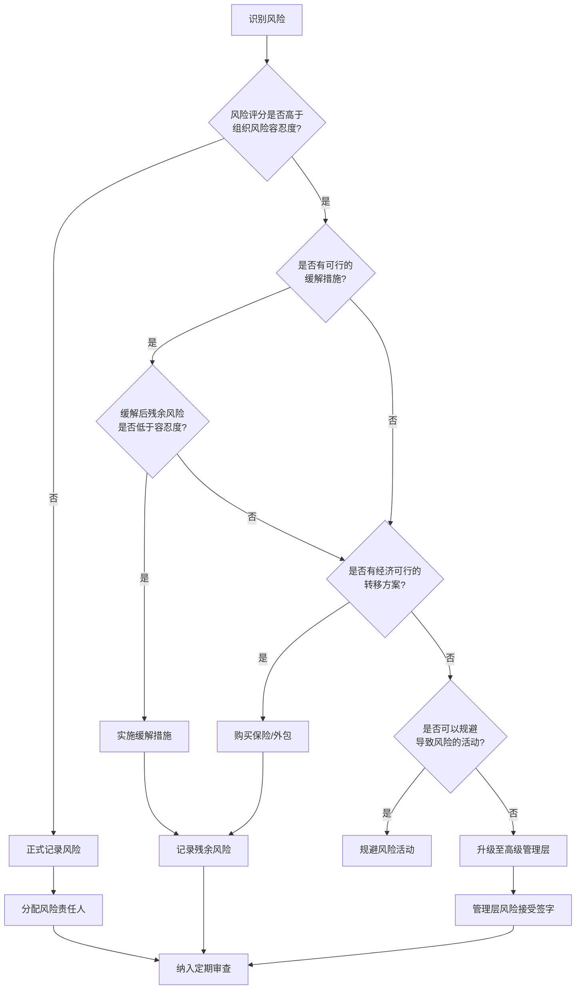

## 十二、风险分析流程

风险分析是安全工作的核心方法论——它回答的不是"系统有什么漏洞"，而是"哪些威胁在什么条件下会造成多大损失，我们应该把有限的资源投在哪里"。没有经过系统风险分析的安全方案，本质上是凭直觉赌博。本节将完整拆解风险分析的每一步骤，从理论模型到实操工具，帮助你建立科学的安全决策能力。

### 12.1 为什么需要结构化的风险分析流程

很多人对"风险分析"的理解停留在"扫一下漏洞、打一下渗透"。这远远不够。结构化风险分析的价值在于：

**1. 将模糊的"不安全感"转化为可量化的决策依据**

业务方经常说"这个系统安全吗？"，安全团队如果只回答"不太安全"，就无法推动任何行动。而如果回答"该系统面临3个高风险威胁，年化损失期望为120万元，建议投入35万元部署WAF和SIEM，可将风险降低至15万元/年"，管理层就能做出有依据的决策。

**2. 确保安全投入与业务风险成比例**

安全预算是有限的。风险分析帮助你回答：保护数据库的100万元投入，比保护内部Wiki的100万元投入，哪个更值得？没有风险分析，安全团队要么平均撒网（每处都不够），要么被最新漏洞新闻牵着走（哪里曝光补哪里）。

**3. 满足合规与审计要求**

ISO 27001、等保2.0、PCI DSS、HIPAA、GDPR等标准都明确要求进行风险分析。不执行风险分析，合规审计无法通过，可能面临罚款或业务限制。

**4. 建立安全团队的可信度**

当安全建议总是基于数据而非感觉，业务方和管理层会逐渐信任安全团队的判断。这种信任在安全事件发生时尤为关键——如果平时的安全建议都经过了充分的风险论证，事件发生后安全团队的处置建议更容易被采纳。

### 12.2 主流风险分析框架概览

在深入具体流程之前，先了解业界公认的风险分析框架，它们提供了标准化的方法论：

| 框架 | 发布机构 | 侧重点 | 适用场景 |
|------|----------|--------|----------|
| **ISO 27005** | ISO/IEC | 信息安全风险管理全流程 | 企业级ISMS建设 |
| **NIST SP 800-30** | 美国NIST | 风险评估的四个阶段 | 政府和关基行业 |
| **FAIR** | FAIR Institute | 定量风险分析 | 需要财务量化决策的场景 |
| **OCTAVE** | CMU SEI | 自主风险评估 | 组织内部自评 |
| **CRAMM** | 英国CCTA | 资产-威胁-脆弱性三元组 | 政府和大型企业 |
| **EBIOS** | 法国ANSSI | 基于场景的风险评估 | 欧洲关键基础设施 |
| **MEHARI** | CLUSIF | 风险评估与安全审计 | 法语区企业 |
| **TARA** | MITRE | 威胁评估与漏洞分析 | 军工和防御领域 |

本节以 ISO 27005 和 NIST SP 800-30 为主线，融合 FAIR 的定量方法，讲解通用的风险分析流程。

### 12.3 风险分析的完整流程

风险分析不是一次性的活动，而是一个持续循环的过程。以下七步流程覆盖了从初始化到持续监控的全生命周期：



#### 12.3.1 第一步：背景建立与范围界定

这是最容易被跳过、也最容易导致后续工作偏离方向的一步。没有清晰的范围界定，风险分析要么变成无底洞，要么遗漏关键领域。

**需要明确的关键要素：**

- **业务目标**：被评估系统/组织的核心业务是什么？停摆1小时、1天、1周分别会造成什么后果？
- **利益相关方**：谁是风险决策者（CEO、CISO、业务负责人）？谁需要参与评估（开发、运维、法务）？
- **评估边界**：是评估整个企业、某个业务线、还是一个特定系统？边界画在哪里？
- **时间范围**：本次评估覆盖未来1年还是3年？是否考虑战略变化？
- **合规要求**：是否有特定法规驱动（等保、GDPR、PCI DSS）？
- **风险偏好**：组织对风险的容忍度如何？是保守型（银行）还是激进型（创业公司）？

**实操模板——风险评估章程：**

```markdown
## 风险评估章程

### 项目名称
2026年Q3电商平台安全风险评估

### 评估范围
- 系统边界：订单系统、支付系统、用户中心、物流对接接口
- 排除范围：内部OA系统、员工培训平台
- 时间跨度：2026年7月-2027年6月（12个月）

### 风险决策者
- 最终决策：CTO
- 日常决策：安全总监

### 合规要求
- 等保三级
- PCI DSS（因涉及支付）

### 风险偏好声明
- 财务损失：单次不超过50万元，年度不超过200万元
- 服务中断：核心业务RTO<4小时，RPO<1小时
- 数据泄露：客户PII零容忍，操作日志可接受偶发延迟
```

#### 12.3.2 第二步：资产识别与分类

资产是风险分析的出发点。资产识别不全，后续所有分析都是在沙上建塔。很多团队只关注技术资产，忽略了数据资产、人员资产和流程资产。

**四维资产分类框架：**

| 资产类别 | 具体类型 | 评估维度 | 典型资产示例 |
|----------|---------|----------|------------|
| **数据资产** | 客户数据（PII/PHI/金融数据）、知识产权（源码/专利/商业秘密）、运营数据（日志/配置/审计记录）、备份数据 | 机密性、完整性、可用性、合规性 | 用户数据库、Git仓库、WAF日志、异地备份 |
| **系统资产** | 服务器（物理/虚拟/容器）、网络设备（路由器/交换机/防火墙）、终端设备（PC/笔记本/移动端）、IoT设备 | 可用性、性能、可维护性 | K8s集群、核心交换机、员工笔记本、门禁终端 |
| **软件资产** | 应用程序（Web/移动/桌面）、中间件（Web服务器/消息队列/缓存）、数据库（关系型/NoSQL/数据仓库）、操作系统、第三方组件 | 完整性、可用性、可扩展性 | 电商系统、Nginx、Redis集群、PostgreSQL、Ubuntu |
| **人员资产** | 关键岗位人员、外部合作伙伴、第三方服务提供商、安全团队 | 知识独占性、可替代性、权限级别 | CISO、外包运维团队、CDN供应商、SOC分析师 |
| **流程资产** | 变更管理流程、事件响应流程、备份恢复流程、访问控制流程 | 成熟度、文档化程度、自动化程度 | CI/CD流水线、应急响应SOP、IAM策略 |

**资产价值评估方法：**

资产价值不能只看采购成本，需要综合考虑以下维度：

```text
资产价值 = 直接损失 + 间接损失 + 恢复成本 + 声誉损失 + 合规罚款

其中：
- 直接损失：业务中断收入损失、数据重建成本
- 间接损失：客户流失、市场份额下降、竞争优势丧失
- 恢复成本：系统修复、数据恢复、取证调查费用
- 声誉损失：品牌价值下降、客户信任度降低（通常最难量化）
- 合规罚款：GDPR最高全球营收4%、等保罚款、行业处罚
```

**实用工具——资产清单模板：**

| 资产ID | 资产名称 | 类别 | 所有者 | 机密性(1-5) | 完整性(1-5) | 可用性(1-5) | 综合价值 | 备注 |
|--------|---------|------|--------|-------------|-------------|-------------|---------|------|
| A-001 | 用户数据库 | 数据 | 用户中心团队 | 5 | 5 | 4 | 极高 | 含PII和支付信息 |
| A-002 | 订单系统 | 软件 | 交易团队 | 3 | 5 | 5 | 极高 | 核心业务系统 |
| A-003 | 内部文档Wiki | 数据 | 行政部 | 2 | 2 | 2 | 低 | 非敏感运营文档 |
| A-004 | 核心交换机 | 系统 | 基础设施团队 | 2 | 3 | 5 | 高 | 单点故障风险 |

#### 12.3.3 第三步：威胁识别

威胁是可能导致资产损害的事件或行为。威胁识别需要系统性思考，而非只关注"最新的漏洞"。

**威胁来源的完整分类：**

| 威胁类别 | 来源 | 动机 | 典型手段 | 可控程度 |
|----------|------|------|---------|---------|
| **人为故意威胁** | 外部黑客、APT组织、内部恶意人员、竞争对手、黑客活动分子 | 经济利益、政治目的、报复、间谍、意识形态 | APT攻击、勒索软件、供应链攻击、社会工程、内部破坏 | 中等（可通过检测和威慑降低） |
| **人为意外威胁** | 内部员工、外包人员、合作伙伴 | 无（操作失误） | 误删数据、错误配置、丢失设备、误发邮件 | 较高（通过培训和流程控制） |
| **技术威胁** | 系统缺陷、软件Bug、硬件故障、兼容性问题 | 无 | 系统崩溃、数据损坏、服务中断、性能降级 | 高（通过冗余和监控降低） |
| **自然威胁** | 地震、洪水、台风、雷击、火灾 | 无 | 基础设施损毁、电力中断、网络中断 | 低（难以控制，需靠灾备应对） |
| **环境威胁** | 温度异常、湿度异常、电磁干扰、灰尘、水浸 | 无 | 设备故障、数据丢失、系统不稳定 | 中等（通过机房建设和运维降低） |
| **供应链威胁** | 供应商、开源组件、云服务商、硬件厂商 | 各异 | 供应链后门、组件漏洞、服务中断、数据泄露 | 低-中等（需持续监控和评估） |

**威胁情报来源（持续更新）：**

| 来源 | 类型 | 更新频率 | 典型用途 |
|------|------|---------|---------|
| **CVE/NVD** | 漏洞数据库 | 实时 | 已知漏洞验证、CVSS评分 |
| **MITRE ATT&CK** | 攻击技术知识库 | 季度 | 攻击手法映射、防御差距分析 |
| **CNVD/CNNVD** | 中国国家漏洞库 | 实时 | 国内漏洞信息、合规要求 |
| **CISA KEV** | 已知被利用漏洞目录 | 持续 | 优先级排序——必须修复 |
| **厂商安全公告** | 原始公告 | 不定期 | 第三方组件漏洞 |
| **威胁情报平台** | STIX/TAXII feeds | 实时 | IOC匹配、威胁狩猎 |
| **行业ISAC** | 行业共享 | 不定期 | 行业特定威胁 |
| **暗网监控** | 泄露信息 | 持续 | 凭据泄露、数据交易 |
| **Bug Bounty平台** | 白帽报告 | 持续 | 未公开漏洞提前知晓 |

**威胁建模的实用方法——STRIDE模型应用：**

STRIDE是微软提出的经典威胁分类模型，每种威胁类型对应一种安全属性的违反：

| 威胁类型 | 全称 | 违反的安全属性 | 防御措施 |
|----------|------|---------------|---------|
| **S** - 仿冒 | Spoofing | 认证 | 强认证机制（MFA、证书） |
| **T** - 篡改 | Tampering | 完整性 | 数字签名、哈希校验、完整性监控 |
| **R** - 抵赖 | Repudiation | 不可否认性 | 审计日志、数字签名、时间戳 |
| **I** - 信息泄露 | Information Disclosure | 机密性 | 加密、访问控制、数据脱敏 |
| **D** - 拒绝服务 | Denial of Service | 可用性 | 限流、冗余、DDoS防护 |
| **E** - 权限提升 | Elevation of Privilege | 授权 | 最小权限、沙箱、权限边界 |

**威胁识别实操：创建威胁场景矩阵**



#### 12.3.4 第四步：脆弱性评估

脆弱性是资产本身的弱点，威胁通过利用脆弱性来造成损害。脆弱性评估的目标不是"找到所有漏洞"，而是"识别可被威胁利用的弱点"。

**脆弱性的层次模型：**

| 层次 | 脆弱性类型 | 评估方法 | 典型工具 |
|------|-----------|---------|---------|
| **架构层** | 设计缺陷、单点故障、信任边界模糊、缺乏纵深防御 | 架构审查、威胁建模 | OWASP Threat Dragon、Microsoft Threat Modeling Tool |
| **代码层** | 编程漏洞（SQL注入、XSS、反序列化、缓冲区溢出） | SAST、DAST、IAST、代码审查 | SonarQube、Semgrep、Checkmarx、Burp Suite |
| **配置层** | 默认配置、错误配置、过期证书、弱加密算法 | 配置审查、合规扫描 | ScoutSuite、Prowler、CIS Benchmarks |
| **运维层** | 补丁延迟、日志不足、备份失效、监控盲区 | 运维审计、渗透测试 | Nessus、OpenVAS、Qualys |
| **人员层** | 安全意识薄弱、社工易感性、密码复用、权限过大 | 社会工程测试、钓鱼模拟 | GoPhish、King Phisher |
| **供应链层** | 第三方组件漏洞、供应商安全不足、依赖链风险 | SCA、SBOM分析 | Dependabot、Snyk、OWASP Dependency-Check |

**脆弱性评估的执行流程：**



**脆弱性严重程度评估（CVSS v3.1）：**

CVSS（Common Vulnerability Scoring System）是业界通用的漏洞评分标准。CVSS v3.1的基础评分由以下指标计算：

| 指标组 | 指标 | 取值范围 | 含义 |
|--------|------|---------|------|
| **可利用性指标** | 攻击向量(AV) | 网络(N)/相邻(A)/本地(L)/物理(P) | 攻击所需的距离 |
| | 攻击复杂度(AC) | 低(L)/高(H) | 攻击所需的条件 |
| | 所需权限(PR) | 无(N)/低(L)/高(H) | 攻击者需要的权限 |
| | 用户交互(UI) | 无(N)/需要(R) | 是否需要用户参与 |
| **影响指标** | 机密性(C) | 无(N)/低(L)/高(H) | 数据泄露程度 |
| | 完整性(I) | 无(N)/低(L)/高(H) | 数据篡改程度 |
| | 可用性(A) | 无(N)/低(L)/高(H) | 服务中断程度 |
| **范围(S) | 不变(U)/改变(C) | 影响是否跨越安全边界 |

CVSS评分不是简单的线性公式，而是基于预定义的度量向量查表得出。可以使用在线计算器：`https://www.first.org/cvss/calculator/3.1`

**评分等级与修复优先级：**

| CVSS评分 | 等级 | 颜色 | 修复SLA |
|----------|------|------|---------|
| 9.0-10.0 | 严重(Critical) | 红色 | 24小时内 |
| 7.0-8.9 | 高危(High) | 橙色 | 7天内 |
| 4.0-6.9 | 中危(Medium) | 黄色 | 30天内 |
| 0.1-3.9 | 低危(Low) | 绿色 | 90天内或下个版本 |

> **重要提醒**：CVSS基础分只是一个起点。实际的修复优先级还需要结合资产价值、威胁情报（是否已被利用）、可利用性（是否有PoC）和业务影响来综合判断。一个CVSS 7.0的漏洞如果已经被CISA KEV收录且正在被积极利用，其优先级应高于CVSS 9.0但尚无公开利用代码的漏洞。

#### 12.3.5 第五步：现有控制评估

在计算风险之前，必须评估当前已有的安全控制措施的有效性。这一步经常被忽略，导致风险评估结果偏高（因为忽略了现有防护）或偏低（因为高估了控制效果）。

**安全控制的分类（按NIST SP 800-53）：**

| 控制类别 | 目的 | 示例 |
|----------|------|------|
| **预防性控制** | 阻止安全事件发生 | 防火墙规则、访问控制、加密、输入验证 |
| **检测性控制** | 发现已发生或正在发生的安全事件 | IDS/IPS、SIEM、日志审计、DLP |
| **纠正性控制** | 修复安全事件造成的影响 | 补丁管理、备份恢复、事件响应 |
| **补偿性控制** | 当主要控制不可行时提供替代保护 | 当主控制失效时的备用方案 |
| **威慑性控制** | 威慑潜在攻击者 | 安全警告标识、审计日志公示、法律威慑 |

**控制有效性评估矩阵：**

| 控制措施 | 覆盖范围 | 实施状态 | 有效性评分(1-5) | 覆盖的威胁 | 残余风险 |
|----------|---------|---------|----------------|-----------|---------|
| WAF（ModSecurity） | Web应用层 | 已部署 | 3 | SQL注入、XSS | 可被绕过 |
| 数据库加密 | 用户数据库 | 已部署 | 4 | 数据泄露 | 密钥管理风险 |
| MFA | 管理后台 | 部分部署 | 3 | 账户接管 | 仅覆盖60%用户 |
| SIEM | 全网日志 | 已部署 | 2 | 内部威胁 | 规则覆盖不足 |
| 安全培训 | 全员 | 年度一次 | 2 | 社工攻击 | 培训效果未验证 |

#### 12.3.6 第六步：风险计算与评估

这是将前面所有步骤汇总的关键环节。风险评估有两种主要方法：定量分析和定性分析。成熟的安全团队会结合两者使用。

##### 定量风险分析

定量分析用具体的财务数字衡量风险，回答"这件事会花多少钱"。其核心公式链：



**完整计算示例——电商平台客户数据库泄露风险：**

```text
第一步：确定资产价值（AV）
  - 客户数据重置成本：200万元（重新采集、验证、导入）
  - 业务中断损失：150万元（修复期间无法服务）
  - 合规罚款（等保+GDPR）：300万元
  - 声誉损失：500万元（客户流失、品牌修复）
  - 取证调查费用：50万元
  - AV = 200 + 150 + 300 + 500 + 50 = 1200万元

第二步：确定暴露因子（EF）
  - 泄露场景：攻击者获取数据库完全访问权限
  - 评估：80%的客户数据可能被泄露
  - EF = 80%

第三步：计算单次损失期望（SLE）
  - SLE = AV × EF = 1200万 × 80% = 960万元

第四步：确定年度发生概率（ARO）
  - 基于行业报告（Verizon DBIR 2025）：零售电商年泄露概率约15%
  - 考虑公司安全投入水平调整：降至10%
  - ARO = 0.10

第五步：计算年度损失期望（ALE）
  - ALE = SLE × ARO = 960万 × 0.10 = 96万元/年

第六步：安全投资决策
  - 计划投入：数据库审计系统 + DLP + 加密增强 = 40万元/年
  - 预期风险降低：ALE从96万降至20万（降低79%）
  - 净收益 = (96 - 20) - 40 = 36万元/年
  - 安全ROI = 36 / 40 = 90%
  → 决策：投资合理，批准实施
```

**安全投资回报（ROI）的完整公式：**

```text
安全ROI = (ALE_前 - ALE_后 - 控制成本) / 控制成本 × 100%

其中：
- ALE_前 = 实施安全控制前的年度损失期望
- ALE_后 = 实施安全控制后的年度损失期望（残余风险）
- 控制成本 = 控制措施的年度总成本（采购+部署+运维+人员）

投资决策规则：
- ROI > 0：投资值得（节省的成本超过投入）
- ROI > 100%：投资强烈推荐
- ROI < 0：投资不值（除非有合规强制要求）
```

**FAIR模型——更精确的定量分析方法：**

FAIR（Factor Analysis of Information Risk）是目前最成熟的定量风险分析框架。它将风险分解为可测量的因子：



**FAIR与传统方法的对比：**

| 对比维度 | 传统定性方法 | FAIR定量方法 |
|----------|------------|-------------|
| 输出结果 | "高/中/低"风险等级 | "年化损失期望96万元" |
| 决策支持 | 模糊，依赖主观判断 | 清晰，可直接用于投资决策 |
| 沟通效率 | 技术语言，业务方难理解 | 财务语言，管理层易理解 |
| 数据需求 | 低，快速上手 | 高，需要历史数据和基准 |
| 可比性 | 不同评估者结果差异大 | 标准化因子，结果可复现 |
| 适用场景 | 快速评估、资源有限 | 重大投资决策、合规审计 |

##### 定性风险分析

定性分析使用描述性评估，当缺乏精确数据或需要快速评估时使用。其核心工具是风险矩阵：

**风险评估矩阵（5×5）：**

| | 影响-极低(1) | 影响-低(2) | 影响-中(3) | 影响-高(4) | 影响-极高(5) |
|---|---|---|---|---|---|
| **可能性-极高(5)** | 中(5) | 高(10) | 高(15) | 极高(20) | 极高(25) |
| **可能性-高(4)** | 低(4) | 中(8) | 高(12) | 高(16) | 极高(20) |
| **可能性-中(3)** | 低(3) | 中(6) | 中(9) | 高(12) | 高(15) |
| **可能性-低(2)** | 极低(2) | 低(4) | 中(6) | 中(8) | 高(10) |
| **可能性-极低(1)** | 极低(1) | 极低(2) | 低(3) | 低(4) | 中(5) |

**风险等级的颜色编码与响应策略：**

| 风险分数 | 等级 | 响应策略 | 响应时限 |
|----------|------|---------|---------|
| 20-25 | 极高（红色） | 必须立即处理，无法接受 | 立即 |
| 12-19 | 高（橙色） | 优先处理，需要管理层关注 | 7天内 |
| 6-11 | 中（黄色） | 计划处理，纳入安全规划 | 30天内 |
| 1-5 | 低（绿色） | 监控或接受，记录在案 | 下个季度 |

**定性分析的高级工具——德尔菲法（Delphi Method）：**

当缺乏客观数据时，可以使用德尔菲法汇集专家意见：

1. **第一轮**：匿名征集每位专家对风险可能性和影响的评估
2. **汇总统计**：计算均值、中位数、标准差，标注离群值
3. **第二轮**：将汇总结果反馈给所有专家，请离群值专家说明理由
4. **迭代**：重复2-3轮，直到专家意见趋于收敛
5. **最终评估**：取收敛后的中位数作为风险评估结果

德尔菲法的优势在于避免了"权威效应"（一言堂）和"从众效应"（随大流），通过匿名机制鼓励独立思考。

#### 12.3.7 第七步：风险处理与决策

风险分析的最终目的是指导行动。风险处理是将评估结果转化为具体措施的关键步骤。

**四种风险处理策略的详细对比：**

| 策略 | 定义 | 适用条件 | 具体措施 | 优缺点 |
|------|------|---------|---------|--------|
| **风险规避** | 终止导致风险的活动 | 风险极高且无法有效降低 | 停止提供某项服务、不进入高风险市场、弃用不安全的技术栈 | ✅ 彻底消除风险；❌ 可能丧失商业机会 |
| **风险缓解** | 实施控制降低风险 | 风险可接受但需要降低 | 部署安全控制、加强监控、改善流程、员工培训 | ✅ 保持业务同时降低风险；❌ 无法完全消除，有持续成本 |
| **风险转移** | 将风险后果转移给第三方 | 风险影响大但概率低 | 购买网络安全保险、外包给有SLA的供应商、合同转移条款 | ✅ 财务风险可控；❌ 不转移实际风险，有保费成本 |
| **风险接受** | 接受风险的潜在后果 | 风险低于阈值或控制成本过高 | 记录风险、定期审查、制定应急预案 | ✅ 节省资源；❌ 可能低估风险，需要持续监控 |

**风险接受的决策流程：**

并非所有风险都需要处理。风险接受需要经过正式的决策流程：



**风险处理方案的评估指标：**

| 评估维度 | 权重 | 评估标准 |
|----------|------|---------|
| **成本效益比** | 30% | 控制成本 vs. 风险降低幅度 |
| **实施难度** | 20% | 技术复杂度、时间周期、人员需求 |
| **业务影响** | 20% | 对正常业务的干扰程度 |
| **持续维护成本** | 15% | 年度运维费用、人员投入 |
| **可验证性** | 15% | 控制效果是否可度量和审计 |

### 12.4 实战案例：Equifax数据泄露的风险分析复盘

2017年Equifax数据泄露影响了1.47亿人的个人信息，是史上最严重的数据泄露事件之一。如果Equifax提前进行了充分的风险分析，结果会怎样？

**事件概况：**
- 攻击者利用Apache Struts CVE-2017-5638漏洞入侵
- 从2017年5月到7月持续窃取数据，长达76天未被发现
- 泄露数据包括：姓名、SSN、出生日期、地址、驾照号码、部分信用卡号
- 直接损失超过14亿美元（罚款+赔偿+安全整改）

**风险分析复盘：**

| 风险分析步骤 | Equifax的实际表现 | 正确做法 |
|-------------|-----------------|---------|
| 资产识别 | 未充分识别存储SSN的数据系统为高价值资产 | 1.47亿条PII应列为"极高"价值资产 |
| 威胁识别 | 已知Apache Struts漏洞有补丁，但未识别为活跃威胁 | CISA KEV已收录该漏洞，应列为"紧急"威胁 |
| 脆弱性评估 | 补丁管理流程失效，漏洞存在60天未修复 | 漏洞发现后7天内必须完成修复（严重级别） |
| 现有控制评估 | SSL证书过期导致DLP检测失效76天 | 监控系统应有证书过期告警 |
| 风险计算 | 理论ALE：1.47亿人 × 人均损失 ≈ 数十亿美元/年 | 如此高的ALE应驱动最高优先级的安全投入 |
| 风险处理 | 安全投入严重不足，补丁管理流程形同虚设 | 任命CISO、建立漏洞管理SLA、定期审计 |

**从Equifax事件学到的教训：**
1. 资产价值评估不准确导致安全投入不足
2. 已知漏洞未及时修复是最常见的风险处理失败
3. 安全控制的有效性需要持续验证（证书过期是低级失误）
4. 风险分析必须是持续的过程，不是一次性活动

### 12.5 定量分析的高级技巧

#### 12.5.1 蒙特卡洛模拟

当风险参数存在不确定性时，使用蒙特卡洛模拟代替单一数值估算：

```python
import random

def monte_carlo_risk_simulation(iterations=100000):
    """
    蒙特卡洛风险模拟示例
    模拟单次数据泄露的损失分布
    """
    losses = []
    for _ in range(iterations):
        # 资产价值服从对数正态分布（右偏，极端损失可能）
        asset_value = random.lognormvariate(16.1, 0.5)  # 约1000万元，标准差500万
        
        # 暴露因子服从Beta分布（集中在0.5-0.9）
        exposure_factor = random.betavariate(7, 3)  # 均值0.7
        
        # 法律罚款服从均匀分布（取决于监管力度）
        legal_penalty = random.uniform(100_0000, 500_0000)
        
        # 声誉损失服从指数分布（可能巨大但概率低）
        reputation_loss = random.expovariate(1/300_0000)
        
        single_loss = (asset_value * exposure_factor + 
                       legal_penalty + reputation_loss)
        losses.append(single_loss)
    
    # 统计分析
    losses.sort()
    return {
        'mean': sum(losses) / len(losses),
        'median': losses[len(losses)//2],
        'p5': losses[int(len(losses)*0.05)],
        'p95': losses[int(len(losses)*0.95)],
        'p99': losses[int(len(losses)*0.99)],
        'max': losses[-1]
    }

# 结果示例（模拟10万次）：
# 均值：1280万元
# 中位数：1150万元
# 5%分位（乐观）：680万元
# 95%分位（悲观）：2150万元
# 99%分位（极端）：3200万元
```

蒙特卡洛模拟的优势在于它输出的不是一个数字，而是一个概率分布。这能让决策者看到"最坏情况有多坏"以及"最可能的损失是多少"。

#### 12.5.2 贝叶斯更新

随着新信息的出现，风险评估应该动态更新。贝叶斯方法允许你用新证据修正先验概率：

```text
后验概率 = (先验概率 × 似然度) / 证据概率

应用场景示例：
- 先验：某系统被入侵的年概率为5%（基于行业数据）
- 新证据：安全团队发现该系统存在未修复的严重漏洞
- 似然度：已知被入侵的系统中，80%存在未修复漏洞；未被入侵的系统中，20%也有未修复漏洞
- 后验概率 = (0.05 × 0.8) / (0.05×0.8 + 0.95×0.2) = 17.4%

结论：发现未修复漏洞后，入侵概率从5%上升到17.4%，应提升响应优先级
```

### 12.6 风险分析的常见误区

| 误区 | 错误做法 | 正确做法 |
|------|---------|---------|
| **只关注技术风险** | 只评估漏洞和攻击，忽略人员、流程、供应链风险 | 建立全面的威胁分类体系，覆盖所有维度 |
| **一次性评估** | 年度做一次风险评估，其余时间不管 | 建立持续风险监控机制，重大变更触发重新评估 |
| **精确的错误** | 用精确数字掩盖不确定性（"损失恰好1234.56万"） | 使用置信区间表达不确定性（"损失在800万-1500万之间，95%置信"） |
| **风险评分等于风险大小** | 把CVSS分数直接当风险等级 | CVSS只是脆弱性的一个维度，风险=威胁×脆弱性×影响 |
| **忽略残余风险** | 部署控制后认为风险为零 | 评估控制有效性，计算残余风险 |
| **管理层不参与** | 风险评估由安全团队闭门完成 | 风险决策必须有管理层参与和签字 |
| **过度依赖工具** | 认为扫一遍漏洞就是风险分析 | 工具只是数据来源之一，分析判断需要人 |
| **忽略已接受风险** | 接受风险后就不再关注 | 已接受风险需要定期重新评估，确保仍然在容忍范围内 |

### 12.7 自动化风险分析工具链

在实际工作中，手动执行完整的风险分析流程既耗时又容易遗漏。以下是推荐的工具链：

| 工具/平台 | 类型 | 功能 | 许可证 |
|-----------|------|------|--------|
| **DefectDojo** | 漏洞管理 | 漏洞聚合、去重、追踪、报告 | 开源(BSD) |
| **Archery** | 资产管理 | 资产清单、CMDB、风险评估 | 开源(Apache) |
| **OpenFAIR** | 定量分析 | FAIR模型的风险量化计算 | 开源 |
| **FAIR-U** | 定量分析 | FAIR模型移动版快速评估 | 免费 |
| **OWASP Threat Dragon** | 威胁建模 | STRIDE威胁建模可视化 | 开源(MIT) |
| **Microsoft TMT** | 威胁建模 | 数据流图+自动威胁生成 | 免费 |
| **VulnWhisperer** | 漏洞聚合 | 多源漏洞数据汇总分析 | 开源 |
| **Risk assessment spreadsheet** | 综合评估 | 风险矩阵+ALE计算+报告 | 模板 |

**自动化风险评估流水线示例：**

```bash
#!/bin/bash
# 自动化风险数据采集与初步评估脚本

# 1. 资产发现
nmap -sn 10.0.0.0/16 -oX assets_scan.xml
python3 asset_inventory.py --input assets_scan.xml --output assets.json

# 2. 漏洞扫描
nessus-cli scan --policy "Advanced" --targets assets.json --output vulns.nessus
openvas-cli --target-file assets.txt --output vulns_openvas.xml

# 3. 漏洞聚合与去重（导入DefectDojo）
defectdojo-cli import --scanner nessus --file vulns.nessus
defectdojo-cli import --scanner openvas --file vulns_openvas.xml
defectdojo-cli deduplicate

# 4. 风险计算
python3 risk_calculator.py \
  --assets assets.json \
  --vulns defectdojo_export.json \
  --threat-intel misp_export.json \
  --output risk_report.html

# 5. 生成报告
python3 report_generator.py \
  --input risk_report.html \
  --format both \
  --output ./reports/risk_$(date +%Y%m%d)
```

### 12.8 风险分析在DevSecOps中的集成

传统风险分析是周期性的（年度或季度），但现代DevSecOps要求风险分析嵌入到软件开发生命周期中：

| SDLC阶段 | 风险分析活动 | 工具 | 输出 |
|----------|------------|------|------|
| **需求阶段** | 威胁建模、安全需求分析 | OWASP Threat Dragon | 威胁模型、安全需求列表 |
| **设计阶段** | 架构风险评估、信任边界分析 | Microsoft TMT | 架构威胁报告 |
| **开发阶段** | SAST扫描、依赖检查、密钥泄露检测 | SonarQube、Snyk、GitLeaks | 代码级风险报告 |
| **测试阶段** | DAST扫描、渗透测试、模糊测试 | Burp Suite、OWASP ZAP | 应用级风险报告 |
| **部署阶段** | 配置审查、IaC安全扫描 | Checkov、tfsec | 部署风险报告 |
| **运行阶段** | 持续监控、漏洞管理、事件分析 | SIEM、EDR | 运行时风险报告 |

**CI/CD集成示例（GitLab CI）：**

```yaml
risk_analysis:
  stage: security
  script:
    # SAST扫描
    - semgrep --config=auto --json -o sast_results.json src/
    # 依赖检查
    - snyk test --json-file-output=sca_results.json
    # IaC安全扫描
    - checkov -d . --output-file-path checkov_results.json --output json
    # 风险聚合计算
    - python3 pipeline_risk_analyzer.py
      --sast sast_results.json
      --sca sca_results.json
      --iac checkov_results.json
      --threshold critical,high
      --fail-on critical
  artifacts:
    paths:
      - risk_report.html
  rules:
    - if: $CI_PIPELINE_SOURCE == "merge_request_event"
```

### 12.9 本节小结

| 知识点 | 核心要点 |
|--------|---------|
| 风险分析的本质 | 将模糊的不安全感转化为可量化的决策依据 |
| 七步流程 | 背景建立→资产识别→威胁识别→脆弱性评估→控制评估→风险计算→风险处理 |
| 定量vs定性 | 定量分析用财务数据支撑决策，定性分析用等级快速评估 |
| FAIR模型 | 最成熟的定量风险分析框架，将风险分解为可测量因子 |
| 四种处理策略 | 规避、缓解、转移、接受——选择取决于成本效益分析 |
| 关键公式 | ALE = SLE × ARO = (AV × EF) × ARO |
| 安全ROI | ROI = (ALE前 - ALE后 - 控制成本) / 控制成本 |
| 常见陷阱 | 一次性评估、忽略残余风险、管理层不参与、过度依赖工具 |
| 持续改进 | 风险分析不是一次性项目，而是持续循环的过程 |

> **核心思维转变**：从"这个系统安全吗？"转变为"这个系统面临哪些风险，哪些风险高于我们的容忍度，我们如何用最合理的成本将风险降至可接受水平"。这是安全思维从感性到理性的关键跃迁。
