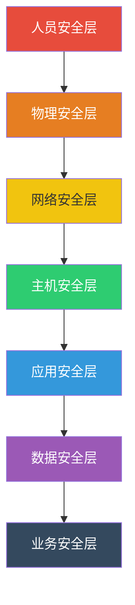
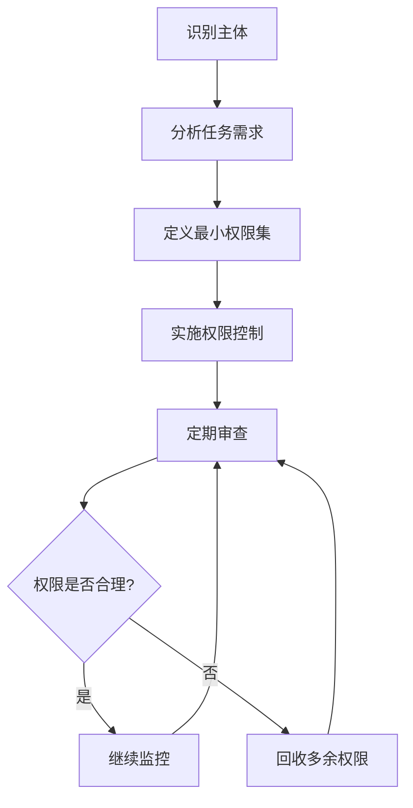
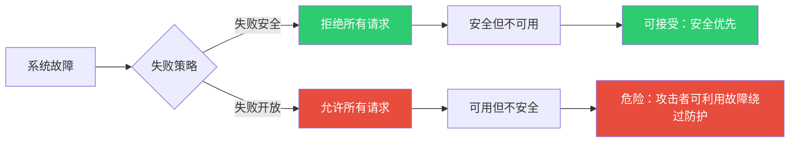
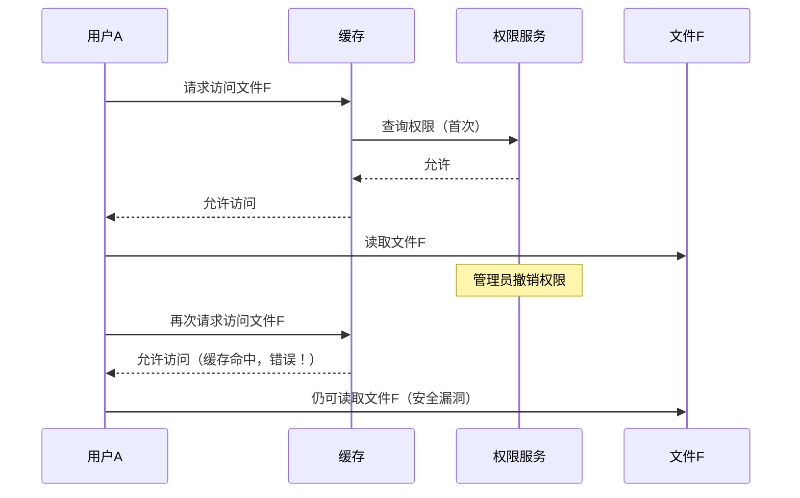
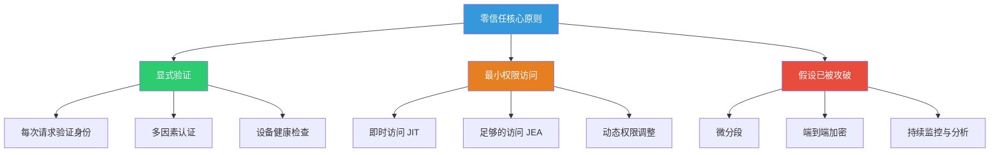

## 十三、安全架构设计原则

安全架构设计原则是构建安全系统的基石。这些原则不是孤立的建议，而是经过数十年安全工程实践验证的设计哲学。理解并内化这些原则，能帮助你在面对任何系统时，快速识别设计缺陷并提出改进方案。

本章涵盖 12 项核心原则，从经典的 Saltzer-Schroeder 原则到现代的零信任架构，从理论推导到工程落地，帮助你建立完整的安全架构思维框架。

### 13.1 纵深防御（Defense in Depth）

纵深防御源于军事战略，核心思想是：**不依赖单一防线，而是部署多层相互独立的安全控制**。任何单点防护都可能被突破，但攻击者同时突破多层防线的难度呈指数级增长。

#### 13.1.1 为什么单一防线必然失败

假设单层防火墙的拦截成功率为 99%，看起来已经很高。但如果攻击者有足够的耐心和资源，这 1% 的漏网概率在大量尝试下几乎必然命中。而纵深防御将多层 99% 的拦截率叠加后：

| 防线层数 | 综合漏过概率 | 实际含义 |
|---------|-------------|---------|
| 1 层 | 1% (10⁻²) | 每 100 次攻击有 1 次突破 |
| 2 层 | 0.01% (10⁻⁴) | 每 10,000 次攻击有 1 次突破 |
| 3 层 | 0.0001% (10⁻⁶) | 每 1,000,000 次攻击有 1 次突破 |
| 5 层 | 10⁻¹⁰ | 几乎不可能突破 |

当然，实际中各层并非完全独立（攻击者可能利用同一漏洞跨越多层），但这个模型清楚地说明了多层防御的威力。

#### 13.1.2 纵深防御的七层模型



每一层的具体防护措施和设计要点：

**物理安全层**：数据中心门禁（生物识别+刷卡双因素）、机柜物理锁、环境监控（温湿度、水浸）、视频监控留存至少 90 天、访客登记与陪同制度。关键原则：物理接触 = 完全控制，任何能物理接触设备的攻击者几乎能绕过所有软件防护。

**网络安全层**：下一代防火墙（NGFW）实施区域隔离、入侵检测/防御系统（IDS/IPS）实时分析流量、网络分段（将数据库服务器与 Web 服务器置于不同 VLAN）、DDoS 防护、DNS 安全（DNSSEC）。关键原则：默认拒绝所有流量，仅开放业务必需的端口和协议。

**主机安全层**：操作系统加固（CIS Benchmark）、终端检测与响应（EDR）、主机入侵检测（HIDS）、自动补丁管理、最小化安装（移除不需要的软件和服务）、文件完整性监控（AIDE/Tripwire）。关键原则：每台主机都是潜在的攻击跳板，必须独立防护。

**应用安全层**：输入验证与输出编码、参数化查询防止 SQL 注入、内容安全策略（CSP）防止 XSS、安全的会话管理、API 速率限制与认证、安全的错误处理（不泄露内部信息）。关键原则：应用层是攻击面最大的区域，也是攻击者最常利用的入口。

**数据安全层**：静态数据加密（AES-256）、传输中加密（TLS 1.3）、数据脱敏、数据库审计日志、备份加密、数据分类与标记、数据生命周期管理。关键原则：数据是攻击者的最终目标，所有其他层的防护都是为了保护数据。

**业务安全层**：交易风控、反欺诈系统、业务逻辑验证、异常行为检测、合规审计。关键原则：安全服务于业务，业务逻辑漏洞是技术防护无法覆盖的盲区。

**人员安全层**：安全意识培训（至少季度一次）、钓鱼演练（每月一次）、离职流程（即时撤销所有权限）、背景调查、保密协议。关键原则：人是最薄弱的环节，也是最强的防线。

#### 13.1.3 纵深防御的实际部署示例

以一个典型的 Web 应用为例，展示各层如何协同工作：

```text
用户请求 → CDN/WAF（第1层：边缘过滤）
    → 负载均衡器（第2层：流量分发 + SSL终止）
        → 应用防火墙（第3层：应用层规则）
            → 应用服务器（第4层：代码级防护）
                → 数据库防火墙（第5层：SQL审计）
                    → 加密存储（第6层：数据级防护）
```

当攻击者发送一个 SQL 注入请求时：
1. CDN/WAF 可能拦截明显的注入特征
2. 即使漏过，应用防火墙检测异常参数
3. 应用代码使用参数化查询，注入无效
4. 数据库防火墙检测异常 SQL 模式
5. 即使数据被窃取，敏感字段是加密存储的

#### 13.1.4 常见误区

**误区一**：多层使用同一技术栈等于纵深防御。如果所有层都用同一厂商的 WAF，一个绕过技术可能同时击穿所有层。真正的纵深防御要求各层技术异构、独立失效。

**误区二**：层数越多越好。过多的安全层会增加系统复杂度和运维成本，可能导致配置错误率上升。关键是每一层都有效运行，而不是盲目堆砌。

**误区三**：纵深防御等同于冗余。纵深防御的每一层应针对不同类型的威胁，而不是简单重复同样的检查。

---

### 13.2 最小权限原则（Principle of Least Privilege）

最小权限原则由 Jerome Saltzer 于 1974 年提出，要求：**每个主体（用户、程序、进程）只应获得完成其任务所需的最小权限集合，且权限的持续时间应尽可能短。**

#### 13.2.1 为什么最小权限至关重要

权限过大的直接后果是攻击面扩大和横向移动风险。一个真实案例：2020 年 SolarWinds 供应链攻击中，攻击者通过一个拥有过度权限的服务账户，从初始入侵点直接横向移动到整个 Active Directory 环境，最终控制了数千个组织的网络。

最小权限的价值在于**限制爆炸半径**（blast radius）：即使某个组件被攻破，攻击者也只能在该组件的权限范围内活动，无法进一步扩展。

#### 13.2.2 实施框架



**第一步：权限盘点**

使用工具扫描现有权限分配，建立基线：

```bash
# Linux: 查找所有 SUID 文件（可能的权限提升点）
find / -perm -4000 -type f 2>/dev/null

# Linux: 查找所有可写的关键目录
find /etc /usr -writable -type f 2>/dev/null

# Linux: 查找 sudo 权限配置
grep -r "NOPASSWD" /etc/sudoers /etc/sudoers.d/

# Windows: 查找具有管理员权限的用户
net localgroup administrators

# AWS: 查找具有 AdministratorAccess 的 IAM 用户
aws iam list-entities-for-policy --policy-arn arn:aws:iam::aws:policy/AdministratorAccess
```

**第二步：实施角色基础访问控制（RBAC）**

RBAC 将权限分配给角色而非个人，用户通过角色获得权限。设计角色时遵循职责分离原则：

```yaml
# 示例：RBAC 角色定义（Kubernetes 风格）
apiVersion: rbac.authorization.k8s.io/v1
kind: Role
metadata:
  namespace: production
  name: app-developer
rules:
- apiGroups: ["apps"]
  resources: ["deployments"]
  verbs: ["get", "list", "watch"]        # 只读，不能修改部署
- apiGroups: [""]
  resources: ["pods/log"]
  verbs: ["get"]                         # 只能查看日志
- apiGroups: [""]
  resources: ["secrets"]
  verbs: []                              # 不能访问密钥
```

**第三步：特权访问管理（PAM）**

对管理员账户实施额外控制：

```text
特权访问工作流：
普通用户 → 提交特权请求 → 审批人批准 → 临时提权（限时）→ 操作审计 → 自动回收
```

关键 PAM 功能：
- **即时提权（JIT）**：只在需要时临时授予管理员权限，操作完成后自动回收
- **会话录制**：所有特权操作全程录像，事后可审计
- **密码保险库**：特权账户密码集中管理，定期自动轮换
- **双人规则**：高危操作需要两人同时在场

#### 13.2.3 在代码中实施最小权限

```python
# 不良实践：以 root 身份运行整个应用
# 在 Dockerfile 中：
# USER root
# CMD ["python", "app.py"]

# 正确实践：创建专用低权限用户
import os
import pwd

def drop_privileges(username='appuser'):
    """运行时降权：从 root 切换到低权限用户"""
    pw_record = pwd.getpwnam(username)
    os.setgroups([])                    # 移除所有附加组
    os.setgid(pw_record.pw_gid)        # 切换 GID（必须在 setuid 之前）
    os.setuid(pw_record.pw_uid)        # 切换 UID
    os.umask(0o077)                     # 设置严格的文件权限

# 应用启动后立即降权
if os.getuid() == 0:
    drop_privileges()
    print(f"已降权到用户: {os.getlogin()}")
```

```bash
# Dockerfile 最佳实践
FROM python:3.11-slim
RUN groupadd -r appuser && useradd -r -g appuser -d /app -s /sbin/nologin appuser
COPY --chown=appuser:appuser . /app
USER appuser                              # 非 root 运行
EXPOSE 8080
CMD ["python", "app.py"]
```

#### 13.2.4 最小权限 vs 零信任

最小权限关注的是"给多少权限"，零信任关注的是"是否信任请求者"。两者互补：零信任要求每次访问都验证身份和上下文，最小权限限制验证通过后能访问的范围。

---

### 13.3 安全默认（Secure by Default）

安全默认原则要求：**系统开箱即用就是安全的，用户不需要额外配置就能获得合理的安全保障。** 这是 Saltzer 和 Schroeder 在 1975 年的经典论文中提出的基本原则，至今仍然适用。

#### 13.3.1 为什么安全默认如此重要

大多数用户不会修改默认配置。研究表明，超过 70% 的安全事件与错误配置有关，而其中大部分是因为系统默认配置不安全。如果默认就不安全，等于把安全责任推给了用户——而用户往往不具备安全专业知识。

经典案例：
- MySQL 5.x 默认安装后 root 密码为空，导致大量数据库暴露在公网
- MongoDB 早期版本默认绑定 0.0.0.0 且无认证，导致数万个数据库被勒索
- Elasticsearch 默认不启用认证，大量集群数据泄露
- Redis 默认无密码且绑定所有接口，成为加密货币挖矿的常见目标

#### 13.3.2 安全默认的实施策略

**策略一：默认最小安装**

```bash
# 不良：安装所有组件
yum install httpd php mysql-server ftp telnet rsh

# 良好：只安装必要组件
yum install httpd
# 其他组件按需安装，每个都需要单独的安全审查
```

**策略二：默认拒绝所有连接**

```bash
# iptables 默认策略：拒绝所有入站，允许所有出站
iptables -P INPUT DROP
iptables -P FORWARD DROP
iptables -P OUTPUT ACCEPT

# 仅开放必要端口
iptables -A INPUT -m state --state ESTABLISHED,RELATED -j ACCEPT
iptables -A INPUT -p tcp --dport 443 -j ACCEPT    # HTTPS
iptables -A INPUT -p tcp --dport 22 -j ACCEPT      # SSH（进一步限制来源 IP 更佳）
```

**策略三：强制首次配置**

```python
# 应用首次启动时强制设置安全配置
import secrets
import sys

def first_run_setup():
    """首次运行强制配置"""
    config_path = '/etc/myapp/config.yaml'
    
    if not os.path.exists(config_path):
        print("=" * 50)
        print("首次运行安全配置向导")
        print("=" * 50)
        
        # 强制生成强密钥，不允许使用默认值
        admin_password = secrets.token_urlsafe(24)
        api_key = secrets.token_urlsafe(32)
        secret_key = secrets.token_hex(32)
        
        # 强制修改默认密码
        new_password = getpass.getpass("请设置管理员密码（至少12位，含大小写+数字+特殊字符）：")
        if not is_strong_password(new_password):
            print("密码强度不足，拒绝继续。")
            sys.exit(1)
        
        # 写入安全配置
        write_config({
            'admin_password': hash_password(new_password),
            'api_key': api_key,
            'secret_key': secret_key,
            'debug': False,                    # 生产模式关闭调试
            'ssl_only': True,                  # 强制 HTTPS
            'cors_origins': [],                 # 默认不允许跨域
            'rate_limit': '100/hour',           # 默认限流
        })
        
        print(f"API Key（仅显示一次）: {api_key}")
        print("请妥善保存，此密钥不会再次显示。")
```

**策略四：安全配置模板**

为不同部署场景提供预设的安全配置模板：

```yaml
# 生产环境模板（production.yaml）
security:
  ssl:
    enabled: true
    min_version: "TLSv1.2"
    cipher_suites:
      - "TLS_AES_256_GCM_SHA384"
      - "TLS_CHACHA20_POLY1305_SHA256"
  headers:
    Strict-Transport-Security: "max-age=31536000; includeSubDomains"
    Content-Security-Policy: "default-src 'self'"
    X-Content-Type-Options: "nosniff"
    X-Frame-Options: "DENY"
  authentication:
    mfa_required: true
    session_timeout: 30m
    max_login_attempts: 5
    lockout_duration: 15m
  logging:
    level: "INFO"
    audit: true
    sensitive_fields_masked: true
```

#### 13.3.3 安全默认的验收清单

| 检查项 | 要求 | 验收标准 |
|-------|------|---------|
| 默认密码 | 禁止空密码或默认密码 | 首次登录强制修改 |
| 默认端口 | 不使用常见默认端口 | SSH 不用 22，数据库不暴露公网 |
| 调试模式 | 默认关闭 | 生产环境无法开启 debug |
| 错误信息 | 不泄露内部信息 | 通用错误页面，详细信息记日志 |
| 加密传输 | 默认启用 TLS | HTTP 请求自动重定向到 HTTPS |
| 日志记录 | 默认开启审计日志 | 记录所有认证和授权事件 |
| 访问控制 | 默认拒绝 | 明确授权才能访问 |

---

### 13.4 失败安全（Fail Secure）

失败安全原则要求：**当系统发生故障或异常时，应进入安全状态而非不安全状态。** 与之相对的是"失败开放"（Fail Open），即故障时允许所有访问——这在安全场景下是灾难性的。

#### 13.4.1 失败安全 vs 失败开放



各场景的失败安全策略：

| 场景 | 失败安全行为 | 失败开放行为（危险） |
|------|------------|-------------------|
| 认证服务故障 | 拒绝所有登录请求 | 允许所有登录请求 |
| 授权服务故障 | 拒绝所有权限请求 | 授予所有权限 |
| 防火墙故障 | 阻止所有流量 | 允许所有流量通过 |
| 加密服务故障 | 拒绝明文传输 | 降级为明文传输 |
| SSL 证书过期 | 拒绝连接 | 接受无效证书 |
| 审计日志满 | 阻止操作直到日志恢复 | 继续操作但不记录 |
| 数据库连接池耗尽 | 返回服务不可用 | 绕过数据库直接响应 |

#### 13.4.2 实施失败安全的代码模式

```python
import functools
import logging

logger = logging.getLogger(__name__)

def fail_secure(default_deny=True):
    """失败安全装饰器：异常时默认拒绝"""
    def decorator(func):
        @functools.wraps(func)
        def wrapper(*args, **kwargs):
            try:
                return func(*args, **kwargs)
            except ConnectionError as e:
                logger.critical(f"授权服务连接失败: {e}")
                return AccessDecision(allowed=False, reason="授权服务不可用")
            except TimeoutError as e:
                logger.critical(f"授权服务超时: {e}")
                return AccessDecision(allowed=False, reason="授权服务响应超时")
            except Exception as e:
                logger.critical(f"授权检查异常: {e}", exc_info=True)
                return AccessDecision(allowed=False, reason="授权检查异常")
        return wrapper
    return decorator

@fail_secure(default_deny=True)
def check_permission(user, resource, action):
    """检查用户对资源的操作权限"""
    auth_service = get_auth_service()
    response = auth_service.check(user=user, resource=resource, action=action)
    return AccessDecision(allowed=response.granted, reason=response.reason)

# 使用示例
decision = check_permission(current_user, "/api/admin", "write")
if not decision.allowed:
    raise PermissionDenied(decision.reason)
```

#### 13.4.3 失败安全与可用性的平衡

纯粹的失败安全可能导致系统在任何故障下都不可用，这在某些场景下是不可接受的。解决方案是**分级失败策略**：

```text
严重程度分级：
┌─────────────────────────────────────────────────┐
│ Level 1 - 核心安全服务故障                        │
│   → 立即停止所有服务，进入完全安全模式              │
│   → 例如：认证服务、加密服务故障                    │
├─────────────────────────────────────────────────┤
│ Level 2 - 辅助安全服务故障                        │
│   → 降级运行，限制部分功能                         │
│   → 例如：审计日志服务故障 → 限制敏感操作           │
├─────────────────────────────────────────────────┤
│ Level 3 - 非关键服务故障                          │
│   → 继续运行，记录告警                            │
│   → 例如：性能监控服务故障                         │
└─────────────────────────────────────────────────┘
```

---

### 13.5 完全中介（Complete Mediation）

完全中介原则要求：**每一次访问请求都必须经过权限检查，不能依赖缓存的权限信息。** 这是 Saltzer-Schroeder 原则中最常被违反的一条。

#### 13.5.1 为什么缓存权限是危险的

典型场景：用户 A 被授予文件 F 的读取权限，应用缓存了这个决策。随后管理员撤销了用户 A 的权限，但缓存未更新，用户 A 仍然可以访问文件 F。这个时间窗口就是攻击者可以利用的漏洞。



#### 13.5.2 完全中介的实现方式

**方式一：无缓存检查（高安全场景）**

```python
class CompleteMediationAccessControl:
    """完全中介访问控制：每次访问都实时检查权限"""
    
    def __init__(self, auth_service):
        self.auth_service = auth_service
        self.audit_log = AuditLog()
    
    def check_access(self, subject, resource, action, context):
        """每次访问都经过完整检查"""
        # 第1步：验证主体身份（不依赖缓存）
        if not self.auth_service.verify_identity(subject):
            self.audit_log.log(subject, resource, action, "DENIED", "身份验证失败")
            return False
        
        # 第2步：检查权限（实时查询）
        permission = self.auth_service.check_permission(
            subject=subject,
            resource=resource,
            action=action
        )
        
        # 第3步：评估上下文（时间、位置、设备等）
        context_ok = self.evaluate_context(context)
        
        # 第4步：综合决策
        allowed = permission.granted and context_ok
        
        # 第5步：记录审计日志
        self.audit_log.log(subject, resource, action, 
                          "ALLOWED" if allowed else "DENIED",
                          f"permission={permission.granted}, context={context_ok}")
        
        return allowed
```

**方式二：短期缓存 + 主动失效（高可用场景）**

在高并发场景下，每次都实时查询权限服务可能成为性能瓶颈。折中方案是使用极短期缓存配合主动失效机制：

```python
import time
import hashlib

class ShortLivedCacheMediation:
    """短期缓存 + 主动失效的完全中介"""
    
    def __init__(self, auth_service, ttl_seconds=30):
        self.auth_service = auth_service
        self.cache = {}                    # {cache_key: (decision, expiry)}
        self.ttl = ttl_seconds
        self.revocation_list = set()       # 主动撤销列表
    
    def revoke(self, subject, resource=None):
        """权限变更时主动撤销缓存"""
        if resource:
            self.revocation_list.add(f"{subject}:{resource}")
        else:
            # 撤销该主体的所有缓存
            keys_to_remove = [k for k in self.cache if k.startswith(subject)]
            for key in keys_to_remove:
                del self.cache[key]
    
    def check_access(self, subject, resource, action):
        cache_key = f"{subject}:{resource}:{action}"
        
        # 检查是否被主动撤销
        if cache_key in self.revocation_list:
            self.revocation_list.discard(cache_key)
            return self._real_check(subject, resource, action)
        
        # 检查缓存是否有效
        if cache_key in self.cache:
            decision, expiry = self.cache[cache_key]
            if time.time() < expiry:
                return decision
        
        # 缓存未命中或已过期，实时检查
        return self._real_check(subject, resource, action)
    
    def _real_check(self, subject, resource, action):
        result = self.auth_service.check_permission(subject, resource, action)
        self.cache[cache_key] = (result.granted, time.time() + self.ttl)
        return result.granted
```

#### 13.5.3 完全中介的性能优化

在大规模系统中，完全中介的性能开销可以通过以下方式优化：

| 策略 | 适用场景 | 实现方式 |
|------|---------|---------|
| 分布式权限缓存 | 微服务架构 | Redis + 发布/订阅主动失效 |
| 令牌自包含 | API 网关 | JWT 中嵌入权限声明，短期有效 |
| 策略预编译 | 高并发场景 | OPA/Rego 策略预编译为本地决策 |
| 边车代理 | 服务网格 | Istio/Envoy 在网络层拦截并检查 |

---

### 13.6 职责分离（Separation of Duties）

职责分离原则要求：**关键操作不应由单个人或单个系统组件独立完成，必须由多个独立的主体协作完成。** 这一原则直接降低了内部威胁和单点腐败的风险。

#### 13.6.1 职责分离的两种模式

**静态职责分离**：在系统设计时就确定角色之间的互斥关系。例如，同一个人不能同时拥有"发起付款"和"审批付款"的权限。

```python
# 静态职责分离的 RBAC 实现
class SODPolicy:
    """静态职责分离策略"""
    
    def __init__(self):
        # 定义互斥角色对
        self.mutually_exclusive_roles = {
            ('payment_initiator', 'payment_approver'),
            ('code_developer', 'code_deployer'),
            ('account_creator', 'account_auditor'),
            ('vendor_creator', 'payment_approver'),
        }
    
    def can_assign(self, user_roles, new_role):
        """检查是否可以为用户分配新角色"""
        for role in user_roles:
            if (role, new_role) in self.mutually_exclusive_roles:
                return False, f"角色 {role} 与 {new_role} 互斥，不能同时分配"
            if (new_role, role) in self.mutually_exclusive_roles:
                return False, f"角色 {new_role} 与 {role} 互斥，不能同时分配"
        return True, "允许分配"
```

**动态职责分离**：在运行时根据用户已激活的角色来判断。用户可能拥有多个角色，但在一次会话中只能激活互斥角色中的一个。

#### 13.6.2 职责分离在软件开发中的实践

| 环节 | 不良实践 | 最佳实践 |
|------|---------|---------|
| 代码提交 | 开发者自己合并 PR | 需要另一个开发者 Code Review |
| 生产部署 | 开发者直接部署 | CI/CD 自动部署，开发者无法接触生产环境 |
| 数据库变更 | DBA 直接修改 | 变更通过迁移脚本，经审批后自动执行 |
| 密钥管理 | 运维人员持有所有密钥 | 密钥分段保管，使用需多人授权 |
| 安全审计 | 被审计者自己生成报告 | 独立的安全团队进行审计 |

---

### 13.7 经济性原则（Economy of Mechanism）

经济性原则要求：**安全机制应尽可能简单，越简单越容易正确实现和验证。** 复杂性是安全的天敌——每一个额外的代码行、每一个额外的配置项，都是潜在的漏洞来源。

#### 13.7.1 为什么简单性等于安全性

```python
# 复杂的权限检查（容易出错）
def check_access_complex(user, resource):
    if user.role == 'admin':
        return True
    elif user.role == 'manager':
        if resource.department == user.department:
            if resource.level <= user.clearance:
                if not resource.restricted or user.special_access:
                    if datetime.now() < user.access_expiry:
                        return True
    elif user.role == 'user':
        if resource.owner == user.id:
            if not resource.locked:
                return True
        elif resource.shared and user.id in resource.shared_with:
            if resource.permission_level >= 'read':
                return True
    return False

# 简洁的权限检查（更容易验证）
def check_access_simple(user, resource, action):
    """基于策略引擎的简洁权限检查"""
    policy = get_policy(user, resource)
    return policy.allows(action)
```

#### 13.7.2 简化安全设计的实践

**消除不必要的功能**：每一个功能都是潜在的攻击面。如果一个功能不被使用，就应该移除它，而不是"禁用"它（禁用的代码仍然存在，可能被重新启用或存在漏洞）。

**使用标准协议**：不要自己设计加密算法或认证协议。使用经过广泛审查的标准实现（如 OAuth 2.0、TLS 1.3、bcrypt）。

**减少配置选项**：每一个配置选项都是一个潜在的错误配置点。提供合理的默认值，只暴露真正需要调整的选项。

---

### 13.8 心理可接受性（Psychological Acceptability）

心理可接受性原则要求：**安全机制不应给用户带来不合理的负担，用户界面应设计得让用户容易正确使用安全功能。** 如果安全机制过于复杂或不便，用户会绕过它。

#### 13.8.1 用户为什么绕过安全

| 安全要求 | 用户感受 | 绕过行为 |
|---------|---------|---------|
| 密码每30天更换 | "又要改密码？烦死了" | Password1 → Password2 → Password3 |
| 每次操作都要 MFA | "太慢了" | 禁用 MFA 或使用固定 OTP |
| 复杂密码要求 | "记不住" | 贴在显示器上 |
| VPN 才能访问内网 | "太麻烦" | 用个人邮箱转发工作文件 |
| 审批流程太长 | "等不及" | 找管理员开后门 |

#### 13.8.2 让安全变得可用

**SSO（单点登录）**：一次认证，访问所有授权系统。减少密码疲劳，同时集中认证控制。

**无密码认证**：WebAuthn/FIDO2 使用生物识别或硬件密钥，安全性和便利性同时提升。

**智能 MFA**：只在高风险操作或异常登录时要求 MFA，日常操作静默认证。

**安全默认配置**：让用户不需要做任何配置就获得合理的安全保障，而不是要求用户理解并配置复杂的安全参数。

```python
# 示例：智能 MFA 触发策略
def should_require_mfa(user, login_context):
    """智能判断是否需要 MFA"""
    risk_score = 0
    
    # 新设备登录
    if login_context.device_id not in user.known_devices:
        risk_score += 40
    
    # 异常地理位置
    if login_context.country != user.usual_country:
        risk_score += 30
    
    # 异常时间（凌晨2-5点）
    if 2 <= login_context.hour <= 5:
        risk_score += 20
    
    # VPN/代理
    if login_context.is_proxy:
        risk_score += 25
    
    # 连续失败后
    if user.recent_failed_attempts >= 3:
        risk_score += 50
    
    # 风险阈值
    return risk_score >= 50
```

---

### 13.9 零信任架构（Zero Trust Architecture）

零信任是对传统"城堡护城河"安全模型的颠覆。传统模型假设内网是可信的，零信任则认为：**永远不要信任，始终验证。** 无论请求来自内网还是外网，都必须经过身份验证、授权和加密。

#### 13.9.1 零信任的核心原则



#### 13.9.2 零信任的实施路径

零信任不是一次性部署的产品，而是逐步演进的架构模式。推荐的实施路径：

**阶段一：身份与访问管理**
- 部署集中身份提供者（IdP），如 Azure AD、Okta
- 所有应用集成 SSO
- 强制 MFA（至少对管理员和远程访问）
- 实施条件访问策略

**阶段二：设备信任**
- 注册所有设备，建立设备清单
- 部署设备健康检查（补丁状态、杀毒软件、磁盘加密）
- 不合规设备限制访问范围

**阶段三：网络微分段**
- 将网络划分为细粒度的安全区域
- 每个区域之间的流量都需要认证和授权
- 东西向流量检查（不只是南北向）

**阶段四：数据保护**
- 数据分类与标记
- 加密所有传输中和静态数据
- 数据丢失防护（DLP）策略

**阶段五：持续监控**
- 用户和实体行为分析（UEBA）
- 安全信息与事件管理（SIEM）
- 自动化响应（SOAR）

#### 13.9.3 零信任的实际部署示例

```yaml
# 零信任网络策略示例（Istio 服务网格）
apiVersion: security.istio.io/v1
kind: AuthorizationPolicy
metadata:
  name: order-service-policy
  namespace: production
spec:
  selector:
    matchLabels:
      app: order-service
  rules:
  - from:
    - source:
        principals: ["cluster.local/ns/production/sa/api-gateway"]
    to:
    - operation:
        methods: ["GET", "POST"]
        paths: ["/api/orders/*"]
    when:
    - key: request.auth.claims[role]
      values: ["customer", "admin"]
  - from:
    - source:
        principals: ["cluster.local/ns/production/sa/payment-service"]
    to:
    - operation:
        methods: ["PATCH"]
        paths: ["/api/orders/*/status"]
```

---

### 13.10 攻击面最小化（Attack Surface Minimization）

攻击面是指系统中所有可能被攻击者利用的入口点的总和。攻击面最小化原则要求：**减少系统暴露的入口点数量和复杂度，使攻击者可用的攻击路径尽可能少。**

#### 13.10.1 攻击面分类

| 攻击面类型 | 描述 | 示例 |
|-----------|------|------|
| 网络攻击面 | 可通过网络访问的接口 | 开放端口、API 端点、Web 页面 |
| 软件攻击面 | 安装的软件和运行的服务 | 不必要的守护进程、过期的依赖 |
| 人为攻击面 | 人员相关的入口 | 社会工程、钓鱼、内部威胁 |
| 物理攻击面 | 物理可接触的设备 | USB 端口、控制台访问、网络接口 |

#### 13.10.2 攻击面度量与缩减

```bash
# 攻击面度量脚本
#!/bin/bash
echo "=== 攻击面度量报告 ==="

# 网络攻击面
echo -e "\n[网络攻击面]"
echo "开放端口数量: $(ss -tlnp | grep LISTEN | wc -l)"
echo "开放端口列表:"
ss -tlnp | grep LISTEN | awk '{print $4}' | sort

# 软件攻击面
echo -e "\n[软件攻击面]"
echo "已安装包数量: $(dpkg -l 2>/dev/null | grep ^ii | wc -l)"
echo "运行中的服务: $(systemctl list-units --type=service --state=running | grep running | wc -l)"
echo "SUID 文件数量: $(find / -perm -4000 -type f 2>/dev/null | wc -l)"

# 用户攻击面
echo -e "\n[用户攻击面]"
echo "可登录用户数量: $(grep -c '/bin/bash\|/bin/sh' /etc/passwd)"
echo "有 sudo 权限的用户: $(grep -c '' /etc/sudoers /etc/sudoers.d/* 2>/dev/null)"

# 文件攻击面
echo -e "\n[文件攻击面]"
echo "全局可写文件: $(find / -xdev -writable -type f 2>/dev/null | wc -l)"
echo "无主文件: $(find / -xdev -nouser -o -nogroup 2>/dev/null | wc -l)"
```

缩减攻击面的具体措施：

- **关闭不需要的服务**：每一项运行中的服务都是潜在的攻击入口
- **限制网络暴露**：数据库只监听 127.0.0.1，管理接口不暴露公网
- **移除不必要的软件包**：最小化安装，减少依赖链
- **禁用不需要的协议**：如 ICMP、UDP 广播等
- **限制用户权限**：减少可登录用户和 sudo 权限

---

### 13.11 不应依赖隐匿（Security Through Obscurity Is Not Security）

这一原则常被误解为"不能隐藏任何信息"，其真正含义是：**安全机制的有效性不应依赖于攻击者不知道系统的工作方式。** 系统应该在算法和实现细节公开的情况下仍然是安全的。

#### 13.11.1 为什么隐匿不可靠

Kerckhoffs 在 1883 年就指出：密码系统的安全性应该依赖于密钥的保密性，而不是算法的保密性。这个道理延伸到所有安全领域：

- 你不能假设攻击者不知道你用的是什么数据库
- 你不能假设攻击者不知道你的目录结构
- 你不能假设攻击者不知道你的认证流程

信息在互联网时代泄露的速度远超你的想象：员工离职、代码泄露、开源依赖分析、错误信息泄露、响应时间差异，都可能暴露系统内部细节。

#### 13.11.2 隐匿作为纵深防御的补充

隐匿本身不是安全措施，但可以作为纵深防御的一个补充层：

| 做法 | 是否安全 | 说明 |
|------|---------|------|
| 用隐藏路径代替认证 | ❌ 不安全 | 路径可被猜测或泄露 |
| 修改 HTTP Server 头 | ⚠️ 辅助措施 | 增加侦察难度，但不能代替安全 |
| 随机化端口号 | ⚠️ 辅助措施 | 减少自动扫描命中率 |
| 地址空间布局随机化（ASLR） | ✅ 有效措施 | 增加漏洞利用难度，已有实际效果 |
| 密码加盐哈希 | ✅ 核心安全 | 不是隐匿，是真正的密码学保护 |

---

### 13.12 安全设计原则速查表

将所有原则汇总为一张速查表，方便在架构评审时快速参考：

| 原则 | 核心问题 | 违反后果 | 检查方法 |
|------|---------|---------|---------|
| 纵深防御 | 单点失效是否致命？ | 一处突破，全线崩溃 | 删除任一安全层后系统是否仍然安全 |
| 最小权限 | 是否给了多余的权限？ | 横向移动，权限提升 | 审查所有权限分配是否都是必要的 |
| 安全默认 | 开箱即用是否安全？ | 默认配置导致暴露 | 新安装的系统不做配置是否安全 |
| 失败安全 | 故障时是否安全？ | 故障成为绕过手段 | 模拟各组件故障，观察系统行为 |
| 完全中介 | 是否每次都检查？ | 权限变更不生效 | 撤销权限后是否立即无法访问 |
| 职责分离 | 关键操作是否需要多人？ | 单人可完成高危操作 | 审查高危操作的审批流程 |
| 经济性 | 安全机制是否简洁？ | 复杂性导致漏洞 | 代码行数和配置项数量审计 |
| 心理可接受性 | 用户是否会绕过？ | 安全形同虚设 | 观察用户实际行为而非规定 |
| 零信任 | 是否假设了信任边界？ | 内网渗透畅通无阻 | 内网设备被控制后能访问什么 |
| 攻击面最小化 | 暴露了多少入口？ | 攻击路径过多 | 端口扫描和服务枚举结果 |
| 不依赖隐匿 | 安全是否依赖保密？ | 细节泄露即崩溃 | 公开源码后系统是否仍然安全 |

---

### 13.13 架构评审实战检查清单

在实际的安全架构评审中，按以下清单逐项检查：

```markdown
## 安全架构评审检查清单

### 第一部分：设计原则遵从性
□ 系统是否有单点安全控制？如有，是否有补偿措施？
□ 所有组件是否遵循最小权限原则？
□ 默认配置是否安全？是否需要用户手动加固？
□ 系统故障时的行为是否已明确定义？
□ 权限变更是实时生效还是依赖缓存？
□ 高危操作是否需要多人协作？
□ 安全机制是否简洁可验证？
□ 安全功能是否对用户友好？

### 第二部分：威胁防护
□ 是否识别了所有信任边界？
□ 内网横向移动是否有防护？
□ 数据传输和存储是否加密？
□ 认证机制是否足够强健？
□ 输入验证是否覆盖所有入口点？
□ 日志审计是否完整且防篡改？

### 第三部分：运维安全
□ 补丁管理流程是否自动化？
□ 密钥和凭证管理是否集中化？
□ 安全监控和告警是否到位？
□ 事件响应流程是否经过演练？
□ 备份和灾难恢复是否定期测试？
```

### 13.14 本章小结

安全架构设计原则不是教条，而是经过数十年实践验证的智慧结晶。在实际工作中：

1. **不要试图同时满足所有原则**——根据系统的重要性和威胁模型，确定优先级
2. **原则之间可能存在冲突**——例如完全中介与性能、失败安全与可用性之间需要权衡
3. **原则需要落地为具体的技术控制**——停留在原则层面而不落实到代码和配置中毫无意义
4. **持续验证比一次性设计更重要**——安全架构需要随着威胁环境的变化而演进

掌握了这些原则，你就拥有了评判任何安全架构优劣的标尺，也拥有了设计安全系统的基本方法论。在后续章节中，我们将把这些原则应用到具体的攻防场景中。
