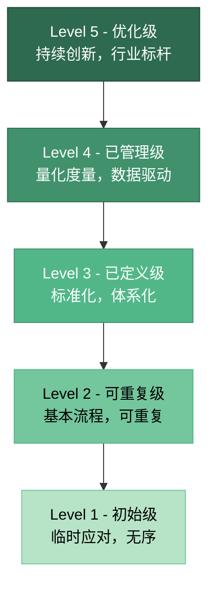
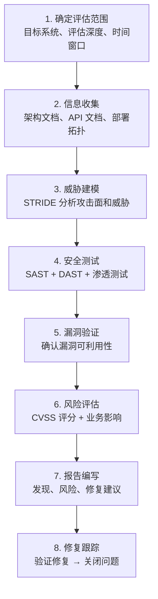
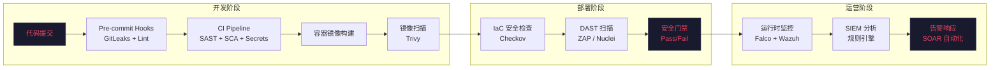
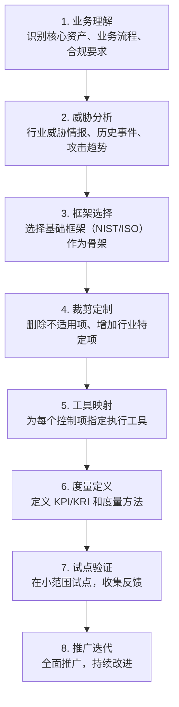

## 十四、安全思维的实践框架

前面的章节建立了安全思维的理论基础——威胁建模、信任模型、架构原则、评估方法论。但理论到实践之间存在巨大的鸿沟：知道纵深防御很重要，不等于知道如何在自己的系统中落地；了解 STRIDE 威胁分类，不等于能在项目中系统地执行威胁建模。本章的目标是弥合这个鸿沟，提供一套可操作的实践框架，将安全思维转化为可重复、可度量、可持续改进的安全行动。

### 14.1 为什么需要实践框架

安全领域有一个残酷的现实：**大多数安全事件不是因为缺乏知识，而是因为缺乏系统性执行**。Equifax 泄露事件中，团队知道 Apache Struts 有漏洞但补丁流程失效；Colonial Pipeline 事件中，一个未启用多因素认证的 VPN 账户成为突破口。这些都不是未知威胁，而是已知风险未被系统化管理的结果。

实践框架的核心价值在于：

| 维度 | 没有框架 | 有框架 |
|------|----------|--------|
| 覆盖范围 | 依赖个人经验，容易遗漏 | 检查清单驱动，系统覆盖 |
| 执行一致性 | 因人而异，水平参差 | 标准化流程，可重复执行 |
| 度量改进 | 无法衡量"做得好不好" | 量化指标驱动持续改进 |
| 知识传承 | 随人员流动丢失 | 文档化、可传承 |
| 响应速度 | 临时应对，手忙脚乱 | 预案驱动，有序响应 |

### 14.2 安全分析检查清单体系

检查清单是实践框架的基础工具。它不是形式主义的勾选表，而是将安全知识结构化为可执行动作的载体。下面按三个层级展开，每个检查项都附带**为什么重要**和**如何执行**。

#### 14.2.1 架构级检查清单

架构级检查在系统设计阶段执行，影响范围最大、修复成本最低。

**1. 系统架构图完整性**

- [ ] 是否绘制了完整的系统架构图？

架构图是安全分析的基线。没有架构图，你无法识别攻击面、信任边界和数据流。完整的架构图应包含：
- 所有组件（服务、数据库、缓存、消息队列、第三方服务）
- 所有连接（协议、端口、方向性）
- 所有数据流（数据类型、敏感级别、流向）
- 部署拓扑（网络区域、DMZ、内网、云环境）

推荐使用 C4 模型（Context → Container → Component → Code）分层绘制，每一层解决不同粒度的安全问题。

**2. 信任边界识别**

- [ ] 是否识别了所有的信任边界？

信任边界是安全分析的锚点。常见的信任边界包括：
- 用户浏览器与服务器之间（前端/后端边界）
- 不同网络区域之间（DMZ/内网/数据库网络）
- 不同服务之间（微服务间调用）
- 不同租户之间（多租户 SaaS）
- 不同安全级别之间（普通用户/管理员/系统进程）
- 与第三方系统之间（API 集成、数据交换）

执行方法：在架构图上用红色虚线标注所有信任边界，每个边界点列出穿越的数据类型和当前的控制措施。

**3. 威胁建模执行**

- [ ] 是否进行了系统的威胁建模？

不是"有没有想过安全问题"，而是有没有按照结构化方法（如 STRIDE、PASTA）系统分析每个组件和数据流面临的威胁。参见本章前面的威胁建模相关章节。

**4. 纵深防御验证**

- [ ] 是否实施了纵深防御？

验证方法：对每个关键资产，画出从外部到该资产的所有路径，检查每条路径上至少有 3 层独立的安全控制。如果某条路径只有 1-2 层控制，就是一个单点失败风险。

**5. 最小权限验证**

- [ ] 是否遵循了最小权限原则？

验证方法：审查每个服务账号、每个 IAM 角色、每个数据库用户的权限，确认它们只有完成任务所需的最小权限。重点关注：
- 数据库账号是否使用了 `SELECT *` 权限而非只读特定表？
- 云 IAM 角色是否有 `*` 通配符权限？
- 服务间调用是否使用了共享密钥而非独立凭证？

**6. 安全监控与告警**

- [ ] 是否有安全监控和告警机制？

不是"有没有日志"，而是：
- 关键安全事件是否被采集？（认证失败、权限变更、数据访问异常）
- 告警规则是否覆盖了已知攻击模式？
- 告警响应流程是否明确？谁收到告警？多久响应？
- 日志是否防篡改？是否集中存储？

**7. 事件响应计划**

- [ ] 是否有事件响应计划？

事件响应计划不是一份放在抽屉里的文档，而是需要定期演练的流程。计划应包含：
- 事件分级标准（P1-P4）
- 每级事件的响应团队、联系方式、决策权限
- 遏制→根除→恢复→复盘的标准流程
- 通信模板（对内通报、对外公告、监管报告）
- 取证保全流程（日志、内存镜像、磁盘镜像）

**8. 灾难恢复计划**

- [ ] 是否有灾难恢复计划？

关键指标：
- RTO（恢复时间目标）：系统中断后多久必须恢复？
- RPO（恢复点目标）：最多能容忍丢失多少时间的数据？
- 备份是否定期验证恢复？（没有验证过的备份等于没有备份）
- 是否有异地灾备方案？

#### 14.2.2 应用级检查清单

应用级检查在开发和测试阶段执行，直接关系到代码层面的安全性。

**1. 输入验证**

- [ ] 是否对所有外部输入进行了验证？

输入验证的三层防线：
```text
第一层：类型和格式验证（白名单正则表达式）
第二层：业务逻辑验证（范围、长度、枚举值）
第三层：安全过滤（SQL 注入、XSS、命令注入的特征检测）
```

常见错误：只做了第三层（黑名单过滤）而忽略了前两层。黑名单永远不完整，白名单才是正确的做法。

**2. 输出编码**

- [ ] 是否对所有输出进行了上下文相关的编码？

输出编码必须匹配输出上下文：
- HTML 上下文：HTML 实体编码（`<` → `&lt;`）
- JavaScript 上下文：JavaScript 转义
- URL 上下文：URL 编码（`%20`）
- SQL 上下文：参数化查询（不是字符串拼接）
- LDAP 上下文：LDAP 转义

常见错误：对所有输出使用同一种编码方式。在 HTML 属性中的 XSS 和在 JavaScript 中的 XSS 需要不同的编码策略。

**3. 参数化查询**

- [ ] 是否使用了参数化查询或 ORM？

扫描代码库中的字符串拼接 SQL：
```bash
# 快速检测潜在的 SQL 注入风险
grep -rn "SELECT.*FROM.*WHERE.*=.*'" --include="*.py" src/
grep -rn "execute.*f\"" --include="*.py" src/
grep -rn "execute.*\.format" --include="*.py" src/
```

**4. 会话管理**

- [ ] 是否实施了安全的会话管理？

检查项：
- Session ID 是否使用密码学安全的随机数生成（至少 128 位）？
- Session 是否设置了合理的超时时间？
- 登录后是否重新生成 Session ID（防止 Session 固定攻击）？
- Session 是否绑定了客户端指纹（IP、User-Agent）？
- 是否实施了并发会话限制？
- 登出后是否服务端销毁 Session？

**5. 访问控制**

- [ ] 是否实施了完整的访问控制？

访问控制的三个维度：
- 认证（Authentication）：你是谁？——多因素认证、密码策略
- 授权（Authorization）：你能做什么？——RBAC/ABAC、资源级权限
- 审计（Audit）：你做了什么？——操作日志、不可否认性

常见漏洞：IDOR（不安全的直接对象引用）——用户修改 URL 中的 ID 就能访问其他用户的资源。每个 API 端点都必须验证当前用户对目标资源的访问权限。

**6. 安全日志**

- [ ] 是否记录了关键安全事件的日志？

必须记录的安全事件：
- 认证事件：登录成功/失败、注销、密码修改
- 授权事件：权限变更、角色分配
- 数据事件：敏感数据访问、批量数据导出
- 管理事件：配置变更、用户创建/删除
- 异常事件：输入验证失败、速率限制触发

日志应包含：时间戳（UTC）、事件类型、用户标识、源 IP、操作对象、操作结果、请求 ID（用于关联分析）。

**7. 安全测试**

- [ ] 是否进行了多层次的安全测试？

安全测试金字塔：
```text
        /  渗透测试  \        ← 每季度/重大发布前
       / DAST 动态扫描 \       ← 每次部署前
      / SAST 静态代码分析 \     ← 每次代码提交
     / SCA 依赖组件扫描 \      ← 每次构建
    / 单元测试（安全用例） \    ← 每次开发
```

**8. 安全编码规范**

- [ ] 是否有并执行了安全编码规范？

安全编码规范不是一份通用文档，而是与具体技术栈绑定的、可执行的规则集。例如：
- Python：禁止使用 `eval()`、`exec()`、`pickle.loads()` 处理不可信输入
- Java：禁止使用 `Runtime.exec()` 拼接用户输入
- JavaScript：禁止使用 `innerHTML`、`eval()`、`document.write()`
- SQL：禁止字符串拼接构建 SQL 语句

#### 14.2.3 运维级检查清单

运维级检查在系统部署和运营阶段执行，保障系统的持续安全。

**1. 补丁管理**

- [ ] 是否有系统化的补丁管理流程？

补丁管理的关键要素：
- 漏洞情报来源：CVE 数据库、厂商安全公告、安全社区
- 漏洞分级：基于 CVSS 评分 + 业务影响 + 利用难度
- 补丁窗口：关键漏洞 24-48 小时、高危 7 天、中危 30 天
- 测试流程：补丁先在 staging 环境验证，再在生产环境灰度发布
- 回退方案：补丁失败时的快速回退机制

```bash
# Ubuntu/Debian 快速安全更新
sudo apt update && sudo apt list --upgradable 2>/dev/null | grep -i secur
sudo unattended-upgrade --dry-run  # 预览自动安全更新

# CentOS/RHEL
sudo yum updateinfo list security
sudo yum update --security

# 容器镜像扫描
trivy image --severity HIGH,CRITICAL myapp:latest
grype myapp:latest --fail-on high
```

**2. 配置管理**

- [ ] 是否有安全基线和配置管理？

安全配置管理的实践：
- 使用基础设施即代码（IaC）：Terraform、Ansible、Pulumi
- 安全基线模板：CIS Benchmarks（覆盖操作系统、数据库、中间件、云平台）
- 配置漂移检测：定期对比实际配置与基线，自动告警
- 配置变更审计：所有配置变更必须经过审批和记录

```bash
# 使用 Lynis 进行 Linux 安全基线审计
sudo lynis audit system

# 使用 ScoutSuite 进行云平台安全审计
scout aws --regions us-east-1

# Docker 安全基线检查
docker-bench-security
```

**3. 变更管理**

- [ ] 是否有安全的变更管理流程？

变更管理中容易被忽视的安全环节：
- 变更请求中的安全影响评估
- 变更窗口与业务高峰期的冲突检查
- 变更后的安全验证（不只是功能验证）
- 紧急变更的事后补审机制

**4. 备份与恢复**

- [ ] 是否有验证过的备份和恢复流程？

备份的 3-2-1 原则：
- **3** 份数据副本（1 份生产 + 2 份备份）
- **2** 种不同的存储介质
- **1** 份异地备份（物理隔离或不同云区域）

关键实践：每月至少执行一次备份恢复演练，记录恢复时间，确保 RTO/RPO 目标可达。

**5. 监控与告警**

- [ ] 是否有全面的安全监控体系？

安全监控的技术栈：
```text
数据采集层：Filebeat / Fluentd / Vector（日志）+ Prometheus（指标）
    ↓
数据传输层：Kafka / Redis Streams（缓冲）
    ↓
数据存储层：Elasticsearch（日志）+ InfluxDB / VictoriaMetrics（指标）
    ↓
分析检测层：Sigma Rules（通用检测规则）+ 自定义检测逻辑
    ↓
告警响应层：PagerDuty / 飞书机器人 / 企微告警
```

**6. 事件响应**

- [ ] 是否有可执行的事件响应流程？

事件响应的 NIST 四阶段模型：
1. **准备（Preparation）**：工具、团队、流程、演练
2. **检测与分析（Detection & Analysis）**：告警确认、影响评估、事件分级
3. **遏制、根除与恢复（Containment, Eradication & Recovery）**：隔离→清除→恢复
4. **事后活动（Post-Incident Activity）**：复盘、改进、知识沉淀

**7. 安全审计**

- [ ] 是否有定期的安全审计机制？

审计的三个层次：
- 内部审计：安全团队定期自检（每月）
- 红队演练：模拟真实攻击测试防御能力（每季度）
- 外部审计：第三方安全评估（每年）

**8. 安全培训**

- [ ] 是否有持续的安全培训计划？

培训的分层策略：
| 层级 | 对象 | 内容 | 频率 |
|------|------|------|------|
| 基础层 | 全员 | 钓鱼识别、密码安全、数据分类 | 每季度 |
| 开发层 | 开发人员 | OWASP Top 10、安全编码、安全测试 | 每月专题 |
| 运维层 | 运维人员 | 应急响应、日志分析、取证基础 | 每季度演练 |
| 专家层 | 安全团队 | 漏洞研究、逆向分析、威胁情报 | 持续学习 |

### 14.3 安全成熟度模型

安全成熟度模型（Security Maturity Model）用于评估组织当前的安全能力水平，并规划改进路径。下面介绍一个五级模型，以及如何评估和提升。

#### 14.3.1 五级成熟度详解



**Level 1 - 初始级（Initial）**

特征：
- 安全活动完全依赖个人能力和经验
- 没有正式的安全流程、策略或标准
- 安全问题发生后才被动响应，"救火式"工作
- 安全投入被视为成本而非投资
- 没有专职安全人员，安全职责分散或无人负责

典型表现：开发人员自行决定如何处理用户密码，运维人员凭直觉配置防火墙规则，安全事件发生后才临时组建应急小组。

**Level 2 - 可重复级（Repeatable）**

特征：
- 建立了基本的安全流程，但执行不一致
- 关键安全活动可以重复执行（如漏洞扫描、补丁管理）
- 有基本的安全意识培训
- 有简单的安全工具（防病毒、防火墙、漏洞扫描器）
- 安全工作有初步的文档记录

从 Level 1 到 Level 2 的关键动作：
- 制定基础安全策略（密码策略、访问控制策略、数据分类策略）
- 建立漏洞管理流程（发现→评估→修复→验证）
- 部署基础安全工具
- 指定安全负责人（可以是兼职）

**Level 3 - 已定义级（Defined）**

特征：
- 建立了完整的安全体系，覆盖人员、流程、技术三个维度
- 安全流程标准化、文档化，纳入组织的正式管理体系
- 安全团队专业且职责明确
- 安全集成到软件开发生命周期（SDL）
- 有定期的安全评估和审计

从 Level 2 到 Level 3 的关键动作：
- 建立安全开发生命周期（SDL）流程
- 实施威胁建模制度化
- 建立安全编码规范和代码审查流程
- 部署 SAST/DAST/SCA 工具链
- 建立安全事件响应团队（SIRT/CERT）

**Level 4 - 已管理级（Managed）**

特征：
- 安全活动有量化的度量指标（KPI/KRI）
- 基于数据进行安全决策，而非凭经验
- 持续监控安全流程的有效性
- 安全与业务目标对齐，安全投入有 ROI 分析
- 自动化程度高，减少人为失误

关键度量指标示例：
| 指标 | 含义 | 目标值 |
|------|------|--------|
| MTTR | 漏洞平均修复时间 | 关键 < 24h |
| 漏洞密度 | 每千行代码漏洞数 | < 1 |
| 安全测试覆盖率 | 代码被安全测试覆盖的比例 | > 80% |
| 钓鱼演练点击率 | 员工点击钓鱼邮件的比例 | < 5% |
| MFA 覆盖率 | 启用多因素认证的账户比例 | 100% |
| 补丁合规率 | 在窗口内完成补丁的系统比例 | > 95% |

从 Level 3 到 Level 4 的关键动作：
- 定义安全度量指标体系
- 建立安全仪表盘（实时可视化安全态势）
- 实施安全自动化（自动修复、自动响应）
- 建立安全与业务的对齐机制

**Level 5 - 优化级（Optimizing）**

特征：
- 持续优化安全流程，追求卓越
- 主动预防安全问题，而非被动响应
- 创新安全技术和方法（AI 驱动安全、自动化红队）
- 成为行业安全标杆，输出最佳实践
- 安全成为组织的竞争优势

从 Level 4 到 Level 5 的关键动作：
- 建立安全创新实验室
- 参与行业安全标准制定
- 建立威胁情报共享机制
- 实施攻击面管理（ASM）平台
- 自动化红蓝对抗

#### 14.3.2 成熟度自评方法

自评问卷设计原则：每个维度 5-8 个问题，每个问题对应一个成熟度级别的典型特征。

```python
# 安全成熟度自评工具（简化版）
SECURITY_DIMENSIONS = {
    "治理与策略": [
        "有正式的信息安全策略文档",
        "安全策略定期审查和更新（至少每年）",
        "安全职责在组织架构中明确定义",
        "安全预算有专门审批流程",
        "安全目标与业务目标对齐",
    ],
    "资产管理": [
        "有完整的资产清单（硬件、软件、数据）",
        "资产有明确的负责人",
        "资产按敏感级别分类",
        "退役资产有安全处置流程",
        "影子 IT 有发现和管理机制",
    ],
    "漏洞管理": [
        "有定期的漏洞扫描机制",
        "漏洞有分级和修复优先级",
        "修复有明确的时间窗口",
        "修复后有验证机制",
        "零日漏洞有应急响应流程",
    ],
    "事件响应": [
        "有书面的事件响应计划",
        "有明确的事件分级标准",
        "响应团队有明确的角色和职责",
        "定期进行事件响应演练",
        "事后有复盘和改进机制",
    ],
}

def assess_maturity(scores: dict) -> str:
    """根据各维度评分计算整体成熟度等级"""
    avg = sum(scores.values()) / len(scores)
    if avg < 1.5:
        return "Level 1 - 初始级"
    elif avg < 2.5:
        return "Level 2 - 可重复级"
    elif avg < 3.5:
        return "Level 3 - 已定义级"
    elif avg < 4.5:
        return "Level 4 - 已管理级"
    else:
        return "Level 5 - 优化级"
```

### 14.4 安全评估实践流程

将评估方法论落地为可执行的工作流程。

#### 14.4.1 安全评估的执行流程



#### 14.4.2 评估报告模板

一份高质量的安全评估报告应包含以下结构：

```markdown
# 安全评估报告

## 1. 执行摘要
- 评估范围和目标
- 关键发现摘要（按风险级别）
- 总体安全评级

## 2. 评估方法
- 使用的工具和版本
- 评估方法论（OWASP Testing Guide v4.x 等）
- 评估时间和人员

## 3. 发现详情
### 3.1 [发现编号] 漏洞标题
- **风险级别**：严重/高/中/低/信息
- **CVSS 评分**：X.X（向量字符串）
- **影响**：具体的影响描述
- **复现步骤**：详细的复现步骤和截图
- **修复建议**：具体的修复方案（不是泛泛的"加强安全"）
- **参考资料**：CWE、CVE、OWASP 链接

## 4. 风险矩阵
| 发现 | 影响 | 可能性 | 风险级别 |
|------|------|--------|----------|

## 5. 修复优先级建议
## 6. 附录：工具输出原始数据
```

### 14.5 安全工具链实践

实践框架需要工具支撑。以下是按阶段划分的安全工具链。

#### 14.5.1 开发阶段工具

| 类别 | 工具 | 用途 | 集成方式 |
|------|------|------|----------|
| SAST | Semgrep, CodeQL, SonarQube | 静态代码分析 | CI/CD Pipeline |
| SCA | Dependabot, Snyk, Trivy | 依赖组件漏洞扫描 | CI/CD Pipeline |
| Secrets | GitLeaks, TruffleHog | 密钥泄露检测 | Git Pre-commit Hook |
| IaC | Checkov, tfsec, KICS | 基础设施代码安全 | CI/CD Pipeline |

```yaml
# GitHub Actions 安全扫描 Pipeline 示例
name: Security Scan
on: [push, pull_request]

jobs:
  security:
    runs-on: ubuntu-latest
    steps:
      - uses: actions/checkout@v4

      # 依赖漏洞扫描
      - name: Trivy Dependency Scan
        uses: aquasecurity/trivy-action@master
        with:
          scan-type: 'fs'
          severity: 'HIGH,CRITICAL'
          exit-code: '1'

      # 静态代码分析
      - name: Semgrep SAST
        uses: semgrep/semgrep-action@v1
        with:
          config: >-
            p/owasp-top-ten
            p/security-audit
            p/secrets

      # 密钥泄露检测
      - name: GitLeaks
        uses: gitleaks/gitleaks-action@v2
        env:
          GITHUB_TOKEN: ${{ secrets.GITHUB_TOKEN }}
```

#### 14.5.2 运维阶段工具

| 类别 | 工具 | 用途 |
|------|------|------|
| 漏洞扫描 | Nessus, OpenVAS, Nuclei | 系统和网络漏洞扫描 |
| 容器安全 | Trivy, Falco, Aqua | 容器镜像和运行时安全 |
| SIEM | Wazuh, Elastic SIEM, Splunk | 安全信息和事件管理 |
| IDS/IPS | Suricata, Snort, Zeek | 网络入侵检测 |
| 攻击面 | Shodan, Censys, Amass | 外部攻击面管理 |

#### 14.5.3 工具链集成架构



### 14.6 安全实践的常见误区

在落地安全实践框架时，以下误区最常见、危害最大。

#### 误区一：检查清单等于安全

**错误表现**：把检查清单当成形式主义，勾选完成就认为安全了。

**正确做法**：检查清单是起点而非终点。每个检查项需要有：
- 明确的验收标准（什么情况算"通过"）
- 具体的验证方法（如何确认"通过"不是自欺欺人）
- 定期的复审机制（环境变了，原来的"通过"可能已经失效）

#### 误区二：工具堆砌等于体系

**错误表现**：购买了大量安全工具，但工具之间没有集成，数据不互通，告警泛滥但无人处理。

**正确做法**：工具是手段，流程是骨架。先定义安全流程，再选择支撑流程的工具。工具链的核心是数据流的打通：扫描结果→漏洞管理→修复跟踪→验证关闭。

#### 误区三：安全是安全团队的事

**错误表现**：开发团队写代码，安全团队做审计，出了问题互相推诿。

**正确做法**：安全是全员责任，但责任需要被具体化：
- 开发人员：编写安全代码、执行安全测试、修复安全漏洞
- 运维人员：维护安全配置、执行补丁管理、监控安全事件
- 产品经理：在需求中包含安全需求、接受安全风险评估
- 管理层：提供资源支持、建立安全文化、承担最终责任

#### 误区四：只关注技术安全

**错误表现**：投入大量资源在技术防御上，却忽视了社会工程、物理安全和流程安全。

**正确做法**：安全框架必须覆盖人员、流程、技术三个维度。统计数据显示，超过 80% 的数据泄露涉及人为因素（Verizon DBIR 2024）。技术再强，一个被社工的员工就能绕过所有防线。

#### 误区五：追求完美再开始

**错误表现**：花数月时间制定完美的安全策略和流程，迟迟不开始执行。

**正确做法**：采用迭代方法。先从最关键的 20% 开始（覆盖 80% 的风险），快速建立最小可行安全体系，然后持续改进。一个今天就开始执行的 60 分方案，远好于一个永远在规划中的 100 分方案。

### 14.7 自定义安全框架的构建

当标准框架（NIST CSF、ISO 27001）不完全适配组织需求时，需要构建自定义框架。

#### 14.7.1 框架构建的步骤



#### 14.7.2 框架评估的关键问题

在构建自定义框架时，回答以下问题可以帮助确定框架的范围和深度：

1. **资产问题**：我们最需要保护什么？（客户数据？知识产权？业务连续性？）
2. **威胁问题**：我们最可能面临什么威胁？（APT？勒索软件？内部威胁？供应链攻击？）
3. **合规问题**：我们必须满足哪些合规要求？（等保？GDPR？PCI DSS？HIPAA？）
4. **资源问题**：我们有多少安全资源？（人员、预算、工具、时间）
5. **成熟度问题**：我们当前处于什么水平？（自评结果）
6. **目标问题**：我们希望在多久内达到什么水平？（路线图）

#### 14.7.3 框架文档模板

```markdown
# [组织名称] 安全框架

## 1. 框架概述
- 目的和范围
- 基于的标准（NIST CSF / ISO 27001 / 自定义）
- 适用的组织范围和系统范围

## 2. 安全控制域
### 2.1 治理与风险管理
- 控制项编号、描述、要求、验证方法
- 责任人、审查频率

### 2.2 资产管理
### 2.3 访问控制
### 2.4 密码学
### 2.5 物理安全
### 2.6 运营安全
### 2.7 通信安全
### 2.8 系统获取与开发
### 2.9 供应商关系
### 2.10 事件管理
### 2.11 业务连续性
### 2.12 合规性

## 3. 度量与报告
- KPI 指标定义
- 报告模板和频率
- 仪表盘设计

## 4. 持续改进
- 审查周期
- 变更管理
- 成熟度路线图
```

### 14.8 实践框架的持续改进

安全实践框架不是一次性工程，而是需要持续演进的系统。

#### 14.8.1 改进驱动的四个来源

1. **事件驱动**：每次安全事件的复盘结果应反馈到框架中——哪些控制缺失？哪些流程失效？
2. **威胁驱动**：跟踪威胁态势变化（新的攻击技术、新的漏洞类型），及时更新框架中的控制项。
3. **合规驱动**：法规和标准的更新（如等保 2.0、GDPR 修订）要求框架同步更新。
4. **度量驱动**：通过 KPI/KRI 数据发现薄弱环节，有针对性地加强。

#### 14.8.2 定期审查清单

| 频率 | 审查内容 | 责任人 |
|------|----------|--------|
| 每周 | 安全告警趋势、漏洞修复进度 | 安全运维 |
| 每月 | 安全指标仪表盘、培训完成率 | 安全经理 |
| 每季度 | 威胁态势更新、红队演练结果 | CISO |
| 每年 | 框架全面审查、成熟度评估、预算规划 | 安全委员会 |

### 14.9 本节小结

安全思维的实践框架是将理论知识转化为可执行行动的桥梁。本节的核心要点：

1. **检查清单是基础**：架构级、应用级、运维级三层检查清单，每项都有"为什么"和"怎么做"
2. **成熟度模型是路径**：五级成熟度模型帮助组织定位当前位置，规划改进方向
3. **工具链是支撑**：安全工具不是孤立部署，而是集成到开发和运维流程中的自动化防线
4. **度量是驱动**：没有度量就没有改进，KPI/KRI 是安全决策的客观依据
5. **迭代是方法**：不要追求一步到位，从最关键的风险开始，持续改进

实践框架的最终目标不是建立一套完美的制度，而是培养一种**习惯性安全**——让安全成为组织 DNA 的一部分，而不是外挂的补丁。
