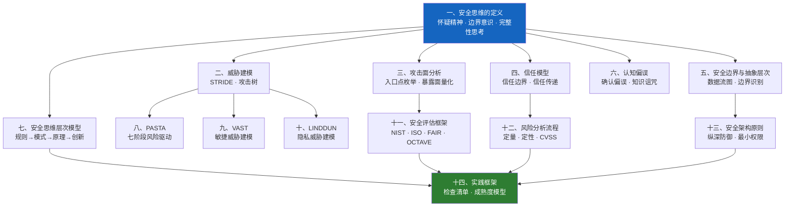

## 本节小结

### 知识图谱全景

本节从"什么是安全思维"出发，沿两条主线展开——**方法论体系**与**思维修炼路径**，最终汇聚到实践框架。下图展示了14个知识点之间的逻辑关系：



### 核心收获回顾

#### 收获一：安全思维不是天赋，是可训练的认知框架

本节第一篇定义了安全思维的三个核心要素——**怀疑精神、边界意识、完整性思考**。这不是抽象的口号，而是一套可以刻意练习的认知习惯。当你看到一个系统时，本能地问"输入是否可信？边界在哪里？异常路径有哪些？"——这就是安全思维在工作。

与普通思维的根本区别在于：普通思维关注"系统应该做什么"，安全思维关注"系统可能被要求做什么"。一个API返回了成功响应，普通思维认为任务完成；安全思维会追问：这个成功是真正的成功，还是错误处理的缺陷？返回的数据是否泄露了不该暴露的信息？

#### 收获二：威胁建模是一切安全工作的起点

从STRIDE的六维威胁分类（仿冒、篡改、抵赖、信息泄露、拒绝服务、提权），到PASTA的七阶段风险驱动建模，再到VAST的敏捷集成方案和LINDDUN的隐私威胁专攻——本节覆盖了当前主流的威胁建模方法论。

关键认知：**威胁建模不是一次性活动，而是贯穿系统生命周期的持续过程**。PASTA强调从商业目标出发反推安全需求；VAST将威胁建模嵌入DevOps流水线，让安全与开发同步而非滞后；LINDDUN则提醒我们，在GDPR/个保法时代，隐私威胁需要独立的建模视角。

三种方法的适用场景对比：

| 维度 | PASTA | VAST | LINDDUN |
|------|-------|------|---------|
| 核心驱动 | 风险导向 | 敏捷交付 | 隐私合规 |
| 适用阶段 | 设计期深度分析 | 全生命周期持续建模 | 涉及个人数据的系统 |
| 输出物 | 威胁场景+风险评级 | 可操作的威胁卡片 | 隐私威胁+缓解策略 |
| 团队要求 | 需要安全专家主导 | 开发团队可自助执行 | 需要隐私+安全双视角 |
| 最佳组合 | 与ISO 27001配合 | 与CI/CD集成 | 与GDPR/PIA配合 |

#### 收获三：攻击面分析是连接理论与实践的桥梁

攻击面分析将抽象的"安全风险"转化为可度量的具体指标——入口点数量、暴露协议类型、可访问数据范围。它的价值在于：**你无法保护你不了解的东西**。

实操要点：
- **枚举**：列出所有入口点（API端口、Web路由、文件上传、消息队列、第三方集成）
- **分类**：按信任级别对入口点分层（公开、内部、特权）
- **量化**：计算暴露面大小（开放端口数×可访问用户数×数据敏感度）
- **收敛**：识别可关闭的入口点，制定暴露面缩减计划

#### 收获四：信任模型决定了安全架构的骨架

信任模型回答一个根本问题：**在你的系统中，谁信任谁，信任到什么程度**。信任边界画在哪里，安全控制就部署在哪里。

核心原则：
- **零信任**（Never Trust, Always Verify）：默认不信任任何实体，每次访问都需要验证
- **最小信任**：只授予完成任务所需的最小信任级别
- **信任传递风险**：A信任B、B信任C，不代表A应该信任C——信任链越长，攻击面越大
- **信任验证**：信任不是静态的，需要持续验证（证书轮换、Token过期、会话重认证）

#### 收获五：安全边界与抽象层次决定了分析的粒度

安全边界是不同信任域之间的分界线。抽象层次决定了你在什么粒度上分析安全问题。从宏观到微观：

| 层次 | 关注点 | 典型边界 | 分析工具 |
|------|--------|---------|---------|
| 企业架构层 | 组织间信任关系 | 内网/外网、子公司/母公司 | 网络拓扑图 |
| 系统架构层 | 组件间交互 | 微服务边界、数据库/API边界 | 数据流图（DFD） |
| 应用层 | 模块间调用 | 前端/后端、沙箱/宿主 | 代码架构图 |
| 代码层 | 函数间数据流 | 用户态/内核态、可信/不可信输入 | 代码审计 |

#### 收获六：认知偏误是安全思维最大的敌人

安全思维的修炼不仅是学习新知识，更是克服根深蒂固的认知偏误。本节识别了六种对安全工作危害最大的偏误：

| 偏误类型 | 表现 | 危害 | 对抗策略 |
|---------|------|------|---------|
| 确认偏误 | 只寻找支持自己判断的证据 | 漏掉反面证据导致误判 | 主动寻找反例，红队验证 |
| 知识诅咒 | 认为别人也理解自己知道的知识 | 高估用户安全意识 | 用户测试，假设最弱环节 |
| 锚定效应 | 过度依赖第一个获取的信息 | 风险评估被初始印象锚定 | 多角度独立评估 |
| 可得性偏误 | 高估近期/印象深刻的事件概率 | 过度防御已知攻击，忽视新型威胁 | 威胁情报驱动，定期更新威胁模型 |
| 正常化偏误 | 认为"一直没出事就是安全的" | 忽视累积的风险信号 | 定期红队演练，主动发现盲区 |
| 沉没成本 | 已投入大量资源不愿改变 | 坚持使用有安全缺陷的系统 | 基于风险而非投入做决策 |

#### 收获七：安全思维有清晰的四层进阶路径

从入门到精通，安全思维经历四个层次：


- **规则遵循**：遵循OWASP Top 10、CIS Benchmark等已知最佳实践。不需要理解"为什么"，只需要知道"怎么做"。
- **模式识别**：看到一个系统，能快速识别出它可能面临的威胁类型。经验驱动，见过越多攻击手法，识别越快。
- **原理理解**：深入理解漏洞的根本成因——不是"这里有SQL注入"，而是"参数化查询为什么能防止SQL注入，而字符串拼接不能"。
- **创新突破**：发现前人未发现的攻击路径，提出新的攻击向量，推动安全技术和方法论的进步。

**关键认知**：大多数安全从业者在第二层就停止了进阶。从第二层到第三层的跨越，需要的不是更多工具经验，而是对底层原理的深入研究——操作系统、网络协议、密码学、编译原理。

#### 收获八：评估框架提供了标准化的风险语言

四种主流评估框架各有侧重：

| 框架 | 核心思路 | 输出 | 适用场景 |
|------|---------|------|---------|
| NIST CSF | 五大功能（识别、保护、检测、响应、恢复） | 成熟度评级 | 组织级安全体系建设 |
| ISO 27001 | PDCA循环 + 114项控制措施 | 认证证书 | 合规驱动的安全管理 |
| FAIR | 定量风险量化为财务损失 | 金额化的风险值 | 安全投资决策、ROI论证 |
| OCTAVE | 资产驱动的三阶段评估 | 风险缓解计划 | 关键基础设施风险评估 |

FAIR的公式值得牢记：**风险 = 威胁事件频率 × 单次事件损失**。它把抽象的"安全风险"翻译成了管理层能理解的语言——钱。

#### 收获九：风险分析需要定量与定性结合

- **定量分析**：用数字说话。ALE（年度损失期望）= SLE（单次损失期望）× ARO（年度发生概率）。安全ROI = （实施前ALE - 实施后ALE - 控制成本）/ 控制成本。
- **定性分析**：用等级说话。极高/高/中/低/极低五级评估，适合数据不足或需要快速决策的场景。
- **CVSS评分**：漏洞严重性的行业标准量化方法，从接入向量、攻击复杂度、影响指标等维度计算0-10的基础分。

**实操建议**：在安全预算申请时用定量分析（"这个投入能减少多少预期损失"），在日常漏洞优先级排序时用定性分析（"这个漏洞比那个紧急"），在漏洞披露沟通时用CVSS（"CVSS 9.8，远程代码执行"）。

#### 收获十：安全架构设计原则是防御体系的基石

五条核心原则构成了安全架构的骨架：

1. **纵深防御**：不依赖单一防线，部署物理→网络→主机→应用→数据→人员六层防护。任何一层被突破，其他层仍然有效。
2. **最小权限**：默认拒绝，按需授予，定期审查。特权账户使用PAM（特权访问管理）集中管控。
3. **安全默认**：系统开箱即安全，而不是需要用户手动配置才安全。禁用不必要服务，强制修改默认密码。
4. **失败安全**：故障时进入安全状态。认证服务宕机→拒绝所有登录，防火墙故障→阻止所有流量。
5. **完全中介**：每次访问都验证权限，不缓存访问控制决策。这是防止提权攻击的关键。

#### 收获十一：实践框架让理论落地

安全成熟度模型（Level 1初始级 → Level 5优化级）帮助组织定位当前位置。三个层级的检查清单（架构级、应用级、运维级）提供了可执行的自评工具。

**关键认知**：大多数组织处于Level 1-2之间。从Level 2到Level 3的跨越是最难的——它要求安全从"个人英雄主义"转变为"体系化运作"。

### 本节知识的内在逻辑

整个"理论基础"节的设计遵循一条清晰的逻辑链：

```text
认知校准 → 方法论学习 → 思维层次提升 → 实践落地
```

- **认知校准**（第一、六、七章）：先定义"什么是安全思维"，识别阻碍安全思维的认知偏误，建立四层进阶的修炼路径图。
- **方法论学习**（第二、三、四、五、八、九、十、十一、十二章）：系统学习威胁建模（STRIDE/PASTA/VAST/LINDDUN）、攻击面分析、信任模型、安全边界、评估框架、风险分析等核心方法论。
- **思维层次提升**（贯穿全节）：每一章都在推动读者从"规则遵循"向"模式识别"和"原理理解"进阶。
- **实践落地**（第十三、十四章）：将前面所有理论汇聚为可执行的安全架构原则和实践检查清单。

### 常见误区与纠正

| 误区 | 纠正 |
|------|------|
| "学完理论就会安全思维了" | 理论是地图，不是目的地。安全思维需要在真实项目中反复练习才能内化 |
| "威胁建模太麻烦，不如直接上工具扫描" | 工具扫描只能发现已知漏洞，威胁建模能发现设计层面的逻辑缺陷——这是工具无法替代的 |
| "零信任就是不信任任何人" | 零信任不是"零信任"，而是"持续验证"。它不消除信任，而是将信任从静态变为动态 |
| "风险分析需要精确数据" | 风险分析的目标不是精确预测，而是辅助决策。"大致正确"远好于"精确错误" |
| "安全架构原则选一两个用就行" | 五条原则是互补的，缺少任何一条都会留下系统性弱点。纵深防御解决"防不住"，最小权限解决"权限过大"，完全中介解决"缓存欺骗" |
| "成熟度模型是给大公司用的" | 3人创业团队也需要知道自己在Level几。成熟度模型的核心价值不是评级，而是指明下一步该做什么 |

### 下一步行动建议

根据你当前的安全思维层次，选择对应的行动路径：

**如果你在第一层（规则遵循）**：
- 精读OWASP Top 10和CIS Benchmark，理解每条规则的适用场景
- 在自己的项目中逐条对照检查清单
- 开始学习STRIDE威胁建模，在下一个项目中尝试完整的建模流程

**如果你在第二层（模式识别）**：
- 系统学习PASTA和VAST，在团队中推行威胁建模常态化
- 开始研究漏洞的根本成因，不仅仅是"怎么修"，更要理解"为什么会出现"
- 阅读CVE漏洞公告的技术分析，训练从描述还原攻击路径的能力

**如果你在第三层（原理理解）**：
- 深入操作系统、网络协议、密码学的底层原理
- 尝试用FAIR框架做一次完整的定量风险分析
- 参与安全架构评审，从架构层面发现设计缺陷

**如果你在第四层（创新突破）**：
- 研究前沿攻击技术，尝试发现新的攻击向量
- 将安全思维方法论总结为可复用的框架和工具
- 指导团队成员的安全思维修炼

---

> "在安全领域，最重要的工具不是任何软件，而是你自己的思维方式。"本节的14个知识点提供了这套思维方式的完整理论基础。但理论的价值只有在实践中才能兑现——从今天开始，在你的下一个项目中，画一张数据流图，标出信任边界，用STRIDE分析每个入口点。这就是安全思维从理论走向实践的第一步。
