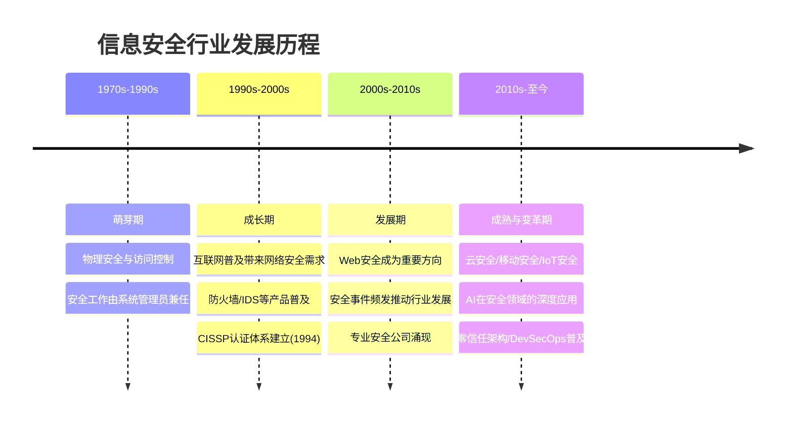
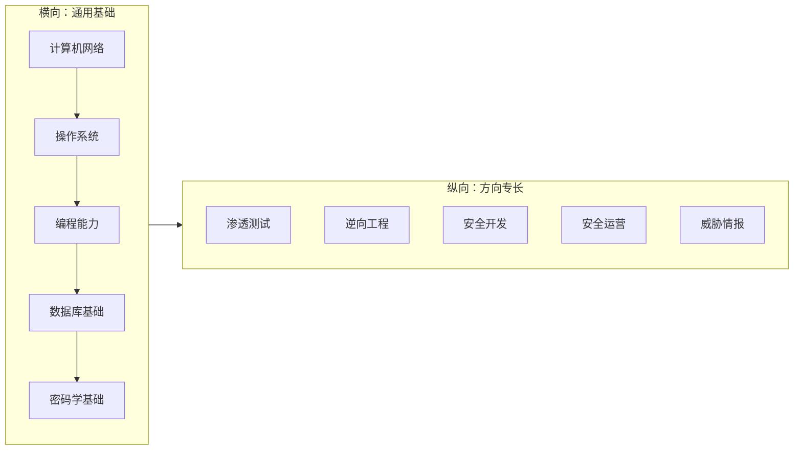
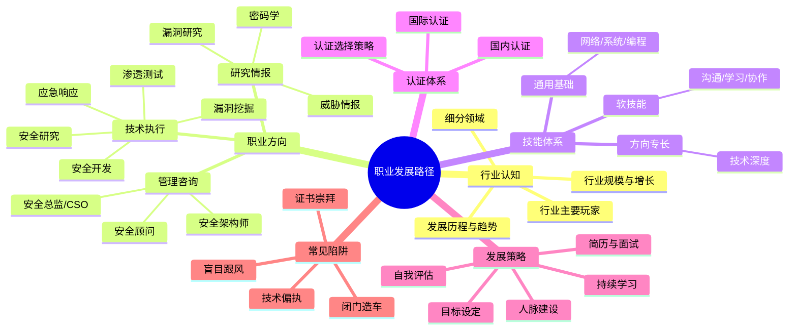

# 第四章：职业发展路径

## 章节定位

掌握了安全思维之后，下一步是了解信息安全领域的职业发展路径。无论你是想成为全职的安全研究员、渗透测试工程师，还是想在开发工作中融入安全能力，了解这个领域的职业生态都至关重要。

信息安全是一个快速发展的行业，人才需求持续增长，薪资水平也相对较高。但同时，这个行业对从业者的持续学习能力要求也很高。本章将帮助你了解行业的全貌，找到适合自己的发展路径。

与后续的技术章节不同，本章不教你如何攻击或防御——它教你如何**规划**。一个好的职业规划能让你在学习后续技术章节时目标更明确、动力更充足。换句话说，本章是整本书的"导航仪"，帮你决定接下来把有限的时间和精力投入哪些方向。

## 本章目标

通过本章的学习，你将能够：

1. **了解安全行业的全景**：掌握信息安全领域的主要方向和细分岗位，理解每个方向的工作内容、技能要求和发展前景
2. **明确职业发展路径**：了解从入门到高级的成长路径和里程碑，知道每个阶段需要突破的关键瓶颈
3. **掌握核心技能要求**：明确不同方向需要掌握的关键技能，区分"必须会"和"最好会"的技能
4. **了解认证体系**：认识主流的安全认证及其价值，知道哪些认证值得投入，哪些可以跳过
5. **制定个人发展计划**：根据自身情况制定切实可行的发展规划，设定可衡量的短期和长期目标
6. **建立职业素养**：了解安全从业者的职业道德和法律边界，理解"白帽"的核心价值观

## 安全行业全景

### 行业规模与增长

信息安全行业近年来持续高速增长，这不是偶然现象，而是多重结构性因素共同驱动的结果：

| 驱动因素 | 具体表现 | 对从业者的影响 |
|----------|----------|---------------|
| **数字化转型加速** | 企业核心业务全面上云，远程办公成为常态，API经济爆发 | 攻击面持续扩大，云安全、API安全人才需求激增 |
| **合规要求增加** | 中国《数据安全法》《个人信息保护法》、欧盟GDPR、美国各州隐私法 | 合规审计、数据安全治理岗位大量增加 |
| **安全事件频发** | 勒索软件攻击年增长超50%，供应链攻击事件（如SolarWinds）引发全球关注 | 企业安全预算提升30%-50%，应急响应人才紧缺 |
| **新技术带来新风险** | AI大模型被用于自动化攻击，IoT设备漏洞呈指数增长，量子计算威胁现有加密体系 | AI安全、IoT安全成为新兴热门方向 |

根据ISC²发布的《2024年网络安全劳动力研究》，全球网络安全人才缺口约为**480万人**，相比前一年增长了约15%。中国市场方面，教育部和工信部的数据显示，国内网络安全人才缺口超过**150万**，且每年以约20%的速度扩大。这意味着具备专业技能的安全人才始终处于供不应求的状态——安全行业是少数真正"人挑公司"而非"公司挑人"的行业之一。

### 行业发展历程

理解安全行业的演进脉络，有助于你判断未来的方向：

### 行业细分领域

信息安全可以分为以下主要细分领域，每个方向都有其独特的技术栈和职业路径：

| 细分领域 | 核心关注点 | 典型技术栈 | 人才需求热度 |
|----------|-----------|-----------|-------------|
| **网络安全** | 保护网络基础设施、协议安全 | 防火墙、IDS/IPS、VPN、流量分析 | ★★★★☆ |
| **应用安全** | 保护Web/API/移动应用 | SAST/DAST、WAF、代码审计 | ★★★★★ |
| **云安全** | 保护云环境中的资产与配置 | AWS/GCP/Azure安全服务、CSPM、CWPP | ★★★★★ |
| **数据安全** | 保护数据的机密性、完整性、可用性 | 加密、DLP、数据库审计 | ★★★★☆ |
| **终端安全** | 保护终端设备免受恶意软件侵害 | EDR、XDR、终端管理 | ★★★☆☆ |
| **身份安全** | 管理和保护数字身份与访问权限 | IAM、PAM、SSO、零信任 | ★★★★☆ |
| **安全运营** | 持续监控、检测和响应安全事件 | SIEM、SOAR、威胁狩猎 | ★★★★★ |
| **安全研究** | 发现新漏洞和攻击技术 | 逆向工程、Fuzzing、漏洞利用 | ★★★★☆ |

### 行业主要玩家

了解行业的主要参与者，有助于你选择目标雇主和建立人脉：

**安全厂商（产品导向）：**
- 国际巨头：Palo Alto Networks、CrowdStrike、Fortinet、SentinelOne、Snyk
- 国内头部：奇安信、深信服、绿盟科技、安恒信息、长亭科技、微步在线
- 专项厂商：专注特定领域的安全公司（如Tenable专注漏洞管理、HashiCorp专注云安全）

**企业安全部门（甲方）：**
- 互联网大厂：字节跳动、腾讯、阿里、华为、蚂蚁集团的安全团队
- 金融机构：银行、证券、保险公司的信息安全部门
- 跨国企业：外企在华的安全团队，通常薪资和work-life balance较好

**安全服务公司（乙方）：**
- 渗透测试服务：为客户提供安全评估
- 安全咨询公司：德勤、安永、普华永道等四大的安全咨询部门
- 托管安全服务提供商（MSSP）：为客户运营安全能力

**研究机构：**
- 国家级：中国信息安全测评中心、国家互联网应急中心（CNCERT）
- 学术界：清华、北大、中科大、上交等高校的安全实验室
- 独立研究：奇安信威胁情报中心、360安全大脑等

## 主要职业方向速览

以下是安全行业最主流的职业方向，每个方向在本章的"理论基础"小节中都有详细展开：

### 技术执行方向

| 方向 | 一句话描述 | 入门门槛 | 天花板 | 适合人群 |
|------|-----------|---------|--------|---------|
| **渗透测试工程师** | 模拟攻击者，发现系统漏洞 | 中等 | 高 | 喜欢动手、好奇心强 |
| **安全研究员** | 研究新技术、发现未知漏洞 | 高 | 极高 | 喜欢深入底层、耐心细致 |
| **漏洞挖掘工程师** | 专注发现软件/系统中的安全缺陷 | 高 | 高 | 喜欢逆向、有耐心 |
| **恶意软件分析师** | 分析恶意软件行为和机制 | 高 | 高 | 喜欢逆向工程、底层调试 |
| **应急响应工程师** | 处理安全事件、恢复受影响系统 | 中等 | 高 | 冷静沉着、抗压能力强 |
| **安全开发工程师** | 将安全融入DevOps流程 | 中等 | 高 | 有开发背景、注重工程化 |
| **应用安全工程师** | 保障应用全生命周期安全 | 中等 | 高 | 有开发经验、关注代码质量 |

### 管理与咨询方向

| 方向 | 一句话描述 | 入门门槛 | 天花板 | 适合人群 |
|------|-----------|---------|--------|---------|
| **安全架构师** | 设计企业整体安全体系 | 极高 | 极高 | 技术全面、系统性思维强 |
| **安全总监/CSO** | 负责组织整体安全策略 | 高 | 极高 | 技术+管理双能力 |
| **安全咨询顾问** | 为客户提供安全解决方案 | 中等 | 高 | 沟通能力强、知识面广 |
| **合规审计专家** | 确保组织满足安全合规要求 | 中等 | 高 | 细致严谨、了解法规 |

### 研究与情报方向

| 方向 | 一句话描述 | 入门门槛 | 天花板 | 适合人群 |
|------|-----------|---------|--------|---------|
| **漏洞研究员** | 专注零日漏洞发现和利用 | 极高 | 极高 | 底层功底深厚、持久专注 |
| **密码学研究员** | 研究密码算法和协议安全性 | 极高 | 高 | 数学功底好、理论兴趣强 |
| **威胁情报分析师** | 追踪威胁组织、分析攻击活动 | 中等 | 高 | 信息敏感、外语能力好 |
| **安全产品研究员** | 研究安全产品和技术趋势 | 中等 | 中等 | 视野开阔、有商业意识 |

### 薪资参考（中国市场，2024-2025年）

| 级别 | 年限 | 年薪范围（万元） | 典型岗位 |
|------|------|----------------|---------|
| 初级 | 0-2年 | 12-25 | SOC分析师、初级渗透测试、安全运维 |
| 中级 | 2-5年 | 25-50 | 高级渗透测试、应用安全工程师、安全开发 |
| 高级 | 5-8年 | 50-100 | 安全架构师、高级研究员、团队负责人 |
| 专家/管理层 | 8年+ | 80-200+ | 安全总监、CSO、首席研究员 |

> **注意**：薪资受城市、公司规模、行业、个人能力等多因素影响，以上仅为参考区间。一线互联网大厂的安全岗位薪资通常高于表中范围，而传统行业可能偏低。海外市场的薪资水平通常更高（详见本章"深度拓展"中的国际市场分析）。

## 安全技能全景图

安全从业者的技能结构可以用**T型模型**来描述——横向是广泛的基础知识，纵向是某个方向的深度专长：

**初级阶段建议先建立广度**——广泛了解网络安全、应用安全、系统安全、安全运营等各个方向，形成全局视野。**中高级阶段则选择一个方向深入**——成为某个细分领域的专家，建立起不可替代性。

在本章的"理论基础"小节中，你将看到每个方向的详细技能树拆解；在"核心技巧"小节中，你将学会如何制定自己的技能提升计划。

## 认证体系概览

安全认证是行业认可的"硬通货"，但并非越多越好。以下是最主流的认证及其定位：

| 认证名称 | 级别 | 方向 | 考试形式 | 行业认可度 | 参考费用 |
|----------|------|------|---------|-----------|---------|
| CompTIA Security+ | 入门 | 通用安全 | 选择题 | ★★★☆☆ | ~$400 |
| CEH | 入门 | 道德黑客 | 选择题 | ★★☆☆☆ | ~$1,200 |
| eJPT | 入门 | 渗透测试 | 实操 | ★★★☆☆ | ~$250 |
| **OSCP** | **中级** | **渗透测试** | **24小时实操** | **★★★★★** | **~$1,600** |
| GPEN | 中级 | 渗透测试 | 选择题 | ★★★★☆ | ~$2,500 |
| GCIH | 中级 | 应急响应 | 选择题 | ★★★★☆ | ~$2,500 |
| **CISSP** | **中级** | **安全管理** | **选择题** | **★★★★★** | **~$750** |
| CISM | 中级 | 信息安全管理 | 选择题 | ★★★★☆ | ~$575 |
| OSED/OSEP/OSCE3 | 高级 | 高级渗透/漏洞开发 | 实操 | ★★★★★ | ~$1,600+ |
| GXPN | 高级 | 高级渗透/漏洞研究 | 选择题 | ★★★★☆ | ~$2,500 |
| **CISP** | **中级（国内）** | **安全管理** | **选择题** | **★★★★☆（国内）** | **~¥6,000** |
| CISP-PTE | 中级（国内） | 渗透测试 | 实操 | ★★★☆☆（国内） | ~¥8,000 |

> **核心建议**：初学者考Security+或eJPT打基础；方向确定后考OSCP（技术向）或CISSP（管理向）作为核心认证；国内求职补充CISP。详见本章"理论基础"小节的认证深度解析。

## 章节结构与阅读指南

本章包含以下小节，建议按顺序阅读：

| 小节 | 主题 | 核心内容 | 阅读时间 |
|------|------|----------|---------|
| 01-理论基础 | 安全行业全景 | 行业细分、岗位职责、技能要求、认证体系、行业趋势、职业发展理论、能力模型 | 60分钟 |
| 02-核心技巧 | 职业发展策略 | 自我评估、目标设定、简历优化、面试准备、技能提升、人脉建设、开源贡献 | 45分钟 |
| 03-实战案例 | 职业发展故事 | 8个真实从业者的发展经历：从零到渗透测试、从开发到架构师、独立研究员、Bug Bounty猎人等 | 40分钟 |
| 04-常见误区 | 职业发展陷阱 | 10大典型误区：证书崇拜、技术偏执、盲目跟风、闭门造车、眼高手低等 | 20分钟 |
| 05-练习方法 | 能力提升方案 | 靶场练习、认证准备、项目实践、社区参与、求职准备、持续学习方法 | 30分钟 |
| 06-本章小结 | 核心要点回顾 | 关键建议和发展路径图、学习成果检验 | 10分钟 |
| 07-深度拓展 | 进阶知识 | 薪资市场分析、远程工作、创业机会、AI对安全职业的影响、推荐资源 | 30分钟 |

### 分层阅读建议

不同背景的读者可以采用不同的阅读策略：

**零基础读者（无安全/IT背景）：**
> 按顺序完整阅读本章所有小节。重点关注"理论基础"中的行业全景和职业方向详解，以及"实战案例"中的从零起步故事。先建立全局认知，再用"核心技巧"制定自己的学习计划。

**有IT背景的转型者（开发/运维/网络工程师）：**
> 快速浏览"理论基础"，重点关注与你现有技能重叠的方向（如开发→安全开发/应用安全，运维→安全运营/应急响应）。重点阅读"核心技巧"中的简历优化和面试准备，以及"实战案例"中的跨界转型故事。

**已入行的安全从业者（1-3年经验）：**
> 可以跳过行业全景，直接阅读"理论基础"中的能力模型和职业发展理论，以及"核心技巧"中的技能提升策略和人脉建设。"深度拓展"中的薪资分析和行业趋势对你的进阶决策最有价值。

**安全行业资深人士（5年+经验）：**
> 重点关注"理论基础"中的行业趋势预测、"核心技巧"中的开源贡献与技术影响力建设，以及"深度拓展"中的创业机会和AI影响分析。

## 本章核心概念导图

在正式进入各小节之前，先建立本章的核心知识框架：

## 学习建议

本章的内容偏重职业规划，与纯技术章节不同，它需要你**结合自身情况进行思考**，而不是简单地"看完就完"。建议按以下步骤学习：

### 第一步：自我评估（学习前）

在开始阅读之前，先花15分钟回答以下问题：

1. **兴趣方向**：你对攻击（红队）还是防御（蓝队）更感兴趣？喜欢深入底层研究还是面向业务解决实际问题？
2. **现有优势**：你目前最强的技能是什么？（编程、网络、运维、沟通、写作……）
3. **时间投入**：你计划每周投入多少时间学习安全？
4. **职业目标**：你希望在什么时间内进入安全行业？理想的工作状态是什么？

### 第二步：通读全章（2-3小时）

按建议的阅读顺序通读本章，重点关注：
- 哪些职业方向让你感到兴奋
- 你目前的技能与目标岗位的差距
- 哪些认证对你的目标方向最有价值

### 第三步：制定计划（学习后）

读完本章后，用"核心技巧"小节中的方法论，制定一份属于自己的职业发展计划。不要追求完美——先有一个可行的方案，后续根据实际情况持续调整。

### 第四步：行动起来

计划再好也只是纸上的文字。从今天开始，选择一个最小的可执行行动——注册一个靶场账号、阅读一篇安全博客、加入一个安全社区。**行动是最好的规划**。

***

> "选择比努力更重要，但努力让你有更多选择。" 在安全行业，这句话尤其适用——方向对了，每一步努力都在积累；方向错了，再多的努力也可能是低效的重复。

---

> ⚠️ **安全警告与免责声明**
> 
> 本章内容仅供**合法的安全测试与教育目的**使用。所有技术、工具和方法的讨论均旨在帮助安全从业者在**获得明确授权**的前提下进行防御性安全研究。
> 
> - 🚫 **未经授权**对任何系统、网络或应用进行安全测试是**违法行为**
> - ✅ 所有实践活动应在**隔离的实验环境**中进行（如虚拟机、CTF平台）
> - ✅ 遵守所在国家和地区的**网络安全法律法规**
> - ✅ 遵循**负责任的漏洞披露**原则
> 
> 作者不对因滥用本章内容造成的任何后果承担责任。
