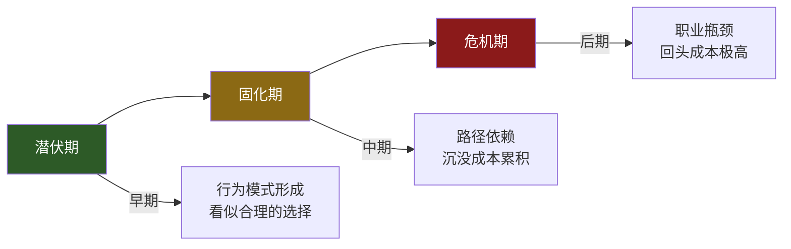
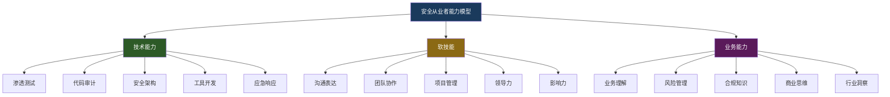
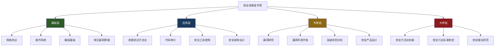
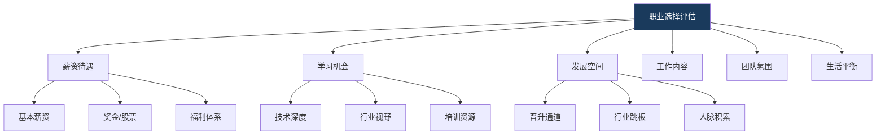
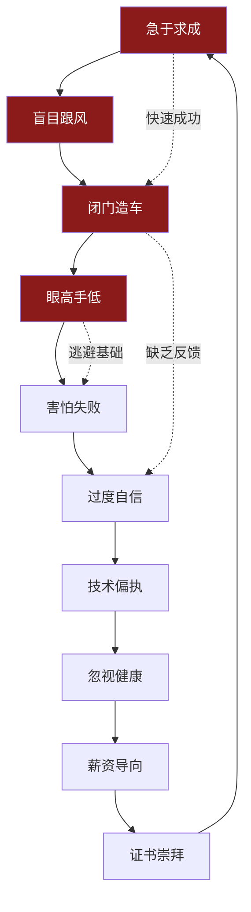
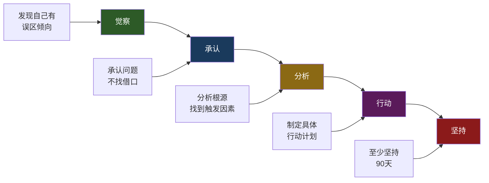

# 职业发展的常见误区

> "我们不是因为无知而犯错，而是因为确信自己知道答案。" —— 马克·吐温

信息安全从业者的职业发展道路上，遍布着各种隐性陷阱。这些陷阱不是技术难题，而是认知偏差——它们看起来合理，甚至像是"常识"，却会让人在不知不觉中偏离正确的方向。更危险的是，陷入误区的人往往意识不到自己已经偏离，直到几年后回头看，才发现走了大量弯路。

本章系统梳理安全行业中最常见的十大职业发展误区，深入分析其成因、危害和纠正方法。每个误区都配有真实场景还原和自诊清单，帮助你对照检视自身状态。

---

## 理论基础：误区从何而来

### 认知偏差与职业决策

职业误区的本质是**认知偏差**（Cognitive Bias）在职业决策中的体现。心理学研究揭示了多种影响职业判断的偏差：

| 认知偏差 | 定义 | 在职业决策中的表现 |
|----------|------|-------------------|
| 确认偏差 | 只关注支持自己观点的信息 | 只看成功案例，忽视失败教训 |
| 沉没成本谬误 | 因为已经投入而不愿放弃 | 已经学了半年，不想换方向 |
| 达克效应 | 能力不足者高估自己的水平 | 刚学了基础就觉得自己能独当一面 |
| 从众效应 | 跟随大多数人的选择 | 别人都考CISP，我也考 |
| 光环效应 | 对某一点好印象扩展到整体 | 这个人技术很强，所以他什么都说得对 |
| 锚定效应 | 过度依赖第一个获得的信息 | 入行时听到的"标准路径" |
| 现状偏好 | 倾向于维持当前状态 | 已经适应了现在的舒适区，不愿改变 |
| 损失厌恶 | 对损失的痛苦大于等量收益的快乐 | 害怕换工作失去现有待遇 |

### 职业发展陷阱的三个阶段



- **潜伏期**（入行1-3年）：误区开始形成，但因为行业新人本就在学习和试错，危害不明显
- **固化期**（3-5年）：错误模式固化为习惯，路径依赖形成，改变的成本开始上升
- **危机期**（5年以上）：职业瓶颈出现，回头修正的成本极高，不修正则面临被淘汰

关键洞察：**越早识别误区，修正成本越低**。这也是本章的价值所在。

---

## 十大误区详解

### 误区一：证书崇拜

#### 典型表现

- 花大量时间研究"该考哪些证"，而不是"该学什么技能"
- 简历上列出5个以上认证，但无法完成一次基础渗透测试
- 认为拿到CISSP就能年薪百万
- 用考证进度代替学习进度："我这个月的目标是刷完CISP题库"

#### 误区根源分析

证书崇拜的根源在于**捷径心理**和**信号理论的误用**。经济学中的信号理论（Spence, 1973）指出，证书是一种能力信号——但信号只有在接收方（雇主）认可时才有效。问题在于：

1. **信号贬值**：当大量人持有同一证书时，信号价值下降。CISP在中国安全行业已经出现明显的信号贬值现象
2. **信号与能力脱节**：理论考试证书无法证明实操能力。一个持有CISP但从未做过渗透测试的人，在面试中会立即暴露
3. **机会成本被忽视**：考一个CISSP需要3-6个月的准备时间，这些时间如果用于实际项目和技能提升，回报可能更高

#### 真实场景

> 张工，入行2年，已经考了CISP、Security+、CEH三个证书。他的简历很漂亮，但在一次面试中，面试官让他现场分析一个简单的SQL注入漏洞。张工能背出SQL注入的定义和分类，却无法完成实际的漏洞利用。面试官问："你有三个安全证书，但为什么不能完成这个基础操作？"张工哑口无言。
>
> 反观他的同事李工，只考了OSCP一个证书，但每周都在Hack The Box上练习，GitHub上有自己写的渗透测试工具。面试时，李工主动展示了自己发现并提交的3个CVE，最终拿到了offer。

#### 证书的真实价值矩阵

| 证书类型 | 代表证书 | 核心价值 | 适用阶段 | 投入产出比 |
|----------|----------|----------|----------|-----------|
| 实战型 | OSCP、OSEP | 证明实际渗透能力 | 入门-中级 | ★★★★★ |
| 管理型 | CISSP、CISM | 企业安全管理资质 | 中高级 | ★★★☆☆ |
| 合规型 | CISP、ISO27001 LA | 满足国内合规要求 | 全阶段（按需） | ★★★☆☆ |
| 厂商型 | AWS Security Specialty | 特定平台安全能力 | 中级（特定方向） | ★★★★☆ |
| 研究型 | GREM、GXPN | 逆向/漏洞研究深度 | 高级 | ★★★★☆ |

#### 正确的证书策略

1. **先有技能，后有证书**：证书应该是对你已有能力的"盖章确认"，而不是"提前投资"
2. **质量优先于数量**：1个高含金量证书 > 5个低含金量证书
3. **匹配职业阶段**：入行选实战型，晋升选管理型，专业深耕选研究型
4. **关注ROI**：计算投入时间的预期回报，包括直接收益（加薪、跳槽筹码）和间接收益（知识体系完善）

**自诊清单**：
- [ ] 我是否花超过30%的学习时间在备考上？
- [ ] 我是否能用实际操作证明我所持证书的知识？
- [ ] 我是否因为"大家都在考"而考某个证书？
- [ ] 如果去掉简历上的证书部分，我还有什么能证明自己能力的东西？

---

### 误区二：技术偏执

#### 典型表现

- 认为"技术是一切"，软技能是"虚"的
- 在会议上用大量技术术语向领导汇报，领导完全听不懂
- 不理解业务需求，只从技术角度出发做安全方案
- 认为"只要我技术够强，公司就离不开我"
- 拒绝写文档、拒绝做培训、拒绝与非技术人员沟通

#### 误区根源分析

技术偏执的根源是**单一能力陷阱**和**专业身份认同过度**。心理学中的"专业身份认同"（Professional Identity）理论指出，当一个人过度认同自己的技术身份时，会将所有非技术活动视为"不属于自己的工作"。

在安全行业，这种偏执尤其危险，因为安全工作的本质是**风险管理**，而风险管理需要：

- **业务理解**：识别关键资产和业务流程
- **沟通能力**：向管理层解释风险和投资回报
- **影响力**：推动组织接受安全建议
- **商业思维**：将安全投入与业务价值挂钩

#### 安全从业者的完整能力模型



#### 真实场景

> 王工是一名技术能力很强的安全工程师，能发现复杂的漏洞，能编写自动化工具。但在公司推行新业务系统时，他提交了一份50页的技术风险评估报告，充满了漏洞类型、CVSS评分、技术细节。业务部门和管理层完全看不懂。
>
> 结果：业务部门认为安全团队"阻碍业务发展"，安全建议被搁置。三个月后，系统上线后被攻击者利用了王工曾经报告过的漏洞。
>
> 对比：另一位安全工程师赵工，在评估同一个系统时，用3页PPT向管理层展示了核心风险：1）这个漏洞可能导致客户数据泄露，影响10万用户；2）按照GDPR罚款标准，最高可达年营收的4%；3）修复成本约20万元，而潜在损失超2000万。管理层当天批准了修复方案。

#### 软技能提升的具体方法

| 软技能 | 提升方法 | 实践机会 |
|--------|---------|---------|
| 沟通表达 | 学习金字塔原理，练习"电梯演讲" | 向非技术人员解释安全问题 |
| 写作能力 | 坚持写技术博客和安全报告 | 每月至少1篇技术文章 |
| 项目管理 | 学习敏捷/Scrum，使用看板工具 | 主导一次安全项目 |
| 团队协作 | 主动参与跨部门项目 | 与开发团队合作做安全测试 |
| 影响力 | 在会议上发言，做内部培训 | 每季度做一次安全培训 |
| 领导力 | 承担更多责任，带领小团队 | 指导新人，带实习生 |

**自诊清单**：
- [ ] 我能否用非技术人员能理解的语言解释安全问题？
- [ ] 我是否理解公司的商业模式和核心业务流程？
- [ ] 我的简历上除了技术能力，还有什么其他能力的证明？
- [ ] 如果明天公司要提拔一个安全负责人，我是否有资格？

---

### 误区三：盲目跟风

#### 典型表现

- 看到AI安全火了就学AI安全，看到云安全热了就转云安全
- 学习方向每年都在变，简历上写满了"了解"级别的技能
- 社交媒体上什么技术讨论热就关注什么
- 没有自己的技术主见，别人说什么好就学什么

#### 误区根源分析

盲目跟风的根源是**信息过载**和**FOMO（Fear of Missing Out）**心理。在信息安全领域，新技术和新方向层出不穷，每年都会出现新的"风口"：

| 年份 | 行业风口 | 后续发展 |
|------|----------|----------|
| 2016 | 区块链安全 | 市场收缩，需求锐减 |
| 2018 | GDPR合规 | 变为常规需求，不再是风口 |
| 2020 | 云安全 | 持续增长，成为主流方向 |
| 2022 | 供应链安全 | 稳定需求，但非爆发式增长 |
| 2024 | AI安全/大模型安全 | 高速增长，但仍在早期 |
| 2025 | AI安全持续升温 | 复合型人才需求激增 |

如果一个人从2016年开始每年追逐风口，到2025年，他会拥有：区块链安全"了解"级别、GDPR"了解"级别、云安全"了解"级别、AI安全"了解"级别——但没有任何一个方向达到专家水平。

#### T型人才模型


正确的策略是成为**T型人才**：在一个核心方向上有深度（纵向），同时对相关领域有基本了解（横向）。

#### 选择深耕方向的决策框架

```text
选择方向 = 兴趣 × 能力 × 市场需求 × 个人资源

其中：
- 兴趣：你愿意花业余时间研究的方向
- 能力：你现有技能最能迁移的方向
- 市场需求：招聘市场对该方向的需求量和薪资水平
- 个人资源：你能获得的学习资源、导师、实践机会
```

**方向选择的实操步骤**：

1. **广泛探索**（1-2个月）：对5-8个主要方向各花1周时间做基础了解
2. **深度调研**（2-4周）：选择2-3个感兴趣的方向，调研其学习路径、职业前景、市场需求
3. **试学验证**（1-3个月）：对首选方向进行深入学习，验证是否真正适合
4. **确定方向**：做出选择后，至少坚持18个月不换方向
5. **定期复盘**：每6个月评估一次方向选择是否需要调整

**自诊清单**：
- [ ] 我能否用一句话说清楚自己的核心专长是什么？
- [ ] 过去18个月，我的学习方向是否变化过3次以上？
- [ ] 我是否有至少一个方向达到了"能独立完成复杂项目"的水平？
- [ ] 我选择当前方向是因为真正感兴趣，还是因为"大家都在学"？

---

### 误区四：闭门造车

#### 典型表现

- 一个人埋头学习，从不参与社区讨论
- 不知道行业里其他人在做什么、在讨论什么
- 遇到问题自己死磕，不愿意或不知道怎么求助
- 从不分享自己的学习成果和发现
- 认为"技术好就行了，不需要社交"

#### 误区根源分析

闭门造车的根源是**内向性格的过度放大**和**对"社交"的误解**。很多安全从业者是内向型人格，倾向于独立工作。但"技术社区参与"不等于"社交"，它的本质是**知识网络的构建**。

知识网络理论（Network Theory of Knowledge）指出：一个人的知识不仅取决于自身的学习，还取决于他能接触到的知识网络。闭门学习的人，其知识网络是单节点的——只有自己。而活跃于社区的人，其知识网络包含数百个节点——每个节点都可能提供新的视角、信息和机会。

#### 知识网络的价值

| 维度 | 闭门造车 | 社区参与 | 差距倍数 |
|------|----------|----------|----------|
| 信息获取速度 | 滞后1-3个月 | 实时 | 10-30倍 |
| 问题解决效率 | 自己死磕数天 | 社区提问数小时 | 5-10倍 |
| 职业机会 | 只靠投简历 | 内推+猎头+社区曝光 | 3-5倍 |
| 学习深度 | 单一视角 | 多人讨论碰撞 | 2-3倍 |
| 行业影响力 | 零 | 逐渐积累 | 无法量化 |

#### 低成本参与社区的方式

很多人认为"参与社区"需要很高门槛，其实不是：

| 方式 | 所需技能 | 时间投入 | 价值回报 |
|------|----------|----------|---------|
| 阅读安全博客和论坛 | 基础阅读能力 | 每天30分钟 | 保持信息更新 |
| 在论坛回答问题 | 基础安全知识 | 每周1-2小时 | 巩固知识，建立声誉 |
| 写技术博客 | 技术+写作能力 | 每月4-8小时 | 技术影响力，求职加分 |
| 参加线上CTF | 基础安全技能 | 按比赛时间 | 技能提升，社区曝光 |
| 参加本地Meetup | 无 | 每月2-3小时 | 人脉，行业视野 |
| 在GitHub上贡献代码 | 编程能力 | 按项目 | 技术声誉，学习机会 |
| 参加安全会议 | 专业能力 | 按会议时间 | 人脉，行业视野，影响力 |

**自诊清单**：
- [ ] 我是否有定期关注的安全社区或博客列表？
- [ ] 过去3个月，我是否在任何社区回答过别人的问题？
- [ ] 我是否有可以随时讨论技术问题的同行朋友？
- [ ] 如果我明天失业了，除了投简历，我还有什么渠道找到工作？

---

### 误区五：眼高手低

#### 典型表现

- 觉得基础工作"太简单"、"配不上自己"
- 不愿意做安全运维、日志分析等"无聊"的工作
- 总想直接做高级漏洞研究，却连基础漏洞原理都说不清楚
- 简历上写"精通XX"，实际只能做到"了解"级别
- 对基础工具的使用不熟练，却在研究高级攻击技术

#### 误区根源分析

眼高手低的根源是**对"高级"的错误定义**和**对基础价值的低估**。很多人认为"高级"等于"复杂"、"炫酷"，但实际上，真正的高级是**把基础做到极致**。

以渗透测试为例，一个真正高级的渗透测试工程师，他的"高级"体现在：

1. 对HTTP协议的每一个细节都了如指掌（基础）
2. 能从一个看似正常的请求中发现微妙的安全问题（基础的极致运用）
3. 能根据业务逻辑设计出有针对性的测试方案（经验+基础）
4. 能将发现的问题转化为业务语言（沟通+基础）

这四个层次，没有任何一个能跳过基础。

#### 安全技能的金字塔结构



#### 基础工作的隐藏价值

那些看起来"无聊"的基础工作，实际上蕴含着巨大的学习价值：

| 基础工作 | 表面价值 | 深层价值 |
|----------|---------|---------|
| 日志分析 | 无聊的重复劳动 | 理解系统行为模式，培养安全直觉 |
| 安全运维 | 不够"酷" | 理解真实环境的复杂性，学习应急响应 |
| 漏洞复现 | 只是照做 | 理解漏洞原理，学习利用技术 |
| 安全报告编写 | 文书工作 | 锻炼逻辑思维和表达能力 |
| 资产梳理 | 体力活 | 理解企业IT架构，建立全局视角 |
| 安全培训 | 不是技术活 | 深化对知识的理解，提升表达能力 |

**自诊清单**：
- [ ] 我是否能独立完成一个完整的渗透测试项目（从信息收集到报告编写）？
- [ ] 我对TCP/IP协议栈的每一层是否都能说清楚其安全问题？
- [ ] 我是否认真对待过每一项被分配的基础工作？
- [ ] 如果让一个新人评价我的基础功，他会怎么评价？

---

### 误区六：薪资导向

#### 典型表现

- 选择工作只看薪资数字，不看工作内容和成长空间
- 为了高薪接受一份自己完全不感兴趣的工作
- 频繁跳槽追求短期涨薪，每份工作不超过1年
- 将"年薪XX万"作为职业成功的唯一标准
- 因为薪资差距而焦虑，影响工作状态

#### 误区根源分析

薪资导向的根源是**短期思维**和**参照点依赖**。行为经济学中的"参照点依赖"理论指出，人们评估薪资时不是看绝对值，而是与参照点比较。在安全行业，社交媒体上频繁出现的"高薪案例"制造了一个虚高的参照点，让人产生"我的薪资低于平均水平"的错觉。

#### 职业选择的完整评估模型

选择一份工作应该从以下六个维度综合评估：



#### 不同职业阶段的权重分配

| 维度 | 入门期(0-2年) | 成长期(2-5年) | 成熟期(5-10年) | 专家期(10年+) |
|------|--------------|--------------|---------------|-------------|
| 薪资待遇 | ★★☆☆☆ | ★★★☆☆ | ★★★★☆ | ★★★★★ |
| 学习机会 | ★★★★★ | ★★★★★ | ★★★☆☆ | ★★☆☆☆ |
| 发展空间 | ★★★☆☆ | ★★★★★ | ★★★★☆ | ★★★☆☆ |
| 工作内容 | ★★★★☆ | ★★★★☆ | ★★★★☆ | ★★★★★ |
| 团队氛围 | ★★★☆☆ | ★★★☆☆ | ★★★★☆ | ★★★★★ |
| 生活平衡 | ★★☆☆☆ | ★★★☆☆ | ★★★★☆ | ★★★★★ |

**关键洞察**：入门期学习机会的权重最高（5星），薪资权重最低（2星）。这不是说薪资不重要，而是在入门期，一个好的学习平台带来的长期薪资增长，远超短期的薪资差距。

#### 薪资增长的复利效应计算

假设两种选择：
- **选择A**：高薪但成长空间小的工作，起薪20K，年增长5%
- **选择B**：中等薪资但成长空间大的工作，起薪15K，年增长20%

| 年份 | 选择A薪资 | 选择B薪资 | 差距 |
|------|----------|----------|------|
| 第1年 | 20K | 15K | A高5K |
| 第3年 | 22K | 21.6K | 基本持平 |
| 第5年 | 24.3K | 31.1K | B高6.8K |
| 第8年 | 28.3K | 53.5K | B高25.2K |
| 第10年 | 30.7K | 77.3K | B高46.6K |

这个计算虽然简化了，但说明了一个关键道理：**成长速度比起点更重要**。

**自诊清单**：
- [ ] 我是否只用薪资来评估一份工作的好坏？
- [ ] 我是否因为薪资焦虑而做出过冲动的职业决定？
- [ ] 我选择当前工作/公司时，是否考虑了学习机会和成长空间？
- [ ] 5年后回看今天，我更可能后悔没赚更多的钱，还是后悔没学到更多的东西？

---

### 误区七：忽视身体健康

#### 典型表现

- 长期熬夜学习或工作，认为"年轻就是资本"
- 久坐不动，连续工作数小时不起身
- 饮食不规律，依赖外卖和咖啡
- 用"忙"作为不运动的借口
- 出现颈椎、腰椎、视力问题后仍然不改变习惯

#### 误区根源分析

忽视身体健康的根源是**延迟满足的过度使用**和**健康折现率的低估**。经济学中有"折现率"的概念——未来的收益在今天看来会"打折"。健康问题的折现率极高：今天的运动痛苦是即时的，而健康收益是10年、20年后的事。这导致很多人选择"明天再开始运动"。

但安全从业者有一个特殊的身体风险：**久坐+高强度脑力劳动+不规律作息**的组合，对身体的损害是累积性的。

#### 信息安全从业者的健康风险清单

| 风险因素 | 成因 | 潜在后果 | 预防措施 |
|----------|------|---------|---------|
| 颈椎/腰椎问题 | 长期久坐，姿势不正确 | 椎间盘突出，慢性疼痛 | 每45分钟起身活动，使用人体工学设备 |
| 视力下降 | 长时间盯屏幕 | 近视加深，干眼症 | 20-20-20法则，防蓝光眼镜 |
| 睡眠障碍 | 作息不规律，夜间工作 | 认知能力下降，免疫力降低 | 固定作息，睡前1小时不用屏幕 |
| 代谢综合征 | 久坐+不运动+饮食不规律 | 肥胖、糖尿病、心血管疾病 | 规律运动，健康饮食 |
| 心理健康问题 | 高压力+长时间工作 | 焦虑、抑郁、职业倦怠 | 定期放松，必要时寻求专业帮助 |
| 腕管综合征 | 长时间打字 | 手指麻木，握力下降 | 使用人体工学键盘，定期休息手腕 |

#### 20-20-20护眼法则

每工作**20分钟**，看**20英尺**（约6米）以外的物体，持续**20秒**。这个简单的习惯可以有效缓解眼部疲劳。

#### 微运动方案（适合忙碌的安全从业者）

不需要去健身房，每天利用碎片时间完成以下运动：

| 时间段 | 运动内容 | 时长 | 目的 |
|--------|---------|------|------|
| 早晨起床 | 拉伸+俯卧撑 | 5分钟 | 激活身体 |
| 上午工作间隙 | 颈部/肩部旋转 | 2分钟 | 缓解颈椎压力 |
| 午餐后 | 散步 | 15分钟 | 消化+放松 |
| 下午工作间隙 | 深蹲/站立体前屈 | 2分钟 | 激活下肢 |
| 晚上 | 跑步/力量训练 | 30分钟 | 心肺+肌肉 |
| 睡前 | 拉伸+冥想 | 10分钟 | 放松+助眠 |

**自诊清单**：
- [ ] 我过去一周是否有过连续2小时以上不起身的经历？
- [ ] 我是否有规律的运动习惯（每周至少3次）？
- [ ] 我的睡眠时间是否规律（每天固定时间睡觉和起床）？
- [ ] 我是否出现过颈椎疼痛、视力下降、手腕不适等问题？

---

### 误区八：害怕失败

#### 典型表现

- 不敢参加CTF比赛，怕名次太差丢人
- 不敢提交漏洞报告，怕被拒绝或被嘲笑
- 不敢在社区分享自己的发现，怕说错话
- 不敢跳槽到更好的平台，怕面试失败
- 只做"安全"的学习，不挑战超出舒适区的任务

#### 误区根源分析

害怕失败的根源是**固定型思维模式**（Fixed Mindset）。心理学家Carol Dweck的研究发现，拥有固定型思维的人认为能力是天生的、不可改变的，因此将失败视为对自身能力的否定。而拥有**成长型思维**（Growth Mindset）的人则将失败视为学习的机会。

在安全行业，失败不仅不可避免，而且是**必要的学习方式**：

- 渗透测试中，90%的尝试会失败，只有10%能找到突破口
- 漏洞研究中，大量的逆向分析最终可能发现是安全的
- CTF比赛中，没有人能解出所有题目
- 漏洞赏金中，被拒绝是常态，被接受是例外

#### 成长型思维 vs 固定型思维对比

| 场景 | 固定型思维 | 成长型思维 |
|------|----------|----------|
| CTF比赛没做出题 | "我太菜了，不适合做安全" | "这道题暴露了我的知识盲区，要补上" |
| 漏洞报告被拒 | "我的能力不行" | "这个角度不对，换个思路试试" |
| 面试失败 | "我就是不够格" | "面试暴露了我的薄弱环节，要针对性提升" |
| 被前辈批评 | "他在针对我" | "他的反馈能帮我改进" |
| 学新技术学不会 | "我没有这个天赋" | "我需要更多时间和更好的学习方法" |

#### 失败复盘模板

每次经历失败后，使用以下模板进行复盘：

```text
## 失败复盘

### 事件描述
- 做了什么：
- 期望结果：
- 实际结果：

### 原因分析
- 直接原因：
- 根本原因：
- 哪些是我能控制的：
- 哪些是我不能控制的：

### 学到什么
- 新知识/技能：
- 需要改进的地方：
- 下次如何避免：

### 行动计划
- 短期（1周内）：
- 中期（1个月内）：
- 长期（3个月内）：
```

**自诊清单**：
- [ ] 过去3个月，我是否主动尝试过超出舒适区的任务？
- [ ] 我是否因为害怕失败而放弃过某个机会？
- [ ] 我是否有一个记录和复盘失败的习惯？
- [ ] 回想上一次失败经历，我从中学到了什么？

---

### 误区九：过度自信

#### 典型表现

- 认为自己已经"足够好了"，不需要继续学习
- 不愿意接受他人的建议和批评
- 在团队中总是坚持自己的方案，不愿妥协
- 低估他人的能力和贡献
- 对自己不熟悉的领域发表"权威"意见

#### 误区根源分析

过度自信的根源是**达克效应**（Dunning-Kruger Effect）和**自我服务偏差**（Self-Serving Bias）。达克效应指出，能力不足的人往往高估自己的水平，而能力很强的人反而可能低估自己。

在信息安全领域，过度自信尤其危险，因为：

1. **安全工作的容错率极低**：一个过度自信的安全架构师可能忽视关键风险点
2. **攻击者不会配合你的假设**：你认为"足够安全"的方案，攻击者可能有完全不同的思路
3. **技术更新太快**：去年的知识可能今年就过时了

#### 达克效应在安全行业的表现

```mermaid
graph LR
    A[技能水平] --> B[自信水平]
    
    subgraph 达克效应曲线
        C[初学者<br/>高自信 · 低能力<br/>"我知道了一切"] --> D[入门者<br/>自信暴跌<br/>"原来我什么都不懂"]
        D --> E[中级者<br/>自信稳步上升<br/>"我确实懂得越来越多"]
        E --> F[专家<br/>自信适中<br/>"我知道很多，但不知道的更多"]
    end
    
    style C fill:#8b6914,color:#fff
    style D fill:#8b1a1a,color:#fff
    style E fill:#2d5a27,color:#fff
    style F fill:#1a3a5c,color:#fff
```

#### 建立自我评估体系

避免过度自信的最好方法是建立**客观的自我评估机制**：

1. **定期接受外部评估**：参加CTF、接受代码审查、参与安全演练
2. **建立反馈回路**：主动向同事、导师寻求反馈
3. **记录自己的判断准确率**：你预测的风险是否真的发生了？你的建议是否被证明是正确的？
4. **与行业水平对标**：通过社区、会议、同行交流了解自己的真实水平
5. **保持"初学者心态"**：即使在自己擅长的领域，也要保持好奇和谦虚

**自诊清单**：
- [ ] 我是否定期接受他人对我工作的反馈？
- [ ] 我是否能坦然接受批评，而不是立即反驳？
- [ ] 我是否在自己不熟悉的领域发表过"权威"意见？
- [ ] 如果让我的同事匿名评价我的能力，结果会和我的自我评价一致吗？

---

### 误区十：急于求成

#### 典型表现

- 希望3个月从小白变成渗透测试专家
- 找各种"速成"方法和"捷径"
- 频繁更换学习方法，每种都只浅尝辄止
- 学了1个月就觉得自己应该能找到安全工作
- 对需要长期积累的技能（如逆向工程）失去耐心

#### 误区根源分析

急于求成的根源是**即时满足偏好**和**对技能习得规律的不了解**。心理学中的"延迟折扣"（Temporal Discounting）理论指出，人们倾向于高估即时收益，低估延迟收益。

信息安全技能的习得遵循**刻意练习**（Deliberate Practice）的规律。心理学家Anders Ericsson的研究表明，要在任何领域达到专家水平，需要大约10000小时的刻意练习。虽然10000小时法则不是绝对的（不同领域差异很大），但它揭示了一个核心真理：**深度技能需要长期积累**。

#### 安全技能习得的时间框架

| 技能层次 | 所需时间 | 学习内容 | 标志性成就 |
|----------|---------|---------|-----------|
| 入门级 | 3-6个月 | 基础概念、工具使用、简单漏洞 | 能完成Easy难度靶机 |
| 初级 | 6-12个月 | 常见漏洞深入、渗透测试方法论 | 能独立完成渗透测试项目 |
| 中级 | 1-3年 | 复杂漏洞研究、内网渗透、代码审计 | 能发现0day漏洞 |
| 高级 | 3-5年 | 漏洞利用开发、高级攻防、安全架构 | 能设计安全解决方案 |
| 专家级 | 5-10年 | 安全方法论创新、行业标准、安全理论 | 能影响行业发展方向 |

#### 防止急于求成的三个策略

1. **设定过程目标而非结果目标**
   - 错误："3个月拿到OSCP"
   - 正确："每天练习2小时渗透测试，每周完成2台靶机"

2. **建立学习日志**
   - 记录每天的学习内容和收获
   - 定期回顾，看到自己的进步
   - 接受"今天没有明显进步"是正常的

3. **找到学习伙伴或导师**
   - 有人陪伴可以降低焦虑
   - 导师可以帮你校准期望
   - 学习小组提供外部反馈

**自诊清单**：
- [ ] 我是否因为"学了X个月还没达到目标"而焦虑？
- [ ] 我是否频繁搜索"速成"方法和"捷径"？
- [ ] 我的学习计划是否过于激进（每天学习时间超过4小时且持续数月）？
- [ ] 我是否享受学习过程本身，还是只关注结果？

---

## 误区之间的关联性

这十个误区并非孤立存在，它们往往**相互强化**，形成恶性循环：



**最常见的循环路径**：

1. **急于求成 → 盲目跟风 → 闭门造车**：想要快速成功 → 追逐风口 → 一个人闷头学 → 缺乏深度 → 更加焦虑 → 追逐新风口
2. **技术偏执 → 眼高手低 → 害怕失败**：只重视技术 → 轻视基础 → 基础不牢 → 做不好高级任务 → 害怕暴露 → 逃避挑战
3. **证书崇拜 → 薪资导向 → 过度自信**：用证书证明自己 → 用薪资衡量成功 → "我有证书+高薪=我很厉害" → 停止成长

打破循环的关键是**识别自己处于循环中的哪个节点**，然后在该节点做干预。

---

## 误区自诊与修正工具

### 综合自诊量表

对以下每个问题，诚实打分（1=完全不符合，5=完全符合）：

| 编号 | 问题 | 误区 | 得分 |
|------|------|------|------|
| Q1 | 我花大量时间研究考什么证书 | 证书崇拜 | ___ |
| Q2 | 我认为技术能力是唯一重要的 | 技术偏执 | ___ |
| Q3 | 我的学习方向在过去1年变过3次以上 | 盲目跟风 | ___ |
| Q4 | 我从不参与安全社区讨论 | 闭门造车 | ___ |
| Q5 | 我觉得基础工作不值得做 | 眼高手低 | ___ |
| Q6 | 我选择工作只看薪资 | 薪资导向 | ___ |
| Q7 | 我经常熬夜、不运动 | 忽视健康 | ___ |
| Q8 | 我害怕尝试超出舒适区的任务 | 害怕失败 | ___ |
| Q9 | 我很少接受他人的建议 | 过度自信 | ___ |
| Q10 | 我期望短时间内成为专家 | 急于求成 | ___ |

**评分标准**：
- **10-20分**：状态良好，继续保持
- **21-30分**：存在轻微误区倾向，需要关注
- **31-40分**：明显陷入误区，需要主动修正
- **41-50分**：严重误区，建议立即采取行动

### 针对性修正计划

根据自诊结果，针对得分最高的3个误区制定修正计划：

```text
## 我的误区修正计划

### 误区一：[误区名称]（得分：X/5）
- 具体表现：
- 修正目标：
- 第一步行动（本周内）：
- 短期目标（1个月内）：
- 中期目标（3个月内）：
- 衡量标准：

### 误区二：[误区名称]（得分：X/5）
（同上结构）

### 误区三：[误区名称]（得分：X/5）
（同上结构）

### 执行追踪
- 每周回顾一次计划执行情况
- 每月调整一次计划
- 每季度重新做一次自诊
```

---

## 如何系统性地避免误区

### 建立个人职业发展操作系统

避免误区的根本方法不是"知道哪些是误区"，而是建立一套**系统化的职业发展机制**，让正确的决策成为默认行为：

1. **定期自我评估**（每月1次）：使用本章的自诊量表，记录自己的状态变化
2. **导师机制**（持续）：找到1-2位信任的前辈，定期沟通职业状态
3. **同行交流**（每周）：与同阶段的同行保持交流，互相监督
4. **学习日志**（每天）：记录学习内容和收获，保持对进度的觉知
5. **职业规划文档**（每季度更新）：书面记录自己的职业目标和路径
6. **健康检查**（持续）：将运动和作息作为"不可协商"的底线

### 五步纠偏法

当你发现自己可能陷入了某个误区时：



1. **觉察**：意识到自己可能陷入了误区
2. **承认**：诚实地承认问题，不找借口
3. **分析**：分析误区的根源和触发因素
4. **行动**：制定具体的、可执行的修正计划
5. **坚持**：改变需要时间，至少坚持90天

***

> "最大的误区，是认为自己不会陷入误区。保持觉知，定期反思，是职业发展最可靠的指南针。"
