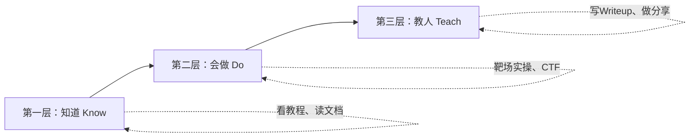
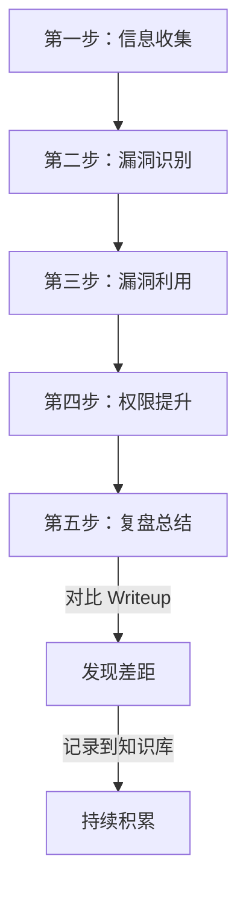
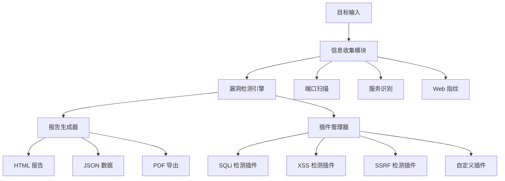
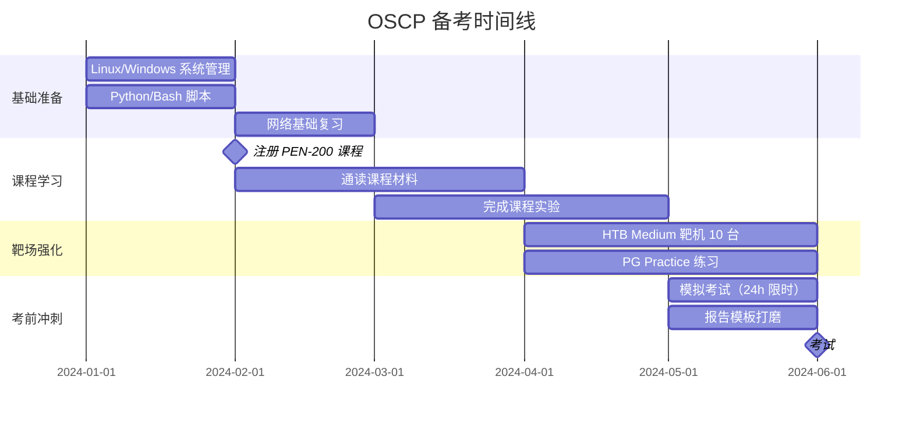
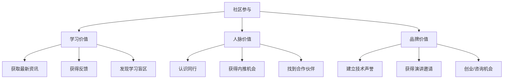

# 信息安全从业者的练习方法论

> 练习不是重复，而是在不舒适区中持续校准。—— 安德斯·艾利克森《刻意练习》

信息安全是一个极度依赖实操能力的领域。你可以在书本上理解 SQL 注入的原理，但只有当你亲手在真实环境中构造出 Payload、绕过 WAF、拿到数据库权限时，你才算真正掌握了它。本章将系统性地介绍如何从零开始，通过科学的练习方法，将安全知识转化为可验证的职业能力。

## 一、刻意练习：安全技能提升的底层逻辑

### 1.1 为什么"多做"不等于"多练"

很多安全初学者存在一个误区：以为只要花足够多的时间刷题、看教程，技能就会自然提升。但研究显示，单纯的重复并不能带来能力的质变。心理学家安德斯·艾利克森（Anders Ericsson）提出的"刻意练习"（Deliberate Practice）理论指出，有效的练习必须满足四个条件：

```mermaid
graph TD
    A[刻意练习四要素] --> B[明确的改进目标]
    A --> C[专注且超出舒适区]
    A --> D[即时反馈]
    A --> E[大量重复与修正]
    B --> F[不是"做更多题"]
    C --> F
    D --> F
    E --> F
```

| 要素 | 安全领域的具体体现 | 错误做法 |
|------|-------------------|----------|
| **明确目标** | "本周掌握 SQL 注入绕过 WAF 的 5 种编码技巧" | "多学点 Web 安全" |
| **超出舒适区** | 从 Easy 靶机升级到 Medium，挑战不熟悉的漏洞类型 | 反复做已经会的题目获取成就感 |
| **即时反馈** | 对比官方 Writeup，分析自己的盲区 | 做完不复盘，不看别人的解法 |
| **重复修正** | 同一类型的漏洞反复练习，每次都尝试不同的利用方式 | 做过一遍就跳过，追求"量"而非"质" |

### 1.2 费曼技巧在安全学习中的应用

理查德·费曼的学习方法核心是"用简单的语言解释复杂概念"。在安全领域，这意味着：

**操作步骤：**

1. **选择一个知识点**（例如：CSRF 攻击原理）
2. **尝试用非技术语言解释**：想象你在向一个不懂安全的朋友解释为什么他的账号会被盗
3. **发现知识盲区**：如果解释不清楚，说明你对某个环节理解不够
4. **回去补全，再次解释**：直到能流畅、准确地讲清楚
5. **写成技术文章或做分享**：将输出成果固化

这个方法的威力在于：如果你无法向他人解释一个漏洞为什么存在、如何利用、如何修复，那么你在真实渗透测试中也很难灵活运用它。

### 1.3 练习的三个层次



- **知道（Know）**：理解概念、原理、术语。这是最低层次，但也是基础。很多人停留在这一层，觉得自己"懂了"却做不出来。
- **会做（Do）**：能在实际环境中独立完成任务。这需要大量的动手练习。
- **教人（Teach）**：能向他人传授知识，并能根据不同受众调整表达方式。达到这一层，说明你真正内化了知识。

## 二、靶场练习：从入门到精通的系统化路径

### 2.1 靶场平台深度对比

| 平台 | 难度 | 适合阶段 | 费用 | 特点 | 学习模式 |
|------|------|---------|------|------|---------|
| **TryHackMe** | ★☆☆～★★★ | 入门～中级 | 免费/付费 | 引导式路径，内置学习模块 | 任务制，有提示 |
| **Hack The Box** | ★★☆～★★★★★ | 中级～高级 | 免费/付费 | 高质量靶机，社区活跃 | 独立渗透 |
| **VulnHub** | ★★☆～★★★★ | 中级 | 完全免费 | 可下载离线练习，无平台依赖 | 独立渗透 |
| **PentesterLab** | ★★☆～★★★★ | 中级 | 付费 | 专注 Web 安全，质量极高 | 任务制 |
| **PortSwigger Academy** | ★☆☆～★★★★ | 入门～高级 | 免费 | Burp Suite 官方教学，Web 安全最全 | 实验室制 |
| **OverTheWire** | ★★☆～★★★ | 入门～中级 | 免费 | Linux 和网络基础，命令行导向 | 关卡制 |
| **CTFtime** | ★★★～★★★★★ | 中级～高级 | 免费 | CTF 比赛聚合平台 | 竞赛制 |
| **picoCTF** | ★☆☆～★★★ | 入门～中级 | 免费 | 卡内基梅隆大学出品，适合初学者 | 关卡制 |
| **Root Me** | ★★☆～★★★★ | 中级 | 免费 | 法国平台，题目种类丰富 | 独立渗透 |

### 2.2 分阶段练习计划

#### 入门阶段（第 1-3 个月）：建立基础

**目标：** 能独立完成 Easy 难度靶机，掌握基本工具链。

**每周安排（10-12 小时）：**

| 时间 | 内容 | 具体任务 |
|------|------|---------|
| 周一 2h | 理论学习 | 学习一个漏洞类型（SQLi/XSS/文件包含等） |
| 周二 2h | PortSwigger Lab | 完成对应漏洞类型的 2-3 个实验室 |
| 周三 2h | TryHackMe | 完成一个引导式房间 |
| 周四 2h | 靶机练习 | 完成 1 台 Easy 靶机 |
| 周六 4h | 复盘总结 | 写 Writeup，回顾本周学习 |

**工具掌握清单（入门级）：**

```bash
# 信息收集
nmap -sC -sV -oA target_scan <target_ip>    # 端口和服务扫描
gobuster dir -u http://<target> -w /usr/share/wordlists/dirb/common.txt  # 目录爆破
nikto -h http://<target>                       # Web 漏洞扫描

# 漏洞利用
sqlmap -u "http://<target>/page?id=1" --dbs   # SQL 注入自动化
hydra -l admin -P /usr/share/wordlists/rockyou.txt <target> ssh  # 暴力破解

# 后渗透
find / -perm -4000 2>/dev/null                 # 查找 SUID 文件
cat /etc/crontab                               # 检查定时任务
```

**入门阶段里程碑：**

- [ ] 完成 TryHackMe 的 "Complete Beginner" 学习路径
- [ ] 完成 PortSwigger Academy 的 Top 10 漏洞实验室
- [ ] 独立完成 5 台 Easy 难度靶机并写出 Writeup
- [ ] 掌握 Nmap、Burp Suite、SQLMap 的基本使用

#### 中级阶段（第 4-9 个月）：技能深化

**目标：** 能独立完成 Medium 难度靶机，开始参加 CTF 比赛。

**每周安排（15-18 小时）：**

| 时间 | 内容 | 具体任务 |
|------|------|---------|
| 周一 2h | 内网渗透学习 | 学习代理转发、横向移动技术 |
| 周二 3h | 代码审计 | 审计一个小型开源项目的特定模块 |
| 周三 3h | HTB 靶机 | 完成 1 台 Medium 靶机 |
| 周四 2h | 工具开发 | 用 Python 编写安全工具 |
| 周五 2h | 漏洞复现 | 复现一个 CVE 漏洞 |
| 周六 4h | CTF 练习 | 参加 CTF 比赛或刷题 |
| 周日 2h | 复盘总结 | 写 Writeup，整理笔记 |

**中级核心技能：**

**1. 内网渗透基础**

```bash
# 代理搭建（以 Chisel 为例）
# 攻击机
./chisel server --reverse --port 8080
# 目标机
./chisel client <attacker_ip>:8080 R:socks

# 横向移动 - Pass the Hash
psexec.py -hashes aad3b435b51404eeaad3b435b51404ee:<ntlm_hash> <domain>/<user>@<target>

# Kerberoasting
impacket-GetUserSPNs <domain>/<user>:<password> -request
```

**2. 代码审计入门**

```python
# 代码审计检查清单（Python Web 应用）
AUDIT_CHECKLIST = {
    "注入类": [
        "SQL 注入：检查字符串拼接的 SQL 语句",
        "命令注入：检查 os.system()、subprocess.call() 等",
        "XSS：检查未转义的模板变量",
    ],
    "认证类": [
        "硬编码密钥/密码",
        "弱密码哈希算法（MD5/SHA1）",
        "Session 固定攻击",
    ],
    "文件操作": [
        "任意文件读取（open() 未校验路径）",
        "任意文件上传（未校验文件类型和内容）",
        "路径穿越（../）",
    ],
    "配置类": [
        "DEBUG=True 生产环境",
        "默认密码/弱密码",
        "CORS 配置过于宽松",
    ],
}
```

**中级阶段里程碑：**

- [ ] 独立完成 10 台 Medium 难度 HTB 靶机
- [ ] 参加至少 3 场 CTF 比赛（含校级以上）
- [ ] 复现 5 个真实 CVE 漏洞
- [ ] 开发 1 个有实用价值的安全工具并开源
- [ ] 掌握 Burp Suite 的高级功能（Intruder、Macros、Sequencer）

#### 高级阶段（第 10-18 个月）：专业方向

**目标：** 能挑战 Hard 靶机，开始独立漏洞研究。

**每周安排（20-25 小时）：**

| 时间 | 内容 | 具体任务 |
|------|------|---------|
| 工作日每天 2h | 漏洞研究 | 阅读漏洞分析报告，研究新漏洞 |
| 周三 3h | 高难度靶机 | 挑战 Hard/Insane 难度 |
| 周六 6h | Bug Bounty | 在合法平台挖掘漏洞 |
| 周日 4h | 技术输出 | 写博客、做分享、指导新人 |

**高级核心技能：**

**1. 二进制漏洞挖掘入门**

```c
// 常见的二进制漏洞模式
// 1. 栈溢出
void vulnerable_function() {
    char buffer[64];
    gets(buffer);  // 危险：无边界检查
}

// 2. 堆溢出
void heap_vulnerability() {
    char *p = malloc(64);
    strcpy(p, user_input);  // 如果 user_input > 64 字节，堆溢出
}

// 3. 格式化字符串
void format_string_vuln(char *user_input) {
    printf(user_input);  // 危险：应使用 printf("%s", user_input)
}
```

**2. 自动化漏洞挖掘工具链**

```python
# 使用 Python 构建自动化 Fuzzer
import requests
import random
import string

class WebFuzzer:
    def __init__(self, target_url):
        self.target = target_url
        self.results = []
    
    def generate_payloads(self, vuln_type):
        """生成测试 Payload"""
        payloads = {
            "sqli": ["' OR 1=1--", "1' UNION SELECT null--", "' AND SLEEP(5)--"],
            "xss": ["<script>alert(1)</script>", "", "javascript:alert(1)"],
            "lfi": ["../../../etc/passwd", "....//....//etc/passwd", "/etc/passwd%00"],
            "ssti": ["{{7*7}}", "${7*7}", "<%= 7*7 %>"],
        }
        return payloads.get(vuln_type, [])
    
    def fuzz_parameter(self, param, vuln_type):
        """对指定参数进行 Fuzz"""
        for payload in self.generate_payloads(vuln_type):
            try:
                resp = requests.get(
                    self.target,
                    params={param: payload},
                    timeout=10
                )
                if self.detect_vulnerability(resp, vuln_type, payload):
                    self.results.append({
                        "param": param,
                        "payload": payload,
                        "status": resp.status_code
                    })
            except requests.Timeout:
                # 超时可能意味着时间盲注成功
                if "SLEEP" in payload:
                    self.results.append({
                        "param": param,
                        "payload": payload,
                        "type": "time-based-sqli"
                    })
    
    def detect_vulnerability(self, response, vuln_type, payload):
        """检测响应中是否存在漏洞特征"""
        if vuln_type == "sqli":
            return "sql" in response.text.lower() or "mysql" in response.text.lower()
        elif vuln_type == "xss":
            return payload in response.text
        elif vuln_type == "lfi":
            return "root:" in response.text
        return False
```

**高级阶段里程碑：**

- [ ] 完成 OSCP 认证或同等水平的靶场挑战
- [ ] 在 Bug Bounty 平台获得至少 1 个有效漏洞赏金
- [ ] 发表至少 1 篇原创漏洞研究报告
- [ ] 在安全会议上做技术分享
- [ ] 掌握至少一个专业方向的深度技能（Web/二进制/内网/云安全）

### 2.3 高效靶机练习的五步法

每完成一台靶机，都应该遵循以下流程，而不是打完 root 就走人：



**复盘模板（每台靶机必填）：**

```markdown
# HTB - 靶机名称
**难度**：Easy/Medium/Hard
**日期**：2024-XX-XX
**用时**：X 小时 X 分钟

## 信息收集
- 开放端口：
- 服务版本：
- 发现的子域名/目录：

## 漏洞利用
- 漏洞类型：
- 利用方法：
- 关键 Payload：

## 权限提升
- 提权方法：
- 关键命令：

## 学到了什么
- 新知识点：
- 之前不知道的技巧：
- 下次需要注意的地方：

## 如果重新做，我会...
- （这个靶机有哪些地方可以做得更好？）
```

## 三、代码审计练习：从黑盒到白盒的系统训练

### 3.1 代码审计练习环境

| 环境 | 语言 | 特点 | 部署方式 |
|------|------|------|---------|
| **DVWA** | PHP | 经典 Web 漏洞，可调难度 | Docker 一键部署 |
| **WebGoat** | Java | OWASP 官方，覆盖全面 | Docker / JAR |
| **Juice Shop** | TypeScript | 现代 Web 应用，100+ 挑战 | Docker 一键部署 |
| **Damn Vulnerable Node App** | Node.js | 专注 Node.js 安全 | Docker |
| **RailsGoat** | Ruby | Rails 应用安全 | Docker |
| **PyGoat** | Python/Django | Python Web 安全 | Docker |
| **真实开源项目** | 各种 | 真实代码，贴近生产 | 源码审计 |

### 3.2 代码审计四步法

**第一步：架构理解（30 分钟）**

在开始审计之前，先花时间理解项目的整体架构：

```bash
# 项目结构总览
tree -L 2 -d src/

# 识别入口点
grep -rn "app.get\|app.post\|@app.route\|@RequestMapping" src/

# 识别数据库操作
grep -rn "execute\|query\|raw_sql\|SQL" src/

# 识别文件操作
grep -rn "open(\|readFile\|writeFile\|fs\." src/

# 识别外部命令调用
grep -rn "os.system\|subprocess\|exec(\|eval(" src/
```

**第二步：入口点追踪（1-2 小时）**

从用户输入点开始，追踪数据流向：

```python
# 审计追踪方法
"""
用户输入点（Source）：
- HTTP 请求参数（GET/POST/Cookie/Header）
- 文件上传
- WebSocket 消息
- API 调用

危险函数（Sink）：
- SQL 执行：execute(), query()
- 命令执行：system(), exec(), eval()
- 文件操作：open(), readFile()
- 模板渲染：render(), template()
- 响应输出：response.write(), echo

审计核心问题：
数据从 Source 到 Sink 的过程中，是否经过了充分的验证和过滤？
"""
```

**第三步：模式匹配审计（2-3 小时）**

按漏洞类型逐一检查：

```python
# Python 项目审计重点

# 1. SQL 注入
# 危险模式：
query = f"SELECT * FROM users WHERE id = {user_id}"  # f-string 拼接
query = "SELECT * FROM users WHERE id = " + user_id  # 字符串拼接
# 安全模式：
cursor.execute("SELECT * FROM users WHERE id = %s", (user_id,))

# 2. 命令注入
# 危险模式：
os.system(f"ping {host}")
subprocess.call(f"nslookup {domain}", shell=True)
# 安全模式：
subprocess.run(["ping", "-c", "4", host], capture_output=True)

# 3. 路径穿越
# 危险模式：
file_path = os.path.join(upload_dir, filename)
# 安全模式：
file_path = os.path.realpath(os.path.join(upload_dir, filename))
if not file_path.startswith(os.path.realpath(upload_dir)):
    raise ValueError("Invalid filename")

# 4. 反序列化
# 危险模式：
data = pickle.loads(user_data)  # 任意代码执行
# 安全模式：
data = json.loads(user_data)
```

**第四步：编写审计报告（1 小时）**

```markdown
# 代码审计报告 - 项目名称

## 审计范围
- 项目版本：v1.2.3
- 审计模块：用户认证、文件上传、数据查询
- 审计时间：2024-XX-XX
- 审计工具：grep, semgrep, Bandit

## 发现的漏洞

### 高危：SQL 注入（用户搜索功能）
- 文件：src/routes/search.py:42
- 描述：搜索参数直接拼接到 SQL 语句
- 攻击向量：`?q=' UNION SELECT username,password FROM users--`
- 修复建议：使用参数化查询

### 中危：任意文件读取
- 文件：src/routes/download.py:18
- 描述：文件名未校验路径穿越
- 攻击向量：`?file=../../../etc/passwd`
- 修复建议：校验路径前缀

## 总体评价
- 代码质量：中等
- 安全意识：偏低，多处输入未验证
- 优先修复建议：SQL 注入 > 文件读取 > 其他
```

## 四、安全工具开发练习

### 4.1 从零到一的工具开发路径

安全工具开发是区分"脚本小子"和"安全工程师"的关键能力。不要一上来就想做一个"万能扫描器"，而是从解决自己的小痛点开始。

**渐进式开发路线：**

| 阶段 | 项目 | 技术栈 | 学到的能力 |
|------|------|--------|-----------|
| 入门 | 端口扫描器 | Python + socket | 网络编程基础、多线程 |
| 初级 | 子域名枚举器 | Python + DNS 库 | DNS 协议、异步编程 |
| 中级 | Web 漏洞扫描器 | Python + requests | HTTP 协议、漏洞检测逻辑 |
| 高级 | 自动化渗透框架 | Python + 数据库 | 架构设计、插件系统 |
| 专家 | 漏洞利用框架 | Python/C + 网络 | 协议栈、底层编程 |

### 4.2 实战项目：编写端口扫描器

```python
#!/usr/bin/env python3
"""
端口扫描器 - 学习网络编程的第一个项目
涵盖：socket 编程、多线程、服务识别
"""

import socket
import threading
from queue import Queue
from datetime import datetime

class PortScanner:
    def __init__(self, target, ports, threads=100):
        self.target = target
        self.ports = ports
        self.threads = threads
        self.queue = Queue()
        self.open_ports = []
        self.lock = threading.Lock()
    
    def scan_port(self, port):
        """扫描单个端口"""
        try:
            sock = socket.socket(socket.AF_INET, socket.SOCK_STREAM)
            sock.settimeout(1.5)
            result = sock.connect_ex((self.target, port))
            if result == 0:
                # 尝试获取服务 banner
                try:
                    sock.send(b"HEAD / HTTP/1.1\r\n\r\n")
                    banner = sock.recv(1024).decode().strip()
                except:
                    banner = ""
                with self.lock:
                    self.open_ports.append((port, banner))
            sock.close()
        except:
            pass
    
    def worker(self):
        """工作线程"""
        while not self.queue.empty():
            port = self.queue.get()
            self.scan_port(port)
            self.queue.task_done()
    
    def run(self):
        """执行扫描"""
        print(f"[*] 扫描目标: {self.target}")
        print(f"[*] 扫描端口: {len(self.ports)} 个")
        print(f"[*] 线程数: {self.threads}")
        start = datetime.now()
        
        # 将端口加入队列
        for port in self.ports:
            self.queue.put(port)
        
        # 启动工作线程
        threads = []
        for _ in range(min(self.threads, len(self.ports))):
            t = threading.Thread(target=self.worker)
            t.daemon = True
            t.start()
            threads.append(t)
        
        # 等待完成
        self.queue.join()
        
        # 输出结果
        duration = (datetime.now() - start).total_seconds()
        print(f"\n[+] 扫描完成，耗时 {duration:.2f} 秒")
        print(f"[+] 发现 {len(self.open_ports)} 个开放端口:\n")
        
        for port, banner in sorted(self.open_ports):
            service = self.guess_service(port)
            print(f"  {port:<6} {service:<15} {banner[:50]}")
    
    def guess_service(self, port):
        """根据端口号猜测服务"""
        common_ports = {
            21: "FTP", 22: "SSH", 23: "Telnet", 25: "SMTP",
            53: "DNS", 80: "HTTP", 110: "POP3", 143: "IMAP",
            443: "HTTPS", 445: "SMB", 3306: "MySQL", 3389: "RDP",
            5432: "PostgreSQL", 6379: "Redis", 8080: "HTTP-Proxy",
        }
        return common_ports.get(port, "Unknown")

if __name__ == "__main__":
    import sys
    target = sys.argv[1] if len(sys.argv) > 1 else "127.0.0.1"
    ports = range(1, 1025)
    scanner = PortScanner(target, ports, threads=200)
    scanner.run()
```

### 4.3 工具开发的进阶方向

当你掌握了基础工具开发后，可以向以下方向深入：

**方向一：漏洞扫描器**

核心模块设计：



**方向二：安全自动化框架**

```python
# 安全自动化框架的核心抽象
class SecurityTask:
    """安全任务基类"""
    def __init__(self, target):
        self.target = target
        self.results = []
    
    def run(self):
        raise NotImplementedError
    
    def report(self):
        raise NotImplementedError

class ReconTask(SecurityTask):
    """信息收集任务"""
    def run(self):
        self.results.extend(self.port_scan())
        self.results.extend(self.subdomain_enum())
        self.results.extend(self.tech_detect())
        return self.results

class VulnScanTask(SecurityTask):
    """漏洞扫描任务"""
    def run(self):
        for plugin in self.load_plugins():
            result = plugin.scan(self.target)
            if result:
                self.results.append(result)
        return self.results
```

## 五、CTF 练习与竞赛

### 5.1 CTF 题目类型与对应能力

| 类型 | 英文 | 考察能力 | 推荐入门平台 |
|------|------|---------|-------------|
| **Web 安全** | Web | HTTP 协议、Web 漏洞利用 | PortSwigger, CTFHub |
| **密码学** | Crypto | 数学基础、密码算法分析 | CryptoHack |
| **逆向工程** | Reverse | 汇编语言、程序分析 | Reversing.Kr |
| **二进制漏洞利用** | Pwn | 内存管理、漏洞利用技术 | ROP Emporium |
| **杂项** | Misc | 综合能力、信息收集 | 各类 CTF 比赛 |
| **取证** | Forensics | 流量分析、磁盘取证 | 各类 CTF 比赛 |

### 5.2 CTF 备赛计划

**日常练习（每周 10 小时）：**

```python
# CTF 练习跟踪脚本（简化版）
import json
from datetime import datetime

def log_practice(challenge_name, category, difficulty, solved, notes=""):
    """记录每次练习"""
    entry = {
        "date": datetime.now().strftime("%Y-%m-%d"),
        "challenge": challenge_name,
        "category": category,
        "difficulty": difficulty,
        "solved": solved,
        "notes": notes,
        "time_spent": "",  # 手动填写
    }
    
    # 统计分析
    with open("ctf_log.json", "a") as f:
        f.write(json.dumps(entry) + "\n")
    
    print(f"[{'✓' if solved else '✗'}] {challenge_name} ({category}, {difficulty})")
    if not solved:
        print(f"    学习点: {notes}")

# 使用示例
log_practice("SQL Injection Login", "Web", "Easy", True)
log_practice("RSA Beginner", "Crypto", "Medium", False, "需要学习模逆运算")
```

**赛前冲刺（比赛前 2 周）：**

1. **每天 1 道综合题**：不限类型，模拟比赛环境
2. **限时练习**：每题 30-60 分钟，超时看 Writeup
3. **团队配合**：如果是团队赛，练习分工协作
4. **工具准备**：确保本地环境、脚本库、字典都就绪

### 5.3 CTF 的职业价值

CTF 不仅是练习手段，更是职业发展的加速器：

- **简历亮点**：CTF 排名和获奖记录是安全岗位的加分项
- **技能证明**：比赛成绩直接证明实战能力
- **人脉积累**：在比赛中认识志同道合的安全从业者
- **思维训练**：CTF 培养的解题思维直接适用于真实渗透测试
- **面试话题**：CTF 经历是技术面试中的优质谈资

## 六、认证考试准备的实战策略

### 6.1 OSCP：渗透测试的黄金认证

OSCP（Offensive Security Certified Professional）是安全行业公认含金量最高的实战认证之一。考试要求在 24 小时内完成对 5 台靶机的渗透测试，并在 24 小时内提交报告。

**详细备考路线（以 6 个月为周期）：**



**OSCP 考试关键技巧：**

1. **得分策略**：考试共 100 分，70 分及格。5 台靶机的分值不同，先攻容易拿分的
2. **自动化信息收集**：提前写好 Nmap 扫描脚本，节省时间
3. **报告是命**：渗透成功但报告写不清楚一样挂科
4. **缓冲区溢出必拿分**：Buffer Overflow 题目是固定套路，必须拿到
5. **注意休息**：24 小时考试需要合理分配体力，建议睡 3-4 小时

**OSCP 报告模板核心结构：**

```markdown
# OSCP 考试报告

## 目标概览
| 目标 | IP | 操作系统 | 分值 | 状态 |
|------|-----|---------|------|------|
| Target 1 | 10.x.x.1 | Windows | 20 | ✓ |
| Target 2 | 10.x.x.2 | Linux | 20 | ✓ |
| ... | ... | ... | ... | ... |

## Target 1 - [靶机名]

### 信息收集
（Nmap 扫描结果、Web 目录枚举结果）

### 漏洞发现
（发现了什么漏洞、如何发现的）

### 漏洞利用
（具体的利用步骤、Payload、截图）

### 权限提升
（提权方法、关键命令、截图）

### proof.txt
（包含 proof 文件内容和 ifconfig 截图）
```

### 6.2 CISSP：安全管理的顶级认证

CISSP 不是技术认证，而是管理认证。它考察的是你对信息安全全貌的理解，适合 5 年以上经验、向管理方向发展的从业者。

**八大领域备考重点：**

| 领域 | 占比 | 核心考点 | 学习建议 |
|------|------|---------|---------|
| 安全与风险管理 | 15% | CIA 三要素、风险评估、合规框架 | 理解概念之间的关系 |
| 资产安全 | 10% | 数据分类、生命周期、隐私保护 | 结合实际案例理解 |
| 安全架构与工程 | 13% | 安全模型、密码学、可信计算 | 重点理解安全模型 |
| 通信与网络安全 | 13% | 网络协议、加密通信、无线安全 | 技术细节要记牢 |
| 身份与访问管理 | 13% | IAM、SSO、Federation | 理解各种认证机制 |
| 安全评估与测试 | 12% | 渗透测试、审计、漏洞评估 | 区分各种测试方法 |
| 安全运营 | 13% | 事件响应、BCP/DRP、日志管理 | 场景题重点 |
| 软件开发安全 | 11% | SDLC、OWASP、安全编码 | 了解开发安全流程 |

**CISSP 学习资源推荐：**

- **官方教材**：(ISC)² CISSP Official Study Guide
- **辅助教材**：CISSP All-in-One Exam Guide (Shon Harris)
- **题库**：Boson CISSP Practice Exams
- **社区**：r/cissp (Reddit)
- **备考周期**：每天 2 小时，持续 3-4 个月

### 6.3 国内认证：CISP 系列

**CISP（注册信息安全专业人员）：**

- 考试形式：100 道选择题，70 分及格
- 备考周期：1-2 个月（需参加授权培训机构的课程）
- 适合人群：需要资质认证的安全从业者（投标、合规需求）
- 备考重点：背诵官方教材，做模拟题

**CISP-PTE（注册渗透测试工程师）：**

- 考试形式：实操题，包含 Web 渗透和代码审计
- 备考周期：2-3 个月
- 适合人群：渗透测试方向从业者
- 备考重点：大量实操练习，熟悉常见 Web 漏洞利用

## 七、漏洞赏金（Bug Bounty）实战

### 7.1 Bug Bounty 入门指南

漏洞赏金是在合法框架下发现并报告漏洞获取报酬的方式。这是安全从业者积累实战经验、建立技术声誉的最佳途径之一。

**主流平台对比：**

| 平台 | 特点 | 赏金范围 | 适合人群 |
|------|------|---------|---------|
| **HackerOne** | 最大的平台，项目最多 | $150 - $100,000+ | 各水平 |
| **Bugcrowd** | 企业客户多，项目质量高 | $100 - $50,000+ | 中级以上 |
| **补天** | 国内最大，中文界面 | ¥100 - ¥50,000+ | 国内从业者 |
| **漏洞盒子** | 国内平台，企业合作多 | ¥100 - ¥30,000+ | 国内从业者 |
| **Intigriti** | 欧洲平台，竞争较小 | €100 - €20,000+ | 中级 |

### 7.2 Bug Bounty 猎人的一天

```text
08:00 - 09:00  阅读安全资讯、新漏洞公告、CVE 更新
09:00 - 10:00  信息收集：对目标进行子域名枚举、端口扫描
10:00 - 12:00  攻击面分析：识别新功能、API 端点、参数
12:00 - 13:00  午餐休息
13:00 - 15:00  漏洞测试：对可疑端点进行深入测试
15:00 - 17:00  漏洞验证：确认漏洞可复现，编写报告
17:00 - 18:00  提交报告、回复平台反馈、学习新技巧
```

### 7.3 高效挖掘漏洞的策略

**策略一：关注新功能**

新上线的功能往往测试不充分，是漏洞的高发区。关注目标的更新日志、Changelog、版本发布。

**策略二：攻击 API**

API 通常比 Web 界面更容易出现逻辑漏洞：

```python
# API 安全测试清单
api_test_cases = {
    "认证绕过": [
        "移除 Authorization Header",
        "使用其他用户的 Token",
        "JWT 算法改为 none",
        "JWT 密钥爆破",
    ],
    "授权绕过": [
        "普通用户访问管理员 API",
        "修改 URL 中的用户 ID（IDOR）",
        "修改请求体中的用户 ID",
        "HTTP 方法切换（GET → POST → PUT → DELETE）",
    ],
    "输入验证": [
        "SQL 注入（所有参数）",
        "NoSQL 注入（MongoDB 操作符）",
        "批量赋值（Mass Assignment）",
        "特殊字符注入",
    ],
    "业务逻辑": [
        "竞态条件（Race Condition）",
        "价格篡改",
        "数量为负数",
        "优惠券重复使用",
    ],
}
```

**策略三：深入信息收集**

```bash
# 子域名枚举（多工具交叉验证）
subfinder -d target.com -o subfinder.txt
amass enum -d target.com -o amass.txt
assetfinder --subs-only target.com > assetfinder.txt
cat subfinder.txt amass.txt assetfinder.txt | sort -u > all_subdomains.txt

# 探活
httpx -l all_subdomains.txt -o alive.txt

# 参数发现
arjun -u https://target.com/api/endpoint

# 历史 URL（Wayback Machine）
gau target.com | sort -u > urls.txt
cat urls.txt | grep "=" | tee params.txt
```

### 7.4 Bug Bounty 报告模板

```markdown
# 标题：[漏洞类型] 在 [端点] 通过 [方法] 实现 [影响]

## 摘要
一句话描述漏洞和影响。

## 漏洞详情
- **类型**：如 IDOR / XSS / SSRF
- **严重性**：Critical / High / Medium / Low
- **端点**：POST /api/v1/users/{id}/profile
- **参数**：id

## 复现步骤
1. 使用普通用户 A 登录
2. 访问 `GET /api/v1/users/123/profile`，获取自己的信息
3. 修改 id 为其他用户：`GET /api/v1/users/456/profile`
4. 响应返回了用户 456 的敏感信息（邮箱、手机号、地址）

## 影响评估
攻击者可以枚举所有用户 ID，获取任意用户的个人信息，可能导致大规模数据泄露。

## 修复建议
在 API 端点中验证当前用户只能访问自己的资源：
```python
if request.user.id != target_user_id:
    return Response(status=403)
```text

## 附加信息
- 测试账号：已提供
- 浏览器：Chrome 120
- 时间：2024-XX-XX
```

## 八、社区参与与技术影响力

### 8.1 为什么要参与社区

安全行业是一个高度依赖人脉和声誉的行业。很多工作机会不是通过投简历获得的，而是通过社区中的人脉推荐。技术影响力不是虚荣指标，而是实实在在的职业资产。

**社区参与的三层价值：**



### 8.2 线上社区参与指南

**GitHub：**

- **关注项目**：Star 和 Watch 安全工具项目（nuclei、sqlmap、Metasploit）
- **参与贡献**：提交 Issue、修复 Bug、改进文档、翻译
- **建立项目**：将自己的工具和脚本开源
- **写好 README**：好的 README 是你项目的门面

**技术博客：**

- **平台选择**：个人博客（推荐，掌握所有权）、GitHub Pages、Medium、知乎专栏
- **内容方向**：CTF Writeup、漏洞分析、工具开发、学习笔记
- **写作频率**：每周 1 篇，质量优先于数量
- **SEO 技巧**：标题包含关键词，内容结构清晰

**推荐的安全社区和论坛：**

| 社区 | 语言 | 特点 | 适合人群 |
|------|------|------|---------|
| 先知社区 | 中文 | 阿里旗下，技术文章质量高 | 中级以上 |
| FreeBuf | 中文 | 综合安全媒体，资讯丰富 | 各水平 |
| 看雪论坛 | 中文 | 二进制安全为主，深度高 | 中级以上 |
| 安全客 | 中文 | 360 旗下，漏洞分析多 | 各水平 |
| T00ls | 中文 | 老牌安全论坛，实战性强 | 中级以上 |
| Reddit r/netsec | 英文 | 最大的安全社区之一 | 各水平 |
| Hacker News | 英文 | 技术综合，安全话题常见 | 各水平 |

### 8.3 线下活动参与

**国内安全会议：**

| 会议 | 频率 | 特点 | 参与方式 |
|------|------|------|---------|
| **KCon** | 年度 | 黑客大会，技术深度高 | 听众 / 演讲者 |
| **ISC** | 年度 | 互联网安全大会，规模大 | 听众 |
| **CSS** | 年度 | 安全峰会，厂商参与多 | 听众 |
| **XCon** | 年度 | 老牌安全会议 | 演讲者 / 听众 |
| **GeekCon** | 年度 | 极客嘉年华，IoT 安全 | 演讲者 / 听众 |

**国际安全会议：**

| 会议 | 特点 | 适合方向 |
|------|------|---------|
| **Black Hat** | 最顶级的安全会议 | 各方向 |
| **DEF CON** | 黑客文化浓厚，CTF 闻名 | 各方向 |
| **RSA Conference** | 偏企业安全 | 安全管理 |
| **BSides** | 社区驱动，门槛低 | 入门演讲 |

**演讲准备建议：**

1. **选题**：选择你真正深入研究过的主题，不要追求"高大上"
2. **结构**：问题 → 分析 → 方案 → 演示 → 总结
3. **Demo**：准备可工作的演示，但也要准备录屏作为备份
4. **练习**：至少完整排练 3 次，控制时间
5. **互动**：留出 Q&A 时间，准备常见问题的答案

## 九、求职准备的系统化练习

### 9.1 简历优化的安全行业特化

安全行业的简历不同于普通开发岗位，需要突出实战能力。

**简历结构建议：**

```markdown
# 姓名 - 目标岗位

## 技能清单
- 渗透测试：Web/内网/移动应用，熟悉 OWASP Top 10
- 工具链：Burp Suite, Nmap, Metasploit, Cobalt Strike, BloodHound
- 编程：Python (工具开发), Bash (自动化), SQL
- 证书：OSCP, CISP-PTE

## 项目经历
### [项目名称] - 渗透测试项目
- 目标：对 XX 系统进行安全评估
- 方法：信息收集 → 漏洞发现 → 利用验证 → 报告编写
- 成果：发现 X 个高危漏洞，X 个中危漏洞
- 影响：帮助客户避免了潜在的 XX 损失

## 安全研究
- CVE-XXXX-XXXXX：XX 应用 XX 漏洞（CVSS X.X）
- 博客：https://yourblog.com（XX 篇技术文章）
- GitHub：https://github.com/yourname（XX stars）

## CTF 成绩
- HTB 排名：Top X%
- CTFtime 排名：XX
- 获奖：XX 比赛 XX 名

## 教育和认证
- 学历
- OSCP / CISSP / CISP
```

### 9.2 面试模拟练习

**技术面试常见问题分类：**

| 类别 | 示例问题 | 考察重点 |
|------|---------|---------|
| **漏洞原理** | "解释一下 CSRF 攻击的原理和防御方法" | 理解深度 |
| **实战经验** | "描述一次你发现的最有价值的漏洞" | 实战能力 |
| **工具使用** | "Burp Suite 的 Intruder 和 Repeater 有什么区别" | 工具熟练度 |
| **应急响应** | "发现服务器被入侵，你的第一步做什么" | 思维和流程 |
| **代码审计** | "这段代码有什么安全问题"（给出代码片段） | 代码审计能力 |
| **场景题** | "给你一个目标，你会如何开始渗透测试" | 方法论 |

**模拟面试练习方法：**

1. **收集题目**：从 Glassdoor、牛客网、面试经验帖中收集
2. **准备答案**：每个问题准备 2-3 分钟的结构化回答
3. **录音回听**：录制自己的回答，检查逻辑是否清晰
4. **找人模拟**：找朋友或社区中的人互相面试
5. **复盘改进**：每次面试后记录问题和改进点

### 9.3 实战面试（渗透测试实操）

部分安全公司会安排实操面试，给你一个目标环境让你现场渗透。

**实操面试准备：**

```python
# 面试前检查清单
PRE_INTERVIEW_CHECKLIST = {
    "工具准备": [
        "Kali Linux 虚拟机（更新到最新）",
        "Burp Suite Professional（或 Community）",
        "常用字典和 Payload 文件",
        "自动化脚本（信息收集、扫描）",
        "VPN 连接配置（如果需要连接面试环境）",
    ],
    "知识准备": [
        "OWASP Top 10 每个漏洞的利用和修复",
        "常见提权方法（Linux/Windows）",
        "内网渗透基础（代理、横向移动）",
        "报告编写模板",
    ],
    "心态准备": [
        "不要慌张，遇到不会的很正常",
        "边做边说，让面试官了解你的思路",
        "时间有限，优先找容易利用的漏洞",
        "即使没拿到 shell，展示你的分析过程也很重要",
    ],
}
```

## 十、持续学习系统

### 10.1 构建个人知识管理系统

安全领域知识更新极快，没有系统化的知识管理，你会发现自己总是在"学了忘、忘了学"的循环中。

**推荐的知识管理架构：**

```text
安全知识库/
├── 01-基础知识/
│   ├── 网络协议/
│   ├── 操作系统/
│   └── 编程语言/
├── 02-漏洞类型/
│   ├── Web漏洞/
│   ├── 二进制漏洞/
│   └── 逻辑漏洞/
├── 03-工具笔记/
│   ├── Burp Suite/
│   ├── Nmap/
│   └── Metasploit/
├── 04-靶场Writeup/
│   ├── HTB/
│   ├── THM/
│   └── CTF/
├── 05-漏洞分析/
│   ├── CVE复现/
│   └── 原创研究/
└── 06-职业发展/
    ├── 认证备考/
    ├── 面试准备/
    └── 学习计划/
```

**工具推荐：**

| 工具 | 特点 | 适合场景 |
|------|------|---------|
| **Obsidian** | 本地 Markdown，双向链接 | 个人知识库 |
| **Notion** | 云端，协作功能强 | 团队协作 |
| **Logseq** | 本地优先，大纲式 | 日志式笔记 |
| **CherryTree** | 树状结构，支持加密 | 安全笔记（加密需求） |

### 10.2 学习资源跟踪

```python
# 个人学习资源追踪（简化概念）
LEARNING_PIPELINE = {
    "信息源": [
        "Twitter/X 安全研究人员（@tinchoabbate, @orange_8361 等）",
        "Reddit r/netsec, r/ReverseEngineering",
        "Hacker News",
        "安全客、先知社区 RSS",
        "CVE 官方公告",
    ],
    "消化方式": {
        "深度学习": "周末花 2-3 小时深入研究一个主题",
        "快速浏览": "每天 30 分钟浏览资讯，标记值得深入的",
        "实践验证": "对有价值的内容立即动手验证",
    },
    "输出固化": {
        "笔记": "Obsidian 中记录关键点",
        "博客": "将深度研究写成文章",
        "工具": "将实用脚本开源到 GitHub",
    },
}
```

### 10.3 每日/每周/每月学习框架

**每日（30-60 分钟）：**
- 浏览安全资讯（10 分钟）
- 完成 1 道 CTF 题目或靶场练习（30 分钟）
- 记录当日学习笔记（10 分钟）

**每周（5-10 小时）：**
- 完成 1 台靶机（Easy 或 Medium）
- 深入研究 1 个漏洞类型或技术
- 写 1 篇技术文章或 Writeup
- 回顾本周学习，调整下周计划

**每月（20-40 小时）：**
- 完成 1 个完整项目（工具开发 / 漏洞研究 / 靶场系列）
- 参加 1 场 CTF 比赛或社区活动
- 更新简历和作品集
- 反思学习效果，调整长期计划

### 10.4 防止学习疲劳的策略

安全学习是一个长期过程，防止倦怠比短期冲刺更重要。

**有效的防疲劳策略：**

1. **交替学习**：Web 安全和二进制交替，避免单一方向的疲劳
2. **设定里程碑**：每完成一个里程碑给自己一个奖励
3. **找到学习伙伴**：加入学习小组，互相督促
4. **输出带动输入**：写博客、做分享，用输出倒逼学习
5. **接受低谷期**：每个人都有不想学习的时候，允许自己休息
6. **保持运动**：身体健康是持续学习的基础

## 十一、练习中的常见陷阱与纠正

### 陷阱一：教程地狱（Tutorial Hell）

**症状**：一直在看教程、看视频，但不动手实践。总觉得"还没准备好"。

**纠正**：学完一个知识点后，立即在靶场中实践。教程只看一遍，然后自己动手。

### 陷阱二：工具依赖症

**症状**：只会用自动化工具跑扫描，不理解工具背后的原理。

**纠正**：每使用一个工具，都要理解它的工作原理。尝试自己用代码实现工具的核心功能。

### 陷阱三：追求难度虚荣

**症状**：只做最难的题目，觉得简单的题目"配不上自己"。

**纠正**：基础不牢，上层建筑必然不稳。Easy 题目做到 100% 正确率再升级。

### 陷阱四：孤军奋战

**症状**：一个人闷头学，不与任何人交流。

**纠正**：加入安全社区，找学习伙伴，定期做分享。安全行业的很多机会来自人脉。

### 陷阱五：只攻不守

**症状**：只学攻击技术，不学防御知识。

**纠正**：理解防御才能更好地攻击。了解 WAF 原理、IDS 规则、安全架构设计。

### 陷阱六：忽视报告能力

**症状**：能找到漏洞，但写不清楚报告。

**纠正**：每次练习都写完整的报告，即使是靶场练习。报告能力是区分业余和专业的关键指标。

***

> "练习的质量决定了你能走多远，而不是练习的数量。在信息安全这个领域，科学的练习方法比盲目地刷题重要一百倍。找到你的薄弱环节，制定明确的目标，持续输出成果——这就是从初学者到专家的唯一路径。"
