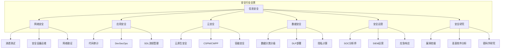
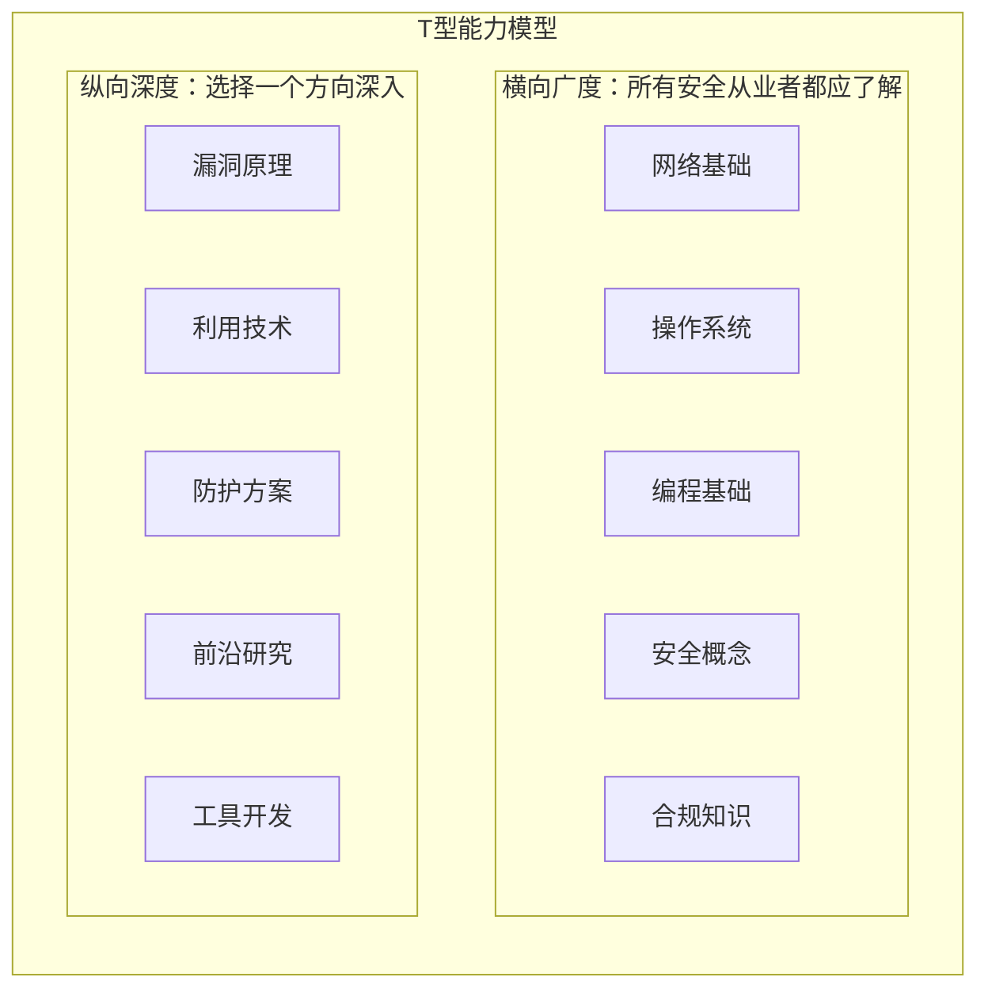
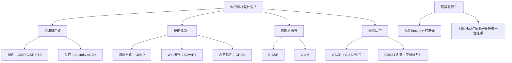

# 第四章小结：职业发展路径

本章从行业全景、职业方向、技能体系、认证规划、发展策略和实战案例六个维度，系统梳理了信息安全从业者的职业发展路径。作为全章的收束，本节将核心知识点重新组织为一张可操作的"职业发展全景图"，帮助你在回顾中建立全局认知，在反思中找到自己的定位。

## 一、行业全景认知：为什么安全是当下最值得投入的方向

### 1.1 行业驱动力

信息安全行业正处于前所未有的高速增长期，背后的驱动力不是单一因素，而是多重力量的叠加：

| 驱动力 | 具体表现 | 对从业者的意义 |
|--------|----------|----------------|
| 数字化转型 | 企业业务全面上云，攻击面指数级扩大 | 安全岗位从"可选"变为"刚需" |
| 合规压力 | 《数据安全法》《个人信息保护法》GDPR 等法规密集出台 | 合规审计、数据安全方向需求激增 |
| 安全事件 | 勒索软件年均增长超 150%，供应链攻击频发 | 应急响应、威胁情报方向持续扩张 |
| 新技术风险 | 云原生、IoT、AI/LLM 带来全新攻击面 | 新兴细分方向不断涌现 |
| 地缘政治 | 国际博弈推动自主可控和关键基础设施保护 | 国内安全厂商和岗位快速扩张 |

全球网络安全人才缺口超过 300 万（ISC² 2024 报告），中国市场缺口在百万级别。这意味着具备实战能力的安全人才始终处于供不应求的状态——但前提是你具备的是**真正的实战能力**，而非纸上谈兵。

### 1.2 六大细分领域深度对比

信息安全并非铁板一块，不同细分领域的工作内容、技能要求、薪资水平和发展天花板差异显著：



**各方向入门难度与薪资天花板对比：**

| 方向 | 入门难度 | 技术深度 | 管理天花板 | 3年薪资范围(国内) | 核心技能 |
|------|----------|----------|------------|-------------------|----------|
| 网络安全 | ★★★☆ | ★★★☆ | ★★★☆ | 15-35万 | 网络协议、渗透测试、安全设备 |
| 应用安全 | ★★★★ | ★★★★ | ★★★☆ | 20-40万 | 代码审计、SDL、安全开发 |
| 云安全 | ★★★★ | ★★★★ | ★★★★ | 25-50万 | 云平台架构、容器安全、IAM |
| 数据安全 | ★★★☆ | ★★★☆ | ★★★★★ | 20-45万 | 数据治理、隐私合规、密码学 |
| 安全运营 | ★★☆☆ | ★★★☆ | ★★★★ | 12-30万 | SIEM、应急响应、威胁分析 |
| 安全研究 | ★★★★★ | ★★★★★ | ★★☆☆ | 25-60万+ | 逆向工程、漏洞挖掘、编程 |

> **选择建议**：不要只看薪资天花板，更要关注自己的兴趣和优势。安全运营入门门槛最低，适合零基础起步；安全研究天花板最高但难度也最大，适合有深厚计算机基础的人。

## 二、职业方向全景：三条主线与无数分支

### 2.1 三条职业主线

信息安全的职业发展可以归纳为三条主线，每条主线的晋升逻辑和能力要求截然不同：

**技术深耕线（IC路线）：**

```text
初级工程师 → 中级工程师 → 高级工程师 → 技术专家/架构师 → 首席科学家/Fellow
   (0-2年)      (2-5年)      (5-8年)       (8-12年)          (12年+)
```

核心能力演变：工具使用 → 独立解决问题 → 方案设计 → 技术决策 → 行业影响力

**管理路线（Manager路线）：**

```text
技术骨干 → Team Lead → 安全经理 → 安全总监 → CSO/CISO
 (2-5年)    (3-6年)    (5-8年)    (8-12年)    (12年+)
```

核心能力演变：技术能力 → 项目管理 → 团队管理 → 战略规划 → 业务赋能

**独立路线（Entrepreneur路线）：**

```text
技术积累 → 个人品牌 → 独立顾问/培训师 → 安全创业 → 行业领袖
 (3-5年)    (5-8年)      (5-10年)         (8年+)     (10年+)
```

核心能力演变：技术深度 → 影响力 → 商业能力 → 团队建设 → 生态构建

### 2.2 核心岗位详解

| 岗位 | 核心职责 | 关键技能 | 典型日常 | 成长瓶颈 |
|------|----------|----------|----------|----------|
| 渗透测试工程师 | 模拟攻击，发现系统漏洞 | Web安全、内网渗透、漏洞利用、报告撰写 | 接到项目→信息收集→漏洞挖掘→报告输出 | 容易陷入"工具人"困境，需向安全研究或架构方向突破 |
| 安全研究员 | 研究新技术漏洞，发表研究成果 | 逆向工程、漏洞挖掘、Fuzzing、论文阅读 | 复现CVE→分析补丁→挖掘新漏洞→撰写PoC | 需要持续产出高质量成果，学术与工业的平衡 |
| 安全开发工程师 | 开发安全工具和平台 | Python/Go、安全工具链、DevOps | 需求分析→开发→测试→部署安全产品 | 容易被当成普通开发，需主动展示安全专业性 |
| 应急响应工程师 | 处理安全事件，溯源分析 | 取证分析、日志分析、恶意软件分析、沟通协调 | 告警处理→事件研判→溯源→复盘 | 7×24待命压力大，需注意burnout |
| 安全架构师 | 设计企业安全体系 | 架构设计、风险评估、安全标准、业务理解 | 方案设计→评审→落地→验证 | 需要深入理解业务，纯技术思维不够 |
| 安全总监/CSO | 制定安全战略，管理安全团队 | 战略规划、预算管理、团队建设、向上管理 | 会议→决策→汇报→资源协调 | 从技术到管理的思维转变是最大挑战 |

### 2.3 新兴方向前瞻

随着技术演进，以下方向正在快速崛起，值得关注：

- **AI安全工程师**：大模型安全评估、对抗攻击防御、AI供应链安全。随着LLM在企业中大规模部署，这个方向的需求正在爆发式增长。
- **汽车安全工程师**：智能网联汽车的V2X通信安全、车载系统渗透测试。随着智能汽车渗透率提升，这个垂直领域的人才极度稀缺。
- **供应链安全工程师**：SBOM管理、依赖审计、构建链安全。SolarWinds事件后，供应链安全成为企业关注焦点。
- **隐私工程师**：隐私计算方案设计、数据脱敏、合规自动化。GDPR和《个人信息保护法》催生了大量相关岗位。

## 三、技能体系：构建你的T型能力模型

### 3.1 T型人才模型

信息安全领域最受认可的能力模型是"T型人才"——横向广泛了解多个安全领域，纵向在一个方向做到精深。



### 3.2 分阶段技能路线图

**入门阶段（0-1年）—— 打基础：**

| 技能领域 | 具体内容 | 学习方式 | 验证标准 |
|----------|----------|----------|----------|
| 网络基础 | TCP/IP协议栈、HTTP/HTTPS、DNS、常见网络攻击 | 《计算机网络》+ Wireshark抓包 | 能独立分析PCAP文件 |
| Linux基础 | 命令行操作、权限管理、服务配置、日志分析 | 搭建Linux环境日常使用 | 能在纯命令行环境下完成系统管理 |
| 编程基础 | Python脚本编写、Bash脚本、正则表达式 | 自动化日常任务驱动学习 | 能编写自动化信息收集脚本 |
| Web安全基础 | OWASP Top 10、Burp Suite使用、SQL注入、XSS | DVWA/SQLi-labs靶场练习 | 能独立完成基础Web漏洞利用 |
| 安全工具 | Nmap、Burp Suite、Metasploit基础使用 | TryHackMe/HackTheBox | 能完成简单CTF挑战 |

**进阶阶段（1-3年）—— 建专长：**

| 技能领域 | 具体内容 | 学习方式 | 验证标准 |
|----------|----------|----------|----------|
| 漏洞深入 | 逻辑漏洞、权限绕过、反序列化、SSRF高级利用 | 真实SRC漏洞挖掘 | 累计提交5+有效漏洞 |
| 内网渗透 | 域渗透、横向移动、权限维持、隧道技术 | 内网靶场搭建练习 | 能完成完整内网渗透流程 |
| 代码审计 | Java/PHP/Python代码审计方法论 | 开源项目审计实践 | 能独立发现中危以上漏洞 |
| 工具开发 | 安全工具二次开发、自定义扫描器、漏洞利用框架 | 解决实际工作中的痛点 | 有可展示的开源工具或脚本 |
| 安全架构 | SDL流程、威胁建模、安全设计方案 | 参与企业安全项目 | 能输出安全架构方案文档 |

**高级阶段（3-5年）—— 树权威：**

| 技能领域 | 具体内容 | 学习方式 | 验证标准 |
|----------|----------|----------|----------|
| 漏洞研究 | 1-day/N-day分析、0-day挖掘、Fuzzing技术 | 深入研究特定软件/协议 | 有CVE编号或高质量研究成果 |
| 安全体系 | 企业安全体系设计、零信任架构、安全运营体系 | 主导企业安全项目 | 能设计完整的企业安全方案 |
| 行业影响力 | 技术分享、社区贡献、开源项目 | 持续输出高质量内容 | 在安全社区有一定知名度 |
| 业务理解 | 行业知识、商业模式、风险评估方法论 | 跨部门协作 | 能从业务视角评估安全风险 |

### 3.3 软技能：决定职业天花板的关键

技术能力决定你能否入门，软技能决定你能走多远。在信息安全领域，以下软技能至关重要：

**沟通能力**：安全从业者最大的挑战之一是让非技术人员理解安全风险。你需要学会用业务语言而非技术术语来描述问题。例如，不要说"存在SQL注入漏洞"，而要说"攻击者可以通过这个漏洞获取所有客户的个人信息，可能导致数据泄露事件和监管处罚"。

**文档能力**：渗透测试报告、安全评估报告、应急响应报告——安全工作产出的大量文档是你的"作品"。一份结构清晰、重点突出、有修复建议的报告，比一份流水账式的报告价值高出数倍。

**项目管理**：安全项目往往涉及多个团队，需要协调开发、运维、业务等多个部门。掌握基本的项目管理方法（如敏捷、Scrum）能显著提升工作效率。

**向上管理**：学会向管理层汇报安全工作，用ROI（投资回报率）的语言来争取安全预算。"投入100万可以将数据泄露风险降低80%"远比"我们需要购买这个安全产品"更有说服力。

## 四、认证体系：如何让证书真正为你服务

### 4.1 认证的正确定位

认证是职业发展的**辅助工具**，而非**核心竞争力**。它的价值在于：

1. **系统化学习路径**：好的认证提供结构化的知识框架，帮你避免知识盲区
2. **行业通行证**：部分岗位（尤其是甲方和咨询公司）有认证硬性要求
3. **薪资谈判筹码**：CISSP、OSCP等高含金量认证在薪资谈判中有实际作用
4. **知识验证**：通过备考过程检验自己的知识体系是否完整

但认证的局限同样明显：不等于实战能力、偏重理论（部分认证）、需要持续维护（CIPE、续费）、投入产出比需要评估。

### 4.2 认证选择决策树



### 4.3 高价值认证速查表

| 认证 | 难度 | 费用 | 有效期 | 适合人群 | 核心价值 |
|------|------|------|--------|----------|----------|
| CompTIA Security+ | ★★☆☆ | ~$400 | 3年 | 零基础入门者 | 国际通用入门证书，建立安全知识框架 |
| CEH | ★★★☆ | ~$1200 | 3年 | 渗透测试入门者 | 系统学习渗透测试方法论 |
| OSCP | ★★★★ | ~$1600 | 永久 | 渗透测试工程师 | 业界公认的实战能力证明 |
| CISSP | ★★★★ | ~$750 | 3年 | 安全管理者/架构师 | 管理层和甲方岗位的硬性要求 |
| CISP | ★★★☆ | ~8000元 | 3年 | 国内从业者 | 国内最权威的通用安全认证 |
| CISP-PTE | ★★★☆ | ~1万元 | 3年 | 国内渗透测试方向 | 国内渗透测试专项认证 |
| GXPN/OSED | ★★★★★ | ~$1600 | 永久 | 高级安全研究员 | 高级漏洞利用和逆向工程能力证明 |

### 4.4 认证备考实战建议

- **不要同时备考多个认证**：集中精力一次攻克一个，效率远高于分散精力
- **理论与实践结合**：不要只刷题，要在靶场中实践所学知识
- **加入备考社群**：Reddit、Discord上有很多认证备考群组，互相督促和答疑
- **设定明确的deadline**：给自己一个考试日期，倒逼学习进度
- **考证之后持续学习**：拿到证书只是起点，不是终点

## 五、职业发展策略：从规划到执行

### 5.1 自我评估框架

在规划职业路径之前，先用以下框架对自己进行诚实的评估：

**能力盘点四象限：**

|  | 熟练 | 不熟练 |
|--|------|--------|
| **感兴趣** | 核心优势区（持续深耕） | 潜力发展区（重点投入） |
| **不感兴趣** | 可靠支撑区（保持水平） | 风险回避区（了解即可） |

**实操步骤：**

1. 列出你掌握的所有安全技能（工具、技术、知识领域）
2. 对每个技能自评熟练度（1-5分）
3. 标记你对每个技能的兴趣程度（高/中/低）
4. 将技能填入四象限，识别你的核心优势和潜力方向

### 5.2 SMART目标设定法

模糊的目标无法执行。用SMART原则将职业目标转化为可执行的行动计划：

**反面示例：**
- "我要学好渗透测试" ← 模糊、不可衡量、无期限
- "我要拿到OSCP" ← 只有结果，没有过程

**正面示例：**
- "在6个月内，完成OSCP课程的全部实验，刷完HackTheBox的20台靶机，然后参加OSCP考试"
- "在3个月内，通过每天1小时的学习，掌握Python安全脚本编写，完成一个自动化信息收集工具"

### 5.3 技能提升的三种高效方法

**项目驱动学习**：不要为了学习而学习，而是为了解决真实问题而学习。想学Web安全？去挖SRC；想学内网渗透？自己搭靶场做完整攻防演练。项目驱动学习的知识留存率远高于纯理论学习。

**刻意练习**：不是简单地重复，而是针对薄弱环节进行有目的的训练。例如，如果你SQL注入很熟练但XXE不熟，就专门花一周时间集中练习XXE，从基础原理到各种绕过技巧。

**费曼学习法**：如果你不能用简单的语言向一个外行解释某个概念，说明你还没有真正理解它。尝试写技术博客、做技术分享、在社区回答问题——输出是最好的学习方式。

### 5.4 人脉建设：安全圈的社交资本

信息安全是一个高度依赖圈子的行业。很多好的工作机会、技术资源和行业信息都是通过人脉网络传递的。

**线上渠道：**
- **GitHub**：参与开源安全项目，贡献代码是建立技术声誉的最佳方式
- **Twitter/X**：关注安全研究者，参与技术讨论，分享自己的研究成果
- **安全社区**：FreeBuf、先知社区、看雪论坛、安全客等国内平台
- **Discord/Slack**：加入安全相关的群组，参与实时讨论

**线下渠道：**
- **安全会议**：KCon、XCON、补天白帽大会、看雪安全峰会
- **本地Meetup**：很多城市有安全爱好者定期聚会
- **CTF比赛**：参加CTF既是技术提升也是社交机会
- **企业安全活动**：各大厂商的安全开放日和技术沙龙

**人脉维护原则：**
- 先提供价值，再索取帮助
- 保持定期互动，不要只在需要帮忙时才联系
- 真诚待人，不夸大自己的能力
- 尊重他人的时间和隐私

## 六、实战案例复盘：从故事中提取规律

### 6.1 五种典型成长路径总结

本章详细介绍了五种典型的职业发展案例，以下是它们的共性规律：

| 路径 | 关键转折点 | 核心竞争力 | 最大挑战 | 可复制的经验 |
|------|------------|------------|----------|--------------|
| 零基础→渗透测试工程师 | 系统学习+社区参与 | 实战项目+开源工具 | 入门阶段的迷茫和自我怀疑 | 用项目证明能力，用社区获取机会 |
| 开发→安全架构师 | 抓住企业安全建设机会 | 开发背景+安全思维 | 从写代码到设计体系的思维转变 | 利用原有领域优势，找到交叉点 |
| 独立安全研究员 | 专注一个方向深耕 | 深度技术能力+行业影响力 | 收入不稳定和孤独感 | 用成果说话，建立个人品牌 |
| 运维→安全总监 | 从运维视角理解安全 | 全栈视角+管理能力 | 从技术到管理的角色转换 | 运维的全局视角是独特优势 |
| 金融→安全 | 领域知识+安全技能 | 行业理解+跨界能力 | 跨界的心理门槛和认证门槛 | 领域知识是不可替代的差异化优势 |

### 6.2 案例启示：可复制的成功模式

从这些案例中可以提炼出以下可复制的成功模式：

**模式一：技术积累→成果展示→机会获取**

这是最常见的成功路径。核心逻辑是：先在某个方向积累足够的技术深度，然后通过开源项目、漏洞报告、技术博客等方式展示成果，最终好的机会会主动找上你。

**模式二：领域知识+安全技能=稀缺人才**

信息安全正在渗透到各个行业。如果你在某个垂直领域（金融、医疗、汽车、工业控制）有深厚积累，再叠加安全技能，你就是市场上极度稀缺的复合型人才。

**模式三：社区参与→人脉积累→信息优势**

安全圈的很多机会是非公开的。通过积极参与社区、帮助他人、分享知识，你能获得远超简历投递的信息优势和推荐机会。

## 七、常见误区警示：避开职业发展的暗礁

### 7.1 十大误区深度解析

| 误区 | 表面现象 | 深层问题 | 正确做法 |
|------|----------|----------|----------|
| 证书崇拜 | 疯狂考证，简历上一串认证 | 用考证的确定感逃避实战的不确定性 | 1-2个高含金量认证 + 实战项目 |
| 技术偏执 | 只学技术，不学沟通和业务 | 误以为安全是纯技术工作 | 技术是基础，业务理解是放大器 |
| 盲目跟风 | 今天学Web安全，明天学区块链安全 | 缺乏长期规划，被热点牵着走 | 选一个方向深耕3年以上 |
| 闭门造车 | 闷头学习，不参与社区 | 缺少反馈和信息，容易走弯路 | 每周至少参与一次社区互动 |
| 眼高手低 | 一心想挖0-day，不愿做基础工作 | 基础不牢，高阶技能空中楼阁 | 先在基础工作中做到极致 |
| 薪资导向 | 只看工资数字，忽略成长空间 | 短期高薪可能牺牲长期发展 | 综合评估：学习机会+成长空间+团队质量 |
| 忽视健康 | 996式学习，熬夜看漏洞 | 身体垮了一切归零 | 规律作息+运动是长期竞争力 |
| 害怕失败 | 不敢尝试新方向，怕暴露不足 | 完美主义阻碍成长 | 每次失败都是最宝贵的学习机会 |
| 过度自信 | 觉得自己什么都懂 | 知识诅咒，停止学习 | 保持初学者心态，永远觉得自己不够 |
| 急于求成 | 想要3个月速成安全专家 | 忽视安全需要长期积累的事实 | 以年为单位规划，享受积累的过程 |

### 7.2 如何判断自己是否踩坑

**自检清单：**

- [ ] 你的简历上认证数量 > 项目经验数量？（可能陷入证书崇拜）
- [ ] 你上一次做技术分享或写博客是什么时候？（如果超过3个月，可能在闭门造车）
- 你最近3个月换了几次学习方向？（如果超过2次，可能在盲目跟风）
- [ ] 你能不能用一句话向产品经理解释你发现的漏洞？（如果不能，可能陷入技术偏执）
- [ ] 你最近一次运动是什么时候？（如果超过一周，需要注意健康）
- [ ] 你选择当前工作/学习方向的主要原因是什么？（如果只是"工资高"，需要重新审视）

## 八、学习成果自检

完成本章学习后，用以下问题检验自己的掌握程度：

### 基础认知层面

1. 信息安全有哪些主要的细分方向？每个方向的核心工作内容是什么？
2. 技术路线、管理路线、独立路线三条职业主线有什么区别？
3. T型人才模型的含义是什么？你目前的"横"和"纵"分别在哪里？

### 规划能力层面

4. 你能否用SMART原则写出一个可执行的3个月职业发展目标？
5. 你是否完成了能力盘点四象限的自评？你的核心优势区和潜力发展区分别是什么？
6. 你了解哪些安全认证？哪些认证适合你当前的发展阶段？

### 行动层面

7. 你是否加入了至少一个安全社区并开始参与？
8. 你是否有至少一个可以展示的实战项目或技术成果？
9. 你是否制定了具体的学习计划并开始执行？

### 反思维度

10. 本章提到的十大误区中，你踩了几个？打算如何纠正？

## 九、下一步行动计划

职业发展不是读完一章就能完成的事，而是需要持续行动的过程。以下是基于本章内容的具体行动建议：

### 立即行动（本周内）

1. **完成自我评估**：用四象限法盘点自己的技能和兴趣
2. **选定发展方向**：结合本章内容和自身情况，确定一个主攻方向
3. **加入一个社区**：选择一个安全社区（如先知、看雪、FreeBuf），注册并开始参与

### 短期计划（1个月内）

4. **制定学习计划**：根据选定方向，制定具体的学习计划和时间表
5. **开始实战练习**：选择一个靶场平台（HackTheBox、TryHackMe），开始练习
6. **建立技术博客**：选择一个平台（GitHub Pages、知乎、CSDN），开始记录学习笔记

### 中期计划（3个月内）

7. **完成一个实战项目**：可以是CTF成绩、SRC漏洞、开源工具或技术文章
8. **准备一个认证**：根据发展方向选择合适的认证，开始备考
9. **参加一次线下活动**：安全会议、Meetup或CTF比赛

### 长期计划（6-12个月）

10. **建立个人品牌**：持续输出高质量技术内容，积累行业影响力
11. **拓展人脉网络**：通过社区活动和技术分享，建立有价值的人脉关系
12. **评估和调整**：每季度回顾一次职业发展计划，根据实际情况调整方向

## 十、推荐资源

### 求职平台

| 平台 | 特点 | 适合阶段 |
|------|------|----------|
| Boss直聘 | 国内主流，中小企业多 | 初中级岗位 |
| 拉勾 | 互联网公司为主 | 中高级技术岗 |
| 猎聘 | 中高端岗位，猎头活跃 | 高级/管理岗位 |
| LinkedIn | 国际化，外企和远程岗位 | 国际化发展 |
| 各大厂官网 | 一线大厂直接投递 | 目标明确的求职者 |

### 薪资参考

- **Glassdoor**：国际薪资数据，适合参考外企和海外岗位
- **Levels.fyi**：科技公司薪资透明化平台
- **脉脉**：国内互联网公司薪资讨论
- **各大招聘平台薪资范围**：作为国内市场参考

### 学习资源

- **本书后续章节**：第5-15章将深入讲解各个技术方向的核心知识
- **在线学习平台**：TryHackMe（入门友好）、HackTheBox（进阶挑战）、PortSwigger Web Security Academy（Web安全免费课程）
- **安全社区**：先知社区、看雪论坛、FreeBuf、安全客、T00ls
- **技术博客**：关注优秀安全研究者的博客，学习他们的分析思路

### 书籍推荐

- 《白帽子讲Web安全》（吴翰清）：Web安全入门经典
- 《Metasploit渗透测试指南》：渗透测试实操入门
- 《Web应用安全权威指南》：系统全面的Web安全知识
- 《黑客攻防技术宝典：Web实战篇》：深入的Web安全技术

***

> "最好的职业规划是：找到你热爱的事情，然后持续投入。但在此之前，先确保你有足够的能力让热爱变成现实。"

***

**本章完成，进入下一章：第05章-计算机网络基础**
