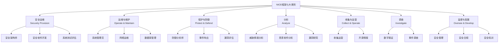
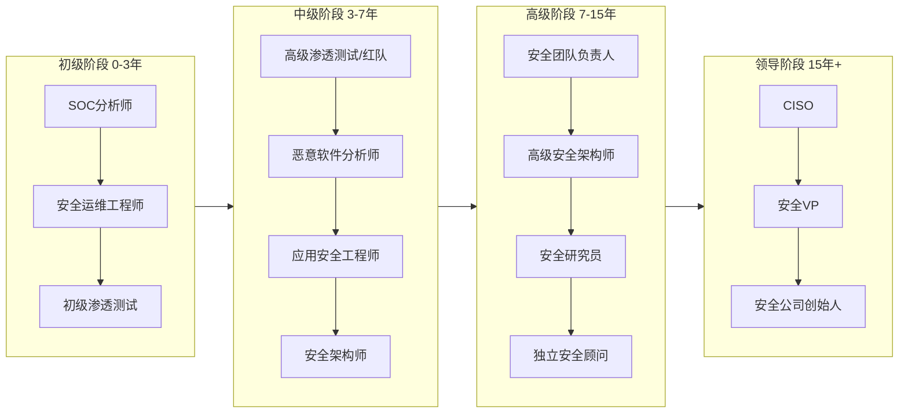
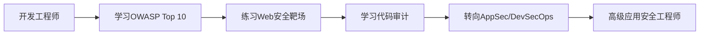
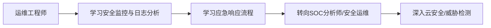
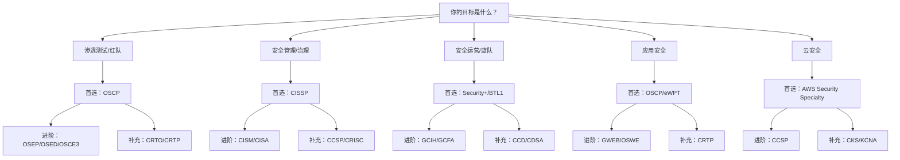

# 第04章 职业发展路径 - 深度拓展

## 一、安全职业全景深度解析

### 1.1 NICE框架与职业定位

美国NIST发布的NICE Cybersecurity Workforce Framework（SP 800-181）是全球最权威的网络安全人才分类体系。它将安全工作分为7个大类、33个专业领域和52个工作角色。理解这个框架有助于你找到自己的定位。



### 1.2 十大核心方向深度对比

| 方向 | 典型职位 | 核心技能 | 年薪范围（美元） | 入门门槛 | 成长天花板 | 适合性格 |
|------|---------|---------|----------------|---------|-----------|---------|
| 渗透测试 | Penetration Tester, Red Team Operator | 网络协议、漏洞利用、工具开发、社会工程 | $80K-$160K | 中 | 高 | 好奇心强、喜欢挑战、能承受挫败 |
| 安全运营 | SOC Analyst, Incident Responder | SIEM、日志分析、应急响应、威胁检测 | $60K-$130K | 低 | 中 | 细心、有耐心、能长时间专注 |
| 恶意软件分析 | Malware Analyst, Reverse Engineer | 逆向工程、调试、汇编语言、C/C++ | $90K-$160K | 高 | 高 | 逻辑思维强、喜欢底层技术 |
| 安全架构 | Security Architect, Cloud Security Architect | 系统设计、云平台、零信任、威胁建模 | $120K-$200K | 高 | 高 | 全局思维、沟通能力强 |
| 安全管理 | CISO, Security Manager | 风险管理、合规、沟通、业务理解 | $150K-$300K+ | 中 | 极高 | 领导力强、善于沟通 |
| 漏洞研究 | Vulnerability Researcher, Exploit Developer | 二进制分析、Fuzzing、漏洞利用开发、调试 | $100K-$200K | 极高 | 极高 | 极度专注、能忍受长期无产出 |
| 应用安全 | AppSec Engineer, Code Auditor | 代码审计、SAST/DAST、DevSecOps、CI/CD | $90K-$170K | 中 | 高 | 有开发背景、注重细节 |
| 威胁情报 | Threat Intelligence Analyst | OSINT、恶意软件分析、APT追踪、数据分析 | $80K-$150K | 中 | 中 | 分析能力强、善于信息整合 |
| 数字取证 | Digital Forensics Examiner | 取证工具、证据链、法律程序、时间线分析 | $70K-$140K | 中 | 中 | 严谨细致、有法律意识 |
| GRC | GRC Analyst, Compliance Manager | 安全标准、审计、风险管理、文档编写 | $70K-$140K | 低 | 中 | 沟通能力强、善于文档 |

### 1.3 新兴方向深度分析

#### AI安全工程师

AI安全是2024-2025年增速最快的安全细分领域。核心工作包括：

- **对抗性机器学习**：研究对抗样本攻击（如FGSM、PGD）、模型后门植入、数据投毒
- **大模型安全**：Prompt注入攻击防御、越狱检测、输出过滤、内容安全审核
- **AI供应链安全**：模型文件安全（恶意权重）、训练数据安全、推理环境隔离
- **AI红队测试**：对AI系统进行系统性安全评估，发现非预期行为

所需技能：Python/TensorFlow/PyTorch、机器学习基础、传统安全知识、数学基础（线性代数、概率论）。

薪资范围：$120K-$250K（美国），在国内大厂约40-80万人民币/年。

#### 云安全工程师

云安全已从"加分项"变成"必备技能"。核心领域：

- **CSPM（云安全配置管理）**：持续监控云资源配置，发现偏离安全基线的配置
- **容器安全**：镜像扫描、运行时保护、Kubernetes安全策略（PodSecurityPolicy/OPA）
- **IAM策略设计**：最小权限原则在云环境的落地、服务账号管理、跨账号信任
- **云原生安全工具链**：Falco（运行时检测）、Trivy（镜像扫描）、Terraform Sentinel（IaC安全）

认证路径：AWS Security Specialty → Azure Security Engineer Associate → GCP Professional Security Engineer。

#### IoT安全研究员

物联网安全研究是硬件与软件安全的交叉领域：

- **固件提取与分析**：通过UART/JTAG/SPI接口提取固件，使用binwalk解包分析
- **通信协议逆向**：ZigBee、BLE、LoRa、MQTT等协议的安全分析
- **硬件安全**：侧信道攻击、故障注入、芯片解封装
- **供应链安全**：芯片级后门检测、固件签名验证

工具链：Ghidra、JTAGulator、Saleae逻辑分析仪、HackRF SDR。

#### 区块链安全审计师

智能合约安全审计是一个高薪细分领域：

- **常见漏洞类型**：重入攻击、整数溢出、访问控制缺陷、闪电贷攻击、预言机操纵
- **审计工具**：Slither、Mythril、Echidna（模糊测试）、Foundry（形式化验证）
- **审计流程**：人工代码审查 → 自动化扫描 → 形式化验证 → 经济模型分析 → 报告撰写
- **收入模式**：单次审计$5K-$500K+（取决于项目规模），顶级审计师年收入可达百万美元

#### 隐私工程师

随着GDPR、CCPA、中国《个人信息保护法》等法规的实施，隐私工程师需求激增：

- **隐私设计（Privacy by Design）**：在系统设计阶段嵌入隐私保护
- **数据分类与标注**：建立数据资产清单，标注敏感数据
- **匿名化技术**：差分隐私、k-匿名、同态加密、联邦学习
- **合规自动化**：自动化隐私影响评估（PIA）、数据主体请求（DSR）处理

### 1.4 职业发展阶梯详解



**初级阶段（0-3年）关键任务：**

这个阶段的核心目标是"建立安全直觉"。你需要：

1. **掌握基础工具链**：Nmap、Burp Suite、Wireshark、Metasploit、IDA Pro（至少熟悉2-3个）
2. **完成100+靶机练习**：HTB、TryHackMe、VulnHub上的机器，建立漏洞识别的肌肉记忆
3. **获得第一个认证**：推荐Security+（入门）或OSCP（有基础者）
4. **建立技术博客**：记录学习过程，这既是学习工具也是求职名片
5. **参与CTF竞赛**：至少参加5场以上有Writeup的CTF

**中级阶段（3-7年）关键任务：**

这个阶段的核心目标是"建立专业深度"。你需要：

1. **选定细分方向**：不再"什么都做"，而是深入一个领域
2. **开始技术输出**：在安全会议上演讲、发表技术文章、开源工具
3. **获得高级认证**：OSCP/CISSP/GIAC系列，取决于方向
4. **建立行业人脉**：通过会议、社区、开源项目认识同行
5. **开始带人**：指导初级同事，这会倒逼你系统化知识

**高级阶段（7-15年）关键任务：**

这个阶段的核心目标是"建立影响力"。你需要：

1. **成为领域专家**：在细分领域有公认的技术深度
2. **技术领导力**：能带领团队解决复杂安全问题
3. **业务理解力**：能将安全问题翻译为业务语言
4. **行业贡献**：CVE发现、开源项目、标准制定、会议演讲
5. **导师角色**：培养下一代安全人才

### 1.5 薪资市场深度分析

根据ISC² 2024年网络安全劳动力研究，全球网络安全人才缺口约为480万人。这种供需失衡是推高薪资的核心因素。

**美国市场薪资数据（2024-2025）：**

| 级别 | 职位 | 湾区/纽约 | 中西部 | 远程 |
|------|------|----------|--------|------|
| 初级 | SOC Analyst | $75K-$95K | $55K-$75K | $60K-$85K |
| 中级 | Pentester/Sr. Analyst | $120K-$160K | $85K-$120K | $100K-$140K |
| 高级 | Staff/Principal | $180K-$250K | $130K-$180K | $150K-$220K |
| 管理 | Director/VP | $250K-$400K+ | $180K-$280K | $200K-$350K |

**中国市场薪资数据（2024-2025，人民币/年）：**

| 级别 | 职位 | 一线城市 | 新一线 | 二线 |
|------|------|---------|--------|------|
| 初级 | 安全工程师 | 15-25万 | 10-18万 | 8-15万 |
| 中级 | 高级安全工程师 | 30-50万 | 20-35万 | 15-25万 |
| 高级 | 安全专家/架构师 | 50-80万 | 35-55万 | 25-40万 |
| 管理 | 安全总监/CSO | 80-150万+ | 50-100万 | 35-60万 |

**影响薪资的关键因素：**

1. **认证溢价**：OSCP持有者比无认证者薪资高15-25%；CISSP持有者高20-30%；OSCE/GXPN高30-40%
2. **行业差异**：金融 > 科技 > 医疗 > 制造 > 政府
3. **公司类型**：FAANG/大厂 > 安全厂商 > 系统集成商 > 中小企业
4. **技能稀缺性**：漏洞研究/红队 > 云安全 > 安全开发 > 安全运营
5. **工作模式**：完全远程可能降薪5-15%，但也有公司不降

**薪资谈判实操建议：**

- **调研市场价**：使用Glassdoor、Levels.fyi、Blind、脉脉等平台了解目标公司薪资范围
- **锚定高值**：报出比你预期高10-15%的数字，留出谈判空间
- **谈总包而非底薪**：关注RSU/期权、签字费、年度奖金、福利等
- **展示价值而非需求**：不说"我需要这个数"，说"基于我的经验和能带来的价值"
- **拿到多个Offer**：这是最强的谈判筹码，但不要编造虚假Offer
- **知道Walk Away Point**：提前确定你的底线，低于这个数就拒绝

---

## 二、行业前沿与趋势深度分析

### 2.1 AI对安全职业的深层影响

AI不会取代安全从业者，但会深刻改变工作方式。理解这种变化对职业规划至关重要。

**AI正在自动化的工作：**

| 工作类型 | 自动化程度 | 影响 |
|---------|-----------|------|
| 初级日志分析 | 高 | SOC L1分析师需要转型 |
| 漏洞扫描报告生成 | 高 | 纯报告型工作减少 |
| 常见漏洞检测 | 中-高 | SAST/DAST工具更智能 |
| 合规检查 | 中 | 自动化检查取代人工核查 |
| 威胁情报摘要 | 中 | 人工分析仍是核心 |

**AI无法替代的能力：**

1. **创造性攻击思维**：AI可以发现已知模式，但创造新的攻击路径仍需人类智慧
2. **上下文理解**：理解业务逻辑、组织政治、人为因素
3. **应急响应决策**：在信息不完整时做出判断
4. **社会工程**：理解人性弱点、设计针对性攻击
5. **战略规划**：制定安全战略、预算分配、风险优先级

**安全从业者如何适应AI时代：**

- **学会使用AI工具**：熟练使用Copilot、ChatGPT辅助代码审计、报告撰写、脚本开发
- **理解AI局限**：知道AI在哪些场景下会误判（高误报率、上下文缺失）
- **发展AI无法替代的能力**：创造性思维、业务理解、沟通能力
- **学习AI安全**：成为"AI安全专家"而非"被AI取代的安全人员"
- **关注AI红队**：这是新兴的高价值方向

### 2.2 零信任架构的普及

零信任（Zero Trust）已从概念走向大规模落地。这对安全职业的影响：

**零信任相关岗位需求增长：**

- 身份与访问管理（IAM）工程师
- 微分段（Microsegmentation）专家
- 持续验证（Continuous Verification）工程师
- SASE/SSE架构师

**核心技能要求：**

- 身份协议（OAuth2.0、OIDC、SAML）
- 身份提供商（Okta、Azure AD、Ping Identity）
- 网络微分段（Illumio、Guardicore/Akamai）
- 设备信任评估（EDR集成、设备健康检查）
- 策略引擎（OPA、Casbin）

### 2.3 供应链安全的崛起

SolarWinds事件后，供应链安全成为焦点：

**供应链安全的三个层面：**

1. **源码层**：代码签名、依赖审计（Dependabot、Snyk）、SBOM生成
2. **构建层**：可重现构建（Reproducible Builds）、构建环境隔离（SLSA框架）
3. **分发层**：制品签名（Sigstore/Cosign）、仓库安全、分发完整性验证

**相关岗位：**

- 供应链安全工程师
- DevSecOps工程师
- 开源安全审计师

### 2.4 安全人才短缺的结构性分析

全球网络安全人才缺口持续扩大，但问题的根源不仅是"人数不够"：

**结构性问题：**

1. **技能错配**：大学教育与行业需求脱节，毕业生需要大量在职培训
2. **经验悖论**：初级岗位要求"2-3年经验"，但新手无法获得经验
3. **地域失衡**：安全人才集中在一线城市和科技公司
4. **多样性不足**：女性、少数族裔在安全行业的比例仍然偏低

**破解经验悖论的方法：**

- **CTF竞赛**：积累可证明的实战能力
- **开源贡献**：在GitHub上展示代码能力
- **Bug Bounty**：用漏洞发现证明实力
- **安全博客**：展示知识深度和学习能力
- **实验室项目**：搭建家庭实验室，记录攻防过程
- **志愿者安全评估**：为非营利组织提供免费安全评估

---

## 三、职业转型实战指南

### 3.1 从开发工程师转型安全

这是最常见的转型路径，因为开发背景是安全领域的巨大优势。

**转型路线图：**



**具体行动步骤：**

1. **第1-3个月**：学习OWASP Top 10，在PortSwigger Academy完成所有Lab
2. **第4-6个月**：学习代码审计，审计自己项目的代码，发现安全问题
3. **第7-9个月**：学习SAST/DAST工具（Semgrep、SonarQube、Burp Suite）
4. **第10-12个月**：在团队中推广安全编码实践，建立DevSecOps流水线
5. **第2年**：获得OSCP或相关认证，正式转入安全岗位

**开发背景的优势：**

- 理解代码逻辑，审计效率比纯安全人员高3-5倍
- 能写自动化工具和PoC
- 能与开发团队有效沟通
- 理解CI/CD流程，能嵌入安全检查

### 3.2 从运维工程师转型安全

运维背景在安全运营和云安全方向有天然优势。

**转型路线图：**



**具体行动步骤：**

1. **第1-3个月**：学习SIEM工具（Splunk/ELK），分析真实日志
2. **第4-6个月**：学习应急响应流程，练习DFIR（数字取证与事件响应）
3. **第7-9个月**：学习云安全，获取AWS/Azure安全认证
4. **第10-12个月**：在当前运维工作中引入安全实践
5. **第2年**：正式转入安全运营或云安全岗位

### 3.3 从零基础转型安全

完全零基础的转型需要更多时间和耐心，但完全可行。

**推荐学习路径：**

1. **打基础（3-6个月）**：
   - 学习Linux基础（推荐《鸟哥的Linux私房菜》）
   - 学习网络基础（TCP/IP、HTTP、DNS）
   - 学习一门编程语言（Python优先）
   - 完成TryHackMe的Complete Beginner路径

2. **入门安全（6-12个月）**：
   - 学习Web安全基础（OWASP Top 10）
   - 完成PortSwigger Academy的Web安全课程
   - 开始做HTB Easy难度的机器
   - 学习基础渗透测试方法论

3. **确定方向（12-18个月）**：
   - 尝试不同方向（Web、二进制、逆向、蓝队）
   - 选定一个方向深入
   - 获得第一个认证（Security+或eJPT）
   - 开始参加CTF

4. **求职准备（18-24个月）**：
   - 准备个人作品集（博客、GitHub、CTF成绩）
   - 练习面试题目
   - 投递初级安全岗位
   - 持续学习和实践

### 3.4 从非技术背景转型安全

非技术背景的转型路径：

**适合非技术背景的安全方向：**

- **GRC（治理、风险与合规）**：需要理解标准和流程，技术门槛较低
- **安全咨询**：需要沟通能力和业务理解
- **安全项目管理**：需要项目管理能力和安全基础知识
- **安全销售/售前**：需要技术基础和销售能力
- **安全培训**：需要知识和表达能力

**转型策略：**

1. 考取Security+或CISA等入门级认证
2. 学习基础技术知识（不需要精通，但需要理解）
3. 利用你的行业背景（如金融背景→金融安全，医疗背景→医疗安全）
4. 从安全运营或GRC岗位切入

---

## 四、安全认证体系深度解析

### 4.1 认证选择决策框架

选择认证不是"越多越好"，而是要匹配你的职业目标。



### 4.2 主流认证深度对比

#### 入门级认证

| 认证 | 费用 | 难度 | 实操比例 | 行业认可 | 最适合 |
|------|------|------|---------|---------|--------|
| CompTIA Security+ | $392 | ★★☆ | 0% | 高 | 安全入门、求职敲门砖 |
| CEH | $1,199-$2,499 | ★★☆ | 0% | 中（争议大） | 简历关键词、国企/央企认可 |
| eJPT | $249 | ★★☆ | 100% | 中 | 渗透测试入门、实操能力证明 |
| BTL1 | $499 | ★★★ | 100% | 中-高 | 蓝队入门、事件响应 |

**Security+ vs CEH 的真实对比：**

Security+是厂商中立的基础认证，内容涵盖网络安全、威胁、密码学、身份管理等。考试为选择题+性能题，费用约$392，有效期3年。

CEH由EC-Council颁发，内容涵盖道德黑客技术。但CEH在安全社区争议较大——批评者认为它过于理论化，考试全是选择题，无法证明实战能力。支持者认为它在传统企业（特别是政府和国企）认可度高。

**建议**：如果你的目标是互联网公司或安全厂商，选Security+或直接考OSCP。如果你的目标是传统企业或政府机构，CEH可能更有用。

#### 中级认证

**OSCP（Offensive Security Certified Professional）：**

OSCP是渗透测试领域的"金标准"认证。考试为24小时实操，需要攻破多台靶机并提交报告。

备考策略：

1. **完成PWK课程所有练习**：不要跳过任何实验
2. **做70+台独立靶机**：HTB Pro Labs、VulnHub、PG Practice
3. **建立方法论模板**：建立自己的渗透测试checklist
4. **练习报告撰写**：OffSec对报告格式有严格要求
5. **模拟考试环境**：在24小时内完成5台靶机的攻破

常见失败原因：

- 枚举不充分（最常见）
- 缺乏时间管理
- 报告格式不规范
- 过度依赖自动化工具

**CISSP（Certified Information Systems Security Professional）：**

CISSP是安全管理领域的"通行证"。考试为计算机自适应测试（CAT），125-175题，4小时。

八大领域权重：

1. 安全与风险管理（15%）
2. 资产安全（10%）
3. 安全架构与工程（13%）
4. 通信与网络安全（13%）
5. 身份与访问管理（13%）
6. 安全评估与测试（12%）
7. 安全运营（13%）
8. 软件开发安全（11%）

备考建议：

- 使用Official Study Guide（OSG）作为主要教材
- 使用Boson或CCCure练习题库
- 理解概念而非死记硬背
- 需要5年以上相关工作经验（或4年+学位）

#### 高级认证

| 认证 | 方向 | 费用 | 难度 | 特点 |
|------|------|------|------|------|
| OSCE3 | 高级渗透 | $2,499-$5,499 | ★★★★★ | OffSec专家级，含OSEP+OSED+OSED |
| GXPN | 漏洞研究 | $8,510 | ★★★★★ | GIAC高级漏洞利用 |
| CCIE Security | 网络安全架构 | $500+ | ★★★★★ | Cisco专家级，含8小时Lab |
| OSCP+ | 渗透测试 | 包含在OSCP课程中 | ★★★★ | OSCP的进阶版本 |

### 4.3 中国安全认证体系

**NISP（国家信息安全水平考试）：**

- **一级**：基础安全知识，适合在校学生和安全入门者
- **二级**：安全技术能力，适合安全工程师
- **三级**：高级安全管理，适合安全管理者
- **报名方式**：通过NISP官网报名，全国考点

**CISP系列：**

- **CISE**：注册信息安全工程师，技术方向
- **CISO**：注册信息安全管理人员，管理方向
- **CISP-PTE**：注册渗透测试工程师，实操认证
- **CISP-PTS**：注册渗透测试专家，高级实操认证
- **CISP-IRE**：注册应急响应工程师

**报考条件**：需要参加授权培训机构的培训，考试为选择题+实操题。

**与国际认证的对比：**

| 对比维度 | 国际认证（OSCP/CISSP） | 国内认证（CISP/NISP） |
|---------|----------------------|---------------------|
| 国际认可度 | 高 | 低 |
| 国内认可度 | 中-高 | 高（国企/央企） |
| 考试难度 | 高 | 中 |
| 实操比例 | 高（OSCP 100%） | 中 |
| 费用 | 高 | 中 |
| 续期要求 | 有（CE学分） | 有（继续教育） |

**建议**：如果你在外企或互联网公司，优先考国际认证。如果你在国企、央企或政府机构，国内认证更实用。两者都有的话是最佳组合。

### 4.4 认证投资回报分析

**ROI计算框架：**

```text
认证ROI = (薪资提升 + 职业机会增加) / (考试费用 + 备考时间 × 时薪 + 续期费用)
```

**以OSCP为例：**

- 考试费用：$1,599-$2,499（含课程）
- 备考时间：约300-500小时
- 如果时薪$50，备考时间成本：$15,000-$25,000
- 总投入：$16,599-$27,499
- 薪资提升：平均15-25%（约$12K-$40K/年）
- **ROI回本期：约6-18个月**

**以CISSP为例：**

- 考试费用：$749
- 备考时间：约200-300小时
- 如果时薪$60，备考时间成本：$12,000-$18,000
- 总投入：$12,749-$18,749
- 薪资提升：平均20-30%（约$15K-$50K/年）
- **ROI回本期：约4-12个月**

---

## 五、求职与面试实战

### 5.1 安全简历优化模板

**简历结构（1-2页）：**

```text
[姓名] | [城市] | [邮箱] | [GitHub/博客]

## 专业摘要（2-3句话）
X年安全从业经验，专注于[方向]。在[公司]负责[核心工作]。
持有[认证]，发现过[数量]个CVE/漏洞。

## 技术技能
- 工具：Burp Suite, Nmap, Metasploit, IDA Pro, Ghidra
- 语言：Python, Bash, C, Go
- 平台：AWS, Azure, Kubernetes
- 框架：OWASP, MITRE ATT&CK, NIST

## 工作经历
[公司名] - [职位] ([时间])
- 用STAR格式描述3-5个核心成就
- 量化成果：发现X个高危漏洞、减少Y%的安全事件、节省Z万美元

## 项目与成就
- CVE-XXXX-XXXX：在[产品]中发现[漏洞类型]漏洞
- CTF排名：[比赛名称] Top X
- 开源项目：[项目名]，X stars，Y downloads

## 认证
- OSCP, CISSP, AWS Security Specialty

## 教育
[学位] - [学校] - [年份]
```

**简历优化要点：**

1. **量化一切**：不说"负责安全测试"，说"每年完成50+应用的安全测试，发现200+漏洞"
2. **突出影响力**：不说"参与应急响应"，说"主导了3次重大安全事件的应急响应，最小化了业务损失"
3. **展示学习能力**：包含博客、GitHub、CTF成绩等证明持续学习
4. **定制化**：针对每个职位调整简历，突出相关经验
5. **关键词优化**：包含职位描述中的关键词（ATS系统会扫描）

### 5.2 安全面试深度准备

**技术面试常见问题：**

**Web安全方向：**

1. 解释SQL注入的原理、类型和防御方法
2. XSS有哪几种类型？如何防御？
3. CSRF攻击的原理是什么？如何防御？
4. 解释SSRF攻击及其危害
5. 描述一次完整的渗透测试流程
6. 如何绕过WAF？
7. 解释JWT的工作原理和常见安全问题
8. OAuth2.0有哪些安全风险？

**二进制安全方向：**

1. 解释栈溢出的原理
2. 什么是ASLR？如何绕过？
3. 描述ROP攻击的原理
4. 解释堆溢出的基本原理
5. 如何分析一个未知的恶意软件样本？
6. 解释UAF（Use-After-Free）漏洞

**安全运营方向：**

1. 描述一次安全事件的响应流程
2. 如何检测横向移动？
3. 解释MITRE ATT&CK框架
4. 如何进行威胁狩猎（Threat Hunting）？
5. 描述日志分析的方法论

**行为面试STAR模板：**

```text
Situation（情境）：描述背景
Task（任务）：你的职责是什么
Action（行动）：你具体做了什么
Result（结果）：量化成果
```

**示例回答：**

"在[公司]工作期间（Situation），我负责对核心业务系统进行安全评估（Task）。我使用Burp Suite进行手动测试，结合SAST工具进行代码审计，发现了3个SQL注入和5个XSS漏洞（Action）。这些漏洞如果被利用可能导致用户数据泄露，我编写了详细的修复方案并与开发团队协作完成修复，避免了潜在的数据泄露事件（Result）。"

### 5.3 实操面试准备

许多安全公司会安排实操面试：

**常见实操面试形式：**

1. **CTF风格**：给定靶机，在限定时间内找到漏洞
2. **代码审计**：给定一段代码，找出安全问题
3. **应急响应**：给定日志/流量数据，分析安全事件
4. **架构评审**：给定系统架构图，评估安全风险

**准备方法：**

- 每天做1-2道HTB/TryHackMe的机器
- 练习代码审计（可以审计开源项目）
- 分析公开的安全事件报告
- 练习在白板上画系统架构并评估风险

### 5.4 求职渠道

**安全行业专属求职平台：**

| 平台 | 特点 | 适合 |
|------|------|------|
| CyberSeek | 美国安全职位市场数据 | 了解市场需求 |
| InfoSec Jobs | 安全行业专属招聘 | 各级别安全职位 |
| LinkedIn | 最大的职业社交平台 | 所有级别 |
| Indeed | 综合招聘平台 | 所有级别 |
| 脉脉 | 中国职场社交 | 国内职位 |
| 牛客网 | 中国技术面试平台 | 国内技术岗 |

**获取内推的方法：**

1. 在安全社区活跃，建立人脉
2. 参加安全会议，认识目标公司的人
3. 在LinkedIn上联系目标公司的安全团队成员
4. 参加CTF竞赛，认识同行
5. 在GitHub上贡献目标公司的开源项目

---

## 六、个人品牌建设深度指南

### 6.1 为什么个人品牌重要

在安全行业，个人品牌是你的"第二简历"。许多安全岗位的招聘是通过社区推荐和个人品牌发现的，而非传统的招聘流程。

**个人品牌的实际价值：**

- **求职时**：面试官Google你的名字时看到什么？
- **薪资谈判时**：你的影响力是谈判筹码
- **职业发展时**：知名度带来更多机会（演讲、顾问、合作）
- **知识沉淀时**：写作是最好的学习方式

### 6.2 安全博客建设

**平台选择：**

| 平台 | 优势 | 劣势 | 适合 |
|------|------|------|------|
| 个人博客（Hugo/Hexo） | 完全控制、SEO | 需要维护 | 长期品牌建设 |
| Medium | 内置流量、易用 | 不可控、可能付费墙 | 快速开始 |
| 知乎/CSDN | 国内流量大 | 环境杂、广告多 | 国内受众 |
| GitHub Pages | 免费、与代码集成 | 需要技术能力 | 技术向 |

**内容策略：**

1. **CTF Writeup**：参加CTF后写详细的解题过程，这是最容易上手的内容
2. **漏洞分析**：分析CVE的原理和利用方法
3. **工具教程**：详细讲解安全工具的使用
4. **学习笔记**：记录学习过程，帮助他人也帮助自己
5. **行业分析**：对安全事件、新漏洞的分析

**写作技巧：**

- 标题要具体："深入理解SQL注入：从原理到绕过WAF"比"SQL注入学习笔记"好
- 结构要清晰：使用H2/H3标题，代码块，图表
- 代码要可运行：提供完整的环境搭建步骤
- 图片要清晰：使用draw.io或mermaid画图
- 要有自己的思考：不只是复述，要有你的分析和见解

### 6.3 GitHub开源贡献

**如何开始贡献：**

1. **从文档开始**：修复README的typo、补充安装步骤
2. **修复简单的bug**：找标记为"good first issue"的issue
3. **添加新功能**：在理解项目后添加小功能
4. **创建自己的项目**：开发解决特定安全问题的工具

**推荐的安全开源项目：**

| 项目 | 语言 | 贡献类型 |
|------|------|---------|
| OWASP ZAP | Java | 功能开发、Bug修复 |
| Nuclei | Go | 模板编写、功能开发 |
| Burp Suite Extensions | Java/Python | 插件开发 |
| Ghidra | Java | 插件开发、Bug修复 |
| Metasploit | Ruby | 模块开发 |

### 6.4 安全会议演讲

**入门级会议（容易被接受）：**

- **BSides**：各地的BSides会议，门槛较低，适合首次演讲
- **DEF CON Groups**：本地分会，规模小，氛围好
- **OWASP本地分会**：专注于Web安全

**进阶级会议：**

- **DEF CON**：全球最大的黑客会议
- **Black Hat**：最专业的安全会议
- **HITB**：亚洲知名安全会议
- **POC**：韩国安全会议

**如何写演讲提案（CFP）：**

1. **选择有深度的主题**：不是"Web安全入门"，而是"利用原型链污染绕过Node.js安全机制"
2. **突出新颖性**：你的研究有什么新发现？
3. **展示技术深度**：包含代码、Demo、漏洞细节
4. **控制时间**：通常20-45分钟
5. **练习演讲**：录视频回看，找朋友预演

---

## 七、职业健康与可持续发展

### 7.1 安全工作的心理健康

安全工作（特别是SOC分析师、应急响应）压力大、工作时间长。根据SANS 2023年调查，约70%的安全从业者经历过不同程度的职业倦怠。

**职业倦怠的信号：**

- 对工作失去兴趣
- 持续疲劳，即使休息后也无法恢复
- 工作效率下降
- 易怒、焦虑
- 失眠或睡眠质量下降

**应对策略：**

1. **设定边界**：下班后不看工作消息（除非on-call）
2. **定期休息**：每工作90分钟休息15分钟
3. **运动**：每周至少3次30分钟的有氧运动
4. **社交**：维持工作外的社交关系
5. **寻求帮助**：如果持续2周以上感到倦怠，寻求专业心理咨询
6. **工作分离**：在家不工作，工作不想家

### 7.2 工作生活平衡

**安全工作的特殊挑战：**

- **On-Call轮值**：可能需要24/7响应安全事件
- **紧急事件**：安全事件没有"等到明天"的选项
- **持续学习压力**：技术更新快，需要不断学习
- **跨时区协作**：远程工作可能需要配合不同时区

**平衡策略：**

- **与团队协商On-Call轮值**：确保公平分配
- **建立应急响应SOP**：减少紧急事件的处理时间
- **每天固定学习时间**：比如早上1小时，而不是随时学习
- **定期休假**：每季度至少安排一次3天以上的休假

### 7.3 长期职业规划

**10年职业规划模板：**

```text
Year 1-2：打基础
- 掌握核心技能
- 获得入门认证
- 完成50+靶机/项目

Year 3-4：建立专业深度
- 选定细分方向
- 获得中级认证
- 开始技术输出（博客/演讲）

Year 5-6：成为专家
- 在细分领域有公认深度
- 获得高级认证
- 开始指导他人

Year 7-8：扩大影响力
- 行业会议演讲
- 开源项目贡献
- 建立广泛人脉

Year 9-10：领导角色
- 带领团队
- 制定安全战略
- 行业影响力
```

---

## 八、学习资源与社区

### 8.1 书籍推荐

**渗透测试方向：**

| 书名 | 作者 | 适合阶段 | 核心价值 |
|------|------|---------|---------|
| 《The Hacker Playbook 3》 | Peter Kim | 中级 | 实战导向，红队方法论 |
| 《Penetration Testing》 | Georgia Weidman | 入门 | 渗透测试入门经典 |
| 《The Web Application Hacker's Handbook》 | Stuttard & Pinto | 中级 | Web安全权威指南 |
| 《Black Hat Python》 | Justin Seitz | 中级 | Python安全编程 |
| 《Hacking: The Art of Exploitation》 | Jon Erickson | 中级 | 底层漏洞利用原理 |

**蓝队方向：**

| 书名 | 作者 | 适合阶段 | 核心价值 |
|------|------|---------|---------|
| 《Blue Team Handbook》 | Don Murdoch | 入门 | 应急响应指南 |
| 《The Art of Incident Response》 | Kevin Mandia | 中级 | 事件响应方法论 |
| 《Practical Malware Analysis》 | Sikorski & Honig | 中级 | 恶意软件分析实战 |
| 《Threat Modeling》 | Adam Shostack | 中级 | 威胁建模方法 |

**安全管理方向：**

| 书名 | 作者 | 适合阶段 | 核心价值 |
|------|------|---------|---------|
| 《CISSP Official Study Guide》 | ISC² | 中级 | CISSP备考必备 |
| 《Security Engineering》 | Ross Anderson | 高级 | 安全工程经典 |
| 《The CISO Desk Reference Guide》 | Hayslip et al. | 高级 | CISO实用指南 |

### 8.2 在线学习平台

| 平台 | 费用 | 内容类型 | 适合 |
|------|------|---------|------|
| TryHackMe | 免费/月$14 | 交互式学习 | 入门-中级 |
| Hack The Box | 免费/月$18 | 靶机练习 | 中级-高级 |
| PortSwigger Academy | 免费 | Web安全 | 入门-中级 |
| PentesterLab | 月$35 | Web安全 | 入门-高级 |
| SANS Cyber Aces | 免费 | 基础课程 | 入门 |
| Cybrary | 免费/付费 | 综合安全 | 入门-中级 |
| Offensive Security | $1,599+ | 渗透测试 | 中级-高级 |
| INE | 月$75 | 综合安全 | 入门-高级 |

### 8.3 安全社区

**国际社区：**

- **The Many Hats Club**：Discord安全社区，活跃度高
- **InfoSec Community**：Slack安全社区
- **NetSec Focus**：Reddit网络安全社区
- **Hacking Discord**：技术讨论为主

**中国社区：**

- **先知社区**：阿里安全旗下的安全技术社区
- **看雪论坛**：二进制安全、逆向工程
- **安全客**：360旗下的安全资讯平台
- **FreeBuf**：安全资讯和漏洞分析
- **漏洞盒子**：漏洞报告和学习
- **T00ls**：安全技术论坛

### 8.4 CTF竞赛

**CTF类型：**

| 类型 | 特点 | 适合 | 推荐平台 |
|------|------|------|---------|
| Jeopardy | 解题模式，题目分类 | 入门 | CTFtime、picoCTF |
| Attack-Defense | 攻防对抗 | 中级 | iCTF、FAUST |
| King of the Hill | 占领服务器 | 中级 | HTB CTF |

**入门CTF推荐：**

1. **picoCTF**：面向初学者，题目有引导
2. **CTFtime**：CTF日历，选择适合的赛事
3. **Google CTF**：高质量题目，有新手区
4. **DEF CON CTF Quals**：顶级赛事，可以学习

**CTF学习路径：**

```text
Week 1-4：Web安全基础
- SQL注入、XSS、CSRF
- 完成picoCTF Web题

Week 5-8：密码学基础
- 古典密码、RSA、AES
- 完成CryptoHack

Week 9-12：逆向工程基础
- x86汇编、Ghidra使用
- 完成picoCTF Reverse题

Week 13-16：Pwn基础
- 栈溢出、格式化字符串
- 完成pwn.college
```

### 8.5 必备工具链

**渗透测试工具：**

| 工具 | 用途 | 学习优先级 |
|------|------|-----------|
| Nmap | 网络扫描 | ★★★★★ |
| Burp Suite | Web安全测试 | ★★★★★ |
| Metasploit | 漏洞利用框架 | ★★★★☆ |
| Wireshark | 流量分析 | ★★★★☆ |
| John the Ripper | 密码破解 | ★★★☆☆ |
| Hashcat | 密码破解 | ★★★☆☆ |
| Gobuster | 目录扫描 | ★★★☆☆ |
| SQLMap | SQL注入 | ★★★★☆ |

**蓝队工具：**

| 工具 | 用途 | 学习优先级 |
|------|------|-----------|
| Splunk | SIEM | ★★★★★ |
| ELK Stack | 日志分析 | ★★★★☆ |
| Wireshark | 流量分析 | ★★★★★ |
| Volatility | 内存取证 | ★★★★☆ |
| YARA | 恶意软件检测 | ★★★☆☆ |
| Sigma | 检测规则 | ★★★☆☆ |

**开发工具：**

| 工具 | 用途 | 学习优先级 |
|------|------|-----------|
| Python | 安全脚本开发 | ★★★★★ |
| Bash | 系统脚本 | ★★★★☆ |
| Go | 安全工具开发 | ★★★☆☆ |
| Rust | 高性能工具 | ★★☆☆☆ |
| Ghidra | 逆向工程 | ★★★★☆ |
| IDA Pro | 逆向工程 | ★★★★☆ |

---

## 九、思考题与实践

### 9.1 职业规划思考题

1. **自我评估**：根据NICE框架，你目前的技能属于哪个类别？你的目标是哪个类别？差距在哪里？

2. **认证规划**：你计划在接下来的2年内获取哪些认证？请说明理由，并计算预期ROI。

3. **T型人才构建**：你计划在哪些领域建立广度？在哪个领域建立深度？请画出你的技能树。

4. **职业转型**：如果你要从当前职业转型到安全，你的优势是什么？劣势是什么？如何弥补？

5. **5年规划**：写下你的5年职业规划，包括职位目标、薪资目标、技能目标、认证目标。

### 9.2 实践练习

**练习1：个人技能矩阵**

创建一个Excel表格，列出以下内容：
- 行：安全技能（网络、Web、二进制、云、密码学等）
- 列：熟练程度（1-5分）
- 标注：哪些是你的优势，哪些需要加强

**练习2：模拟面试**

找一个朋友或使用AI助手，进行一次完整的安全面试模拟：
- 30分钟技术面试
- 15分钟行为面试
- 录制并回看

**练习3：CTF实战**

选择以下任一平台，完成5道入门题目：
- picoCTF（Web/Reverse/Crypto）
- TryHackMe（Complete Beginner路径）
- PortSwigger Academy（SQL Injection Labs）

**练习4：安全博客**

写一篇安全技术文章并发布：
- 主题：你最近学到的一个安全知识点
- 要求：有代码示例、有图解、有你自己的思考
- 平台：个人博客、Medium或知乎

**练习5：开源贡献**

在GitHub上找到一个安全相关的开源项目：
- 修复一个"good first issue"
- 或者添加一个新功能
- 或者改进文档

---

## 十、常见问题解答

**Q: 我应该先学编程还是先学安全？**

A: 建议同时进行。先学Python基础（2-4周），然后开始安全学习，在安全学习过程中不断加深编程能力。纯学编程容易失去动力，纯学安全会遇到瓶颈。

**Q: 学历对安全求职重要吗？**

A: 在互联网公司和安全厂商，能力>学历。许多优秀的安全从业者没有计算机学位。但在国企、央企和政府机构，学历可能是硬性要求。建议：如果你有好的学历，充分利用它；如果没有，用项目、认证和社区影响力来证明自己。

**Q: 我应该专精一个方向还是广泛涉猎？**

A: 职业初期广泛涉猎，找到自己感兴趣和擅长的方向；职业中期开始专精；职业高级阶段再扩展广度。这是"T型人才"的成长路径。

**Q: Bug Bounty能作为全职工作吗？**

A: 可以，但有风险。顶级Bug Bounty猎人年收入可达$100K-$500K+，但收入不稳定。建议：先作为副业积累经验，等收入稳定超过本职工作后再考虑全职。

**Q: 如何应对安全行业的"知识焦虑"？**

A: 接受"不可能知道所有东西"的事实。专注于你的细分领域，保持对其他领域的基本了解。每天固定学习时间，不要试图跟上所有新闻和漏洞。

**Q: 远程工作对安全从业者有什么特殊挑战？**

A: 主要挑战包括：需要更强的自律能力、团队协作可能受影响、某些需要物理访问的工作无法完成、时区差异导致沟通困难。建议：建立固定的工作时间、使用异步沟通工具、定期与团队视频会议。

**Q: 安全行业的年龄歧视问题？**

A: 安全行业比其他技术领域更尊重经验。资深安全从业者通常更有价值，因为他们见过更多攻击场景、有更好的判断力。关键是要持续学习，不要停止技术更新。

**Q: 如何在安全工作中避免倦怠？**

A: 设定工作边界、定期休息、运动、维持工作外的社交关系、定期休假。如果持续2周以上感到倦怠，寻求专业心理咨询。安全工作压力大是正常的，但长期倦怠需要认真对待。

---

> **本章寄语**：安全行业是一个充满机会的领域，但也需要持续的学习和投入。不要被认证和头衔所迷惑，真正重要的是你的实际能力、解决问题的思维方式和对安全的热情。记住：最好的安全从业者是那些保持好奇心、持续学习、并愿意分享知识的人。你的职业发展是一场马拉松，不是百米冲刺——找到你的节奏，享受这个过程。
