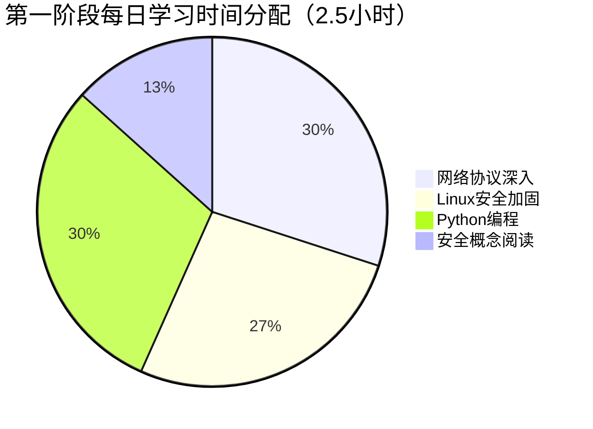
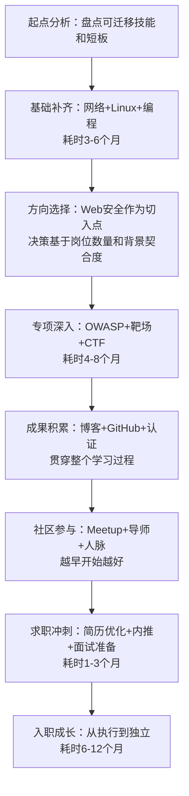

## 案例一：从零到渗透测试工程师

本案例完整记录一位运维工程师转型渗透测试的真实路径。不是鸡汤式的成功故事，而是一份包含时间线、资源清单、踩坑记录和决策逻辑的可复用指南。如果你正在考虑从IT运维、开发或其他技术岗位转入安全行业，这个案例值得逐字阅读。

### 人物画像与起点分析

**基本信息**

| 维度 | 详情 |
|------|------|
| 姓名 | 小王（化名） |
| 学历 | 计算机科学与技术本科，普通一本 |
| 转行前岗位 | 传统制造企业系统运维（2年） |
| 转行时年龄 | 25岁 |
| 每日可用学习时间 | 2-3小时（工作日晚间 + 周末） |
| 转行总耗时 | 15个月（从决定转行到正式入职安全公司） |

**起点优势盘点**

小王并非零基础。两年运维经历让他具备了以下可迁移技能：

- **Linux系统操作**：熟悉CentOS/Ubuntu日常运维，会用shell脚本自动化任务，理解文件权限、进程管理、日志分析
- **网络基础**：配置过交换机和防火墙，了解TCP/IP协议栈，抓过Wireshark包分析网络故障
- **问题排查思维**：运维工作的核心就是定位问题，这种系统化的排查思路在渗透测试中同样关键
- **企业环境认知**：了解真实企业的网络架构、变更流程、安全意识水平，这比纯实验室背景更有价值

**起点劣势分析**

- 没有任何安全工具使用经验（Nmap、Burp Suite、Metasploit都没摸过）
- 没有编程能力（只会简单的shell脚本）
- 没有安全社区人脉
- 没有CTF经验
- 所在城市安全岗位较少，需要考虑远程或异地求职

> **关键认知**：转行前必须诚实地盘点自己的优势和劣势。优势是可以加速学习的跳板，劣势是需要优先补齐的短板。很多人转行失败不是因为能力不够，而是没有做好起点分析，学习路径缺乏针对性。

### 完整发展历程

#### 第一阶段：建立基础（第1-6个月）

这个阶段的目标不是"学安全"，而是**补齐安全从业者必备的基础技能栈**。跳过这一步直接学渗透技术，就像不会加减法直接学微积分——看似走了捷径，实际会在后续每一个环节卡住。

**学习时间分配**



**网络协议深入（核心优先级：最高）**

小王虽然有网络基础，但运维层面的网络知识和安全层面的要求完全不同。运维关注"能不能通"，安全关注"能不能被利用"。

具体学习路径：

1. **TCP/IP协议栈精读**：不只看三次握手，而是逐字段理解IP头、TCP头、UDP头。用Wireshark抓包验证每一个标志位的含义。推荐教材《TCP/IP详解 卷1：协议》，重点阅读第1-15章和第17-24章
2. **HTTP/HTTPS协议深度理解**：请求方法、状态码、Header字段、Cookie机制、Session管理、HTTPS握手流程。这是Web安全的地基
3. **DNS协议**：递归查询 vs 迭代查询、DNS缓存投毒原理、DNS隧道原理。小王在家里搭建了BIND9 DNS服务器，亲手配置区域文件，理解了DNS的运作机制
4. **ARP协议**：ARP欺骗的原理、ARP表的工作机制。用Scapy写了一个简单的ARP欺骗脚本来验证理解

**实操练习**：用tcpdump和Wireshark抓取以下场景的流量并分析：
- 浏览一个HTTP网站的完整请求过程
- DNS解析一个域名的完整过程
- SSH登录一台服务器的握手过程
- 用curl发送POST请求并观察Content-Type的变化

**Linux安全加固（核心优先级：高）**

小王的Linux知识停留在"能用"层面，需要升级到"能防"层面：

1. **权限体系深入**：不只看rwx，理解SUID/SGID/Sticky bit、ACL、capabilities、seccomp。用`find / -perm -4000`找出系统中所有SUID文件，逐一分析为什么需要SUID
2. **日志审计**：/var/log/auth.log、/var/log/syslog、/var/log/audit/audit.log的解读。配置auditd记录关键操作，学习用ausearch和aureport查询
3. **服务最小化**：用`ss -tlnp`查看所有监听端口，逐一评估是否必要。关闭不需要的服务，理解每个开放端口的攻击面
4. **SSH加固**：禁用密码登录、配置密钥认证、修改默认端口、限制登录IP、配置fail2ban
5. **防火墙**：iptables四表五链的完整理解，编写规则只放行必要流量

**Python编程（核心优先级：高）**

安全领域的编程需求和开发不同——不需要写大型应用，但需要快速写脚本自动化重复任务、处理数据、调用API。

学习路径：
1. 基础语法（2周）：变量、条件、循环、函数、文件IO、异常处理
2. 网络编程（2周）：socket库、requests库、理解HTTP请求的代码表达
3. 数据处理（2周）：正则表达式（必须精通）、json/xml解析、csv处理
4. 安全脚本实战（持续）：端口扫描器、目录爆破器、日志分析器

**第一个Python项目**：写一个简易端口扫描器。不是用nmap，而是自己用socket库实现：

```python
import socket
import sys
from concurrent.futures import ThreadPoolExecutor

def scan_port(target, port):
    """扫描单个端口"""
    try:
        sock = socket.socket(socket.AF_INET, socket.SOCK_STREAM)
        sock.settimeout(1)
        result = sock.connect_ex((target, port))
        sock.close()
        return port, result == 0
    except Exception:
        return port, False

def scan_range(target, start_port, end_port, threads=100):
    """多线程扫描端口范围"""
    open_ports = []
    with ThreadPoolExecutor(max_workers=threads) as executor:
        futures = [
            executor.submit(scan_port, target, port)
            for port in range(start_port, end_port + 1)
        ]
        for future in futures:
            port, is_open = future.result()
            if is_open:
                open_ports.append(port)
                print(f"[+] Port {port} is open")
    return open_ports

if __name__ == "__main__":
    target = sys.argv[1]
    print(f"Scanning {target}...")
    results = scan_range(target, 1, 1024)
    print(f"\nOpen ports: {results}")
```

这个项目让小王理解了socket编程、多线程、超时处理，也为后续使用和理解Nmap打下了基础。

**OverTheWire挑战（核心优先级：中高）**

- **Bandit（30关）**：Linux命令行基础训练，覆盖文件操作、权限、管道、正则、SSH等。小王用两周完成，期间记录了每关的解题思路
- **Natas（34关）**：Web安全入门，覆盖HTTP认证、Cookie、源码泄露、SQL注入、XSS、命令注入等基础漏洞。小王用三周完成，这是他第一次接触Web安全

> **踩坑记录**：小王一开始试图用"看Writeup快速通关"的方式做OverTheWire，结果发现关卡过了但什么都没学到。后来改为先独立思考30分钟，实在不会再看提示，效果好了很多。**CTF挑战的价值在于思考过程，不在于通关结果。**

**关键转折点：安全Meetup**

第三个月，小王参加了一次本地安全社区的线下Meetup。这次活动改变了他的学习轨迹：

- 认识了一位在安全公司工作5年的前辈（化名老李），老李听完小王的学习计划后给出了关键建议：**"别在基础上花太多时间，你的运维基础已经够用了。现在就该开始动手做安全实验，边做边补。"**
- 老李推荐了具体的学习资源：PortSwigger Web Security Academy（免费且体系化）、《Web应用安全权威指南》（日文原版）、Hack The Box（比OverTheWire更接近实战）
- 老李后来成为小王的非正式导师，每月线下交流一次，解答学习中的困惑

> **经验提炼**：社区参与不是"有空就去"，而是**转行战略的核心环节**。一个好的导师可以帮你节省半年的弯路。如何找到导师？主动参加活动、真诚提问、展示你的学习成果（比如带上你的CTF解题报告）。

**第一阶段成果检验**

| 检验项 | 达标标准 | 小王实际情况 |
|--------|----------|--------------|
| 网络协议 | 能手动分析HTTP/DNS/TCP流量 | 达标，用Wireshark分析了50+个场景 |
| Linux安全 | 能独立加固一台Linux服务器 | 达标，写了一份加固检查脚本 |
| Python | 能写端口扫描器、目录爆破器等工具 | 达标，GitHub上有3个安全脚本 |
| Web基础 | 完成OverTheWire Bandit+Natas | 达标，Bandit 30关+Natas 28关 |

---

#### 第二阶段：专项深入（第7-12个月）

老李的建议是对的。小王在第一阶段后期就开始转向安全实验，第二阶段全面进入Web安全的专项学习。

**为什么选择Web安全作为切入点？**

这是经过深思熟虑的战略决策，不是随便选的：

| 方向 | 入门门槛 | 岗位数量 | 运维背景契合度 | 小王的选择 |
|------|----------|----------|----------------|------------|
| Web安全 | 中 | 高 | 高（了解Web架构） | ✓ 首选 |
| 内网渗透 | 高 | 中 | 中（了解企业网络） | 后续扩展 |
| 逆向工程 | 极高 | 中 | 低 | 暂不考虑 |
| 移动安全 | 高 | 中 | 低 | 暂不考虑 |
| 云安全 | 中 | 高且增长快 | 高（运维经验） | 长期方向 |

Web安全是渗透测试岗位需求量最大的方向，入门资源最丰富，且小王的运维背景（理解Web服务器配置、网络架构、Linux系统）可以直接复用。

**OWASP Top 10 深度学习**

不是"知道有哪10个漏洞"，而是对每一个漏洞做到：理解原理→能手工利用→知道防御方法→能在真实应用中识别。

小王的学习方法：

1. **先读OWASP官方文档**，理解漏洞分类和危害
2. **在靶场环境复现**，每个漏洞至少手工利用3次
3. **读CVE报告**，找真实世界中该类漏洞的案例
4. **写学习笔记**，用自己的话解释漏洞原理和利用方法

以SQL注入为例，小王的学习深度：

```text
Level 1（概念）：什么是SQL注入？为什么会存在？
    ↓
Level 2（手工利用）：Union注入、Boolean盲注、时间盲注、报错注入
    ↓
Level 3（绕过技术）：WAF绕过、编码绕过、注释绕过、大小写绕过
    ↓
Level 4（工具使用）：sqlmap的使用和tamper脚本
    ↓
Level 5（真实场景）：二次注入、堆叠注入、带外注入（OOB）
    ↓
Level 6（防御理解）：参数化查询、ORM框架、WAF规则编写
```

**靶场练习体系**

| 靶场 | 用途 | 小王投入时间 | 完成情况 |
|------|------|-------------|----------|
| DVWA | 基础漏洞入门（4个难度级别） | 2周 | 全部High难度通关 |
| WebGoat | OWASP官方教学靶场 | 2周 | 完成85%的课程 |
| PortSwigger Academy | 最体系化的Web安全课程 | 8周 | 完成所有Apprentice和大部分Practitioner |
| Hack The Box | 接近真实环境的靶机 | 持续 | 完成15台Easy+5台Medium |
| TryHackMe | 引导式学习路径 | 偶尔 | 完成Web Fundamentals路径 |

**PortSwigger Web Security Academy深度使用指南**

这是小王认为性价比最高的学习资源（完全免费），值得详细展开：

- **学习顺序**：SQL注入→XSS→CSRF→SSRF→文件上传→认证漏洞→访问控制→序列化→路径遍历→命令注入
- **每个Lab的策略**：先独立做，30分钟没思路看提示，1小时没做完看官方解题视频
- **笔记方法**：每个漏洞类型建立一个笔记文件，记录Payload模板、绕过技巧、在Lab中遇到的特殊情况
- **进阶挑战**：完成所有Expert级别的Lab后，小王整理了一份PortSwigger Academy解题手册，发在GitHub上，获得了50+ stars

**CTF比赛参与策略**

小王不是盲目参加所有CTF，而是有策略地选择：

- **前期**：参加picoCTF、CTFlearn等面向初学者的比赛，建立信心
- **中期**：参加国内的XCTF、强网杯等知名赛事的Web方向题目
- **后期**：参加Hack The Box的Business CTF，题目更接近真实渗透场景

**CTF比赛的真正价值不是排名，而是**：
1. 接触平时不会遇到的漏洞类型和利用技术
2. 在时间压力下锻炼快速分析和解决问题的能力
3. 阅读其他选手的Writeup，学习不同的思路
4. 建立安全社区人脉（赛后讨论区是社交的好地方）

**关键转折点：博客的力量**

第10个月，小王在一次CTF比赛中解出了一道难度较高的Web题目。他写了一篇详细的解题报告，不仅记录了Payload，还分析了出题思路、漏洞成因、防御建议。这篇文章被转发到安全社区的微信群里，阅读量超过了500。

一个月后，一家安全公司的HR通过博客联系了小王，询问他是否有兴趣投递简历。这不是"运气好"，而是**成果展示的必然结果**——当你的能力被公开、可验证地展示出来，机会会主动找上门。

**第二阶段成果检验**

| 检验项 | 达标标准 | 小王实际情况 |
|--------|----------|--------------|
| OWASP Top 10 | 每个漏洞能手工利用+防御 | 达标，笔记完整 |
| 靶场练习 | PortSwigger大部分Practitioner通关 | 达标，Expert也完成了一部分 |
| CTF比赛 | 至少参加5场比赛，有可展示的成绩 | 达标，参加了8场，Best Writeup奖×1 |
| 博客文章 | 至少10篇高质量安全文章 | 达标，12篇，总阅读量3000+ |
| HTB靶机 | 至少10台完成 | 达标，20台 |

---

#### 第三阶段：求职冲刺（第13-15个月）

**简历优化**

安全岗位的简历和技术开发不同，需要突出以下要素：

```text
┌─────────────────────────────────────────────┐
│           安全岗位简历核心要素                │
├─────────────────────────────────────────────┤
│                                             │
│  1. 技术技能（具体工具和平台，不是泛泛的     │
│     "熟悉网络安全"）                         │
│                                             │
│  2. 实战成果（CTF排名、HTB靶机完成数、       │
│     博客文章数量和影响力）                    │
│                                             │
│  3. 认证证书（行业认可的认证）               │
│                                             │
│  4. 开源贡献（工具、脚本、Writeup仓库）      │
│                                             │
│  5. 社区活跃度（技术分享、meetup参与）       │
│                                             │
└─────────────────────────────────────────────┘
```

小王的简历亮点提炼：

- **技术栈**：Burp Suite、Nmap、sqlmap、Metasploit、Wireshark、Python安全脚本开发
- **实战成绩**：HTB 20台靶机、CTF比赛8次参赛、PortSwigger Academy全系列完成
- **内容产出**：GitHub安全工具仓库3个、技术博客12篇（总阅读3000+）
- **认证**：CEH（Certified Ethical Hacker）
- **可迁移经验**：2年企业运维经验，熟悉Linux/网络/企业IT架构

> **简历误区提醒**：很多转行者在简历上写"对安全有浓厚兴趣""学习能力强"这类空话。HR和面试官看的是**证据**——你做了什么，而不是你说你是什么样的人。

**认证选择：CEH的性价比分析**

小王选择了CEH认证，原因如下：

| 认证 | 费用 | 难度 | 行业认可度 | 适合阶段 | 备注 |
|------|------|------|-----------|----------|------|
| CISP-PTE | ¥8,000-12,000 | 中 | 国内高（国企/政府） | 有经验后 | 国内渗透测试首选 |
| CEH | $1,199 | 中低 | 国际中等 | 入门 | HR筛选简历时有用 |
| OSCP | $1,599+ | 高 | 行业最高 | 有经验后 | 含金量最高但难度大 |
| CompTIA Security+ | $392 | 低 | 基础入门 | 最早期 | 偏理论，实战价值低 |

小王的选择逻辑：先考CEH（门槛低、国际认可、简历加分），入职后再考OSCP（难度大但含金量最高）。这个策略是合理的——CEH帮他在简历筛选阶段过关，OSCP帮他拿到更好的offer。

**面试准备清单**

安全渗透测试岗位的面试通常包含以下环节：

**1. 技术笔试（占评估权重30%）**
- Web漏洞原理和利用（SQL注入、XSS、SSRF必考）
- 网络协议分析（给你一个数据包让你分析）
- Linux命令和安全配置
- 编程题（通常用Python写安全脚本）

**2. 实操测试（占评估权重40%）**
- 给一个靶机环境，在限定时间内尽可能多地发现漏洞
- 或者给一段有漏洞的代码，让你找出并解释漏洞

**3. 技术面试（占评估权重20%）**
- 讲解你做过的项目和CTF经历
- 描述你如何发现并利用某个漏洞
- 讨论安全事件的应急响应流程

**4. 综合面试（占评估权重10%）**
- 职业规划
- 团队协作
- 学习能力

**小王准备的高频面试题**（他整理了50+题，以下是最重要的几个）：

1. "描述一次你发现漏洞的完整过程"——考的是方法论，不是技术细节
2. "SQL注入有哪些类型？绕过WAF的方法有哪些？"——考的是深度
3. "给你一个登录页面，你的测试思路是什么？"——考的是系统化思维
4. "你如何判断一个漏洞的危害等级？"——考的是风险评估能力
5. "渗透测试和漏洞扫描有什么区别？"——考的是概念理解

**求职渠道优先级**

小王的求职渠道排序（按有效性）：

1. **内推（成功率最高）**：通过CTF比赛和Meetup认识的朋友推荐。小王最终拿到的offer就是通过内推
2. **安全社区招聘板块**：安全客、FreeBuf、先知社区的招聘频道
3. **LinkedIn**：主动联系安全公司的技术负责人，附上你的GitHub和博客
4. **招聘平台**：Boss直聘、拉勾，搜索"渗透测试""安全工程师"关键词
5. **安全公司官网**：直接投递知名安全公司（奇安信、深信服、绿盟等）

> **关键转折点**：小王通过CTF比赛认识的一位朋友在某安全公司工作，帮他内推了简历。内推的优势不仅在于简历被优先查看，更在于内部有人可以帮你了解团队情况、面试侧重点、薪资范围。

---

#### 第四阶段：入职成长（第16个月起）

**入职第一个月：适应期**

- 熟悉公司的工作流程和工具链（每家安全公司的渗透测试流程和工具可能不同）
- 跟随资深同事参与项目，主要负责信息收集和基础测试
- 阅读公司过往的渗透测试报告，学习报告撰写规范
- 了解公司的漏洞评分标准（通常基于CVSS）

**入职第三个月：独立执行**

- 能够独立完成Web应用渗透测试的信息收集和漏洞发现阶段
- 开始撰写渗透测试报告（这是很多人忽视的重要技能——发现漏洞只是工作的一半，清晰地描述漏洞和修复建议才是客户真正需要的）
- 参与内网渗透项目的学习

**入职半年到一年：能力跃升**

- 能够独立负责完整项目
- 开始接触更复杂的场景：代码审计、API安全测试、云环境渗透
- 参加OSCP认证考试（公司通常会报销费用）
- 在团队内做技术分享

**一年后：晋升中级**

小王在入职一年后晋升为中级渗透测试工程师，主要因为：
1. 独立完成了20+个渗透测试项目
2. 发现了3个高危漏洞（在真实客户的系统中）
3. 考取了OSCP认证
4. 在团队内做了4次技术分享

### 薪资变化轨迹

```text
转行前（运维）    ████████████████████  8K/月
                                    ↓ 转行
入职初级（安全）  ████████████████████████████  12K/月（涨幅50%）
                                    ↓ 1年后
中级工程师        ████████████████████████████████████  18K/月（涨幅50%）
                                    ↓ 考取OSCP后
中级（带认证）    ████████████████████████████████████████  22K/月
```

> 注：以上薪资为二线城市水平，一线城市通常有30-50%的溢价。安全行业的薪资增长主要取决于：技术深度 > 认证 > 项目经验 > 工作年限。

### 踩坑记录与纠正方法

小王在转行过程中犯过不少错误，以下是最重要的几个：

**坑1：过早深入内网渗透**

- **错误**：第4个月就开始学内网渗透，花了大量时间在Kerberos协议和域渗透上
- **后果**：基础知识还没打牢，内网渗透学得一知半解，还耽误了Web安全的学习进度
- **纠正**：Web安全是渗透测试的基础，必须先扎实掌握，再扩展到内网
- **教训**：学习路径要遵循"先广后深"的原则，在一个方向没有达到可用水平前，不要分心

**坑2：只看教程不动手**

- **错误**：看了大量安全视频教程，觉得自己"都懂了"
- **后果**：一上手做靶机就懵了，理论和实操完全是两回事
- **纠正**：每个知识点必须在靶场环境中亲手验证，看10个视频不如自己动手做1个实验
- **教训**：安全是实操驱动的领域，"看会了"≠"会做了"

**坑3：忽视报告撰写能力**

- **错误**：入职后发现自己能发现漏洞但写不好报告
- **后果**：报告被资深同事多次打回重写，影响了工作评价
- **纠正**：渗透测试报告的核心是"让不懂技术的人理解漏洞的危害"，要用业务语言描述技术问题
- **教训**：报告能力是渗透测试工程师的核心竞争力之一，转行期间就要开始练习

**坑4：简历上写太多无关经验**

- **错误**：简历上详细写了运维工作的所有内容
- **后果**：HR看不出他和安全的相关性，简历被刷
- **纠正**：简历只保留和安全相关的运维经验（如安全加固、日志分析、网络故障排查），其余一笔带过
- **教训**：简历是营销材料，不是自传

**坑5：海投简历而不是精准投递**

- **错误**：在招聘平台上投了50+家公司，回复率不到5%
- **后果**：大量时间花在写求职信和等待回复上
- **纠正**：通过内推和社区渠道精准投递5-10家目标公司，回复率提升到40%+
- **教训**：求职是社交活动，不是概率游戏

### 可复用的转行框架

小王的案例可以提炼为一个通用框架，适用于任何IT技术岗位转安全：



**各阶段核心指标**

| 阶段 | 时长 | 核心产出 | 达标标志 |
|------|------|----------|----------|
| 基础补齐 | 3-6月 | Python脚本、Linux加固文档 | 能独立搭建安全实验环境 |
| 专项深入 | 4-8月 | CTF成绩、靶场完成数 | PortSwigger大部分Lab通关 |
| 成果积累 | 贯穿全程 | 博客文章、GitHub仓库 | 有10+篇可展示的技术文章 |
| 社区参与 | 贯穿全程 | 人脉关系、导师指导 | 有至少1个安全行业的导师/前辈 |
| 求职冲刺 | 1-3月 | 认证、简历、面试 | 拿到至少1个安全岗位offer |
| 入职成长 | 6-12月 | 项目经验、漏洞发现 | 能独立负责完整渗透测试项目 |

### 给转行者的实操建议清单

以下是小王基于亲身经历总结的具体建议，按优先级排列：

1. **现在就开始动手**：不要等"学完了"再开始做实验，学习和实操应该同步进行
2. **搭建家庭实验室**：一台旧电脑或云服务器就够了，装上VMware/VirtualBox，搭建DVWA、WebGoat、Juice Shop
3. **每天学习不低于2小时**：转行是持久战，保持节奏比突击学习更重要
4. **从第1个月就开始写博客**：不需要写得多好，记录学习过程本身就是最好的学习方法
5. **尽早参加一次Meetup**：线上也行，关键是接触到安全社区
6. **选择一个方向深入**：Web安全是最佳入门方向，不要贪多
7. **PortSwigger Academy是最佳免费资源**：没有之一
8. **内推是求职最有效的渠道**：从参加CTF和Meetup开始建立人脉
9. **简历突出成果而非经历**：用数据说话（靶机数量、CTF排名、文章阅读量）
10. **不要忽视报告撰写能力**：这是渗透测试工程师的隐性核心技能

### 与其他转行路径的对比

小王的路径不是唯一的选择。以下是几种常见转行路径的对比：

| 路径 | 代表人物 | 优势 | 劣势 | 适合人群 |
|------|----------|------|------|----------|
| 运维→安全（本案例） | 小王 | 系统和网络基础扎实 | 需要补编程和安全理论 | 有运维经验的IT从业者 |
| 开发→安全 | 开发者转型 | 代码能力强，适合代码审计 | 可能缺乏网络和系统经验 | 有编程基础的开发者 |
| 网络工程→安全 | 网工转型 | 网络协议理解深入 | 需要补Web和编程 | 网络工程师 |
| 安全专业科班 | 应届生 | 系统学习过安全理论 | 缺乏实战和企业经验 | 安全相关专业学生 |
| 安全培训班 | 培训学员 | 有体系化课程指导 | 培训质量参差不齐 | 预算充足的转行者 |

每条路径都有自己的优势和需要补齐的短板。关键是**在转行前做好起点分析，制定有针对性的学习计划**，而不是照搬别人的路径。

### 时间线总览

```text
月份  1   2   3   4   5   6   7   8   9  10  11  12  13  14  15
      ├───┼───┼───┼───┼───┼───┼───┼───┼───┼───┼───┼───┼───┼───┤
      │     基础补齐     │     专项深入+CTF      │  求职冲刺  │
      ├─────────────────┼───────────────────────┼────────────┤
      │ 网络+Linux+Python│ OWASP+靶场+博客       │ 简历+面试  │
      │                  │                        │            │
      │    ★Meetup认识导师│  ★CTF博客被HR看到     │ ★内推获得面试│
      └─────────────────┴───────────────────────┴────────────┘
                                                        ↓
                                                    入职安全公司
                                                    初级渗透工程师
```

这个案例证明了一件事：**从零到渗透测试工程师不是天方夜谭，而是一条可以规划、可以执行、可以复制的路径。** 关键不在于起点有多高，而在于是否有清晰的计划、持续的执行力、以及正确的社区支持。
