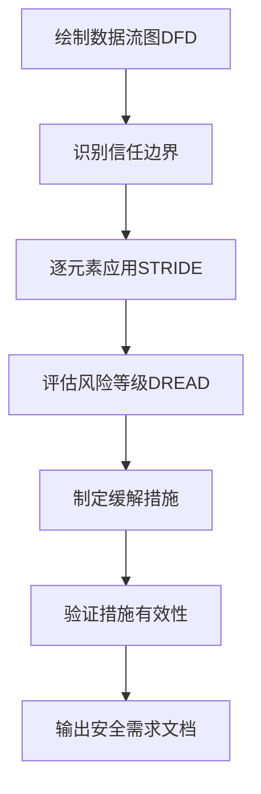
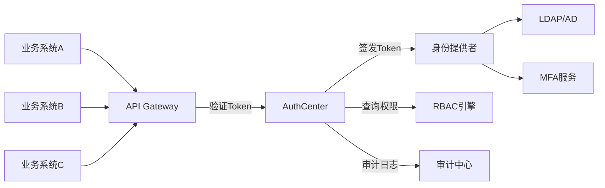
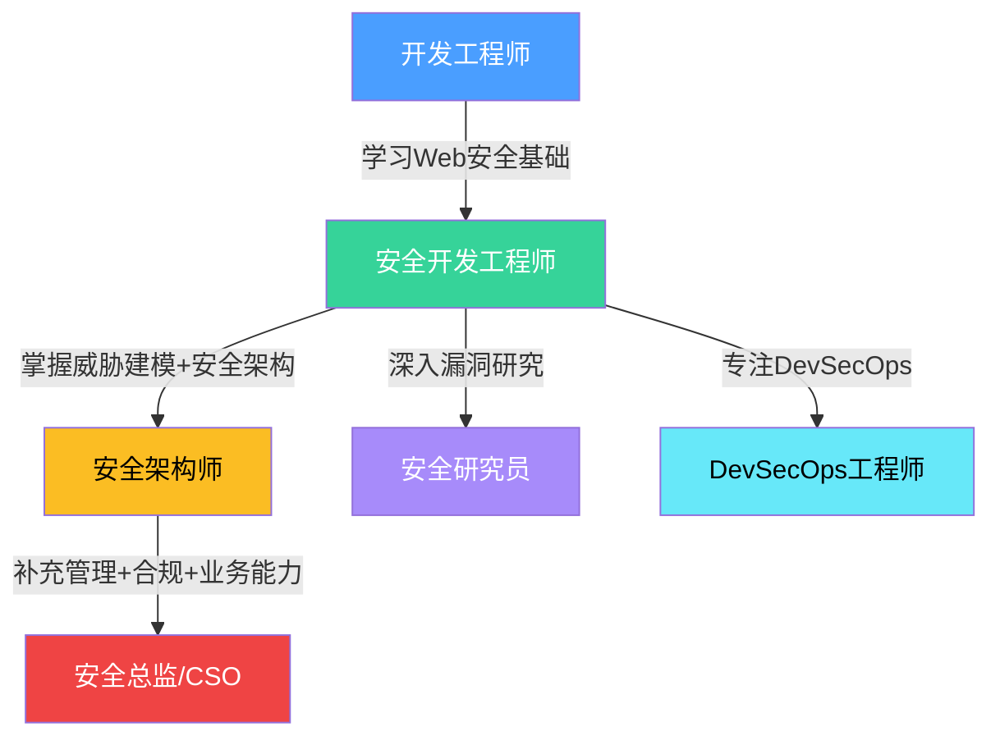

## 案例二：从开发到安全架构师

开发转安全，是信息安全行业中最被低估的转型路径之一。大多数安全从业者从运维或网络方向入行，但拥有深厚开发背景的安全人，在威胁建模、安全架构设计和DevSecOps落地方面具有天然优势。本案例完整记录李工从后端开发工程师成长为安全架构师、最终担任安全总监的全过程，拆解每个阶段的关键决策、技能跃迁和踩过的坑。

### 人物背景

李工，软件工程专业硕士，毕业后进入一家中型互联网公司（员工规模约800人，日活用户200万+）担任Java后端开发工程师。5年开发期间，他参与了支付系统、用户中台和微服务架构迁移等核心项目，积累了扎实的系统设计和编码能力。

**转型前的能力盘点**：

| 维度 | 水平 | 具体表现 |
|------|------|----------|
| 编程语言 | 精通Java，熟悉Python/Go | 能独立设计高并发系统 |
| 系统架构 | 中高级 | 主导过微服务拆分，熟悉分布式系统 |
| 数据库 | 熟练 | MySQL调优、Redis集群运维 |
| 网络知识 | 基础 | 了解HTTP/TCP，但不深入协议细节 |
| 安全知识 | 几乎为零 | 仅知道SQL注入和XSS的概念 |
| 项目管理 | 有经验 | 带过3-5人的开发小组 |

这个背景代表了一类典型的转型人群：技术扎实但安全知识空白，有架构思维但缺乏攻防视角。

### 转型契机：一次SQL注入事件

2019年Q3，公司遭遇了一次真实的安全事件。攻击者通过用户搜索接口的SQL注入漏洞，拖走了约12万条用户记录（含手机号和加密后的密码）。事件的直接原因是开发团队在老代码中使用了字符串拼接构造SQL查询。

李工被抽调参与应急修复。在排查过程中，他发现这个漏洞在代码中存在了将近两年，经历了三次代码审查都没被发现。这让他产生了两个强烈的认知：

1. **安全问题的本质是工程问题**——不是靠防火墙和WAF能解决的，必须从代码层面根治
2. **懂开发的安全人才极度稀缺**——安全团队的技术人员看不懂业务代码逻辑，开发团队的工程师不了解攻击手法

事件处理完毕后，公司决定组建"安全开发团队"（区别于传统安全运维团队），定位是将安全能力嵌入研发流程。李工主动申请加入，成为该团队的第一个成员。

### 第一阶段：安全开发工程师（第1-2年）

这个阶段的核心任务是：**从开发者视角建立安全知识体系，同时利用开发优势快速产出成果**。

#### 学习路径：开发者的安全速成法

李工没有走传统安全从业者"先学攻防再学防御"的路径，而是采取了**"从防御出发，反向理解攻击"**的策略：

**第一个月：Web安全基础**

重点学习OWASP Top 10（2017/2021版本），但不是死记硬背漏洞类型，而是逐一在代码层面复现：

```text
SQL注入 → 自己写一个有漏洞的登录接口 → 手动注入 → 用PreparedStatement修复
XSS → 在评论功能中植入script标签 → 理解DOM渲染流程 → 实现输出编码
CSRF → 构造恶意页面模拟转账请求 → 理解Cookie自动携带机制 → 实现Token验证
```

这种学习方式让每个漏洞都变成了**代码问题**，而不是抽象的安全概念。开发者理解漏洞的速度比非开发背景的人快3-5倍。

**第二到三个月：安全编码规范与工具**

| 学习内容 | 具体行动 | 产出 |
|----------|----------|------|
| 安全编码规范 | 阅读OWASP ASVS 4.0、CERT Java Secure Coding | 内部安全编码指南v1 |
| 静态分析 | 部署SonarQube + FindSecBugs，编写自定义规则 | 集成到CI的扫描流水线 |
| 依赖安全 | 引入OWASP Dependency-Check，建立漏洞库 | 自动化组件漏洞扫描 |
| 密码学应用 | 学习bcrypt/scrypt/Argon2，理解盐值和迭代次数 | 统一密码存储方案 |

**第四到六个月：代码审计实战**

开始对公司核心项目进行人工代码审计。李工的优势在此时充分展现——他熟悉业务逻辑，能快速定位数据流走向，审计效率比外部安全顾问高出数倍。

他总结出了一套**开发者友好的审计方法论**：

```text
1. 从入口点（Controller/Route）追踪用户输入
2. 标记所有不可信数据源（HTTP参数、Header、Cookie、文件上传）
3. 追踪数据流经过的每个处理函数
4. 检查数据在"汇点"（SQL查询、命令执行、文件操作、HTML渲染）是否经过验证/编码
5. 检查认证和授权检查是否覆盖所有敏感接口
```

6个月内，李工完成了对5个核心系统的审计，发现了23个高危漏洞、47个中危漏洞，其中包括：
- 2个支付逻辑绕过漏洞（可导致0元下单）
- 1个SSRF漏洞（可访问内网Redis集群）
- 4个越权访问漏洞（普通用户可查看他人订单）

#### 关键成果

**成果一：内部安全编码指南**

李工编写了一份约8万字的《Java安全编码指南》，涵盖了输入验证、认证授权、密码存储、日志安全、序列化安全等15个主题。与网上通用的安全编码规范不同，这份指南中的每个示例都来自公司真实代码（已脱敏），开发团队接受度极高。

**成果二：自动化安全测试平台v1**

基于GitLab CI，搭建了第一版自动化安全测试流水线：

```yaml
# .gitlab-ci.yml（简化版）
stages:
  - build
  - security-scan
  - deploy

sast-scan:
  stage: security-scan
  script:
    - sonar-scanner -Dsonar.projectKey=$CI_PROJECT_NAME
    - findbugs-cli -effort:max -high ./build/classes
  artifacts:
    paths:
      - security-reports/

dependency-check:
  stage: security-scan
  script:
    - dependency-check --project $CI_PROJECT_NAME --scan . --format HTML
  artifacts:
    paths:
      - dependency-check-report.html

secret-scan:
  stage: security-scan
  script:
    - gitleaks detect --source . --report-path gitleaks.json
  artifacts:
    paths:
      - gitleaks.json
```

这个平台上线后，**在代码合并前**就能拦截约60%的常见安全问题。

### 第二阶段：安全架构师（第3-5年）

经过两年的安全开发积累，李工从"做事的人"变成了"设计系统的人"。这个阶段的核心转变是：**从单点漏洞修复到系统性安全架构设计**。

#### 能力跃迁：从安全开发到安全架构

安全架构师和安全开发工程师的本质区别在于：

| 维度 | 安全开发工程师 | 安全架构师 |
|------|---------------|-----------|
| 关注点 | 单个漏洞、单个组件 | 整体系统、全链路 |
| 思维模式 | "这个代码有什么漏洞" | "这个系统应该怎么设计才安全" |
| 影响范围 | 一个项目、一个团队 | 全公司、所有业务线 |
| 核心能力 | 代码审计、安全编码 | 威胁建模、安全设计模式 |
| 交付物 | 修复方案、编码规范 | 安全架构蓝图、安全标准体系 |

#### 核心工作一：威胁建模体系

李工引入了STRIDE威胁建模方法，并将其改造为适合公司研发流程的轻量级版本。

**威胁建模的标准流程**：



**STRIDE在实际业务中的应用示例**（以用户登录模块为例）：

| 威胁类型 | 具体威胁 | 风险等级 | 缓解措施 |
|----------|---------|----------|---------|
| Spoofing（仿冒） | 攻击者冒充合法用户登录 | 高 | 多因素认证、设备指纹 |
| Tampering（篡改） | 篡改JWT Token中的用户角色 | 高 | Token签名验证、短有效期 |
| Repudiation（抵赖） | 用户否认进行了某笔交易 | 中 | 全链路审计日志、操作确认 |
| Information Disclosure（信息泄露） | 错误信息暴露系统架构 | 中 | 统一错误处理、日志脱敏 |
| Denial of Service（拒绝服务） | 暴力破解登录接口 | 高 | 限流、账户锁定、CAPTCHA |
| Elevation of Privilege（提权） | 普通用户获取管理员权限 | 高 | 最小权限原则、RBAC校验 |

李工要求所有新项目在设计评审阶段必须完成威胁建模，将其作为**设计评审的必选项**而非可选项。这一举措从源头上将安全左移到了架构设计阶段。

#### 核心工作二：DevSecOps流水线

李工主导设计了完整的DevSecOps流水线，将安全检查嵌入软件开发生命周期的每个阶段：

```text
┌──────────────────────────────────────────────────────────────┐
│                    DevSecOps 安全门禁体系                      │
├──────────┬──────────┬──────────┬──────────┬─────────────────┤
│  需求阶段  │  设计阶段  │  开发阶段  │  测试阶段  │   运行阶段      │
├──────────┼──────────┼──────────┼──────────┼─────────────────┤
│ 安全需求  │ 威胁建模  │ IDE插件   │ SAST扫描  │ RASP运行时防护  │
│ 验收标准  │ 架构评审  │ 提交检查   │ DAST扫描  │ WAF规则更新     │
│ 合规检查  │ 安全设计  │ 密钥检测   │ IAST测试  │ 安全监控告警    │
│          │ 模式库    │ 依赖检查   │ 渗透测试  │ 漏洞响应流程    │
└──────────┴──────────┴──────────┴──────────┴─────────────────┘
```

**关键集成点详解**：

**1. 代码提交阶段（Pre-commit Hook）**

```bash
#!/bin/bash
# .git/hooks/pre-commit
# 检查是否包含硬编码密钥
if git diff --cached --diff-filter=ACM | grep -iE '(password|secret|api_key|token)\s*=\s*["\x27][^"\x27]+'; then
    echo "[SECURITY] 检测到可能的硬编码密钥，请使用环境变量或密钥管理服务"
    exit 1
fi

# 检查是否包含危险函数调用
if git diff --cached --diff-filter=ACM | grep -E '(Runtime\.exec|ProcessBuilder|eval\(|exec\()'; then
    echo "[SECURITY] 检测到命令执行相关调用，请确认是否经过安全审查"
    exit 0  # 警告但不阻断
fi
```

**2. CI阶段安全门禁**

安全扫描结果按严重程度分级处理：
- 高危（Critical/High）：**阻断流水线**，必须修复后才能合并
- 中危（Medium）：生成告警工单，要求在下个迭代修复
- 低危（Low/Info）：记录到安全看板，季度集中清理

**3. 安全扫描覆盖率指标**

李工建立了一套量化的安全度量体系：

| 指标 | 定义 | 目标值 | 当时实际值 |
|------|------|--------|-----------|
| SAST覆盖率 | 已接入静态扫描的项目比例 | 100% | 85% |
| 高危漏洞修复率 | 高危漏洞在SLA内修复的比例 | 95% | 72% |
| 平均修复时间（MTTR） | 从发现到修复的平均耗时 | 高危<7天 | 高危12天 |
| 安全测试通过率 | 安全门禁一次通过的比例 | 90% | 68% |
| 代码审计覆盖率 | 核心系统人工审计频率 | 季度1次 | 年度1次 |

#### 核心工作三：安全基础设施建设

**1. 统一认证授权平台**

在李工之前，公司的认证授权实现散落在各个业务系统中，存在以下问题：
- 20+个系统各自实现登录逻辑，密码策略不统一
- 会话管理方式混乱（Session/JWT/自定义Token混用）
- 权限校验分散在业务代码中，无法统一管控

李工设计了统一的认证授权平台（AuthCenter），核心架构：



**2. 密钥管理服务（KMS）**

解决了公司密钥管理混乱的问题：
- 之前：数据库密码、API密钥写在配置文件中，部分甚至提交到了Git仓库
- 之后：所有密钥统一存储在HashiCorp Vault中，通过API动态获取，自动轮转

**3. 安全开发组件库**

封装了一系列安全组件供开发团队直接使用：

| 组件 | 功能 | 替代的不安全实践 |
|------|------|-----------------|
| SafeSQL | 参数化查询封装 | 字符串拼接SQL |
| SafeHTML | 输出编码（支持HTML/JS/URL/JSON上下文） | 直接拼接用户输入到HTML |
| AuthSDK | 统一认证SDK | 各业务自行实现登录逻辑 |
| CryptoUtil | 加密/签名/哈希工具类 | 自己实现加密算法或使用MD5 |
| RateLimiter | 分布式限流组件 | 无防护或单机限流 |
| AuditLogger | 结构化审计日志SDK | 分散的日志记录方式 |

#### 关键成就

**成就一：自动化安全测试平台**

这不再是v1版本的简单CI集成，而是一个完整的安全测试平台：
- 集成了SAST（SonarQube + Checkmarx）、DAST（OWASP ZAP自动化）、SCA（Dependency-Check + Snyk）三类扫描
- 支持扫描结果去重和误报标记
- 自动生成安全报告并推送到Jira
- 安全风险看板，支持按项目/团队/漏洞类型多维度统计

**成就二：等保三级认证**

李工作为技术负责人，主导公司通过了等保三级认证。这是国内信息安全等级保护的重要里程碑，涉及的技术要求包括：

| 等保域 | 关键要求 | 李工的落地措施 |
|--------|---------|---------------|
| 安全通信网络 | 网络架构安全、通信传输加密 | 全站HTTPS、内网微服务mTLS |
| 安全区域边界 | 访问控制、入侵防范 | 零信任网络架构、IDS/IPS部署 |
| 安全计算环境 | 身份鉴别、访问控制、数据完整性 | 统一AuthCenter、数据签名 |
| 安全管理中心 | 集中管控、审计、分析 | SIEM平台、集中日志管理 |
| 安全管理制度 | 制度体系、人员管理、安全培训 | 30+安全制度文档、年度培训计划 |

**成就三：安全事件大幅下降**

量化数据证明了安全架构的价值：

```text
安全事件统计对比（转型前 vs 转型后两年）：
┌─────────────────┬──────────┬──────────┬────────┐
│ 指标             │ 2019年   │ 2021年   │ 变化   │
├─────────────────┼──────────┼──────────┼────────┤
│ 高危漏洞（生产）  │ 23个     │ 4个      │ -83%   │
│ 安全事件         │ 5起      │ 1起      │ -80%   │
│ 平均修复时间      │ 14天     │ 3天      │ -79%   │
│ 渗透测试通过率    │ 45%      │ 88%      │ +96%   │
│ 安全培训覆盖率    │ 30%      │ 95%      │ +217%  │
└─────────────────┴──────────┴──────────┴────────┘
```

### 第三阶段：安全总监（第6年起）

从安全架构师到安全总监，核心转变是从**技术管理**到**组织管理**，从**安全团队负责人**到**公司安全战略制定者**。

#### 角色转变

| 维度 | 安全架构师 | 安全总监 |
|------|-----------|---------|
| 工作重心 | 技术方案设计与落地 | 战略规划、团队管理、跨部门协调 |
| 汇报对象 | 技术VP/CTO | CEO/董事会 |
| 核心挑战 | "怎么做" | "做什么、为什么做、投入多少" |
| 决策影响 | 技术选型、架构方案 | 安全预算、人员编制、业务优先级 |
| 必备技能 | 威胁建模、安全设计 | 风险管理、合规治理、商业思维 |

#### 核心工作内容

**1. 安全战略规划**

每年制定安全年度规划，核心框架：

```text
安全战略规划 = 业务目标对齐 + 风险评估 + 资源分配 + 成熟度路线图

具体步骤：
1. 与各业务线负责人沟通，了解年度业务重点
2. 评估当前安全成熟度（参考NIST CSF或类似框架）
3. 识别与业务目标相关的安全风险
4. 按风险等级和业务影响排序
5. 制定分阶段的改进计划
6. 编制安全预算申请
7. 建立可量化的安全KPI体系
```

**2. 安全团队建设**

李工将安全团队从最初的1人扩展到了12人，团队结构如下：

```text
安全总监（李工）
├── 安全架构组（3人）
│   ├── 安全架构师 × 2
│   └── 安全开发工程师 × 1
├── 安全运营组（4人）
│   ├── SOC分析师 × 2
│   ├── 安全运维工程师 × 1
│   └── 应急响应工程师 × 1
├── 安全合规组（2人）
│   ├── 合规专家 × 1
│   └── 风险评估师 × 1
└── 安全研究组（2人）
    ├── 漏洞研究员 × 1
    └── 威胁情报分析师 × 1
```

**3. 安全与业务的平衡**

这是安全总监最核心的挑战。李工总结出了一套**安全决策框架**：

```text
安全决策四象限：
                    业务影响高
                        │
         ┌──────────────┼──────────────┐
         │   立即投入     │   战略规划     │
         │  （紧急高危）   │ （长期安全建设）│
         │  例：0day漏洞  │  例：零信任改造 │
业务紧急──┼──────────────┼──────────────┤──业务不紧急
         │   快速响应     │   持续监控     │
         │  （应急处置）   │ （日常运营）   │
         │  例：安全事件   │  例：安全培训  │
         └──────────────┼──────────────┘
                        │
                    业务影响低
```

**关键原则**：安全措施不能成为业务发展的阻碍。当安全要求与业务目标冲突时，不是简单地说"不"，而是寻找**风险可控的替代方案**。

例如，业务团队要求快速上线一个新功能，但安全评估发现存在中等风险。李工的做法是：
- 不阻断上线，但要求在2周内完成安全加固
- 先部署WAF规则作为临时防护
- 将安全修复纳入下个迭代的必做任务
- 持续监控该功能的安全指标

### 踩过的坑与反思

#### 坑一：过度追求安全完美

早期李工试图让所有系统都达到最高安全标准，结果是：
- 开发团队抱怨安全流程拖慢了交付速度
- 业务负责人对安全团队产生抵触情绪
- 安全团队陷入"救火"模式，无暇做长期建设

**教训**：安全是风险管理，不是消除风险。要根据业务场景和数据敏感度分级管控，核心系统严格管控，边缘系统适度放宽。

#### 坑二：忽视人的因素

李工最初把大量精力放在技术工具上，忽略了安全意识培训。结果：
- 开发人员绕过安全扫描（手动合并代码跳过CI）
- 运维人员使用弱密码管理服务器
- 员工点击钓鱼邮件导致账号被盗

**教训**：安全工具只解决30%的问题，70%的安全问题根源于人。必须持续投入安全意识培训，且培训要贴近实际工作场景，而不是照本宣科。

#### 坑三：安全团队孤立运作

安全团队一度成为"公司里最难合作的部门"——总是在项目快上线时提出安全问题，给开发团队"找麻烦"。

**教训**：安全团队必须嵌入业务，而不是凌驾于业务之上。李工后来推行了**安全BP（Business Partner）制度**，每个安全工程师对接1-2个业务团队，参与其日常站会和设计评审，将安全检查前移到设计阶段，避免了"上线前才发现问题"的尴尬。

#### 坑四：过度依赖单一工具

曾经全面押注某商业SAST产品，结果：
- 该产品对公司的技术栈支持不佳，误报率高达40%
- 开发团队被大量误报淹没，开始忽略安全告警
- 更换工具时发现历史数据迁移困难

**教训**：不要把鸡蛋放在一个篮子里。采用多工具组合策略，每个工具覆盖不同的安全检测面，且确保数据可导出、可迁移。

### 给开发转型安全者的建议

#### 能力发展路线图



#### 开发者转型安全的核心优势

1. **代码理解能力**：能直接阅读业务代码，发现安全问题的效率远超纯安全背景的人
2. **系统思维**：理解分布式系统、微服务架构，能设计出可落地的安全方案
3. **工程化能力**：能将安全能力产品化、自动化，而不是依赖人工检查
4. **开发团队沟通**：能用开发者听得懂的语言解释安全问题，推动修复的阻力更小

#### 需要补齐的能力短板

| 短板领域 | 具体内容 | 学习建议 |
|----------|---------|---------|
| 攻防实战 | 缺乏真实攻击经验 | 参加CTF、HVV演练、Bug Bounty |
| 网络安全 | 协议层面理解不深 | 学习Wireshark抓包分析、TCP/IP详解 |
| 合规治理 | 不了解安全法规和标准 | 学习等保2.0、GDPR、ISO 27001 |
| 安全运营 | 缺乏应急响应经验 | 参与安全事件应急、学习DFIR |
| 商业思维 | 不懂安全投入产出比 | 学习风险管理、安全经济学 |

#### 必考认证建议

| 认证 | 定位 | 适合阶段 | 难度 |
|------|------|---------|------|
| CEH（道德黑客） | 入门级安全认证 | 转型初期 | ★★☆ |
| CompTIA Security+ | 安全基础认证 | 转型初期 | ★★☆ |
| CSSLP（安全软件生命周期） | 安全开发专业认证 | 安全开发阶段 | ★★★ |
| CISSP（信息系统安全专业人员） | 安全管理高级认证 | 安全架构师阶段 | ★★★★ |
| CISM（信息安全经理） | 安全管理认证 | 安全总监阶段 | ★★★★ |
| CCSP（云安全专业人员） | 云安全认证 | 架构师/总监阶段 | ★★★★ |

#### 推荐阅读清单

**安全开发类**：
- 《安全编码实践指南》（OWASP）
- 《Iron-Clad Java: Building Secure Web Applications》
- 《Tangled Web: A Guide to Securing Modern Web Applications》

**安全架构类**：
- 《Security Engineering》（Ross Anderson）
- 《威胁建模：设计和交付更安全的软件》（Adam Shostack）
- 《Building Secure and Reliable Systems》（Google SRE系列）

**管理与战略类**：
- 《CISO Desk Reference Guide》
- 《信息安全管理：从理论到实践》
- 《网络安全与首席安全官》

### 总结：开发转安全的核心心法

1. **跨界是优势，不是劣势**：开发者理解代码和系统的能力是安全领域最稀缺的复合型能力。不要觉得自己"安全基础差"，你的开发基础就是最大的安全资本。

2. **从代码出发，从防御切入**：不需要先成为黑客才能做安全。从安全编码、代码审计、威胁建模入手，利用开发背景快速产出成果，建立信心。

3. **安全必须嵌入工程流程**：试图在开发流程之外"加一层安全"注定失败。将安全检查嵌入CI/CD、将安全组件封装为开发工具、将安全评审融入设计流程——让安全成为开发的默认行为。

4. **量化安全价值**：用数据说话。漏洞数量下降了多少？修复时间缩短了多少？安全事件减少了多少？这些数字是你获得资源和话语权的基础。

5. **平衡安全与业务**：安全的终极目标是让业务安全地运行，而不是阻止业务运行。学会用风险的语言和业务团队对话，而不是用技术术语吓唬人。

6. **持续学习，保持技术敏感度**：安全领域变化极快，新的攻击手法、新的技术架构、新的合规要求不断涌现。保持每天至少1小时的学习习惯，关注安全社区动态。
