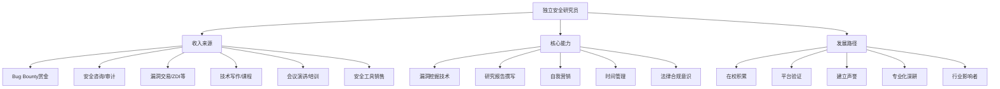
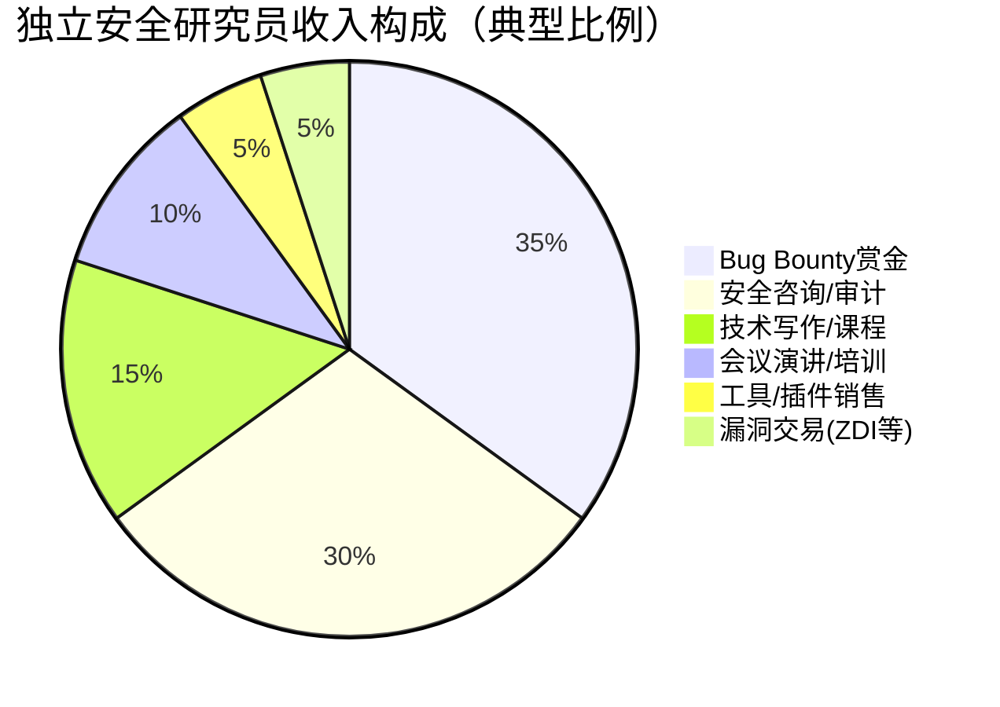
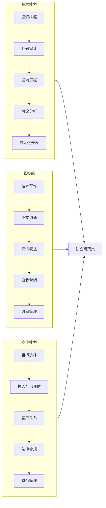

## 案例三：独立安全研究员的成长

### 人物背景

小赵，信息安全专业本科，在校期间就对漏洞挖掘有浓厚兴趣。与大多数同学选择进入企业安全部门不同，他决定成为独立安全研究员，专注于移动安全领域。这条路没有固定的薪资、没有公司背书、没有团队协作，一切靠研究成果和行业声誉说话。

独立安全研究员（Independent Security Researcher）是一种特殊的职业形态：不受雇于任何单一企业，通过自主发现漏洞、发表研究成果、参与漏洞赏金计划、提供安全咨询等方式获得收入。这条路径的门槛看似很低（任何人都可以注册Bug Bounty平台），但要做到可持续发展、养活自己并建立行业影响力，需要极强的自律能力、技术深度和商业意识。



### 发展历程

#### 第一阶段：在校积累期（4年）

小赵的大学四年并非只在上课，而是有意识地构建安全研究的基础设施。

**课程学习与自学并行**

信息安全专业的课程为他提供了理论框架：计算机网络、操作系统原理、密码学、软件工程。但课堂知识远远不够，他把大量时间投入到自学中：

- **第一年**：打牢编程基础，熟练掌握C、Python、Java三门语言。C语言让他理解内存管理，Python是自动化脚本的首选，Java则是Android开发的基础。同时系统学习Linux操作系统，从Ubuntu开始，逐步过渡到Kali Linux和自建的Arch Linux研究环境。
- **第二年**：开始接触安全工具链。学习Wireshark抓包分析、Burp Suite代理拦截、IDA Pro逆向分析。通过OverTheWire的Bandit、Natas等Wargame磨练基础技能。阅读经典书籍《Android Internals》《The Mobile Application Hacker's Handbook》建立移动安全知识框架。
- **第三年**：转向实战。在Vulnhub上搭建靶机练习渗透测试，在Android模拟器中逆向分析真实App。开始关注CVE编号体系、漏洞披露流程、CNVD/补天等国内平台的运作机制。
- **第四年**：全力冲刺漏洞挖掘。注册补天、漏洞盒子等国内SRC平台，同时开始尝试HackerOne等国际平台。以Android应用为目标，从组件暴露、WebView漏洞、本地数据存储等低风险漏洞入手。

**CTF比赛的系统训练**

CTF比赛是安全能力的综合检验。小赵的参与策略：

| 比赛类型 | 代表赛事 | 收获的能力 |
|----------|----------|-----------|
| Jeopardy解题赛 | XCTF、强网杯 | Web/逆向/Pwn/密码学单向深入 |
| 攻防对抗赛（AWD） | 网鼎杯、CISCN | 快速漏洞发现与修复能力 |
| Attack-Defense | DEF CON CTF | 高级漏洞利用、实时对抗 |
| 实战靶场赛 | Hack The Box | 真实环境渗透测试能力 |

他在大三时获得了全国大学生信息安全竞赛（CISCN）二等奖，这次获奖让他确认了自己在安全领域的潜力。

**第一批漏洞的发现**

大三下学期，小赵在补天平台上提交了第一个被确认的漏洞——某知名电商App的本地数据明文存储漏洞。这个漏洞技术含量不高，但对他的信心建立至关重要。随后他在三个月内连续发现了十余个中低危漏洞，逐步积累了平台信用分。

关键发现：某知名即时通讯App的WebView组件存在JavaScript接口暴露，通过构造恶意页面可以读取本地通讯录数据。这个漏洞被评定为高危，厂商发出了致谢公告，并在App更新日志中署名感谢。这是小赵第一次感受到安全研究的社会价值。

**技术博客的建立**

从大二开始，小赵在个人博客上记录学习笔记和技术分析。他的写作策略很清晰：

- 不写入门教程（网上太多了），只写自己独立发现的技术细节
- 每篇漏洞分析文章都包含完整的复现步骤、根因分析和修复建议
- 使用脱敏后的实际案例，而不是虚构的演示环境
- 坚持用中英双语发布，扩大读者群

到毕业时，博客累计发表了40余篇文章，在安全社区积累了一定的知名度。这些文章后来成为他求职和接项目的最有力背书。

#### 第二阶段：职业探索期（毕业后第1年）

毕业后的选择是一个关键节点。小赵没有选择"稳妥"的企业岗位，而是加入了一家安全创业公司，但合同中明确保留了独立研究的时间。这家公司的优势是能接触到更多企业级项目，同时团队氛围鼓励个人研究。

**国际会议的突破**

毕业半年后，小赵将自己在移动安全领域的研究成果整理成演讲稿，投递了Black Hat USA和DEF CON的Call for Papers（CFP）。投递前的准备：

1. **选题策略**：不选泛泛的"Android安全概述"，而是聚焦一个具体的攻击面——Android第三方SDK供应链攻击。这个选题结合了移动安全和供应链安全两个热点，且有自己半年的研究数据支撑。
2. **研究深度**：对国内Top 500应用的SDK集成情况做了全面扫描，发现了多个SDK存在同一后端API的硬编码密钥，影响数亿用户。
3. **演讲准备**：反复练习英文演讲，录制视频回放检查语速和肢体语言。找英语母语的朋友帮忙润色幻灯片。

Black Hat的演讲获得了成功。Q&A环节有来自Google Android安全团队的研究员主动交流，会后收到了多封邮件，包括大厂的安全岗位邀请和安全咨询公司的合作邀请。

**研究方法论的成型**

在这一年中，小赵逐步形成了自己的漏洞研究方法论：

```text
独立安全研究员的五步研究流程：

1. 目标选择（Target Selection）
   ├── 确定研究领域和目标范围
   ├── 分析目标的攻击面
   └── 评估投入产出比

2. 信息收集（Reconnaissance）
   ├── 应用逆向与代码审计
   ├── 网络流量分析
   ├── API端点枚举
   └── 第三方组件识别

3. 漏洞发现（Vulnerability Discovery）
   ├── 静态分析（代码审计、模式匹配）
   ├── 动态分析（Fuzzing、Hooking）
   ├── 逻辑分析（业务流程、权限模型）
   └── 组合利用（单个低危→链式高危）

4. 验证与报告（Verification & Reporting）
   ├── 漏洞可复现性验证
   ├── 影响范围评估
   ├── 编写技术报告
   └── 负责任披露

5. 后续跟进（Follow-up）
   ├── 与厂商安全团队沟通
   ├── 跟踪修复进度
   ├── 复测确认修复有效
   └── 撰写公开分析文章
```

#### 第三阶段：独立研究期（第2-3年）

在创业公司工作一年后，小赵决定成为完全独立的安全研究员。做出这个决定的条件：

- 积累了6个月的生活费储备（约5万元）
- 已有稳定的漏洞赏金收入来源
- 有2-3个固定的安全咨询客户
- 在安全社区建立了基本的个人品牌

**日常工作的结构**

独立研究员的工作并不"自由"，反而需要更强的自律：

| 时间段 | 工作内容 | 占比 |
|--------|---------|------|
| 09:00-12:00 | 核心漏洞挖掘（最需要集中注意力的工作） | 30% |
| 12:00-13:00 | 午餐与安全社区信息浏览 | 5% |
| 13:00-15:00 | 自动化工具开发与维护 | 15% |
| 15:00-17:00 | 漏洞报告撰写与厂商沟通 | 15% |
| 17:00-18:30 | 技术文章写作与博客维护 | 10% |
| 20:00-22:00 | 学习新技术、阅读安全论文 | 15% |
| 灵活安排 | 咨询项目与审计工作 | 10% |

**移动安全研究的技术栈**

小赵在移动安全领域建立了一套完整的技术栈：

**Android安全研究工具链：**

| 工具 | 用途 | 使用场景 |
|------|------|---------|
| jadx / jadx-gui | APK反编译 | 静态代码审计的第一步 |
| Frida | 动态Hook框架 | 运行时数据拦截、函数劫持 |
| Objection | 移动安全评估 | 快速枚举应用组件和数据 |
| apktool | APK解包与重打包 | 修改应用进行中间人测试 |
| Burp Suite | HTTP/HTTPS代理 | API接口抓包与篡改 |
| Drozer | Android安全测试 | 组件暴露、权限提升检测 |
| MobSF | 移动安全框架 | 自动化静态分析 |
| mitmproxy | 命令行代理 | 自动化流量拦截脚本 |
| Ghidra | 逆向工程 | Native层代码分析 |
| r2frida | Frida + radare2 | 深度内存分析 |

**iOS安全研究工具链：**

| 工具 | 用途 | 使用场景 |
|------|------|---------|
| class-dump | 导出类头文件 | 快速了解应用架构 |
| Cycript | 运行时操控 | 实时修改应用行为 |
| Frida (iOS) | 动态Hook | 跨平台Hook统一方案 |
| Needle | iOS安全测试 | 自动化安全评估 |
| iRET | iOS逆向工程 | 集成化逆向工具包 |
| Keychain-Dumper | 钥匙串提取 | 敏感数据存储审计 |

**典型漏洞挖掘案例：某支付App的账户接管漏洞**

这是小赵发现的一个高危漏洞的完整过程（已脱敏）：

1. **目标选择**：选择了一款用户量超过5000万的支付类App，原因是在补天平台上的赏金较高（高危漏洞5000-20000元）。
2. **信息收集**：使用apktool解包APK，jadx反编译Java代码。在代码中搜索硬编码密钥、API端点、敏感字符串。发现应用使用了自定义的Token刷新机制。
3. **漏洞发现**：通过Frida Hook Token刷新接口，发现新Token的生成算法仅依赖用户ID和时间戳，不包含服务端验证。通过修改请求中的用户ID，可以获取任意用户的有效Token。
4. **影响评估**：该漏洞可以实现任意用户的账户接管，包括查看余额、发起转账等敏感操作。影响范围：所有已登录用户（约3000万活跃用户）。
5. **报告提交**：通过补天平台提交详细报告，包含完整的复现步骤、PoC代码、影响范围分析和修复建议。
6. **结果**：漏洞被确认为严重级别，厂商在48小时内修复。小赵获得了20000元赏金和公开致谢。

**收入构成分析**

成为独立研究员后，小赵的收入来源逐渐多元化：



| 收入来源 | 月均收入（稳定期） | 说明 |
|----------|-------------------|------|
| Bug Bounty赏金 | 8,000-15,000元 | 波动较大，取决于发现的漏洞等级 |
| 安全咨询/审计 | 10,000-20,000元 | 每月1-2个小项目，相对稳定 |
| 技术文章/付费专栏 | 3,000-5,000元 | 知识星球、付费专栏等 |
| 会议演讲/培训 | 2,000-8,000元 | 不定期，单次收入较高 |
| 安全工具/脚本 | 1,000-3,000元 | 被动收入，持续积累 |

年收入范围：30万-60万元（取决于研究产出和项目数量）。前两年收入波动较大，第三年开始趋于稳定。

#### 第四阶段：专业化深耕与行业影响（第3年至今）

**从"找漏洞"到"理解系统"**

小赵在第三年开始意识到，单纯的漏洞挖掘有天花板。真正的突破来自于对系统架构的深度理解。他开始花大量时间研究Android系统源码、厂商定制ROM的安全机制、移动支付的协议栈设计。

这个转变带来了两个重要成果：

1. **发现了一个影响所有Android设备的系统级漏洞**：该漏洞存在于Android的权限管理模型中，通过特定的Intent组合可以绕过权限检查。这个发现让他获得了Google Android安全团队的致谢和CVE编号。
2. **发表了系统性的移动供应链安全研究报告**：对国内Top 1000应用的SDK集成模式做了全面分析，揭示了多个SDK共享同一后端基础设施带来的安全风险。这份报告被多家安全媒体报道。

**培养新人与社区贡献**

小赵开始在社区中扮演导师角色：

- 在GitHub上开源了自己开发的移动安全自动化测试框架
- 在安全社区（先知、看雪论坛、FreeBuf）定期发布技术文章
- 指导了5名在校学生入门安全研究，其中2人后来成为了全职安全研究员
- 受邀在多所高校做安全讲座

**从独立到团队的抉择**

到了第四年，小赵面临一个重要抉择：继续保持独立，还是组建团队？经过深思熟虑，他选择了折中方案——与2-3位信任的同行组成松散的研究小组，共享情报但各自独立工作。这种模式的优势：

- 可以承接更大的安全审计项目
- 研究方向互补（他专注移动安全，其他成员专注Web和IoT）
- 保持了独立性，不受公司制度约束
- 风险分担，个人收入波动减小

### 独立研究员的核心技能模型



每个能力维度的具体要求：

**技术能力**

| 技能层级 | 入门要求 | 精通标准 |
|----------|---------|---------|
| 漏洞挖掘 | 能在DVWA等靶场找到OWASP Top 10漏洞 | 能在真实系统中发现0-day，具备独立CVE |
| 代码审计 | 能读懂常见语言的代码逻辑 | 能审计百万行级代码库，建立审计方法论 |
| 逆向工程 | 能使用IDA/Ghidra分析简单二进制 | 能逆向混淆后的Native代码、对抗反调试 |
| 协议分析 | 能用Wireshark抓包分析HTTP流量 | 能逆向私有协议、实现自定义客户端 |
| 自动化开发 | 能写Python脚本调用API | 能构建完整的漏洞扫描/监控平台 |

**软技能**

独立研究员最容易忽视的就是软技能，但它们决定了收入上限：

- **技术写作**：漏洞报告的质量直接影响赏金金额和厂商的配合度。一份好的报告应包含：漏洞概述、影响范围、复现步骤（含截图和代码）、根因分析、修复建议。
- **英文沟通**：国际平台（HackerOne、Bugcrowd）的赏金是国内平台的5-10倍，英文沟通能力直接决定收入天花板。
- **演讲表达**：会议演讲是建立行业影响力的最有效方式，但需要大量练习。
- **自我营销**：在Twitter/X、GitHub、博客上持续输出高质量内容，建立个人品牌。

**商业能力**

| 能力 | 具体要求 | 常见错误 |
|------|---------|---------|
| 目标选择 | 评估目标的攻击面大小、竞争程度、赏金水平 | 盲目追热门目标，忽视冷门高价值目标 |
| 投入产出 | 设定时间上限，避免在一个目标上陷入过深 | "再试一下"心态导致时间沉没 |
| 客户关系 | 及时响应、专业沟通、超预期交付 | 报告敷衍、沟通不及时 |
| 法律合规 | 了解《网络安全法》、漏洞披露规则 | 越界测试、未授权访问 |
| 财务管理 | 税务申报、收入储备、保险配置 | 收入不稳定时无储蓄缓冲 |

### 独立研究员的常见陷阱与应对

| 陷阱 | 表现 | 应对策略 |
|------|------|---------|
| 收入不稳定焦虑 | 连续几个月赏金收入低，开始怀疑职业选择 | 建立6个月生活费储备；发展咨询等稳定收入源 |
| 孤独感 | 没有同事交流，遇到困难无人讨论 | 加入安全研究社群；定期参加线下Meetup |
| 技术瓶颈 | 持续使用相同的挖掘方法，产出下降 | 定期学习新领域；与不同方向的研究者交流 |
| 法律风险 | 不清楚测试边界，可能触犯法律 | 严格遵守平台规则；不测试未授权目标 |
| 健康问题 | 久坐、熬夜、视力下降 | 固定运动时间；使用护眼模式；定期体检 |
| 竞争压力 | 热门目标被多人研究，漏洞先被别人提交 | 深耕冷门领域；建立独特的情报来源 |
| 职业倦怠 | 长期高强度研究导致兴趣下降 | 轮换研究方向；设定阶段性目标和奖励 |

### 与其他职业路径的对比

| 维度 | 独立研究员 | 企业安全研究员 | 安全咨询师 |
|------|-----------|---------------|-----------|
| 收入上限 | 高（取决于能力和运气） | 中高（受限于职级体系） | 高（取决于客户数量） |
| 收入稳定性 | 低（波动大） | 高（固定薪资） | 中（项目制） |
| 技术自由度 | 极高（自己选方向） | 中（受限于公司业务） | 中（受限于客户需求） |
| 工作自主性 | 极高 | 低（需打卡坐班） | 中（需配合客户时间） |
| 社交需求 | 低（适合内向型） | 高（团队协作） | 高（客户沟通） |
| 适合人群 | 自律、技术强、能承受不确定性 | 喜欢稳定、团队协作 | 沟通能力强、商业敏感 |
| 职业天花板 | 安全公司创始人/行业KOL | CSO/CTO | 合伙人/创业 |

### 可复制的成长清单

如果你也想走独立安全研究员这条路，以下是按时间线整理的可执行清单：

**在校期间（4年）**

- [ ] 精通至少一门编程语言（推荐Python + C/Go）
- [ ] 熟练使用Linux，建立自己的安全研究环境
- [ ] 完成至少2个系统性的在线安全课程（如PortSwigger Academy）
- [ ] 参加至少10场CTF比赛，建立解题方法论
- [ ] 注册补天/HackerOne，累计提交至少20个漏洞
- [ ] 获得至少1个CVE编号
- [ ] 建立技术博客，累计发表30篇以上高质量文章
- [ ] 至少1次国内安全会议演讲或分享
- [ ] 建立安全研究的Twitter/X账号，关注行业KOL
- [ ] 参加至少3次线下安全Meetup，建立人脉

**毕业后第1年**

- [ ] 加入安全公司或创业公司积累经验（可选）
- [ ] 投递并被Black Hat/DEF CON/CanSecWest等国际会议接受
- [ ] 在HackerOne/Bugcrowd上建立声誉（累计赏金超过$5000）
- [ ] 确定1-2个垂直研究方向
- [ ] 开发至少1个开源安全工具
- [ ] 与3-5位安全研究员建立合作关系

**独立研究员第1年**

- [ ] 建立稳定的收入来源（至少2种收入渠道）
- [ ] 建立日常工作流程和时间管理机制
- [ ] 完成至少1个有影响力的安全研究报告
- [ ] 在行业媒体上发表至少1篇文章（FreeBuf、安全客等）
- [ ] 建立客户关系管理系统

**独立研究员第2-3年**

- [ ] 年收入达到30万元以上
- [ ] 拥有至少3个CVE编号
- [ ] 在国际会议上至少有2次演讲经历
- [ ] 指导至少2名新人入门安全研究
- [ ] 考虑组建松散研究团队

### 从"找漏洞"到"理解系统"的认知升级

很多独立研究员在第一阶段（找漏洞）停留太久，陷入"低垂果实"陷阱——只找容易发现的漏洞，如XSS、IDOR、信息泄露等。这些漏洞赏金低、竞争大、重复性高。

突破的关键在于认知升级：从"找漏洞"转向"理解系统"。

**三个认知层次：**

1. **模式匹配（初级）**：看到输入框就试XSS，看到API就试越权。这个阶段效率最高但天花板最低。
2. **架构理解（中级）**：理解系统的整体架构，识别信任边界、数据流、认证授权模型。能找到更深层的逻辑漏洞。
3. **生态洞察（高级）**：从供应链、SDK、第三方服务的角度看问题。一个漏洞可能影响数百个应用。这个层次的研究价值最高，但需要长期积累。

小赵的突破正是在第三个层次——当他开始研究移动应用的SDK供应链安全时，发现了影响数亿用户的系统性问题，而不是单个应用的孤立漏洞。

### 法律与伦理框架

独立安全研究员必须严格遵守法律和伦理底线：

**必须遵守的规则：**

1. **只在授权范围内测试**：只测试Bug Bounty平台明确授权的目标，不测试未授权的系统
2. **负责任披露**：发现漏洞后先报告给厂商，等修复后再公开细节
3. **不越界**：不下载、不存储、不传播用户数据；不修改系统数据
4. **遵守平台规则**：每个Bug Bounty平台都有自己的规则，必须严格遵守

**中国法律相关条款：**

- 《网络安全法》第二十七条：不得从事非法侵入他人网络、干扰他人网络正常功能、窃取网络数据等危害网络安全的活动
- 《刑法》第二百八十五条：非法侵入计算机信息系统罪、非法获取计算机信息系统数据罪
- 《数据安全法》：对数据处理活动的安全要求

**自我保护措施：**

- 保留所有测试的完整日志和截图
- 使用独立的测试设备和网络环境
- 不在测试中使用真实用户数据
- 与厂商的沟通全部留痕（邮件、平台消息）
- 购买专业责任保险（可选但推荐）

### 经验总结

1. **早期积累决定上限**：在校期间建立的技术基础、社区存在感和人脉网络，是独立研究员最宝贵的资产。没有这个基础，毕业后直接做独立研究几乎不可能成功。

2. **专注一个方向是必经之路**：安全领域太广，什么都做意味着什么都不精。选择一个垂直方向（如移动安全、IoT安全、云安全）深入研究，建立专业壁垒。

3. **成果是最好的简历**：CVE编号、漏洞赏金记录、会议演讲、技术文章——这些比任何学历和证书都有说服力。独立研究员没有公司背书，个人品牌就是一切。

4. **国际化视野不可忽视**：国内平台的赏金通常是国际平台的1/5到1/10。英文能力直接决定收入天花板。同时，国际社区的研究氛围、信息披露规范、合作模式都值得学习。

5. **技术深度比广度更重要**：与其知道100种漏洞类型，不如对1种漏洞类型有100种挖掘方法。深度带来稀缺性，稀缺性带来高价值。

6. **自律是独立的前提**：没有老板监督、没有打卡制度、没有同事推动——独立研究员的每一天都是自我管理的考试。建立固定的作息、工作流程和产出目标，是长期生存的基础。

7. **建立缓冲，管理风险**：独立研究的最大风险是收入不稳定。至少储备6个月的生活费，并发展多元化的收入来源。当一项收入下降时，其他收入可以兜底。

8. **社区是力量之源**：独立不等于孤立。积极参与安全社区，与同行交流，分享知识——社区是获取情报、找到合作、获得认可的核心渠道。
