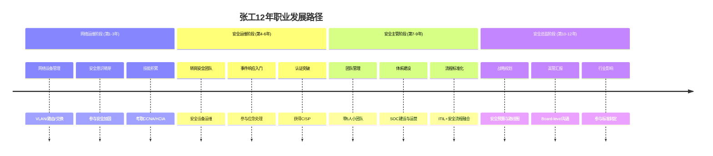
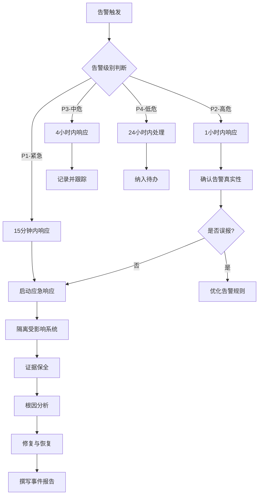
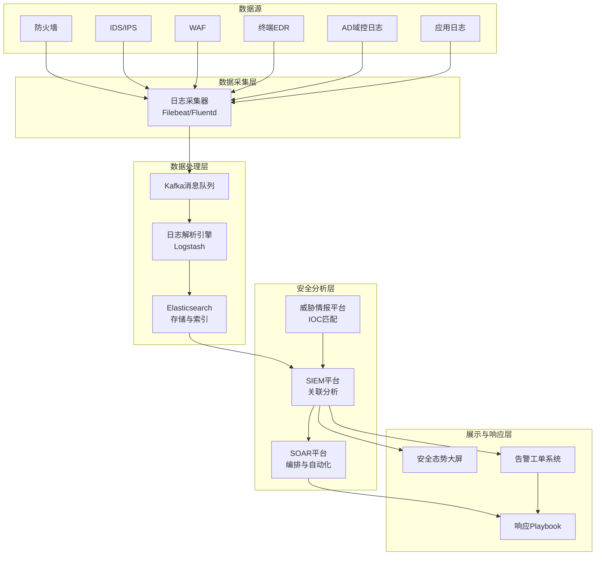

## 案例四：从安全运维到安全总监

> 从拧螺丝的运维工，到掌舵整个企业安全体系的总监——这条路走了12年，每一步都不是白费的。

### 人物档案

| 项目 | 详情 |
|------|------|
| 化名 | 张工 |
| 学历 | 网络工程专业本科（普通一本） |
| 起点 | 传统制造业企业网络运维工程师 |
| 终点 | 某上市公司安全总监（管理20+人团队） |
| 总耗时 | 约12年 |
| 认证 | CISP、CISSP、CISA |
| 年薪变化 | 8万 → 60万+（不含股权激励） |

张工的故事之所以典型，是因为他没有名校光环、没有大厂背景，靠的是**扎实的运维底子 + 持续的能力拓展 + 关键时刻的主动担当**。这条路径对大多数非科班出身的安全从业者来说，参考价值极高。

### 职业发展全景图

---

### 第一阶段：网络运维（第1-3年）

#### 岗位职责

张工毕业后进入一家制造业企业，负责公司总部及三个工厂的网络基础设施运维：

- **设备管理**：维护约200台网络设备（交换机、路由器、防火墙），包括华为、华三和思科的混合环境
- **日常巡检**：每日检查网络链路状态、设备CPU/内存利用率、端口流量异常
- **故障处理**：平均每月处理15-20起网络故障，从简单的端口宕机到复杂的环路排查
- **变更管理**：执行网络割接、VLAN调整、ACL策略变更

#### 关键成长

这个阶段张工积累了**网络安全最重要的底层基础**——对网络协议和架构的深入理解。很多安全从业者缺乏这一层，导致后续在分析流量、理解攻击路径时总是浮在表面。

**具体技能收获：**

| 技能领域 | 掌握程度 | 后续价值 |
|----------|----------|----------|
| TCP/IP协议栈 | 能抓包分析三次握手、重传、窗口缩放 | 流量分析、入侵检测的基础 |
| 路由交换 | OSPF/BGP基本原理，VLAN间路由 | 理解网络分段与微隔离 |
| 防火墙策略 | 能配置基本的ACL和NAT策略 | 安全设备运维的起点 |
| Linux基础 | 能用命令行管理服务器 | 后续所有安全工具的操作基础 |
| 故障排查思维 | 从现象到根因的系统化排查 | 安全事件分析的核心能力 |

#### 转折点：一次安全事件

工作第二年，公司遭遇了一次勒索病毒爆发。病毒通过一台未打补丁的文件服务器横向扩散，3天内感染了40多台终端。张工作为网络运维人员参与了应急处置：

1. **隔离网络**：在核心交换机上紧急配置ACL，阻断受感染网段的横向通信
2. **流量分析**：用Wireshark抓包，发现病毒通过SMB协议（445端口）传播
3. **溯源定位**：通过交换机MAC地址表和日志，找到了"零号病人"——市场部一台经常外接U盘的电脑
4. **恢复验证**：协助安全厂商完成病毒清除后，逐步恢复网络连通性

这次事件让张工深刻认识到：**网络安全不是"装个杀毒软件"那么简单，它需要对网络架构的深刻理解，而这恰恰是自己的优势**。他开始在工作之余系统学习安全知识，为转岗做准备。

---

### 第二阶段：安全运维（第4-6年）

#### 转岗过程

张工的转岗并非一蹴而就。他用了半年时间做了三件事：

1. **自学+考证**：系统学习了信息安全体系，通过了CISP认证
2. **内部项目**：主动承担了公司防火墙策略优化项目，用3个月梳理了500+条策略规则，删除了120条冗余规则，封堵了23个高危端口
3. **正式申请**：当公司决定扩充安全团队时，凭借前期积累成功转岗

#### 核心工作内容

转岗后，张工负责公司安全设备的运维和安全事件的初步响应：

**安全设备运维清单：**

| 设备类型 | 品牌型号 | 数量 | 张工的职责 |
|----------|----------|------|-----------|
| 防火墙 | 华为USG6000系列 | 4台 | 策略管理、日志分析、固件升级 |
| IDS/IPS | 绿盟NIDS | 2台 | 规则更新、告警研判、误报调优 |
| WAF | 长亭雷池 | 1台 | 规则配置、拦截日志分析 |
| 漏洞扫描 | 绿盟RSAS | 1台 | 扫描任务执行、报告编写 |
| 堡垒机 | 齐治堡垒机 | 1台 | 权限管理、会话审计 |
| SIEM平台 | 自研（ELK Stack） | 1套 | 日志接入、告警规则编写 |

#### 安全事件响应能力建设

张工在这个阶段逐步建立了事件响应的系统化能力，从"出了事才反应"转变为"主动发现、快速处置"：

**事件分级响应流程：**

**一个典型案例——钓鱼邮件攻击处置：**

某天下午，财务部主管收到一封伪装成税务局的钓鱼邮件，点击了附件中的"税务稽查通知.docm"。宏代码执行后，下载了一个远控木马。

张工的处置过程：

1. **发现**：SIEM平台告警——该终端与境外IP建立异常连接（端口443，但流量特征非HTTPS）
2. **确认**：远程查看该终端进程列表，发现可疑进程 `svchost.exe` 运行在用户目录下而非System32
3. **隔离**：立即在EDR控制台将该终端网络隔离，同时通知用户断开网线
4. **取证**：使用内存取证工具dump进程内存，提取C2服务器地址和通信密钥
5. **溯源**：检查邮件网关日志，发现同一时间段有5人收到了类似邮件，其中2人也点击了附件
6. **清除**：对3台受感染终端进行全面杀毒，重置相关账号密码
7. **加固**：在邮件网关增加宏文档拦截规则，在终端禁用Office宏自动执行
8. **复盘**：输出事件报告，建议公司开展全员钓鱼邮件安全意识培训

#### 软技能的萌芽

这个阶段，张工开始意识到**技术能力只是基础，沟通能力决定了你能影响多大的范围**：

- **向上汇报**：学会了用业务语言而非技术术语向领导汇报安全状况。不说"发现一个SQL注入漏洞"，而是说"客户数据库存在被窃取的风险，可能影响10万用户数据"
- **跨部门协作**：与IT运维、开发团队建立了安全事件协作机制，而不是出了事互相甩锅
- **文档能力**：开始系统化地编写安全运维手册、事件响应Playbook

---

### 第三阶段：安全主管（第7-9年）

#### 晋升背景

张工晋升安全主管的契机是：原安全经理离职，公司从外部招聘了两轮都没有找到合适人选。张工作为团队中技术最强、对业务最熟悉的人，被领导安排"先代管"。他抓住了这个机会，用半年时间交出了三份成绩单：

1. **SOC建设**：将分散的安全设备日志整合到统一的安全运营中心
2. **流程标准化**：建立了覆盖安全事件全生命周期的处理流程
3. **自动化运营**：将80%的重复性告警处理工作自动化

#### SOC建设实战

**建设前的痛点：**

- 6台安全设备各自为政，告警信息分散在不同控制台
- 安全分析师需要同时打开4-5个界面才能完成一次告警研判
- 告警量大但有效告警少（日均2000+条告警，90%是误报或低价值信息）
- 事件处理没有标准化流程，全凭个人经验

**SOC架构设计：**

**告警降噪的关键策略：**

| 策略 | 具体做法 | 效果 |
|------|---------|------|
| 白名单机制 | 已知安全扫描器IP、内部漏洞扫描任务加入白名单 | 减少30%告警 |
| 关联分析 | 多个低危告警关联后升级为高危事件 | 提高告警准确性 |
| 基线学习 | 建立正常流量基线，只对偏离基线的行为告警 | 减少40%告警 |
| 威胁情报 | 接入威胁情报IOC，过滤已知恶意IP的低优先级告警 | 减少15%告警 |
| 告警合并 | 同一源IP在5分钟内的同类告警合并为一条 | 减少50%告警量 |

最终将日均有效告警从2000+条降至80-120条，安全分析师可以从"告警疲劳"中解脱出来，专注于真正的威胁。

#### 团队管理

从技术骨干到团队管理者，张工经历了所有技术人转型管理时都会遇到的挑战：

**初期踩的坑：**

1. **事必躬亲**：遇到复杂告警还是自己上手分析，导致团队成员得不到锻炼
2. **技术偏见**：倾向于用技术能力评价团队成员，忽视沟通和协作能力
3. **不懂授权**：害怕交给别人做不好，结果自己累死、团队成长慢

**后来的改进：**

- **建立梯队**：将团队分为L1（监控值守）、L2（事件分析）、L3（高级威胁分析）三个层级，每个层级有明确的职责和晋升标准
- **知识沉淀**：要求每个事件处理完成后都写复盘文档，建立团队知识库
- **轮岗制度**：让L1分析师定期参与L2的事件分析工作，培养成长路径
- **OKR管理**：用OKR替代KPI，让团队成员理解"为什么做"而不只是"做什么"

---

### 第四阶段：安全总监（第10-12年）

#### 角色转变

成为安全总监后，张工的工作发生了质的变化：

| 维度 | 安全主管时期 | 安全总监时期 |
|------|-------------|-------------|
| 关注点 | 技术实现、事件处置 | 战略规划、风险管理 |
| 沟通对象 | 安全团队、IT部门 | CEO、CFO、业务VP、董事会 |
| 核心产出 | 安全运营报告、技术方案 | 安全战略规划、预算方案、风险评估报告 |
| 决策范围 | 安全工具选型、流程优化 | 安全投入预算、组织架构、合规策略 |
| 成功标准 | 告警处置率、事件响应时间 | 安全事件损失、合规达标率、业务连续性 |

#### 安全战略规划

张工上任后的第一件事，就是制定了一份3年安全战略规划。这份规划的核心框架：

**安全成熟度模型评估（CMMI-安全）：**

| 等级 | 特征 | 当前状态 | 目标状态 |
|------|------|----------|----------|
| L1-初始级 | 安全工作无序，依赖个人英雄主义 | ✗ | - |
| L2-可重复级 | 有基本流程，但执行不一致 | ✓（当时） | - |
| L3-已定义级 | 流程标准化，有明确的制度和规范 | - | ✓（1年内） |
| L4-已管理级 | 量化管理，用数据驱动安全决策 | - | ✓（2年内） |
| L5-优化级 | 持续改进，安全与业务深度融合 | - | ✓（3年内） |

**预算谈判的关键技巧：**

安全预算在很多公司都是"出了事才有钱，不出事没人理"。张工用了三个策略来说服管理层：

1. **风险量化**：不用"可能被攻击"这种模糊说法，而是用FAIR模型量化风险。例如："数据库泄露的概率约15%，一旦发生直接损失约800万，品牌损失约2000万。投入200万做数据加密和访问控制，可以将泄露概率降到2%，ROI约为1:13"
2. **对标竞争**：收集同行业上市公司的安全投入占比数据（通常占IT预算的8-15%），用数据证明当前投入低于行业平均水平
3. **合规驱动**：将安全投入与等保2.0、GDPR、行业监管要求挂钩，不投入就面临合规风险和罚款

#### 高管沟通的学问

张工总结了一套与高管层沟通安全事务的方法论：

**不说技术，说业务影响：**

| 技术语言（❌） | 业务语言（✅） |
|---------------|---------------|
| "我们的WAF规则需要更新" | "客户交易页面存在被篡改的风险，可能导致交易欺诈" |
| "终端补丁覆盖率只有60%" | "40%的电脑可能成为勒索病毒的突破口，一旦爆发预计停业2天" |
| "需要部署零信任架构" | "远程办公场景下，传统VPN无法防止内网横向渗透，需要升级访问控制" |
| "日志审计不满足等保要求" | "等保测评中日志审计项不通过，可能影响业务资质续期" |

**季度安全报告的核心结构：**

1. **安全态势总览**：用红黄绿灯展示各业务线的安全状态
2. **关键事件回顾**：本季度重大安全事件及处置结果（2-3个即可）
3. **风险趋势分析**：威胁态势变化、新出现的攻击手法
4. **投入产出分析**：安全投入的效果量化（拦截攻击次数、避免的损失金额）
5. **下季度计划**：重点安全项目和资源需求

---

### 关键转折点复盘

张工12年职业生涯中有三个关键转折点，每一次都不是"等来的"，而是主动争取的：

#### 转折点一：从运维到安全（第3年）

- **时机**：公司遭遇勒索病毒，安全团队人手不足
- **行动**：主动请缨参与应急处置，展示了网络底层能力
- **关键动作**：在处置过程中不仅完成了技术工作，还主动撰写了一份详细的事件报告和改进建议
- **结果**：领导看到了他的安全潜力，半年后安全团队扩编时优先考虑了他

#### 转折点二：从执行者到管理者（第6年）

- **时机**：安全经理离职，团队群龙无首
- **行动**：没有等公司安排，主动承担了团队协调工作
- **关键动作**：在"代管"期间完成了SOC建设这个高可见度项目，用成果说话
- **结果**：代管3个月后正式被任命为安全主管

#### 转折点三：从主管到总监（第9年）

- **时机**：公司上市后对安全合规要求大幅提升
- **行动**：主动学习了合规和风险管理知识，考取了CISSP和CISA
- **关键动作**：在一次监管检查中，主导完成了整改工作，避免了公司被处罚
- **结果**：公司决定设立安全总监岗位，张工成为不二人选

---

### 经验总结：运维人转型安全的五大优势

很多人认为运维出身转安全"不够专业"，张工的经历证明恰恰相反：

| 优势 | 具体体现 | 安全领域的价值 |
|------|---------|---------------|
| 网络底层理解 | 对协议、路由、交换的深入理解 | 流量分析、入侵检测、网络分段 |
| 系统运维经验 | 对Linux/Windows系统的熟悉 | 安全加固、日志分析、应急响应 |
| 故障排查思维 | 从现象到根因的系统化分析 | 安全事件分析、威胁溯源 |
| 业务连续性意识 | 运维天然关注系统可用性 | 安全不能影响业务，这是安全总监的核心理念 |
| 成本敏感度 | 运维习惯在有限资源下解决问题 | 安全预算永远不够，需要精准投入 |

### 常见误区与纠正

**误区一：安全就是买设备**

很多企业以为安全就是买防火墙、买杀毒软件。张工在担任安全总监后遇到的最大挑战，就是改变管理层的这种认知。安全的本质是**风险管理**，设备只是工具，真正的核心是人、流程和技术的有机结合。

**误区二：技术好就能当管理者**

张工在从安全主管到安全总监的过程中，最大的短板不是技术，而是**商业思维和沟通能力**。他花了大量时间学习财务知识（看懂财报、理解ROI）、学习项目管理（PMP）、学习领导力。技术管理者最常见的失败模式，就是用技术思维做管理决策。

**误区三：安全团队越大越好**

张工管理20人团队的经验是：**安全团队的规模要与业务风险匹配**。他拒绝了领导"再招10个人"的提议，转而将部分安全能力（如安全监控、漏洞扫描）外包给MSSP（托管安全服务商），让核心团队专注于威胁分析和安全架构设计。

**误区四：等保过了就安全了**

很多企业把等保测评当作安全工作的终点。张工的做法是把等保当作**安全建设的起点**——等保只是基线要求，真正的安全需要在此基础上持续运营和改进。

### 给运维转型者的实操建议

如果你正在运维岗位上，想要转型安全，以下是可执行的行动清单：

**第一年：打基础**

- [ ] 系统学习网络安全基础（推荐：《网络安全技术与实践》、Coursera网络安全专项课程）
- [ ] 考取CISP或Security+认证（建立安全知识体系的框架）
- [ ] 在现有工作中主动承担安全相关任务（防火墙策略、系统加固、日志分析）
- [ ] 搭建个人安全实验室（用VMware/VirtualBox搭建靶机环境，练习渗透测试）

**第二年：转岗位**

- [ ] 与领导沟通安全转岗意向，展示你的准备和成果
- [ ] 如果公司没有安全岗位，先从内部安全项目做起（等保整改、安全巡检）
- [ ] 学习一门安全工具的深度使用（SIEM、漏扫、WAF任选其一）
- [ ] 参加安全社区活动（FreeBuf、先知、本地安全沙龙）

**第三年：立住脚**

- [ ] 能够独立处理中等复杂度的安全事件
- [ ] 建立至少一个安全流程或规范
- [ ] 开始带实习生或新人
- [ ] 考虑考取更高级别的认证（CISSP、OSCP等）

**长期：向上走**

- [ ] 培养业务理解能力，学会用业务语言谈安全
- [ ] 学习项目管理和团队管理知识
- [ ] 建立行业人脉网络
- [ ] 关注新兴安全领域（云安全、AI安全、隐私计算）
