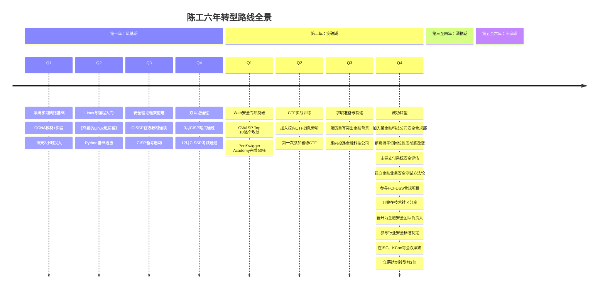
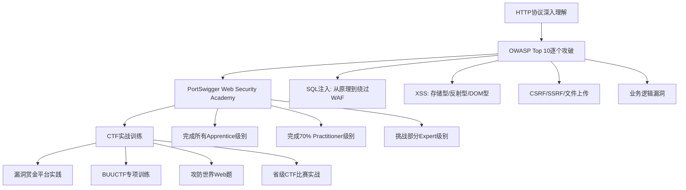
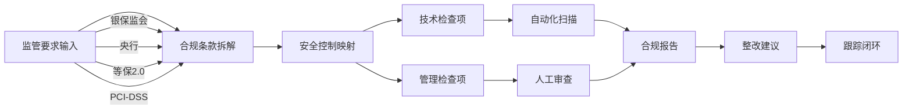

## 案例五：跨界转型——从金融到安全

跨界转型是信息安全行业中最被低估、却最具潜力的职业路径之一。与计算机科班出身的安全从业者不同，跨界者自带一个完整行业的领域知识，这种"安全+行业"的复合能力在特定赛道上往往比纯技术能力更有竞争力。本案例完整记录了陈工从银行柜员到金融安全专家的六年转型历程，拆解每一步的决策逻辑、踩过的坑和验证过的方法，为所有考虑跨界进入安全领域的读者提供一份可复用的路线图。

### 为什么金融背景是安全领域的稀缺资源

在进入案例本身之前，需要先理解一个底层逻辑：信息安全从来不是孤立的技术问题，而是"技术+业务+合规"的三角博弈。纯技术出身的安全人员往往在"技术"这个角上很强，但在"业务理解"和"行业合规"两个角上存在明显短板。

金融行业的特殊性在于：

| 维度 | 金融背景带来的独特价值 | 纯技术背景的常见短板 |
|------|----------------------|---------------------|
| 业务理解 | 深度理解支付清算、信贷风控、资管估值等核心业务流程，能准确判断安全事件对业务的实际影响 | 只能看到技术漏洞，无法评估业务风险等级 |
| 合规知识 | 熟悉银保监会、央行的监管要求，理解等保2.0在金融行业的特殊要求 | 需要从零学习行业法规，容易遗漏关键合规点 |
| 风险思维 | 金融行业本身就是风险管理行业，具备量化风险评估的思维习惯 | 倾向于用技术指标（CVSS评分）而非业务影响来评估风险 |
| 沟通能力 | 能用业务语言与高管沟通安全需求，推动安全预算审批 | 习惯用技术术语沟通，难以让管理层理解安全投入的价值 |
| 行业人脉 | 在金融机构有现成的人脉网络，便于推广安全产品和服务 | 需要重新建立行业关系 |

根据CyberSeek 2025年的数据，金融科技安全岗位的需求增速是通用安全岗位的2.3倍，而具备金融+安全复合背景的人才供给仅为需求的38%。这种供需失衡直接体现在薪资上——金融科技安全岗位的中位薪资比通用安全岗位高出25%-40%。

### 人物画像：从银行柜台到安全专家

**陈工的基础档案：**

- 学历：金融学本科（非985/211，普通财经类院校）
- 前职业：某股份制商业银行，先后做过柜员（2年）、客户经理（1年）、风险管理岗（2年）
- 技术基础：转型前几乎为零，仅会基本的Excel函数和简单的数据透视表
- 转型时年龄：28岁，已婚，有一个两岁的孩子
- 经济状况：有一定积蓄，但需要控制转型期间的投入成本

**转型动机的深层分析：**

陈工的转型并非一时冲动，而是基于三个层面的理性判断：

第一层是**行业趋势感知**。2019年前后，他所在银行开始大规模推进数字化转型，手机银行、线上贷款、智能风控等项目密集上马。他敏锐地注意到，这些项目的安全需求在急剧增长，但行内的安全团队人手严重不足，经常需要外部安全公司支援。

第二层是**职业天花板的焦虑**。在银行体系内，非技术背景的中后台岗位晋升路径狭窄，从风险管理岗到部门副总的通道非常拥挤，而他看不到明显的竞争优势。

第三层是**个人兴趣的驱动**。在参与一次行内安全培训后，他对渗透测试和漏洞挖掘产生了浓厚兴趣，开始利用业余时间自学安全知识，发现自己的学习速度和理解深度超出预期。

### 转型路线全景图



### 第一阶段：筑基期（第1年）——从零建立技术地基

#### 学习路径的精确拆解

陈工的第一年是最艰难的。一个金融从业者需要在12个月内建立起足以通过安全岗位面试的技术基础，同时还要兼顾银行的全职工作和家庭责任。他的策略是"每天固定2小时，周末加码到5小时"，全年累计投入约1200小时。

**第一个季度：网络与操作系统基础**

陈工选择从CCNA教材入手，而非直接学安全。原因很实际——安全领域的所有知识都建立在网络协议和操作系统之上，不理解TCP三次握手就无法理解SYN Flood攻击，不理解Linux文件权限就无法理解提权漏洞。

他的学习方法是"教材+实验"的双轨制：

- 工作日：每天晚上8:30-10:30读CCNA教材1-2章，用思维导图整理核心概念
- 周末：上午用Packet Tracer做网络实验，下午开始《鸟哥的Linux私房菜》的系统学习
- 通勤时间：用播客（如"网络安全天天学"）做碎片化补充

**第二个季度：编程能力构建**

Python是安全领域的通用语言，陈工选择了《Python编程：从入门到实践》作为主教材。他的学习策略是"以项目驱动"，每学完一个知识点就写一个小工具：

- 学完文件操作 → 写了一个日志分析脚本，能自动统计银行交易日志中的异常模式
- 学完网络编程 → 写了一个简单的端口扫描器
- 学完正则表达式 → 写了一个敏感信息检测工具，能扫描代码中的硬编码密码

这些项目不仅巩固了编程能力，更重要的是它们与金融业务场景结合，成为后来简历上的亮点。

**第三个季度：安全理论框架**

这个季度的重点是建立安全领域的全局认知。陈工选择先通读CISSP的官方教材（《CISSP官方学习指南》），原因是CISSP覆盖了安全的8个知识域，能帮助他在最短时间内建立完整的知识框架，而不是一开始就扎进某个技术细节。

同时启动CISP备考，因为CISP是国内认可度最高的安全认证，在银行等传统金融机构中尤为重要。

**第四个季度：双认证冲刺**

- 3月通过CISP笔试（备考周期约4个月，每天1.5小时刷题）
- 12月通过CISSP考试（这是他第一年最大的里程碑）

**关键数据：**

| 指标 | 数值 | 说明 |
|------|------|------|
| 总投入时间 | 约1200小时 | 工作日2h×250天 + 周末5h×100天 |
| 教材投入 | 约2000元 | 认证考试费另计约12000元 |
| 认证通过 | CISP + CISSP | CISSP一次通过，CISP第二次通过 |
| 项目产出 | 3个Python工具 | 日志分析器、端口扫描器、敏感信息检测器 |

#### 筑基期的三个关键教训

**教训一：不要跳过基础直接学渗透**

陈工最初的计划是直接学渗透测试，但在尝试学习SQL注入时发现自己完全不理解数据库的工作原理，尝试学XSS时发现自己对HTTP协议一知半解。这让他浪费了约一个月的时间，最终不得不回头补基础。

正确的顺序是：网络基础（2个月）→ 操作系统基础（1个月）→ 编程基础（2个月）→ 安全理论（3个月）→ 专项技术（4个月）。

**教训二：认证考试是学习框架而非终点**

很多人批评认证考试"不实用"，但对于跨界转型者来说，认证的价值不在于证书本身，而在于它提供了一个系统化的学习框架。CISSP的8个知识域就像一张地图，告诉陈工"安全领域有哪些板块，每个板块的核心概念是什么"，即使很多内容他当时并不完全理解，但这个框架让他在后续的学习中不会迷路。

**教训三：利用金融场景做学习加速器**

陈工发现，当他把学到的安全知识与银行工作场景结合时，理解速度会大幅提升。例如：
- 学SQL注入时，他会想象银行核心系统中可能存在哪些SQL查询，如果被注入会有什么后果
- 学加密算法时，他会联想到银行的加密机和密钥管理体系
- 学访问控制时，他会对比银行内部的权限管理流程

这种"场景化学习"方法让他对安全概念的理解比纯技术背景的学习者更深刻。

### 第二阶段：突破期（第2年）——从学习者到从业者

#### 专项技能突破

通过CISSP后，陈工已经具备了安全领域的全局视野，但在技术深度上仍然不足。他需要选择一个具体的切入点，建立足以通过技术面试的专项能力。

他选择了Web安全作为切入点，原因有三：

1. **学习资源最丰富**：Web安全有大量免费的在线学习平台和靶场
2. **金融科技公司的核心需求**：金融业务大量基于Web/APP，Web安全是刚需
3. **与银行工作经验最相关**：他参与过银行网银系统的测试，对Web应用有基本认知

**Web安全学习路线：**



**具体时间分配（第2年上半年）：**

| 时间段 | 学习内容 | 目标产出 |
|--------|---------|---------|
| 第1-2周 | HTTP协议深度学习，用Wireshark抓包分析真实请求 | 能手写完整的HTTP请求，理解每个头部字段的含义 |
| 第3-6周 | OWASP Top 10逐个攻破，每个漏洞类型至少做10道练习题 | 在DVWA上能独立完成所有漏洞的利用 |
| 第7-10周 | PortSwigger Academy系统学习 | 完成所有Apprentice级别和70%的Practitioner级别 |
| 第11-16周 | CTF实战训练，每周至少参加一次线上CTF | 在BUUCTF上完成50+道Web题 |

#### 求职策略：让金融背景成为简历的核心卖点

陈工的求职策略与普通安全求职者有本质区别。普通安全求职者需要证明"我的技术能力足够强"，而陈工需要证明的是"我的金融背景+安全技能能创造独特价值"。

**简历重塑策略：**

他将简历从传统的"时间线罗列"改为了"能力矩阵"结构：

| 模块 | 内容 | 说明 |
|------|------|------|
| 核心标签 | "5年银行从业经验 + CISSP/CISP认证 + Web安全实战能力" | 用一句话定义自己的差异化定位 |
| 业务理解 | 详细列出参与过的银行业务项目，包括核心系统、网银、手机银行等 | 证明自己理解金融业务全貌 |
| 安全技能 | 列出Web安全工具链（Burp Suite、Nmap、SQLMap等）和CTF成绩 | 证明技术能力达到岗位要求 |
| 复合项目 | 重点描述"用Python写的银行日志异常检测工具"等交叉项目 | 证明能将两个领域的能力融合 |

**求职渠道的优先级排序：**

1. **定向投递金融科技公司**（蚂蚁金服、京东数科、微众银行等）——这类公司最需要金融+安全的复合人才
2. **银行/券商的安全岗位**——金融机构的安全部门偏好有业务背景的人
3. **安全公司的金融行业线**——安全厂商需要懂金融的售前/咨询人员
4. **人脉推荐**——通过银行同事的朋友圈寻找内推机会

**面试中的关键策略：**

陈工在面试中发现，技术面试官通常会问"你一个金融背景的人，技术能力够吗？"这个问题。他的应对策略是主动展示自己的技术项目（Python工具的GitHub链接），同时反过来强调金融背景的独特价值："我能准确判断一个安全漏洞对银行支付系统的真实业务影响，这是纯技术人员很难做到的。"

最终，他收到了3个offer，选择了一家金融科技公司的安全合规岗位。薪资与银行时期持平，但岗位性质完全不同——从一个可替代性较高的银行中后台岗位，转到了一个稀缺性极高的复合型安全岗位。

### 第三阶段：深耕期（第3-4年）——打造不可替代性

#### 金融安全的细分赛道选择

入职后，陈工没有盲目追求"技术深度"，而是选择了一条最适合自己背景的发展路径——金融业务安全。这个选择的逻辑是：在技术深度上，他短期内无法与科班出身的安全工程师竞争；但在"理解金融业务+能做安全评估"这个交叉领域，他的竞争者极少。

**他重点深耕的三个方向：**

**方向一：支付系统安全评估**

支付系统是金融业务的命脉，也是攻击者最关注的目标。陈工利用自己对支付清算流程的深入理解，建立了一套针对支付系统的安全测试方法论：

- 交易流程分析：梳理从用户发起支付到资金到账的完整链路，识别每个环节的安全风险点
- 业务逻辑测试：重点测试金额篡改、重复支付、越权转账等业务逻辑漏洞
- 合规检查：对照PCI-DSS标准逐项检查支付系统的安全控制措施

这套方法论的核心价值在于，它不是简单的"跑一遍扫描器出报告"，而是结合了业务理解的深度安全评估。陈工在入职第一年就主导了3个大型支付系统的安全评估项目，发现了4个高危业务逻辑漏洞，这些都是纯技术背景的安全工程师在评估中容易遗漏的。

**方向二：金融合规与安全的融合**

金融行业是监管最严格的行业之一，安全工作必须与合规要求紧密结合。陈工利用自己对银保监会、央行监管政策的理解，帮助团队建立了安全合规检查体系：



**方向三：金融科技安全研究**

随着金融科技的发展，移动支付、区块链、开放银行等新技术不断涌现，每个新技术都带来新的安全挑战。陈工选择移动支付安全作为研究方向，发表了多篇技术文章：

- 《移动支付SDK的安全风险分析》——分析了主流支付SDK的常见漏洞模式
- 《金融APP的隐私合规检测方法》——提出了一套自动化检测金融APP隐私合规的工具链
- 《开放银行API的安全设计指南》——基于OAuth 2.0和FAPI标准，给出了开放银行API的安全设计建议

这些文章在安全社区获得了广泛关注，也为他建立了"金融安全专家"的个人品牌。

#### 技术能力的持续补强

在深耕业务安全的同时，陈工没有放松技术能力的提升。他制定了一个"技术补课计划"，重点弥补跨界转型者最容易薄弱的技术环节：

| 补强方向 | 学习内容 | 投入时间 | 学习方式 |
|---------|---------|---------|---------|
| 代码审计 | Java/Python代码审计，重点学习金融系统常用的Spring框架安全问题 | 3个月 | OWASP Code Review Guide + 实际项目审计 |
| 内网渗透 | 域环境渗透、横向移动、权限维持 | 2个月 | HTB Pro Labs + 内网靶场 |
| 安全开发 | 用Python/Go开发安全工具，提升自动化能力 | 持续 | 以项目驱动，如开发金融合规扫描工具 |
| 云安全 | AWS/Azure安全配置，容器安全 | 2个月 | 云厂商安全专项认证备考 |

### 第四阶段：专家期（第5-6年）——从执行者到引领者

#### 职业跃迁的关键节点

入职第三年，陈工晋升为金融安全团队的技术负责人。这个晋升不是因为他的技术能力突然超过了所有人，而是因为他在"金融+安全"这个交叉领域的积累已经形成了明显的壁垒。

**晋升的关键推动因素：**

1. **业务影响力**：他主导的支付系统安全评估项目，帮助公司避免了一次潜在的重大安全事件（一个支付接口的业务逻辑漏洞可能导致批量重复扣款），这个案例被公司高层多次提及
2. **行业影响力**：他在ISC互联网安全大会和KCon黑客大会上做了关于金融安全的演讲，提升了公司在安全行业的知名度
3. **团队建设**：他带出了一支3人的金融安全评估团队，培养了2名具备金融业务理解能力的安全工程师
4. **标准化贡献**：参与了某金融行业安全标准的制定工作，这是行业级别的认可

#### 薪资与职业发展数据

| 时间节点 | 岗位 | 年薪（税前） | 与转型前对比 |
|---------|------|------------|-------------|
| 转型前（银行风险管理岗） | 风险管理岗 | 约25万 | 基准 |
| 转型入职（第2年末） | 安全合规工程师 | 约25万 | 持平 |
| 第3年末 | 高级安全工程师 | 约35万 | +40% |
| 第4年末 | 安全技术负责人 | 约50万 | +100% |
| 第6年末 | 金融安全专家/团队负责人 | 约75万 | +200% |

这个薪资增长曲线的关键拐点在第3-4年，恰好是他在"金融安全"这个细分领域建立起足够深的护城河之后。相比之下，如果他继续留在银行，同期的薪资增长大约在30%-40%。

#### 行业贡献与个人品牌建设

到了专家期，陈工的影响力已经超越了公司内部：

**技术社区贡献：**
- 在GitHub上开源了一个金融业务安全测试框架（FinSec-Test），集成了支付系统、信贷系统、资管系统的常见安全测试用例，获得了800+ Star
- 在安全媒体（FreeBuf、安全客、先知社区）上发表了20+篇金融安全技术文章
- 维护了一个金融安全技术博客，月均访问量超过5万

**行业标准参与：**
- 参与制定《金融行业移动应用安全评估规范》
- 为某省级银保监局提供金融科技安全咨询
- 在高校金融安全课程中担任客座讲师

**人才培养：**
- 在公司内部建立了"金融安全人才培养计划"，每年培养3-5名具备金融业务理解能力的安全工程师
- 指导了10+名跨界转型者的职业发展，其中包括3名从银行转行的同事

### 跨界转型的通用方法论

从陈工的案例中，可以提炼出一套适用于所有行业跨界进入安全领域的通用方法论：

#### 跨界转型的"三阶段四维度"框架

```mermaid
graph TB
    subgraph 三阶段
        S1[第一阶段：筑基期<br/>12-18个月]
        S2[第二阶段：突破期<br/>6-12个月]
        S3[第三阶段：深耕期<br/>2-3年]
    end
    
    subgraph 四维度
        D1[技术基础]
        D2[安全专项]
        D3[行业融合]
        D4[个人品牌]
    end
    
    S1 --> D1
    S1 --> D2
    S2 --> D2
    S2 --> D3
    S3 --> D3
    S3 --> D4
    
    D1 --> |网络+OS+编程| D2
    D2 --> |认证+专项技能+实战| D3
    D3 --> |业务安全+合规+研究| D4
    D4 --> |开源+写作+演讲+标准制定|
```

**四维度的具体要求：**

| 维度 | 筑基期目标 | 突破期目标 | 深耕期目标 |
|------|-----------|-----------|-----------|
| 技术基础 | 掌握网络、OS、编程基础 | 能独立完成安全工具开发 | 能设计安全架构和方案 |
| 安全专项 | 通过1-2个安全认证 | 掌握1个方向的深度技能 | 成为该方向的专家 |
| 行业融合 | 用行业场景辅助安全学习 | 在安全工作中应用行业知识 | 建立行业安全方法论 |
| 个人品牌 | 建立技术博客，记录学习过程 | 在社区分享技术文章 | 成为行业安全意见领袖 |

#### 不同行业跨界者的差异化策略

陈工的方法论不是万能的，不同行业的跨界者需要根据自身背景调整策略：

| 原行业 | 最佳安全切入点 | 核心优势 | 需要重点补强 |
|--------|---------------|---------|-------------|
| 金融 | 金融安全合规、支付安全、风控安全 | 风险思维、合规知识、业务理解 | 编程能力、网络基础 |
| 医疗 | 医疗数据安全、HIPAA合规、医疗器械安全 | 医疗业务流程、隐私保护意识 | 网络安全基础、渗透测试 |
| 法律 | 网络安全法律咨询、数据合规、电子取证 | 法律条文理解、合规框架设计 | 技术基础、安全工具使用 |
| 教育 | 教育平台安全、学生数据保护、在线考试安全 | 教育行业理解、用户需求洞察 | 安全技术基础、编程能力 |
| 制造 | 工控安全、IoT安全、供应链安全 | 工业流程理解、OT系统经验 | IT安全基础、网络协议 |
| 运营商 | 通信安全、5G安全、网络安全运营 | 网络架构理解、大规模系统经验 | 应用安全、编程能力 |

### 常见误区与避坑指南

#### 误区一：盲目追求技术深度

很多跨界转型者入职后，会陷入"技术焦虑"——觉得自己在技术深度上不如科班出身的同事，于是疯狂补技术，却忽略了自己最大的优势——行业领域知识。

**正确做法**：技术能力只需要达到岗位的基本要求（能做安全评估、能写安全工具、能理解漏洞原理），而应该把更多精力放在"行业知识+安全技术"的融合上。你的价值不是"比别人更懂安全"，而是"比别人更懂你们行业的安全"。

#### 误区二：选择太宽泛的安全方向

安全领域非常广阔，从渗透测试到安全运营，从代码审计到应急响应，每个方向都需要深入学习。跨界转型者最容易犯的错误是"什么都想学"，结果每个方向都浅尝辄止。

**正确做法**：选择一个与原行业最相关的方向作为切入点，在这个方向上做到足够深，再逐步扩展。陈工选择"金融业务安全"而不是"渗透测试"或"安全运营"，就是因为他知道在这个方向上，他的金融背景能发挥最大价值。

#### 误区三：低估认证考试的价值

有些技术能力强的人会说"认证是智商税"，但对于跨界转型者来说，认证是证明自己"已经入门"的最有效方式。在简历筛选阶段，HR和用人部门看到CISSP/CISP认证，会直接认为你"具备安全领域的系统化知识"，从而给你面试机会。

**正确做法**：在转型初期，优先考取1-2个行业认可度高的认证（CISSP适合管理层方向，OSCP适合技术方向，CISP适合国内金融机构）。认证不是终点，但它是跨界转型的"敲门砖"。

#### 误区四：忽视人脉建设

跨界转型者往往只关注"学什么"和"考什么"，却忽略了"认识谁"。在安全行业，人脉的价值不亚于技术能力——很多好的工作机会是通过内推获得的，很多技术难题是通过社区交流解决的。

**正确做法**：
- 每月至少参加1次线下的安全Meetup或沙龙
- 在安全社区（如FreeBuf、先知社区、T00ls）保持活跃，定期发表技术文章
- 主动联系目标公司的安全从业者，以"请教学习"为切入点建立关系
- 参加CTF比赛，在比赛中结识同好

#### 误区五：对薪资预期不合理

跨界转型初期，薪资通常不会有明显提升，甚至可能下降。这是因为你在新领域还是"新人"，需要时间证明自己的价值。很多转型者因为薪资倒挂而中途放弃。

**正确做法**：做好"2年持平、3年翻倍、5年翻3倍"的心理准备。转型是一项投资，短期看是成本，长期看是收益。重点不是第一年的薪资，而是5年后的职业天花板是否比原来更高。

### 给跨界转型者的行动清单

如果你正在考虑从其他行业跨界进入安全领域，以下是一份可执行的行动清单：

**第1个月：信息收集与决策**
- 阅读本案例和同章节的其他案例，了解不同转型路径的特点
- 评估自己的行业背景与安全领域的结合点
- 确定转型方向（金融安全、医疗安全、工控安全等）
- 制定预算计划（认证费用、教材费用、培训费用）

**第2-3个月：基础学习启动**
- 选择网络基础教材（推荐CCNA或《计算机网络：自顶向下方法》）
- 开始Linux基础学习（推荐《鸟哥的Linux私房菜》或Linux Journey网站）
- 注册TryHackMe或HackTheBox账号，开始接触安全实操
- 加入1-2个安全学习社群，找到同路人

**第4-6个月：编程与安全理论并行**
- 学习Python基础，尝试编写与自己行业相关的小工具
- 开始CISSP或CISP的备考（根据目标岗位选择）
- 在PortSwigger Academy开始Web安全学习
- 每周写一篇学习笔记，发在个人博客或社区

**第7-12个月：专项突破与认证冲刺**
- 完成Web安全专项学习，能在靶场上独立完成中等难度的题目
- 通过CISSP或CISP认证考试
- 参加至少1次CTF比赛
- 开始投递简历，优先选择与原行业相关的安全岗位

**第13-18个月：入职与融入**
- 快速适应新岗位的工作节奏
- 主动承担与原行业相关的安全项目
- 继续深入学习，弥补技术短板
- 建立在公司内部的专业形象

**第19-36个月：深耕与差异化**
- 在细分领域建立自己的方法论和工具集
- 开始在技术社区分享专业内容
- 参与行业安全标准的制定或讨论
- 培养新人，扩大影响力

### 本案例的核心启示

陈工的转型故事揭示了一个反直觉的事实：在信息安全领域，"跨界"往往比"科班"更有优势——前提是跨界者能找到自己的差异化赛道。

信息安全正在从一个纯技术领域演变为一个"技术+行业"的复合领域。随着各行各业的数字化转型加速，安全问题越来越需要"懂业务的人来解决"，而不是"懂技术的人来猜测"。金融安全、医疗安全、工控安全、车联网安全等细分赛道的兴起，为跨界转型者创造了前所未有的机会。

关键不在于你从哪里来，而在于你能否把自己的"来处"变成在安全领域的独特优势。陈工用六年时间证明了这一点，而你需要做的，是找到属于自己的那条路径。
