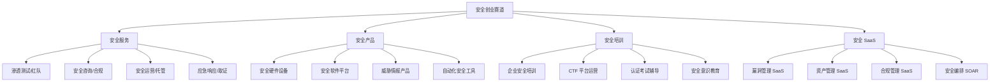
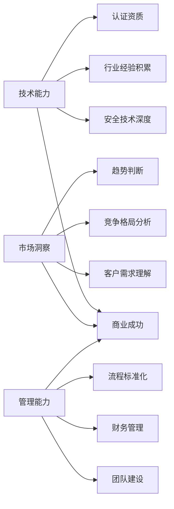

## 案例六：安全创业者的成长之路

信息安全行业正处于高速增长期，据 Cybersecurity Ventures 预测，2025 年全球网络安全市场规模将突破 2000 亿美元。在这个蓬勃发展的市场中，越来越多的安全从业者选择创业，将技术能力转化为商业价值。本案例记录了刘工（化名）从大厂安全工程师到创办估值过亿安全咨询公司的完整历程，剖析安全创业的底层逻辑、关键决策节点和避坑指南。

### 人物背景

刘工，信息安全专业硕士，2013 年毕业后加入腾讯安全平台部，先后参与了反欺诈系统建设、安全应急响应中心（SRC）运营、企业安全架构设计等核心项目。在大厂工作的 5 年间，他从初级安全工程师成长为高级安全专家，主导了多个千万级安全项目的落地，积累了深厚的技术功底和行业认知。

2018 年，刘工决定离开大厂，创立「安恒信达」（化名），专注于金融行业安全咨询服务。公司从 3 人团队起步，经过 5 年发展，成长为拥有 50+ 员工、年营收超 3000 万元的安全服务企业，并在 2023 年完成了 A 轮融资。

### 安全创业的市场机遇

#### 行业驱动因素

信息安全创业并非盲目跟风，而是有坚实的市场基础：

**政策驱动**：《网络安全法》《数据安全法》《个人信息保护法》三法并行，以及等保 2.0、关基保护条例等合规要求，使得安全合规从「可选项」变为「必选项」。仅等保测评市场，每年就有数十亿规模。

**需求爆发**：数字化转型加速，企业上云、远程办公、IoT 部署带来的安全需求呈指数级增长。传统安全厂商的产品无法覆盖所有场景，安全服务的定制化需求旺盛。

**人才缺口**：国内网络安全人才缺口超过 150 万，企业自建安全团队成本高昂，外采安全服务成为主流选择。

**技术迭代**：AI 安全、云原生安全、零信任架构等新领域不断涌现，为新玩家提供了弯道超车的机会。

#### 安全创业的主要赛道



不同赛道的启动门槛和天花板差异显著：

| 赛道 | 启动资金 | 技术门槛 | 客户获取难度 | 天花板 | 代表企业 |
|------|----------|----------|--------------|--------|----------|
| 渗透测试/红队 | 低（10-50 万） | 高 | 中 | 中 | 长亭科技、默安科技 |
| 安全咨询/合规 | 低（10-30 万） | 中 | 中高 | 高 | 安恒信息、绿盟科技 |
| 安全产品 | 高（100 万+） | 高 | 高 | 很高 | 奇安信、深信服 |
| 安全 SaaS | 中（50-200 万） | 高 | 中 | 很高 | 悬镜安全、默安科技 |
| 安全培训 | 低（5-20 万） | 中 | 低 | 中 | 安全牛、i春秋 |
| 托管安全服务 | 中（30-100 万） | 中高 | 中 | 高 | 知道创宇、安恒信息 |

### 刘工的创业历程

#### 第一阶段：积累与萌芽（2013-2018）

**技术积累**：在腾讯安全平台部的 5 年，刘工经历了完整的安全技术栈训练：

- **第 1-2 年**：夯实基础。参与漏洞挖掘、渗透测试、安全审计等基础工作，建立了扎实的技术功底。期间独立发现了 3 个 CNVD 高危漏洞，获得了腾讯安全杰出贡献奖。
- **第 3-4 年**：深入业务。主导反欺诈系统架构设计，带领 5 人团队完成了日均处理 10 亿+ 风控请求的系统建设。这段经历让他理解了「安全如何与业务融合」的核心命题。
- **第 5 年**：拓展视野。参与集团级安全架构规划，接触了金融、医疗、教育等多个行业的安全需求，看到了安全服务市场的巨大空间。

**认证加持**：在大厂期间，刘工系统性地获取了多个高级认证：

| 认证 | 获取时间 | 核心价值 |
|------|----------|----------|
| CISP（注册信息安全专业人员） | 2014 年 | 国内安全行业的「敲门砖」，国企/政府项目必备 |
| CISSP（注册信息系统安全专家） | 2016 年 | 国际认可度最高的安全认证，外企客户认可 |
| CISM（注册信息安全经理） | 2017 年 | 偏向安全管理，为创业后的管理角色做准备 |
| ISO 27001 主任审核员 | 2018 年 | 合规咨询业务的核心资质 |

**人脉网络**：5 年间，刘工通过以下方式建立了广泛的行业人脉：

- **行业会议**：每年参加 5-8 场安全会议（KCon、XCon、ISC 等），主动做演讲嘉宾
- **社区贡献**：在安全社区（先知、FreeBuf）发表了 20+ 篇技术文章
- **同行交流**：加入多个安全从业者社群，与上下游厂商保持密切联系
- **客户关系**：在服务内部客户时建立了专业口碑，多位前同事后来成为首批客户

#### 第二阶段：创业决策与准备（2018 年初）

**决策过程**：刘工的创业决策并非一时冲动，而是经过了深思熟虑：

1. **市场验证**：利用业余时间承接了 3 个安全咨询项目，验证了市场需求和个人能力
2. **收入测算**：按最低预期计算，前 6 个月只需 2 个客户即可覆盖基本运营成本
3. **家庭沟通**：与家人充分沟通，预留了 18 个月的家庭生活费作为安全垫
4. **退出策略**：设定明确的止损线——如果 18 个月内无法实现盈亏平衡，将重新求职

**商业计划核心要素**：

```text
目标市场：金融行业（银行、保险、证券）
核心服务：安全咨询 + 合规评估 + 渗透测试
差异化定位：「大厂方法论 + 行业深度理解」
定价策略：按项目制收费，渗透测试 5-15 万/项目，咨询 20-50 万/项目
获客渠道：人脉推荐 + 行业会议 + 内容营销
团队规划：创始人（技术+BD）+ 2 名高级安全工程师
启动资金：个人积蓄 50 万 + 预留家庭生活费 30 万
```

**资质准备**：安全行业的创业需要一系列资质：

- **公司注册**：选择有限责任公司，注册资本 100 万（认缴）
- **行业资质**：信息安全等级保护测评机构资质（需 3 名以上持证人员）
- **ISO 认证**：ISO 27001 信息安全管理体系认证
- **人员资质**：核心团队需持有 CISP/CISSP 等认证
- **保密资质**：涉及政府/军工项目需申请涉密信息系统集成资质

#### 第三阶段：艰难起步（2018-2019）

**获取第一批客户**：

创业初期最大的挑战是获客。刘工采用了「由近及远」的策略：

- **老东家资源**：腾讯的部分供应商项目外包给他的公司，贡献了前 3 个月 60% 的营收
- **前同事推荐**：跳槽到其他公司的前同事，基于信任将安全需求交给他
- **行业会议曝光**：在 KCon 2018 做了「金融行业红队实战」主题演讲，现场获取了 5 个意向客户
- **内容营销**：在公众号「安全创业笔记」持续输出金融安全案例分析，逐步建立品牌认知

**前 6 个月的营收数据**：

| 月份 | 客户数 | 营收（万元） | 支出（万元） | 现金流（万元） |
|------|--------|--------------|--------------|----------------|
| 第 1 月 | 1 | 8 | 12 | -4 |
| 第 2 月 | 1 | 6 | 11 | -5 |
| 第 3 月 | 2 | 15 | 12 | +3 |
| 第 4 月 | 2 | 18 | 13 | +5 |
| 第 5 月 | 3 | 22 | 14 | +8 |
| 第 6 月 | 3 | 25 | 15 | +10 |

**关键教训**：

- **现金流是生命线**：前 2 个月亏损时，刘工严格控制支出，办公室选择共享办公空间，设备全部租赁
- **项目交付是核心**：第一个项目交付质量直接决定了后续口碑。刘工亲自参与每一个项目的交付，确保质量
- **回款周期要控制**：安全服务的回款周期普遍较长（30-90 天），需要提前规划现金流

**团队建设**：

- **核心团队**：从老东家「挖」了 2 名信任的同事，给予期权+高于市场 20% 的薪资
- **外包协作**：部分非核心工作（报告模板设计、基础扫描）外包给兼职人员
- **文化塑造**：从第一天就建立了「交付质量 > 营收规模」的价值观

#### 第四阶段：建立壁垒（2019-2021）

**服务标准化**：

创业初期靠个人能力，规模化靠流程和标准化。刘工在第二年开始系统性地建设服务标准：

1. **渗透测试 SOP**：建立了覆盖 Web 应用、移动端、API、内网的标准化测试流程，每个类型有对应的检查清单（Checklist）和报告模板
2. **咨询方法论**：将大厂的安全架构设计方法论抽象为可复用的框架，形成了「安恒信达安全架构评估模型」
3. **交付物模板**：统一了所有报告的格式、深度、质量标准，确保不同团队成员交付的一致性
4. **知识库建设**：建立了内部知识库（Confluence），沉淀了 500+ 篇技术文档、案例分析、行业报告

**技术壁垒构建**：

- **自动化工具**：开发了内部漏洞扫描平台「ShieldScan」，集成 200+ 自定义检测规则
- **威胁情报**：自建金融行业威胁情报库，覆盖国内银行、支付机构的常见攻击手法
- **红队武器库**：积累了 50+ 红队工具和脚本，针对金融行业场景深度定制

**客户拓展**：

- **行业深耕**：从银行扩展到保险、证券、基金，逐步覆盖金融全行业
- **标杆案例**：为某股份制银行完成全行安全评估，项目金额 150 万，成为行业标杆案例
- **口碑传播**：老客户推荐新客户的比例从 2019 年的 30% 提升到 2021 年的 60%

#### 第五阶段：规模化发展（2021-2023）

**业务扩展**：

- **新业务线**：在安全咨询基础上，增加了安全培训（面向企业 CISO）、安全运营外包（MSSP）、安全产品研发三条业务线
- **地域扩张**：从深圳拓展到北京、上海、成都，建立区域交付中心
- **行业拓展**：从金融行业拓展到医疗、政务、教育等高合规需求行业

**团队管理挑战**：

团队从 10 人扩张到 50 人的过程中，刘工遇到了典型的管理挑战：

1. **技术管理 vs 业务管理**：初期刘工既做技术又做销售，精力严重分散。解决方案是招聘专职 BD 负责人，自己聚焦技术方向和团队管理
2. **人才培养瓶颈**：安全人才稀缺，内部培养周期长。建立了「老带新」的导师制度，每位高级工程师带 1-2 名初级工程师
3. **文化稀释**：团队扩大后，早期的「小团队文化」逐渐消失。通过定期团建、技术分享会、OKR 管理来维持团队凝聚力

**融资历程**：

2023 年，刘工启动了 A 轮融资，关键要素如下：

| 融资要素 | 具体情况 |
|----------|----------|
| 融资轮次 | A 轮 |
| 融资金额 | 3000 万元 |
| 投后估值 | 1.2 亿元 |
| 投资方 | 某知名安全产业基金 |
| 资金用途 | 产品研发 40%、市场拓展 30%、团队扩张 20%、运营储备 10% |
| 核心指标 | 年营收 3000 万+、毛利率 45%、客户续约率 85%、NPS 70+ |

### 安全创业的核心方法论

#### 创始人画像：什么样的安全人适合创业

并非所有安全从业者都适合创业。综合多位安全创业者的经验，适合创业的安全人通常具备以下特征：

**硬性条件**：
- 5 年以上安全行业从业经验
- 至少在一家知名企业有 2 年以上核心岗位经历
- 持有 CISSP/CISP 等行业认可的高级认证
- 在安全社区有一定的技术影响力（发表过文章/演讲）
- 有至少 3 个可验证的成功项目案例

**软性素质**：
- **客户思维**：能从客户视角理解安全需求，而非纯技术视角
- **沟通能力**：能将复杂的安全问题用非技术人员能理解的语言表达
- **抗压能力**：创业前 12 个月几乎必然面临现金流压力
- **学习能力**：安全技术迭代快，创始人必须保持持续学习
- **资源整合**：能在有限资源下找到最优解

#### 商业模式设计

安全服务公司的商业模式主要有以下几种：

**1. 项目制收费**

```text
模式：按项目交付收费，如渗透测试 5-20 万/项目，安全咨询 20-100 万/项目
优点：现金流清晰，定价灵活
缺点：收入不稳定，依赖销售能力
适合：初创期，团队 < 10 人
```

**2. 年度服务合同**

```text
模式：签订年度服务协议，按月/季度支付，包含一定量的服务时长
优点：收入可预测，客户粘性高
缺点：需要持续交付价值，否则续约率低
适合：成长期，团队 10-30 人
```

**3. 订阅制 SaaS**

```text
模式：提供安全 SaaS 产品，按月/年订阅收费
优点：边际成本低，规模化潜力大
缺点：产品研发周期长，前期投入大
适合：有产品化能力的团队，需 100 万+ 启动资金
```

**4. 混合模式**

```text
模式：安全服务（现金流） + 安全产品（规模化） + 培训（品牌）
优点：多条腿走路，抗风险能力强
缺点：管理复杂度高，资源分散
适合：成熟期，团队 30+ 人
```

刘工最终选择了混合模式，以安全咨询为现金牛业务，逐步向安全产品和培训延伸。

#### 定价策略

安全服务的定价是一门学问。定价过低会陷入「低价竞争」的泥潭，定价过高则难以获客。

**渗透测试定价参考**：

| 项目类型 | 范围 | 价格区间（万元） | 交付周期 |
|----------|------|------------------|----------|
| Web 应用渗透 | 1-5 个应用 | 3-8 | 1-2 周 |
| 移动端渗透 | 1-3 个 App | 5-10 | 2-3 周 |
| API 接口渗透 | 10-50 个接口 | 3-6 | 1-2 周 |
| 内网渗透 | 单个网段 | 8-15 | 2-4 周 |
| 红队评估 | 全面模拟攻击 | 20-50 | 4-8 周 |

**安全咨询定价参考**：

| 服务类型 | 范围 | 价格区间（万元） | 交付周期 |
|----------|------|------------------|----------|
| 等保合规评估 | 单个系统 | 3-8 | 2-4 周 |
| 安全架构设计 | 整体方案 | 15-30 | 4-8 周 |
| 安全体系规划 | 全公司 | 30-80 | 2-3 月 |
| CISO 外包服务 | 年度服务 | 50-150/年 | 持续 |

**定价公式**：

```text
项目报价 = 人力成本 × 成本倍率 + 工具成本 + 管理分摊 + 利润

其中：
- 人力成本 = 高级工程师日薪 × 人天数
- 成本倍率 = 2.5-3.5（行业惯例）
- 管理分摊 = 项目收入的 10-15%
- 利润 = 项目收入的 20-30%
```

#### 获客渠道矩阵

| 渠道 | 获客成本 | 客户质量 | 适合阶段 | 转化周期 |
|------|----------|----------|----------|----------|
| 老客户推荐 | 低 | 高 | 全阶段 | 1-2 个月 |
| 行业会议/演讲 | 中 | 高 | 早期+中期 | 2-4 个月 |
| 内容营销（公众号/博客） | 低 | 中 | 全阶段 | 3-6 个月 |
| 销售团队外呼 | 高 | 中低 | 成长期 | 2-4 个月 |
| 渠道合作（集成商/云厂商） | 中 | 中高 | 中期+后期 | 2-3 个月 |
| 招投标（政府/国企） | 高 | 高 | 成熟期 | 3-6 个月 |
| SEO/SEM | 中 | 中 | 中期+后期 | 持续 |

### 安全创业的常见陷阱

#### 陷阱一：技术思维主导，忽视商业本质

很多安全技术人员创业时，过度关注技术实现，忽视了商业逻辑。

**典型表现**：
- 花 3 个月开发一个「完美」的漏洞扫描工具，却发现客户更需要的是渗透测试服务
- 在技术方案上追求极致，导致项目成本超支、交付延期
- 用技术语言写商业计划书，投资人看不懂

**纠正方法**：
- 创业前做 10 次以上的客户访谈，理解客户真正的需求
- 招聘有商业背景的合伙人或顾问
- 用「客户价值」而非「技术先进性」来评估业务决策

#### 陷阱二：过度依赖个人能力，无法规模化

安全服务高度依赖人的能力，很多创始人陷入「自己是公司最大的销售和技术骨干」的困境。

**典型表现**：
- 所有大客户都由创始人亲自服务
- 团队成员离开后，客户也随之流失
- 公司营收高度依赖 2-3 个大客户

**纠正方法**：
- 尽早建立标准化的服务流程和知识库
- 培养团队的独立服务能力，而非所有项目都亲力亲为
- 客户关系建立在公司品牌上，而非个人关系上

#### 陷阱三：盲目扩张，忽视现金流

安全服务公司的扩张需要谨慎，盲目招人、开分公司、投入产品研发，都可能导致现金流断裂。

**典型表现**：
- 营收增长 50%，但利润反而下降
- 同时启动 3 条新业务线，资源严重分散
- 融资到账后大肆扩张，烧钱过快

**纠正方法**：
- 保持至少 6 个月的运营资金储备
- 新业务线的投入不超过总资源的 30%
- 每个季度做一次财务健康检查

#### 陷阱四：忽视合规和法律风险

安全行业涉及敏感数据和攻击性技术，合规和法律风险不容忽视。

**典型表现**：
- 在渗透测试中越界访问了未授权的系统
- 客户数据泄露导致法律纠纷
- 未签署保密协议就开展安全评估

**纠正方法**：
- 所有项目必须签署正式的服务合同和保密协议
- 渗透测试必须有明确的授权范围和时间窗口
- 购买职业责任险（Professional Liability Insurance）
- 建立内部合规审查机制

#### 陷阱五：同质化竞争，陷入价格战

安全服务市场的低门槛导致竞争激烈，很多公司陷入低价竞争的恶性循环。

**典型表现**：
- 为了拿单不断压低报价，毛利率从 40% 降到 15%
- 客户只比价格，不看质量
- 团队疲于奔命，但利润微薄

**纠正方法**：
- 找到差异化定位（行业专精、技术深度、服务质量）
- 建立品牌壁垒，让客户为「信任」而非「价格」买单
- 从卖「人力」转向卖「价值」——将服务产品化，提供可量化的安全效果

### 从个人到团队：管理进阶

#### 创业初期的团队配置（3-10 人）

| 角色 | 人数 | 职责 | 薪资范围（年薪/万） |
|------|------|------|---------------------|
| 创始人/CEO | 1 | 技术方向+业务拓展+客户管理 | 自定（初期不拿或少拿） |
| 高级安全工程师 | 2-3 | 核心技术交付，可独立带项目 | 30-50 |
| 初级安全工程师 | 2-3 | 辅助项目执行，报告撰写 | 15-25 |
| 行政/财务 | 1 | 日常运营、财务、人事 | 8-15 |

#### 成长期的团队配置（10-30 人）

| 部门 | 人数 | 核心职能 |
|------|------|----------|
| 技术交付部 | 10-15 | 渗透测试、安全评估、应急响应 |
| 咨询部 | 3-5 | 安全咨询、合规评估、体系规划 |
| 销售/BD | 3-5 | 客户拓展、关系维护、方案编写 |
| 研发部 | 3-5 | 安全产品/工具研发 |
| 运营/行政 | 2-3 | 人事、财务、行政支持 |

#### 关键管理工具

| 工具类型 | 推荐工具 | 用途 |
|----------|----------|------|
| 项目管理 | 禅道、Jira、飞书多维表格 | 项目进度跟踪、任务分配 |
| 知识管理 | Confluence、语雀、飞书知识库 | 技术文档沉淀、SOP 存储 |
| 代码管理 | GitLab（私有部署） | 安全工具/脚本版本管理 |
| CRM | 纷享销客、HubSpot | 客户关系管理、销售漏斗 |
| 协作沟通 | 飞书、企业微信 | 日常沟通、会议管理 |
| 财务管理 | 金蝶、用友 | 财务记账、发票管理 |
| 安全工具 | Burp Suite、Nessus、自研平台 | 技术交付的核心工具 |

### 财务管理核心知识

#### 安全服务公司的关键财务指标

| 指标 | 健康值 | 计算方式 | 意义 |
|------|--------|----------|------|
| 毛利率 | 40-60% | (营收-直接成本)/营收 | 衡量服务的盈利能力 |
| 净利率 | 10-25% | 净利润/营收 | 衡量整体盈利能力 |
| 人均产值 | 30-60 万/年 | 年营收/团队人数 | 衡量人效 |
| 客户获取成本(CAC) | < 年客单价的 20% | 销售费用/新客户数 | 获客效率 |
| 客户生命周期价值(LTV) | > 3 倍 CAC | 平均客单价 × 平均合作年限 | 客户长期价值 |
| 回款周期 | < 60 天 | 应收账款/日均营收 | 现金流健康度 |
| 客户续约率 | > 70% | 续约客户/到期客户 | 客户满意度 |

#### 创业各阶段的财务规划

**种子期（0-12 个月）**：
- 启动资金：50-100 万（个人积蓄+天使投资）
- 月均支出：8-15 万（人力+办公+工具+差旅）
- 盈亏平衡点：月营收 15-20 万（约 2-3 个中型项目）
- 关键指标：现金流转正时间

**成长期（1-3 年）**：
- 年营收目标：500-1500 万
- 毛利率目标：40-50%
- 团队规模：10-30 人
- 关键指标：客户续约率、人均产值

**扩张期（3-5 年）**：
- 年营收目标：3000-8000 万
- 融资轮次：A 轮或 B 轮
- 团队规模：30-100 人
- 关键指标：新业务线 ROI、市场份额

### 实用工具与资源

#### 创业必备资质清单

- [ ] 工商营业执照（经营范围包含信息安全服务）
- [ ] 信息安全等级保护测评机构资质（如做等保业务）
- [ ] ISO 27001 信息安全管理体系认证
- [ ] ISO 9001 质量管理体系认证（加分项）
- [ ] 高新技术企业认定（税收优惠）
- [ ] 软件著作权（自研工具/产品）
- [ ] 专利（技术壁垒）
- [ ] 职业责任险（Professional Liability Insurance）

#### 安全服务合同模板要素

一份规范的安全服务合同应包含以下核心条款：

1. **服务范围**：明确测试/评估的目标系统、IP 范围、应用列表
2. **授权条款**：明确授权的时间窗口、操作范围、禁止行为
3. **保密条款**：双方对项目信息、漏洞详情的保密义务
4. **交付标准**：明确交付物的格式、深度、验收标准
5. **免责条款**：因测试导致的系统故障，责任划分和免责条件
6. **付款条款**：付款方式、付款周期、违约责任
7. **知识产权**：测试工具、报告的知识产权归属
8. **争议解决**：仲裁/诉讼的选择和管辖地

#### 行业资源推荐

**行业报告**：
- 中国网络安全产业联盟（CCIA）年度报告
- IDC 中国网络安全市场跟踪报告
- Gartner 安全技术成熟度曲线

**行业社区**：
- 安全客（anquanke.com）
- FreeBuf（freebuf.com）
- 先知社区（xianzhicommunity.com）
- OWASP 中国分会

**创业支持**：
- 安全创业孵化器（如有）
- 地方政府网络安全产业园区
- 安全产业基金（如奇安信基金、启明创投等）

### 刘工的反思与建议

创业 5 年后，刘工总结了以下核心感悟：

**关于时机**：「2018 年创业的时机恰好。政策驱动（等保 2.0）带来了大量合规需求，而当时市场上的安全服务供给还不充分。如果晚两年，竞争会激烈得多。」

**关于定位**：「最初想做所有行业的所有安全服务，后来发现专注金融行业是正确的选择。金融行业的安全需求明确、付费能力强、客户粘性高，而且我们的行业理解越深，竞争对手越难复制。」

**关于团队**：「创业最大的挑战不是技术，也不是客户，而是找到对的人。前 3 个核心成员的加入，决定了公司的基因和文化。我花了大量时间在招聘上，宁缺毋滥。」

**关于融资**：「安全服务公司融资的核心是证明你的可规模化能力。投资人看的不是你今年赚了多少钱，而是你能否在 3 年内实现 10 倍增长。所以我们从第二年开始就投入产品研发，为规模化做准备。」

**关于失败**：「创业过程中踩过最大的坑是盲目扩张。2020 年同时开了北京和成都分公司，结果两边都没做好，白白烧了 200 万。后来收缩战线，聚焦深圳，才重新回到正轨。」

**给后来者的建议**：

1. **不要裸辞创业**：至少保留 6 个月的收入来源，利用业余时间验证商业模型
2. **找到互补的合伙人**：技术创始人需要商业合伙人，反之亦然
3. **先做服务再做产品**：服务能快速产生现金流，产品需要时间和资金
4. **控制扩张节奏**：每个新业务线、新城市都要有明确的 ROI 评估
5. **持续投资品牌**：在安全行业，品牌就是信任，信任就是订单
6. **保持技术敏感度**：创始人不能脱离技术太久，否则会失去对行业趋势的判断
7. **建立退出策略**：创业前就想好「如果失败了怎么办」，这不是悲观，是理性

### 总结：安全创业的底层逻辑

安全创业的本质是将技术能力转化为商业价值。这个过程需要三个核心要素的支撑：



安全创业不是一条容易的路，但对于有技术实力、有商业嗅觉、有管理意愿的安全从业者来说，它提供了将个人能力最大化的舞台。刘工的故事证明：在正确的时机，用正确的方法，做正确的事情，安全创业可以实现技术价值和商业价值的双重丰收。

正如刘工所说：「在大厂，你是庞大机器上的一个螺丝钉；创业后，你是整台机器的设计师。螺丝钉不需要思考全局，但设计师必须。这个转变，是安全创业最难也最值得的部分。」
