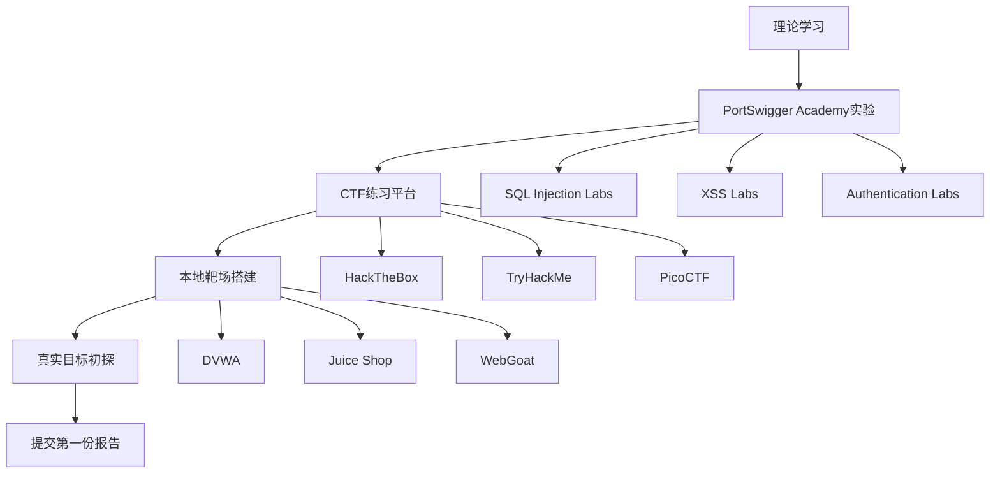
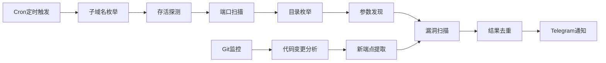

## 案例七：Bug Bounty猎人

Bug Bounty（漏洞赏金）是网络安全领域中一种独特的"按成果付费"职业模式——企业公开邀请安全研究员测试其产品，发现漏洞即支付赏金。这种模式打破了传统安全行业的雇佣壁垒：不需要学历、不需要认证、不需要全职坐班，唯一的入场券是你的技术能力和发现漏洞的眼力。本案例通过周工的真实经历，完整呈现一个零基础自学者如何成长为月入两万美元的Bug Bounty猎人，并系统拆解这条路径上的每一个关键节点。

### 人物背景

周工，26岁，本科专业为机械工程，毕业后在制造业工作两年，因对安全技术的浓厚兴趣于2021年辞职转型。没有计算机科班背景，没有安全行业人脉，凭借自学和持续实践，在三年内从零基础成长为HackerOne平台排名前200的赏金猎人。他的经历证明：在Bug Bounty领域，成果导向的能力评价体系让"草根逆袭"成为可能。

### Bug Bounty行业生态

在深入周工的发展历程前，先理解整个行业的运行机制。

#### 平台生态

| 平台 | 成立时间 | 注册研究员数 | 典型项目类型 | 结算周期 | 特点 |
|------|---------|------------|------------|---------|------|
| HackerOne | 2012 | 100万+ | 大型科技公司、政府机构 | 漏洞确认后7-14天 | 最大的赏金平台，生态最完善 |
| Bugcrowd | 2012 | 50万+ | 企业级客户、金融行业 | 月结或按漏洞 | 提供托管测试和私人项目 |
| Intigriti | 2016 | 5万+ | 欧洲企业为主 | 漏洞确认后14天 | 欧洲市场领先，合规性强 |
| Synack | 2013 | 1500+（受邀） | 政府和国防 | 月结 | 仅邀请制，门槛最高 |
| YesWeHack | 2015 | 3万+ | 欧洲和非洲企业 | 漏洞确认后30天 | 全球化布局，多语言支持 |

#### 赏金经济学

Bug Bounty市场在过去五年经历了爆发式增长。根据HackerOne的《2024 Hacker Report》，平台累计支付赏金超过3亿美元，2023年单年支付超过1亿美元。赏金分布呈现典型的幂律特征：

- **头部猎人**（前1%）：年收入超过50万美元，通常专注于特定厂商或漏洞类型
- **资深猎人**（前5%）：年收入10-50万美元，有成熟的方法论和工具链
- **中级猎人**（前20%）：年收入2-10万美元，有稳定的目标和产出
- **初级猎人**（剩余75%）：年收入低于2万美元，多数处于学习阶段

这种分布意味着：Bug Bounty不是"人人能赚钱"的领域，头部效应极其明显。但好消息是，只要你愿意投入时间打磨技能，从底部上升到中等水平是完全可以实现的。

#### 漏洞类型与赏金区间

不同漏洞类型的赏金差异巨大，理解这个分布有助于制定猎取策略：

| 漏洞类型 | 典型赏金 | 发现难度 | 竞争程度 | 适合阶段 |
|---------|---------|---------|---------|---------|
| 反射型XSS | $150-$500 | 低 | 极高 | 入门 |
| 存储型XSS | $500-$2,000 | 中 | 高 | 入门-中级 |
| IDOR | $500-$5,000 | 中 | 高 | 中级 |
| SSRF | $1,000-$10,000 | 中高 | 中 | 中级 |
| 认证绕过 | $2,000-$15,000 | 高 | 低 | 中级-高级 |
| SQL注入 | $1,000-$10,000 | 中 | 中 | 中级 |
| RCE（远程代码执行） | $5,000-$50,000+ | 极高 | 极低 | 高级 |
| 逻辑漏洞 | $1,000-$20,000 | 高 | 低 | 高级 |
| 链式攻击 | $10,000-$100,000+ | 极高 | 极低 | 专家 |

### 发展历程

#### 第一阶段：入门筑基（0-6个月）

**目标**：建立Web安全基础知识体系，完成平台注册，提交第一份漏洞报告。

**学习路线**：

周工制定了严格的学习计划，每天投入4-6小时，分为理论学习和动手实践两部分：

**理论学习（每天2小时）**：
1. **HTTP协议深入理解**——请求方法（GET/POST/PUT/DELETE/PATCH）、状态码含义、请求头/响应头字段、Cookie机制、CORS策略。不理解HTTP就无法理解Web漏洞的成因。
2. **Web应用架构**——前后端分离、RESTful API、GraphQL、WebSocket、微服务架构。了解目标系统的架构才能找到攻击面。
3. **OWASP Top 10 逐项学习**——2021版的10个大类：注入、认证失效、敏感数据暴露、XXE、访问控制失效、安全配置错误、XSS、不安全的反序列化、组件漏洞、日志和监控不足。每一类都需要理解原理、掌握利用方法、知道修复方案。
4. **PortSwigger Web Security Academy**——这是周工反复强调的最核心学习资源。该平台提供免费的、系统化的Web安全课程，每节课都有理论讲解和配套的在线靶场。周工花了约3个月完成了所有实验。

**动手实践（每天2-4小时）**：



**关键里程碑**：

- 第1个月：完成HTTP协议和Web架构学习，在DVWA上手动复现XSS和SQL注入
- 第2个月：开始PortSwigger Academy，完成注入类实验
- 第3个月：完成PortSwigger认证和访问控制类实验，注册HackerOne和Bugcrowd
- 第4个月：开始阅读HackerOne上的公开漏洞报告（Disclosure），每天精读3-5篇
- 第5个月：选择2-3个VDP（漏洞披露计划，无赏金）目标进行测试
- 第6个月：在第一个赏金目标上发现XSS漏洞，提交报告，获得$500赏金

**公开漏洞报告的学习方法**：

周工特别强调了阅读公开报告的重要性。他的方法是：

1. 按漏洞类型分类收藏报告（XSS类、SSRF类、IDOR类等）
2. 重点阅读报告中的"复现步骤"部分，理解猎人的测试思路
3. 记录每个报告中的关键技巧（如特殊的绕过payload、有趣的测试点）
4. 尝试在自己的测试环境中复现报告中的方法
5. 建立个人的"漏洞模式库"——记录每种漏洞的特征、测试方法、绕过技巧

#### 第二阶段：能力突破（6-18个月）

**目标**：从"碰运气"转变为"系统化"测试，月收入稳定在$2,000-$5,000。

**系统化测试方法论的建立**：

周工在这个阶段最大的突破是建立了自己的测试框架。他不再随机测试，而是遵循一套结构化的流程：

**1. 目标侦察（Reconnaissance）**

侦察是Bug Bounty中最被低估的环节。周工80%的漏洞都来自侦察阶段发现的"隐藏面"。

```bash
# 子域名枚举的基本思路（周工的工具链）
# 1. 被动子域名收集
subfinder -d target.com -o subdomains.txt
amass enum -passive -d target.com >> subdomains.txt

# 2. 子域名存活探测
httpx -l subdomains.txt -o alive.txt -status-code -title

# 3. 端口扫描
nmap -iL alive.txt -top-ports 1000 -oX scan.xml

# 4. 目录枚举
gobuster dir -u https://target.com -w /usr/share/wordlists/dirbuster/directory-list-2.3-medium.txt

# 5. 参数发现
arjun -u https://target.com/api/endpoint
```

**2. 攻击面分析**

侦察完成后，周工会整理出目标的完整攻击面：

- 所有Web应用和API端点
- 不同环境（开发、测试、预发布、生产）
- 第三方集成和依赖服务
- 移动应用和桌面客户端
- 云服务配置（S3桶、Azure Blob等）
- 员工相关的社会工程面（邮件格式、LinkedIn信息）

**3. 漏洞挖掘策略**

周工在这个阶段形成了"深度优先"的策略——选择少数高价值目标深入挖掘，而不是广撒网：

> "大多数新手犯的错误是在100个目标上各花1小时，结果什么都没找到。正确的做法是在1个目标上花100小时，彻底搞清楚它的每一个功能、每一个API、每一个认证流程。"

**专注领域的确立**：

经过6个月的广泛尝试，周工发现自己在以下两类漏洞上成功率最高：

**IDOR（不安全的直接对象引用）**：
- 原理：应用直接使用用户提供的ID（如用户ID、订单ID）访问资源，未验证当前用户是否有权访问该资源
- 测试方法：在每个API端点上尝试修改ID参数，观察返回数据是否包含其他用户的信息
- 常见场景：用户资料查看、订单详情、文件下载、API批量查询
- 绕过技巧：ID格式变换（UUID→数字→Base64）、参数名替换（user_id→uid→userId）、嵌套对象中的ID

**SSRF（服务端请求伪造）**：
- 原理：应用接受用户提供的URL并由服务端发起请求，攻击者可以指定内网地址或云元数据地址
- 测试方法：在所有接受URL参数的功能中（图片URL导入、Webhook配置、URL预览、PDF生成等）注入内网地址
- 高价值场景：AWS元数据服务（`http://169.254.169.254/latest/meta-data/`）、内部API调用、端口扫描
- 进阶技巧：DNS重绑定、URL解析差异（`http://127.0.0.1@evil.com`）、IPv6地址绕过

**自动化工具的开发**：

周工在这个阶段开始构建自己的自动化工具链。他用Python编写了一系列脚本，将重复性测试流程自动化：

```python
# 周工的IDOR批量检测器核心逻辑（简化示例）
import requests

def check_idor(base_url, endpoints, auth_tokens):
    """
    批量检测IDOR漏洞
    auth_tokens: dict, 包含两个不同用户的认证token
    """
    user_a_token = auth_tokens['user_a']
    user_b_token = auth_tokens['user_b']
    
    results = []
    
    for endpoint in endpoints:
        # 用User A的token获取User A自己的数据
        resp_a = requests.get(
            f"{base_url}{endpoint}",
            headers={"Authorization": f"Bearer {user_a_token}"}
        )
        
        # 尝试用User B的token访问同一个资源
        # 通过替换URL或参数中的ID
        modified_endpoint = replace_id(endpoint, target_user='a')
        resp_b = requests.get(
            f"{base_url}{modified_endpoint}",
            headers={"Authorization": f"Bearer {user_b_token}"}
        )
        
        # 比较响应：如果User B能看到User A的数据，可能存在IDOR
        if resp_b.status_code == 200 and has_sensitive_data(resp_b.json()):
            results.append({
                'endpoint': endpoint,
                'status': 'potential_idor',
                'evidence': resp_b.json()
            })
    
    return results
```

**关键成果**：

- 第7个月：发现某电商平台的IDOR漏洞，可查看任意用户的收货地址，赏金$2,000
- 第9个月：发现某SaaS产品的SSRF漏洞，可通过AWS元数据获取IAM凭证，赏金$5,000
- 第12个月：在某金融科技公司发现认证绕过漏洞，可绕过MFA访问任意账户，赏金$8,000
- 第15个月：建立了自动化侦察+测试的工作流，效率提升3倍

#### 第三阶段：规模化收入（18-36个月）

**目标**：月收入稳定在$5,000-$20,000，在特定领域建立专家声誉。

**私人项目（Private Programs）的进入**：

这个阶段的关键转折是获得了HackerOne的私人项目邀请。私人项目不公开可见，只有受邀的研究员才能参与，竞争远小于公开项目。

获得邀请的条件：
- HackerOne声誉分（Signal）达到一定水平
- 有稳定的漏洞提交记录和良好的报告质量
- 被项目方或HackerOne团队推荐

周工在第14个月收到了第一个私人项目的邀请，这是一个大型云服务提供商的赏金计划。由于竞争小、目标面广、赏金高，私人项目贡献了他总收入的60%以上。

**高价值漏洞的发现模式**：

周工在这个阶段开始专注于"漏洞链"——将多个低危漏洞串联成高危攻击：

**案例：从信息泄露到账户接管**

1. **发现1**：某社交平台的GraphQL API在错误消息中泄露了内部ID格式（信息泄露，低危）
2. **发现2**：密码重置功能使用时间戳作为重置token，可被暴力破解（弱token生成，中危）
3. **发现3**：将内部ID与暴力破解的token结合，可以重置任意用户的密码（账户接管，严重）

单个发现的赏金可能只有$500-$1,000，但组合后的严重性达到了Critical，最终获得了$15,000赏金。

**报告撰写的方法论**：

报告质量直接影响赏金金额和通过率。周工总结了高质量报告的核心要素：

**报告结构模板**：

```markdown
# 漏洞标题：[影响] + [组件] + [漏洞类型]
# 示例："Unauthenticated User Data Export via GraphQL IDOR"

## 摘要
一段话说明漏洞是什么、影响范围、严重程度。

## 影响
具体说明攻击者能利用这个漏洞做什么，最好给出量化数据。
示例："攻击者可以导出全平台2.3亿用户的姓名、邮箱和手机号。"

## 复现步骤
1. 步骤一（具体URL、参数、请求内容）
2. 步骤二
3. 步骤三
每个步骤附带完整的HTTP请求和响应（去除敏感信息）。

## 技术细节
漏洞的根本原因分析，说明为什么会存在这个漏洞。

## 修复建议
给出具体的修复方案，而不是泛泛的"加强验证"。

## CVSS评分
自行计算CVSS v3.1评分，展示专业性。
```

**关键的报告技巧**：
- 标题要精确：不要写"发现了一个XSS"，要写"Stored XSS in User Profile Bio Field Allows Account Takeover"
- 影响要量化：不要说"可能泄露用户数据"，要说"通过此漏洞可以在30秒内导出任意用户的邮箱和手机号"
- 步骤要可复现：每个请求都要完整到可以直接在Burp Suite中重放
- 修复要具体：不要说"做好输入验证"，要说"在/api/v2/export端点添加当前用户的owner_id校验，确保export参数中的user_id与session中的user_id一致"

#### 第四阶段：专家影响力（36个月+）

**目标**：月收入超过$20,000，建立行业影响力，拓展收入来源。

**从猎人到专家的转变**：

周工在这个阶段的收入来源已经多元化：

| 收入来源 | 占比 | 月均收入 | 说明 |
|---------|------|---------|------|
| Bug Bounty赏金 | 50% | $10,000-$15,000 | 专注2-3个高价值目标 |
| 私人安全咨询 | 25% | $5,000-$8,000 | 为企业提供安全评估 |
| 安全培训 | 15% | $3,000-$5,000 | 线上课程和企业内训 |
| 内容创作 | 10% | $1,000-$2,000 | 技术博客、YouTube、付费专栏 |

**高价值目标的选择策略**：

周工在选择目标时遵循以下原则：

1. **赏金倍率**：优先选择有赏金倍数活动（Bounty Multiplier）的目标，如HackerOne的"Report Response Time Bonus"
2. **资产复杂度**：选择功能丰富、API众多、技术栈复杂的目标——攻击面越大，隐藏漏洞的概率越高
3. **竞争程度**：通过查看目标的公开报告数量评估竞争，避免已经被人"刷烂"的目标
4. **响应速度**：优先选择平均响应时间短、处理流程高效的厂商——快速拿到赏金才有持续的动力

### 关键技巧深度解析

#### 1. 目标选择的艺术

新手最常见的错误是追逐Google、Apple等大厂的赏金计划。这些目标的攻击面已经被成千上万的研究员反复测试，发现新漏洞的边际成本极高。

周工的目标选择策略：

**第一梯队（入门推荐）**：
- 中型SaaS公司（员工50-500人）——功能复杂但安全投入有限
- 金融科技创业公司——处理敏感数据但开发速度快、安全测试可能滞后
- 电商平台——业务逻辑复杂，容易出现逻辑漏洞

**第二梯队（进阶推荐）**：
- 云服务提供商的细分产品——功能更新快，新功能往往伴随新漏洞
- 开源项目的商业版——代码公开，可以先从源码审计入手
- IoT设备的Web管理界面——安全意识通常较弱

**第三梯队（专家级）**：
- 大型科技公司的新产品线——新产品上线初期漏洞密度高
- 核心基础设施组件——浏览器、操作系统内核、TLS库
- 供应链攻击面——npm/PyPI包、Docker镜像、CI/CD管道

#### 2. 自动化思维

周工强调，自动化不是为了替代人工测试，而是为了：

- **扩大侦察范围**：自动发现子域名、端点、参数
- **重复性测试**：批量检查IDOR、CORS配置、HTTP头安全
- **监控变化**：监控目标的代码更新、新功能上线、配置变更
- **漏洞验证**：批量验证已知漏洞模式在新目标上是否存在

**周工的自动化架构**：



#### 3. 持续学习的闭环

Bug Bounty的技术更新极快，周工保持学习的方法：

- **每周精读5篇公开漏洞报告**，重点关注新技巧和新攻击面
- **订阅安全研究员的博客和Twitter**，跟踪最新研究动态
- **参加CTF比赛**，保持漏洞挖掘的手感
- **定期回顾自己的报告**，从失败案例中总结教训
- **参与安全社区讨论**，在HackerOne Discord、Reddit r/netsec等社区交流

### 收入与财务规划

#### 收入参考

| 等级 | 月收入范围 | 平均投入时间 | 代表平台/方式 | 典型漏洞类型 |
|------|-----------|------------|-------------|------------|
| 入门期 | $0-$2,000 | 40-60小时/月 | HackerOne公开项目 | 反射型XSS、简单IDOR、信息泄露 |
| 成长期 | $2,000-$5,000 | 60-100小时/月 | HackerOne、Bugcrowd | 存储型XSS、SSRF、认证缺陷 |
| 成熟期 | $5,000-$20,000 | 80-120小时/月 | 私人项目、Synack | 逻辑漏洞、链式攻击、RCE |
| 专家期 | $20,000+ | 100-150小时/月 | 私人项目、咨询 | 供应链攻击、架构级漏洞 |

#### 税务注意事项

Bug Bounty收入通常被视为个人劳务收入或自雇收入，税务处理因国家/地区而异：

- **中国大陆**：按"劳务报酬所得"缴纳个人所得税，税率20%-40%。需要向平台提供税务信息，部分平台会代扣代缴。
- **收入记录**：保留所有赏金支付记录、平台对账单、银行流水，以备税务申报。
- **合理避税**：在合法范围内，可以考虑注册个体工商户或小微企业，享受小规模纳税人优惠政策。
- **外汇收入**：HackerOne等平台以美元结算，需要注意外汇管制和结汇限制。

> **重要提醒**：以上仅为一般性信息，具体税务处理请咨询专业税务顾问，确保合规。

### 常见误区与避坑指南

#### 误区一：广撒网式测试

**错误做法**：在100个目标上各花30分钟，期望"撞大运"找到漏洞。

**正确做法**：选择3-5个目标，每个投入至少20小时，深入理解其架构和业务逻辑。Bug Bounty不是买彩票，深度比广度重要得多。

#### 误区二：只关注技术型漏洞

**错误做法**：只寻找XSS、SQLi等技术型漏洞，忽略业务逻辑漏洞。

**正确做法**：逻辑漏洞（如竞态条件、价格篡改、权限绕过）往往赏金更高且竞争更小。花时间理解业务流程，尝试违反业务规则。

#### 误区三：忽视报告质量

**错误做法**：漏洞描述含糊、复现步骤不完整、不提供修复建议。

**正确做法**：把报告当作给开发人员的教学材料来写。清晰的报告不仅提高通过率，还可能获得额外赏金（很多厂商有"报告质量奖金"）。

#### 误区四：不读规则

**错误做法**：不阅读目标的赏金计划规则（Scope），在超出范围的资产上浪费时间。

**正确做法**：仔细阅读每个目标的`security.txt`、赏金计划页面和规则说明，明确哪些资产在测试范围内、哪些漏洞类型被接受、哪些行为被禁止。很多优秀的漏洞因为"超出范围"而被拒绝。

#### 误区五：独自作战

**错误做法**：完全独自研究，不与社区交流。

**正确做法**：加入Bug Bounty社区（Discord频道、Telegram群组），与其他研究员交流。很多成功的漏洞发现来自社区分享的新技巧和新视角。

### 法律与合规风险

Bug Bounty的法律环境复杂且因地区而异。以下是关键的合规要点：

**必须遵守的规则**：
1. **只在授权范围内测试**——严格遵守赏金计划定义的Scope
2. **不访问、修改或删除他人数据**——如果发现了数据泄露，立即停止并报告
3. **不进行拒绝服务攻击（DoS）**——除非赏金计划明确允许
4. **不进行社会工程攻击**——除非赏金计划明确允许
5. **及时报告**——发现漏洞后尽快报告，不要囤积

**法律风险**：
- **未经授权的测试**：即使发现了真实漏洞，如果测试行为超出了赏金计划的范围，仍可能面临法律追诉
- **数据保护法**：GDPR、CCPA等数据保护法规可能影响你的测试行为
- **跨境法律**：目标公司可能在不同国家，需要考虑多国法律的适用性

**自我保护措施**：
- 保存所有赏金计划的规则截图和URL
- 记录所有测试行为的日志和时间线
- 使用独立的测试账户，不要使用他人账户
- 不要在测试中使用真实的敏感数据

### 心理健康与职业可持续性

Bug Bounty是一个高度不确定性的职业——可能连续几周找不到漏洞，也可能一天发现三个高危漏洞。这种不确定性对心理健康有显著影响。

**周工的经验**：

1. **设定合理的收入预期**：不要被社交媒体上的"月入十万"故事影响，设定实际的目标
2. **保持规律的工作节奏**：不要连续熬夜测试，保持充足的休息
3. **接受"无收获"的常态**：90%的测试时间不会产生直接收益，这是正常的
4. **建立支持网络**：与其他Bug Bounty猎人交流，分享经验和挫折
5. **不要将自我价值与赏金挂钩**：一个被标记为"Duplicate"的报告不代表你的能力不足

### 从全职工作到全职猎人的过渡策略

对于想要全职从事Bug Bounty的人，周工建议采取渐进式过渡：

**阶段一：兼职积累（6-12个月）**
- 保持全职工作，利用业余时间进行Bug Bounty
- 目标：月收入达到$1,000-$2,000，验证可行性
- 积累3-6个月的收入数据，评估稳定性

**阶段二：半职过渡（3-6个月）**
- 转为兼职工作或自由职业，增加Bug Bounty时间
- 目标：月收入达到$3,000-$5,000
- 建立多个收入来源，降低单一目标的风险

**阶段三：全职投入**
- 确保月收入稳定在$5,000以上，且连续6个月以上
- 储备6-12个月的生活费作为安全缓冲
- 建立稳定的私人项目关系网

### 周工的核心心法

> **"Bug Bounty本质上是一场信息不对称的博弈。企业知道自己的系统有什么功能，但不知道有什么漏洞；猎人知道漏洞可能在哪里，但不知道系统有什么功能。你的工作就是通过侦察和测试，把信息不对称转化为你的优势。"**

> **"耐心是最重要的技能。我曾经在一个目标上花了60个小时没有找到任何漏洞，但在第61个小时发现了它最严重的问题。坚持到最后一刻，往往就是成功的关键。"**

> **"不要追求'完美漏洞'，追求'真实影响'。一个能实际利用的中危漏洞，比一个理论上的高危漏洞更有价值。"**
