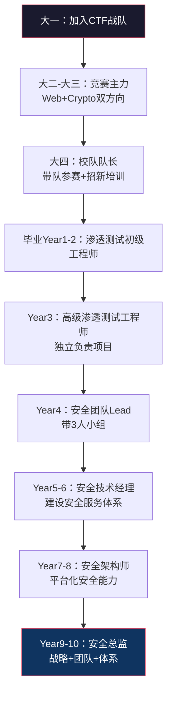
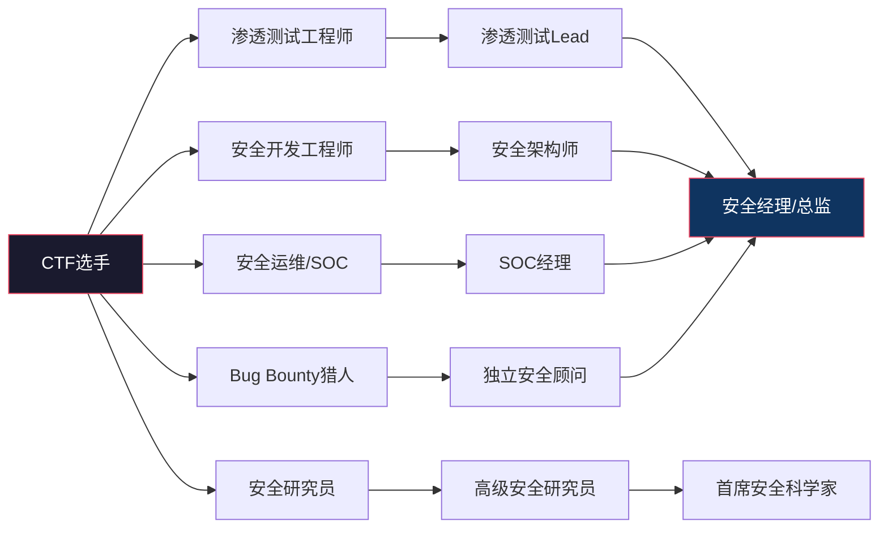

## 案例八：从CTF选手到安全总监

### 案例概述

本案例讲述孙工从大学CTF竞赛选手起步，历经十年从渗透测试工程师成长为大型企业安全总监的完整职业路径。这条路线代表了安全行业中"技术竞赛出身 → 一线攻防 → 技术管理"的经典转型范式，也是CTF选手最常见的职业发展方向之一。

孙工的故事揭示了一个核心命题：**竞赛能力不等于职业能力，但竞赛中培养的思维方式、学习能力和技术广度，是职业发展的加速器**。理解这个命题，比简单模仿孙工的每一步更重要。

### 人物画像

| 维度 | 信息 |
|------|------|
| 学历 | 计算机科学与技术本科（211高校） |
| 竞赛经历 | 大一加入校CTF战队，主攻Web安全和Crypto方向 |
| 竞赛成绩 | 全国大学生信息安全竞赛一等奖、XCTF联赛分站赛Top5、多次国际CTF决赛 |
| 第一份工作 | 安全公司渗透测试工程师 |
| 认证 | OSCP、CISSP、CISA |
| 当前职位 | 某互联网公司安全总监（管理20人团队） |
| 年限 | 从毕业到安全总监共10年 |

### 十年发展全路径

#### 阶段一：CTF竞赛期（大学四年）

**大一：入门与适应**

孙工高考后选择了计算机科学专业，大一下学期接触到学校的CTF战队招新。当时他对安全领域几乎零基础，但编程功底扎实（高中学过Pascal和Python）。招新考核题包括Web基础（SQL注入原理）、密码学入门（凯撒密码和RSA基础）、逆向分析（简单的x86汇编），孙工通过考核后加入了战队。

大一的主要学习内容：
- Web安全基础：OWASP Top 10概念、Burp Suite基本使用、常见注入类型
- 密码学基础：古典密码、对称加密（AES/DES）、非对称加密（RSA/ECC）
- 逆向入门：x86汇编基础、IDA Pro基本操作、简单CrackMe练习
- 编程能力：Python脚本编写用于自动化解题

**大二-大三：竞赛主力**

经过一年积累，孙工在大二成为队内主力，专注于Web安全和密码学两个方向。他发现自己在这两个方向有天然的交叉优势——Web题中经常涉及密码学知识（如JWT签名伪造、token破解），而Crypto题中也常需要Web技能来交互。

这个阶段的关键成长：
- **技术深度**：从"会用工具"到"理解原理"的转变。不再只是跑sqlmap，而是理解SQL注入的底层原理、WAF绕过的技术本质
- **解题思维**：CTF题目设计的精妙之处在于，每道题都有一个"关键洞察点"，找到它就能解题。这种思维模式后来在渗透测试中极为有用
- **团队协作**：CTF比赛通常是团队作战，孙工学会了分工协作、信息共享、在压力下沟通
- **自学能力**：CTF涉及的知识面极广，很多内容课堂上不教，必须自学。这个能力在后续职业生涯中是最核心的竞争力

大二到大三期间的重要赛事成绩：
- 全国大学生信息安全竞赛（CISCN）一等奖
- XCTF联赛多个分站赛Top5
- DEFCON CTF资格赛
- 多个国内知名CTF赛事前三名

**大四：队长与传承**

大四时孙工成为校队队长，除了继续参赛，还需要负责招新培训和梯队建设。这段经历为他后来的管理转型埋下了伏笔：
- **知识体系化能力**：为了教别人，必须把自己的知识整理成体系
- **团队管理初体验**：如何分配训练任务、如何激励新人、如何处理队内矛盾
- **资源协调**：向学校争取训练场地、服务器资源、参赛经费

> **关键洞察**：CTF队长经历往往被求职者忽略，但它实际上是管理能力的早期训练。面试时主动提及这段经历并讲述具体管理挑战，会给面试官留下深刻印象。

#### 阶段二：初入职场——渗透测试工程师（第1-3年）

**第1年：从CTF到工作的适应期**

孙工毕业后加入了一家中型安全公司，担任渗透测试工程师。他很快发现了CTF实战与真实渗透测试之间的巨大差异：

| 维度 | CTF比赛 | 真实渗透测试 |
|------|---------|-------------|
| 环境 | 标准化比赛环境，有明确flag | 真实生产环境，高度不确定 |
| 范围 | 题目明确告诉你攻击面 | 需要自己做信息收集和资产发现 |
| 时间 | 几小时到几天 | 几天到几周 |
| 报告 | 简单提交flag | 需要写专业渗透测试报告 |
| 合规 | 无限制 | 必须在授权范围内操作 |
| 沟通 | 几乎不需要 | 需要频繁与客户沟通 |

前半年孙工经历了一段"降维打击"的反向冲击——他技术能力不差，但不会写报告、不会跟客户沟通、不了解合规要求。他的第一份渗透测试报告被主管打回了四次，原因是"技术描述过于专业，客户看不懂"、"风险等级评估不准确"、"修复建议不够具体"。

孙工的适应策略：
1. **模仿学习**：找到公司里写报告最好的同事，把他的报告逐字逐句分析
2. **建立模板**：整理出自己的报告模板，包含标准的章节结构和常用表述
3. **客户视角**：在写报告时假想自己是不懂技术的客户，检验描述是否足够清晰
4. **主动请教**：每周找主管review自己的报告，收集反馈持续改进

**第2-3年：技术能力快速提升**

度过适应期后，孙工的CTF功底开始发力。他在渗透测试项目中展现出几个明显优势：

1. **漏洞发现速度快**：CTF培养的快速识别"关键点"的能力，让他在代码审计和渗透测试中效率很高
2. **技术广度大**：Web、Crypto、逆向都懂一些，能应对更多类型的项目
3. **自动化能力强**：CTF中大量使用脚本自动化，这个习惯让他在工作中也能快速开发工具提升效率
4. **学习新技术快**：CTF培养的自学习惯，让他能快速掌握新技术栈

第2年开始参与大型渗透测试项目，包括某银行的年度安全评估、某电商平台的重保前渗透测试。这些项目经验让他的技术深度有了质的飞跃。

**第2年末**：考取OSCP认证。孙工认为OSCP的考试模式与CTF类似（在规定时间内攻破目标机器），因此准备起来相对轻松。但OSCP强调的"手工利用、不依赖自动化工具"的理念，帮助他进一步夯实了底层技术能力。

**第3年**：晋升为高级渗透测试工程师，能独立负责大型项目的渗透测试方案设计和技术执行。

#### 阶段三：技术专家期（第3-6年）

**第3-4年：技术深耕与行业影响力**

成为高级渗透测试工程师后，孙工开始思考下一步发展方向。他面临两条路：继续做纯技术（安全研究、漏洞挖掘）或者转向管理。他选择了一条折中路线——**先建立技术影响力，再逐步转向管理**。

技术深耕方向：
- **漏洞挖掘**：开始在厂商漏洞响应平台提交漏洞，逐渐积累了多个高危漏洞的CVE编号
- **安全研究**：研究新型攻击技术，包括云安全攻防、API安全、容器安全等新兴领域
- **工具开发**：基于渗透测试中积累的需求，开发了几个内部安全工具（自动化信息收集平台、漏洞管理工具）
- **安全会议演讲**：在国内安全会议上发表技术演讲（先从小型meetup开始，逐步到XCon、KCon等知名会议）

> **关键经验**：孙工总结说，安全会议演讲是他职业发展的"加速器"。一次好的技术分享可以带来：同行认可、猎头关注、人脉扩展、以及"被迫深入研究一个课题"的压力（因为你不能在台上讲不清楚的东西）。

**第5年：从技术到管理的转折点**

第5年，公司业务快速扩张，安全团队需要从3人扩充到8人。孙工被提拔为安全团队Lead，负责带一个3人的渗透测试小组。这个转变是被动的——公司需要一个技术强且了解团队的人来带新人，孙工是最合适的选择。

从技术专家到团队Lead的挑战：

| 维度 | 之前（个人贡献者） | 之后（团队Lead） |
|------|-------------------|------------------|
| 工作重心 | 自己做渗透测试 | 分配任务、review成果、指导新人 |
| 时间分配 | 100%技术工作 | 60%技术+40%管理 |
| 成功标准 | 自己发现的漏洞质量和数量 | 团队整体产出和新人成长速度 |
| 技能需求 | 渗透测试技术 | + 项目管理、人员管理、沟通协调 |
| 最大挑战 | 技术难题 | 人的问题（动机、能力、态度） |

孙工在这个阶段踩过的坑：
1. **放手不够**：总是觉得"自己做比教别人做更快"，导致新人得不到锻炼机会
2. **反馈不及时**：新人的报告问题积累到项目结束才说，错过了最佳纠正时机
3. **技术焦虑**：担心做管理后技术退步，因此同时扛着技术任务和管理任务，结果两头都没做好
4. **不会向上管理**：只关注团队内部事务，忽略了与上级和其他部门的沟通

#### 阶段四：管理转型期（第6-10年）

**第6年：正式转管理**

孙工彻底从个人贡献者转型为安全技术经理，负责一个5人的安全服务团队。他开始系统性地学习管理知识：

- 阅读管理经典书籍：《管理的实践》（德鲁克）、《高效能人士的七个习惯》、《团队协作的五大障碍》
- 参加公司内部的管理者培训项目
- 找一位资深安全总监做导师，定期交流管理心得
- 学习项目管理方法论（敏捷、看板）

**第7-8年：安全体系建设**

随着经验积累，孙工开始负责更宏观的安全体系建设工作：
- 制定公司级安全策略和安全标准
- 建设安全运营中心（SOC），包括日志分析、威胁检测、应急响应流程
- 推动安全左移，在开发流程中集成安全检查（SAST、DAST、SCA）
- 建立安全培训体系，面向全员的安全意识培训和面向开发者的安全编码培训
- 参与合规工作（等保2.0、ISO 27001）

**第9-10年：成为安全总监**

第9年，孙工加入一家大型互联网公司担任安全总监，负责20人规模的安全团队。他的职责从"做事"彻底转变为"做决策"：

安全总监的核心职责：
1. **战略规划**：制定3-5年安全战略路线图，明确每年的安全建设重点
2. **预算管理**：管理安全预算（工具采购、人员成本、培训投入、外部服务）
3. **团队建设**：招聘、培养、考核安全团队成员，建立人才梯队
4. **跨部门协作**：与研发、运维、产品、法务等部门协调安全需求
5. **风险管理**：评估公司面临的安全风险，确定风险处置优先级
6. **应急响应**：重大安全事件的决策指挥
7. **向上汇报**：向CTO/CEO汇报安全工作成果和风险态势

### CTF经历的深层价值分析

CTF对孙工职业生涯的价值远不止"简历上好看"，它在多个维度上塑造了他的能力模型：

#### 思维模式层面

**1. 分解复杂问题的能力**

CTF题目的本质是一个"黑盒"——你不知道里面有什么，但需要通过有限的信息逐步缩小范围，最终找到答案。这种"从不确定中寻找确定性"的思维模式，与渗透测试、安全架构设计、风险管理的工作模式高度一致。

**2. 攻击者视角**

长期参加CTF让人自然形成"攻击者思维"——看到一个系统，本能地思考它的薄弱环节在哪里。这种视角对于安全管理者尤其重要，因为安全策略的核心就是"假设攻击者会怎么做，然后针对性防御"。

**3. 快速学习和知识迁移**

CTF题目横跨Web、逆向、密码学、Pwn、Misc等多个方向，选手必须快速学习新知识。这种能力在安全行业尤为重要，因为安全技术更新极快，今天的主流技术可能明天就被新的攻击方式颠覆。

#### 人脉资源层面

CTF圈子里聚集了大量优秀的安全人才，这些人后来分布在各大公司的安全部门。孙工的很多人脉都是CTF时期建立的：
- 找工作时的内推机会
- 技术问题的交流讨论
- 安全情报的互通有无
- 行业会议的共同参与

#### 需要警惕的CTF"后遗症"

孙工也坦言，CTF经历带来了一些负面影响需要主动克服：

| CTF习惯 | 职业中的问题 | 解决方法 |
|---------|-------------|---------|
| 追求快速解题 | 渗透测试不够深入，停留在表面 | 建立系统化的渗透测试方法论，不放过任何细节 |
| 个人英雄主义 | 不善于团队协作，喜欢独自解决问题 | 主动练习代码review、pair渗透、知识分享 |
| 重技术轻文档 | 报告写作能力差 | 专门练习技术写作，学习优秀报告范例 |
| 忽略合规边界 | 在未授权范围内测试 | 牢记渗透测试的法律边界，获取书面授权 |
| 竞赛心态 | 忽略业务风险，只追求技术突破 | 学习从业务视角评估风险，用业务语言沟通安全 |

### CTF选手职业发展路径详解

基于孙工的经验和更广泛的行业观察，CTF选手进入安全行业后主要有以下几条发展路径：

#### 路径一：渗透测试 → 安全管理（孙工的选择）

这是最常见的路径。CTF的Web安全和Pwn方向选手最适合走这条路。

关键节点：
- 第1-3年：夯实渗透测试基本功，考取OSCP
- 第3-5年：扩大技术广度，开始带团队
- 第5-8年：转向安全体系建设
- 第8-10年：进入安全管理层

所需补充技能：
- 沟通能力：学会用非技术语言向管理层解释安全风险
- 商业思维：理解安全投入与业务价值的关系
- 合规知识：等保、ISO 27001、GDPR等
- 项目管理：能规划和执行大型安全项目

#### 路径二：安全研究 → 首席安全科学家

适合Crypto和Reverse方向的选手，尤其是学术能力强、喜欢深入钻研的人。

关键节点：
- 第1-3年：在安全实验室或安全公司做漏洞研究
- 第3-5年：发表高质量安全研究论文
- 第5-8年：在特定领域建立权威地位
- 第8-10年：成为公司或行业的安全技术领袖

所需补充技能：
- 学术写作能力：能将研究成果转化为高质量论文
- 演讲能力：能在国际会议上发表技术演讲
- 英语能力：安全研究的顶级资源都是英文的

#### 路径三：安全开发 → 安全架构师

适合编程能力强、CTF中擅长写Exploit和工具的选手。

关键节点：
- 第1-3年：安全工具/平台开发
- 第3-5年：安全产品架构设计
- 第5-8年：企业安全架构规划
- 第8-10年：首席安全架构师

所需补充技能：
- 系统架构能力：理解分布式系统、微服务、云原生架构
- DevSecOps：将安全融入CI/CD流程
- 安全平台化思维：用平台和工具替代人工操作

### 从CTF到职场的转型指南

对于正在或即将从CTF转向职业安全的选手，以下是基于孙工经验的具体建议：

#### 求职准备

**简历优化**：
- CTF成绩不要只写"多次获奖"，要具体列出赛事名称、名次、队伍名称
- 突出CTF中解决的有代表性的问题，描述思路而非答案
- 如果有，列出CVE编号、漏洞发现记录、安全工具GitHub仓库
- 补充实习或兼职的项目经验

**面试准备**：
- 准备3-5个CTF中遇到的有趣题目，能清晰讲述解题思路
- 准备回答"CTF和真实渗透测试有什么区别"——这是必问题
- 了解目标公司的业务和安全需求
- 准备一个现场演示（如搭建一个有漏洞的靶机，现场渗透）

**薪资谈判**：
- CTF获奖经历可以作为谈判筹码，但不要过度期望
- 安全行业的薪资增长主要靠项目经验和管理能力，CTF只是敲门砖
- 第一份工作的重点是学习平台和成长空间，不要过分纠结薪资

#### 职业发展加速建议

1. **尽早开始写技术博客或公众号**：输出是最好的学习方式，同时建立个人品牌
2. **积极参与安全社区**：参加安全会议、加入安全微信群、在安全论坛活跃
3. **建立GitHub个人项目**：开发安全工具、编写安全脚本，展示工程能力
4. **考证要趁早**：OSCP（技术）、CISSP（管理）、CISA（审计）是三个最有价值的认证
5. **找到导师**：找一位比你资深5-10年的安全从业者做导师，定期交流
6. **不要过早转向管理**：技术基础越扎实，管理时越有底气

### 孙工的管理心得（摘录）

孙工在一次安全会议上分享过他从CTF选手到安全总监的管理心得，以下是核心观点：

**关于招聘**：面试时我最看重的不是候选人有多强的技术能力，而是他解决问题的思路是否清晰，以及他是否能在遇到困难时坚持寻找答案而不是轻易放弃。CTF选手在这方面通常表现很好，因为CTF本身就是不断面对未知、不断尝试突破的过程。

**关于团队管理**：安全团队的管理与其他技术团队的最大区别在于，安全工作的价值往往是"隐形"的——你做了很多工作，结果是"没有出事"，但"没有出事"很难被量化和认可。所以安全管理者必须学会向上沟通，用数据和案例向管理层展示安全工作的价值。

**关于技术更新**：安全技术更新极快，我虽然做了管理，但仍然保持每周至少10小时的技术学习时间。这不意味着我要亲自去做渗透测试，而是要能理解新技术的原理和风险，这样才能做出正确的决策。

**关于CTF选手的职业发展**：CTF是很好的起点，但不要把它当成终点。CTF教会你的是技术能力和学习能力，但职业发展还需要沟通能力、商业思维、管理能力等"软技能"。越早意识到这一点，职业发展就越顺利。

### 本案例的核心启示

1. **CTF是优秀的安全人才培养机制**，但竞赛能力需要经过"翻译"才能转化为职业能力——这个翻译过程通常需要1-2年
2. **技术深度是管理的底气**：孙工能在管理岗位上做出正确决策，根本原因是他有深厚的技术功底，能理解团队在做什么、能判断技术方案的优劣
3. **管理转型需要刻意学习**：技术能力不会自动转化为管理能力，必须主动学习管理知识并刻意练习
4. **职业发展不是线性的**：孙工的路径看起来很顺利，但实际上他也经历过迷茫期（是否转向管理）、挫折期（团队管理踩坑）和转型阵痛期（从个人贡献者到管理者的角色切换）
5. **人脉和影响力是隐性资产**：CTF圈子、安全会议演讲、技术社区活跃度——这些看似"不直接产出"的活动，实际上为孙工的职业发展提供了大量隐性支持

### 适合走这条路径的人

并非所有CTF选手都适合走"CTF → 渗透测试 → 安全管理"这条路。以下特质的人更适合：

- 对安全行业有长期热情，不是三分钟热度
- 喜欢与人合作和沟通，而不是独自钻研
- 有较强的自驱力和学习能力
- 能接受从"英雄"到"服务者"的角色转变
- 对商业和管理有兴趣，不排斥非技术工作

如果你更喜欢深入研究技术而不关心管理，那么"安全研究员"或"安全架构师"路径可能更适合你。
