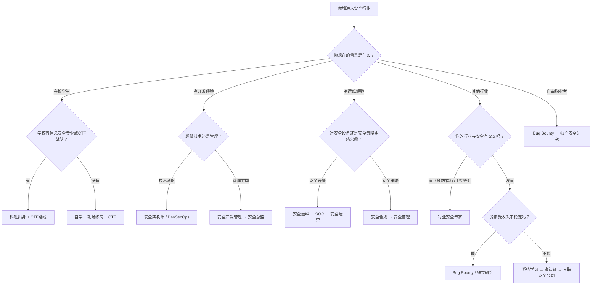

## 案例分析总结

前面八个真实案例覆盖了信息安全行业最典型的职业发展路径。本节作为实战案例篇的收尾，将从全局视角提炼共性规律、对比路径差异、构建决策框架，并为处于不同阶段的读者提供可执行的行动方案。

### 八条路径全景回顾

在深入分析之前，先用一张表快速回顾八个案例的核心要素：

| 案例 | 人物 | 起点 | 目标岗位 | 关键转折 | 总耗时 |
|------|------|------|----------|----------|--------|
| 案例一 | 小王 | 系统运维 | 渗透测试工程师 | CTF比赛出成绩 → 博客被HR看到 → 内推进入安全公司 | ~15个月 |
| 案例二 | 李工 | 后端开发（5年经验） | 安全架构师 → 安全总监 | 公司安全事件 → 主动申请加入安全团队 | ~3年 |
| 案例三 | 小赵 | 信息安全本科在读 | 独立安全研究员 | DEF CON演讲引起国际关注 | ~5年 |
| 案例四 | 张工 | 网络运维 | 安全总监 | 转岗安全运维 → 建设SOC → 管理20+人团队 | ~9年 |
| 案例五 | 陈工 | 银行金融（5年经验） | 金融安全专家 | 拿下CISP/CISSP → 加入金融科技安全团队 | ~3年 |
| 案例六 | 刘工 | 大厂安全团队（5年经验） | 安全咨询公司创始人 | 确定细分方向 → 人脉获取首批客户 | ~6年 |
| 案例七 | 周工 | 自学成才 | Bug Bounty全职猎人 | 发现第一个XSS → 建立自动化工具体系 | ~2年 |
| 案例八 | 孙工 | CTF竞赛选手（本科） | 安全总监 | 全国CTF获奖 → 安全公司渗透测试 → 管理转型 | ~10年 |

### 成功者的六大共性特征

分析八个案例，可以提炼出六个贯穿所有成功路径的底层规律。这些不是空洞的"鸡汤"，而是从真实经历中反复验证的模式。

#### 一、持续学习是基本功而非加分项

所有案例中无一例外地提到持续学习。但这里需要区分两种"学习"：

- **无效学习**：碎片化地看安全资讯、刷安全公众号，感觉自己"一直在学"但没有积累
- **有效学习**：系统性地构建知识体系，每个阶段有明确的学习目标和输出

小王（案例一）的做法值得借鉴——他每天固定2-3小时，先系统学网络协议和Linux，再学Python编程，最后才进入安全领域。这种"先地基后上层建筑"的学习路径，让他后续学习漏洞原理时事半功倍。

**关键区分**：持续学习不是"什么都学"，而是在每个职业阶段精准识别自己最需要突破的知识瓶颈，集中火力攻克。

#### 二、实践导向：用"做"来驱动"学"

案例一的小王在DVWA和WebGoat上练习，案例七的周工在HackerOne上实战，案例八的孙工通过CTF比赛磨练——所有人都是在"动手"中成长的，而不是在"看书"中成长的。

信息安全是一个极度依赖实践的领域。理论上理解SQL注入的原理，和实际在目标系统上发现并利用一个SQL注入漏洞，中间隔着巨大的鸿沟。这个鸿沟只能通过反复实践来弥合。

**有效的实践路径**：

1. **靶场练习**：DVWA、WebGoat、Hack The Box、TryHackMe —— 从有引导的环境开始
2. **CTF比赛**：Jeopardy模式入门，逐步尝试Attack-Defense —— 在压力下锻炼
3. **漏洞挖掘**：补天、HackerOne、Bugcrowd —— 从真实目标中积累实战经验
4. **项目实战**：参与公司安全项目、开源安全工具开发 —— 在工作中深化

#### 三、社区参与：从"独行侠"到"圈内人"

案例一的小王通过安全Meetup认识前辈获得指导，案例三的小赵通过DEF CON演讲获得国际关注，案例五的陈工通过人脉获得转型机会，案例六的刘工通过人脉获取第一批客户。

社区参与的价值体现在三个层面：

| 层面 | 价值 | 具体形式 |
|------|------|----------|
| 知识层 | 获取书本上没有的实战经验和行业洞察 | 技术论坛讨论、会议交流、私下请教 |
| 人脉层 | 获得内推、合作、客户等机会 | Meetup、会议、安全社区、微信群 |
| 品牌层 | 建立个人影响力，让机会主动找上门 | 博客写作、开源贡献、会议演讲 |

**参与深度梯度**：

- **L1 潜水者**：只看不说，获取信息但不建立连接（价值最低）
- **L2 参与者**：提问、回答、分享经验，开始被圈内人认识
- **L3 贡献者**：写技术文章、开源工具、组织活动，建立专业声誉
- **L4 影响者**：会议演讲、行业标准参与、培养后辈，成为领域权威

#### 四、成果积累：让能力"可见化"

案例一的小王用CTF成绩和博客文章证明自己，案例三的小赵用漏洞发现和会议演讲证明自己，案例七的周工用HackerOne声誉和赏金收入证明自己。

在安全行业，**没有成果等于没有能力**——至少在求职和合作场景中是这样。HR和技术面试官无法读取你的大脑，他们只能通过你展示的成果来判断你的水平。

**成果类型及权重**（按面试官/客户的关注度排序）：

1. **高危漏洞发现**（权重最高）—— CVE致谢、知名厂商漏洞报告致谢
2. **CTF竞赛成绩**—— 全国/国际比赛获奖记录
3. **会议演讲**—— Black Hat、DEF CON、国内安全峰会
4. **技术博客/研究文章**—— 持续输出的高质量内容
5. **开源项目**—— 有star数和实际用户的工具
6. **认证证书**—— OSCP、CISSP等（门槛作用，非决定性）
7. **Bug Bounty记录**—— HackerOne/Bugcrowd的声誉和赏金统计

#### 五、抓住关键转折点

回顾八个案例，每个成功路径都有一个或多个"关键转折点"：

- 案例一：CTF比赛出成绩 → 博客被HR看到
- 案例二：公司安全事件 → 主动申请加入安全团队
- 案例三：DEF CON演讲 → 国际关注
- 案例五：拿下CISP/CISSP → 跨过简历门槛
- 案例六：确定细分方向 → 老东家带来首批客户

这些转折点看起来有运气成分，但仔细分析会发现：**每一个"运气"背后都有充分的准备**。小王如果之前没有写博客，HR就不会看到他的文章；李工如果没有主动申请，就不会抓住公司组建安全团队的机会。

> 运气是准备遇到机会。—— 巴斯德（Louis Pasteur）

#### 六、从技术到管理的思维跃迁

案例四（张工）和案例八（孙工）都经历了从技术岗到管理岗的转型。这个转型不是简单的"升职"，而是一次思维模式的根本转变：

| 维度 | 技术思维 | 管理思维 |
|------|----------|----------|
| 关注点 | 自己的技术深度 | 团队的整体能力 |
| 成就感 | 解决了技术难题 | 帮助团队成员成长 |
| 决策依据 | 技术最优解 | 业务价值与技术可行性的平衡 |
| 沟通对象 | 技术同事 | 高管、业务部门、合规团队 |
| 时间尺度 | 当前项目 | 年度规划、战略方向 |

### 路径对比与选择框架

#### 七条路径的深度对比

| 维度 | 科班出身 | 开发转型 | 运维转型 | 跨界转型 | Bug Bounty | CTF出身 | 独立研究 |
|------|----------|----------|----------|----------|------------|---------|----------|
| **入门门槛** | 中（需专业背景） | 中高（需开发经验） | 中（需运维经验） | 高（需补大量基础） | 低（自学即可开始） | 中（需竞赛能力） | 高（需研究天赋） |
| **初期收入** | 8-15K/月 | 15-25K/月 | 8-12K/月 | 10-20K/月 | $500-2000/月 | 8-15K/月 | 不稳定 |
| **天花板** | 高 | 很高 | 高 | 很高 | 很高 | 高 | 极高 |
| **自由度** | 低 | 低 | 低 | 低 | 很高 | 中 | 很高 |
| **稳定性** | 高 | 高 | 高 | 中 | 低 | 高 | 低 |
| **成长速度** | 中 | 快 | 中 | 慢→快 | 快 | 快 | 慢→快 |
| **核心优势** | 系统基础扎实 | 理解代码和架构 | 了解生产环境 | 跨领域复合能力 | 灵活自由 | 实战能力强 | 深度研究能力 |
| **主要挑战** | 缺乏实战 | 需要安全思维转换 | 需要安全思维转换 | 基础知识缺口大 | 收入不稳定 | 可能偏重技巧 | 收入和社交需求 |
| **代表岗位** | 安全研究员、渗透测试 | 安全架构师、DevSecOps | 安全运维工程师、SOC分析师 | 行业安全顾问 | 独立研究员 | 渗透测试、红队 | 安全研究员、漏洞挖掘 |
| **适合人群** | 在校生、对口专业 | 3年+开发经验 | 3年+运维经验 | 有行业经验+安全热情 | 自律、能承受不确定性 | 竞赛型、好胜心强 | 研究型、能独处 |

#### 路径选择决策树

#### 不同人生阶段的路径建议

**18-22岁（在校阶段）**：

这是最理想的起步期。案例三的小赵和案例八的孙工都是从大学开始积累的。建议：加入CTF战队，系统学习安全基础，参加竞赛积累成绩，利用寒暑假实习。

**22-28岁（职业早期）**：

这是转型的黄金窗口。案例一的小王工作两年后转型，案例五的陈工在银行工作五年后转型。这个阶段学习能力强、生活压力相对较小、试错成本较低。建议：选定一个安全方向深入学习，利用业余时间积累成果，通过社区和内推进入安全行业。

**28-35岁（职业中期）**：

转型难度增大但并非不可能。案例二的李工和案例四的张工都在这个阶段完成了关键跃迁。优势是已有行业经验和人脉，劣势是学习时间和精力受限。建议：发挥已有背景的优势（开发/运维/行业经验），选择复合型安全岗位（安全架构师、行业安全顾问），通过认证跨过门槛。

**35岁以上**：

直接转型做纯技术岗的难度较大，但可以走管理或咨询路线。案例六的刘工从大厂出来创业，走的就是"经验+人脉+行业洞察"的路线。建议：利用深厚的行业积累，定位为安全管理者或行业安全顾问。

### 各路径的典型薪资发展曲线

以下数据基于国内一线城市的行业平均水平（2024-2025年），仅供参考：

| 年限 | 渗透测试 | 安全架构师 | 安全运维/SOC | Bug Bounty | 安全管理 |
|------|----------|-----------|-------------|------------|----------|
| 0-1年 | 8-12K/月 | — | 6-10K/月 | $500-2K/月 | — |
| 1-3年 | 12-20K/月 | 20-30K/月 | 10-15K/月 | $2K-5K/月 | — |
| 3-5年 | 20-35K/月 | 30-50K/月 | 15-25K/月 | $5K-15K/月 | 25-40K/月 |
| 5-8年 | 35-50K/月 | 50-80K/月 | 25-40K/月 | $15K-30K/月 | 40-70K/月 |
| 8年+ | 50K+/月 | 80K+/月 | 40K+/月 | $30K+/月 | 70K+/月 |

**说明**：

- 渗透测试的天花板可以通过转向红队、安全研究或管理来突破
- 安全架构师在有开发背景的情况下起步薪资就较高
- Bug Bounty收入波动大，月均数据是平滑后的参考值
- 安全管理的薪资与团队规模和公司规模强相关
- 以上不含股票/期权等长期激励

### 从案例中提炼的"反模式"—— 常见失败路径

成功案例之外，行业中也存在大量"走弯路"甚至"停滞"的情况。从八个正面案例中反推，可以识别出以下常见失败模式：

#### 反模式一：知识碎片化，缺乏体系

**症状**：什么都懂一点，什么都不深入。看了无数安全公众号文章，但无法独立完成一个完整的渗透测试。

**根因**：没有按照"基础 → 专项 → 实战"的路径系统学习，而是东一榔头西一棒子。

**纠正**：参考案例一小王的做法——先花6个月打牢网络、Linux、编程基础，再选择一个方向深入。

#### 反模式二：只学不练，纸上谈兵

**症状**：能说出各种漏洞的原理，但在实际环境中发现不了漏洞。面试时理论答得好，实操题做不出来。

**根因**：学习停留在"知道"层面，没有进入"做到"层面。

**纠正**：每学一个知识点，就找对应的靶场环境练习。学SQL注入就去DVWA上练，学XSS就去PortSwigger上练。

#### 反模式三：闭门造车，不参与社区

**症状**：技术能力不错，但没有知名度，机会总是找不到自己。求职时只能海投简历，没有内推渠道。

**根因**：忽视了社区参与的价值，认为"技术好就够了"。

**纠正**：至少做到L2（参与者）—— 在技术论坛回答问题、在安全群里分享经验。逐步向L3（贡献者）升级—— 写技术博客、开源工具。

#### 反模式四：盲目模仿他人路径

**症状**：看到别人做Bug Bounty赚钱就跟风做Bug Bounty，看到别人做CTF就跟风做CTF，没有自己的主见。

**根因**：没有做自我评估，不清楚自己的优势、兴趣和约束条件。

**纠正**：先做自我评估（参考本章"自我评估"相关章节），再选择适合自己的路径。案例五的陈工之所以选择金融安全，正是因为他清楚自己的金融背景是独特优势。

#### 反模式五：过早追求管理，忽视技术深度

**症状**：工作两三年就想转管理，觉得"写代码/做渗透测试太累了"。结果技术深度不够，管理也没有根基。

**根因**：误解了"管理"的含义。安全管理不是"不管技术"，而是在深厚技术基础上的更高维度工作。

**纠正**：参考案例四的张工——他先在安全运维岗位干了3年，积累了扎实的技术功底，才逐步转向管理。案例八的孙工更是先做了6年技术专家，才开始管理转型。

#### 反模式六：追求认证数量，忽视实际能力

**症状**：简历上列了一堆认证（CISP、CISSP、CEH、OSCP……），但面试实操时表现平平。

**根因**：把认证当目的而非手段。部分认证（非实操类）通过背题就能拿到，不代表真实能力。

**纠正**：认证的定位是"跨过简历筛选门槛"，而非"证明技术能力"。在拿认证的同时，一定要积累实战成果（漏洞发现、CTF成绩、项目经验）。案例五的陈工拿了CISP和CISSP帮助他跨过门槛，但真正让他站稳脚跟的是金融安全领域的实战经验。

### 职业发展的三个底层逻辑

跳出具体路径，信息安全职业发展遵循三个底层逻辑，理解这些逻辑可以帮助你在任何阶段做出更好的决策。

#### 逻辑一：复合能力 > 单一能力

案例二的李工（开发+安全）、案例四的张工（运维+安全）、案例五的陈工（金融+安全）都验证了一个规律：**复合背景的人在安全行业更稀缺，因此更有价值**。

安全本质上是一个"横向"领域——它需要理解开发、运维、网络、业务、合规等多个维度。一个只懂安全的人，和一个懂开发又懂安全的人，解决问题的能力差距是巨大的。

**建议**：如果你已经有某个领域的经验，不要抛弃它，而是把它和安全结合起来。开发经验 → 安全架构师，运维经验 → 安全运营专家，金融经验 → 金融安全顾问。

#### 逻辑二：影响力 = 机会密度

案例三的小赵因为DEF CON演讲获得国际关注，案例一的小王因为博客被HR看到——**影响力决定了机会找到你的概率**。

在安全行业，影响力可以通过以下方式建立（按投入产出比排序）：

1. **技术博客**（投入低、持续产出）—— 写漏洞分析、工具使用教程、CTF题解
2. **开源工具**（投入中、长期回报）—— 开发解决实际问题的安全工具
3. **会议演讲**（投入高、短期爆发）—— Black Hat、DEF CON、国内安全峰会
4. **社区运营**（投入中、持续回报）—— 组织安全Meetup、维护技术社群

#### 逻辑三：职业发展是非线性的

八个案例中，没有一个是"线性上升"的。每个人都有停滞期、转折点、甚至倒退。案例四的张工在运维岗位干了3年才找到转型方向，案例七的周工在初期半年内几乎没有收入。

**接受非线性**意味着：

- 不要因为短期内看不到进步就放弃
- 不要因为别人发展比自己快就焦虑
- 专注于自己的路径和节奏
- 在"停滞期"积累能力，在"转折点"果断出手

### 可执行的行动清单

根据你当前所处的阶段，选择对应的行动清单开始执行：

#### 阶段一：零基础入门（0-6个月）

- [ ] 完成自我评估，确定适合自己的路径方向
- [ ] 系统学习计算机网络基础（TCP/IP、HTTP、DNS）
- [ ] 掌握Linux基本操作（文件管理、权限、进程、网络配置）
- [ ] 学习一门编程语言（Python优先，掌握基本语法和脚本编写）
- [ ] 注册并完成 OverTheWire Bandit 挑战（至少前20关）
- [ ] 注册 PortSwigger Web Security Academy，完成前3个实验室
- [ ] 开设技术博客，记录学习过程
- [ ] 加入至少2个安全技术社群（微信群、论坛、Discord）

#### 阶段二：专项深入（6-18个月）

- [ ] 选定一个安全方向（Web安全/二进制/移动安全/云安全）
- [ ] 完成该方向的系统学习路径（参考本章"技能树"相关章节）
- [ ] 在靶场环境（HTB/THM）完成至少20台机器
- [ ] 参加至少3次CTF比赛，写至少1篇解题报告
- [ ] 开始在漏洞平台（补天/HackerOne）尝试挖掘漏洞
- [ ] 准备并考取一个入门级认证（CISP/CEH）
- [ ] 博客持续更新，积累至少20篇技术文章
- [ ] 参加至少2次线下安全活动（Meetup/会议）

#### 阶段三：求职/跃迁（18-24个月）

- [ ] 整理个人成果集（CTF成绩、漏洞发现、博客文章、开源项目）
- [ ] 优化简历，突出安全方向的成果和经验
- [ ] 通过人脉获取内推机会（而非海投简历）
- [ ] 准备技术面试（理论+实操，参考本章"面试准备"相关章节）
- [ ] 入职后制定3-6个月的快速成长计划
- [ ] 找到一位mentor（可以是公司内的资深同事）

#### 阶段四：持续发展（2年+）

- [ ] 每年设定2-3个技术突破目标
- [ ] 逐步建立个人品牌（会议演讲/开源项目/技术专栏）
- [ ] 拓展安全领域之外的知识（业务理解、项目管理、沟通能力）
- [ ] 评估是否需要管理方向发展（如果选择管理，提前积累领导力）
- [ ] 持续更新认证和知识体系
- [ ] 培养后辈，参与社区建设

### 给不同读者的针对性建议

#### 在校学生

你的最大优势是时间充裕、学习能力强、试错成本低。最大劣势是缺乏实战经验和行业人脉。参考案例三小赵和案例八孙工的路径——加入CTF战队是性价比最高的起步方式。如果学校没有CTF战队，自己组建一个。在校期间至少拿到一个有分量的竞赛奖项，这会成为你进入安全行业的敲门砖。

#### 想转型的开发/运维工程师

你的最大优势是有扎实的技术基础和对系统的理解。这是安全行业非常稀缺的能力。参考案例二李工的做法——不要从零开始学安全，而是找到安全和你现有技能的结合点。开发背景走安全架构师/DevSecOps，运维背景走安全运维/SOC。利用公司内部转岗的机会，比从外部跳槽更容易。

#### 想转型的非技术背景从业者

你的行业知识是独特优势。参考案例五陈工——金融+安全的组合在金融科技领域极其稀缺。关键是跨过技术门槛：先考一个认证（CISP是不错的起点），系统学习安全基础，然后找到安全和你行业的交叉点。不要试图成为纯技术安全人员，而是成为"懂安全的行业专家"。

#### 想全职做Bug Bounty的人

这是一条高风险高回报的路径。参考案例七周工的经历——初期半年几乎没有收入是正常的。建议：不要一开始就辞职全职做，先在业余时间做到月入$2000+再考虑全职。专注于一两个你擅长的漏洞类型，建立自动化工具提效。Bug Bounty的收入天花板很高，但地板也很低。

#### 想创业的安全从业者

参考案例六刘工的经验——至少在大厂积累5年以上的经验和人脉再考虑创业。创业初期最核心的三件事：确定细分方向（不要什么都做）、获取第一批客户（从老东家和人脉开始）、控制现金流（活下来比做大更重要）。

***

> "每个人的职业道路都是独特的，关键是找到适合自己的那条路。不要羡慕别人的起点，不要焦虑别人的进度，专注于自己的成长节奏。在信息安全这个领域，只要你持续学习、持续实践、持续积累，时间一定会给你答案。"
