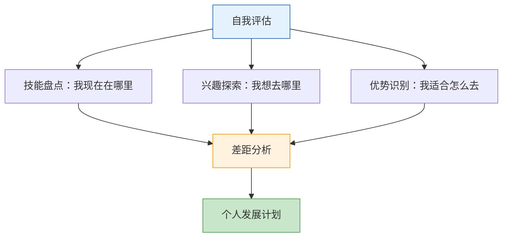
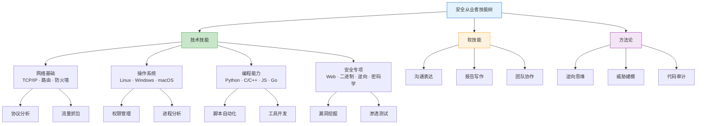
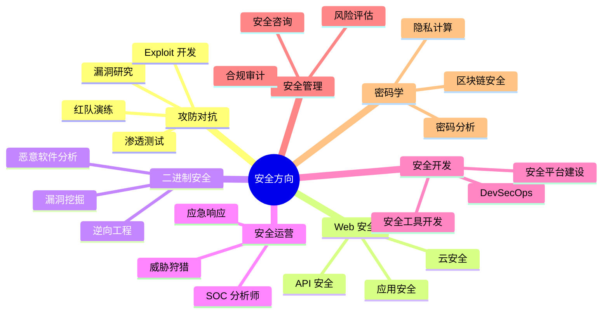

## 一、自我评估

自我评估是职业发展的起点。没有清晰的自我认知，后续的路径规划、技能提升、岗位选择都会变成盲人摸象。本节提供一套系统化的自我评估框架，帮助你从技能盘点、兴趣探索、优势识别三个维度全面认识自己，为后续的职业决策提供坚实依据。

### 1.1 为什么自我评估是第一步

很多安全从业者的成长路径是这样的：看到一个热门方向→盲目跟风学习→遇到困难就换方向→几年过去什么都会一点但什么都不精。根本原因就是缺少自我评估——不清楚自己当前在哪里、擅长什么、想要什么。

自我评估解决三个核心问题：

- **定位问题**：我当前的技能水平在行业中处于什么位置？
- **方向问题**：我的兴趣和优势指向哪个细分领域？
- **差距问题**：我离目标岗位还差多少？差在哪里？



### 1.2 技能盘点

技能盘点不是简单地打勾，而是要对每个技能领域建立清晰的分级标准，然后诚实地评估自己当前处于哪个级别。

#### 1.2.1 安全从业者核心技能树



#### 1.2.2 技能分级评估表

以下是各核心技能领域的四级评估标准。逐项对照，标记自己的真实水平。注意：**诚实是自我评估的底线**，高估自己比低估自己危害更大——它会让你跳过基础训练，在后续工作中暴露短板。

| 技能领域 | 初级（L1） | 中级（L2） | 高级（L3） | 专家（L4） |
|----------|------------|------------|------------|------------|
| **网络基础** | 理解 OSI 七层模型，能配置基本路由和防火墙规则 | 能分析 PCAP 抓包，理解 BGP/OSPF 等路由协议，会用 Wireshark 过滤复杂流量 | 能设计企业级网络架构，理解 SDN/NFV，能从流量中识别异常行为 | 能发现协议实现中的安全漏洞，对网络底层有深入理解 |
| **操作系统** | 熟练使用 Linux 命令行，理解文件权限和进程管理 | 能编译内核模块，理解系统调用链，会用 strace/ltrace 调试 | 能分析内核漏洞，理解安全加固机制（SELinux/AppArmor），能做系统级取证 | 能开发内核级安全工具，对 OS 安全架构有全面深入理解 |
| **编程能力** | 能用 Python/Go 编写自动化脚本，理解基本数据结构和算法 | 能开发中等复杂度的安全工具，理解多线程/网络编程，会用 Git 协作 | 能设计大型安全系统架构，掌握多种语言，理解编译原理 | 能开发编译器/解释器级别的工具，对语言设计有深入见解 |
| **Web 安全** | 理解 OWASP Top 10，能用 Burp Suite 做基本测试 | 能手动挖掘 SQL 注入/XSS/SSRF 等漏洞，理解 CSP/CORS 等防御机制 | 能发现业务逻辑漏洞，理解框架级安全问题，能绕过 WAF | 能发现 0day，对 Web 安全生态有全面把握 |
| **二进制安全** | 理解 ELF/PE 格式，会用 GDB 基本调试 | 能做栈溢出利用，理解 ASLR/DEP/Canary 等保护机制 | 能做堆利用和内核利用，理解各种高级利用技术 | 能发现复杂系统中的 0day，对 CPU 架构安全有深入理解 |
| **逆向工程** | 能用 IDA/Ghidra 分析简单程序，理解汇编指令 | 能逆向中等复杂度的二进制程序，理解编译器优化和反混淆 | 能逆向复杂的保护方案（VMProtect/Themida），理解反调试技术 | 能设计和破解高级保护方案，对逆向理论有全面把握 |
| **代码审计** | 能审计简单的 Web 应用代码，理解常见漏洞模式 | 能审计中等复杂度项目，理解框架级安全问题，会用 SAST 工具 | 能审计大型项目和底层库，能发现复杂的逻辑漏洞 | 能设计安全审计方法论，对多种语言的漏洞模式有系统理解 |
| **渗透测试** | 能用 Nmap/Nessus 做信息收集和漏洞扫描 | 能做完整的渗透测试，能编写自定义 Exploit | 能做红队演练，理解攻击链全貌，能绕过 EDR/防御体系 | 能设计攻击框架，对攻防对抗有全面深入的理解 |

#### 1.2.3 软技能评估

技术能力决定你能做什么，软技能决定你能走多远。安全行业尤其需要以下软技能：

**沟通能力**

| 级别 | 表现 |
|------|------|
| 初级 | 能用非技术语言向同事解释安全概念 |
| 中级 | 能撰写专业的安全报告，能向管理层汇报安全风险 |
| 高级 | 能在客户现场做安全方案演示，能主导安全培训 |
| 专家 | 能在行业会议上发表演讲，能撰写有影响力的安全白皮书 |

**学习能力**

| 级别 | 表现 |
|------|------|
| 初级 | 能跟上教程学习新技术，需要较长时间上手 |
| 中级 | 能通过阅读文档和源码自学，遇到问题能独立排查 |
| 高级 | 能快速掌握全新领域的知识体系，能在一周内上手新技术 |
| 专家 | 能预判技术趋势并提前布局，能在未知领域建立知识框架 |

**团队协作**

| 级别 | 表现 |
|------|------|
| 初级 | 能配合团队完成分配的任务 |
| 中级 | 能主动协调资源，推动项目进展 |
| 高级 | 能带领小团队完成复杂项目，处理团队冲突 |
| 专家 | 能建立高效的团队协作机制，培养团队成员 |

**问题解决**

| 级别 | 表现 |
|------|------|
| 初级 | 能按照既定流程解决常见问题 |
| 中级 | 能独立分析复杂问题，找到根本原因 |
| 高级 | 能在信息不完整的情况下做出合理判断 |
| 专家 | 能设计系统性的问题解决框架，处理前所未见的难题 |

#### 1.2.4 盘点方法论

光有评估表还不够，你需要一套方法来确保评估的准确性：

**方法一：项目复盘法**

回顾过去 6-12 个月做过的项目，问自己：
- 这个项目中我承担了什么角色？是主力还是辅助？
- 遇到的技术难点是什么？我是独立解决还是求助他人？
- 项目成果的质量如何？有没有被客户/领导指出问题？
- 如果重新做一次，我能做得更好吗？好在哪里？

**方法二：CTF/靶场验证法**

用客观成绩验证自己的水平：
- Web 安全：在 HackTheBox/TryHackMe 上能独立完成哪些难度的题目？
- 二进制：能做 Pwnable.kr 的哪些关卡？能逆向哪些复杂度的 CrackMe？
- 综合：在全国 CTF 排名中处于什么位置？

**方法三：同行对比法**

找到同阶段的同行，对比彼此的技能差异：
- 你们各自擅长什么？
- 别人能做到而你做不到的事情是什么？
- 你做到而别人做不到的事情是什么？

**方法四：招聘 JD 对照法**

找 10 个你目标岗位的 JD（Job Description），逐条对照：
- 要求的技能你具备多少？
- 标注"必须"的你缺了哪些？
- 标注"优先"的你缺了哪些？

### 1.3 兴趣探索

安全领域细分方向众多，很多初学者的困惑不是"学不会"而是"不知道学什么"。兴趣是最好的老师，但兴趣也需要科学的方法来发现和验证。

#### 1.3.1 安全领域细分方向概览



#### 1.3.2 兴趣发现的四步法

**第一步：广泛接触（1-2 个月）**

在学习初期，不要急于选定方向，而是广泛接触不同领域：
- 读 2-3 本不同方向的入门书籍（如《白帽子讲 Web 安全》《加密与解密》《逆向工程核心原理》）
- 看不同方向的技术演讲（Black Hat/DEF CON 演讲视频）
- 做不同方向的入门 CTF 题目
- 关注不同方向的安全博主和社区

**第二步：记录感受**

在接触过程中，记录自己的情绪反应：
- 哪些内容让你废寝忘食？
- 哪些内容让你觉得枯燥乏味？
- 哪些内容让你有"我一定要搞懂"的冲动？
- 哪些内容你愿意在周末花时间研究？

**第三步：分析驱动因素**

理解自己的兴趣来源，这能帮助你更精准地选择方向：
- **好奇心驱动**：你喜欢探索未知、发现隐藏的东西？→ 漏洞研究、逆向工程
- **成就感驱动**：你喜欢攻克难题、获得 flag？→ 渗透测试、CTF 竞赛
- **创造驱动**：你喜欢从零开始构建东西？→ 安全工具开发、安全平台建设
- **保护驱动**：你喜欢守护系统、保护用户？→ 安全运营、应急响应
- **逻辑驱动**：你喜欢严谨的推理和证明？→ 密码学、形式化验证

**第四步：实践验证（2-3 个月）**

选定 1-2 个最感兴趣的方向，深入实践：
- 完成该方向的一个完整项目（如写一个渗透测试报告、分析一个真实恶意样本）
- 参加该方向的 CTF 比赛或安全众测项目
- 在社区分享你的学习成果，看是否能持续保持热情
- 尝试教别人你学到的内容——教是最好的学

#### 1.3.3 兴趣与市场的平衡

纯粹跟着兴趣走可能找不到工作，纯粹跟着市场走可能干不长久。理想状态是找到两者的交集。

| 维度 | 纯兴趣导向 | 纯市场导向 | 兴趣+市场平衡 |
|------|-----------|-----------|--------------|
| 学习动力 | 强，但可能不稳定 | 弱，容易倦怠 | 持续稳定 |
| 就业前景 | 不确定 | 确定但可能竞争激烈 | 最优 |
| 成长天花板 | 高（热情驱动深度） | 中（缺乏内驱力） | 高 |
| 职业满意度 | 高 | 低到中 | 高 |

**当前市场热门方向参考**（2024-2025）：
- 云安全：企业上云带来的巨大需求缺口
- AI 安全：大模型安全评估、对抗攻击防御
- 供应链安全：开源组件漏洞、CI/CD 安全
- 数据安全：隐私计算、数据合规
- 工控安全/物联网安全：工业数字化转型带来的新需求

### 1.4 优势识别

每个人都有独特的认知模式和能力组合。识别并发挥优势比弥补劣势更高效——这不是说基础短板不用补，而是说你的核心竞争力应该建立在优势之上。

#### 1.4.1 四种优势类型

**分析型优势**

特征：善于分解复杂问题，喜欢追根究底，能从大量信息中提取关键模式。

适合方向：
- 安全研究：发现新漏洞、分析攻击技术原理
- 恶意软件分析：逆向分析恶意代码行为
- 威胁情报：从海量数据中提取威胁指标和攻击模式
- 密码分析：分析密码算法的安全性

验证方法：给你一个复杂的 CTF 题目，你是否享受从头分析到尾的过程？你是否经常问"为什么"而不是"怎么做"？

**创造型优势**

特征：善于跳出框架思考，喜欢尝试新方法，能提出别人想不到的解决方案。

适合方向：
- 攻击技术研究：开发新的攻击向量和绕过技术
- 安全工具开发：设计创新的安全工具和平台
- Fuzzing 研究：设计智能的模糊测试策略
- 红队演练：设计逼真的攻击场景

验证方法：面对一个被很多人研究过的系统，你是否总能想到新的攻击角度？你是否喜欢从零开始构建工具？

**沟通型优势**

特征：善于表达复杂概念，能与不同类型的人有效沟通，有较强的同理心。

适合方向：
- 安全咨询：为客户提供安全评估和建议
- 安全管理：制定安全策略、管理安全团队
- 安全培训：设计和交付安全培训课程
- 安全产品经理：将安全能力转化为产品

验证方法：你能否用 5 分钟让一个不懂技术的人理解 SQL 注入？你是否享受帮助别人理解复杂概念的过程？

**执行型优势**

特征：善于制定计划并严格执行，注重细节和流程，能在压力下保持稳定输出。

适合方向：
- 安全运营：7×24 小时安全监控和事件响应
- 应急响应：在安全事件中快速定位和处置
- 合规审计：按照标准流程进行安全审计
- 安全测试：按照方法论系统性地进行安全测试

验证方法：给你一个复杂的安全评估项目，你是否能制定详细的计划并按期交付？你是否享受将混乱的事情变得有序的过程？

#### 1.4.2 优势识别的实操方法

**方法一：Gallup 优势测评**

Gallup 的 CliftonStrengths 测评是目前最权威的优势识别工具之一，将人的优势分为 34 个主题（如分析、学习、成就、交往等）。测评结果能帮助你理解自己的核心优势组合。

**方法二：回顾高光时刻**

回忆过去一年中你最有成就感的 3-5 件事，分析：
- 这些事情有什么共同点？
- 你在其中发挥了什么能力？
- 这些能力是否可以迁移到安全领域的某个方向？

**方法三：360 度反馈**

向你的同事、领导、朋友收集反馈：
- 你觉得我最擅长什么？
- 你在什么情况下会想到找我帮忙？
- 你觉得我在哪些方面比大多数人做得好？

**方法四：排除法**

如果不确定自己擅长什么，先排除自己不擅长的：
- 你做过哪些事情感觉特别吃力？
- 你回避哪些类型的任务？
- 哪些事情别人轻松完成但你需要花很大力气？

#### 1.4.3 将优势转化为职业竞争力

识别出优势后，需要有意识地将它转化为职业竞争力：


**步骤一：选择匹配方向**——根据 1.3 的兴趣探索和 1.4 的优势识别，选定 1-2 个主攻方向。

**步骤二：刻意练习强化**——在优势方向上投入 70% 的学习时间，有意识地挑战更难的任务。

**步骤三：建立作品集**——将学习和实践成果转化为可展示的作品：
- 技术博客（展示你的思考深度）
- GitHub 项目（展示你的工程能力）
- CTF 成绩（展示你的实战水平）
- 漏洞提交记录（如 CNVD/CVE）

**步骤四：形成个人品牌**——在安全社区建立知名度：
- 在安全社区（先知、FreeBuf、安全客）发表技术文章
- 参加安全会议并发表演讲
- 在 GitHub 上维护开源安全工具

### 1.5 制定个人发展计划

自我评估的最终产出是一份可执行的个人发展计划。以下是计划模板：

#### 1.5.1 个人发展计划模板

```markdown
## 个人安全职业发展计划

### 基本信息
- 姓名：___________
- 当前岗位：___________
- 目标岗位：___________
- 计划周期：___________

### 技能现状评估
| 技能领域 | 当前水平 | 目标水平 | 差距分析 |
|----------|----------|----------|----------|
| ...      | L__      | L__      | ...      |

### 核心优势
- 优势1：___________
- 优势2：___________
- 如何发挥：___________

### 待提升领域（按优先级排序）
1. ___________（优先级：高/中/低）
   - 提升方法：___________
   - 预期时间：___________
   - 验证标准：___________

### 季度里程碑
- Q1：___________
- Q2：___________
- Q3：___________
- Q4：___________

### 资源需求
- 需要的培训/认证：___________
- 需要的工具/环境：___________
- 需要的导师/人脉：___________
```

#### 1.5.2 常见误区

| 误区 | 正确做法 |
|------|----------|
| 什么都想学，没有重点 | 选定 1-2 个主攻方向，投入 70% 时间 |
| 只评估技术，忽略软技能 | 技术和软技能并重，两者缺一不可 |
| 评估一次就不再更新 | 每季度重新评估一次，跟踪进步 |
| 高估自己的水平 | 用客观标准验证（CTF 排名、项目成果） |
| 只看短板不看优势 | 先发挥优势建立竞争力，再补基础短板 |
| 脱离市场谈发展 | 结合行业趋势和岗位需求规划方向 |
| 计划过于宏大不落地 | 设定可衡量的季度里程碑 |

#### 1.5.3 自我评估的周期性

自我评估不是一锤子买卖，而是需要持续进行的过程：

- **月度回顾**：花 30 分钟回顾本月的学习和实践，检查进度
- **季度评估**：每季度重新做一次完整的技能盘点，更新发展计划
- **年度复盘**：每年做一次深度复盘，评估整体发展方向是否正确
- **事件触发**：当行业出现重大变化（新技术、新威胁、新岗位）时，及时调整评估

> **核心要点**：自我评估的目的是"认识自己"，而不是"评判自己"。每个人都有优势和短板，关键是找到适合自己的路径。诚实面对现状，清晰定义目标，然后持续行动——这就是自我评估的全部意义。
