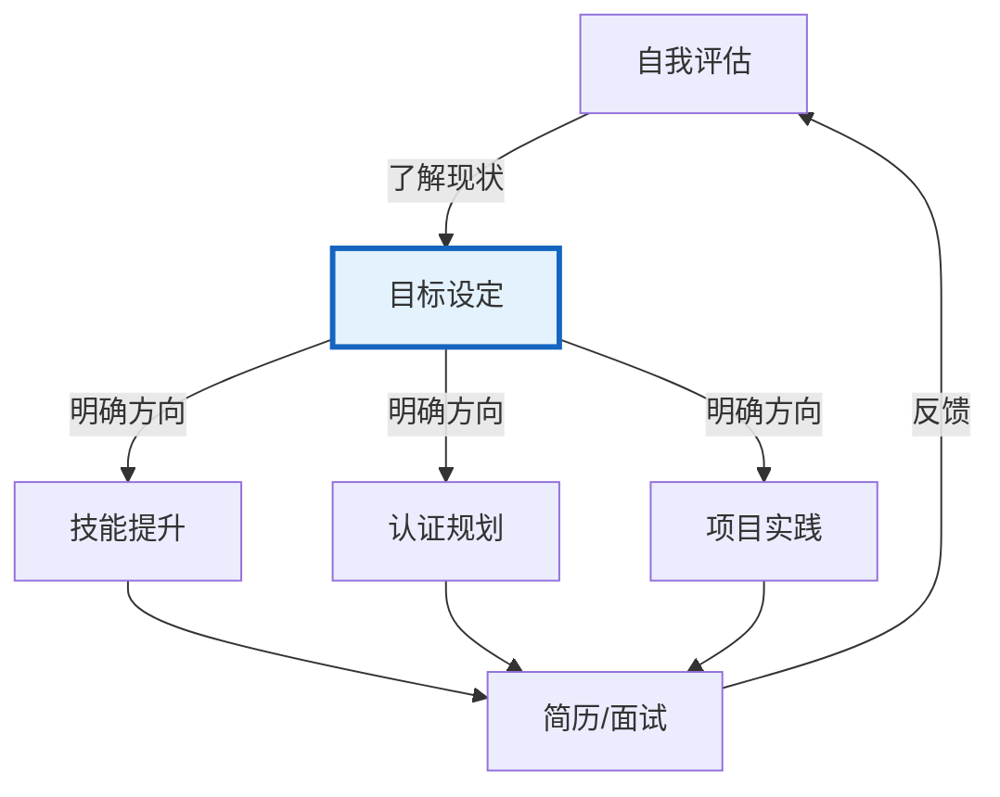
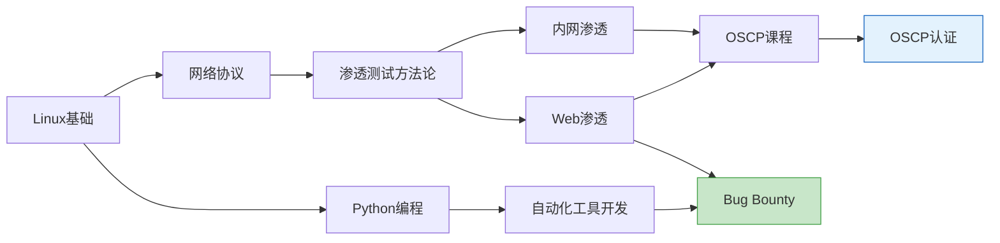
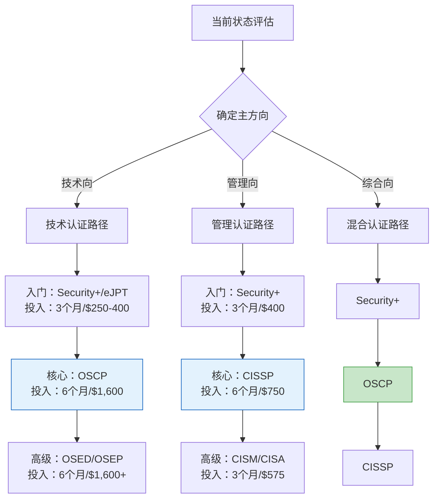

## 二、目标设定

完成自我评估之后，你已经对自己"在哪里"有了清晰的判断。接下来的核心问题是：**你要去哪里，以及怎么去？** 目标设定是将自我评估的洞察转化为可执行行动的桥梁——没有目标的自我评估只是一份体检报告，而没有自我评估的目标只是空中楼阁。

本节将从目标设定的底层原理讲起，逐步展开到安全行业的具体实践，最终给出可直接套用的模板和工具。无论你是零基础的转型者还是已有数年经验的从业者，都能从中找到适合自己的目标框架。

### 2.1 为什么目标设定对安全从业者尤为关键

信息安全行业的特殊性决定了目标设定不是"有则更好"的软技能，而是**直接影响职业存活率的核心能力**。原因有三：

**第一，安全领域的知识半衰期极短。** 技术栈每3-5年就会发生显著变化——十年前的渗透测试主力工具是BackTrack，现在是Kali；五年前企业还在讨论边界防御，现在已经是零信任架构。没有明确目标的学习者容易陷入"学了很多但什么都只懂皮毛"的陷阱，因为注意力被无限制地分散到每一个新兴热点上。

**第二，安全方向的高度分化要求你尽早做出选择。** 前面章节列出了渗透测试、安全研究、安全运营、安全架构等十余个方向。现实是：你不可能在所有方向都做到专家级。目标设定的本质是**选择不做什么**——通过明确的阶段性目标来约束你的精力分配。

**第三，安全行业的评估标准相对明确。** 与很多创意型职业不同，安全从业者的能力有相对客观的衡量标准：发现过多少漏洞（CVE编号）、拿到过哪些认证、CTF排名多少、发布过哪些工具或研究、参与过哪些应急响应。这些硬指标都可以作为目标的锚点。



### 2.2 SMART 原则：安全行业的落地实践

SMART原则（Specific、Measurable、Achievable、Relevant、Time-bound）是目标设定领域最经典的框架。但它经常被当成"正确但无用"的知识——原因在于大多数人只理解了字面意思，没有学会在具体场景中运用。以下逐一拆解每个维度在安全职业发展中的具体含义。

#### 2.2.1 Specific（具体的）

"具体"意味着目标回答了**What、Why、How**三个问题，而不仅仅是一个方向。

| 维度 | 问题 | 说明 |
|------|------|------|
| What | 具体要做什么？ | 精确到技术栈、工具、认证名称 |
| Why | 为什么要做这个？ | 与职业方向的关联是什么 |
| How | 通过什么路径实现？ | 学习资源、练习平台、时间安排 |

**反面案例与正面案例对比：**

| 类型 | 表述 | 问题分析 |
|------|------|----------|
| ❌ 模糊目标 | "我要学渗透测试" | 没有范围、没有深度标准、没有路径 |
| ✅ 具体目标 | "我要在6个月内掌握Web渗透测试的核心技能，包括SQL注入、XSS、SSRF、文件上传等OWASP Top 10漏洞的原理与利用，能够独立完成PortSwigger Web Security Academy的所有Lab" | 明确了范围（Web渗透/OWASP Top 10）、深度（独立完成Lab）、路径（PortSwigger Academy） |

#### 2.2.2 Measurable（可衡量的）

可衡量意味着你能在目标截止日期到来之前，客观地判断"做到了"还是"没做到"。安全行业恰好提供了大量天然的量化指标：

**安全行业常见量化指标：**

| 维度 | 可衡量指标 | 衡量方式 |
|------|-----------|----------|
| 知识掌握 | 靶场完成数量 | HTB/THM已Root机器数 |
| 漏洞发现 | CVE数量/严重程度 | CVE官网可查 |
| 认证进度 | 考试通过/未通过 | 认证机构记录 |
| CTF能力 | 排名/解题数 | CTFtime/平台记录 |
| 工具开发 | GitHub Stars/Forks | GitHub数据 |
| 技术输出 | 文章发布数量/阅读量 | 博客/公众号统计 |
| 社区影响力 | 演讲/会议次数 | 活动记录 |
| 实际项目 | 独立完成的渗透测试报告数 | 项目归档 |

**关键原则：选择"领先指标"而非"滞后指标"。** "拿到OSCP认证"是滞后指标——你只有在通过考试后才能确认。而"每周完成3台HTB靶机"是领先指标——它的执行直接指向最终目标，且每周都可以检验。好的目标体系应同时包含两类指标，但日常追踪应聚焦领先指标。

#### 2.2.3 Achievable（可实现的）

"可实现"不等于"容易"，而是指**在你的约束条件下有合理的成功概率**。评估可实现性时需要考虑以下因素：

**约束条件评估清单：**

| 约束因素 | 评估问题 | 调整策略 |
|----------|----------|----------|
| 时间 | 每周能投入多少小时？ | 全职工作者通常每周10-15小时，学生可到20-30小时 |
| 基础 | 当前技能与目标的差距有多大？ | 差距越大，需要的过渡目标越多 |
| 资源 | 学习材料和环境是否具备？ | 认证费用、靶场订阅、硬件需求 |
| 支持 | 是否有导师或学习伙伴？ | 独自学习的效率通常低于有指导的学习 |
| 动机 | 这个目标是你真心想做的吗？ | 外在动机驱动的目标更容易半途而废 |

**典型的目标膨胀案例：**

> "6个月零基础拿下OSCP"——如果目前不熟悉Linux命令行、没有任何编程基础、每周只能投入5小时，这个目标的实现概率极低。更合理的规划是：6个月打基础 → 6个月学习渗透测试方法论 → 3个月OSCP课程 + 考试准备，总计15个月。

**如何设定"有挑战但可实现"的目标：** 估算目标所需总工时，对比你的可用时间。以OSCP为例——Offensive Security官方建议的课程时间是至少60天的实验室时间，加上考试准备，典型的总投入在300-500小时。如果你每周能投入15小时，那么需要20-33周，即5-8个月。加上基础补充的时间，8-12个月是更现实的规划。

#### 2.2.4 Relevant（相关的）

"相关"意味着目标服务于你的长期职业愿景，而不是被外部噪音驱动。安全行业的噪音尤其多——每个月都有新的认证、新的靶场、新的"必备技能清单"。如果不加筛选地追逐每一个热点，你会发现自己在原地打转。

**相关性自检三问：**

1. **这个目标完成后，我离理想岗位更近了吗？** 如果你的目标是成为渗透测试工程师，那么学CISSP的相关性就低于学OSCP。
2. **这个目标的投入产出比合理吗？** 花6个月考一个行业认可度低的认证，不如用同样的时间深入学习一个核心技能。
3. **如果我不做这个目标，会有什么后果？** 如果答案是"没什么影响"，说明它的优先级可以降低。

**不同职业方向的目标优先级矩阵：**

| 优先级 | 渗透测试 | 安全研究 | 安全运营 | 安全架构 |
|--------|---------|---------|---------|---------|
| P0（必须） | 渗透测试方法论、Web安全 | 逆向工程、漏洞利用 | SIEM/日志分析、应急响应 | 网络架构、云安全 |
| P1（重要） | 内网渗透、权限提升 | Fuzzing、协议分析 | 威胁情报、安全编排 | 身份管理、加密体系 |
| P2（加分） | 社会工程、物理渗透 | 密码学、硬件安全 | 合规审计、安全培训 | 零信任架构、DevSecOps |

#### 2.2.5 Time-bound（有时限的）

没有截止日期的目标等于没有目标。但"有时限"不只是设一个deadline——你需要建立**时间节点检查机制**。

**时间框架设计原则：**

- **大目标用季度划分**：3个月一个里程碑，便于调整方向
- **中目标用月度检查**：每月评估进度，发现偏差及时纠正
- **小目标用周计划**：每周日规划下周的学习和实践任务
- **日常目标用番茄钟**：每天的学习时段具体到小时

**完整 SMART 目标示例：**

> **模糊版本**：我要成为渗透测试工程师。
>
> **SMART版本**：在2026年12月31日前（Time-bound），通过系统学习Web渗透测试和内网渗透技术（Specific），完成OSCP认证考试并取得证书（Measurable），基于我目前的3年开发经验和每周15小时的学习投入（Achievable），实现从开发者向渗透测试工程师的职业转型（Relevant），具体里程碑为：Q1完成HTB 30台靶机+学习笔记，Q2注册OSCP课程并完成所有Lab，Q3准备考试并首次尝试（Time-bound里程碑）。

### 2.3 OKR 方法：适用于安全团队和个人的进阶框架

SMART原则适合设定单个目标，但当你的职业发展涉及多个并行方向时，需要一个更高层的框架来管理目标之间的优先级和协调关系。**OKR（Objectives and Key Results，目标与关键结果）** 是Google等科技公司广泛使用的目标管理方法，同样适用于个人职业规划。

**OKR 与 SMART 的区别：**

| 维度 | SMART | OKR |
|------|-------|-----|
| 适用场景 | 单一目标 | 多目标并行管理 |
| 粒度 | 具体任务级 | 方向+任务级 |
| 时间跨度 | 通常3-12个月 | 通常按季度循环 |
| 灵活性 | 一旦设定较少调整 | 季度回顾，动态调整 |
| 挑战性 | 强调可实现 | 鼓励设定挑战性目标（70%完成即成功） |

**安全从业者的个人 OKR 示例（季度）：**

```yaml
Objective 1: 建立Web渗透测试的核心能力
  KR1.1: 完成PortSwigger Web Security Academy的20个Lab（覆盖Top 10漏洞类型）
  KR1.2: 在HTB上完成15台Medium难度靶机，每台撰写Write-Up
  KR1.3: 掌握Burp Suite的高级用法（宏、Intruder爆破、Sequencer分析）

Objective 2: 推进OSCP认证准备
  KR2.1: 完成OSCP课程注册并开始Lab环境使用
  KR2.2: 完成课程教材80%的练习
  KR2.3: 在Lab环境中独立获取20台机器的root权限

Objective 3: 建立技术影响力
  KR3.1: 在个人博客发布4篇技术文章（每月1篇）
  KR3.2: GitHub安全工具仓库获得50+ Stars
  KR3.3: 参加1次本地安全社区Meetup并做闪电演讲
```

**OKR 的执行节奏：**

| 时间 | 动作 | 说明 |
|------|------|------|
| 季度初 | 设定OKR | 1个Objective + 3-5个Key Results |
| 每周一 | 回顾进度 | 检查KR的完成百分比，标记本周重点 |
| 每月末 | 月度检查 | 评估3个月时间是否在正轨上，是否需要调整 |
| 季度末 | 评分复盘 | 0.7分（70%完成）是理想状态，1.0说明目标不够有挑战性 |

### 2.4 目标分解：从愿景到可执行任务

设定好SMART目标或OKR之后，下一步是将其分解为可执行的日常任务。这是大多数人在目标管理中最薄弱的环节——他们设定了清晰的目标，但不知道"今天该做什么"。

#### 2.4.1 WBS（工作分解结构）法

将大目标按层级逐层分解，直到每个底层任务可以在一个学习单元（通常2-4小时）内完成。

```text
目标：12个月通过OSCP认证
├── 第1-3月：夯实基础（每月约60小时）
│   ├── Linux系统管理（40小时）
│   │   ├── 命令行基础（8小时）
│   │   ├── 用户/权限/进程管理（8小时）
│   │   ├── 网络配置与防火墙（8小时）
│   │   ├── Shell脚本编程（8小时）
│   │   └── 综合实验：搭建渗透测试环境（8小时）
│   ├── 网络协议深入（30小时）
│   │   ├── TCP/IP协议栈（10小时）
│   │   ├── HTTP/HTTPS协议详解（10小时）
│   │   └── 抓包分析实战：Wireshark（10小时）
│   ├── Python编程（40小时）
│   │   ├── 基础语法与数据结构（10小时）
│   │   ├── 网络编程：socket/requests（10小时）
│   │   ├── 编写端口扫描器（10小时）
│   │   └── 编写自动化渗透脚本（10小时）
│   └── CTF/靶场入门（30小时）
│       ├── OverTheWire Bandit全通关（15小时）
│       └── HTB Easy难度靶机10台（15小时）
│
├── 第4-6月：渗透测试方法论（每月约60小时）
│   ├── 信息收集（30小时）
│   │   ├── 被动信息收集（OSINT）（10小时）
│   │   ├── 主动信息收集（Nmap/枚举）（10小时）
│   │   └── 信息整理与攻击面分析（10小时）
│   ├── Web渗透（50小时）
│   │   ├── SQL注入深入（10小时）
│   │   ├── XSS/CSRF（10小时）
│   │   ├── 文件上传/包含/RCE（10小时）
│   │   ├── 认证/授权漏洞（10小时）
│   │   └── 综合靶机练习（10小时）
│   ├── 系统渗透（30小时）
│   │   ├── 常见服务漏洞利用（10小时）
│   │   ├── 权限提升技术（Linux+Windows）（15小时）
│   │   └── 后渗透基础（5小时）
│   └── HTB靶机（每月10台，共30台）
│
├── 第7-9月：OSCP课程与实验（每月约80小时）
│   ├── 课程学习（50小时）
│   │   ├── 教材阅读与笔记（20小时）
│   │   ├── 课程练习（20小时）
│   │   └── 课程报告撰写（10小时）
│   ├── Lab环境（80小时）
│   │   ├── Lab机器逐台攻破（60小时）
│   │   ├── Lab报告撰写（10小时）
│   │   └── 薄弱环节补充学习（10小时）
│   └── 方法论沉淀（30小时）
│       ├── 整理个人渗透测试Checklist（10小时）
│       ├── 编写自用工具脚本集（10小时）
│       └── 模拟考试环境练习（10小时）
│
└── 第10-12月：冲刺与考试（每月约80小时）
    ├── 考试准备（60小时）
    │   ├── 模拟24小时考试（24小时×2次）（48小时）
    │   └── 报告模板和写作练习（12小时）
    ├── 弱项强化（40小时）
    │   ├── 针对性靶机练习（30小时）
    │   └── 新漏洞/技术跟踪（10小时）
    └── 正式考试（24小时考试+报告提交）
```

#### 2.4.2 逆向分解法

从目标的最终形态出发，逆向推导每一步的前置条件。这种方法特别适合目标路径不清晰的场景。

**示例：如何成为Bug Bounty猎人？**

```text
最终目标：月均Bug Bounty收入达到$3,000
    ↑ 前置条件：每月提交5-10个有效漏洞
        ↑ 前置条件：掌握主流Web漏洞挖掘技术
            ↑ 前置条件：能独立完成HTB Medium难度靶机
                ↑ 前置条件：熟悉Linux/网络/编程基础
                    ↑ 起点：零基础
```

逆向分解的优势在于：**每一步都是下一步的必要条件**，不会出现"学了一堆用不上"的情况。

#### 2.4.3 依赖关系图

当多个目标并行推进时，需要识别它们之间的依赖关系，确定执行顺序。



通过依赖关系图，你可以清晰地看到：哪些任务是关键路径上的（延迟它们会延迟整体目标），哪些任务可以并行推进。

### 2.5 短期、中期与长期目标的协同设计

目标不是孤立的点，而是一条从现在通往未来的链。三个时间层级需要彼此咬合——短期目标是中期目标的支撑，中期目标是长期目标的阶梯。

#### 2.5.1 长期目标（3-5年）：愿景层

长期目标回答的是"我想成为什么样的人"。它不需要非常具体，但必须足够清晰，能够指导你做每一个中期决策。

**长期目标设定框架：**

| 维度 | 思考问题 | 示例 |
|------|----------|------|
| 角色定位 | 5年后我在做什么类型的工作？ | "独立的高级渗透测试工程师，专注Web和云安全" |
| 能力画像 | 我最核心的不可替代能力是什么？ | "能在复杂企业环境中发现高价值漏洞并给出可落地的修复建议" |
| 收入期望 | 我期望什么样的收入水平？ | "年薪60万+，或Bug Bounty月均$5,000+" |
| 工作方式 | 我理想的工作状态是什么？ | "远程工作为主，有选择客户的自由" |
| 行业影响 | 我想在行业中建立什么影响力？ | "在Web安全社区有一定知名度，被邀请参与漏洞众测项目" |

#### 2.5.2 中期目标（1-2年）：路径层

中期目标是将长期愿景拆解为可执行的阶段性成果。每个中期目标应该是一个**完整的里程碑**——完成后你会有实质性的能力提升或资质证明。

**不同阶段从业者的典型中期目标：**

| 当前阶段 | 中期目标示例 | 核心产出 |
|----------|-------------|----------|
| 零基础转型（第1年） | 建立安全基础能力，拿到第一个入门认证 | eJPT/Security+认证 + HTB 50台靶机 |
| 初级从业者（1-3年） | 深化专项能力，形成个人技术标签 | OSCP认证 + 3个CVE + 技术博客20篇 |
| 中级从业者（3-5年） | 扩展影响范围，向架构/管理方向过渡 | 安全架构能力 + 带过1-2个项目 + 社区演讲 |

#### 2.5.3 短期目标（1-6个月）：执行层

短期目标是每天、每周直接执行的任务。它必须足够小、足够具体，让你在坐下来学习的那一刻就知道该做什么。

**短期目标设计模板：**

```text
本周目标（Week of YYYY-MM-DD）：
━━━━━━━━━━━━━━━━━━━━━━━━━━━━━━━━━━
🎯 核心任务（必须完成）：
  1. [ ] 完成HTB靶机 "Machine Name"，撰写Write-Up
  2. [ ] 学习SSRF漏洞原理，完成PortSwigger 3个Lab

📌 辅助任务（尽量完成）：
  3. [ ] 阅读《Web应用安全权威指南》第5章
  4. [ ] 更新GitHub安全工具仓库，修复一个Issue

📊 量化指标：
  - 学习时长目标：15小时（已投入 __ / 15）
  - 靶机完成目标：2台（已完成 __ / 2）

🔄 回顾：
  - 上周目标完成率：___%
  - 未完成原因分析：________________
  - 本周调整：____________________
```

### 2.6 安全行业特有的目标维度

通用的目标设定方法论需要结合安全行业的特点进行扩展。以下是安全从业者需要特别关注的几个目标维度：

#### 2.6.1 漏洞发现目标

对于志在渗透测试、安全研究方向的从业者，漏洞发现是最硬的能力证明。

| 阶段 | 目标 | 时间框架 | 衡量标准 |
|------|------|----------|----------|
| 入门 | 在CTF靶场中发现和利用常见漏洞 | 1-3个月 | 完成OWASP Top 10每种类型至少3个实例 |
| 初级 | 在开源项目中发现真实漏洞 | 3-6个月 | 提交至少1个被确认的CVE |
| 中级 | 在众测平台获取赏金 | 6-12个月 | 在HackerOne/Bugcrowd上累计收入$1,000+ |
| 高级 | 发现高影响漏洞 | 1-2年 | 发现Critical级别CVE，获得厂商致谢 |

#### 2.6.2 认证规划目标

认证投入是安全职业发展的高回报投资，但前提是你选择了正确的认证、在正确的时间点。

**认证路径规划模板：**



**认证投入产出分析：**

| 认证 | 典型投入（时间+费用） | 对简历的加分效果 | 适合的时间点 |
|------|---------------------|-----------------|-------------|
| Security+ | 2-3个月，$400 | 入门敲门砖，部分岗位硬性要求 | 职业第1年 |
| eJPT | 1-2个月，$250 | 证明实操能力，性价比极高 | 职业第1年 |
| OSCP | 6-12个月，$1,600 | 渗透测试领域的"黄金认证" | 职业1-3年 |
| CISSP | 3-6个月，$750 | 管理方向的硬通货 | 职业3-5年 |
| CISP | 2-3个月，¥6,000 | 国内甲方岗位认可度高 | 根据求职需要 |

#### 2.6.3 技术影响力目标

在安全行业，技术影响力（个人品牌）是薪资谈判和职业机会的重要杠杆。它不是虚荣指标，而是实际的职业资产。

**技术影响力构建路线图：**

| 阶段 | 目标 | 具体行动 | 预期时间 |
|------|------|----------|----------|
| 建立期 | 让别人知道你的存在 | 开设技术博客，每月1-2篇文章；GitHub活跃提交 | 0-6个月 |
| 成长期 | 让别人认可你的能力 | 发布有质量的安全工具/脚本；在社区分享Write-Up | 6-18个月 |
| 影响期 | 让别人主动关注你 | 在会议做技术演讲；发表原创安全研究；被邀请加入项目 | 18-36个月 |

### 2.7 目标追踪与动态调整

设定目标只是起点，持续追踪和适时调整才是目标管理的核心。以下是一套经过验证的目标追踪方法。

#### 2.7.1 周回顾仪式

每周花30分钟进行一次结构化的回顾，比每天漫无目的地"努力"更有效。

**周回顾模板：**

```text
📅 周回顾：YYYY-MM-DD

✅ 本周完成：
  1. ________________________
  2. ________________________
  3. ________________________

❌ 本周未完成（原因分析）：
  1. __________（原因：______）
  2. __________（原因：______）

📊 关键指标：
  - 学习时长：___小时（目标：15小时）
  - 靶机完成：___台（目标：3台）
  - 文章发布：___篇（目标：1篇）

💡 本周最大收获：______________________

⚠️ 本周最大障碍：______________________

🎯 下周Top 3优先事项：
  1. ________________________
  2. ________________________
  3. ________________________
```

#### 2.7.2 季度复盘与调整

每三个月进行一次深度复盘，评估是否需要调整目标方向。

**季度复盘框架（ORID法）：**

| 层级 | 问题 | 示例回答 |
|------|------|----------|
| **Objective（客观事实）** | 这个季度实际做了什么？ | "完成了15台HTB靶机，通过了eJPT，发布了3篇博客" |
| **Reflective（感受）** | 哪些事情让你感到有成就感或沮丧？ | "Web渗透越来越得心应手，但内网渗透方向进展缓慢，因为没有合适的实验环境" |
| **Interpretive（理解）** | 从中学到了什么？ | "我发现我对Web方向更有热情，内网方向可能是以后再深入的领域" |
| **Decisional（决定）** | 下个季度要做什么调整？ | "下个季度聚焦Web安全深度学习，内网渗透暂时搁置，开始准备OSCP" |

#### 2.7.3 常见的目标偏差与纠偏策略

| 偏差类型 | 表现 | 纠偏策略 |
|----------|------|----------|
| 进度滞后 | 持续无法完成周目标 | 降低目标难度或增加时间；检查是否有前置技能缺失 |
| 兴趣漂移 | 做着做着对别的方向更感兴趣 | 用"相关性三问"判断：如果真的更感兴趣，允许每季度调整一次方向 |
| 完美主义 | 某个知识点反复深挖，进度卡住 | 设置时间上限——每个主题最多投入X小时，超时就推进到下一个 |
| 孤立感 | 独自学习动力不足 | 加入学习社区（Discord/微信群），找Accountability Partner |
| 资源焦虑 | 收藏了太多资料不知道从哪个开始 | 规则：同一时间只用1个主资源+1个辅助资源，其他的全部存档 |

### 2.8 目标设定的常见误区

以下误区在安全行业新人中极为普遍，提前了解可以避免浪费数月甚至数年的时间。

**误区一：把"学习"当作目标。**

"我要学完《黑客攻防技术宝典》"不是目标——它是一个活动。目标应该是"掌握SQL注入的原理和利用技术，能够手动发现并利用SQL注入漏洞"。区分标准：目标描述的是**能力状态**（你能做什么），活动描述的是**行为过程**（你做了什么）。

**误区二：设定过高的初始目标。**

"3个月从零到OSCP"——这种目标的危害不在于你最终没完成（这很正常），而在于你在第2个月就会因为距离目标太远而彻底放弃。更好的做法是设定一个**保底目标**（最低可接受结果）和一个**理想目标**（超额完成）。例如：保底目标是3个月完成HTB 15台Easy靶机；理想目标是3个月完成HTB 15台Easy + 5台Medium。

**误区三：只关注技术目标，忽略软技能目标。**

安全从业者的职业天花板往往不是技术，而是沟通和影响力。在目标体系中，应该为软技能设定专门的目标，例如："本季度在团队内做2次技术分享""在安全社区回答10个高质量问题"。

**误区四：目标设定后不做回顾。**

年初设定的目标到年底才想起来——这时候已经来不及了。目标管理是**持续的过程**，不是一次性的事件。最有效的节奏是：每周回顾、每月检查、每季度调整。

**误区五：复制别人的目标。**

"他6个月拿到了OSCP，我也应该6个月拿到"——每个人的起点、可用时间、学习效率都不同。别人的目标只能作为参考，不能直接照搬。关键是根据自己的约束条件设定合理的时间线。

### 2.9 目标设定工具推荐

工欲善其事，必先利其器。以下是适合安全从业者使用的目标管理工具：

| 工具 | 类型 | 适合场景 | 推荐指数 |
|------|------|----------|----------|
| **Notion** | 全能笔记 | OKR追踪、周回顾、知识库一体化 | ★★★★★ |
| **Obsidian** | 本地Markdown | 目标分解+学习笔记+知识图谱 | ★★★★★ |
| **GitHub Projects** | 项目管理 | 用看板管理学习任务，与代码仓库联动 | ★★★★☆ |
| **Trello** | 看板工具 | 可视化目标进度，适合视觉型学习者 | ★★★☆☆ |
| **纸质手账** | 纯线下 | 每日目标+反思，手写有助于记忆和承诺 | ★★★★☆ |

**工具选择原则：** 最好的工具是你真正会用的工具。不要在工具选择上花费太多时间——一个简单的Markdown文件 + 每周回顾习惯，远比精心搭建的Notion模板但从不维护要有效。

### 2.10 本节小结

目标设定是一个需要反复练习的技能，不是一次性的任务。核心要点回顾：

1. **SMART原则是基础**：每个目标都应满足具体、可衡量、可实现、相关、有时限五个条件
2. **OKR是进阶框架**：当目标并行时，用OKR管理优先级和协调关系
3. **目标分解是关键**：从愿景到季度里程碑到周任务，层层拆解直到可执行
4. **三个时间层级要协同**：长期定方向，中期定路径，短期定行动
5. **安全行业有特殊维度**：漏洞发现、认证规划、技术影响力都需要纳入目标体系
6. **追踪和调整同样重要**：每周回顾、每月检查、每季度调整
7. **避免常见误区**：不把学习当目标、不设定过高初始目标、不忽略软技能、不做回顾、不复制别人的目标

> **行动建议：** 现在就花30分钟，用本节的方法论设定你的第一个季度OKR。不需要完美——先有一个可行的框架，然后在每周回顾中持续优化。记住：**完成比完美更重要。**
