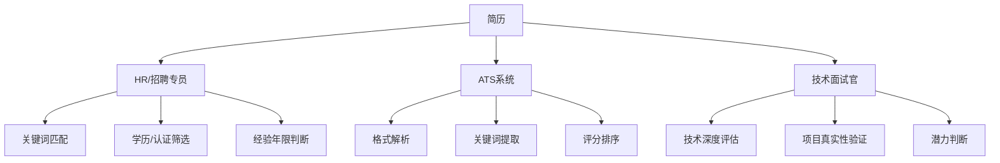
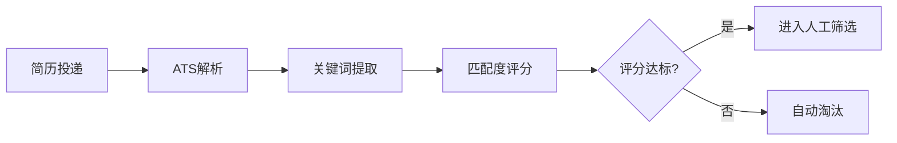

## 三、简历优化

简历是安全工程师职业发展的第一道门槛。在网络安全领域，简历不仅是求职工具，更是你技术能力和专业形象的浓缩呈现。一份优秀的安全工程师简历需要同时通过三重考验：HR的关键词筛选、ATS系统的自动解析、以及技术面试官的专业审视。本章从底层逻辑到实操细节，系统讲解如何打造一份能让安全岗位招聘方眼前一亮的简历。

### 3.1 安全工程师简历的底层逻辑

#### 3.1.1 简历的本质：价值证明书

简历不是经历的罗列，而是**价值的证明**。招聘方真正关心的不是你"做了什么"，而是你"做到了什么"以及"能为我带来什么"。理解这一点是写好简历的前提。

安全岗位的简历有其特殊性。与通用开发岗位不同，安全工程师的价值往往体现在**防御成果**和**风险发现**上，这些成果通常难以量化但又极具说服力。例如：

- 发现一个0day漏洞 vs 发现100个低危漏洞——前者的价值远超后者
- 设计一套安全架构避免了潜在损失 vs 日常安全运维——前者更体现核心价值
- 在CTF中获得名次 vs 参加过CTF——前者是可验证的能力证明

#### 3.1.2 三重读者模型

安全岗位简历需要同时满足三类读者的需求：



**HR的视角**：关注学历、工作年限、认证资质、关键词匹配。HR通常不具备深厚的安全技术背景，他们依赖关键词和标准化指标进行初筛。

**ATS系统的视角**：自动解析简历格式，提取关键字段（姓名、联系方式、技能、经历），根据岗位JD进行关键词匹配和评分。格式不规范的简历可能在ATS阶段就被淘汰。

**技术面试官的视角**：关注技术深度、项目真实性、解决问题的能力。他们会从简历中挑选感兴趣的技术点深入提问，简历中的每一句话都可能成为面试问题。

### 3.2 简历结构详解

安全工程师简历的标准结构如下，每个部分都有其特定的写作要求和技巧。

#### 3.2.1 个人信息区

个人信息区是简历的"门面"，需要简洁、专业、信息完整。

**必填信息**：
- 姓名（醒目但不花哨）
- 手机号码（确保畅通，建议使用常用号码）
- 电子邮箱（建议使用专业邮箱，避免使用过于随意的邮箱名如 cuteboy123@xxx.com）
- 所在城市

**加分信息**：
- 技术博客链接（如 freebuf、先知社区、个人博客）
- GitHub/GitLab链接（展示代码和安全项目）
- 个人网站（展示个人品牌）
- CSDN/知乎专栏（技术文章沉淀）

**注意**：
- 不需要填写性别、年龄、婚姻状况、政治面貌（除非招聘方明确要求）
- 照片可选，如果添加请使用专业证件照，不要使用生活照
- 邮箱建议使用 Gmail、Outlook 或自定义域名邮箱，国内可用 QQ 邮箱（但邮箱名要专业）

**反面示例**：
```text
姓名：小明
电话：13800138000
邮箱：handsome_boy_888@qq.com
性别：男
年龄：25岁
婚姻状况：未婚
星座：天蝎座
```

**正面示例**：
```text
张明 | 安全工程师
手机：138-0013-8000
邮箱：zhangming@protonmail.com
博客：https://zhangming-sec.github.io
GitHub：https://github.com/zhangming-sec
所在地：北京
```

#### 3.2.2 专业概述（Profile Summary）

专业概述是简历中最重要的"电梯演讲"，通常位于个人信息下方，用3-5句话概括你的核心价值。

**写作公式**：
> [经验年限] + [专业定位] + [核心能力] + [主要成就/亮点]

**初级安全工程师示例**（0-2年经验）：
> 拥有2年Web安全测试经验的安全工程师，熟练掌握OWASP Top 10漏洞的发现与利用技术。独立完成过50+目标的安全测试，累计发现高危漏洞23个，其中3个获得CNVD编号。持有CISP-PTE认证，活跃于多个SRC平台。

**中级安全工程师示例**（3-5年经验）：
> 拥有5年企业安全建设经验的安全工程师，专注于Web应用安全和云安全领域。曾主导某互联网公司安全SDL体系建设，将线上漏洞率降低67%。具备丰富的安全攻防实战经验，累计发现并报告漏洞200+个，获得多个厂商致谢。熟悉CI/CD安全集成，能将安全能力嵌入开发流程。

**高级安全架构师示例**（8年+经验）：
> 拥有10年安全行业经验的安全架构师，覆盖Web安全、云安全、移动安全多个领域。曾从0到1搭建某上市公司安全体系，管理15人安全团队，年度安全预算800万。主导过3次大型安全事件应急响应，零数据泄露。在DEFCON CTF中获得中国区前三名，持有OSCP、CISSP双认证。

**专业概述的常见错误**：
- ❌ "我是一个热爱安全、积极向上的年轻人"——空洞，无信息量
- ❌ "精通各种安全技术"——夸大，且不具体
- ❌ "希望找到一份有发展空间的工作"——这是你的诉求，不是你的价值
- ✅ 用具体数字和事实说话，让读者在10秒内了解你的核心价值

#### 3.2.3 技术技能（Technical Skills）

技术技能区是安全工程师简历的核心竞争力展示区。这部分需要精心组织，既要全面又要突出重点。

**技能分类展示法**：

```text
渗透测试：Burp Suite, Nmap, Metasploit, Cobalt Strike, SQLMap, dirsearch
代码审计：Fortify, SonarQube, Semgrep, CodeQL, 自研审计脚本
安全开发：Python, Go, Bash, SQL, JavaScript
安全架构：零信任架构, 微隔离, API网关安全, 服务网格安全
云安全：AWS安全组/IAM, 阿里云安全中心, Kubernetes安全策略
应急响应：Wireshark, Volatility, ELK Stack, YARA规则编写
安全运营：SIEM, SOC, 威胁情报平台, SOAR
```

**熟练程度标注法**（可选）：

| 技能领域 | 精通 | 熟练 | 了解 |
|---------|------|------|------|
| Web渗透 | SQL注入、XSS、SSRF | RCE、文件上传 | 反序列化 |
| 代码审计 | PHP、Java | Python、Go | Rust、C++ |
| 安全工具 | Burp Suite、Nmap | Cobalt Strike | Metasploit |
| 编程语言 | Python | Go、JavaScript | C、Rust |

**技能描述的注意事项**：
- 列出的技能必须是真实掌握的，面试官会根据技能列表提问
- 技能排序要与目标岗位匹配，最相关的放在前面
- 避免罗列过时的技术（如"精通DVWA"这种靶场不算技能）
- 适当标注版本号或具体场景（如"Kubernetes 1.25+安全策略配置"）

**安全岗位高频关键词清单**：

为了通过ATS筛选，确保简历中包含以下关键词（根据目标岗位选择）：

| 类别 | 关键词 |
|------|--------|
| 漏洞类型 | SQL注入、XSS、CSRF、SSRF、RCE、文件上传、反序列化、逻辑漏洞 |
| 安全标准 | OWASP Top 10、CWE、CVE、ISO 27001、等保2.0、GDPR |
| 安全流程 | SDL、DevSecOps、安全审计、渗透测试、代码审计、应急响应 |
| 行业认证 | CISP、CISSP、OSCP、CEH、CISP-PTE、AWS安全专项 |
| 技术栈 | WAF、IDS/IPS、SIEM、SOC、零信任、微隔离 |

#### 3.2.4 工作经历（Work Experience）

工作经历是简历中最有分量的部分，也是面试官重点阅读的区域。

**写作格式**：
```text
公司名称 | 职位名称 | 时间段
公司简介（一句话，帮助读者了解公司背景）

【核心职责】
- 职责描述1
- 职责描述2

【主要成果】
- 量化成果1
- 量化成果2
- 量化成果3
```

**STAR法则在安全岗位的应用**：

STAR法则（Situation-Task-Action-Result）是描述工作经历的黄金框架：

| 要素 | 含义 | 安全岗位示例 |
|------|------|-------------|
| S-情境 | 背景是什么 | 公司核心业务系统面临频繁的Web攻击 |
| T-任务 | 你的任务是什么 | 负责建立完整的Web应用安全防护体系 |
| A-行动 | 你采取了什么行动 | 部署WAF、建立SDL流程、开展安全培训 |
| R-结果 | 取得了什么结果 | Web漏洞数量下降70%，安全事件响应时间缩短至2小时内 |

**用STAR法则改写工作经历**：

❌ 改写前（职责罗列）：
```text
- 负责公司Web应用安全测试
- 参与安全事件响应
- 编写安全报告
```

✅ 改写后（STAR法则）：
```text
- 主导某电商平台（日活500万+）的安全测试体系建设，建立覆盖
  全生命周期的安全测试流程，上线前高危漏洞检出率从12%提升至89%
- 设计并实施安全事件应急响应SOP，将平均响应时间从4小时缩短
  至30分钟，年度安全事件处理效率提升300%
- 独立开发自动化安全扫描平台，集成SAST/DAST/SCA能力，扫描
  覆盖率从30%提升至95%，发现并协助修复高危漏洞47个
```

**不同级别的工作经历写作重点**：

| 级别 | 写作重点 | 示例方向 |
|------|---------|---------|
| 初级（0-2年） | 执行力、学习能力、工具使用 | 独立完成XX个目标的渗透测试 |
| 中级（3-5年） | 独立负责、体系建设、技术深度 | 主导XX安全体系建设 |
| 高级（5-8年） | 架构设计、团队管理、业务影响 | 从0到1搭建XX安全体系 |
| 专家（8年+） | 战略规划、行业影响力、创新 | 主导XX安全战略，影响XX业务决策 |

#### 3.2.5 项目经历（Project Experience）

项目经历是展示技术深度和解决问题能力的最佳载体。安全岗位的项目经历通常包括：

**项目描述模板**：
```text
项目名称 | 你的角色 | 时间段

项目简介：
[1-2句话描述项目背景和目标]

技术栈：
[列出使用的技术和工具]

你的贡献：
- [具体贡献1，使用STAR法则]
- [具体贡献2，使用STAR法则]
- [具体贡献3，使用STAR法则]

项目成果：
- [量化成果1]
- [量化成果2]
```

**安全岗位高价值项目类型**：

| 项目类型 | 价值评级 | 示例 |
|---------|---------|------|
| 漏洞挖掘 | ⭐⭐⭐⭐⭐ | 某CMS 0day发现与报告 |
| 安全工具开发 | ⭐⭐⭐⭐⭐ | 自研漏洞扫描器/安全中间件 |
| 安全体系建设 | ⭐⭐⭐⭐ | 企业SDL/DevSecOps落地 |
| CTF竞赛 | ⭐⭐⭐⭐ | DEFCON/强网杯等知名赛事 |
| 安全研究 | ⭐⭐⭐⭐ | 某类漏洞的深入分析与利用 |
| 开源贡献 | ⭐⭐⭐ | 为知名安全工具提交PR |
| 安全培训 | ⭐⭐⭐ | 企业内部安全意识培训 |

**项目经历的常见错误**：
- ❌ 只写项目名称，不写自己的贡献——面试官无法判断你的角色
- ❌ 把团队成果全部归功于自己——面试时容易穿帮
- ❌ 使用过于技术化的缩写而不解释——HR看不懂
- ❌ 项目经历与工作经历重复——浪费宝贵的简历空间

#### 3.2.6 认证与荣誉（Certifications & Awards）

安全行业的认证体系相对成熟，拥有权威认证是能力的重要背书。

**主流安全认证分级**：

| 级别 | 认证名称 | 颁发机构 | 含金量 | 适用人群 |
|------|---------|---------|--------|---------|
| 入门级 | CISP | 中国信息安全测评中心 | ⭐⭐⭐ | 国内安全从业者 |
| 入门级 | Security+ | CompTIA | ⭐⭐⭐ | 安全入门者 |
| 专业级 | CISP-PTE | 中国信息安全测评中心 | ⭐⭐⭐⭐ | 渗透测试工程师 |
| 专业级 | OSCP | Offensive Security | ⭐⭐⭐⭐⭐ | 渗透测试工程师 |
| 专业级 | CEH | EC-Council | ⭐⭐⭐ | 伦理黑客 |
| 高级 | CISSP | (ISC)² | ⭐⭐⭐⭐⭐ | 安全管理者/架构师 |
| 高级 | OSCE | Offensive Security | ⭐⭐⭐⭐⭐ | 高级渗透测试 |
| 云安全 | AWS Security Specialty | AWS | ⭐⭐⭐⭐ | 云安全工程师 |

**荣誉展示方式**：
```text
【认证资质】
- CISP-PTE（注册渗透测试工程师）| 2024年
- OSCP（Offensive Security Certified Professional）| 2024年

【竞赛荣誉】
- 强网杯2024 | 全国第12名 | 队长
- DEFCON CTF 中国区选拔赛 | 三等奖

【漏洞致谢】
- CNVD-2024-XXXXX（某知名厂商SQL注入漏洞）
- 腾讯安全应急响应中心（TSRC）年度优秀白帽
- 阿里巴巴安全应急响应中心（ASRC）致谢

【技术荣誉】
- 先知社区年度优秀作者
- FreeBuf年度安全新锐
```

#### 3.2.7 教育背景（Education）

教育背景在安全岗位中的权重因公司而异。大厂通常更看重学历，而安全厂商和创业公司更看重实战能力。

**教育背景的写法**：
```text
XX大学 | 计算机科学与技术（信息安全方向）| 本科 | 2018-2022

【相关课程】
计算机网络、操作系统安全、密码学、网络安全、软件安全、逆向工程

【学术成果】
- 毕业论文：《基于机器学习的Web应用异常流量检测》
- 参与导师课题：XX省自然科学基金项目《XX安全研究》
```

**非科班出身的应对策略**：
如果你不是计算机/信息安全专业出身，可以通过以下方式弥补：
- 强调自学经历和实战成果（漏洞发现、CTF成绩）
- 展示与安全相关的课程或培训经历
- 突出编程能力和技术项目经历
- 提及安全认证（认证本身就是能力证明）

### 3.3 ATS优化：让机器也能读懂你的简历

ATS（Applicant Tracking System，求职者追踪系统）是大中型企业普遍使用的简历筛选工具。据统计，超过75%的简历在ATS阶段就被过滤掉。

#### 3.3.1 ATS的工作原理



ATS系统会：
1. 解析简历格式，提取结构化信息
2. 与岗位JD进行关键词匹配
3. 根据匹配度进行评分和排序
4. 将高分简历推送给HR进行人工筛选

#### 3.3.2 ATS友好的简历格式

**文件格式**：
- 优先使用 `.docx` 格式（ATS解析兼容性最好）
- PDF也可以，但确保是文本型PDF（不是图片扫描件）
- 避免使用 `.jpg`、`.png`、`.pages` 等格式

**排版规范**：
- 使用标准字体：宋体、微软雅黑、Arial、Calibri
- 字号：正文10.5-12pt，标题14-16pt
- 避免使用表格布局（某些ATS无法正确解析表格）
- 避免使用文本框、图片、特殊符号
- 使用标准的标题层级（个人信息、教育背景、工作经历等）

**常见ATS兼容性问题**：

| 问题 | 原因 | 解决方案 |
|------|------|---------|
| 信息提取错误 | 使用了表格布局 | 改用标准文本格式 |
| 技能关键词丢失 | 关键词在图片中 | 使用文本形式列出技能 |
| 经历时间无法解析 | 时间格式不标准 | 使用"2022.06 - 2024.05"格式 |
| 联系方式丢失 | 放在页眉/页脚 | 放在正文开头 |

#### 3.3.3 关键词优化策略

**步骤一：分析目标岗位JD**

以某大厂安全工程师JD为例：
```text
职位要求：
1. 3年以上Web安全/渗透测试经验
2. 熟悉OWASP Top 10，精通SQL注入、XSS、SSRF等漏洞
3. 熟练使用Burp Suite、Nmap、Metasploit等安全工具
4. 具备Python/Go安全工具开发能力
5. 了解SDL/DevSecOps流程
6. 持有CISP-PTE/OSCP认证优先
7. 有SRC漏洞挖掘经验优先
```

**步骤二：提取关键词并植入简历**

| JD关键词 | 简历植入位置 | 植入方式 |
|---------|------------|---------|
| Web安全 | 专业概述、工作经历 | "拥有5年Web安全测试经验" |
| 渗透测试 | 技能列表、工作经历 | "主导XX系统渗透测试" |
| SQL注入 | 技能列表、项目经历 | "发现SQL注入漏洞12个" |
| Burp Suite | 技能列表 | 列入工具清单 |
| Python | 技能列表、项目经历 | "使用Python开发自动化扫描工具" |
| SDL | 工作经历 | "推动SDL流程落地" |
| OSCP | 认证区 | 列入认证清单 |

**关键词植入原则**：
- 自然融入，不要生硬堆砌
- 关键词出现在工作经历中比单独列出更有说服力
- 使用JD中的原始表述，不要用同义词替换
- 每个关键词至少在简历中出现2-3次

### 3.4 不同阶段的简历策略

#### 3.4.1 应届生/转行者简历

应届生和转行者缺乏工作经验，简历的核心策略是**用项目和能力证明替代工作经历**。

**简历结构调整**：
```text
个人信息
专业概述（突出学习能力和热情）
教育背景（提升权重，展示相关课程和成绩）
项目经历（重点展示，占最大篇幅）
技能清单（展示自学成果）
实习经历（如有）
认证与荣誉（CTF成绩、漏洞发现等）
```

**应届生简历的加分项**：
- 安全相关的毕业设计或课程项目
- CTF竞赛成绩（校级、省级、国家级）
- SRC漏洞挖掘记录（即使是低危漏洞）
- 安全工具的开源贡献
- 安全社区的技术文章
- 实习经历（哪怕是安全厂商的短期实习）

**转行者简历的应对策略**：
- 专业概述中说明转行动机和准备过程
- 将原行业中与安全相关的经验提炼出来（如运维→安全运维、开发→安全开发）
- 突出自学成果和实战能力
- 强调可迁移技能（如编程能力、问题分析能力）

#### 3.4.2 中级安全工程师简历

中级工程师（3-5年）的简历核心策略是**展示独立负责能力和技术深度**。

**写作重点**：
- 从"执行者"转变为"负责人"的叙事
- 展示独立负责的安全项目或体系建设
- 体现技术深度（深入某个安全领域）
- 展示带人或跨团队协作能力

#### 3.4.3 高级/专家级简历

高级工程师（5年+）的简历核心策略是**展示架构思维和业务影响力**。

**写作重点**：
- 从"技术执行"上升到"战略规划"
- 展示安全体系建设的全局视野
- 体现业务理解和风险量化能力
- 展示团队管理和人才培养成果

### 3.5 个人品牌建设

在安全行业，个人品牌是简历的重要补充。一个优秀的个人品牌可以让你在简历投递前就建立专业形象。

#### 3.5.1 GitHub优化

GitHub是安全工程师最重要的技术名片。

**GitHub Profile优化清单**：

| 优化项 | 具体操作 | 优先级 |
|--------|---------|--------|
| Profile README | 创建个性化的Profile介绍 | ⭐⭐⭐⭐⭐ |
| Pinned Repos | 精选6个最有代表性的项目 | ⭐⭐⭐⭐⭐ |
| Contribution Graph | 保持活跃的代码提交记录 | ⭐⭐⭐⭐ |
| 项目README | 每个项目都有清晰的文档 | ⭐⭐⭐⭐⭐ |
| Starred Repos | 关注安全领域的优质项目 | ⭐⭐⭐ |

**安全工程师的GitHub项目推荐**：
- 安全工具开发（漏洞扫描器、自动化测试框架）
- 漏洞PoC/EXP编写（注意合法性）
- CTF Writeup整理
- 安全学习笔记和知识库
- 对知名安全项目的PR贡献

**项目README模板**：
```markdown
# 项目名称

一句话描述项目功能

## 功能特性
- 特性1
- 特性2

## 安装使用
[详细的安装和使用说明]

## 技术架构
[架构图或简要说明]

## 效果展示
[截图或演示]

## 更新日志
[版本更新记录]
```

#### 3.5.2 技术博客

技术博客是展示技术深度和写作能力的重要渠道。

**推荐平台**：
| 平台 | 优势 | 适用场景 |
|------|------|---------|
| 个人博客（GitHub Pages/Hugo） | 完全自主、SEO友好 | 长期技术沉淀 |
| 先知社区 | 阿里安全旗下、专业性强 | 漏洞分析、安全研究 |
| FreeBuf | 国内最大安全媒体 | 安全资讯、技术分享 |
| 知乎 | 流量大、受众广 | 安全科普、职业经验 |
| CSDN | SEO好、收录快 | 技术教程、工具使用 |

**博客内容规划**：
- 漏洞分析系列（CVE复现、0day分析）
- 安全工具使用教程
- CTF题目解析
- 安全体系建设经验
- 面试经验分享

**博客写作的注意事项**：
- 保持更新频率（至少每月1-2篇）
- 注重文章质量，不要为了数量发水文
- 文章标题包含关键词，方便搜索引擎收录
- 在简历中附上博客链接和代表性文章

#### 3.5.3 社交媒体与社区参与

| 平台 | 用途 | 内容策略 |
|------|------|---------|
| Twitter/X | 国际安全社区互动 | 分享安全资讯、参与技术讨论 |
| LinkedIn | 职业社交、猎头接触 | 完善个人资料、分享专业见解 |
| 微信公众号 | 国内安全圈传播 | 发布深度技术文章 |
| 知识星球 | 付费社区、深度交流 | 参与高质量安全讨论 |

**社区参与建议**：
- 在安全社区积极回答问题，建立专业形象
- 参与开源安全项目的讨论和贡献
- 参加安全会议（线上/线下）并分享心得
- 加入安全技术交流群，拓展人脉

### 3.6 常见简历错误与纠正

#### 3.6.1 致命错误

| 错误 | 后果 | 纠正方法 |
|------|------|---------|
| 简历超过2页 | HR没有耐心看完 | 精简到1-2页，突出重点 |
| 使用花哨模板 | ATS无法解析 | 使用简洁专业的模板 |
| 只写职责不写成果 | 无法区分能力高低 | 用STAR法则写成果 |
| 技能列表过于夸张 | 面试时穿帮 | 只列真实掌握的技能 |
| 包含无关经历 | 分散注意力 | 只保留相关的经历 |
| 信息过时 | 显示不专业 | 定期更新简历 |
| 错别字/语法错误 | 显示不认真 | 仔细校对，请他人审阅 |

#### 3.6.2 安全岗位特有的错误

| 错误 | 说明 | 纠正方法 |
|------|------|---------|
| 在简历中写漏洞细节 | 可能违反保密协议 | 只写漏洞类型和数量，不写具体系统 |
| 强调"黑客"身份 | 可能引起法律担忧 | 使用"安全研究员""白帽"等正面表述 |
| 列出破解工具 | 可能被视为恶意用途 | 列出正规的安全测试工具 |
| 忽略法律声明 | 可能涉及合规问题 | 添加"仅用于授权测试"等声明 |
| 过度展示攻击能力 | 可能给人不安全感 | 平衡攻防能力的展示 |

#### 3.6.3 简历自查清单

在投递简历前，请逐项检查：

- [ ] 简历长度是否控制在1-2页？
- [ ] 个人信息是否完整且专业？
- [ ] 专业概述是否在3-5句话内概括了核心价值？
- [ ] 技能列表是否与目标岗位匹配？
- [ ] 工作经历是否使用了STAR法则？
- [ ] 是否有量化数据支撑成果？
- [ ] 是否包含目标岗位的关键词？
- [ ] 格式是否ATS友好？
- [ ] 是否有错别字或语法错误？
- [ ] 是否针对目标岗位做了定制化？
- [ ] GitHub/博客链接是否有效？
- [ ] 认证信息是否准确且在有效期内？

### 3.7 简历模板与实战案例

#### 3.7.1 安全工程师简历模板

```text
=====================================
[姓名] | [目标职位]
=====================================
手机：XXX | 邮箱：XXX | 博客：XXX | GitHub：XXX

-------------------------------------
专业概述
-------------------------------------
[3-5句话，用STAR法则概括核心价值]

-------------------------------------
技术技能
-------------------------------------
渗透测试：[工具和方法]
编程语言：[语言列表]
安全工具：[工具列表]
安全领域：[专业领域]

-------------------------------------
工作经历
-------------------------------------
[公司名称] | [职位] | [时间]

[职责和成果，使用STAR法则，包含量化数据]

[公司名称] | [职位] | [时间]

[职责和成果]

-------------------------------------
项目经历
-------------------------------------
[项目名称] | [你的角色] | [时间]
[项目描述、技术栈、你的贡献、量化成果]

-------------------------------------
认证与荣誉
-------------------------------------
- [认证名称] | [颁发机构] | [获得时间]
- [荣誉名称] | [时间]

-------------------------------------
教育背景
-------------------------------------
[学校] | [专业] | [学历] | [时间]
```

#### 3.7.2 实战案例：渗透测试工程师简历

以下是一份完整的渗透测试工程师简历示例（个人信息已脱敏）：

```text
=====================================
李安 | 高级渗透测试工程师
=====================================
手机：138-XXXX-XXXX | 邮箱：lian@protonmail.com
博客：https://lian-sec.github.io | GitHub：github.com/lian-sec

-------------------------------------
专业概述
-------------------------------------
拥有6年渗透测试经验的安全工程师，专注于Web安全和内网渗透。
曾主导某金融企业核心系统渗透测试项目，发现并协助修复高危漏
洞30+个。持有OSCP、CISP-PTE双认证，在多个SRC平台累计提交
有效漏洞150+个，获得腾讯TSRC年度Top 10白帽。

-------------------------------------
技术技能
-------------------------------------
渗透测试：Web渗透、内网渗透、横向移动、权限提升
安全工具：Burp Suite、Nmap、Cobalt Strike、Metasploit、
         BloodHound、Mimikatz
编程语言：Python（精通）、Go（熟练）、Bash（熟练）
代码审计：PHP、Java、Python源码审计
安全框架：ATT&CK、PTES、OWASP Testing Guide

-------------------------------------
工作经历
-------------------------------------
某金融科技公司 | 高级安全工程师 | 2022.06 - 至今

- 主导核心交易系统（日交易额10亿+）的年度渗透测试，建立标准
  化测试流程，覆盖30+子系统，发现高危漏洞12个（含2个RCE）
- 设计并实施内部红蓝对抗机制，每季度组织攻防演练，蓝队检测
  率从35%提升至78%
- 开发自动化渗透测试辅助平台，集成信息收集、漏洞扫描、报告
  生成功能，测试效率提升40%
- 建立漏洞知识库，沉淀500+漏洞案例，为开发团队提供安全编码
  参考，新上线漏洞率下降55%

某互联网公司 | 安全工程师 | 2020.03 - 2022.05

- 负责公司Web应用和移动应用的渗透测试，年均完成80+测试项目
- 发现并报告某核心业务逻辑漏洞，避免潜在经济损失500万+
- 参与SDL安全评审，对50+需求进行安全评估，拦截高危设计缺陷8个
- 搭建内部CTF训练平台，组织月度安全竞赛，团队安全技能显著提升

-------------------------------------
项目经历
-------------------------------------
企业级渗透测试管理平台 | 核心开发者 | 2023.01 - 2023.06

技术栈：Python、Django、Vue.js、PostgreSQL、Docker

- 设计平台架构，支持多项目并行管理、自动化扫描、报告生成
- 集成10+安全工具，实现扫描任务自动化编排
- 开发漏洞管理模块，支持漏洞生命周期管理（发现→验证→修复→复测）
- 平台上线后，团队渗透测试效率提升60%，报告产出时间缩短70%

某CMS 0day挖掘 | 独立研究 | 2023.08 - 2023.10

- 对某国产CMS进行深度代码审计，发现远程代码执行漏洞
- 编写完整PoC和EXP，评估漏洞影响范围（10万+站点）
- 通过CNVD报告漏洞，获得CNVD-2023-XXXXX编号
- 撰写技术分析文章发表于先知社区，阅读量1万+

-------------------------------------
认证与荣誉
-------------------------------------
- OSCP（Offensive Security Certified Professional）| 2022年
- CISP-PTE（注册渗透测试工程师）| 2021年
- 腾讯TSRC年度Top 10白帽 | 2023年
- 强网杯2023 | 全国第8名
- CNVD漏洞证书 3个

-------------------------------------
教育背景
-------------------------------------
XX大学 | 网络空间安全 | 本科 | 2016 - 2020
```

### 3.8 简历之外：附加材料准备

#### 3.8.1 求职信（Cover Letter）

求职信不是必须的，但在以下场景中能加分：
- 申请安全厂商的核心岗位
- 申请外企（Cover Letter是标配）
- 申请高级管理岗位
- 转行进入安全行业时需要解释动机

**求职信结构**：
```text
第一段：说明申请的岗位和信息来源
第二段：为什么你适合这个岗位（匹配度最高的2-3个优势）
第三段：为什么选择这家公司（对公司的了解和认可）
第四段：表达期望，留下联系方式
```

#### 3.8.2 作品集（Portfolio）

对于安全工程师，以下材料可以作为作品集的补充：
- 安全工具的GitHub仓库（有完整文档和使用说明）
- 代表性技术博客文章（2-3篇深度文章）
- CTF Writeup（展示解题思路）
- 漏洞分析报告（脱敏后的版本）
- 安全演讲PPT（如有公开分享经历）

#### 3.8.3 推荐人准备

提前准备2-3位推荐人：
- 前直属领导（最了解你的工作表现）
- 技术同事（了解你的技术能力）
- 安全社区朋友（了解你的专业水平）

**注意事项**：
- 提前征得推荐人同意
- 告知推荐人你申请的岗位，方便他们有针对性地推荐
- 提供推荐人的准确联系方式和职位信息

### 3.9 简历投递策略

#### 3.9.1 投递渠道选择

| 渠道 | 优势 | 劣势 | 适用场景 |
|------|------|------|---------|
| 官网投递 | 直接、正式 | 竞争大、反馈慢 | 大厂核心岗位 |
| 内部推荐 | 通过率高、反馈快 | 需要人脉 | 所有岗位 |
| 猎头 | 精准匹配、薪资谈判 | 质量参差不齐 | 高级岗位 |
| 招聘平台 | 机会多、覆盖面广 | 信息杂、竞争大 | 广撒网 |
| 社交媒体 | 直接接触决策者 | 需要个人品牌 | 安全社区 |

#### 3.9.2 投递时机

- 周二至周四投递效果最好（周一HR处理积压邮件，周五心不在焉）
- 上午10点-11点投递（HR刚处理完早间事务）
- 避开节假日前后（简历积压，处理速度慢）
- 金三银四、金九银十是招聘旺季

#### 3.9.3 跟进策略

- 投递后1周未收到回复，可以发邮件跟进
- 跟进时简要重申你的核心优势
- 不要过于频繁地跟进（最多2次）
- 如果明确被拒，礼貌地询问改进方向

### 3.10 总结

安全工程师的简历优化是一个系统工程，需要从内容、格式、策略三个维度综合发力。核心要点如下：

1. **价值导向**：用成果和数据说话，而非职责罗列
2. **ATS友好**：确保机器能正确解析你的简历
3. **关键词匹配**：针对目标岗位定制化简历内容
4. **个人品牌**：通过GitHub、博客、社区建立专业形象
5. **持续迭代**：根据面试反馈不断优化简历

记住，简历不是一次性产物，而是需要随着你的职业发展持续更新的动态文档。每一次项目经历、每一个漏洞发现、每一项认证都是简历的新素材。保持简历的更新，让它始终反映你最真实、最优秀的一面。
