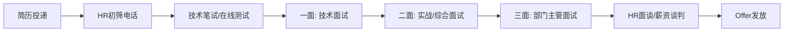

## 四、面试准备

信息安全岗位的面试与传统软件开发岗位有显著差异——它不仅考察你的编程能力，更考察你对攻击与防御的深度理解、实战动手能力以及面对未知安全场景时的分析思维。一次成功的安全岗位面试，需要系统化的准备策略，而非临时抱佛脚式的突击。

本节从面试全流程出发，覆盖面试前的调研与知识梳理、面试中的应答策略与实操技巧、面试后的复盘与跟进，帮助你建立一套可复用的面试准备框架。

### 4.1 安全面试的全景认知

在准备面试之前，首先要理解安全岗位面试的独特性。与通用软件工程面试不同，安全面试的考察维度更加多元，且不同公司、不同岗位的侧重点差异极大。

#### 4.1.1 三大面试类型及应对策略

| 面试类型 | 核心考察点 | 典型形式 | 准备重点 |
|---------|-----------|---------|---------|
| **技术面试** | 漏洞原理理解、协议分析、攻防知识体系深度 | 问答、白板画图、口头方案设计 | 建立完整的知识图谱，理解"为什么"而非仅记住"是什么" |
| **实战面试** | 动手能力、工具使用、漏洞发现与利用、报告撰写 | CTF题目、靶机渗透、代码审计、应急响应模拟 | 日常积累靶场练习经验，熟悉主流工具链，训练时间管理 |
| **行为面试** | 项目经历真实性、团队协作、职业规划、抗压能力 | STAR法则结构化问答 | 准备3-5个深度项目故事，量化成果，展示成长轨迹 |

#### 4.1.2 不同安全岗位的面试侧重

不同安全方向的面试侧重点差异明显，准备时需要有针对性：

- **渗透测试工程师**：重点考察信息收集能力、漏洞利用链构造、报告撰写质量。面试中常出现"给你一个目标，你会怎么做"的开放题，需要展示结构化的渗透测试方法论。
- **安全研究员**：强调漏洞挖掘能力、二进制分析、协议逆向。常考CVE分析、PoC编写、0day发现思路。
- **安全运维/蓝队**：侧重安全监控、日志分析、应急响应、安全加固。常见场景题如"服务器被入侵了怎么办"。
- **安全架构师**：考察系统设计能力、威胁建模、安全方案设计。需要站在全局视角思考安全问题。
- **安全开发工程师**：编码能力+安全意识结合，常考安全编码规范、SAST/DAST工具开发、安全SDK设计。

#### 4.1.3 面试流程与时间线

典型的安全岗位面试流程如下：



每一轮的准备重点不同：

- **HR初筛**：准备30秒自我介绍，突出安全从业年限、核心技能、标志性项目
- **技术笔试**：刷题+复习基础，常见题型包括选择题、简答题、CTF题
- **技术一面**：深度技术问答，需要对每个知识点都能讲清楚原理和细节
- **实战二面**：动手操作，需要在限定时间内完成渗透/审计/分析任务
- **主管三面**：职业规划、团队协作、行业理解，展示你的长期价值
- **HR面谈**：薪资谈判技巧、福利对比、入职时间协商

### 4.2 面试前：系统化准备框架

面试准备不是漫无目的地翻笔记，而是一个有结构、有优先级、有验证标准的系统工程。

#### 4.2.1 第一步：目标公司深度调研

在准备技术知识之前，先花1-2小时研究目标公司。这不是浪费时间——了解公司的安全需求能让你在面试中精准命中面试官的关注点。

**调研清单**：

1. **公司业务与安全需求**：公司做什么业务？面临哪些安全挑战？（金融公司关注数据安全和合规，互联网公司关注Web安全和业务风控，安全厂商关注产品本身的技术深度）
2. **安全团队公开信息**：团队博客、GitHub项目、安全会议演讲、CVE编号——这些信息能帮你了解团队的技术栈和研究方向
3. **招聘JD分析**：逐条拆解岗位要求，标记自己完全匹配、部分匹配、需要补充的能力项，针对性强化
4. **面试评价**：在脉脉、Glassdoor、看准网等平台查看该公司的面试经验分享，了解面试风格和常见问题
5. **行业动态**：近期该行业是否有重大安全事件？公司的安全产品或服务有什么新动态？

**调研工具**：
- 公司官网和安全博客（通常在 `/security` 或 `/blog` 路径下）
- GitHub Organization 页面（查看开源项目和贡献活跃度）
- 首席安全官或安全负责人的技术社交媒体
- 国家信息安全漏洞共享平台（CNVD）和国家信息安全漏洞库（CNNVD）查询公司相关漏洞
- 天眼查/企查查了解公司的融资、规模和业务方向

#### 4.2.2 第二步：知识体系梳理与查漏补缺

安全面试的考察范围广、深度要求高，必须建立系统化的知识体系。推荐使用"安全技能树"方法进行自检：

**核心知识模块**：

| 模块 | 初级必考 | 中级必考 | 高级必考 |
|------|---------|---------|---------|
| Web安全 | SQL注入、XSS、CSRF原理与防御 | 反序列化、SSRF、文件上传绕过、JWT攻击 | 业务逻辑漏洞挖掘、供应链安全、WAF绕过技术 |
| 网络安全 | TCP/IP协议栈、常见端口服务、子网划分 | ARP欺骗、DNS劫持、中间人攻击、VPN安全 | BGP劫持、IPv6安全、SDN安全、零信任架构 |
| 系统安全 | Linux/Windows权限模型、进程管理、日志分析 | 内核提权原理、Rootkit检测、容器安全逃逸 | Hypervisor逃逸、固件安全、可信执行环境 |
| 密码学 | 对称/非对称加密、哈希函数、数字签名 | 密码协议分析、证书体系（PKI/X.509）、TLS握手 | 后量子密码学、同态加密、零知识证明应用场景 |
| 安全工具 | Nmap、Burp Suite、Wireshark基础使用 | Metasploit模块开发、Cobalt Strike使用、IDA基础 | 自定义漏洞利用开发、Fuzzing框架搭建、沙箱逃逸 |
| 编程能力 | Python/Shell脚本编写 | 自动化漏洞扫描工具开发、WAF规则编写 | 漏洞利用代码编写（Python/C）、安全产品开发 |

**自检方法**：对每个知识点，问自己三个层次的问题：
1. **是什么**：能清晰定义和解释这个概念
2. **为什么**：理解底层原理，能画出数据流/执行流程图
3. **怎么做**：能手动复现、能写代码利用、能提出防御方案

如果某个知识点只能回答"是什么"而说不清"为什么"，那就是需要重点补强的区域。

#### 4.2.3 第三步：项目经历深度准备

安全面试中，项目经历是区分"背题选手"和"真正做过事的人"的关键。你需要为每个重要项目准备一个结构化的故事。

**项目准备模板（STAR-P框架）**：

```text
Situation（背景）：
- 项目是什么？在什么背景下启动的？
- 你在团队中的角色是什么？
- 面临的核心挑战是什么？

Task（任务）：
- 你的具体职责是什么？
- 需要达成什么目标？
- 有什么约束条件（时间、资源、合规要求）？

Action（行动）：
- 你采取了哪些具体步骤？（这是最重要的部分）
- 用了什么技术/工具/方法？
- 遇到了什么困难？怎么解决的？
- 做了哪些技术决策？为什么这样选择？

Result（结果）：
- 最终成果是什么？（用数据量化）
- 发现了什么漏洞/解决了什么问题？
- 对业务产生了什么正面影响？
- 你从中学到了什么？

Process（方法论沉淀）：
- 这个项目让你形成了什么可复用的方法论？
- 如果重新做一次，你会改进哪些地方？
```

**准备建议**：至少准备3-5个不同类型的项目故事：
- 1个渗透测试/漏洞挖掘项目（展示攻击能力）
- 1个安全防御/加固项目（展示防御思维）
- 1个安全工具/平台开发项目（展示工程能力）
- 1个应急响应/安全事件处理项目（展示实战经验）
- 1个安全研究/漏洞分析项目（展示深度思考）

每个故事控制在3-5分钟口述时间内，重点突出你个人的技术贡献和决策过程。

#### 4.2.4 第四步：模拟面试与实战练习

光看书和记笔记远远不够——面试是一种需要练习的技能。你需要通过模拟面试来检验准备效果。

**自练方法**：

1. **录音回听法**：对着录音回答面试问题，回听时关注：是否逻辑清晰？是否有口头禅？是否在关键点上深入展开还是浅尝辄止？
2. **白板讲解法**：在白板上画出某个安全概念的原理图（如TCP三次握手、SQL注入流程、Kerberos认证），边画边讲，模拟面试中的白板环节
3. **计时答题法**：给自己限定时间（每题5分钟），训练在压力下的表达能力
4. **同行互练**：找安全圈的朋友互相模拟面试，互相提问、互相点评

**靶场实战练习**：

实战面试需要大量的动手经验积累。推荐以下靶场平台作为日常练习：

| 平台 | 特点 | 适合阶段 | 链接 |
|------|------|---------|------|
| Hack The Box | 真实环境靶机，难度分级明确 | 中级-高级 | hackthebox.com |
| TryHackMe | 引导式学习路径，适合入门 | 入门-初级 | tryhackme.com |
| PortSwigger Web Security Academy | Web安全深度学习，免费高质量 | 所有级别 | portswigger.net/web-security |
| VulnHub | 可下载的漏洞虚拟机 | 中级 | vulnhub.com |
| PentesterLab | 从基础到高级的渗透练习 | 入门-高级 | pentesterlab.com |
| 攻防世界/XCTF | 国内CTF平台，中文题目 | 所有级别 | adworld.xctf.org.cn |
| BuuCTF | 国内靶场，题目丰富 | 初级-中级 | buuoj.cn |

### 4.3 面试中：核心应答策略

#### 4.3.1 技术问题回答框架

回答技术面试问题时，不要急于给出答案。使用"框架先行"的方法：

**RACE回答框架**：
1. **Re-state（重述问题）**：用自己的话复述问题，确认理解正确，同时争取几秒思考时间
2. **Architecture（架构概述）**：先给出高层概述，再逐步深入细节
3. **Code/Case（代码/案例佐证）**：用具体的代码片段、工具命令或真实案例来支撑你的回答
4. **Extend（延伸讨论）**：主动延伸到相关的安全话题，展示知识的广度和深度

**示例**：面试官问"请解释SQL注入的原理"

> **Re-state**："SQL注入是指攻击者通过在用户输入中插入恶意SQL代码，改变了应用程序原本的查询语义，从而实现对数据库的非授权操作。"
>
> **Architecture**："从原理上说，SQL注入的根本原因是'数据和指令的混淆'。应用程序将用户输入的数据直接拼接到SQL语句中，导致数据库无法区分哪些是查询指令、哪些是用户数据。"
>
> **Code**："举个具体例子，假设后端代码是 `query = 'SELECT * FROM users WHERE name=\'' + user_input + '\''`，当用户输入 `' OR '1'='1` 时，最终执行的SQL变成 `SELECT * FROM users WHERE name='' OR '1'='1'`，返回所有用户数据。"
>
> **Extend**："这个原理不仅适用于SQL注入，类似的'注入'问题还出现在NoSQL注入、LDAP注入、XPath注入、命令注入等场景。防御的核心思路是参数化查询，将数据和指令彻底分离。"

#### 4.3.2 开放性问题的应对

安全面试中经常出现开放性问题，如"如果让你设计公司的安全体系，你会怎么做"或"描述一次完整的渗透测试流程"。这类问题没有标准答案，考察的是你的结构化思维能力。

**应对方法**：采用"总-分-总"结构

1. **先给框架**（30秒）：用一句话概括你的方法论框架
2. **逐层展开**（3-5分钟）：按照框架逐层深入，每层给出要点和示例
3. **总结升华**（30秒）：回到全局视角，强调你的核心理念

**示例**："描述一次完整的渗透测试流程"

> **总**：一次完整的渗透测试遵循PTES（渗透测试执行标准）框架，分为七个阶段：前期交互、情报收集、威胁建模、漏洞分析、渗透利用、后渗透、报告输出。
>
> **分**：
> - 前期交互：与客户确认测试范围、目标系统、时间窗口、免责条款、紧急联系人
> - 情报收集：被动收集（OSINT、子域名枚举、搜索引擎）+ 主动收集（端口扫描、服务识别、技术栈指纹）
> - 威胁建模：根据收集的信息识别高价值目标和攻击路径
> - 漏洞分析：自动化扫描 + 手动测试，重点关注业务逻辑漏洞
> - 渗透利用：从低危漏洞构造攻击链，逐步提升权限
> - 后渗透：内网横向移动、数据获取、持久化（在授权范围内）
> - 报告输出：漏洞详情、风险等级、复现步骤、修复建议
>
> **总**：整个流程的核心是"有方法、可复现、有价值"——不是找到漏洞就完事，而是要让客户理解风险并知道如何修复。

#### 4.3.3 "不知道"怎么办

安全面试中遇到不会的问题是常态，处理方式体现了你的专业素养。

**正确的应对方式**：

- **诚实承认**："这个我目前了解不够深入"比胡编乱造好一万倍
- **展示思考过程**："虽然我不确定具体答案，但根据我的理解，可能是……因为……"
- **关联已知知识**："我对X不太了解，但我知道类似的Y，我的推测是……"
- **表达学习意愿**："这正好是我目前在补强的方向，我计划通过Z来深入学习"

**错误的做法**：
- 胡编答案（安全面试官通常比你更专业，很容易识破）
- 完全沉默不语（比说错更糟糕）
- 反问面试官答案（显得你没有独立思考能力）

#### 4.3.4 实战面试的关键技巧

实战面试（CTF、靶机渗透、代码审计）是安全岗位面试中最有区分度的环节。以下是关键技巧：

**渗透测试实操面试**：

1. **先观察，再动手**：拿到目标后，不要急着扫描。先花5分钟浏览目标网站，了解功能和架构，形成初步的攻击思路
2. **保持方法论**：即使时间紧张，也要按"信息收集 → 漏洞发现 → 漏洞利用 → 权限提升"的顺序进行，展示专业性
3. **边做边记录**：实时记录你的操作步骤和发现，面试结束后这本身就是一份渗透测试报告
4. **优先展示深度**：找到一个完整利用链比找到5个低危XSS更有价值
5. **时间管理**：给每个阶段分配时间，如果某个方向卡住超过20分钟，果断切换思路

**代码审计实操面试**：

1. **先通读结构**：了解代码框架、入口点、数据流向
2. **关注高危函数**：直接搜索 `eval()`、`exec()`、`system()`、`query()`、`serialize()` 等高危调用点
3. **追踪数据流**：从用户输入入口追踪到危险函数调用，确认是否存在过滤/转义
4. **从点到链**：单个漏洞可能不够严重，但如果能构造攻击链（如SSRF + 内网服务 + RCE），则大大提升价值
5. **给出修复建议**：不仅要说"这里有漏洞"，还要给出具体的修复代码

**应急响应场景面试**：

1. **先隔离，再分析**：第一优先级是控制影响范围（下线/隔离受影响系统）
2. **证据保全**：在修复之前，先做快照/日志备份/内存转储
3. **时间线还原**：构建攻击时间线——入侵入口 → 横向移动 → 数据窃取/破坏 → 持久化
4. **根因分析**：找到漏洞的根因而不仅是表象
5. **改进闭环**：不仅要处理当前事件，还要提出系统性改进方案

### 4.4 行为面试的深度准备

#### 4.4.1 STAR法则的进阶应用

STAR法则（Situation-Task-Action-Result）是行为面试的标准框架，但大多数人只是停留在表面应用。要真正用好STAR法则，需要在每个环节注入安全行业的特定细节。

**高分STAR回答的特征**：

| 环节 | 低分回答特征 | 高分回答特征 |
|------|------------|------------|
| Situation | 笼统描述"有一次安全事件" | 具体到时间、系统、影响范围、紧急程度 |
| Task | "我负责处理这个问题" | 明确你在团队中的角色、具体职责、约束条件 |
| Action | "我用了XX工具修复了问题" | 详述决策过程：为什么选择这个方案？考虑过哪些替代方案？ |
| Result | "问题解决了" | 量化结果：修复时间、影响范围、后续改进措施、预防效果 |

**示例：行为面试问题"请描述你处理过的一个复杂安全事件"**

> **Situation**：2024年Q3，我所在的金融公司安全运营中心（SOC）在日常监控中发现，一台核心业务服务器的出站流量异常增加，凌晨时段有大量数据外传行为。该服务器承载了客户交易数据，影响范围可能涉及数万用户。
>
> **Task**：作为安全事件响应的二线分析工程师，我需要在4小时内完成事件定性（是误报还是真实入侵）、确定影响范围、遏制攻击行为，并为后续的根因分析保留完整证据。
>
> **Action**：我按以下步骤处理：
> 1. **证据保全优先**：第一时间对服务器做了内存快照（使用LiME）和磁盘镜像，确保攻击者的行为痕迹不会因修复操作而丢失
> 2. **网络层分析**：通过NetFlow分析确定外传数据的目的IP，发现是租用在东欧的VPS，已知与APT组织关联
> 3. **主机层取证**：检查进程列表发现一个伪装成系统服务的后门进程，使用自定义的C2通信协议
> 4. **横向排查**：通过AD日志和网络流量分析，确认攻击者通过一台已失陷的运维跳板机横向移动到业务服务器，初始入侵点是一个未及时修补的VPN漏洞
> 5. **遏制措施**：隔离受影响服务器、封锁C2 IP、重置受影响账户凭证、紧急修补VPN漏洞
>
> **Result**：事件在3小时内完成遏制，确认影响范围为1台服务器（因网络分段有效阻止了进一步横向扩散）。后续修复了VPN漏洞、加强了服务器出站流量监控规则、建立了内存取证的标准操作流程（SOP）。该事件推动了公司季度漏洞扫描和补丁管理流程的改进。

#### 4.4.2 高频行为面试问题准备清单

以下是安全岗位高频行为面试问题，建议每个都按STAR-P框架准备答案：

**团队协作类**：
1. 描述一次你与开发团队协作解决安全问题的经历
2. 当业务团队不认可你的安全建议时，你怎么处理？
3. 描述一次你在团队中推动安全改进的经历
4. 如何向非技术人员解释一个复杂的安全漏洞？

**问题解决类**：
5. 描述一次你在时间压力下处理安全事件的经历
6. 你遇到过的最棘手的安全问题是什么？怎么解决的？
7. 描述一次你发现的最有价值的漏洞
8. 你在安全工作中犯过什么错误？从中学到了什么？

**成长与规划类**：
9. 你是如何保持安全技能更新的？
10. 你未来3-5年的职业规划是什么？
11. 为什么选择安全行业？为什么选择我们公司？
12. 你最近关注的安全趋势或技术是什么？

### 4.5 特殊场景的应对策略

#### 4.5.1 远程视频面试

远程面试已成为常态，但很多人忽略了技术细节的准备：

**环境准备**：
- 网络：有线连接优于Wi-Fi，准备手机热点作为备用
- 背景：简洁干净的背景，避免杂乱或虚拟背景
- 光线：正面补光，避免逆光或侧光导致面部阴暗
- 音频：使用耳机/麦克风，避免回声和环境噪音
- 双屏：一个屏幕看面试官，一个屏幕做白板/写代码

**技术准备**：
- 提前测试面试平台（Zoom/腾讯会议/飞书）的屏幕共享、白板功能
- 准备好常用的安全工具环境（VM、靶场环境）随时可以演示
- 如果需要写代码，提前打开IDE并配置好常用的代码模板
- 准备一个文本编辑器用于实时记录面试问题和你的回答要点

**注意事项**：
- 提前15分钟进入会议室，检查音视频
- 全程保持摄像头开启，目光看向摄像头而非屏幕
- 如果需要思考，可以说"让我想一下"而非长时间沉默

#### 4.5.2 薪资谈判

安全行业的薪资谈判需要了解市场行情和自身定位。

**薪资调研工具与渠道**：
- 脉脉、看准网、Boss直聘的薪资数据
- 安全圈微信群/知识星球的薪资讨论
- 猎头渠道了解的市场行情

**谈判策略**：
1. **让对方先报价**：当被问到期望薪资时，可以先了解该岗位的薪资范围
2. **给出范围而非精确数字**：给出一个合理的薪资范围（上下限差距15%-20%）
3. **基于价值而非需求**：强调你能为公司带来的价值，而非你的生活成本
4. **考虑总包**：基本工资只是总包的一部分，还要考虑股票/期权、年终奖、签字费、培训预算、弹性工作等
5. **保留谈判空间**：第一次报价不要给出你的心理底线

**安全行业常见薪资参考范围**（2024-2025年国内市场，因城市和公司差异较大）：

| 岗位级别 | 一线城市年薪范围 | 二线城市年薪范围 |
|---------|---------------|---------------|
| 初级（0-2年） | 15-30万 | 10-20万 |
| 中级（2-5年） | 30-60万 | 20-40万 |
| 高级（5-8年） | 60-100万 | 40-70万 |
| 专家/架构师（8年+） | 100-200万+ | 70-120万 |

> 注：以上为大致参考范围，安全厂商、互联网大厂、金融机构的薪资差异显著。Bug Bounty猎人和知名安全研究员的收入可能远超此范围。

#### 4.5.3 跨领域转型面试

如果你从其他领域（如运维、开发、网络工程）转型到安全岗位，面试中需要特别注意：

**常见疑虑与应对**：

- **"你为什么从开发转安全？"**：不要贬低之前的工作，而是强调安全对你的吸引力，以及你的开发背景如何成为安全岗位的加分项
- **"你的安全经验不足怎么办？"**：展示你的学习能力和已有的安全积累（CTF成绩、漏洞提交、安全博客、开源贡献）
- **"你的知识体系不够完整？"**：承认差距的同时，展示你已经建立了系统化的学习计划，并用实际行动（如认证考试准备、靶场练习记录）来证明

**转型面试的核心策略**：将之前的领域经验转化为安全岗位的竞争优势。例如：
- 运维背景 → 安全运维/SOC分析师的天然优势（熟悉系统架构、日志分析、故障排查）
- 开发背景 → 安全开发/代码审计的独特视角（能看懂代码、能写安全工具）
- 网络背景 → 网络安全分析的扎实基础（协议理解、流量分析、网络架构）

### 4.6 面试后：复盘与持续改进

#### 4.6.1 面试复盘清单

每次面试结束后，趁记忆清晰，立即完成以下复盘：

1. **记录问题**：回忆并记录所有被问到的问题，包括你答得好的和答得不好的
2. **评估回答**：对每个问题，评估自己的回答质量（满分5分）
3. **查找差距**：对答不好的问题，查找正确的答案和相关知识点
4. **总结经验**：这次面试中，哪些准备是有效的？哪些准备是不足的？
5. **更新知识库**：把新发现的知识点加入你的学习计划

**面试复盘模板**：

```markdown
## 面试复盘 - [公司名称] - [日期]

### 面试概况
- 岗位：
- 面试轮次：
- 面试时长：
- 面试形式：

### 问题记录
1. 问题：[具体问题]
   我的回答要点：[你说了什么]
   自评：⭐⭐⭐ (3/5)
   改进方向：[下次怎么回答更好]

2. ...

### 整体自评
- 技术深度：
- 表达清晰度：
- 自信程度：
- 时间管理：

### 行动项
- [ ] 补强XX知识点
- [ ] 练习XX实操
- [ ] 准备XX项目的STAR故事
```

#### 4.6.2 面试失败的正确心态

安全面试的通过率通常不高——即使是资深从业者也会在某些面试中失败。关键是从失败中提取价值：

- **面试失败 ≠ 你不优秀**：可能只是岗位匹配度不够，或者竞争对手恰好更合适
- **每次失败都是一次免费的知识体检**：面试暴露了你的知识盲区，这比自己摸索高效得多
- **保持联系**：即使这次失败了，保持与HR/面试官的良好关系，未来可能有更合适的岗位
- **系统性改进**：如果连续多次在同一类问题上失分，说明你需要系统性地补强这个方向

### 4.7 常见面试准备误区

| 误区 | 正确做法 |
|------|---------|
| 只背面试题答案，不理解原理 | 每个知识点都要能画出原理图、写出示例代码、解释"为什么" |
| 准备过于广泛，没有深度 | 选择3-5个核心方向深入准备，比浅尝辄止10个方向更有效 |
| 忽略行为面试，只准备技术题 | 行为面试往往决定最终录用结果，必须用STAR法则系统准备 |
| 面试前才开始准备 | 面试准备是一个持续过程，日常积累（靶场练习、博客写作、CTF参赛）比临时突击重要100倍 |
| 简历写得天花乱坠 | 面试中会深挖简历上的每个项目，写上去的内容你必须能讲清楚细节 |
| 面试后不复盘 | 每次面试都是宝贵的实战演练，不复盘等于浪费了一半价值 |
| 只投一家公司 | 同时投递多家公司，通过面试练手来提升实战能力 |
| 忽略软技能 | 沟通能力、团队协作、学习能力在安全岗位中同样重要 |

### 4.8 面试准备的30天计划

如果你有30天准备一次重要的安全岗位面试，推荐以下时间分配：

| 阶段 | 时间 | 核心任务 |
|------|------|---------|
| **第1周：调研与规划** | Day 1-2 | 目标公司调研、JD分析、制定个性化准备计划 |
| | Day 3-4 | 知识体系自检，标记薄弱点 |
| | Day 5-7 | 项目经历STAR故事准备（至少3个深度故事） |
| **第2周：知识补强** | Day 8-10 | Web安全核心知识复习与实操练习 |
| | Day 11-12 | 网络/系统安全知识复习 |
| | Day 13-14 | 安全工具使用练习（Burp Suite、Nmap、Metasploit等） |
| **第3周：实战训练** | Day 15-17 | 靶场练习（HTB/TryHackMe，每天至少完成1台靶机） |
| | Day 18-19 | 代码审计练习（GitHub上找开源项目审计） |
| | Day 20-21 | 模拟面试（找朋友互练或自练录音） |
| **第4周：冲刺与调整** | Day 22-24 | 针对性补强面试模拟中暴露的薄弱点 |
| | Day 25-26 | 行为面试问题准备与练习 |
| | Day 27-28 | 面试礼仪、远程环境、薪资谈判准备 |
| | Day 29-30 | 轻度复习，保持状态，早睡早起 |

> **核心原则**：最后一周不要学新知识，只做复习和巩固。面试前的焦虑会让你遗忘新学的内容，但不会让你遗忘已经扎实掌握的知识。

***

> "面试不是考试，而是一次双向选择的对话。你在展示自己的同时，也在评估这家公司是否值得你投入未来几年的时间。保持自信、保持真诚、保持学习——offer自然会来。"
