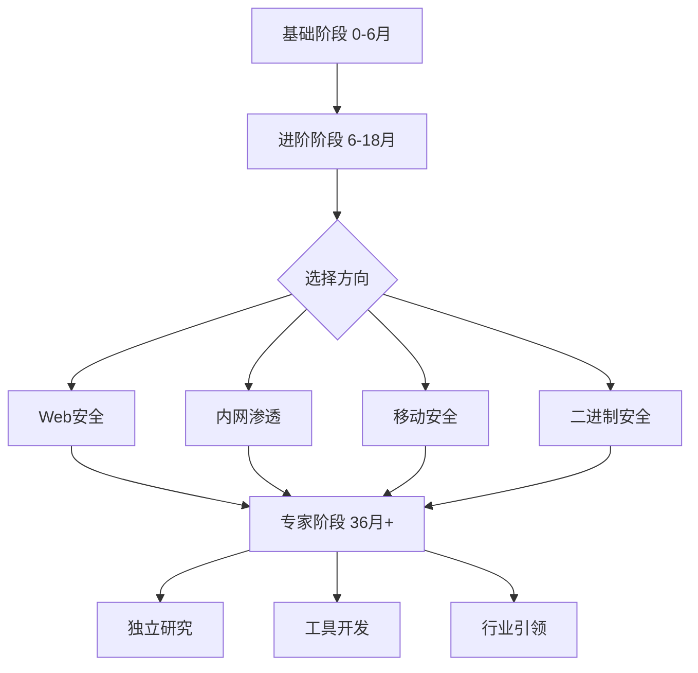

## 五、技能提升策略

技能提升不是简单地"多学多练"，而是一个需要科学规划、持续迭代的系统工程。本章从学习路径设计、高效学习方法、实践体系构建、资源筛选策略、常见陷阱规避五个维度，提供一套可落地的技能提升框架。

### 5.1 学习路径规划

网络安全领域的知识体系庞大且交叉，没有清晰的路径规划，很容易陷入"什么都学一点，什么都不精通"的困境。以下路径基于大量从业者的成长轨迹总结，按时间阶段划分，每个阶段都有明确的能力目标和验证标准。

#### 5.1.1 基础阶段（0-6个月）：建立知识地基

这个阶段的目标是建立扎实的计算机基础，为后续的安全学习打下根基。跳过这个阶段直接学渗透技术，会导致"知其然不知其所以然"，后期遇到复杂场景无法举一反三。

**计算机网络基础**

网络是安全攻防的主战场，必须深入理解：

- **OSI七层模型与TCP/IP四层模型**：理解每层的职责、协议、数据封装过程。不是背诵概念，而是能解释"一个HTTP请求从浏览器发出到服务器响应，经过了哪些层，每层做了什么"。
- **TCP三次握手与四次挥手**：理解状态机（LISTEN、SYN_SENT、ESTABLISHED、FIN_WAIT等），这是理解SYN Flood、TCP劫持等攻击的基础。
- **HTTP/HTTPS协议**：掌握请求方法（GET/POST/PUT/DELETE）、状态码、头部字段、Cookie/Session机制、TLS握手过程。推荐阅读《图解HTTP》和RFC 2616。
- **DNS协议**：理解递归查询与迭代查询、DNS缓存、DNS劫持与投毒的原理。
- **抓包分析**：熟练使用Wireshark，能够从抓包数据中还原HTTP会话、分析异常流量。

**验证标准**：能独立搭建一个包含Web服务器、数据库、DNS服务器的小型网络环境，并用Wireshark抓包分析完整的HTTP请求流程。

**Linux系统基础**

Linux是安全工具和服务端的主要运行环境：

- **命令行操作**：文件管理（ls/cp/mv/rm/find）、文本处理（grep/awk/sed/cut）、进程管理（ps/top/kill）、网络命令（netstat/ss/curl/wget/tcpdump）。
- **用户与权限**：理解UID/GID、文件权限（rwx/SUID/SGID/Sticky Bit）、sudo机制、PAM认证。
- **服务管理**：systemd/service/ systemctl，理解服务生命周期、日志查看（journalctl）。
- **Shell脚本**：能编写自动化脚本，这是后续工具开发和自动化渗透的基础。

**推荐环境**：在虚拟机中安装Kali Linux或Ubuntu，日常使用Linux完成所有学习任务，而不是偶尔打开用一下。

**验证标准**：能在纯命令行环境下完成系统配置、服务部署、日志分析、Shell脚本编写。

**编程语言**

至少掌握一门语言，Python是首选：

- **Python基础**：数据类型、控制流、函数、面向对象、文件操作、异常处理、正则表达式。
- **Python安全应用**：socket编程、HTTP请求（requests库）、多线程、Scrapy爬虫、数据解析（JSON/XML）。
- **动手项目**：编写一个端口扫描器、一个简单的Web目录爆破工具、一个日志分析脚本。

其他值得学习的语言：Go（高性能安全工具开发）、C/C++（理解内存安全、漏洞原理）、JavaScript（Web安全必备）、SQL（数据库安全）。

**Web安全基础**

这是入门安全最容易切入的方向：

- **OWASP Top 10**：逐项理解SQL注入、XSS、CSRF、SSRF、文件上传、命令注入、反序列化等漏洞的原理、危害、利用方式、防御方法。
- **Burp Suite使用**：代理拦截、Repeater、Intruder、Scanner的基本操作。
- **靶场练习**：DVWA、SQLi-labs、XSS挑战、Pikachu靶场，每个漏洞类型至少手动复现3个案例。

**验证标准**：能独立完成DVWA所有难度等级的通关，并写出每个漏洞的技术分析报告。

#### 5.1.2 进阶阶段（6-18个月）：构建攻防能力

基础阶段完成后，开始系统性地学习渗透测试方法论和漏洞利用技术。

**渗透测试方法论**

- **PTES（渗透测试执行标准）**：理解预交互、情报收集、威胁建模、漏洞分析、渗透利用、后渗透、报告撰写的完整流程。
- **OWASP Testing Guide**：Web应用安全测试的权威指南，覆盖信息收集、配置管理、认证测试、授权测试、会话管理、输入验证等。
- **信息收集技术**：被动信息收集（Whois、Shodan、Censys、OSINT框架）和主动信息收集（Nmap、目录扫描、子域名枚举、指纹识别）。

**常见漏洞深入**

- **SQL注入进阶**：盲注（布尔盲注、时间盲注）、堆叠注入、二次注入、WAF绕过（编码、注释、大小写变换、内联注释）、SQLMap高级用法。
- **XSS进阶**：DOM型XSS、CSP绕过、XSS平台搭建、Cookie窃取与会话劫持、BeEF框架。
- **文件包含漏洞**：本地文件包含（LFI）、远程文件包含（RFI）、PHP伪协议（php://filter、data://）、日志注入Getshell。
- **反序列化漏洞**：PHP反序列化（魔术方法、POP链构造）、Java反序列化（Commons Collections链）、Python Pickle反序列化。
- **SSRF漏洞**：内网探测、协议利用（file://、gopher://、dict://）、绕过技巧（IP进制转换、302跳转、DNS Rebinding）。

**安全工具精通**

- **Nmap**：从基础扫描到NSE脚本编写，理解SYN扫描、ACK扫描、版本检测、OS检测的原理。
- **Metasploit Framework**：模块体系（exploit/payload/auxiliary/post）、Meterpreter使用、自定义模块编写。
- **SQLMap**：Tamper脚本编写、自定义Payload、绕过WAF的高级技巧。
- **Cobalt Strike/Sliver**：C2框架使用、上线方式、横向移动、流量隐藏。

**CTF系统训练**

- **平台选择**：CTFHub、BUUCTF、攻防世界、Hack The Box、TryHackMe。
- **题目类型**：Web、Pwn、Reverse、Crypto、Misc各方向都尝试，找到自己的兴趣和优势方向。
- **刷题节奏**：每天1-2道中等难度题目，每周末做一道综合题，每月参加一次线上CTF比赛。
- **Writeup整理**：每道题做完后写详细解题思路，建立自己的知识库。

**验证标准**：能独立完成Hack The Box中等难度靶机，能在CTF比赛中独立解出Web方向30%以上的题目。

#### 5.1.3 专业阶段（18-36个月）：选择方向深耕

这个阶段需要选择一个专业方向深入，成为该领域的专家。选择依据：兴趣、市场需求、自身优势。

**Web安全方向**

- **代码审计**：PHP（函数级审计、框架审计）、Java（Spring/Struts2审计）、Python（Django/Flask审计）。掌握审计工具：Fortify、SonarQube、Semgrep。
- **框架安全**：Spring Boot Actuator未授权、Fastjson反序列化、Log4j2 RCE、Shiro反序列化等框架级漏洞。
- **WAF绕过**：理解WAF检测原理（正则匹配、语义分析、机器学习），掌握各类绕过技巧。
- **自动化漏洞挖掘**：Fuzzing技术、AFL/AFL++、代码相似度分析（CodeQL、Semgrep规则编写）。

**内网渗透方向**

- **域渗透**：AD架构理解、Kerberos认证流程、Kerberoasting、AS-REP Roasting、DCSync、Golden Ticket、Silver Ticket。
- **横向移动**：Pass the Hash、Pass the Ticket、SMB Relay、PsExec、WMI、WinRM、DCOM。
- **权限维持**：注册表自启动、计划任务、DLL劫持、COM对象劫持、WMI事件订阅。
- **隐蔽通信**：DNS隧道、HTTP隧道、域前置、CDN隐藏C2。

**移动安全方向**

- **Android安全**：APK逆向（Jadx、apktool）、脱壳（Frida、dumpdex）、Hook技术、Root检测绕过、证书固定绕过。
- **iOS安全**：砸壳（dumpdecrypted、flexdecrypt）、逆向（IDA、Hopper）、越狱检测绕过、Keychain提取。
- **协议分析**：移动端API抓包、证书固定绕过、Protobuf/Thrift协议逆向。

**二进制安全方向**

- **漏洞原理**：栈溢出、堆溢出、格式化字符串、UAF、整数溢出、Race Condition。
- **漏洞利用**：ROP链构造、堆风水（Heap Feng Shui）、GOT/PLT表覆盖、ret2libc、ret2csu。
- **分析工具**：IDA Pro、GDB/pwndbg、Ghidra、Binary Ninja。
- **保护机制与绕过**：ASLR、DEP、Stack Canary、PIE、CFI的原理与绕过方法。

**验证标准**：能在专业方向内独立完成高难度实战项目，能在安全社区发表技术文章并获得认可。

#### 5.1.4 专家阶段（36个月+）：引领与创新

- **独立安全研究**：发现0day漏洞，进行负责任披露，获得CVE编号。
- **工具与框架开发**：开发被社区广泛使用的安全工具或框架。
- **技术影响力**：在顶级安全会议（Black Hat、DEF CON、HITB、POC）发表演讲，撰写技术书籍或深度研究报告。
- **团队与行业引领**：组建安全团队，参与行业标准制定，推动安全生态发展。

#### 5.1.5 学习路径总览



### 5.2 高效学习方法

#### 5.2.1 项目驱动学习

项目驱动是掌握安全技能最高效的方式。通过完成一个完整的项目，你会自然地遇到各种问题，并在解决问题的过程中构建知识体系。

**项目选择原则**：

- **渐进式难度**：从简单到复杂，不要一开始就挑战高难度项目。
- **完整性**：选择有完整生命周期的项目，而不是零散的小练习。
- **实用性**：选择在实际工作中会用到的项目类型。

**推荐项目序列**：

| 序号 | 项目 | 目标技能 | 预计时间 |
|------|------|----------|----------|
| 1 | 搭建DVWA靶场并完成所有关卡 | Web安全基础 | 1-2周 |
| 2 | 编写Python端口扫描器 | 网络编程、并发 | 1周 |
| 3 | 搭建完整的渗透测试实验环境 | 网络架构、虚拟化 | 1-2周 |
| 4 | 完成Hack The Box 10台靶机 | 综合渗透能力 | 4-6周 |
| 5 | 开发一个Web漏洞扫描工具 | 安全工具开发 | 2-4周 |
| 6 | 对开源CMS进行代码审计 | 代码审计能力 | 2-4周 |
| 7 | 参与一次CTF比赛 | 综合能力检验 | 持续 |
| 8 | 完成一个真实的渗透测试项目（授权） | 实战能力 | 4-8周 |

**项目执行方法**：

1. **明确目标**：项目开始前，列出要掌握的具体技能点。
2. **拆解任务**：将大项目拆解为可执行的小任务，每个任务有明确的完成标准。
3. **记录过程**：详细记录每一步操作、遇到的问题、解决方案。
4. **复盘总结**：项目完成后，写一份完整的技术报告，总结收获和不足。

#### 5.2.2 刻意练习

刻意练习不是简单地重复，而是针对薄弱环节进行有目的的专项训练。

**练习框架**：

1. **识别弱点**：通过CTF比赛、面试题、实际工作中的失败，识别自己的薄弱环节。
2. **专项训练**：针对弱点选择专项练习材料，集中时间突破。
3. **获取反馈**：通过对比Writeup、请教高手、参加Code Review获取反馈。
4. **调整方法**：根据反馈调整练习策略，避免无效重复。

**每日练习清单**：

```bash
# 每日学习计划模板
08:00-09:00  阅读安全资讯（FreeBuf、安全客、HackerNews）
09:00-11:00  CTF刷题或漏洞复现（至少完成1道中等难度题目）
11:00-12:00  整理笔记，更新知识库
14:00-16:00  项目实战或代码审计
16:00-17:00  阅读技术文章或安全论文
17:00-18:00  写技术博客或整理Writeup
```

**练习平台推荐**：

- **Web安全**：DVWA、Pikachu、WebGoat、PortSwigger Web Security Academy
- **综合渗透**：Hack The Box、TryHackMe、VulnHub
- **CTF**：CTFHub、BUUCTF、攻防世界、picoCTF
- **代码审计**：Seacms审计、YzmCMS审计、各类CVE复现
- **二进制**：pwnable.tw、pwnable.kr、Exploit Education

#### 5.2.3 费曼学习法

费曼学习法的核心是"通过教授他人来加深理解"。如果你不能用简单的语言向一个新手解释清楚一个概念，说明你对这个概念的理解还不够深入。

**实施步骤**：

1. **选择主题**：选择一个你正在学习的技术主题。
2. **教授他人**：假设听众是一个对安全一无所知的人，用最简单的语言解释这个概念。
3. **发现卡点**：在解释过程中，找到那些你无法用简单语言说清楚的地方。
4. **回头学习**：针对卡点深入学习，直到能用简单语言解释清楚。

**实践方式**：

- **技术博客**：每周写一篇技术文章，发布到GitHub Pages、博客园、掘金等平台。写作过程中会迫使你把模糊的知识点理清楚。
- **技术分享**：在安全社区（先知、T00ls、安全客）或团队内部做技术分享，分享过程中的提问会暴露你的知识盲区。
- **指导新人**：帮助初学者解答问题，在解答过程中你会发现自己对基础概念的理解可能并不如想象中那么扎实。
- **录制视频**：录制技术教程视频，视频的制作过程会迫使你把每个步骤都理清楚。

#### 5.2.4 知识管理

高效的学习离不开系统的知识管理。没有知识管理，学过的知识会快速遗忘，遇到相似问题时无法快速检索。

**知识管理工具选择**：

- **Obsidian**：基于Markdown的本地知识管理工具，支持双向链接、图谱视图，适合构建个人知识库。
- **Notion**：云端协作工具，适合团队知识共享。
- **GitHub Wiki/仓库**：适合代码和Writeup管理，支持版本控制。

**知识管理框架**：

```text
知识库/
├── 基础知识/
│   ├── 网络协议/
│   ├── 操作系统/
│   └── 编程语言/
├── 漏洞分类/
│   ├── Web安全/
│   ├── 二进制安全/
│   └── 移动安全/
├── 工具使用/
│   ├── 渗透工具/
│   ├── 逆向工具/
│   └── 自编工具/
├── 实战案例/
│   ├── CTF题解/
│   ├── 靶机攻略/
│   └── 项目报告/
└── 学习资源/
    ├── 书籍推荐/
    ├── 在线课程/
    └── 博客收藏/
```

**笔记方法**：

- **原子化笔记**：每个笔记只记录一个知识点，通过双向链接关联相关笔记。
- **PARA方法**：Projects（当前项目）、Areas（持续关注领域）、Resources（参考资料）、Archives（归档内容）。
- **定期回顾**：每周花1小时回顾本周的笔记，每月花2小时整理知识库结构。

### 5.3 实践体系构建

#### 5.3.1 靶场环境搭建

自建靶场是安全学习的基础设施。一个好的靶场环境应该包含各种类型的漏洞靶标，支持自动化部署和重置。

**基础靶场搭建**：

```bash
# 使用Docker快速搭建靶场环境
# 安装Docker
curl -fsSL https://get.docker.com | sh

# 搭建DVWA
docker run -d -p 8080:80 --name dvwa vulnerables/web-dvwa

# 搭建SQLi-labs
docker run -d -p 8081:80 --name sqli acgpiano/sqli-labs

# 搭建Pikachu
docker run -d -p 8082:80 --name pikachu area39/pikachu

# 搭建Vulhub（综合漏洞环境）
git clone https://github.com/vulhub/vulhub.git
cd vulhub/spring/CVE-2022-22947
docker-compose up -d
```

**进阶靶场搭建**：

```bash
# 搭建包含内网环境的靶场
# 使用VirtualBox创建多台虚拟机
# 1. 攻击机：Kali Linux
# 2. Web服务器：Ubuntu + Web应用（模拟DMZ区）
# 3. 域控服务器：Windows Server + AD域
# 4. 内网主机：Windows 10 + 域成员

# 网络配置：
# - NAT网络：10.0.2.0/24（攻击机接入）
# - 内部网络：192.168.56.0/24（Web服务器双网卡）
# - 域网络：172.16.0.0/24（域控和内网主机）
```

#### 5.3.2 CTF训练体系

CTF是检验和提升安全技能的最佳方式之一。系统性的CTF训练应该覆盖所有题型，并有明确的进阶路径。

**CTF题型与对应能力**：

| 题型 | 核心能力 | 推荐入门平台 | 进阶方向 |
|------|----------|--------------|----------|
| Web | Web漏洞利用、代码分析 | CTFHub、BUUCTF | 代码审计、框架漏洞 |
| Pwn | 二进制漏洞利用、汇编 | pwnable.tw | 内核漏洞、浏览器漏洞 |
| Reverse | 逆向分析、算法识别 | Reverse.kr | 恶意软件分析、加壳脱壳 |
| Crypto | 密码学原理、数学基础 | CryptoHack | 导向密码学研究 |
| Misc | 信息隐藏、数据取证 | 攻防世界 | 取证分析、OSINT |

**训练节奏建议**：

- **日常**：每天1-2道中等难度题目，保持手感。
- **周末**：花半天时间做一道综合难度较高的题目。
- **月赛**：每月至少参加一次线上CTF比赛，检验学习成果。
- **年度**：尝试参加线下CTF决赛，积累比赛经验和人脉。

#### 5.3.3 漏洞复现与分析

漏洞复现是理解漏洞原理最直接的方式。不要只看PoC代码，要理解每一步操作的原理。

**漏洞复现方法论**：

1. **环境搭建**：根据漏洞影响的版本，搭建对应的应用环境。
2. **PoC分析**：阅读PoC代码，理解每一步操作的目的。
3. **手动复现**：不用自动化工具，手动完成每一步攻击操作。
4. **调试分析**：通过调试器观察程序在漏洞触发时的状态变化。
5. **变体思考**：思考这个漏洞还有哪些变体利用方式，能否绕过已有修复。
6. **报告撰写**：写一份完整的漏洞分析报告，包含原理、复现步骤、影响评估、修复建议。

### 5.4 资源筛选策略

#### 5.4.1 书籍推荐

**入门书籍**：
- 《白帽子讲Web安全》（吴翰清）：Web安全入门经典，覆盖常见Web漏洞原理。
- 《Web安全攻防：渗透测试实战指南》（徐焱等）：实战性强，适合入门者。
- 《网络安全基础：应用与标准》（William Stallings）：网络安全理论基础。

**进阶书籍**：
- 《黑客攻防技术宝典：Web实战篇》（Dafydd Stuttard）：Web安全深度指南。
- 《代码审计：企业级Web代码安全架构》（尹毅）：PHP代码审计入门。
- 《Metasploit渗透测试指南》（David Kennedy）：Metasploit使用权威指南。
- 《内网安全攻防：渗透测试实战指南》（徐焱等）：内网渗透入门。

**高级书籍**：
- 《加密与解密》（段钢）：软件逆向工程经典。
- 《深入理解计算机系统》（Randal E. Bryant）：计算机系统底层原理。
- 《Android软件安全权威指南》（Nicolas Collada）：Android安全权威指南。
- 《漏洞战争：软件漏洞分析精要》（林桠泉）：二进制漏洞分析。

#### 5.4.2 在线课程

- **PortSwigger Web Security Academy**：免费的Web安全学习平台，内容权威且持续更新。
- **Cybrary**：提供系统的网络安全课程，涵盖渗透测试、安全运营等方向。
- **SANS**：业界认可度最高的安全培训，课程质量高但价格昂贵。
- **国内平台**：i春秋、安全牛、看雪学院，提供中文安全课程。

#### 5.4.3 社区与资讯

- **漏洞信息**：CVE Details、NVD、CNVD、Exploit-DB
- **技术社区**：看雪论坛、先知社区、T00ls、安全客
- **资讯平台**：FreeBuf、HackerNews、SecurityWeek、Krebs on Security
- **漏洞预警**：GitHub Security Advisory、各安全厂商博客

### 5.5 常见陷阱与规避

#### 5.5.1 "教程地狱"

**表现**：不停地看教程、看视频，感觉学了很多，但真正动手时什么都不会。

**根因**：被动学习（看教程）的认知负荷远低于主动学习（动手实践），大脑倾向于选择更轻松的方式。

**规避方法**：

- **7:3法则**：70%的时间用于动手实践，30%的时间用于理论学习。
- **学完即练**：每学完一个知识点，立即动手实践。看完了SQL注入的教程，马上打开靶场动手注入。
- **项目驱动**：以项目为中心组织学习，而不是以教程为中心。
- **限制教程数量**：同一个主题只看1-2个高质量教程，而不是收集一堆教程"以后再看"。

#### 5.5.2 "工具依赖"

**表现**：只会用现成的工具和脚本，遇到工具无法解决的问题就束手无策。

**根因**：只学习了工具的使用方法，没有理解背后的原理。

**规避方法**：

- **原理优先**：学习任何工具之前，先理解它解决的问题和实现原理。
- **源码阅读**：阅读常用安全工具的源码，理解其实现逻辑。
- **自己实现**：对常用工具，尝试自己编写简化版本（如端口扫描器、目录爆破工具）。
- **工具链理解**：理解工具在整个攻击链中的位置和作用，而不是孤立地使用单个工具。

#### 5.5.3 "广而不精"

**表现**：什么方向都学一点，Web安全、内网渗透、二进制、逆向都会一些，但没有一个方向能深入。

**根因**：安全领域知识面太广，初学者容易被新方向吸引，频繁切换。

**规避方法**：

- **先广后深**：前6个月广泛尝试，找到兴趣方向后立即深入。
- **T型人才**：广泛的基础知识 + 一个方向的深度专精。
- **时间分配**：80%的时间用于主攻方向，20%的时间用于拓宽视野。
- **里程碑驱动**：为每个方向设定明确的里程碑，达成后才考虑切换方向。

#### 5.5.4 "闭门造车"

**表现**：一个人埋头学习，不与社区交流，错过行业动态和人脉资源。

**根因**：社交成本高于独自学习，或者觉得自己水平不够不敢参与社区。

**规避方法**：

- **从小处开始**：先在论坛回答新手问题，逐步参与更深入的讨论。
- **输出倒逼输入**：通过写博客、做分享强制自己输出内容。
- **参加比赛**：CTF比赛是认识同行的最佳途径。
- **加入团队**：加入安全实验室或安全团队，与志同道合的人一起学习成长。

#### 5.5.5 "证书崇拜"

**表现**：花大量时间考证（CISSP、CEH、OSCP等），认为证书数量等于能力。

**根因**：证书是最容易量化的"成果"，但实际能力无法通过证书体现。

**规避方法**：

- **证书服务于目标**：考证是为了系统化学习或满足岗位要求，而不是为了收集证书。
- **实战优先**：在实战中证明自己的能力比证书更有说服力。
- **选择性考证**：只考那些行业认可度高、对职业发展有实际帮助的证书（如OSCP）。

#### 5.5.6 "追求0day"

**表现**：初学者就想着挖0day、找RCE，忽略基础知识的积累。

**根因**：0day是安全圈的"光环"，容易让人误以为这是安全能力的最高体现。

**规避方法**：

- **尊重积累**：0day挖掘需要深厚的基础知识和丰富的经验积累，没有捷径。
- **从复现开始**：先复现已知漏洞，理解漏洞成因，再尝试挖掘新漏洞。
- **系统化学习**：学习漏洞挖掘的方法论（Fuzzing、代码审计、补丁对比），而不是盲目测试。

### 5.6 进阶：学习效率优化

#### 5.6.1 番茄工作法与深度学习

安全技术学习需要高度专注，适合使用番茄工作法管理注意力：

- **25分钟专注**：关闭所有通知，全神贯注于当前学习任务。
- **5分钟休息**：离开电脑，活动身体，让大脑短暂休息。
- **每4个番茄**：休息15-30分钟，回顾前2小时的学习内容。
- **记录番茄数**：每天完成8-10个高质量番茄，保证4-5小时的深度学习时间。

#### 5.6.2 间隔重复与知识巩固

根据艾宾浩斯遗忘曲线，新知识如果不复习，1天后会遗忘70%。间隔重复是最有效的记忆方法：

- **第1天**：学习新知识后，当天晚上回顾一次。
- **第3天**：第二次回顾。
- **第7天**：第三次回顾。
- **第14天**：第四次回顾。
- **第30天**：第五次回顾。

**工具推荐**：使用Anki制作知识卡片，利用其内置的间隔重复算法自动安排复习。

#### 5.6.3 学习数据分析

通过数据追踪自己的学习效率，及时调整策略：

```python
# 学习数据追踪示例
import json
from datetime import datetime

learning_log = {
    "date": "2026-06-25",
    "study_hours": 6,
    "topics_covered": [
        {"topic": "SQL注入-盲注", "hours": 2, "mastery": "70%"},
        {"topic": "Nmap高级扫描", "hours": 1.5, "mastery": "85%"},
        {"topic": "CTF-Web题", "hours": 2.5, "mastery": "60%"}
    ],
    "weak_points": ["时间盲注绕过WAF"],
    "next_steps": ["专项练习WAF绕过技巧", "复现3个盲注CVE"]
}

# 追踪维度：
# - 每日有效学习时长（番茄钟数）
# - 各知识点掌握程度（自评+练习正确率）
# - 薄弱环节识别
# - 学习计划完成率
```

### 5.7 本章小结

技能提升是一个长期过程，没有捷径可走。核心原则：

1. **路径清晰**：按照基础→进阶→专业的路径循序渐进，不要跳级。
2. **方法科学**：项目驱动+刻意练习+费曼学习法，三者结合效果最佳。
3. **实践为王**：70%的时间用于动手实践，30%的时间用于理论学习。
4. **知识管理**：建立系统化的知识库，让学过的知识可检索、可复用。
5. **避免陷阱**：警惕教程地狱、工具依赖、广而不精等常见问题。
6. **持续输出**：通过博客、分享、指导他人来巩固和深化自己的知识。
7. **社区参与**：融入安全社区，与同行交流，获取反馈和资源。

记住：安全领域的学习曲线是指数型的——前期进步缓慢，但坚持到某个临界点后会迎来快速成长。关键是保持耐心和持续投入。
