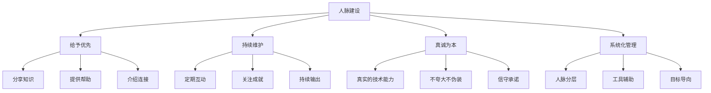

## 六、人脉建设

在信息安全行业，技术能力决定了你的下限，而人脉网络决定了你的上限。一个孤立的技术高手可能终其一生都在重复造轮子，而一个善于连接的人可以在一条推文之间获得关键情报、在一次咖啡聊天中拿到内推机会、在一场会议后敲定联合研究项目。人脉不是"认识多少人"，而是"在关键时刻，谁愿意帮你、你能帮到谁"。

本节将从人脉的本质价值出发，系统性地讲解如何在线上和线下建立安全圈人脉，如何维护和深化关系，以及如何避开人脉建设中的常见陷阱。

### 6.1 人脉的本质价值

#### 6.1.1 信息不对称优势

安全行业的信息流动具有高度的选择性。很多关键信息——某个厂商即将披露的严重漏洞、某家公司正在组建安全团队、某个新兴攻击技术的趋势——首先在小圈子里传播，然后才逐渐扩散到公开渠道。

**信息层级模型**：

| 信息层级 | 传播范围 | 时效性 | 获取方式 |
|---------|---------|-------|---------|
| 核心圈层 | 5-20人 | 提前数周至数月 | 私密群组、一对一沟通 |
| 扩展圈层 | 50-200人 | 提前数天至数周 | 行业社群、安全会议 |
| 公开圈层 | 不限 | 同步或滞后 | 公开报告、新闻媒体 |

拥有核心圈层的信息渠道意味着你能比大多数从业者更早地了解行业动向，从而在职业决策、技术方向选择上占据主动。例如，在 Log4Shell 漏洞公开之前，部分安全研究员已经在私下交流利用方式和影响范围，这给了他们提前准备检测方案和应对策略的时间窗口。

#### 6.1.2 机会获取引擎

根据 LinkedIn 2023 年的统计数据，约 70% 的职位从未公开发布，而是通过内部推荐或人脉网络填补。在安全行业，这个比例可能更高，原因包括：

- **安全岗位的敏感性**：很多企业不希望公开招募安全人员，以免暴露其安全能力的薄弱环节
- **信任成本**：安全岗位需要高度信任，熟人推荐大幅降低了信任建立的成本
- **技术评估难度**：安全能力难以通过传统面试全面评估，同行背书成为重要参考

一个活跃的人脉网络能够持续产生以下机会：

1. **内推机会**：同行所在公司的未公开岗位
2. **合作机会**：联合漏洞研究、共同发表论文、协作开发工具
3. **演讲机会**：会议组织者从人脉中挑选演讲者
4. **创业机会**：找到互补的合伙人、获得早期客户
5. **情报共享**：交换威胁情报、攻击趋势、防御经验

#### 6.1.3 知识放大效应

安全领域的知识更新速度极快，单靠个人学习很难跟上所有方向的发展。人脉网络本质上是一个分布式的知识系统：

- 你擅长 Web 安全，朋友擅长二进制安全，你们的知识覆盖范围互相翻倍
- 你关注 APT 攻防，同事关注云安全，定期交流让双方都能保持全局视野
- 你在国内安全圈活跃，朋友在国际安全圈活跃，信息流通让彼此都不闭塞

这种知识放大效应在面对综合性安全事件时尤为明显——一个团队可能需要同时应对 Web 漏洞、内网横向移动、数据泄露响应等多个维度，没有任何一个人能精通所有领域，但一个多元化的专家网络可以。

### 6.2 线上人脉建设

#### 6.2.1 GitHub：技术声誉的基石

GitHub 在安全行业的地位远超一般的技术社区。它不仅是代码仓库，更是你的技术简历——招聘者和同行会通过你的 GitHub 评估你的技术深度、代码质量、研究方向和协作能力。

**GitHub 人设建设策略**：

**阶段一：建立存在感（0-3个月）**

1. 完善个人资料：头像、简介、技术栈标签、个人网站链接
2. Star 并关注安全领域的核心项目（Nuclei、Burp Suite 扩展、Metasploit 等）
3. Fork 有价值的仓库，在本地搭建并研究
4. 对使用过程中发现的文档问题提交 PR（这是最简单的贡献方式）

**阶段二：展示技术能力（3-12个月）**

1. 发布自己的安全工具，即使是小工具也要写好 README 和文档
2. 为热门安全项目贡献代码——从修复 Bug、添加功能开始
3. 参与 Issues 讨论，展示你对问题的理解深度
4. 创建靶场环境（Vulnerable VM/Docker）供社区练习

**阶段三：建立影响力（12个月+）**

1. 维护一个有持续用户的开源项目
2. 参与安全标准或框架的制定（如 OWASP Cheat Sheet Series）
3. 发布漏洞分析的 POC 代码（负责任披露后）
4. 在 GitHub Sponsors 或 Open Collective 上获得社区支持

**GitHub 冷启动技巧**：

- 为 Nuclei 编写漏洞检测模板是最容易获得关注的方式之一，ProjectDiscovery 团队积极接受社区贡献
- 将 CTF 解题过程写成带代码的 Writeup 仓库，用 GitHub Pages 生成博客
- 创建安全工具的 Docker 化版本，降低社区使用门槛
- 参与 Hacktoberfest 等活动，与全球开发者互动

#### 6.2.2 X（Twitter）/ Mastodon：安全圈的实时广场

安全行业在 X（原 Twitter）上的活跃度极高，大量漏洞披露、攻防研究、行业讨论首先在这个平台展开。Mastodon 上也有一批安全从业者在 Infosec.Exchange 实例活跃。

**关注什么人**：

| 类型 | 价值 | 代表账号方向 |
|-----|------|------------|
| 漏洞研究员 | 第一时间了解新漏洞和利用技术 | 各大漏洞赏金猎人、CVE 作者 |
| 安全厂商研究员 | 威胁情报、攻击趋势分析 | Mandiant、CrowdStrike、奇安信等团队成员 |
| 安全会议组织者 | 获取会议信息、演讲机会 | DEF CON、Black Hat、KCon 等 |
| 独立安全研究者 | 独特视角、实战经验 | 技术博客作者、工具开发者 |
| 安全记者/媒体 | 行业动态、事件解读 | The Record、BleepingComputer 等 |

**互动策略**：

1. **评论优于转发**：对技术推文发表有深度的评论，而不是简单转发。一条有洞察的评论可能比原创推文带来更多关注
2. **分享发现**：在 CTF、漏洞挖掘、代码审计中的发现，即使是小发现也值得分享
3. **参与讨论**：安全圈经常有技术争论和讨论（如某个漏洞的实际影响、某个防御方案的有效性），参与其中展示你的思考
4. **Thread 文化**：将复杂的技术分析拆成 Thread 形式，这种格式在安全圈非常流行且容易传播
5. **引用和标记**：当你发布相关内容时，引用或标记原始研究者，这是建立关系的自然方式

**X/Twitter 使用技巧**：

- 创建 Lists 来分类管理关注的安全账号（按：漏洞研究、威胁情报、云安全等）
- 使用 TweetDeck 管理多个列表的时间线
- 关注 `#InfoSec`、`#BugBounty`、`#CVE`、`#RedTeam`、`#BlueTeam` 等标签
- 定期清理关注列表，保持信息流质量

#### 6.2.3 LinkedIn：职业发展的人脉骨架

LinkedIn 在安全行业的作用与其他技术领域有所不同——它更偏向职业发展和商业合作，而非纯技术交流。

**LinkedIn 优化要点**：

1. **Headline 不要只写职位**：`渗透测试工程师` 不如 `渗透测试工程师 | OSCP | 专注 Web 安全与红队攻防` 有吸引力
2. **About 区域讲好故事**：不是罗列技能，而是讲述你为什么进入安全领域、解决了什么问题、未来想做什么
3. **发布技术内容**：LinkedIn 的算法对原创内容有加成，定期发布安全技术文章或行业见解
4. **精准添加连接**：添加连接时附带个性化的消息说明为什么想连接，而不是默认的 `I'd like to add you to my network`
5. **参与群组讨论**：加入 `Information Security Community`、`Penetration Testing` 等群组并活跃参与

**LinkedIn 人脉策略**：

- 每次会议后，将新认识的人添加为连接并附上备注
- 定期浏览同行的动态，在合适的时机互动
- 利用 LinkedIn 的 "Open to Work" 功能（可设置为仅对招聘者可见）
- 关注目标公司的安全团队负责人，了解其团队的技术栈和文化

#### 6.2.4 中文安全社区

国内安全社区在人脉建设中的作用不可忽视，特别是在中文语境下的求职和合作场景中：

| 平台 | 特点 | 适合场景 |
|-----|------|---------|
| 先知社区（Xianzhishequ） | 阿里安全旗下，高质量漏洞分析文章 | 技术影响力、Bug Bounty 交流 |
| 安全客（Anquanke） | 360 旗下，覆盖面广 | 行业动态、技术分享 |
| 看雪论坛（Kanxue） | 侧重逆向和二进制安全 | 底层安全研究、硬件安全 |
| T00ls | 老牌安全论坛 | 漏洞利用、实战技术 |
| FreeBuf | 综合安全媒体 | 行业资讯、安全报告 |
| 吾爱破解（52PJ） | 逆向工程社区 | 逆向技术、软件安全 |
| 知识星球 | 付费安全社群 | 深度技术交流、求职信息 |

**中文社区参与建议**：

- 在先知社区发表高质量的漏洞分析文章，被收录后对简历加分明显
- 在看雪论坛参与二进制安全讨论，积累逆向工程领域的人脉
- 加入 2-3 个质量高的安全知识星球，定期参与讨论而非潜水
- 在安全客发表行业观察文章，展示技术视野

#### 6.2.5 即时通讯社群

安全行业的即时通讯社群（微信群、Telegram 群、Discord 服务器）是信息流通最快速的渠道：

**如何找到高质量的安全群组**：

1. 通过线下活动认识的人邀请加入
2. 通过 GitHub 项目的社区链接找到 Discord/Slack 频道
3. 通过技术博客底部的联系方式联系作者
4. 通过会议组织方的官方社群加入

**群组社交礼仪**：

- **先观察后发言**：加入新群组后，先花几天了解群的讨论风格和话题偏好
- **提问要专业**：描述问题时提供环境信息、已尝试的方案、具体的错误信息，而不是 "我的 XX 不工作了"
- **主动回答问题**：在能力范围内帮助他人是建立声誉的最快方式
- **分享有价值的信息**：独家的漏洞情报、工具更新、学习资源
- **避免刷屏和低质量内容**：表情包、水聊、广告会快速消耗你的社交信用
- **私聊要尊重对方时间**：先在群里简要说明意图，再私聊深入讨论

### 6.3 线下人脉建设

#### 6.3.1 安全会议：人脉建设的主战场

安全会议是线下人脉建设中投入产出比最高的场景。在会议现场，你可以在短时间内接触到大量行业精英，并且面对面的交流远比线上互动更能建立信任。

**国内主要安全会议**：

| 会议名称 | 时间 | 特点 | 人脉价值 |
|---------|------|------|---------|
| KCon 黑客大会 | 每年夏季 | 技术导向，氛围好 | 高——参会者技术实力普遍较强 |
| ISC 互联网安全大会 | 每年秋季 | 规模大，厂商多 | 中——适合接触企业安全负责人 |
| XCon 安全焦点峰会 | 每年秋季 | 老牌会议，深度技术 | 高——研究者圈子 |
| 看雪安全峰会 | 不定期 | 二进制安全为主 | 高——逆向和底层安全圈 |
| 补天白帽大会 | 每年 | 白帽子的聚会 | 中高——漏洞赏金圈 |
| GeekPwn | 不定期 | Pwn 类比赛 | 高——攻击研究精英 |
| HDC 华为开发者大会 | 每年秋季 | 安全为子议题 | 中——企业安全方向 |

**国际主要安全会议**：

| 会议名称 | 地点 | 特点 | 人脉价值 |
|---------|------|------|---------|
| Black Hat USA | 拉斯维加斯 | 最负盛名的安全会议 | 极高——全球顶级研究者 |
| DEF CON | 拉斯维加斯 | 黑客文化浓厚 | 极高——社区氛围最好 |
| RSA Conference | 旧金山 | 偏商业和企业安全 | 高——CISO 和安全厂商高管 |
| CanSecWest | 温哥华 | 小规模高质量 | 高——精英研究者 |
| HITB | 阿姆斯特丹/吉隆坡 | 技术深度出色 | 高——亚太和欧洲研究者 |
| CCC（混沌通信大会） | 德国 | 欧洲最大黑客聚会 | 极高——极客文化 |

**会议人脉攻略**：

**会前准备**：

1. 查看演讲者名单，标记你想认识的人，提前了解他们的研究方向
2. 在社交媒体上 @ 感兴趣的演讲者，表达对其研究的关注
3. 准备好自我介绍（30秒版本和2分钟版本各一个）
4. 准备充足且专业的名片（或数字名片，如 HiHello）
5. 了解会议的社交活动安排（After Party、Birds of a Feather 等）

**会中行动**：

1. **不要只坐在观众席**：演讲间歇是社交的黄金时间，走到休息区与人交谈
2. **提问要出彩**：在 Q&A 环节提出有深度的问题，会让演讲者和其他参会者记住你
3. **参加 Workshop**：小组活动比大型演讲更容易建立深入连接
4. **利用用餐时间**：午餐和茶歇是自然的社交场景，主动坐在陌生人旁边
5. **参加 After Party**：非正式场合的交流往往更深入，更容易建立个人连接
6. **做笔记**：记录每个新认识的人的名字、研究方向、聊了什么，当天整理到通讯录

**会后跟进**：

1. 24小时内发送连接请求，附带会议中的交流回忆
2. 对聊天中提到的某个话题发一篇相关文章或资源
3. 如果约了后续讨论，在一周内安排
4. 将有价值的人脉关系同步到 CRM 工具或通讯录

#### 6.3.2 本地 Meetup 和安全沙龙

本地 Meetup 是比大型会议更频繁、更深入的人脉建设场景：

**找到本地安全 Meetup**：

- Meetup.com 上搜索 `infosec`、`security`、`hacking`
- 城市的安全社群微信群
- 各安全厂商举办的本地沙龙
- 高校的安全社团活动

**组织自己的 Meetup**：

如果你所在的城市没有活跃的安全 Meetup，自己组织一个可能比参加别人的更有价值：

1. 从 5-10 人的小规模开始，租一个咖啡馆的角落即可
2. 确定一个主题，如 `蓝队防御实战分享` 或 `最近的 CVE 漏洞分析`
3. 通过社交媒体和群组宣传
4. 每次活动后发布总结和照片，吸引更多人关注
5. 逐步建立固定的时间和场地，形成品牌效应

#### 6.3.3 培训课程和认证考试

培训课程和认证备考班是天然的人脉聚集场景——参加者往往有相似的技术水平和职业目标：

- **OSCP/OSCE 培训**：Offensive Security 的培训学员往往是有一定基础的安全从业者
- **SANS 课程**：SANS 培训的价格门槛筛选出了高投入的安全从业者
- **国内认证培训**：CISP、CISP-PTE 等认证的培训班同学很多来自甲方安全团队
- **企业内训**：参加或主讲企业安全培训，直接建立企业安全团队的人脉

#### 6.3.4 黑客空间和实验室

黑客空间（Hackerspace）是安全爱好者线下聚集的物理场所，在全球很多城市都有分布：

**国内活跃的黑客空间/安全实验室**：

- 各城市的独立黑客空间（可通过 Hackerspaces.org 查找）
- 高校的安全实验室（如清华、上交、浙大等都有活跃的安全社团）
- 安全厂商的开放实验室（部分厂商定期举办开放日活动）

**加入黑客空间的好处**：

1. 固定的线下交流场所，降低了社交成本
2. 共享的实验环境（靶场、硬件设备等）
3. 项目合作的天然场景
4. 导师-学徒关系的自然形成

### 6.4 人脉维护与深化

建立人脉只是第一步，持续维护和深化才是关键。大多数人脉的失效不是因为冲突，而是因为缺乏维护导致关系逐渐淡化。

#### 6.4.1 关系维护的系统化方法

**人脉分层管理**：

| 层级 | 人数 | 互动频率 | 维护方式 |
|-----|------|---------|---------|
| 核心层 | 5-10人 | 每周 | 一对一聊天、线下约见 |
| 亲密层 | 20-50人 | 每月 | 社交媒体互动、技术讨论 |
| 活跃层 | 100-200人 | 每季度 | 群组互动、点赞评论 |
| 认识层 | 500+人 | 每半年至一年 | 朋友圈互动、节日问候 |

**维护动作清单**：

1. **分享有用信息**：看到与对方研究方向相关的漏洞、文章、工具时，主动转发并附上你的见解
2. **庆祝对方的成就**：对方发布新工具、发表演讲、获得认证时，公开祝贺
3. **寻求帮助也是维护**：适当地向对方请教问题，表明你认可对方的专业能力
4. **提供帮助**：主动发现对方的需求并提供帮助，不求即时回报
5. **介绍连接**：将你人脉网络中互补的人互相介绍，你是"连接器"的角色

#### 6.4.2 技术交流与知识共享

安全行业的人脉维护有一个天然的优势——技术交流本身就是最好的关系维护方式：

- **漏洞研究的讨论**：发现一个有趣的漏洞后，与擅长相关领域的朋友讨论分析
- **工具的使用反馈**：使用朋友开发的工具后，给出详细的使用反馈和改进建议
- **代码审计的互助**：互相审计代码，交换安全审查的经验
- **CTF 队伍**：组建或加入固定的 CTF 队伍，定期一起练习和比赛
- **读书/研究小组**：组建小型的技术学习小组，定期分享研究进展

#### 6.4.3 社区贡献作为人脉引擎

持续的社区贡献是维护人脉网络最有效的方式之一，因为贡献本身就是一种"给予"行为：

- **维护开源项目**：定期更新你的安全工具，回复用户的问题和反馈
- **写技术文章**：持续输出高质量的技术内容，吸引同领域的从业者关注
- **做技术分享**：在各种场合进行技术分享，无论是正式的会议演讲还是非正式的群组分享
- **指导新人**：花时间指导安全行业的新人，这既是社区贡献也是人脉投资
- **组织活动**：组织或协助组织安全相关的活动、比赛、沙龙

### 6.5 人脉建设中的常见误区

#### 误区一：追求数量而非质量

**错误做法**：LinkedIn 上加了 5000 个连接，但大多数人都不熟悉
**正确做法**：维护 50-100 个有实质内容的关系，比 5000 个点赞之交有价值得多

人脉的核心不是"认识"，而是"互信"。一个信任你的安全总监，比一百个知道你名字的泛泛之交更能推动你的职业发展。

#### 误区二：只索取不付出

**错误做法**：只在需要内推、需要帮助时才联系人
**正确做法**：平时持续给予——分享信息、提供帮助、介绍机会

人脉关系本质上是互惠的。如果你只在需要帮助时才出现，对方会感到被利用。最健康的人脉状态是双向的价值流动——你帮我的同时我也帮你。

#### 误区三：只在线上社交

**错误做法**：只在社交媒体上互动，从不参加线下活动
**正确做法**：线上线下结合，面对面的交流建立信任的效率远高于线上

研究表明，面对面交流中非语言信息（表情、语气、肢体语言）占沟通效果的 60% 以上。一次 15 分钟的当面聊天建立的信任，可能需要 6 个月的线上互动才能达到。

#### 误区四：过度自我营销

**错误做法**：在群里频繁刷自己的博客链接、工具链接，不关心他人的分享
**正确做法**：先贡献价值，再展示自己的成果

在任何社区中，过度的自我营销都会快速消耗社交信用。正确的策略是 80% 的时间用于帮助他人和参与讨论，20% 的时间用于展示自己的成果。

#### 误区五：忽视跨领域人脉

**错误做法**：只与安全行业的人交流
**正确做法**：主动建立与开发、运维、产品经理、法务等角色的人脉

安全不是一个孤立的领域。与开发者的深入交流能让你理解安全漏洞的产生根源；与运维的交流能让你了解实际部署环境的约束；与产品经理的交流能让你理解安全需求如何被转化为产品功能。跨领域的人脉让你具备更全面的安全视角。

#### 误区六：忽视早期人脉的价值

**错误做法**：觉得"我现在太菜了，等技术强了再社交"
**正确做法**：从职业早期就开始建设人脉，同期成长的关系最为牢固

你在职业早期认识的人，往往会和你一起成长。十年后，当年一起学安全的同学可能已经是某公司的安全负责人，而这种基于共同成长经历的关系是最深厚的。

### 6.6 高级人脉策略

#### 6.6.1 成为"连接器"

在安全行业中，最有价值的人脉角色不是"认识最多人的人"，而是"能把对的人连接在一起的人"。

**连接器的特质**：

1. 了解每个人的专业领域和当前需求
2. 主动发现互补的人并促成连接
3. 在连接时提供上下文，而非简单地互推名片
4. 不从连接中直接获利，而是通过声誉积累获得回报

**如何成为连接器**：

- 建立一个你认识的人的"能力地图"——记录每个人的技术方向、职业状态、当前关注点
- 当你遇到一个需求时（如"需要一个云安全专家做咨询"），快速从你的能力地图中找到合适的人
- 连接时提供上下文："张三，这是李四，他最近在研究 AWS 的 IAM 安全问题，我记得你在这方面很有经验，你们可以聊聊"

#### 6.6.2 打造个人品牌

个人品牌是人脉建设的加速器。当你的名字成为某个领域的代名词时，人脉会主动向你聚拢：

1. **选择一个细分领域**：不追求"安全全能"，而是在某个细分领域做到极致（如 API 安全、容器安全、工控安全）
2. **持续输出内容**：在选定领域持续输出高质量的技术文章、工具、演讲
3. **参与标准制定**：加入 OWASP、NIST 等组织的项目组，参与安全标准的制定
4. **接受媒体采访**：当安全事件发生时，成为媒体可以咨询的行业专家
5. **维护一致的形象**：在各平台上保持一致的技术方向和价值观

#### 6.6.3 国际化人脉建设

中国安全从业者走向国际可以极大地拓展职业空间：

**语言准备**：英语技术写作和口语能力是国际化的基础门槛

**国际社区参与**：

- 参与国际开源项目的核心开发团队
- 在 Bugcrowd、HackerOne 等国际平台上活跃
- 申请国际安全会议的演讲（Black Hat、DEF CON 的 CFP 每年开放）
- 在 X/Twitter 上用英文分享技术内容

**国际人脉维护**：

- 定期参加国际安全会议，与海外同行保持面对面的联系
- 利用 LinkedIn 维护国际人脉关系
- 考虑加入国际安全组织的分支机构（如 OWASP 本地分会）

### 6.7 人脉建设工具

#### 6.7.1 联系人管理工具

| 工具 | 用途 | 推荐理由 |
|-----|------|---------|
| LinkedIn | 职业人脉管理 | 安全行业使用率最高 |
| Airtable/Notion | 自定义人脉数据库 | 灵活的字段和视图 |
| Clay | 智能人脉管理 | 自动整合社交信息 |
| Google Contacts | 基础通讯录 | 跨设备同步、免费 |
| Fantastical/日历工具 | 互动提醒 | 设置定期联系提醒 |

#### 6.7.2 社交媒体管理

- **TweetDeck/X Pro**：管理多个列表和搜索流
- **Buffer/Hootsuite**：定时发布技术内容
- **RSS 阅读器（Feedly/Inoreader）**：订阅安全博客和技术文章
- **Pocket/Instapaper**：收藏有价值的内容以便后续分享

#### 6.7.3 名片和数字身份

- **HiHello**：数字名片，可以嵌入 GitHub、LinkedIn 等链接
- **QR Code**：将个人主页或 LinkedIn 生成二维码，方便会议场景
- **个人网站**：自建一个简洁的个人主页，整合你的技术博客、项目、联系方式

### 6.8 不同职业阶段的人脉策略

#### 6.8.1 入门期（0-2年）

**核心目标**：认识同行、找到导师

- 加入 2-3 个安全社区，保持活跃
- 参加本地 Meetup 和安全沙龙
- 在 GitHub 上参与开源项目，通过 PR 与维护者建立联系
- 找到 1-2 位经验丰富的前辈作为非正式导师
- 组建或加入 CTF 队伍

#### 6.8.2 成长期（2-5年）

**核心目标**：扩大圈子、建立声誉

- 开始参加全国性的安全会议
- 在安全社区发表技术文章
- 建立自己的安全工具或项目
- 与不同安全方向的人建立连接（渗透、防御、应急响应等）
- 开始参与会议演讲（从闪电演讲或小型沙龙开始）

#### 6.8.3 成熟期（5年+）

**核心目标**：成为连接器、塑造影响力

- 在安全会议上做主题演讲
- 参与行业标准或最佳实践的制定
- 成为安全社区的核心成员或组织者
- 指导行业新人，建立导师-学徒关系
- 建立跨行业（安全+金融、安全+医疗等）的人脉网络

### 6.9 人脉建设的核心原则总结

**核心原则**：

1. **给予优先**：先提供价值，再期待回报。每一次帮助、每一次分享、每一次介绍都是在你的"人脉银行"中存款
2. **持续维护**：人脉不是一次性的交易，而是需要长期投入的关系。定期的互动和关心是关系存续的基础
3. **真诚为本**：不要为了人脉而人脉。真诚的技术交流和互助远比刻意的社交技巧更能建立长久的关系
4. **系统化管理**：使用工具和方法论来管理你的人脉网络，避免因为遗忘而错失维护关系的最佳时机
5. **长期主义**：人脉的价值在长期才能体现。今天种下的种子，可能在三五年后才会开花结果

人脉建设不是一个独立于技术能力之外的"软技能"，而是技术能力的放大器。一个技术过硬且人脉广泛的安全从业者，其职业发展空间远远大于同等技术水平但孤立无援的人。从今天开始，选择本节中适合你当前阶段的策略，有意识地投入时间和精力建设你的人脉网络。
