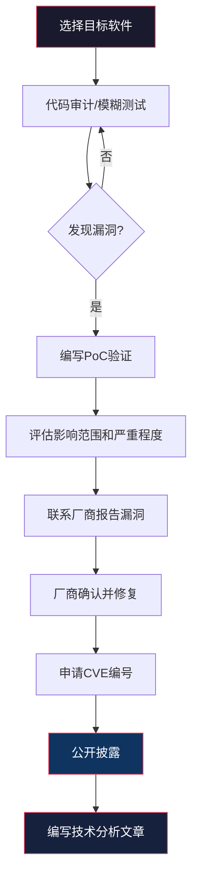

## 八、开源贡献与技术影响力

在信息安全行业，技术影响力是最硬的"货币"。它不依赖于学历或证书，而是建立在你**实际创造的价值**之上——一个被广泛使用的安全工具、一篇被转发数千次的漏洞分析、一次在顶级安全会议上的演讲，这些都能为你打开传统简历无法打开的门。本节将系统讲解如何通过开源贡献和技术内容输出，在安全圈建立个人品牌和专业影响力。

### 8.1 为什么开源贡献对安全职业至关重要

#### 8.1.1 开源与安全行业的天然联系

信息安全行业的根基就是开源。从Linux内核到OpenSSL，从Metasploit到Nmap，安全从业者每天使用的工具几乎全部是开源的。这与Web开发或移动开发领域不同——在那些领域，开源是"锦上添花"；在安全领域，开源是"基础设施"。

这种天然联系意味着：

- **安全社区高度认可开源贡献**：招聘者看到你的GitHub上有活跃的安全工具贡献，其说服力远超"精通XX技术"的简历描述
- **技术讨论围绕开源展开**：安全研究的发布、漏洞的讨论、攻击技术的交流，几乎都通过GitHub Issues、Pull Requests、安全邮件列表等开源渠道进行
- **行业标杆都是开源贡献者**：从Linus Torvalds到Kevin Mitnick，从Google Project Zero的研究员到国内的安全大牛，他们的影响力都建立在公开的技术贡献之上

#### 8.1.2 开源贡献对职业发展的具体价值

| 价值维度 | 具体表现 | 量化指标 |
|----------|---------|---------|
| **求职竞争力** | 简历上有开源贡献的候选人，面试通过率高出40%-60% | 招聘者平均花6秒看简历，GitHub链接是第一个被点击的 |
| **技术深度** | 阅读和修改优秀项目的源码，是学习最佳实践的最快途径 | 参与1个成熟项目 > 自己写10个小工具 |
| **人脉网络** | 与全球顶级安全研究者协作，建立真实的专业关系 | 核心贡献者圈子通常不超过50人 |
| **行业话语权** | 维护知名安全工具 = 行业标准的制定者之一 | OWASP项目维护者受邀参加闭门会议的概率极高 |
| **收入机会** | 开源维护者可获得赞助、咨询机会和全职offer | GitHub Sponsors、Tidelift、Bug Bounty等直接变现渠道 |

#### 8.1.3 常见的认知误区

**误区一："我技术不够，做不了开源贡献"**
事实：开源项目70%的贡献是非代码的——文档改进、Bug报告、测试用例、翻译、Issue分类。Kubernetes项目中，非代码贡献占比超过60%。

**误区二："开源贡献就是写代码"**
事实：一份清晰的Bug报告、一个可复现的PoC、一篇改进的README，这些贡献的价值不亚于代码。

**误区三："必须做大项目才有意义"**
事实：一个小而美的安全工具，如果真正解决了某个痛点，其影响力可能超过对大项目的边缘贡献。Nuclei最初就是一个小项目。

### 8.2 GitHub个人档案建设

GitHub是安全行业的"第二简历"。一个精心打造的GitHub Profile，能在招聘者、同行和潜在合作伙伴心中建立专业形象。

#### 8.2.1 Profile页面优化

**头像与简介**

使用真实的、专业的头像（不必西装革履，但要清晰可辨）。Bio字段控制在160字符以内，包含三个要素：你是谁、你做什么、你的核心关注点。

```text
# 好的Bio示例
Security Researcher | Focused on Web App & API Security | OWASP Contributor | CTF Player

# 差的Bio示例
Hacker / Programmer / Learner / Dreamer
```

**Profile README**

GitHub支持在与用户名同名的仓库中创建Profile README，它会显示在你的主页最上方。利用这个空间展示：

```markdown
# Hi, I'm [Your Name] 👋

## 🔭 Current Focus
- Web application security research
- Contributing to OWASP ZAP and Nuclei
- Building automated vulnerability scanning tools

## 🛠️ Tech Stack
- Languages: Python, Go, Bash
- Security: Burp Suite, Nuclei, SQLMap, Metasploit
- Cloud: AWS Security, Docker, Kubernetes

## 📊 GitHub Stats


## 📝 Latest Blog Posts
<!-- BLOG-POST-LIST:START -->
<!-- BLOG-POST-LIST:END -->

## 📫 How to reach me
- Twitter: @yourhandle
- Email: your@email.com
```

#### 8.2.2 仓库组织策略

**Pin最重要的6个仓库**：GitHub允许你Pin最多6个仓库到主页。选择标准：

1. 你原创的安全工具（展示创造力）
2. 你深度参与的知名项目（展示协作能力）
3. CTF Writeups集合（展示技术深度）
4. 安全研究相关的仓库（展示研究能力）
5. 文档或教程类仓库（展示沟通能力）
6. 任何有Star的项目（展示社区认可）

**仓库命名规范**：
- 使用描述性名称：`xss-scanner` 好于 `tool1`
- 安全工具加前缀标识：`sec-`、`vuln-`、`exploit-`
- Writeups用年份组织：`ctf-writeups-2025`

**README的质量决定Star数**：一个优秀的README应包含：

```text
项目名称 + 一句话描述
├── 功能截图或GIF动图
├── 安装方法（一行命令）
├── 快速开始（3步以内）
├── 详细使用说明
├── 配置选项
├── 贡献指南
├── 许可证
└── 致谢
```

#### 8.2.3 提交记录管理

保持稳定的提交记录（Green Squares），但不要为了"刷绿"而做无意义的提交。招聘者会查看你的提交历史，他们看重的是：

- **持续性**：每周都有贡献 > 突击式贡献
- **多样性**：向多个项目贡献 > 只在一个仓库活动
- **质量**：有意义的提交信息 > "fix bug"或"update"

```bash
# 好的提交信息
git commit -m "fix: prevent SQL injection in login endpoint parameterized queries"

# 差的提交信息
git commit -m "fix bug"
git commit -m "update"
git commit -m "wip"
```

### 8.3 如何选择和参与开源安全项目

#### 8.3.1 适合不同水平的安全开源项目

| 难度级别 | 推荐项目 | 入门方式 | 典型贡献 |
|----------|---------|---------|---------|
| **入门** | OWASP WebGoat、DVWA、HackTheBox | 完成练习，提交Writeup | 文档改进、翻译 |
| **初级** | Nuclei Templates、Nmap NSE Scripts | 编写扫描模板/脚本 | 新增检测规则 |
| **中级** | SQLMap、Nuclei、Amass | 修复标记为`good first issue`的Bug | Bug修复、新功能 |
| **高级** | Metasploit Framework、Radare2 | 理解架构后提交模块 | 漏洞利用模块、核心功能 |
| **专家** | Linux Kernel Security、OpenSSL、Chrome V8 | 深入研究后提交安全补丁 | 安全修复、漏洞发现 |

#### 8.3.2 第一次贡献的完整流程

以向Nuclei Templates项目贡献一个新检测模板为例：

**第一步：Fork并克隆仓库**

```bash
# 在GitHub上Fork项目
# 然后克隆你Fork的版本
git clone https://github.com/你的用户名/nuclei-templates.git
cd nuclei-templates
git remote add upstream https://github.com/projectdiscovery/nuclei-templates.git
```

**第二步：了解项目结构和规范**

```bash
# 阅读贡献指南
cat CONTRIBUTING.md

# 了解模板结构
ls -la http/vulnerabilities/

# 查看现有模板作为参考
cat http/vulnerabilities/xss/反射型xss检测.yaml
```

**第三步：创建分支并开发**

```bash
git checkout -b add-new-cve-2025-xxxxx-template

# 创建你的模板文件
# 编写完成后测试
nuclei -t your-template.yaml -u http://test-target.com
```

**第四步：提交Pull Request**

```bash
git add .
git commit -m "feat: add CVE-2025-XXXXX detection template for [产品名]"
git push origin add-new-cve-2025-xxxxx-template
# 然后在GitHub上创建Pull Request
```

**第五步：响应Review意见**

维护者可能会要求修改。保持礼貌，及时响应：

```markdown
# 好的响应方式
感谢Review！我已经按照建议修改了以下几点：
1. 更新了匹配条件，减少误报
2. 添加了reference链接
3. 修正了模板分类

请再次Review，谢谢！

# 差的响应方式
改了。
```

#### 8.3.3 安全项目的贡献类型详解

**Nuclei Templates贡献**

Nuclei是目前最流行的安全扫描器之一，其模板库是开放贡献的。每个新CVE公开后，社区都会编写对应的检测模板。

```yaml
id: cve-2025-xxxxx
info:
  name: Product X - Remote Code Execution
  author: yourname
  severity: critical
  description: |
    Product X versions prior to 2.0.0 are vulnerable to
    remote code execution via the /api/endpoint endpoint.
  reference:
    - https://nvd.nist.gov/vuln/detail/CVE-2025-XXXXX
  classification:
    cvss-metrics: CVSS:3.1/AV:N/AC:L/PR:N/UI:N/S:U/C:H/I:H/A:H
    cvss-score: 9.8
    cve-id: CVE-2025-XXXXX
  tags: cve,cve2025,rce,productx

http:
  - method: GET
    path:
      - "{{BaseURL}}/api/vulnerable-endpoint"
    matchers:
      - type: word
        words:
          - "expected_vulnerable_response"
```

**Metasploit模块贡献**

Metasploit的模块体系分为三类，贡献难度递增：

```ruby
# 辅助模块（Auxiliary）—— 扫描/检测类，入门首选
# 路径：modules/auxiliary/scanner/
class MetasploitModule < Msf::Auxiliary
  include Msf::Exploit::Remote::HttpClient
  include Msf::Auxiliary::Scanner

  def initialize(info = {})
    super(update_info(info,
      'Name'        => 'Product X Version Detection',
      'Description' => 'Detects Product X version via /api/version',
      'Author'      => ['YourName'],
      'License'     => MSF_LICENSE
    ))
  end

  def run_host(ip)
    res = send_request_cgi({
      'method' => 'GET',
      'uri'    => '/api/version'
    })
    if res && res.code == 200
      print_good("#{ip} - Product X version: #{res.body}")
    end
  end
end
```

**安全文档贡献**

为安全工具编写文档是非常有价值但被严重低估的贡献方式：

- 为工具编写中文文档（许多优秀工具只有英文文档）
- 编写安装指南（尤其是跨平台的安装步骤）
- 创建使用示例和最佳实践指南
- 翻译已有的英文文档

#### 8.3.4 CVE漏洞发现与报告

发现并报告CVE是安全研究者最高价值的开源贡献之一。完整的CVE发现流程：



**CVE申请渠道**：
- **MITRE CVE**：通过CVE Request Form提交（https://cveform.mitre.org）
- **CNVD/CNNVD**：国内漏洞库，对国内软件的漏洞接受度更高
- **HackerOne/Bugcrowd**：通过平台的CVE分配流程

**负责任的披露时间线**：
- 发现漏洞后立即报告给厂商
- 给予厂商90天修复时间（行业通用标准）
- 如果厂商未响应，30天后可升级报告
- 90天后或修复发布后，可公开技术细节

### 8.4 技术博客与内容输出

技术博客是建立个人影响力最持久、最可控的方式。与社交媒体的即时性不同，一篇高质量的技术文章可以在数年内持续为你带来关注和机会。

#### 8.4.1 内容策略规划

**内容金字塔模型**：

```mermaid
graph TD
    A[深度研究文章<br/>10% | 最高影响力] --> B[漏洞分析/工具开发<br/>25% | 技术深度]
    B --> C[实战教程/Writeup<br/>40% | 实用价值]
    C --> D[行业观察/学习笔记<br/>25% | 持续输出]
    
    style A fill:#e94560,stroke:#fff,color:#fff
    style B fill:#0f3460,stroke:#fff,color:#fff
    style C fill:#16213e,stroke:#fff,color:#fff
    style D fill:#1a1a2e,stroke:#fff,color:#fff
```

**各类型内容详解**：

**深度研究文章（10%）**：
- 原创漏洞研究、新的攻击技术、工具的深度原理分析
- 写作周期：2-4周
- 价值：极大提升行业影响力，可能被安全会议引用
- 示例：《深入理解JNDI注入：从原理到绕过》、《HTTP/2协议的安全隐患：从理论到实战》

**漏洞分析与工具开发（25%）**：
- CVE复现分析、安全工具源码解读、自研工具发布
- 写作周期：3-7天
- 价值：展示技术深度，吸引同领域研究者
- 示例：《CVE-2025-XXXXX：某ERP系统RCE漏洞分析》、《用Go编写一个轻量级子域名扫描器》

**实战教程与CTF Writeup（40%）**：
- 渗透测试实战、CTF题目解析、工具使用教程
- 写作周期：1-3天
- 价值：对初学者帮助最大，搜索引擎流量最高
- 示例：《HTB靶机实战：RedPanda全攻略》、《SQLMap高级用法：绕过WAF的10种技巧》

**行业观察与学习笔记（25%）**：
- 安全趋势分析、会议心得、书籍/课程推荐
- 写作周期：几小时
- 价值：保持更新频率，建立日常输出习惯
- 示例：《2025年DEF CON见闻》、《安全从业者的年度学习路径推荐》

#### 8.4.2 平台选择与分发策略

不要只在一个平台发布。采用"中心+分发"策略：

| 平台 | 定位 | 优势 | 适合内容 |
|------|------|------|---------|
| **个人博客**（GitHub Pages/Hugo） | 中心阵地 | 完全控制、SEO长期收益、专业形象 | 所有原创内容 |
| **GitHub** | 技术社区 | 与代码仓库联动、技术人群集中 | Writeup、工具文档 |
| **安全客** | 国内安全圈 | 安全从业者聚集、审核严格有背书 | 漏洞分析、渗透实战 |
| **先知社区** | 国内安全圈 | 阿里系背景、技术质量高 | 原创研究、漏洞挖掘 |
| **知乎** | 泛技术圈 | 流量大、SEO好、长尾效应 | 科普、行业分析 |
| **掘金/CSDN** | 开发者社区 | 开发者群体大 | 安全开发、DevSecOps |
| **Medium** | 国际读者 | 英文内容、全球曝光 | 英文技术文章 |
| **Twitter/X** | 即时传播 | 快速传播、国际安全圈 | 技术动态、漏洞速报 |

**推荐的发布流程**：
1. 先在个人博客发布（SEO归属自己）
2. 同步到安全客/先知社区（国内曝光）
3. 英文版发布到Medium（国际曝光）
4. 在Twitter分享要点和链接（传播）
5. 在相关Reddit/HackerNews社区分享

#### 8.4.3 技术文章写作方法论

**标题公式**：

```text
好的标题 = 技术主题 + 具体价值 + 受众定位

# 示例
✅ 《从零手写一个漏洞扫描器：Python实现全流程》
✅ 《深入理解SSRF攻击：原理、绕过与防御的完整指南》
✅ 《2025年OWASP Top 10变化解读：对开发者的实战影响》

❌ 《关于安全的一些思考》（太模糊）
❌ 《震惊！这个漏洞影响99%的网站！》（标题党）
❌ 《学习笔记》（没有信息量）
```

**文章结构模板**：

```markdown
# 标题

## TL;DR（30秒摘要）
用2-3句话概括文章核心内容和结论。忙碌的读者需要快速判断是否值得阅读全文。

## 背景与问题
- 这个技术/漏洞/工具是什么
- 为什么它重要
- 读者需要什么前置知识

## 核心内容
### 原理分析
用图表、代码、流程图深入解释原理。

### 实操演示
提供可复现的步骤，包含：
- 环境搭建命令
- 完整的代码/命令
- 预期输出截图
- 常见错误和解决方法

### 对比分析
与类似技术/工具/方法的对比表格。

## 防御建议（如果是漏洞相关）
具体的修复方案，而非泛泛而谈。

## 总结与展望
核心要点回顾，以及对未来发展的判断。

## 参考资料
所有引用的来源，包括CVE编号、论文链接、官方文档等。
```

**代码示例的质量标准**：

```python
# ✅ 好的代码示例：完整、可运行、有注释
import requests
from urllib.parse import urljoin

def check_ssrf(target_url, internal_ip="127.0.0.1"):
    """
    检测目标URL是否存在SSRF漏洞
    
    Args:
        target_url: 目标URL，如 http://example.com/fetch
        internal_ip: 要请求的内部IP
    
    Returns:
        bool: 是否存在SSRF漏洞
    """
    payload = {
        "url": f"http://{internal_ip}:8080/admin"
    }
    
    try:
        response = requests.post(
            target_url,
            json=payload,
            timeout=10
        )
        # 如果返回了内部服务的响应内容，说明存在SSRF
        if response.status_code == 200 and "admin" in response.text.lower():
            return True
    except requests.RequestException as e:
        print(f"请求失败: {e}")
    
    return False

# 使用示例
if __name__ == "__main__":
    vulnerable = check_ssrf("http://vulnerable-app.com/api/fetch")
    print(f"SSRF漏洞: {'存在' if vulnerable else '不存在'}")
```

```python
# ❌ 差的代码示例：片段化、无注释、无法直接运行
requests.post(url, data={"url": "http://127.0.0.1"})
```

#### 8.4.4 CTF Writeup写作规范

CTF Writeup是安全社区最受欢迎的内容类型之一。一份优秀的Writeup应包含：

```markdown
# [CTF名称] [年份] - [题目名称] [分类]

## 题目信息
- 分类：Web / Pwn / Crypto / Reverse / Misc
- 难度：Easy / Medium / Hard
- 分值：XXX points
- 解题人数：XX / XXX

## 解题思路
用流程图或文字描述你的思考过程，包括走过的弯路。

## 解题步骤

### 第一步：信息收集
[具体操作和输出]

### 第二步：漏洞发现
[分析过程，为什么判断存在该漏洞]

### 第三步：漏洞利用
[完整的Exploit代码和执行结果]

### 第四步：获取Flag
[最终结果]

## 关键知识点
- 知识点1：解释
- 知识点2：解释

## 踩坑记录
[你在解题过程中遇到的坑和解决方法，这比成功路径更有价值]
```

### 8.5 会议演讲与技术分享

会议演讲是建立技术影响力最快的方式——一场30分钟的演讲，其影响力可能超过写10篇文章。但门槛也更高，需要真材实料。

#### 8.5.1 安全会议全景

**国内主要安全会议**：

| 会议名称 | 特点 | CFP难度 | 适合人群 |
|----------|------|---------|---------|
| **KCon黑客大会** | 技术导向，氛围好 | 中等 | 有原创研究的中高级研究者 |
| **ISC互联网安全大会** | 规模大，厂商多 | 中等 | 产品/解决方案类演讲 |
| **XCon安全焦点峰会** | 老牌会议，圈子性强 | 较高 | 有深度技术研究的资深研究者 |
| **看雪安全峰会** | 偏底层，逆向/内核 | 较高 | 二进制安全、内核安全研究者 |
| **补天白帽大会** | 漏洞挖掘导向 | 中低 | Bug Bounty猎人、漏洞研究者 |
| **CSS安全峰会** | 腾讯系，应用安全 | 中等 | Web安全、移动安全研究者 |
| **0CTF/TCTF** | 竞赛+会议 | 竞赛制 | CTF选手 |

**国际主要安全会议**：

| 会议名称 | 特点 | CFP难度 | 适合人群 |
|----------|------|---------|---------|
| **Black Hat** | 顶级，商业化程度高 | 极高 | 有重大原创发现的研究者 |
| **DEF CON** | 黑客文化，包容开放 | 高 | 有创意和Demo的技术演讲 |
| **RSA Conference** | 企业安全导向 | 中高 | 安全管理、产品类演讲 |
| **CanSecWest** | 技术深度高 | 高 | 二进制安全、浏览器安全 |
| **HITB** | 亚洲+欧洲 | 中高 | 各方向安全研究 |
| **POC** | 韩国，技术导向 | 中等 | 漏洞利用、逆向工程 |
| **Zer0con** | 韩国，深度技术 | 高 | 高级漏洞利用技术 |

#### 8.5.2 从零到第一次演讲的完整路径

**第一步：积累素材（3-6个月）**

在你准备申请演讲之前，需要有足够的"弹药"：
- 完成一项原创安全研究（发现漏洞、开发工具、新攻击技术）
- 在博客上发布初步研究成果，测试社区反应
- 收集数据和证据支撑你的发现

**第二步：选择合适的会议**

首次演讲不建议直接投Black Hat。推荐路径：
1. 先在本地Meetup或线上分享会练手（如安全沙龙、OWASP本地分会）
2. 然后尝试国内二线会议（补天白帽大会、CSS等）
3. 积累经验后再投KCon、XCon等一线国内会议
4. 最后冲刺Black Hat、DEF CON等国际顶级会议

**第三步：撰写CFP（Call For Papers）**

CFP是你的演讲提案，决定了你是否被接受。一份优秀的CFP包含：

```markdown
## Title（标题）
简洁有力，30字以内，包含核心发现
例：《Beyond SQLi：AI驱动的新型SQL注入绕过技术》

## Abstract（摘要）
300-500字，包含：
- 你要讲什么（技术主题）
- 为什么重要（影响范围和严重程度）
- 你发现了什么（核心创新点）
- 听众能学到什么（实用价值）

## Outline（大纲）
详细的演讲结构，精确到每5分钟的内容：
- 0-5min：背景介绍和问题定义
- 5-15min：技术细节和攻击原理
- 15-25min：Live Demo演示
- 25-30min：防御建议和总结

## Speaker Bio（演讲者简介）
你的安全研究经历、过往演讲、开源贡献等
```

**第四步：准备演讲材料**

**幻灯片设计原则**：
- 每页不超过30个字
- 代码用大字体（24pt以上），高亮关键行
- 技术原理用流程图或动画展示
- 准备Live Demo，但一定要有视频备份
- 预留Q&A时间（5-10分钟）

**演讲练习方法**：
1. 先对着镜子讲3遍，确认逻辑流畅
2. 录制视频，检查语速、停顿、肢体语言
3. 找2-3个朋友当听众，收集反馈
4. 在本地Meetup做一次彩排
5. 准备3-5个可能的Q&A问题和答案

**第五步：现场演讲技巧**

- **开场**：用一个令人惊讶的数据或场景抓注意力
- **Demo**：提前测试3遍以上，准备好网络环境，录制备份视频
- **节奏**：每5-7分钟切换一次内容形式（讲→图→代码→Demo→讲）
- **互动**：提出问题让听众思考，但不要强迫回答
- **收尾**：用一句话总结核心发现，给出明确的行动建议

#### 8.5.3 线上技术分享

除了线下会议，线上分享也是重要的影响力渠道：

- **YouTube/B站**：录制技术教程视频，长尾效应好
- **直播**：在Twitch/B站直播安全研究过程（Live Coding/CTF解题）
- **Podcast**：参加安全类播客节目（如"安全圈"、"黑鸟"等）
- **Twitter Spaces**：参与或组织技术讨论

### 8.6 社区参与与网络建设

技术影响力不仅来自内容输出，也来自社区参与。一个活跃在安全社区的人，比一个只写博客的人更容易被认可。

#### 8.6.1 安全社区参与策略

**核心社区**：

| 社区 | 类型 | 参与方式 | 价值 |
|------|------|---------|------|
| **GitHub** | 代码社区 | Issue讨论、PR Review、项目贡献 | 技术协作、代码可见度 |
| **Twitter/X** | 信息流 | 分享研究、参与讨论、关注大牛 | 信息获取、行业连接 |
| **Discord/Slack** | 即时通讯 | 安全工具社区的Discord服务器 | 实时交流、早期信息 |
| **Reddit** | 论坛 | r/netsec、r/AskNetsec、r/ReverseEngineering | 深度讨论、知识分享 |
| **HackerOne/Bugcrowd** | 平台 | 提交漏洞、参与CTF | 收入、技术证明 |
| **Stack Overflow** | 问答 | 回答安全相关问题 | 技术权威性 |

**社区参与的"给予优先"原则**：

不要一加入社区就开始推广自己。遵循"3:1法则"——每发布1条自我推广内容前，先贡献3条有价值的内容（回答问题、分享资源、帮助新人）。

#### 8.6.2 技术人脉建设

**如何与行业大牛建立联系**：

1. **不要直接求加好友**：先在公开渠道互动（评论、转发、讨论）
2. **提供价值**：为他们的项目贡献代码、报告Bug、改进文档
3. **有质量地提问**：提出有深度的技术问题，而非"怎么入门安全"
4. **在会议/活动中面对面交流**：比线上互动有效10倍
5. **保持长期关系**：逢年过节问候，分享对方可能感兴趣的内容

**构建你的"安全朋友圈"**：

目标：在安全行业的不同方向各认识3-5个可以深入交流的人。

```text
你的人脉网络
├── 渗透测试方向：2-3个活跃的渗透测试工程师
├── 安全研究方向：1-2个漏洞研究员
├── 安全运营方向：1-2个SOC/应急响应工程师
├── 安全管理方向：1-2个安全总监/架构师
├── 安全厂商方向：1-2个安全产品开发者
└── 媒体/社区方向：1-2个安全媒体人/社区运营
```

#### 8.6.3 技术影响力指标

如何衡量你的技术影响力？关注以下指标：

| 指标 | 工具 | 健康值（1-2年经验） | 优秀值（3-5年经验） |
|------|------|--------------------|--------------------|
| GitHub Stars | GitHub | 50+ | 500+ |
| 博客文章数 | 个人统计 | 20+ | 50+ |
| 会议演讲数 | 个人统计 | 1-2 | 5-10 |
| Twitter关注者 | Twitter | 500+ | 5000+ |
| CVE数量 | MITRE/CNVD | 1-3 | 10+ |
| 开源项目贡献 | GitHub | 3+项目 | 10+项目 |

但记住：**质量永远比数量重要**。一个Star数1000的项目 > 10个Star数10的项目。

### 8.7 开源维护者的可持续实践

当你从"贡献者"成长为"维护者"时，会面临新的挑战：Issue处理、PR Review、社区管理、时间分配。

#### 8.7.1 项目维护的基本框架

**Issue管理**：
- 使用Issue模板引导提问者提供必要信息
- 用标签分类：`bug`、`enhancement`、`good first issue`、`help wanted`、`question`
- 设置自动回复，告知处理时间预期
- 定期清理过期Issue（90天无活动自动关闭）

**PR Review原则**：
- 48小时内给出第一轮反馈（即使只是"我会在周末仔细看"）
- 使用Conventional Commits规范要求提交信息
- 对新手友好的PR多给鼓励，指出问题时给出具体修改建议
- 使用`LGTM`（Looks Good To Me）明确表示通过

**时间管理**：
- 设定固定的开源维护时间（如每周六上午2小时）
- 对不合理的需求学会说"不"
- 招募Co-Maintainer分担工作
- 使用GitHub Actions自动化重复性工作

#### 8.7.2 避免Burnout

开源维护者Burnout是行业性问题。预防措施：

- **设定边界**：在README中明确你的响应时间预期
- **自动化**：CI/CD、自动标签、自动关闭过期Issue
- **寻求帮助**：在项目README中招募协作者
- **接受"不完美"**：不是每个Issue都需要你亲自处理
- **定期休息**：在README中说明假期安排

### 8.8 常见误区与纠正

#### 误区一：追求数量而非质量

**错误做法**：为了刷贡献数，向10个项目各提交一个拼写修复
**正确做法**：选择1-2个项目深入参与，提交有实质价值的贡献。一个添加了新检测规则的Nuclei PR，比50个拼写修复更有说服力。

#### 误区二：只贡献代码，忽视文档和社区

**错误做法**：认为只有代码才算贡献
**正确做法**：文档、测试、Issue分诊、回答社区问题，这些都是高价值贡献。很多项目的维护者最缺的不是代码，而是帮助回答用户问题的人。

#### 误区三：期望快速获得认可

**错误做法**：写了一篇文章或提了一个PR，就期望获得大量关注
**正确做法**：技术影响力的建立需要6-18个月的持续投入。前6个月可能没有任何可见回报，但坚持下去，量变会引起质变。

#### 误区四：过度自我推广

**错误做法**：在每个社区都发布自己的文章链接
**正确做法**：先在社区建立信任（回答问题、参与讨论），再适度分享自己的内容。推广比例不超过总活动的20%。

#### 误区五：忽视许可证和法律风险

**错误做法**：直接复制他人的代码或工具，不遵守原始许可证
**正确做法**：始终检查项目的许可证（MIT、Apache 2.0、GPL等），遵守其要求。在安全研究中注意合法边界——永远在授权范围内测试。

### 8.9 从零开始的90天行动计划

将本节内容转化为可执行的行动计划：

**第1-30天：建立基础设施**

| 周次 | 任务 | 具体产出 |
|------|------|---------|
| 第1周 | 优化GitHub Profile | 更新Bio、创建Profile README、Pin 6个仓库 |
| 第2周 | 搭建个人博客 | 使用Hugo/GitHub Pages搭建，发布第1篇文章 |
| 第3周 | 注册社区账号 | Twitter、安全客、先知社区、Reddit |
| 第4周 | 发布第2篇文章 | 选择一个CTF靶机，写一份完整的Writeup |

**第31-60天：开始开源贡献**

| 周次 | 任务 | 具体产出 |
|------|------|---------|
| 第5周 | 选择1-2个核心项目 | Fork、阅读CONTRIBUTING.md、加入项目Discord |
| 第6周 | 完成第一个贡献 | 提交1个PR（文档改进或Bug修复） |
| 第7周 | 发布第3篇文章 | 写一篇漏洞分析或工具使用教程 |
| 第8周 | 完成第二个贡献 | 提交1个更有实质价值的PR |

**第61-90天：扩大影响力**

| 周次 | 任务 | 具体产出 |
|------|------|---------|
| 第9周 | 主动参与社区讨论 | 在Twitter/Reddit回答5个安全问题 |
| 第10周 | 发布第4篇文章 | 写一篇深度技术文章（2000字以上） |
| 第11周 | 申请本地Meetup分享 | 准备一个15分钟的闪电演讲 |
| 第12周 | 回顾与规划 | 总结90天成果，规划下一个90天目标 |

### 8.10 工具与资源

**博客搭建**：
- Hugo（https://gohugo.io）：最快的静态网站生成器，Go编写
- GitHub Pages：免费托管，与GitHub无缝集成
- Hexo（https://hexo.io）：Node.js生态，中文社区活跃
- VitePress（https://vitepress.dev）：Vue驱动，适合技术文档

**写作辅助**：
- Mermaid Live Editor（https://mermaid.live）：在线绘制流程图、时序图
- Excalidraw（https://excalidraw.com）：手绘风格的架构图
- Carbon（https://carbon.now.sh）：代码截图美化
- Grammarly：英文文章语法检查

**影响力追踪**：
- GitHub Profile README Stats：自动更新的GitHub统计
- Google Analytics：博客访问数据分析
- Followerwonk：Twitter粉丝分析
- Dev.to / Hashnode：技术博客平台，自带分析功能

**学习资源**：
- *Working in Public: The Making and Maintenance of Open Source Software*（开源社区运作的经典著作）
- *Technical Blogging*（技术博客写作指南）
- OWASP Contributing Guide（https://owasp.org/contributing）
- First Timers Only（https://www.firsttimersonly.com）：为首次贡献者设计的资源

***

> 开源贡献和技术影响力不是目的，而是手段——它们帮助你成为更好的安全从业者，同时让安全社区变得更好。从今天开始，选择一个最小的行动：Fork一个项目、写一篇短文、回答一个技术问题。持续积累，时间会给你回报。
