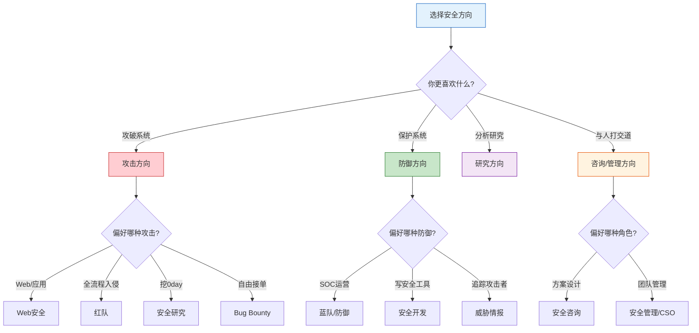
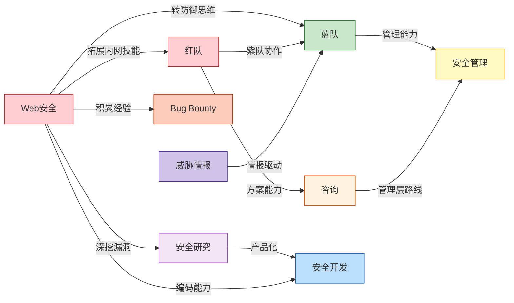
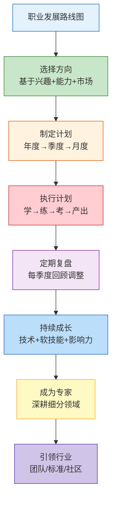

## 九、职业发展路线图

信息安全是一个高度分化的行业，不同方向对技能的要求、成长节奏、天花板高低都有显著差异。本节提供九条主要职业方向的完整路线图——从入门到专家的每个阶段该学什么、做什么、考什么、拿多少，帮助你找到最适合自己的那条路。

### 9.0 如何选择适合自己的方向

在逐一了解各路线图之前，先做一个快速自评：



**决策矩阵**：

| 维度 | 偏攻击 | 偏防御 | 偏研究 | 偏管理 |
|------|--------|--------|--------|--------|
| 核心驱动力 | 成就感(破) | 守护感(防) | 好奇心(知) | 影响力(管) |
| 典型性格 | 冒险型、耐心 | 细心、系统性 | 专注、深度思考 | 外向、协调力 |
| 入门门槛 | 中 | 中低 | 高 | 高(需先做技术) |
| 收入天花板 | 高(独立研究) | 中高(架构) | 极高(顶级0day) | 极高(CSO) |
| 工作节奏 | 弹性/压力大 | 轮班/应急 | 自主 | 会议/决策多 |
| 职业稳定性 | 中(依赖能力) | 高(刚需) | 中(看成果) | 高(管理层) |

---

### 9.1 Web安全方向路线图

Web安全是最热门的入门方向，也是人才需求量最大的细分领域。OWASP Top 10 漏洞类型、主流Web框架的攻防技术是核心能力。

#### 阶段一：基础建设（第1年）

**Q1（1-3月）：三基夯实**

| 学习内容 | 具体目标 | 验证标准 |
|----------|----------|----------|
| 网络基础 | TCP/IP协议栈、HTTP/HTTPS协议细节 | 用Wireshark抓包分析完整HTTP会话 |
| Linux基础 | 文件系统、权限、进程、Shell脚本 | 能独立搭建LAMP/LNMP环境 |
| Python基础 | 数据类型、网络编程、爬虫 | 写一个能发HTTP请求的脚本 |

**Q2（4-6月）：Web安全入门**

- 系统学习 OWASP Top 10（2021版），每种漏洞类型不只是知道概念，而是理解**成因→危害→利用→修复**全链路
- 搭建靶场环境：DVWA、SQLi-labs、Pikachu、Vulhub
- 掌握 Burp Suite 的完整使用流程：代理配置→拦截→重放→Intruder→Scanner
- 学习 SQL 注入的手工利用（联合查询、布尔盲注、时间盲注），不要只会用 sqlmap

**Q3（7-9月）：渗透测试方法论**

- 学习渗透测试标准流程：信息收集→漏洞发现→漏洞利用→后渗透→报告编写
- 掌握信息收集工具链：Subfinder、Amass、httpx、Nmap、Whatweb
- 掌握目录扫描工具：Gobuster、Dirsearch、Ffuf
- 完成至少 50 个 CTF Web 类题目（攻防世界、BUUCTF、CTFHub）

**Q4（10-12月）：实战输出**

- 第一个漏洞提交（SRC平台或CNVD）
- 完成 HackTheBox / TryHackMe 的 20 台靶机
- 开始写技术博客，记录学习过程和漏洞分析
- 考取第一个认证：eJPT 或 CompTIA Security+

#### 阶段二：能力提升（第2年）

**Q1：代码审计与安全开发**
- 学习至少一门后端框架的源码审计（推荐Java Spring或PHP ThinkPHP）
- 理解 MVC 架构中漏洞的传播路径：Controller→Model→View
- 掌握自动化审计工具：Semgrep、CodeQL基础规则编写
- 学习安全编码实践，能写出安全的代码

**Q2：内网渗透与横向移动**
- Active Directory 攻防：Kerberoasting、AS-REP Roasting、Pass-the-Hash、DCSync
- 内网代理隧道：FRP、Chisel、Neo-reGeorg、DNS隧道
- 横向移动技术：PsExec、WMI、WinRM、SMBExec
- 搭建内网靶场环境练习完整攻击链

**Q3：漏洞挖掘与Fuzzing**
- 学习黑盒Fuzzing方法论：参数变异、协议模糊、字典生成
- 掌握 Burp Suite 插件开发（Java/Python）
- 学习 SSRF、XXE、反序列化等高级漏洞类型的深层利用
- 参与 2-3 个 SRC 项目，积累真实漏洞挖掘经验

**Q4：工具开发与自动化**
- 开发自己的渗透测试工具（Python或Go）
- 学习 Nuclei POC 编写，构建自定义扫描规则
- 实现自动化渗透测试流水线
- 考取 OSCP 认证

#### 阶段三：专业深耕（第3年）

- 选择细分方向深耕：API安全、云安全（AWS/Azure/GCP）、容器安全、移动端安全
- 发表安全研究文章（先博客，后尝试会议投稿）
- 在安全会议（KCon、看雪、补天白帽大会）做分享
- Bug Bounty 收入稳定化，目标月均 $2,000+
- 建立个人品牌：GitHub开源项目 + 技术博客 + 社区活跃

#### 阶段四：专家成长（第4-5年）

- 安全架构设计能力：能为企业设计整体Web应用安全方案
- 团队管理：带 3-5 人的Web安全团队
- 行业影响力：成为某个细分领域的知名研究者
- 跨领域融合：Web安全 + 云安全 + API安全的复合能力

**Web安全方向薪资参考（中国市场，月薪）**：

| 级别 | 经验 | 薪资范围 | 典型岗位 |
|------|------|----------|----------|
| 初级 | 0-2年 | 8-18K | 安全服务工程师、初级渗透测试 |
| 中级 | 2-5年 | 18-35K | 渗透测试工程师、安全工程师 |
| 高级 | 5-8年 | 35-60K | 高级渗透、安全架构师 |
| 专家 | 8年+ | 60-100K+ | 安全总监、首席安全架构师 |

---

### 9.2 红队方向路线图

红队（Red Team）是渗透测试的升级版——不仅要找到漏洞，更要模拟真实APT组织的TTP（战术、技术、过程），全面检验企业防御体系的有效性。

#### 阶段一：基础技能（第1-2年）

红队方向的起点和Web安全类似，但更强调**广度**——Web、内网、钓鱼、物理入侵都要会。

```text
Year 1-2: 基础技能矩阵
├── 渗透测试基础（同Web安全前1.5年内容）
├── 内网渗透深度掌握
│   ├── Active Directory 全链路攻防
│   ├── 域控攻破与权限维持
│   ├── 跨域信任攻击
│   └── Azure AD / Entra ID 攻击
├── OSCP 认证（必考，红队入场券）
└── CTF 和靶场
    ├── HackTheBox Pro Labs（Rastalabs、Offshore）
    ├── Pentester Academy Red Team Labs
    └── 个人靶场搭建（Vulnstack 系列）
```

#### 阶段二：红队专项技能（第2-3年）

**钓鱼与社会工程学**
- 钓鱼邮件制作：Gophish 平台搭建、邮件头伪造、HTML邮件模板
- 克隆网站：SET（Social Engineering Toolkit）、Evilginx2（中间人钓鱼）
- 水坑攻击：识别目标常用网站，植入恶意代码
- 物理入侵基础：RFID克隆、锁具原理、尾随进入

**C2框架使用与定制**
- Cobalt Strike：Teamserver部署、Listener配置、Malleable C2 Profile编写、Artifact Kit自定义载荷
- Sliver：开源替代方案，支持多种C2协议
- Havoc、Mythic 等新兴框架
- 自研C2：基于HTTP/DNS/Telegram等协议的简单C2开发

**反检测与免杀技术**
- 静态免杀：加壳（UPX自定义、VMProtect）、代码混淆、资源加密
- 动态免杀：API调用方式变化（动态API解析、间接系统调用）
- 内存加载：反射式DLL注入、进程镂空（Process Hollowing）、进程注入
- AMSI绕过、ETW Patching、WDAC绕过
- Shellcode Loader 开发（C/C++/Rust/Go/Nim 各语言实现）

**推荐认证**：
- OSEP（Offensive Security Experienced Penetration Tester）：高级渗透
- CRTO（Certified Red Team Operator）：红队操作员认证，基于 Cobalt Strike
- CRTP（Certified Red Team Professional）：Active Directory 红队

#### 阶段三：高级红队（第3-4年）

**APT模拟**
- 研究真实 APT 组织的 TTP（参考 MITRE ATT&CK 框架）
- 模拟特定APT组织的完整攻击链：初始访问→执行→持久化→提权→防御规避→凭据访问→发现→横向移动→收集→C2→渗出
- 编写红队行动方案（Rules of Engagement、行动计划、应急预案）
- 红队基础设施搭建：域名信誉、邮件服务器、重定向器、多层C2架构

**高级持久化与横向移动**
- Active Directory 持久化：AdminSDHolder、DSRM后门、SID History
- Certificate Services 攻击（ESC1-ESC8）
- Kerberos委派攻击的高级变种
- 跨平台攻击：Windows/Linux/macOS 三平台横向

#### 阶段四：红队领导（第4-5年）

- 红队方案设计：根据客户业务场景设计定制化攻击方案
- 紫队协作：将红队发现转化为蓝队检测规则和防御改进
- 团队建设：培养初级红队成员，建立红队知识库
- 安全评估管理：同时管理多个红队项目

**红队方向薪资参考（中国市场，月薪）**：

| 级别 | 经验 | 薪资范围 | 典型岗位 |
|------|------|----------|----------|
| 初级 | 1-3年 | 15-25K | 渗透测试工程师 |
| 中级 | 3-5年 | 25-45K | 红队工程师、攻防专家 |
| 高级 | 5-8年 | 45-80K | 高级红队、红队负责人 |
| 专家 | 8年+ | 80-150K+ | 红队总监、安全顾问 |

---

### 9.3 安全研究方向路线图

安全研究是技术深度最高的方向，核心是**发现未知漏洞并开发利用方案**。这条路门槛最高、成长最慢，但技术天花板也最高。

#### 阶段一：基础研究能力（第1-2年）

**编程与系统基础**
- C/C++：深入理解指针、内存管理、UB行为，不只是会写Hello World
- x86/x64 汇编：能读懂编译器输出，理解函数调用约定、栈帧结构
- 操作系统原理：虚拟内存、系统调用、中断机制、进程调度
- 编译原理基础：词法分析、语法分析、优化阶段对漏洞的影响

**逆向工程入门**
- 静态分析工具：IDA Pro（行业标准）、Ghidra（免费替代）、Binary Ninja
- 动态调试：GDB + pwndbg/GEF、WinDbg、x64dbg
- 实战练习：CrackMes.one、Reversing.Kr、恶意样本分析（MalwareBazaar）

**第一个CVE**
- 从简单目标入手：开源小工具、CMS插件、IoT固件
- 学习漏洞报告流程：识别→验证→编写PoC→提交→跟进修复→获取CVE编号
- 参与 Google Project Zero、ZDI 等漏洞奖励计划

#### 阶段二：专项研究（第2-3年）

选择一个细分方向深入：

| 方向 | 核心技术栈 | 代表研究者/团队 | 入门建议 |
|------|-----------|----------------|----------|
| 浏览器安全 | V8引擎、JIT编译、DOM API | Google P0、奇安信 | 从 CTF 题和已公开的 CVE 开始复现 |
| 内核安全 | Linux/Windows内核、驱动开发 | 华为安全、腾讯玄武 | 先读《Linux内核设计与实现》 |
| IoT安全 | 嵌入式系统、固件提取、无线协议 | 360安全研究院 | 从路由器固件分析开始 |
| 移动安全 | Android/iOS系统、APP逆向 | 阿里安全、盘古 | 从 Frida hook 练习开始 |
| 虚拟化安全 | VM逃逸、QEMU/KVM/Xen | 腾讯、蚂蚁安全 | 需要扎实的系统编程基础 |
| 编译器/语言安全 | LLVM、V8 TurboFan、Wasm | Clang团队 | 编译器开发经验优先 |

每个方向的共同要求：
- 精读相关源码（至少 10 万行级别）
- 复现历史经典 CVE（每个方向至少 5 个）
- 掌握该领域的 Fuzzing 技术（AFL++、LibFuzzer、Honggfuzz）

#### 阶段三：研究深度（第3-4年）

**0day挖掘能力**
- 从已知漏洞模式出发，学习漏洞根因分类：
  - 内存安全类：堆溢出、栈溢出、UAF、Double Free、类型混淆
  - 逻辑类：整数溢出、竞态条件、认证绕过
  - 设计类：加密缺陷、协议缺陷、权限模型缺陷
- 开发 Fuzzing 基础设施：自定义 Corpus、覆盖率引导、去重策略
- 掌握漏洞利用开发：
  - 堆喷射、堆布局控制
  - ROP/JOP 链构造
  - 沙箱逃逸技术
  - 内核提权利用

**学术输出**
- 会议投稿：USENIX Security、IEEE S&P、CCS、NDSS（安全四大顶会）、Black Hat、DEF CON
- 论文写作：漏洞分析论文、Fuzzing方法论文、防御机制论文
- 与高校/实验室合作研究

#### 阶段四：研究领导（第4-5年）

- 研究方向规划：判断哪些技术领域值得投入
- 团队建设：招募和培养安全研究员
- 产学研合作：与高校联合实验室、指导研究生
- 行业标准参与：参与漏洞评分标准（CVSS）、安全编码规范的制定

**安全研究方向薪资参考（中国市场，月薪）**：

| 级别 | 经验 | 薪资范围 | 典型岗位 |
|------|------|----------|----------|
| 初级 | 0-2年 | 12-25K | 安全研究助理 |
| 中级 | 2-5年 | 25-50K | 安全研究员 |
| 高级 | 5-8年 | 50-100K | 高级安全研究员 |
| 专家 | 8年+ | 100-200K+ | 首席研究员、研究总监 |

---

### 9.4 蓝队/防御方向路线图

蓝队（Blue Team）负责企业安全防御体系的建设与运营。相比攻击方向，蓝队需求量更大、就业更稳定，是很多安全从业者的起点。

#### 阶段一：安全运维基础（第1年）

**安全设备与平台**
- 防火墙（下一代防火墙 NGFW）配置与策略管理
- IDS/IPS（入侵检测/防御系统）：Snort、Suricata 规则编写
- WAF（Web应用防火墙）：ModSecurity、云WAF配置
- SIEM平台：Splunk、ELK Stack（Elasticsearch + Logstash + Kibana）、QRadar

**日志分析基础**
- Windows事件日志：4624/4625（登录）、4688（进程创建）、4720（账户创建）等关键事件ID
- Linux日志：/var/log/auth.log、/var/log/syslog、auditd
- Web访问日志分析：异常请求识别、攻击特征提取
- 网络流量分析：Zeek（Bro）日志、NetFlow分析

**安全运营流程**
- 事件分级标准（P1-P4）与响应SLA
- 安全事件工单处理流程
- 值班制度与交接规范

#### 阶段二：威胁检测与应急响应（第2-3年）

**威胁检测能力建设**
- 检测规则开发：Sigma规则（跨平台检测规则格式）、YARA规则（恶意软件特征匹配）
- ATT&CK 映射：将检测规则映射到 MITRE ATT&CK 框架，找出检测盲区
- 威胁狩猎（Threat Hunting）：基于假设主动搜索网络中的威胁活动
- UEBA（用户与实体行为分析）：异常行为基线建立

**应急响应能力**
- 事件响应流程：准备→识别→遏制→根除→恢复→总结（NIST SP 800-61）
- 数字取证：内存取证（Volatility）、磁盘取证（Autopsy）、网络取证
- 恶意软件初步分析：静态分析（字符串、PE结构）、动态分析（沙箱运行）
- 应急响应工具链：KAPE、Velociraptor、GRR

**推荐认证**：
- GCIH（GIAC Certified Incident Handler）
- GCIA（GIAC Certified Intrusion Analyst）
- BTL1（Blue Team Level 1）
- CySA+（CompTIA Cybersecurity Analyst）

#### 阶段三：防御架构与自动化（第3-4年）

- 安全编排自动化与响应（SOAR）：TheHive + Cortex、Shuffle
- EDR（端点检测与响应）部署与策略优化：CrowdStrike、Microsoft Defender for Endpoint、Carbon Black
- 零信任架构设计与实施
- 安全自动化脚本开发：告警自动分类、自动遏制、自动取证

#### 阶段四：防御领导（第4-5年）

- SOC团队管理：人员、流程、技术三位一体
- 安全运营中心建设：从0到1搭建企业SOC
- 安全度量体系：MTTD（平均检测时间）、MTTR（平均响应时间）等关键指标
- 紫队协作：将红队攻击转化为蓝队检测能力

**蓝队方向薪资参考（中国市场，月薪）**：

| 级别 | 经验 | 薪资范围 | 典型岗位 |
|------|------|----------|----------|
| 初级 | 0-2年 | 8-15K | 安全运维、SOC分析师 |
| 中级 | 2-5年 | 15-30K | 安全工程师、应急响应工程师 |
| 高级 | 5-8年 | 30-55K | 高级安全工程师、SOC负责人 |
| 专家 | 8年+ | 55-100K+ | 安全总监、防御架构师 |

---

### 9.5 安全开发/DevSecOps方向路线图

安全开发方向是"会写代码的安全人"，核心是将安全能力嵌入研发流程，同时开发安全工具和平台。

#### 阶段一：安全编码与工具开发（第1-2年）

**编程能力建设**
- 精通至少一门主力语言：Python（脚本/工具）、Go（高性能工具）、Java（企业安全）
- 学习安全编码规范：OWASP ASVS、CWE Top 25
- 代码审计能力：能审计主力语言的Web应用源码

**安全工具开发**
- 漏洞扫描器开发：理解 Nuclei、Nmap 的架构并能开发类似工具
- 安全代理与中间人工具：自定义 Burp 插件
- 自动化脚本：批量信息收集、漏洞验证、资产测绘

**DevSecOps 基础**
- CI/CD 安全集成：GitLab CI / GitHub Actions 中嵌入 SAST、SCA、DAST
- 容器安全：Docker 镜像扫描（Trivy）、Kubernetes 安全策略（OPA/Gatekeeper）
- 基础设施即代码安全：Terraform/CloudFormation 安全审计

#### 阶段二：安全平台建设（第2-3年）

- 安全开发SDL（安全开发生命周期）流程平台
- 漏洞管理平台开发：漏洞录入→分配→修复→验证→关闭
- 资产管理系统：自动化资产发现、归属、风险评估
- 安全知识库建设：内部漏洞模式库、修复方案库

#### 阶段三：安全架构与DevSecOps成熟度（第3-4年）

- 云原生安全架构：Service Mesh安全、API Gateway安全策略
- 安全左移实践：威胁建模自动化、设计阶段安全评审
- 安全中台建设：统一安全能力输出给各业务线
- 开源贡献：维护或参与知名安全开源项目

#### 阶段四：技术领导（第4-5年）

- 安全产品方向规划
- 团队建设：安全开发团队管理
- 安全与业务融合：安全能力产品化

**安全开发方向薪资参考（中国市场，月薪）**：

| 级别 | 经验 | 薪资范围 | 典型岗位 |
|------|------|----------|----------|
| 初级 | 0-2年 | 12-22K | 安全开发工程师 |
| 中级 | 2-5年 | 22-40K | 高级安全开发、DevSecOps工程师 |
| 高级 | 5-8年 | 40-70K | 安全架构师、技术负责人 |
| 专家 | 8年+ | 70-120K+ | 安全技术总监 |

---

### 9.6 安全咨询方向路线图

安全咨询是技术与商业的交汇点——你需要广泛的技术知识面，更需要优秀的沟通能力和商业意识。

#### 阶段一：技术积累与合规基础（第1-2年）

- 广泛学习各安全领域基础知识（不求深但求广）
- 掌握安全评估方法论：PTES、OWASP Testing Guide、NIST SP 800-115
- 学习合规标准：等保2.0（中国）、ISO 27001、PCI DSS、SOC 2、GDPR
- 安全审计基础：技术审计流程、审计报告编写
- 考取 CISSP（安全咨询标配认证）

#### 阶段二：方案设计与客户沟通（第2-3年）

- 安全规划方案编写：现状评估→差距分析→规划路线图→预算估算
- 安全体系设计：安全策略、安全组织、安全技术、安全运营四位一体
- 客户沟通技巧：技术语言→业务语言的翻译能力
- 项目管理：PMP 或 PRIN2 基础，能管理多个并行咨询项目

#### 阶段三：行业专家与方案创新（第3-4年）

- 选择行业深耕：金融、医疗、政务、能源、制造
- 行业安全解决方案设计：了解行业特殊合规要求和业务场景
- 新兴领域咨询：云安全咨询、数据安全合规、AI安全评估
- 发表行业白皮书、参与标准制定

#### 阶段四：咨询领导（第4-5年）

- 咨询团队管理与人才培养
- 客户关系经营与业务拓展
- 方法论沉淀与知识管理

**安全咨询方向薪资参考（中国市场，月薪）**：

| 级别 | 经验 | 薪资范围 | 典型岗位 |
|------|------|----------|----------|
| 初级 | 0-2年 | 10-18K | 安全咨询顾问 |
| 中级 | 2-5年 | 18-35K | 高级顾问、项目经理 |
| 高级 | 5-8年 | 35-60K | 首席顾问 |
| 专家 | 8年+ | 60-120K+ | 咨询总监、合伙人 |

---

### 9.7 威胁情报方向路线图

威胁情报（Threat Intelligence）是安全行业中相对小众但极其重要的方向——你需要追踪全球攻击者的行为，分析他们的动机、能力和基础设施。

#### 阶段一：情报基础（第1-2年）

- 情报基础理论：情报生命周期（规划→收集→处理→分析→传播→反馈）
- 威胁情报框架：MITRE ATT&CK、Diamond Model、Kill Chain
- 开源情报收集（OSINT）工具：Shodan、Censys、VirusTotal、URLhaus
- 恶意软件基础分析：样本分类、IOC提取、家族识别
- 跟踪公开威胁情报源：安全厂商博客、CVE/NVD、安全社区

#### 阶段二：分析能力建设（第2-3年）

- 恶意软件深度分析：IDA/Ghidra 逆向、动态分析环境搭建
- 基础设施画像：域名情报（WHOIS历史、DNS解析）、IP画像、SSL证书关联
- 攻击组织追踪：APT组织命名体系、TTP关联分析、活动时间线构建
- 情报生产：IOC报告、TTP分析报告、威胁态势报告编写
- 数据分析能力：Python数据分析（Pandas）、可视化（Maltego、Gephi）

#### 阶段三：高级情报分析（第3-4年）

- 暗网情报收集：Tor网络监控、暗网市场追踪
- 外语能力提升：英语（必备）、俄语（东欧威胁组织）、朝鲜语（Lazarus等）
- 自动化情报平台建设：MISP（威胁情报共享平台）、OpenCTI
- 情报驱动防御：将情报转化为检测规则和防御策略

#### 阶段四：情报领导（第4-5年）

- 情报团队建设与管理
- 企业威胁情报项目规划
- 行业情报共享联盟建设
- 与执法机构合作（网络犯罪调查支持）

**威胁情报方向薪资参考（中国市场，月薪）**：

| 级别 | 经验 | 薪资范围 | 典型岗位 |
|------|------|----------|----------|
| 初级 | 0-2年 | 10-20K | 情报分析员 |
| 中级 | 2-5年 | 20-40K | 威胁情报分析师 |
| 高级 | 5-8年 | 40-70K | 高级情报分析师 |
| 专家 | 8年+ | 70-120K+ | 情报总监 |

---

### 9.8 安全管理/CSO方向路线图

安全管理是安全从业者的"终极形态"之一——从技术走向管理，从个人贡献者走向组织领导者。

#### 前置条件（3-5年技术基础）

安全管理不是"不懂技术也能做"的岗位。绝大多数优秀的CSO/CISO都有深厚的技术背景。建议在进入管理方向之前，先在技术方向积累至少3-5年经验。

#### 阶段一：技术管理入门（第5-7年）

- 项目管理能力：从带小项目开始，学习 PMP 体系
- 团队管理基础：招聘、培训、绩效管理、团队文化
- 安全预算管理：理解安全投入产出比（ROI），能编制年度安全预算
- 向上汇报能力：将技术风险翻译为管理层能理解的业务语言
- 考取 CISM（Certified Information Security Manager）

#### 阶段二：安全体系建设（第7-10年）

- 企业安全体系规划：基于 ISO 27001 / NIST CSF 建设安全管理体系
- 安全组织架构设计：安全团队的规模、分工、汇报关系
- 安全策略与制度体系：安全总纲→管理制度→操作规程→记录表单
- 安全运营体系建设：SOC、应急响应、漏洞管理、合规管理
- 供应链安全管理：第三方风险评估、软件供应链安全

#### 阶段三：战略级安全管理（第10-15年）

- 安全与业务融合：在业务创新中嵌入安全考量
- 安全文化建设：全员安全意识培训体系、安全事件通报机制
- 风险管理：企业级安全风险评估、风险接受/转移/规避决策
- 危机管理：安全事件的公关应对、法律合规处理
- 行业影响力：参与行业安全标准制定、安全社区建设

#### 阶段四：CSO/CISO（15年+）

- 直接向CEO/董事会汇报
- 制定企业安全战略
- 管理整个安全组织（数十到数百人）
- 行业安全生态建设

**安全管理方向薪资参考（中国市场，月薪）**：

| 级别 | 经验 | 薪资范围 | 典型岗位 |
|------|------|----------|----------|
| 主管 | 5-8年 | 25-45K | 安全主管、安全经理 |
| 总监 | 8-12年 | 45-80K | 安全总监 |
| 副总裁 | 12-15年 | 80-150K | 安全VP |
| CSO | 15年+ | 150-300K+ | CSO/CISO |

---

### 9.9 Bug Bounty/独立安全研究方向路线图

Bug Bounty 是安全行业中最具自由度的方向——不受雇于任何公司，靠发现漏洞获取赏金。听起来很美，但这条路需要极强的自律和技术深度。

#### 阶段一：入门与平台熟悉（第1年）

**平台选择与注册**
- 国内平台：补天、漏洞盒子、各厂商SRC（阿里、腾讯、字节、百度等）
- 国际平台：HackerOne、Bugcrowd、Intigriti
- 平台规则学习：每个平台的范围、规则、奖金标准、响应时间

**基础技能（同Web安全第1年）**
- 快速掌握 Web 安全基础（不需要按部就班学两年，但基础要扎实）
- 重点突破：SQL注入、XSS、SSRF、IDOR、认证绕过
- 学习已公开的漏洞报告（HackerOne Hacktivity 是最好的教材）

**第一批漏洞**
- 从国内SRC平台开始（响应快、审核相对宽松）
- 目标：前6个月提交 10+ 漏洞，至少 5 个被确认
- 不要追求高危，先积累经验和信心

#### 阶段二：效率提升与收入稳定化（第2年）

**自动化工具链搭建**
- 资产发现自动化：Subfinder + Amass + httpx + Nuclei 流水线
- 漏洞扫描自动化：自定义 Nuclei 模板、编写自动化验证脚本
- 监控系统：新资产监控、JS文件变化监控、API端点发现
- 知识管理：漏洞笔记、方法论整理、Payload库维护

**提升赏金的方法**
- 研究高价值目标：金融、加密货币、SaaS平台
- 深挖逻辑漏洞：支付绕过、竞态条件、权限提升
- 链式攻击：将多个低危漏洞组合为高危攻击链
- 学习别人的方法论：阅读 HackerOne Hacktivity 中 $10,000+ 的漏洞报告

**收入目标**：月均 $1,000-3,000（作为副业）或 $3,000-8,000（全职）

#### 阶段三：专业化与品牌建设（第3年+）

- 成为某个平台的 Top Hunter
- 发布漏洞分析文章和Writeup，建立个人品牌
- 参加 Live Hacking Event（平台邀请制，奖金更高）
- 发展细分专长：API安全、移动安全、云安全

#### 阶段四：独立安全研究者（第4年+）

- 漏洞研究不只是为了赏金，而是产出有影响力的安全研究
- 独立或合作发现高危 0day，获得 CVE
- 出版安全书籍、开设安全课程
- 安全咨询收入：为企业提供专项安全评估

**Bug Bounty 收入参考**：

| 级别 | 月收入（副业） | 月收入（全职） | 全球 Top Hunter 年收入 |
|------|----------------|----------------|------------------------|
| 入门 | $200-500 | $500-2,000 | — |
| 中级 | $500-2,000 | $2,000-5,000 | — |
| 高级 | $2,000-5,000 | $5,000-15,000 | $100K-500K/年 |
| 顶级 | $5,000+ | $15,000+ | $500K-1M+/年 |

> **风险提示**：Bug Bounty 收入波动大，没有社保、没有固定工资。建议在有稳定收入来源后再考虑全职做 Bug Bounty。至少积累 1 年稳定收入记录和 6 个月生活费储备。

---

### 9.10 各方向横向对比

| 维度 | Web安全 | 红队 | 安全研究 | 蓝队 | 安全开发 | 咨询 | 威胁情报 | 管理 | Bug Bounty |
|------|---------|------|----------|------|----------|------|----------|------|------------|
| 入门难度 | ★★☆ | ★★★ | ★★★★ | ★★☆ | ★★★ | ★★☆ | ★★★ | ★★★★ | ★★★ |
| 技术深度 | ★★★ | ★★★★ | ★★★★★ | ★★★ | ★★★★ | ★★☆ | ★★★ | ★★☆ | ★★★★ |
| 沟通要求 | ★★☆ | ★★☆ | ★★☆ | ★★★ | ★★☆ | ★★★★★ | ★★★ | ★★★★★ | ★☆☆ |
| 收入天花板 | ★★★ | ★★★★ | ★★★★★ | ★★★ | ★★★★ | ★★★★ | ★★★ | ★★★★★ | ★★★★★ |
| 就业稳定性 | ★★★★ | ★★★ | ★★★ | ★★★★★ | ★★★★ | ★★★★ | ★★★ | ★★★★★ | ★☆☆ |
| 自由度 | ★★☆ | ★★☆ | ★★★★ | ★☆☆ | ★★☆ | ★★★ | ★★☆ | ★☆☆ | ★★★★★ |
| 市场需求量 | ★★★★★ | ★★★ | ★★☆ | ★★★★★ | ★★★★ | ★★★★ | ★★☆ | ★★★ | — |

### 9.11 职业转型路径

安全行业的魅力之一是方向之间的转换通道是开放的。以下是常见的转型路径和建议：



**转型建议**：

1. **攻击→防御**：红队经验是蓝队的巨大优势。你了解攻击者怎么想，就能更好地设计检测规则。关键是转换心态——从"怎么攻破"变成"怎么发现有人在攻"。

2. **防御→攻击**：蓝队经验也是红队的优势——你了解防御体系的弱点和盲区。关键是突破"不敢攻击"的心理障碍，多做CTF和靶场练习。

3. **技术→管理**：最难的转型不是技术能力，而是思维模式。技术人追求确定性，管理需要在不确定中做决策。建议先从技术负责人（Tech Lead）开始，逐步承担管理职责。

4. **全职→Bug Bounty**：不要冲动裸辞。建议先作为副业做 1-2 年，等收入稳定超过工资且持续 6 个月以上再考虑全职。

---

### 9.12 路线图使用的常见误区

**误区一：按路线图线性前进**

现实中的成长从来不是直线的。你可能在某个阶段停留很久，也可能跳过某个阶段。路线图是参考，不是命运。关键是**保持学习的连续性**，而不是严格按照季度计划。

**误区二：只关注技术，忽视软技能**

安全行业最常见的职业天花板不是技术，而是沟通、写作、汇报、管理等软技能。特别是到了高级别，技术能力之间的差异已经很小，决定高下的是你能否清晰表达复杂问题、有效影响决策。

**误区三：盲目追求认证**

认证是敲门砖，不是能力证明。一个 OSCP 持有者如果不会内网渗透，面试一样过不了。建议认证学习以"系统化知识"为目标，而不是"拿证"为目标。考证顺序建议：入门认证（Security+/eJPT）→实战认证（OSCP）→高级认证（OSEP/CRTO）。

**误区四：频繁跳方向**

安全领域方向众多，浅尝辄止是最大的陷阱。每个方向从入门到胜任至少需要2年。频繁跳方向的结果是"什么都会一点，什么都不精通"。建议至少在一个方向深耕3年再考虑转型。

**误区五：低估行业的持续学习要求**

安全行业技术迭代极快。去年的热门技术今年可能过时，新的攻击手法层出不穷。停止学习 = 开始淘汰。建议每天至少投入1小时学习新技术、跟踪安全动态。

---

### 9.13 本节总结



九条路线没有优劣之分，只有适合与否。选择你真正热爱的方向，然后用3-5年时间深耕到行业前列。安全行业不缺"会一点"的人，缺的是"真正精通"的人。

无论选择哪条路线，以下三点是共同的：
1. **持续学习是生存线**——安全技术迭代极快，停止学习就等于淘汰
2. **实战出真知**——看100篇文章不如自己动手挖1个漏洞
3. **影响力是乘数**——技术能力 × 影响力 = 职业高度。写博客、做分享、开源贡献，让你的能力被更多人看到
