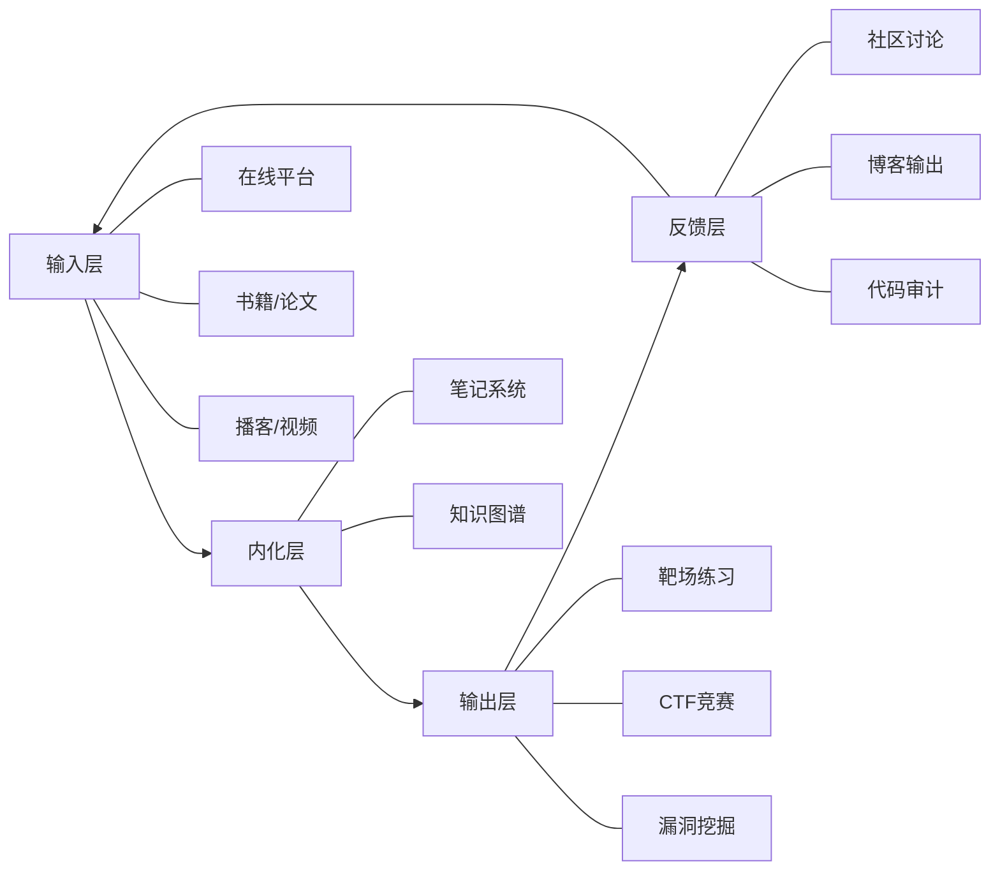
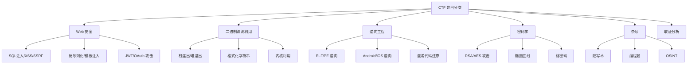
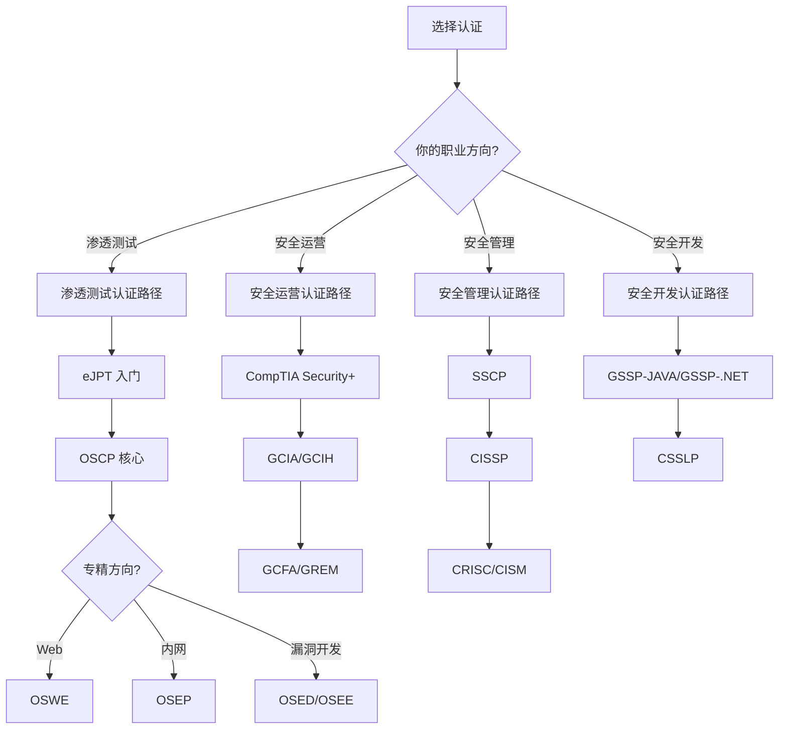
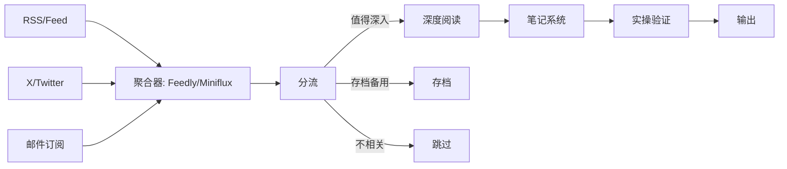
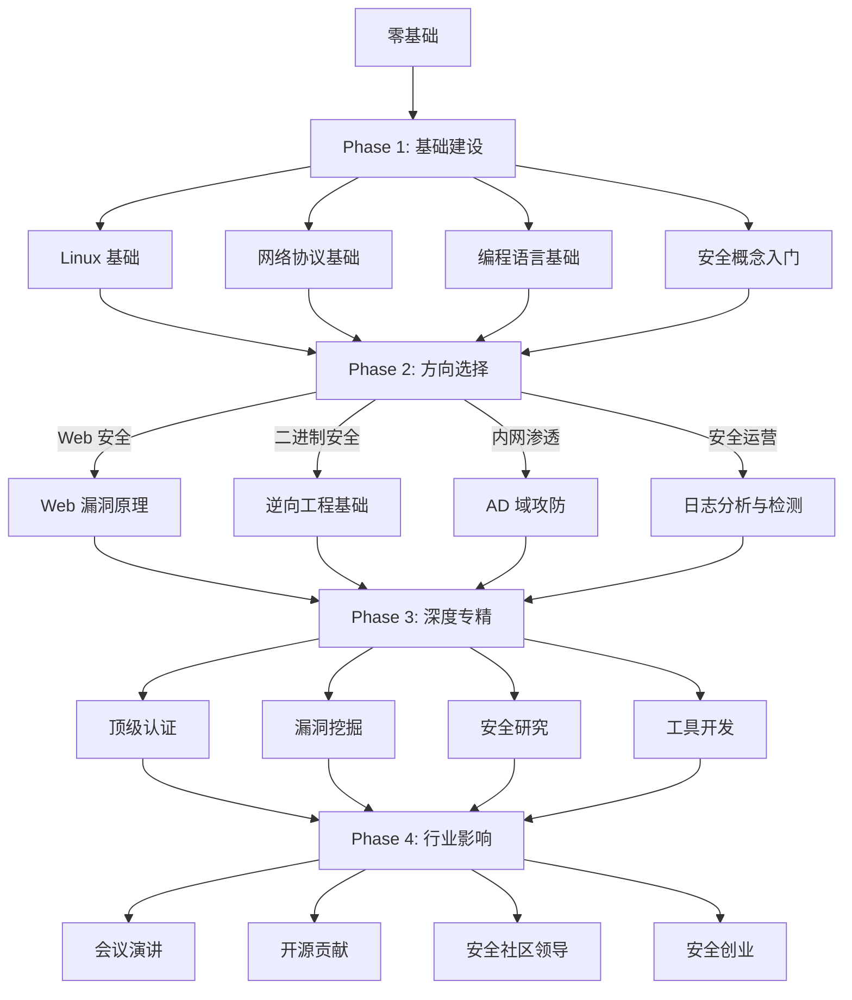

## 十、持续学习资源

网络安全是一个知识半衰期极短的领域——CVE 每天新增数十个，攻防技术每 18 个月就会经历一次代际更替。昨天的零日今天就成了常识，去年的防御方案今年可能已被绕过。在这样的领域里，持续学习不是锦上添花，而是职业生存的底线。

本章不是一份"资源清单"，而是一套**学习基础设施建设方案**：帮你搭建从输入（学习资源）→ 内化（知识管理）→ 输出（实践验证）→ 反馈（社区互动）的完整闭环。

---

### 10.1 在线学习平台：分层选择策略

不同阶段的学习者需要不同类型的平台。初学者需要结构化引导，中级者需要实战环境，高级者需要真实世界的攻防场景。盲目选择"最好的"平台不如选择"最适合当前阶段的"平台。

#### 10.1.1 免费平台详解

**PortSwigger Web Security Academy**

这是 Web 安全领域公认的免费学习标杆。PortSwigger（Burp Suite 的开发商）提供了覆盖 OWASP Top 10 全部类别的交互式教程，每个漏洞类型都配有理论讲解、实验室靶场和解题思路。

- **内容覆盖**：SQL 注入、XSS、CSRF、SSRF、认证绕过、访问控制、文件上传、JWT 攻击、OAuth 漏洞、Web 缓存投毒、HTTP 请求走私等 30+ 专题
- **实验室数量**：200+ 个免费靶场，从 Apprentice（初级）到 Expert（专家）三级难度
- **学习路径建议**：先完成所有 Apprentice 级别，再按专题攻克 Practitioner，最后挑战 Expert。每个实验室完成后查看官方 WriteUp 对比思路
- **适用阶段**：零基础到高级，建议用时 3-6 个月系统刷完
- **配合工具**：必须使用 Burp Suite Community/Professional，同步学习工具操作

**OverTheWire（Bandit → Natas → Leviathan 系列）**

经典的 Linux 命令行与安全基础训练场。Bandit 系列从最基本的 SSH 登录开始，逐步教授文件操作、权限管理、网络工具等技能。

- **Bandit（33 关）**：Linux 基础命令、文件权限、管道、正则表达式、Git 操作。纯命令行操作，零安全基础即可开始
- **Natas（34 关）**：Web 安全基础，涵盖 HTTP 认证、源码泄露、SQL 注入、命令注入、文件包含、编码绕过等
- **Leviathan（34 关）**：二进制安全基础，涉及逆向工程、缓冲区溢出、格式化字符串等
- **Krypton**：密码学基础，凯撒密码、维吉尼亚密码、现代密码学概念
- **建议**：Bandit 是每个安全从业者的第一课，2-3 天可完成。完成后直接进入 Natas

**TryHackMe**

面向零基础学习者的结构化学习平台，以"房间"（Room）为单位组织内容，每个房间是一个独立的学习主题。

- **学习路径**：
  - Pre Security（预备知识）→ 网络基础、Linux 基础、Web 基础
  - Introduction to Cyber Security（安全入门）→ 安全概念、工具认知
  - Jr Penetration Tester（初级渗透）→ 信息收集、漏洞利用、后渗透
  - Offensive Penetration Testing（高级渗透）→ 完整渗透测试流程
- **优势**：内置 VPN 环境，无需本地搭建靶机；社区 WriteUp 丰富
- **劣势**：深度有限，高级内容需要订阅 Premium（$14/月）
- **适用阶段**：零基础入门，建议用时 1-3 个月完成 Pre Security + Jr Penetration Tester

**Hack The Box Academy**

HTB 官方推出的结构化学习平台，与 HTB 靶机形成"学→练→战"闭环。

- **模块体系**：按角色（Penetration Tester、Bug Bounty Hunter、SOC Analyst 等）和技术领域（Web、Pwn、Crypto、Forensics 等）双维度组织
- **特色**：每个模块末尾有技能评估，通过后获得模块完成凭证
- **与 HTB 靶机的配合**：学完模块后在 HTB 靶机上实战验证，靶机难度从 Easy 到 Insane 递增
- **成本**：基础模块免费，完整路径需订阅（约 $18/月或用 Cubes 按需购买）
- **适用阶段**：有一定基础（完成 TryHackMe 入门路径后）的中级学习者

**Cybrary**

安全课程聚合平台，内容覆盖面广但深度参差不齐。

- **优势**：课程数量多（500+），涵盖从入门到 CISSP 认证备考的全阶段
- **劣势**：部分课程质量一般，缺乏动手实验环境
- **使用建议**：作为知识补充而非主要学习路径，适合在其他平台学习之余拓宽知识面
- **免费内容**：基础课程免费，进阶内容和职业路径需订阅（$59/月）

#### 10.1.2 付费平台深度对比

| 平台 | 价格区间 | 核心认证 | 内容深度 | 实战环境 | 适合阶段 |
|------|----------|----------|----------|----------|----------|
| Offensive Security（OSCP） | $799-$5499 | OSCP/OSEP/OSED/OSWE | ★★★★★ | 自建实验室 | 高级 |
| SANS Institute | $7000-$9000/课程 | GIAC 系列 | ★★★★★ | 虚拟实验室 | 中高级 |
| INE（原 eLearnSecurity） | $749/年 | eJPT/eCPPT/eWPT | ★★★★☆ | 内置实验室 | 中级 |
| PentesterLab | $349/年 | PentesterLab Pro | ★★★★☆ | 内置靶场 | 中级 |
| Hack The Box Pro Labs | $490-$1490/月 | HTB Certifications | ★★★★★ | 真实模拟网络 | 高级 |
| TCM Security | $29.99/月 | PNPT | ★★★★☆ | 内置实验室 | 中级 |

**Offensive Security 课程体系详解**

OffSec 是渗透测试认证的"金标准"，其 OSCP 认证被业内称为"入场券"。

- **PEN-200（OSCP）**：基础渗透测试，涵盖信息收集、Web 漏洞利用、客户端攻击、Active Directory 攻击。考试 24 小时实操 + 24 小时报告，3 台靶机 + 1 个 AD 域环境。通过率约 40%
- **PEN-300（OSEP）**：高级渗透测试，侧重规避防御（Evasion）、高级攻击链、横向移动。适合已有 OSCP 的红队人员
- **WEB-300（OSWE）**：Web 应用安全，白盒代码审计 + 漏洞利用。需要阅读源码能力，适合 Web 安全方向
- **EXP-301（OSED）**：Windows 漏洞开发，缓冲区溢出、SEH 绕过、DEP/ASLR 绕过。需要 C/C++ 和汇编基础
- **EXP-401（OSEE）**：高级漏洞开发，内核利用、沙箱逃逸。OffSec 最高级别课程，全球通过人数极少

**SANS 课程与 GIAC 认证**

SANS 是企业级安全培训的标杆，课程由一线从业者讲授，内容紧跟最新攻防技术。

- **SEC560（网络渗透测试）**：对应 GIAC GPEN，系统化渗透测试方法论
- **SEC660（高级渗透测试）**：对应 GIAC GXPN，高级漏洞利用和绕过技术
- **SEC542（Web 应用渗透测试）**：对应 GIAC GWAPT，Web 安全深入
- **FOR508（高级事件响应）**：对应 GIAC GCFA，数字取证与事件响应
- **成本优化**：SANS 课程昂贵，可通过以下方式降低成本：
  - Work Study 项目（志愿者减免约 50%）
  - 企业培训预算报销
  - SANS 网络竞赛（NetWars、Holiday Hack）获奖获取免费课程
  - GIAC 自带考试的课程包（比单独购买便宜）

**INE（原 eLearnSecurity）认证路径**

INE 的认证体系适合中级学习者作为 OSCP 前的过渡：

- **eJPT（Junior Penetration Tester）**：入门级，无时间限制的实操考试，通过率较高。适合验证基础能力
- **eCPPT（Certified Professional Penetration Tester）**：中级，7 天考试，含渗透测试报告撰写。OSCP 的平替选择
- **eWPT（Web Application Penetration Tester）**：Web 方向专项认证
- **eCPTX（Certified Penetration Tester eXtreme）**：高级，接近 OSEP 水平

**TCM Security（Practical Network Penetration Tester, PNPT）**

近年崛起的实战认证，以"贴近真实工作场景"为卖点。

- **考试形式**：5 天渗透测试 + 2 天报告撰写 + 30 分钟报告讲解（答辩）
- **特色**：模拟真实企业环境，包含外网突破、内网渗透、域控攻击的完整链路。报告讲解环节考察沟通能力
- **课程内容**：信息收集、Web 漏洞利用、后渗透与横向移动、Active Directory 攻击、报告撰写
- **价格**：课程 + 考试约 $400，性价比极高
- **适合人群**：准备进入渗透测试行业的转行者，或 OSCP 的低成本替代方案

#### 10.1.3 特色平台推荐

以下平台在特定领域有独特价值：

**二进制安全与逆向工程**

- **pwn.college（Arizona State University）**：免费的二进制安全教育平台，从基础的位运算到高级内核漏洞利用，课程体系完整。Dojo 模式提供渐进式挑战
- **Nightmare（github.com/guyinatuxedo/nightmare）**：CTF 题解式二进制安全教程，按漏洞类型分类，含详细解题过程
- **RE101/RE102（malwareunicorn.org）**：免费的逆向工程入门/进阶教程，配合 Ghidra 实操

**云安全**

- **Flaws.cloud / Flaws2.cloud**：AWS 安全挑战，通过实际场景学习云服务配置错误
- **CloudGoat（Rhino Security Labs）**：AWS 漏洞靶场，部署在真实 AWS 账户中
- **DVCP（Damn Vulnerable Cloud Platform）**：多云安全靶场
- **HackTheBox Cloud Labs**：Azure/AWS/GCP 环境的渗透测试实验室

**移动安全**

- **OWASP MSTG（Mobile Security Testing Guide）**：移动安全测试方法论 + 配套 CrackMes 靶场
- **DIVA（Damn Insecure and Vulnerable App）**：Android 漏洞练习 App
- **DVIA（Damn Vulnerable iOS App）**：iOS 漏洞练习 App

**内网与 Active Directory**

- **GOAD（Game of Active Directory）**：基于 VirtualBox/VMware 的 AD 攻防靶场，包含多种域配置场景
- **DetectionLab**：自动化搭建安全检测实验室，含 Splunk、Zeek、osquery 等检测工具
- **AD Module Labs（github.com/sense-of-security/ADRecon）**：AD 环境侦察工具学习

---

### 10.2 书籍推荐：从书架到战场

书籍提供系统性知识框架，这是碎片化的博客和视频无法替代的。以下是按方向和阶段整理的核心书单，每本书标注了**前置要求**和**读完后能达到的水平**。

#### 10.2.1 Web 安全方向

**入门级（零基础可读）**

| 书名 | 作者 | 核心内容 | 阅读建议 |
|------|------|----------|----------|
| 《Web 应用安全权威指南》 | Dafydd Stuttard | Web 漏洞全景、Burp Suite 使用、渗透测试方法论 | Web 安全第一本书，配合 PortSwigger 实验室 |
| 《白帽子讲 Web 安全》 | 吴翰清 | XSS/CSRF/SQL 注入原理、浏览器安全模型 | 中文原创，案例贴近国内环境 |
| 《黑客攻防技术宝典：Web 实战篇》 | 张炳帅 | Web 漏洞原理与利用、实战案例 | 实操性强，适合配合靶场练习 |
| 《Web 安全攻防：渗透测试实战指南》 | 徐焱等 | 信息收集、漏洞利用、后渗透、报告撰写 | 国内渗透测试入门首选 |

**进阶级（需 Web 开发基础）**

| 书名 | 作者 | 核心内容 | 阅读建议 |
|------|------|----------|----------|
| 《The Web Application Hacker's Handbook》(2nd) | Stuttard & Pinto | 深度 Web 漏洞分析、高级利用技术 | 英文原版，WAHH 是进阶必读 |
| 《Real-World Bug Hunting》 | Peter Yaworski | 漏洞赏金实战案例、逻辑漏洞挖掘 | 学习白帽黑客的思维方式 |
| 《Hunting Security Bugs》 | Tom Gallagher | 微软安全测试方法论、代码审计视角 | 从防御者角度理解漏洞 |
| 《Tangled Web》 | Michal Zalewski | 浏览器安全模型深度解析 | 理解浏览器安全的底层机制 |

#### 10.2.2 二进制安全与逆向工程

**入门级**

| 书名 | 作者 | 核心内容 | 前置要求 |
|------|------|----------|----------|
| 《逆向工程核心原理》 | 李承远 | x86 汇编、调试器使用、PE 文件分析 | C 语言基础 |
| 《IDA Pro 权威指南》 | Chris Eagle | IDA Pro 反汇编器使用、逆向分析技巧 | 汇编基础 |
| 《加密与解密》(第 4 版) | 段钢 | 软件保护与破解、调试技术、脱壳 | Windows 编程基础 |
| 《Practical Binary Analysis》 | Dennis Andriesse | 二进制分析自动化、符号执行、污点分析 | Linux 基础 + C 语言 |

**进阶级**

| 书名 | 作者 | 核心内容 | 前置要求 |
|------|------|----------|----------|
| 《漏洞战争：软件漏洞分析精要》 | 吴石 | 堆溢出、栈溢出、UAF、内核漏洞分析 | 有二进制分析基础 |
| 《The Shellcoder's Handbook》 | Anley 等 | 漏洞开发原理、Shellcode 编写 | 汇编 + C 语言 |
| 《Windows 内核原理与实现》 | 潘爱民 | Windows 内核架构、驱动开发、安全机制 | Windows 系统编程 |
| 《Linux 内核安全》 | 李承远 | Linux 内核漏洞分析、提权技术 | Linux 内核基础 |
| 《A Bug Hunter's Diary》 | Tobias Klein | 真实漏洞挖掘案例、漏洞发现方法论 | 有安全基础 |

**高级级**

| 书名 | 作者 | 核心内容 | 前置要求 |
|------|------|----------|----------|
| 《Windows Internals》(7th) | Russinovich 等 | Windows 系统底层机制全景 | 系统编程经验 |
| 《The Art of Software Security Assessment》 | Dowd 等 | 代码审计方法论、漏洞模式识别 | 多语言编程经验 |
| 《Fuzzing: Brute Force Vulnerability Discovery》 | Sutton 等 | Fuzzing 技术原理与实践 | 有漏洞分析经验 |
| 《Android Internals》 | Jonathan Levin | Android 系统架构与安全机制 | Android 开发基础 |

#### 10.2.3 网络与渗透测试

**核心书目**

- 《Metasploit 渗透测试指南》：Metasploit 框架的系统学习，从信息收集到后渗透的完整流程。配合 Metasploitable 靶机实操
- 《灰帽黑客：正义黑客的道德规范与渗透测试》：渗透测试方法论全景，涵盖法律和伦理问题
- 《渗透测试实战第三版》（The Hacker Playbook 3）：红队实战手册，模拟真实 APT 攻击链
- 《Penetration Testing》（Georgia Weidman）：OSCP 备考推荐书目，系统化学习路径
- 《Red Team Field Manual (RTFM)》：渗透测试速查手册，命令和 Payload 快速参考
- 《Operator Handbook》：红队/蓝队/紫队速查手册，比 RTFM 更全面

#### 10.2.4 密码学与区块链安全

- 《密码编码学与网络安全》（William Stallings）：密码学理论基础，涵盖对称/非对称加密、哈希、数字签名
- 《应用密码学》（Bruce Schneier）：密码学经典著作，算法实现细节
- 《智能合约安全》（Ethereum Smart Contract Security）：Solidity 安全审计、常见漏洞模式
- 《The Blockchain Developer》：区块链底层原理，理解智能合约运行环境

#### 10.2.5 阅读方法论

安全书籍不是小说，不要从头读到尾。推荐以下阅读策略：

1. **全景扫描**：先看目录和每章导言，建立知识框架（30 分钟）
2. **重点突破**：选择与当前工作/学习最相关的章节深度阅读
3. **实操验证**：每读完一个漏洞类型，立即在靶场复现
4. **横向对比**：同一漏洞类型阅读多本书的描述，对比不同作者的分析角度
5. **定期回顾**：每月花 2 小时重读标记章节，温故知新

---

### 10.3 技术社区与资讯渠道

#### 10.3.1 中文安全社区

| 社区 | 定位 | 内容质量 | 活跃度 | 推荐理由 |
|------|------|----------|--------|----------|
| 看雪论坛（pediy.com） | 逆向工程、二进制安全 | ★★★★★ | 高 | 国内二进制安全第一社区，技术深度最高 |
| 先知社区（xianzhicommunity） | 漏洞分析、攻防技术 | ★★★★★ | 高 | 阿里安全旗下，原创漏洞分析质量极高 |
| FreeBuf（freebuf.com） | 安全资讯、技术文章 | ★★★★☆ | 很高 | 综合安全资讯平台，覆盖面广 |
| 安全客（anquanke.com） | 安全资讯、漏洞预警 | ★★★☆☆ | 很高 | 360 旗下，漏洞预警及时 |
| T00ls（t00ls.net） | 渗透测试、漏洞利用 | ★★★★☆ | 中 | 老牌渗透论坛，实战经验丰富 |
| 吾爱破解（52pojie.cn） | 逆向工程、软件安全 | ★★★★☆ | 很高 | 逆向入门友好，社区活跃 |
| 安全牛（aqniu.com） | 行业报告、安全趋势 | ★★★☆☆ | 中 | 企业安全视角，适合了解行业动态 |
| 嘶吼（4hou.com） | 安全资讯、技术分享 | ★★★☆☆ | 中 | 内容广泛，适合日常浏览 |

#### 10.3.2 英文安全社区

| 社区 | 定位 | 推荐理由 |
|------|------|----------|
| Reddit r/netsec | 综合安全讨论 | 英文安全社区最大聚合地，实时性强 |
| Reddit r/ReverseEngineering | 逆向工程 | 二进制安全深度讨论 |
| Reddit r/bugbounty | 漏洞赏金 | Bug Bounty 猎人交流 |
| Hacker News（news.ycombinator.com） | 技术综合 | 安全事件上热榜时值得深入讨论 |
| Stack Overflow Security | 技术问答 | 具体安全问题的快速解答 |
| Discord: NetSec Focus | 实时交流 | 多个安全子频道，社区友好 |

#### 10.3.3 漏洞资讯来源

**官方漏洞数据库**

- **NVD（National Vulnerability Database）**：美国 NIST 维护的漏洞数据库，CVE 官方评分（CVSS）。地址：nvd.nist.gov
- **CVE Details**：CVE 漏洞的可视化展示，按产品/厂商/年份统计。地址：cvedetails.com
- **Exploit Database（Exploit-DB）**：OffSec 维护的漏洞利用代码库，含 PoC 和 Shellcode。地址：exploit-db.com
- **CNVD（中国国家信息安全漏洞共享平台）**：国内漏洞库，收录国内厂商漏洞。地址：cnvd.org.cn
- **CNNVD（中国国家信息安全漏洞库）**：中国信息安全测评中心维护。地址：cnnvd.org.cn

**实时漏洞监控**

- **CISA Known Exploited Vulnerabilities Catalog**：美国 CISA 维护的已知被利用漏洞目录，优先级最高
- **Vulners**：聚合多个漏洞源的搜索引擎，支持 API 查询
- **GitHub Advisory Database**：开源组件漏洞，DevSecOps 必看
- **Snyk Vulnerability Database**：开源依赖漏洞数据库，有修复建议

**漏洞预警渠道**

- **Twitter/X 安全研究员关注列表**：关注 @vaborunderground、@GossiTheDog、@malaborhunting 等活跃研究员，零日漏洞通常先在 Twitter 上披露
- **RSS 订阅**：使用 Feedly 或 Miniflux 订阅上述漏洞源，避免信息过载
- **Telegram 安全频道**：多个实时漏洞推送频道，时效性强

#### 10.3.4 安全播客

播客是利用通勤、运动等碎片时间学习的高效方式：

| 播客 | 风格 | 更新频率 | 推荐理由 |
|------|------|----------|----------|
| Darknet Diaries | 叙事型 | 双周 | 真实黑客故事，制作精良，入门必听 |
| Risky Business | 新闻分析型 | 周更 | 安全行业新闻深度分析，主持人专业 |
| Security Now | 技术讲解型 | 周更 | Steve Gibson 深度讲解安全概念 |
| Smashing Security | 轻松讨论型 | 周更 | 安全话题轻松讨论，适合放松时听 |
| Malicious Life | 历史叙事型 | 双周 | 计算机安全历史事件，了解安全行业演变 |
| Hacker Valley Studio | 人物访谈型 | 周更 | 采访安全行业领袖，了解职业发展 |
| The CyberWire | 新闻简报型 | 日更 | 15 分钟安全新闻摘要，高效获取信息 |

中文安全播客：

- **安全圈**（安全圈 FM）：国内安全行业动态
- **赛博菩提**：安全技术深度分享
- **安全牛播客**：企业安全视角

#### 10.3.5 YouTube/B站 频道推荐

**英文频道**

- **LiveOverflow**：Web 安全和 CTF 教程，讲解清晰有趣，入门友好
- **John Hammond**：CTF 题解、安全工具演示、渗透测试实操
- **IppSec**：Hack The Box 靶机完整解题过程，OSSP 备考参考
- **The Cyber Mentor**：渗透测试系统教程，PEN-200 配套内容
- **David Bombal**：网络和安全基础，适合网络背景学习者
- **STÖK**：Bug Bounty 猎人视角，漏洞挖掘实录
- **Nahamsec**：Bug Bounty 方法论和实战案例
- **13Cubed**：数字取证和事件响应

**中文/B站频道**

- **泷羽 sec**：渗透测试和安全工具教程
- **暗月安全**：内网渗透和域攻防
- **小迪安全**：Web 安全和渗透测试
- **掌控安全学院**：系统化安全课程

---

### 10.4 CTF 竞赛与实战平台

#### 10.4.1 CTF 竞赛体系

CTF（Capture The Flag）是安全能力的竞技场，也是检验学习成果的最佳方式。

**CTF 赛制类型**

| 赛制 | 特点 | 代表赛事 | 适合阶段 |
|------|------|----------|----------|
| Jeopardy（解题） | 题目分类计分，解题越多分越高 | DEF CON CTF Quals, Google CTF | 入门到高级 |
| Attack-Defense（攻防） | 各队维护自己的服务，同时攻击对手 | DEF CON CTF Finals | 高级 |
| King of the Hill | 争夺共享服务器控制权 | HTB CTF | 中级 |
| 混合赛制 | 综合多种模式 | iCTF | 中高级 |

**CTF 题目分类与技能要求**

**重要 CTF 赛事日历**

- **DEF CON CTF**：每年 8 月，CTF 竞赛的"世界杯"
- **Google CTF / GoogleCTF Beginners**：每年夏季，Google 主办
- **PlaidCTF**：每年春季，PPP 战队主办
- **HITCON CTF**：每年秋季，台湾 HITCON 会议
- **SECCON CTF**：每年秋季，日本安全会议
- **强网杯**：国内顶级 CTF，每年举办
- **XCTF 联赛**：国内 CTF 联赛，包含多个分站赛
- **网鼎杯**：国内大型 CTF 赛事

#### 10.4.2 CTF 练习平台

| 平台 | 题目类型 | 难度范围 | 特色 |
|------|----------|----------|------|
| CTFtime | 赛事聚合 | 全部 | CTF 赛事日历和战队排名 |
| PicoCTF | 全类型 | 入门-中级 | CMU 主办，学生友好 |
| OverTheWire | 多类型 | 入门-中级 | 经典 wargame |
| Hack The Box | 全类型 | 入门-专家 | 靶机 + 挑战题 |
| Root-Me | 全类型 | 入门-高级 | 法国平台，题目质量高 |
| CryptoHack | 密码学 | 入门-高级 | 密码学专项训练 |
| RingZer0 | 多类型 | 入门-高级 | 题量大，覆盖广 |
| pwn.college | 二进制 | 入门-高级 | ASU 出品，课程体系完整 |
| Microcorruption | 嵌入式安全 | 入门-中级 | 嵌入式系统安全挑战 |
| Reversing.Kr | 逆向工程 | 入门-中级 | 逆向专项练习 |
| W3Challs | Web 安全 | 中级-高级 | Web 安全专项 |

#### 10.4.3 CTF 学习路径

**Phase 1：入门（0-3 个月）**
- 完成 PicoCTF 入门题（Web + Crypto + Misc）
- 完成 OverTheWire Bandit + Natas
- 注册 CTFtime，每周参加 1-2 场线上 CTF
- 目标：能在 CTF 中解出 Web 和 Misc 的简单题

**Phase 2：进阶（3-12 个月）**
- 确定主攻方向（Web/Pwn/Crypto/Rev 选 1-2 个）
- 系统学习主攻方向的知识体系
- 每周参加 CTF，尝试中级题目
- 阅读其他队伍的 WriteUp，学习解题思路
- 目标：在中等规模 CTF 中进入前 50%

**Phase 3：竞技（12+ 个月）**
- 加入或组建 CTF 战队
- 参加 DEF CON Quals 等顶级赛事
- 输出 WriteUp，建立个人技术品牌
- 目标：在国际 CTF 中稳定进入前 20%

---

### 10.5 认证体系规划

安全认证是职业发展的加速器，但并非越多越好。关键是选择与职业方向匹配的认证，并在正确的时间节点考取。

#### 10.5.1 认证选择矩阵

#### 10.5.2 核心认证详解

**入门级认证**

- **CompTIA Security+**：安全行业入门认证，涵盖安全基础概念、威胁与漏洞、安全架构与设计。无需前置条件，适合零基础转行者。考试形式：90 分钟，90 道选择题和实操题。费用：$404
- **eJPT（eLearnSecurity Junior Penetration Tester）**：实操型入门渗透测试认证，无时间限制。考试形式：实操靶机 + 报告。费用：含在 INE 订阅中
- **CompTIA PenTest+**：渗透测试入门认证，理论与实操结合。适合 Security+ 之后的进阶

**中级认证**

- **OSCP（Offensive Security Certified Professional）**：渗透测试行业"硬通货"。考试 24 小时实操（3 台独立靶机 + 1 个 AD 域环境）+ 24 小时报告。通过率约 40%。费用：课程 + 考试 $1599-$2499。**备考建议**：刷完 PEN-200 课程所有练习 + HTB Pro Labs 准备 3-6 个月
- **PNPT（Practical Network Penetration Tester）**：TCM Security 认证，模拟真实渗透测试场景。5 天测试 + 2 天报告 + 30 分钟答辩。费用约 $400，性价比极高
- **eCPPT（eLearnSecurity Certified Professional Penetration Tester）**：7 天实操考试，含完整渗透测试报告。OSCP 的平替选择
- **CRTP（Certified Red Team Professional）**：Active Directory 红队认证，侧重域攻防。由 Altered Security（原 Pentester Academy）提供

**高级认证**

- **OSEP（Offensive Security Experienced Penetration Tester）**：高级渗透测试，侧重规避防御和高级攻击技术。需要 OSCP 前置。费用 $1599-$2499
- **OSWE（Offensive Security Web Expert）**：Web 应用安全专家，白盒代码审计。适合 Web 安全方向高级从业者
- **OSED（Offensive Security Exploit Developer）**：Windows 漏洞开发。需要 C/C++ 和汇编基础
- **OSEE（Offensive Security Exploitation Expert）**：OffSec 最高级别，内核利用和沙箱逃逸。全球通过人数极少

**管理与合规认证**

- **CISSP（Certified Information Systems Security Professional）**：安全管理"金标准"，覆盖 8 个安全领域。需要 5 年相关工作经验。考试：3 小时，100-150 道自适应选择题。费用 $749
- **CISM（Certified Information Security Manager）**：信息安全管理，侧重安全治理和风险管理
- **CISA（Certified Information Systems Auditor）**：信息系统审计，适合合规和审计方向
- **CCSP（Certified Cloud Security Professional）**：云安全专家，CISSP 的云方向延伸

#### 10.5.3 认证备考策略

1. **不要盲目考证**：先明确职业方向，再选择认证。3 个匹配的认证比 10 个不匹配的更有价值
2. **理论与实操结合**：选择有实操考试的认证（OSCP、PNPT），纯理论认证的含金量在下降
3. **利用认证社区**：Reddit r/oscp、Discord 认证频道等社区有大量备考经验和资源
4. **制定时间表**：每个认证设定明确的截止日期，避免无限期拖延
5. **认证≠能力**：认证是敲门砖，持续的实战和学习才是核心竞争力

---

### 10.6 技术博客与研究论文

#### 10.6.1 必读安全博客

**研究机构与企业安全团队博客**

| 博客 | 所属 | 内容方向 | 更新频率 |
|------|------|----------|----------|
| Google Project Zero | Google | 零日漏洞研究、漏洞利用技术 | 周更 |
| Microsoft Security Response Center | Microsoft | 微软产品漏洞、补丁分析 | 不定期 |
| Trail of Bits Blog | Trail of Bits | 安全审计、智能合约安全、工具开发 | 周更 |
| Mandiant Blog | Google Cloud | APT 分析、事件响应 | 周更 |
| SentinelOne Labs | SentinelOne | 恶意软件分析、威胁情报 | 周更 |
| CrowdStrike Blog | CrowdStrike | 威胁情报、攻击者画像 | 周更 |
| Palo Alto Unit 42 | Palo Alto | 威胁研究、漏洞分析 | 周更 |

**个人安全研究者博客**

| 博客 | 作者 | 专长领域 |
|------|------|----------|
| Project Zero Blog | 多人 | 浏览器和内核漏洞研究 |
| j00ru（j00ru.vexillium.org） | Mateusz Jurczyk | Windows 内核安全 |
| Alex Ionescu Blog | Alex Ionescu | Windows 内部机制 |
| b0at（blog.frizk.net） | Dennis Yurichev | 逆向工程和漏洞分析 |
| Orange Tsai Blog | 蔡政达 | Web 安全、SSRF、URL 解析 |
| James Kettle Blog | James Kettle | HTTP 请求走私、Web 缓存投毒 |
| Sam Curry Blog | Sam Curry | 汽车安全、API 安全 |

#### 10.6.2 学术论文资源

- **USENIX Security**：安全四大顶会之一，论文公开可下载
- **IEEE S&P（Oakland）**：安全四大顶会之一
- **ACM CCS**：安全四大顶会之一
- **NDSS**：安全四大顶会之一
- **Black Hat / DEF CON**：行业会议，演讲资料公开
- **arXiv cs.CR**：预印本安全论文，时效性强

**论文阅读建议**

1. 先读摘要和结论，判断是否值得深入
2. 关注 Related Work 部分，快速了解领域背景
3. 实操验证论文中的关键发现
4. 使用 Google Scholar 追踪引用链，发现相关研究

---

### 10.7 构建个人学习系统

有了资源还不够，你需要一套系统来管理学习过程。

#### 10.7.1 信息输入管道

**RSS 订阅源推荐**

使用 Feedly、Miniflux 或 Miniflux 自建实例，订阅以下类型的内容源：

- 官方安全公告（NVD、CISA、各厂商安全公告）
- 安全研究者博客（上述推荐列表）
- 安全媒体（The Hacker News、Krebs on Security、Bleeping Computer）
- CVE 聚合（Vulners、CVE Details）

#### 10.7.2 知识管理工具

| 工具 | 类型 | 优势 | 适合人群 |
|------|------|------|----------|
| Obsidian | 本地 Markdown | 双向链接、图谱视图、插件生态 | 重度笔记用户 |
| Notion | 云笔记 | 数据库功能、协作能力强 | 团队协作 |
| Logseq | 本地大纲 | 大纲式笔记、双向链接 | 大纲思维者 |
| CherryTree | 树状笔记 | 本地存储、代码高亮 | 安全笔记专用 |
| GitBook | 知识库 | 版本控制、公开分享 | 博客式知识库 |

**安全笔记的最佳实践**

1. **按漏洞类型组织**：每个漏洞类型一个笔记，记录原理、利用方法、防御措施、实战案例
2. **维护 Payload 库**：按场景分类的 Payload 集合，持续积累
3. **记录 WriteUp**：每解一道 CTF 题或完成一次渗透测试，写一份详细记录
4. **建立知识图谱**：用 Obsidian 等工具的双向链接功能，将知识点关联起来

#### 10.7.3 输出倒逼输入

学习金字塔理论指出，"教授他人"是知识留存率最高的学习方式。在安全领域，输出的形式包括：

- **技术博客**：将学习内容整理成文章发布，建立个人品牌。推荐平台：个人博客、Medium、知乎、CSDN
- **CTF WriteUp**：每次 CTF 后撰写详细解题报告，GitHub 上公开
- **开源贡献**：为安全工具提交 PR，参与安全社区项目
- **演讲分享**：在安全会议、Meetup 上做技术分享
- **YouTube/B站教程**：录制安全教程视频

#### 10.7.4 学习节奏管理

**周学习计划模板**

| 时间段 | 活动 | 时长 |
|--------|------|------|
| 周一-周五（通勤） | 播客/视频 | 30-60 分钟 |
| 周一-周五（晚间） | 深度学习/靶场练习 | 1-2 小时 |
| 周六上午 | CTF 参与或 WriteUp 撰写 | 3-4 小时 |
| 周日下午 | 知识整理和下周计划 | 1-2 小时 |

**避免学习陷阱**

- **收藏≠学习**：收藏了不看等于没收藏。每周清理一次收藏夹，强制自己阅读或删除
- **视频≠理解**：看视频跟着做和自己独立做是完全不同的。看完视频后必须独立复现
- **广度≠深度**：什么都学一点不如在一个方向上深入。先成为 T 型人才，再扩展
- **工具≠能力**：会用工具不等于理解原理。每个工具背后都要理解其工作原理

---

### 10.8 安全工具持续学习

安全工具是知识到行动的桥梁。工具学习不是记住所有参数，而是理解工具适用的场景和局限性。

#### 10.8.1 工具分类学习框架

| 阶段 | 工具类别 | 代表工具 | 学习目标 |
|------|----------|----------|----------|
| 入门 | 信息收集 | Nmap, Whois, Shodan | 理解网络侦察流程 |
| 入门 | Web 代理 | Burp Suite, OWASP ZAP | 拦截和修改 HTTP 请求 |
| 入门 | 漏洞扫描 | Nuclei, Nessus, OpenVAS | 自动化漏洞发现 |
| 中级 | 漏洞利用 | Metasploit, sqlmap | 漏洞利用框架使用 |
| 中级 | 密码攻击 | Hashcat, John the Ripper | 离线/在线密码破解 |
| 中级 | 后渗透 | Cobalt Strike, Sliver | C2 框架使用 |
| 高级 | 漏洞开发 | pwntools, ROPgadget | 自定义漏洞利用开发 |
| 高级 | 逆向分析 | Ghidra, IDA Pro, Binary Ninja | 二进制逆向分析 |
| 高级 | 恶意软件分析 | x64dbg, Process Monitor | 动态/静态恶意软件分析 |

#### 10.8.2 工具学习方法

1. **先通读官方文档**：不要跳过文档直接搜教程。官方文档是最准确的信息源
2. **搭建实验环境**：用 Docker 或虚拟机搭建靶场环境，安全地练习工具使用
3. **阅读源码**：开源工具阅读源码能理解其内部机制和局限性
4. **编写自动化脚本**：将常用工具组合成自动化流程，用 Python/Bash 编写脚本
5. **参与社区**：关注工具的 GitHub Issues，了解已知问题和最佳实践

---

### 10.9 持续学习的常见误区

#### 误区一：盲目追求最新漏洞

**症状**：每天刷新 CVE 列表，零日漏洞一出来就去复现，但基础知识不扎实。

**纠正**：80% 的攻击利用的是已知漏洞和配置错误。先打好基础（Web 安全、网络协议、操作系统原理），再去追新漏洞。新漏洞是在已有知识体系上锦上添花，而非空中楼阁。

#### 误区二：只学不练

**症状**：收藏了 100 篇文章，买了 20 本书，订阅了 5 个平台，但从没动手做过一个靶机。

**纠正**：安全是实操学科。每个知识点学完后必须在靶场或 CTF 中验证。"知道"和"能做到"之间有巨大的鸿沟。

#### 误区三：闭门造车

**症状**：一个人默默学习，从不参与社区讨论，不分享自己的发现。

**纠正**：安全社区的价值不仅在于获取信息，更在于交流思路。别人的一个 WriteUp 可能让你少走一周的弯路。主动参与讨论、分享 WriteUp、加入战队。

#### 误区四：认证崇拜

**症状**：把考取认证作为终极目标，拿到认证后就停止学习。

**纠正**：认证是阶段性的里程碑，不是终点。OSCP 过了只是说明你具备了基本的渗透测试能力，真正的成长在认证之后的实战中。

#### 误区五：忽视防御知识

**症状**：只学攻击技术，对防御、检测、响应一无所知。

**纠正**：最好的攻击者也是最好的防御者。理解防御机制才能找到绕过方法。蓝队知识（日志分析、SIEM、EDR、威胁狩猎）是红队人员的加分项。

---

### 10.10 学习路线图总览

**各阶段参考时间线**

| 阶段 | 时长 | 关键里程碑 | 推荐资源 |
|------|------|------------|----------|
| Phase 1 | 3-6 个月 | 完成 Bandit + Natas，能写 Python 脚本 | OverTheWire, TryHackMe Pre Security |
| Phase 2 | 6-12 个月 | 完成 eJPT 或 PNPT，参加 10+ 场 CTF | HTB Academy, INE, PortSwigger |
| Phase 3 | 12-24 个月 | 通过 OSCP，独立完成中型渗透测试 | OffSec PEN-200, HTB Pro Labs |
| Phase 4 | 24+ 个月 | 会议演讲、漏洞赏金、安全研究 | 顶级认证，自主研究 |

---

> "职业发展不是找到完美的工作，而是在每份工作中变得更好。在安全领域，最好的投资就是投资自己的学习基础设施——它会在整个职业生涯中持续产生回报。"
