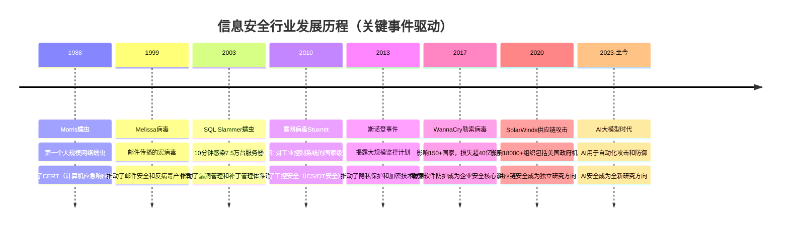
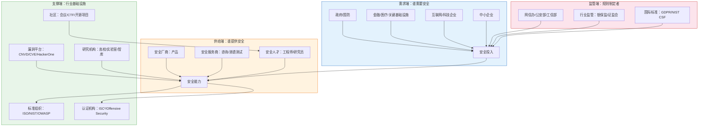
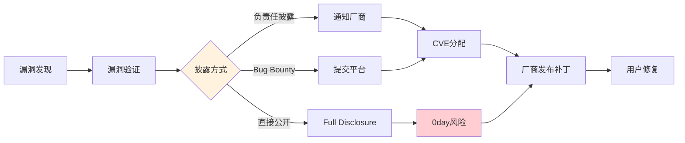
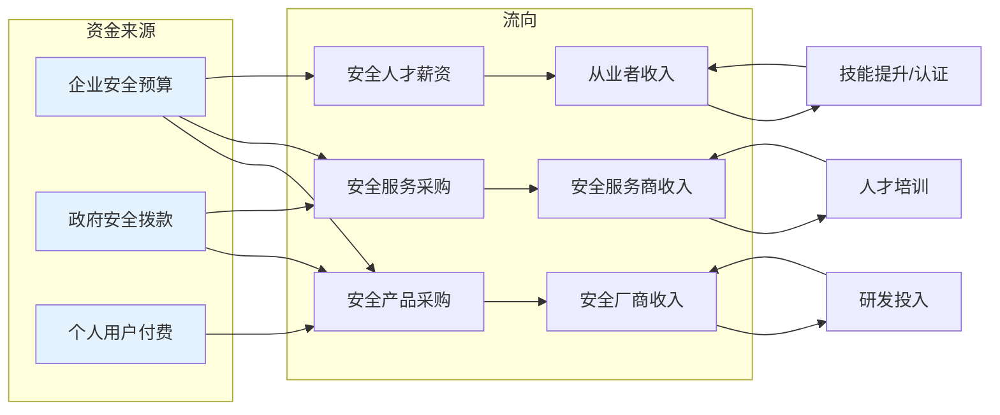
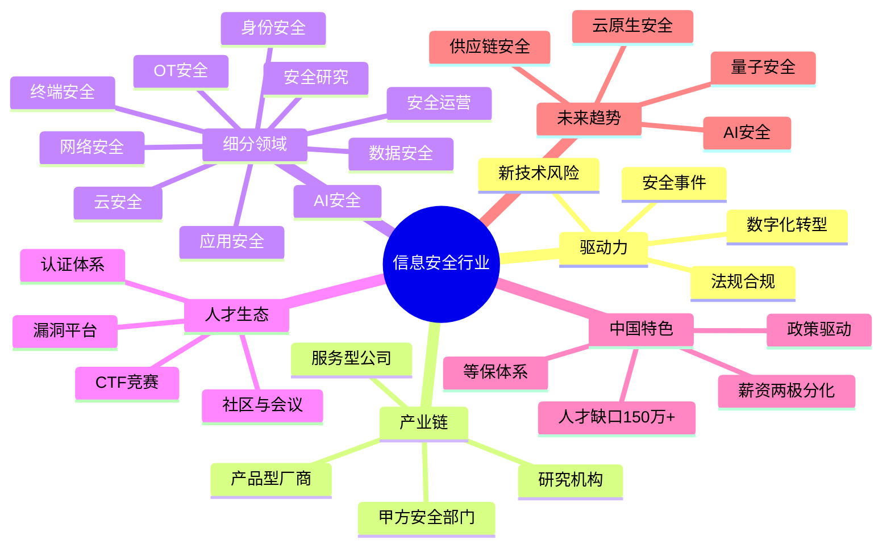

## 一、信息安全行业全景

信息安全行业不是孤立存在的技术领域——它是一个横跨技术、法律、商业、国家战略的复合型产业生态。要规划好自己的职业路径，首先要理解这个行业的**底层逻辑**：为什么它存在、如何运转、钱从哪里来、未来往哪里走。

### 1.1 行业存在的底层逻辑

信息安全行业的存在源于一个根本矛盾：**数字化带来的巨大价值与随之而来的风险之间的不对称**。

企业数字化创造了效率和利润，但每一次系统连接、每一个API暴露、每一份数据存储，都同时创造了被攻击的可能。安全行业本质上是在为这种风险**定价**——用技术手段将风险控制在业务可接受的范围内。

这个逻辑决定了安全行业的三个核心特征：

| 特征 | 表现 | 对从业者的启示 |
|------|------|---------------|
| **需求刚性** | 攻击不会消失，只会演化；法规合规是硬性要求 | 行业不会衰退，但技术方向会持续变化 |
| **被动驱动** | 多数安全投入由事件/法规驱动，而非主动预防 | 越来越强调"安全左移"和主动防御的价值 |
| **攻防不对称** | 攻击者只需找到一个突破口，防御者需要守住所有面 | 防御者需要系统性思维，攻击者需要创造性思维 |

理解这三个特征，你就能理解行业中很多看似矛盾的现象：为什么安全预算总是在大事件后才增加？为什么"预防"比"响应"更难卖？为什么红队（进攻）往往比蓝队（防御）更受关注？

### 1.2 行业发展历程与关键转折点

信息安全行业的演进不是线性的，而是由一系列**标志性安全事件**推动的跳跃式发展。每个重大事件都催生了新的安全细分方向和岗位需求。



#### 各阶段深度解析

**萌芽期（1970s-1990s）：从物理锁到逻辑锁**

这一阶段的核心特征是**安全等同于物理安全**。大型机时代，"黑客"需要物理接触设备才能实施攻击。安全措施主要是门禁、钥匙和简单的口令保护。

关键里程碑：
- 1972年，James Anderson发布《计算机安全技术规划研究》，首次系统性地提出计算机安全概念
- 1985年，美国国防部发布TCSEC（可信计算机系统评估准则，即"橘皮书"），建立了第一个安全评估标准
- 1988年，Morris蠕虫感染了当时互联网上约10%的计算机，直接催生了世界上第一个CERT（卡内基梅隆大学CERT/CC）

这一阶段**没有专职安全岗位**，安全工作由系统管理员兼任。但正是在这个阶段，安全的基本理论框架（访问控制、身份认证、最小权限原则）被建立起来。

**成长期（1990s-2000s）：安全产品化**

互联网的普及将安全从"物理问题"变成了"网络问题"。攻击者不再需要物理接触目标，任何联网设备都可能成为攻击对象。

这一阶段的关键发展：
- **安全产品产业形成**：防火墙（Check Point, 1993）、入侵检测系统（IDS）、防病毒软件（Norton, McAfee）成为标准配置
- **安全认证体系建立**：CISSP（1994年）、CEH等认证出现，安全开始成为正式职业
- **漏洞文化兴起**：Bugtraq邮件列表（1993年）成为漏洞披露的早期平台，CVE编号体系（1999年）建立
- **密码战争**：美国政府试图限制加密技术出口（PGP事件），最终以密码学自由运动胜利告终

中国在这一阶段的安全产业处于萌芽状态。1997年，公安部发布《计算机信息系统安全保护等级划分准则》（GB 17859-1999），标志着中国信息安全标准化的开始。

**发展期（2000s-2010s）：Web安全与合规驱动**

Web应用的爆发式增长带来了全新的攻击面。SQL注入、XSS、CSRF等Web漏洞成为最普遍的安全威胁。

关键发展：
- **Web安全成为核心方向**：OWASP（2001年成立）发布的Top 10成为Web安全的事实标准
- **安全事件产业化**：网络犯罪从个人行为变成有组织的产业链，暗网市场开始成型
- **合规驱动**：PCI DSS（2004年）、ISO 27001（2005年修订）等标准推动企业安全投入
- **国家级网络战**：2007年爱沙尼亚网络攻击、2010年Stuxnet事件标志着网络战从理论走向现实
- **中国《网络安全法》酝酿**：2007年开始起草，为后续立法奠定基础

这一阶段，安全从"技术问题"升级为"商业风险"和"国家安全"问题。专职安全岗位开始大量出现，安全团队从IT部门的附属变成独立组织。

**成熟与变革期（2010s-至今）：云原生安全与AI攻防**

这是安全行业变化最快的阶段，多个颠覆性趋势同时发生：

| 趋势 | 具体表现 | 催生的新岗位 |
|------|---------|------------|
| **云原生化** | 企业核心业务上云，容器/K8s成为标准 | 云安全工程师、容器安全专家 |
| **零信任架构** | 从"信任内网"到"永不信任，持续验证" | 零信任架构师、身份安全工程师 |
| **DevSecOps** | 安全融入开发流程，安全左移 | 安全开发工程师、SAST/DAST专家 |
| **勒索软件即服务** | 攻击产业化，RaaS模式降低攻击门槛 | 威胁情报分析师、应急响应专家 |
| **AI驱动安全** | AI用于威胁检测、漏洞发现、自动化响应 | AI安全研究员、ML安全工程师 |
| **供应链安全** | 开源依赖、第三方组件成为攻击入口 | 软件供应链安全工程师 |
| **数据安全法规** | GDPR、《数据安全法》、《个人信息保护法》 | 数据安全治理专家、隐私工程师 |

### 1.3 行业生态全景

信息安全行业不是单一的产业链，而是一个多层嵌套的**生态系统**。理解这个生态，才能找到自己在其中的位置。



#### 1.3.1 供给端详解：安全产业的商业模型

理解安全产业的商业模式，对职业选择至关重要——不同商业模式的公司，工作内容、成长路径、薪资结构差异很大。

**产品型公司（卖软件/硬件）**

商业逻辑：开发安全产品（防火墙、EDR、SIEM等），通过许可证或订阅模式销售。

| 类型 | 代表公司 | 产品形态 | 特点 |
|------|---------|---------|------|
| 网络安全设备 | Palo Alto、Fortinet、深信服 | 硬件+软件一体机 | 毛利率高，需要硬件供应链管理 |
| 终端安全 | CrowdStrike、SentinelOne、奇安信 | SaaS化EDR/XDR | 订阅模式，复购率高 |
| 应用安全 | Snyk、Checkmarx、长亭科技 | SAST/DAST工具 | 需要深入理解开发流程 |
| 数据安全 | Varonis、安恒信息 | DLP/数据库审计 | 与合规需求强绑定 |
| 安全管理平台 | Splunk、微步在线 | SIEM/SOAR | 数据量大，需要大数据能力 |

在产品型公司工作，你能接触到**大规模部署场景**，理解安全技术如何在真实环境中落地。研发岗位需要深厚的工程能力，产品经理需要理解安全业务场景。

**服务型公司（卖时间/专业能力）**

商业逻辑：通过安全专家的人力投入，为客户提供安全评估、咨询、运营服务。

| 服务类型 | 具体内容 | 代表机构 | 典型项目周期 |
|----------|---------|---------|------------|
| 渗透测试 | 模拟攻击发现漏洞 | 各安全服务商 | 1-4周 |
| 安全咨询 | 安全体系规划、合规咨询 | 四大安全部门、奇安信 | 1-6个月 |
| 应急响应 | 安全事件处置、取证分析 | CNCERT、安天 | 数天到数周 |
| 托管安全服务（MSSP） | 持续安全监控和运营 | 安恒、绿盟 | 长期合同 |
| 红队演练 | 全面模拟APT攻击 | 各安全服务商 | 2-8周 |

在服务型公司工作，你能**快速积累不同行业的安全经验**，接触多种技术栈和业务场景。但工作节奏通常较紧，出差频繁。

**平台型公司（甲方安全部门）**

商业逻辑：互联网/科技/金融企业的内部安全团队，保护自身业务安全。

| 公司类型 | 安全团队特点 | 优势 | 劣势 |
|----------|------------|------|------|
| 互联网大厂 | 规模大（数百人），分工细，技术栈前沿 | 薪资高，技术深度强 | 可能只专注单一业务场景 |
| 金融机构 | 合规驱动，流程严谨 | 稳定，合规经验丰富 | 技术创新相对保守 |
| 跨国企业 | 全球化视野，成熟的安全体系 | 国际化经验，work-life balance好 | 决策链长，本土化可能不足 |
| 创业公司 | 安全团队小（1-5人），一人多岗 | 能快速建立完整安全体系 | 资源有限，可能不被重视 |

#### 1.3.2 需求端详解：不同行业的安全投入差异

不同行业的安全投入差异巨大，这直接影响了相关岗位的需求量和薪资水平。

| 行业 | 安全投入占IT预算比例 | 主要驱动因素 | 安全团队规模（大型企业） | 典型安全重点 |
|------|-------------------|------------|---------------------|------------|
| 金融 | 10%-15% | 监管合规+资产保护 | 50-200人 | 数据安全、交易安全、反欺诈 |
| 互联网 | 8%-12% | 业务安全+数据保护 | 100-500人 | 应用安全、业务安全、红蓝对抗 |
| 政府/国防 | 8%-12% | 国家安全+等保合规 | 30-100人 | 等保合规、网络安全、数据安全 |
| 医疗 | 5%-8% | 患者隐私+合规 | 10-30人 | 数据安全、终端安全、合规 |
| 制造业 | 3%-6% | 工控安全+供应链安全 | 10-30人 | OT安全、供应链安全 |
| 教育 | 2%-5% | 等保合规 | 5-15人 | 网络安全、数据安全 |
| 零售 | 4%-7% | 支付安全+客户数据 | 10-30人 | 支付安全、数据安全、反欺诈 |

**对职业选择的启示**：金融和互联网行业的安全岗位薪资最高，但竞争也最激烈。制造业的OT安全是蓝海——人才稀缺，但需要工控领域的专业知识。医疗安全是增长最快的方向之一，受数字化医疗和隐私法规双重驱动。

#### 1.3.3 支撑端详解：行业基础设施

安全行业的"基础设施"往往被忽视，但它们是行业运转的底层支撑。

**标准组织与框架**

| 标准/框架 | 制定机构 | 适用范围 | 核心价值 |
|----------|---------|---------|---------|
| ISO 27001/27002 | ISO | 全球通用 | 信息安全管理体系认证标准 |
| NIST CSF | 美国NIST | 美国为主，全球参考 | 识别→保护→检测→响应→恢复五阶段框架 |
| MITRE ATT&CK | MITRE | 全球通用 | 攻击者战术和技术知识库，红蓝队通用语言 |
| OWASP Top 10 | OWASP | Web安全 | Web应用最关键安全风险清单 |
| 等保2.0 | 中国公安部 | 中国 | 网络安全等级保护制度 |
| CIS Controls | CIS | 全球通用 | 20项关键安全控制措施 |

**漏洞披露生态**

漏洞是安全行业的"原材料"。围绕漏洞发现、报告、修复形成了完整的生态链：



主要漏洞平台和数据库：

| 平台 | 类型 | 特点 | 对研究者的价值 |
|------|------|------|-------------|
| **HackerOne** | Bug Bounty | 全球最大，覆盖企业最多 | 赚取赏金，建立声誉 |
| **Bugcrowd** | Bug Bounty | 与HackerOne竞争 | 同上 |
| **CNVD/CNNVD** | 国家漏洞库 | 中国官方漏洞库 | 国内合规，可获CNVD编号 |
| **CVE/NVD** | 国际漏洞库 | 全球标准编号体系 | CVE编号是行业通用货币 |
| **Zero Day Initiative (ZDI)** | 漏洞收购 | Trend Micro旗下 | 高价收购高质量漏洞 |

**安全社区与会议**

社区是安全从业者获取信息、建立人脉、提升影响力的核心渠道：

| 会议/社区 | 地区 | 特点 | 适合阶段 |
|----------|------|------|---------|
| **Black Hat** | 全球（美国/欧洲/亚洲） | 最具影响力的安全会议 | 中高级研究者 |
| **DEF CON** | 美国拉斯维加斯 | 黑客文化盛会，CTF竞赛 | 所有阶段 |
| **HITB** | 亚洲 | 技术深度强 | 中高级 |
| **KCon** | 中国 | 国内高质量安全会议 | 初中级 |
| **补天/漏洞盒子** | 中国 | 国内Bug Bounty平台 | 初中级（可赚赏金） |
| **安全客/先知** | 中国 | 安全技术社区 | 所有阶段 |

### 1.4 中国市场特殊性

中国市场与全球安全市场存在显著差异，理解这些差异对在国内发展至关重要。

#### 1.4.1 政策驱动的中国特色

中国的安全行业有一个独特的特征：**强政策驱动**。与欧美市场以商业需求为主导不同，中国的安全投入在很大程度上受政策法规推动。

| 政策法规 | 发布时间 | 核心要求 | 对行业的影响 |
|----------|---------|---------|------------|
| 《网络安全法》 | 2017年6月 | 网络运营者安全保护义务 | 企业必须设立安全岗位，推动等保合规 |
| 《数据安全法》 | 2021年9月 | 数据分类分级、数据安全评估 | 数据安全岗位需求激增 |
| 《个人信息保护法》 | 2021年11月 | 个人信息处理规则、跨境传输限制 | 隐私保护工程师、DPO岗位出现 |
| 《关键信息基础设施安全保护条例》 | 2021年9月 | 关键基础设施运营者安全义务 | 关基行业安全投入大幅增加 |
| 等保2.0 | 2019年12月 | 五个安全保护等级 | 等保测评服务成为稳定市场 |

这些政策直接创造了大量安全岗位需求。以等保测评为例，全国有数百家等保测评机构，每家需要数十名持证测评师，仅此一个细分方向就创造了数万个就业岗位。

#### 1.4.2 中国安全产业格局

中国安全产业呈现"金字塔"结构：

```text
┌─────────────────────────────────────────────────┐
│            第一梯队：综合型安全巨头               │
│   奇安信、深信服、绿盟科技、安恒信息、天融信       │
│   特点：产品线全面，营收超50亿，员工数千人          │
├─────────────────────────────────────────────────┤
│            第二梯队：垂直领域龙头                 │
│   长亭科技（攻防）、微步在线（威胁情报）           │
│   美创科技（数据安全）、安天（终端/恶意代码）      │
│   特点：在细分领域技术领先，营收5-50亿             │
├─────────────────────────────────────────────────┤
│            第三梯队：创新型安全公司               │
│   数百家专注于细分技术方向的创业公司               │
│   如：默安科技（DevSecOps）、雾帜智能（SOAR）    │
│   特点：技术驱动，团队精干，营收<5亿              │
├─────────────────────────────────────────────────┤
│            第四梯队：安全服务/咨询公司            │
│   各地安全服务商、等保测评机构、安全咨询公司       │
│   特点：区域化强，人力密集，数量最多               │
└─────────────────────────────────────────────────┘
```

#### 1.4.3 国内安全人才市场特征

国内安全人才市场有几个显著特征：

**供需严重失衡**：据教育部和工信部数据，国内网络安全人才缺口超过150万，且每年以约20%速度扩大。ISC²报告显示，亚太地区（含中国）网络安全人才缺口约220万。

**薪资两极分化**：初级安全岗位（SOC分析师、安全运维）的薪资与普通IT岗位差距不大（8-15K/月），但高级岗位（安全架构师、红队负责人、安全总监）薪资远超同级别开发岗位（50-150K/月甚至更高）。这说明安全行业重视**深度**而非**广度**。

**地域集中度高**：安全岗位主要集中在北上广深杭，其中北京因政策中心和众多安全厂商总部所在地，占据了全国安全岗位的约30%。新一线城市（成都、武汉、西安、南京）因高校安全专业和地方安全产业基地的布局，正在快速崛起。

**学历门槛相对灵活**：与开发岗位类似，安全行业更看重**实际能力**而非学历。CTF获奖经历、CVE编号、开源项目贡献、Bug Bounty战绩，这些技术成果往往比学历更有说服力。但大型甲方（尤其是金融和政府相关）仍然有学历硬性要求。

### 1.5 行业价值链条与资金流向

理解"钱从哪里来，流向哪里"，能帮你判断哪些方向是长期有价值的。



**关键数据**：

| 指标 | 数据 | 来源 |
|------|------|------|
| 全球网络安全市场规模（2024年） | 约2,200亿美元 | Gartner/IDC |
| 中国市场规模（2024年） | 约800-1,000亿元人民币 | 中国信通院 |
| 年增长率 | 全球约12%，中国约15-20% | IDC |
| 企业安全预算占IT总预算比例 | 全球平均约9%-12% | Gartner |
| 全球安全人才缺口 | 约480万人 | ISC² 2024 |

这些数据传递了一个明确信号：安全行业的增长是**结构性的**，而非周期性的。数字化转型不会逆转，法规监管只会加强，攻击技术只会演化——这三个因素共同决定了安全人才的长期需求。

### 1.6 新兴方向与未来趋势

信息安全行业正在经历新一轮变革，以下方向值得重点关注：

#### 1.6.1 AI安全（AI Security）

AI安全包含两个维度：

**用AI增强安全**（AI for Security）：
- AI驱动的威胁检测：利用机器学习识别异常行为和未知威胁
- 自动化漏洞发现：AI辅助代码审计、Fuzzing测试
- 安全运营自动化：SOAR平台利用AI自动编排响应流程
- 恶意软件分析：AI模型自动分类和分析恶意代码

**保护AI系统安全**（Security for AI）：
- 对抗样本攻击：通过微小扰动欺骗AI模型
- 数据投毒：在训练数据中注入恶意样本
- 模型窃取：通过API查询逆向模型参数
- 提示注入（Prompt Injection）：针对大语言模型的新型攻击
- AI供应链安全：开源模型的后门和漏洞

这个方向的特殊之处在于：它需要同时具备安全和AI两个领域的知识，交叉人才极其稀缺。

#### 1.6.2 云原生安全（Cloud-Native Security）

随着Kubernetes成为企业部署标准，云原生安全成为必选项：

| 安全层面 | 具体技术 | 核心挑战 |
|----------|---------|---------|
| 容器安全 | 镜像扫描、运行时保护、镜像签名 | 容器逃逸、镜像漏洞 |
| 编排安全 | K8s RBAC、网络策略、Pod安全策略 | 集群配置错误、权限过大 |
| 微服务安全 | 服务网格（Istio）、mTLS | 服务间信任、API安全 |
| 供应链安全 | SBOM、SLSA框架、签名验证 | 依赖漏洞、构建过程篡改 |
| Serverless安全 | 函数安全、冷启动风险 | 权限配置、事件注入 |

#### 1.6.3 量子安全（Quantum Security）

量子计算对现有密码体系的威胁是真实存在的，只是时间问题：

- **威胁**：Shor算法能在多项式时间内分解大整数，直接威胁RSA和ECC
- **时间线**：业界普遍认为，具有密码学意义的量子计算机可能在2030-2040年间出现
- **应对**：NIST已于2024年发布首批后量子密码标准（CRYSTALS-Kyber、CRYSTALS-Dilithium等）
- **"先收集后解密"攻击**：攻击者现在收集加密数据，等量子计算成熟后再解密——这意味着敏感数据**现在就需要**考虑量子安全

这个方向目前岗位不多，但随着量子计算的发展，相关人才需求将快速增长。

#### 1.6.4 OT/IoT安全（运营技术安全）

IT与OT的融合带来了新的安全挑战：

| 领域 | 典型系统 | 安全挑战 | 人才状态 |
|------|---------|---------|---------|
| 工控安全 | SCADA、DCS、PLC | 协议老旧、难以打补丁、可用性优先 | 极度稀缺 |
| 车联网安全 | V2X通信、车载系统 | 实时性要求高、功能安全与信息安全冲突 | 稀缺 |
| 医疗设备安全 | 医疗IoT设备 | FDA合规、患者安全优先 | 稀缺 |
| 智慧城市安全 | 传感器网络、智能交通 | 大规模部署、物理世界影响 | 新兴 |

### 1.7 行业全景总结：一张图看清全局

将以上内容综合起来，信息安全行业全景可以用以下框架概括：



**给不同阶段读者的行动建议**：

| 你当前的状态 | 最应该关注的内容 | 下一步行动 |
|------------|----------------|----------|
| **零基础，想了解行业** | 1.2发展历程、1.3生态全景、1.6新兴方向 | 阅读下一节"主要职业方向详解"，选择感兴趣的方向 |
| **有IT背景，考虑转型** | 1.3.1商业模式、1.4中国市场、1.5资金流向 | 评估自己的技能与目标方向的匹配度 |
| **已入行1-3年** | 1.3.2行业差异、1.6新兴方向 | 关注新兴方向，提前布局技能储备 |
| **资深从业者** | 1.5价值链条、1.6.1 AI安全 | 思考如何在AI安全等新兴方向建立先发优势 |

本节提供了行业的宏观视角。接下来的章节将逐一拆解每个职业方向的具体要求，帮你在全景图中找到自己的坐标，然后绘制属于自己的发展路线。
