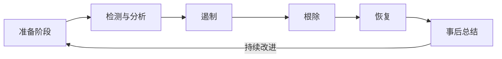
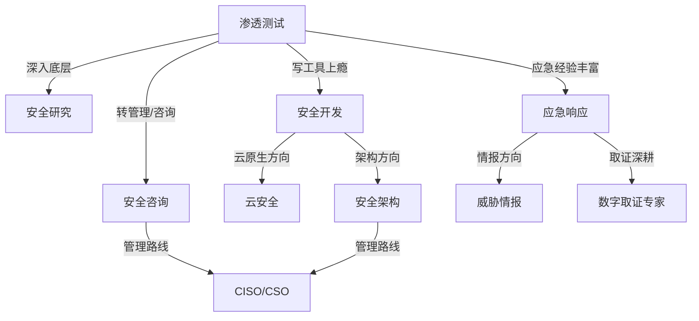

## 二、主要职业方向详解

网络安全行业经过数十年发展，已经从"会装杀毒软件就能干"的草莽时代，演变为高度专业化的多方向职业体系。不同方向对技术栈、思维方式、性格特质的要求截然不同。选错方向不仅浪费时间，更可能导致职业倦怠。本节将逐一拆解主流方向的**真实工作内容、核心技能树、典型一天、薪资行情和发展天花板**，帮助你找到最匹配自己的赛道。

### 2.1 渗透测试工程师（Penetration Tester）

#### 2.1.1 岗位本质

渗透测试工程师的核心价值是**以攻击者视角验证防御体系的有效性**。不同于电影中"键盘敲几下就入侵系统"的刻板印象，真实的渗透测试是一项高度结构化、受法律和范围约束的专业服务。

渗透测试分为三个层次：

| 层次 | 名称 | 知情范围 | 测试深度 | 典型场景 |
|------|------|----------|----------|----------|
| 白盒 | 代码审计/全知测试 | 完全了解目标架构、源码、配置 | 最深入，覆盖率最高 | 上线前安全验收 |
| 灰盒 | 有限信息测试 | 部分信息（如普通用户账号） | 模拟内部威胁或已入侵场景 | 企业内部定期评估 |
| 黑盒 | 零知识测试 | 仅知道目标域名或IP | 最接近真实攻击者视角 | 外部渗透测试 |

#### 2.1.2 真实工作内容

渗透测试不是"随便扫一下就完事"。一个完整的渗透测试项目通常包括以下阶段：

**阶段一：前期沟通与范围确认（1-3天）**
- 与客户签署渗透测试授权协议（SOW），明确测试范围、时间窗口、禁止操作项
- 确认测试类型：Web应用、内网、移动端、API、云环境、物理安全等
- 获取测试凭据（灰盒/白盒场景）、IP白名单、VPN接入方式
- 制定应急预案：如果测试导致业务中断，如何第一时间恢复

**阶段二：信息收集与资产梳理（2-5天）**
- 子域名枚举：使用 Subfinder、Amass、OneForAll 收集子域名
- 端口扫描：Nmap/Masscan 识别开放服务
- 技术指纹识别：Wappalyzer、WhatWeb 确定框架和中间件版本
- 目录爆破：Gobuster、Ffuf 发现隐藏路径
- 信息泄露检查：GitHub 代码泄露、.git/.svn 暴露、敏感文件备份

**阶段三：漏洞发现与利用（3-10天）**
- Web漏洞：SQL注入、XSS、SSRF、文件上传、反序列化、逻辑漏洞
- 内网漏洞：MS17-010、Zerologon、PetitPotam、AD域渗透
- 权限提升：Linux 内核提权、Windows Token Impersonation、SUID 滥用
- 横向移动：Pass-the-Hash、Kerberoasting、DCSync

**阶段四：报告撰写与汇报（2-3天）**
- 技术报告：漏洞详情、复现步骤、风险评级（CVSS评分）、修复建议
- 管理层报告：风险概览、业务影响分析、优先修复清单
- 现场汇报：向技术团队讲解漏洞原理，向管理层说明业务风险

#### 2.1.3 核心技能树

```text
渗透测试工程师技能树
├── 基础层
│   ├── 计算机网络（TCP/IP、HTTP、DNS、ARP）
│   ├── 操作系统（Linux系统管理、Windows域环境）
│   ├── 编程能力（Python/Go脚本编写、Bash自动化）
│   └── 数据库（SQL语法、NoSQL注入原理）
├── 工具层
│   ├── 信息收集：Nmap、Subfinder、Amass、Shodan、FOFA
│   ├── Web测试：Burp Suite、SQLMap、Nuclei、Xray
│   ├── 内网渗透：Cobalt Strike、Impacket、BloodHound
│   ├── 密码攻击：Hashcat、John the Ripper、Hydra
│   └── 社会工程：GoPhish、Evilginx2
├── 进阶层
│   ├── 代码审计（PHP/Java/Go/Audit）
│   ├── 漏洞开发（缓冲区溢出、ROP链构造）
│   ├── 免杀技术（Shellcode编码、AMSI绕过、EDR对抗）
│   └── 云安全（AWS/Azure/GCP渗透测试方法论）
└── 软实力
    ├── 技术报告撰写能力
    ├── 客户沟通与期望管理
    ├── 项目时间管理
    └── 法律合规意识（《网络安全法》、授权边界）
```

#### 2.1.4 典型一天

| 时间 | 活动 |
|------|------|
| 09:00 | 查看昨天自动化扫描结果，标记可疑目标 |
| 09:30 | 分析 Nuclei 扫描报告，逐一验证高危漏洞 |
| 10:30 | 发现一个疑似SQL注入点，构造Payload手动测试 |
| 12:00 | 午餐 |
| 13:00 | SQL注入确认，尝试获取数据库权限，dump关键数据 |
| 15:00 | 内网横向移动，利用获取的凭据尝试访问其他系统 |
| 17:00 | 整理当天发现，更新测试日志，同步团队进展 |
| 18:00 | 下班前回顾测试范围覆盖率，规划明天重点 |

#### 2.1.5 薪资行情与认证加持

| 级别 | 经验 | 月薪范围（一线城市） | 典型认证 |
|------|------|---------------------|----------|
| 初级 | 0-2年 | 10-20K | CISP-PTE、OSCP |
| 中级 | 2-5年 | 20-40K | OSCP、GPEN、CEH |
| 高级 | 5-8年 | 40-70K | OSEP、GXPN、CISSP |
| 专家/管理 | 8年+ | 70-120K+ | CISSP、CISM、管理经验 |

> **关键数据**：根据2025年安全行业薪酬报告，持有OSCP认证的渗透测试人员平均薪资比无认证者高出35%-50%。OSCP是渗透测试领域的"黄金敲门砖"。

#### 2.1.6 入行建议

- **入门路径**：CTF比赛 → 漏洞赏金平台（HackerOne、补天）→ 实习 → 初级岗位
- **必做练习**：HackTheBox、TryHackMe、VulnHub 靶机至少完成50台
- **关键转折**：从"工具使用者"转变为"原理理解者"——能手写SQL注入Payload而不是只会跑SQLMap

---

### 2.2 安全研究员（Security Researcher）

#### 2.2.1 岗位本质

安全研究员是网络安全领域的"科学家"。他们的工作不是测试已有系统的安全性，而是**发现新的攻击面、研究未知漏洞、推动安全技术的前沿**。如果说渗透测试工程师是"应用科学家"，安全研究员就是"基础科学家"。

安全研究员的产出直接影响整个行业：一个高危0day的发现可能影响数百万设备，一篇高质量研究报告可能改变整个领域的防御思路。

#### 2.2.2 研究方向细分

安全研究并非一个单一方向，内部有明确的细分：

| 细分方向 | 研究对象 | 典型产出 | 代表机构 |
|----------|----------|----------|----------|
| 二进制安全 | 操作系统内核、驱动、固件 | CVE漏洞、Exploit PoC | 华为安全实验室、360高级威胁研究院 |
| Web安全研究 | Web框架、CMS、中间件 | 0day漏洞、攻击链研究 | 长亭科技、安恒信息 |
| 移动安全 | Android/iOS系统和应用 | 漏洞利用链、Root方案 | 腾讯玄武实验室、阿里安全 |
| IoT安全 | 路由器、摄像头、工业控制设备 | 固件漏洞、协议攻击 | 绿盟科技、启明星辰 |
| 密码学研究 | 加密算法、协议实现 | 算法攻击、侧信道分析 | 学术机构为主 |
| AI安全 | 机器学习模型、大语言模型 | 对抗样本、Prompt注入 | 各大厂AI安全团队 |

#### 2.2.3 核心技能树

安全研究员的技术深度远超其他方向。以下是必备技能：

**底层基础（必须精通）**
- C/C++语言：能阅读和修改内核代码，理解内存管理机制
- 汇编语言（x86/x64/ARM）：能阅读反汇编代码，理解调用约定
- 操作系统原理：进程管理、内存管理、文件系统、系统调用
- 计算机体系结构：CPU流水线、缓存机制、中断处理

**逆向工程（核心技能）**
- 静态分析：IDA Pro、Ghidra、Binary Ninja，能还原高级语言逻辑
- 动态调试：WinDbg、GDB、x64dbg，能跟踪复杂执行流
- 混淆与脱壳：UPX、VMProtect、Themida，能处理加壳保护的程序
- 协议逆向：Wireshark + 自定义脚本，能还原私有协议格式

**漏洞挖掘方法论**
- Fuzzing（模糊测试）：使用 AFL++、LibFuzzer、WinAFL 自动生成测试用例
- 静态代码审计：使用 CodeQL、Semgrep、Fortify 进行自动化代码扫描
- 补丁对比（Patch Diffing）：对比漏洞修复前后的二进制差异，定位漏洞根因
- 污点分析：跟踪数据从输入到危险函数的完整传播路径

**漏洞利用开发**
- 栈溢出利用：ROP链构造、Stack Pivot、ret2libc
- 堆利用：House of系列技术（House of Force/Spirit/Einherjar等）
- 类型混淆：C++虚表劫持、JIT Spray
- 内核利用：Token窃取、内核栈溢出、Use-After-Free
- 沙箱逃逸：浏览器沙箱、容器逃逸、虚拟机逃逸

#### 2.2.4 典型研究案例

**案例：Windows内核提权漏洞研究**

```text
研究流程：
1. 选择攻击面 → Windows内核驱动（Win32k、AFD、NDProxy等）
2. Fuzzing → 使用 IOCTL Fuzzer 发送随机IOCTL请求
3. 发现崩溃 → 收集BSOD Crash Dump，定位崩溃点
4. 分析根因 → WinDbg分析崩溃上下文，确认是UAF/越界/整数溢出
5. 构造PoC → 编写稳定触发漏洞的PoC代码
6. 开发Exploit → 构造堆喷射布局，劫持控制流，执行提权Shellcode
7. 撰写报告 → 详细的技术分析报告 + CVE申请
8. 负责任披露 → 通知厂商（MSRC），等待修复后公开
```

#### 2.2.5 薪资与发展

| 级别 | 经验 | 月薪范围（一线城市） |
|------|------|---------------------|
| 研究助理 | 0-2年 | 15-25K |
| 研究员 | 2-5年 | 30-50K |
| 高级研究员 | 5-8年 | 50-80K |
| 首席研究员 | 8年+ | 80-150K+ |

> **行业真相**：顶级安全研究员的收入远不止工资。Pwn2Own冠军奖金可达数十万美元，Google Project Zero等顶级团队的股权激励可达百万级别。国内头部安全实验室的资深研究员年薪普遍在80-200万之间。

#### 2.2.6 与其他方向的对比

| 维度 | 渗透测试工程师 | 安全研究员 |
|------|---------------|-----------|
| 工作目标 | 发现已知漏洞 | 发现未知漏洞 |
| 技术深度 | 广而实用 | 深而前沿 |
| 成果形式 | 测试报告 | CVE、论文、工具 |
| 工作节奏 | 项目驱动，节奏快 | 研究驱动，节奏慢 |
| 入门门槛 | 中等 | 高 |
| 天花板 | 安全总监/创业 | 首席科学家/CTO |

---

### 2.3 安全开发工程师（Security Developer / DevSecOps）

#### 2.3.1 岗位本质

安全开发工程师是"会写代码的安全人"或"懂安全的开发者"。他们的核心使命有三个：

1. **开发安全工具和产品**：WAF、SIEM、漏洞扫描器、EDR等安全产品的核心开发
2. **将安全融入开发流程**：在CI/CD管道中嵌入安全检测（SAST/DAST/SCA/IAST）
3. **建设安全基础设施**：密钥管理、证书管理、认证授权框架、安全审计系统

这个方向是近年来增长最快的网络安全细分领域。随着DevSecOps理念的普及，企业对"既能写代码又懂安全"的复合型人才需求激增。

#### 2.3.2 核心技能树

```text
安全开发工程师技能树
├── 编程语言（至少精通2门）
│   ├── Go：云原生安全工具首选（Kubernetes生态）
│   ├── Python：快速原型、安全脚本、数据分析
│   ├── Java：企业级安全产品后端
│   ├── Rust：高性能安全工具新宠
│   └── C/C++：底层安全组件、Agent开发
├── 安全工具开发
│   ├── 扫描器开发：端口扫描、Web漏洞扫描、合规检查
│   ├── 流量分析：DPI、协议解析、威胁检测引擎
│   ├── WAF/RASP：规则引擎、语义分析、运行时防护
│   └── SIEM/SOAR：日志采集、关联分析、自动化响应
├── DevSecOps实践
│   ├── SAST：SonarQube、Semgrep、CodeQL集成
│   ├── DAST：OWASP ZAP、Burp Suite API集成
│   ├── SCA：Dependabot、Snyk、OWASP Dependency-Check
│   ├── IAST：运行时插桩、污点跟踪
│   └── Secret Detection：GitLeaks、TruffleHog、密钥轮转
├── 基础设施安全
│   ├── 容器安全：镜像扫描、运行时保护、网络策略
│   ├── 云安全：IAM策略审计、CSPM、CWPP
│   ├── 密钥管理：HashiCorp Vault、AWS KMS
│   └── 零信任架构：mTLS、SPIFFE/SPIRE、策略引擎
└── 软工程能力
    ├── 系统设计：高并发、高可用安全系统架构
    ├── 代码质量：代码审查、单元测试、集成测试
    ├── CI/CD：GitHub Actions、GitLab CI、Jenkins
    └── 文档能力：API文档、架构设计文档、运维手册
```

#### 2.3.3 典型项目案例

**案例：企业内部SAST平台建设**

```text
需求背景：公司300+微服务，需要在CI/CD管道中自动进行代码安全检查

技术选型：
- 语言：Go（核心引擎）+ React（前端）
- SAST引擎：Semgrep（自定义规则）+ CodeQL（深度分析）
- 集成方式：GitHub App + Webhook
- 存储：PostgreSQL（扫描结果）+ Redis（任务队列）
- 部署：Kubernetes + Helm

核心功能：
1. 代码提交自动触发扫描（增量扫描，只检查变更文件）
2. 自定义规则管理（支持公司特有的安全规范）
3. 漏洞误报管理（标记误报，AI辅助去重）
4. 安全仪表盘（漏洞趋势、修复率、部门对比）
5. 与Jira联动（自动创建安全缺陷单）

关键指标：
- 扫描速度：<5分钟/10万行代码
- 误报率：<15%（通过规则调优和AI过滤）
- 漏洞修复率：从30%提升至85%（6个月内）
```

#### 2.3.4 薪资行情

| 级别 | 经验 | 月薪范围（一线城市） |
|------|------|---------------------|
| 初级 | 0-2年 | 15-25K |
| 中级 | 2-5年 | 25-45K |
| 高级 | 5-8年 | 45-70K |
| 技术专家/架构师 | 8年+ | 70-120K+ |

> **趋势**：安全开发是目前薪资增长最快的安全方向之一。具备Kubernetes安全、云原生安全开发能力的工程师，薪资普遍比传统安全开发高出20%-30%。

---

### 2.4 应急响应工程师（Incident Response / DFIR）

#### 2.4.1 岗位本质

应急响应工程师是网络安全的"消防员"。当企业遭遇安全事件——数据泄露、勒索攻击、APT入侵、内部威胁——他们第一时间介入，**控制损害、根除威胁、恢复业务、溯源归因**。

DFIR（Digital Forensics and Incident Response）是这个方向的标准称呼，涵盖两个子领域：
- **数字取证（DF）**：从硬盘、内存、网络流量中提取和分析电子证据
- **应急响应（IR）**：快速遏制、根除威胁、恢复业务

#### 2.4.2 应急响应生命周期



**阶段一：准备（常态化工作）**
- 建立应急响应预案和流程（Runbook/SOP）
- 部署和维护安全监控体系（SIEM、EDR、NDR）
- 定期进行应急演练（桌面推演、红蓝对抗）
- 建立应急响应工具箱（取证工具包、离线分析环境）

**阶段二：检测与分析（争分夺秒）**
- 告警研判：区分误报和真实威胁，判断事件严重等级
- 攻击溯源：从告警点向两端扩展——攻击入口在哪里？影响范围有多大？
- 证据保全：内存镜像、磁盘镜像、日志快照、网络流量捕获
- 时间线构建：还原攻击者的完整行为链

**阶段三：遏制（止损优先）**
- 短期遏制：隔离受感染主机、封锁恶意IP、禁用被窃凭据
- 长期遏制：修补漏洞入口、重置密码、加固网络分段
- 关键原则：**遏制措施不能破坏取证证据**

**阶段四：根除（清除后门）**
- 清除恶意软件和后门程序
- 修补被利用的漏洞
- 验证所有持久化机制已被清除（计划任务、启动项、WMI订阅等）

**阶段五：恢复**
- 从干净备份恢复系统
- 逐步恢复业务，密切监控是否复发
- 确认攻击者无法通过原有路径再次入侵

**阶段六：事后总结**
- 编写事件报告（时间线、影响范围、根因分析、改进建议）
- 更新防御策略和检测规则
- 归档取证资料（可能用于法律诉讼）

#### 2.4.3 核心技能树

**取证分析技能**
- 磁盘取证：Autopsy、FTK、EnCase，能从磁盘镜像中提取文件、恢复删除数据
- 内存取证：Volatility3、Rekall，能从内存转储中提取进程、网络连接、注入代码
- 网络取证：Wireshark、Zeek、NetworkMiner，能分析PCAP还原攻击流量
- 日志分析：ELK Stack、Splunk、Graylog，能从海量日志中定位攻击痕迹
- 移动取证：Cellebrite、Magnet AXIOM（特定场景）

**恶意软件分析**
- 静态分析：PEiD、Detect It Easy、Strings，识别文件类型和可疑字符串
- 动态分析：Cuckoo Sandbox、Any.Run，在沙箱中观察恶意软件行为
- 行为分析：Process Monitor、Procmon、API Monitor，监控系统调用序列

**平台知识**
- Windows：注册表、事件日志（Event Log）、WMI、PowerShell日志、Prefetch
- Linux：/var/log、auditd、sysdig、/proc文件系统
- 云环境：CloudTrail、Azure Activity Log、GCP Audit Log

#### 2.4.4 典型应急场景

**场景：勒索软件应急响应**

```text
时间线：
Day 0 08:00 — 监控告警：大量文件被异常重命名
Day 0 08:15 — 确认勒索攻击，启动应急响应流程
Day 0 08:30 — 隔离受感染网段（网络层切断）
Day 0 09:00 — 内存取证：提取勒索进程、加密密钥（如果有）
Day 0 10:00 — 确定攻击入口：VPN凭据泄露（暗网购买）
Day 0 14:00 — 影响评估：47台服务器被加密，含1台数据库服务器
Day 0 16:00 — 溯源：攻击者通过VPN进入 → 横向移动 → 部署勒索软件
Day 1        — 决策：是否支付赎金？（通常建议不支付）
Day 1-3      — 从离线备份恢复关键系统
Day 3-5      — 全网凭据重置、VPN安全加固、EDR全面部署
Day 7        — 撰写事件报告，提交监管机构（如适用）
Day 14       — 事后复盘，更新应急响应预案
```

#### 2.4.5 薪资行情

| 级别 | 经验 | 月薪范围（一线城市） |
|------|------|---------------------|
| 初级 | 0-2年 | 10-20K |
| 中级 | 2-5年 | 20-35K |
| 高级 | 5-8年 | 35-60K |
| SOC负责人/总监 | 8年+ | 60-100K+ |

---

### 2.5 安全咨询顾问（Security Consultant）

#### 2.5.1 岗位本质

安全咨询顾问是"安全翻译官"——他们需要把复杂的安全技术翻译成商业语言，帮助客户理解风险、制定策略、满足合规。这个方向对**沟通能力、商业嗅觉和知识广度**的要求远高于技术深度。

安全咨询主要分为两大类：
- **技术咨询**：安全评估、渗透测试管理、安全架构评审
- **管理咨询**：安全治理体系设计、合规咨询、安全战略规划

#### 2.5.2 核心能力模型

| 能力维度 | 具体要求 | 权重 |
|----------|----------|------|
| 技术知识 | 了解各安全领域的基本原理，能与技术团队对话 | 30% |
| 合规标准 | 精通ISO 27001、等保2.0、PCI DSS、GDPR等 | 25% |
| 沟通表达 | 方案汇报、PPT呈现、非技术受众讲解能力 | 25% |
| 项目管理 | 多项目并行管理、进度控制、资源协调 | 10% |
| 商业意识 | 理解客户业务、把握销售机会、控制项目成本 | 10% |

#### 2.5.3 典型咨询项目

**项目一：等保2.0合规咨询**
```text
项目周期：2-3个月
服务内容：
1. 差距分析：对比客户现状与等保要求，输出差距报告
2. 整改方案：制定技术整改和管理整改方案
3. 落地辅导：协助客户实施整改（技术方案、制度文档）
4. 测评配合：配合测评机构进行等级测评
5. 持续改进：测评后的安全运营建议

输出物：
- 差距分析报告
- 安全整改方案
- 安全管理制度文档（20+份）
- 测评配合材料
```

**项目二：企业安全评估**
```text
项目周期：4-6周
服务内容：
1. 资产梳理：识别关键信息资产和业务系统
2. 威胁建模：基于业务场景分析潜在威胁
3. 技术评估：渗透测试、配置审计、代码审查
4. 管理评估：安全制度、人员管理、物理安全
5. 风险评级：量化风险等级，输出风险矩阵
6. 改进路线图：分阶段的改进计划和投资建议
```

#### 2.5.4 薪资行情

| 级别 | 经验 | 月薪范围（一线城市） |
|------|------|---------------------|
| 初级顾问 | 0-2年 | 12-20K |
| 中级顾问 | 2-5年 | 20-35K |
| 高级顾问/项目经理 | 5-8年 | 35-60K |
| 首席顾问/咨询总监 | 8年+ | 60-100K+ |

> **独特优势**：安全咨询是通往管理层最快的路径之一。大量CSO/CISO出身于安全咨询背景，因为这个方向天然锻炼商业思维和管理能力。

---

### 2.6 威胁情报分析师（Threat Intelligence Analyst）

#### 2.6.1 岗位本质

威胁情报分析师的工作是**在攻击发生之前了解攻击者**。他们跟踪威胁组织、分析攻击手法、监控暗网动态，将碎片化的威胁信息转化为可操作的情报，为企业的防御决策提供依据。

情报分析遵循情报金字塔模型：

```text
          ┌──────────┐
          │  Wisdom  │  ← 智慧（战略决策支持）
          ├──────────┤
          │ Knowledge│  ← 知识（威胁组织画像、攻击模式）
          ├──────────┤
          │Information│ ← 信息（IoC关联、攻击链还原）
          ├──────────┤
          │   Data   │  ← 数据（IP、域名、Hash、日志）
          └──────────┘
```

#### 2.6.2 情报来源与方法

**开源情报（OSINT）**
- 暗网市场和论坛：监控数据泄露、漏洞交易、攻击服务
- 社交媒体：Twitter/X、Telegram群组、黑客社区
- 技术博客和安全公告：CVE、厂商安全公告、安全研究报告
- 公开数据集：Abuse.ch、VirusTotal、AlienVault OTX

**商业情报**
- 威胁情报平台（TIP）：Recorded Future、Mandiant Advantage、微步在线
- 暗网监控服务：SpyCloud、Digital Shadows
- 漏洞情报：Vulners、NVD、CNVD

**内部情报**
- SIEM告警分析：从内部安全事件中提取IoC
- 蜜罐/蜜网：主动诱捕攻击者，收集攻击TTP
- 安全事件复盘：从历史事件中提取威胁模式

#### 2.6.3 核心技能

- **分析框架**：MITRE ATT&CK、Diamond Model、Kill Chain、TIBER-EU
- **IoC管理**：STIX/TAXII标准、MISP平台、情报共享社区
- **数据挖掘**：Python数据分析、图数据库（Neo4j）关联分析
- **外语能力**：俄语、中文（繁体）、韩语在威胁情报领域有极高价值
- **报告撰写**：将技术发现转化为管理层可理解的情报简报

#### 2.6.4 薪资行情

| 级别 | 经验 | 月薪范围（一线城市） |
|------|------|---------------------|
| 初级分析师 | 0-2年 | 10-18K |
| 中级分析师 | 2-5年 | 18-30K |
| 高级分析师 | 5-8年 | 30-50K |
| 情报主管 | 8年+ | 50-80K+ |

---

### 2.7 安全架构师（Security Architect）

#### 2.7.1 岗位本质

安全架构师是网络安全领域的"总设计师"。他们不直接操作工具或写代码，而是**从全局视角设计企业的安全防护体系**，确保安全能力与业务目标对齐。

安全架构师是所有安全方向的"交汇点"——需要理解渗透测试的攻击方法、安全开发的技术实现、应急响应的运营需求、合规咨询的标准要求，然后将它们整合成一个统一的安全架构。

#### 2.7.2 架构设计方法论

**零信任架构（Zero Trust Architecture）**
```text
核心原则：永不信任，始终验证

实施层次：
├── 身份层：多因素认证、持续认证、最小权限
├── 设备层：设备合规检查、端点检测与响应
├── 网络层：微分段、加密通信、软件定义边界
├── 应用层：API安全网关、运行时保护
└── 数据层：数据分类分级、加密、DLP
```

**安全架构框架**
- SABSA（Sherwood Applied Business Security Architecture）
- TOGAF安全扩展
- NIST网络安全框架（CSF 2.0）
- 云安全联盟（CSA）云控制矩阵

#### 2.7.3 薪资行情

| 级别 | 经验 | 月薪范围（一线城市） |
|------|------|---------------------|
| 安全架构师 | 5-8年 | 40-70K |
| 首席安全架构师 | 8-12年 | 70-120K |
| CISO/CSO | 12年+ | 100-200K+ |

---

### 2.8 云安全工程师（Cloud Security Engineer）

#### 2.8.1 岗位本质

随着企业上云成为不可逆转的趋势，云安全工程师成为需求增长最迅猛的安全岗位之一。他们的核心任务是**确保云环境中的资产、数据和工作负载的安全**。

云安全与传统网络安全有本质区别——传统安全依赖边界防护（防火墙、IDS），而云安全的核心是**身份即边界（Identity is the New Perimeter）**。

#### 2.8.2 主流云安全认证

| 认证 | 发证机构 | 适用场景 | 难度 |
|------|----------|----------|------|
| AWS Security Specialty | Amazon | AWS环境安全 | ★★★★ |
| AZ-500 | Microsoft | Azure安全 | ★★★ |
| Google Professional Cloud Security Engineer | Google | GCP安全 | ★★★★ |
| CCSP | (ISC)² | 通用云安全 | ★★★★ |
| CCSK | CSA | 云安全基础知识 | ★★ |

#### 2.8.3 薪资行情

| 级别 | 经验 | 月薪范围（一线城市） |
|------|------|---------------------|
| 初级 | 0-2年 | 15-25K |
| 中级 | 2-5年 | 25-45K |
| 高级 | 5-8年 | 45-75K |
| 云安全架构师 | 8年+ | 75-130K+ |

---

### 2.9 方向选择决策矩阵

选择职业方向不能只看薪资，还要考虑个人特质、技术兴趣和长期发展。以下是综合评估：

| 方向 | 技术深度 | 技术广度 | 沟通要求 | 入门门槛 | 薪资天花板 | 压力指数 | 适合特质 |
|------|----------|----------|----------|----------|-----------|----------|----------|
| 渗透测试 | ★★★ | ★★★★ | ★★★ | 中 | 高 | ★★★★ | 好奇心强、喜欢挑战 |
| 安全研究 | ★★★★★ | ★★ | ★★ | 高 | 极高 | ★★★ | 极客精神、耐心 |
| 安全开发 | ★★★★ | ★★★ | ★★★ | 中高 | 高 | ★★★ | 工程思维、代码能力 |
| 应急响应 | ★★★★ | ★★★ | ★★★ | 中 | 中高 | ★★★★★ | 抗压能力强、反应快 |
| 安全咨询 | ★★ | ★★★★★ | ★★★★★ | 中低 | 高 | ★★★ | 表达能力强、商业头脑 |
| 威胁情报 | ★★★ | ★★★★ | ★★★★ | 中 | 中 | ★★ | 信息敏感度高、分析能力 |
| 安全架构 | ★★★★ | ★★★★★ | ★★★★ | 高 | 极高 | ★★★ | 全局视野、系统思维 |
| 云安全 | ★★★★ | ★★★ | ★★★ | 中高 | 高 | ★★★ | 云原生兴趣、学习能力 |

#### 2.9.1 转行路径参考

不同方向之间并非完全割裂，以下是常见的转型路径：



#### 2.9.2 给初学者的建议

1. **不要一上来就选方向**。前1-2年广泛涉猎，通过CTF、靶场、漏洞赏金发现自己真正感兴趣的方向
2. **渗透测试是最佳起点**。它覆盖面最广、资源最丰富、反馈最即时，适合作为第一个方向深入
3. **编程能力是底座**。无论选哪个方向，Python和至少一门编译型语言（Go/Rust/C）都是必备技能
4. **认证是敲门砖，不是天花板**。OSCP/CISP-PTE等认证能帮你拿到面试机会，但能否胜任靠的是实战能力
5. **建立个人技术品牌**。写博客、做开源工具、参加安全会议演讲，这些比简历上的文字更有说服力
