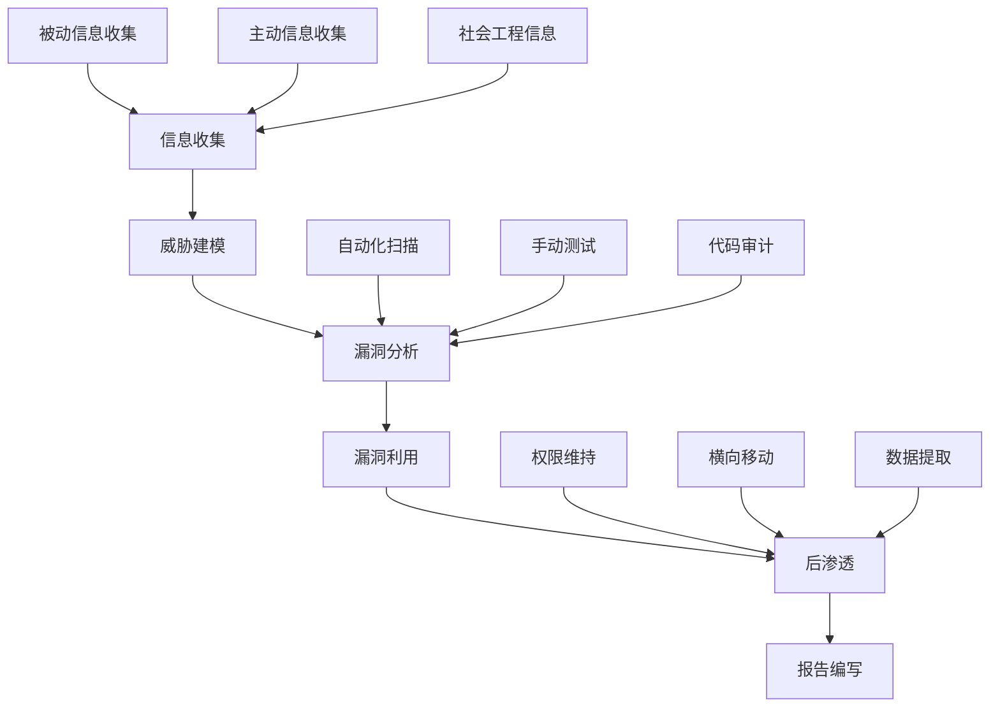
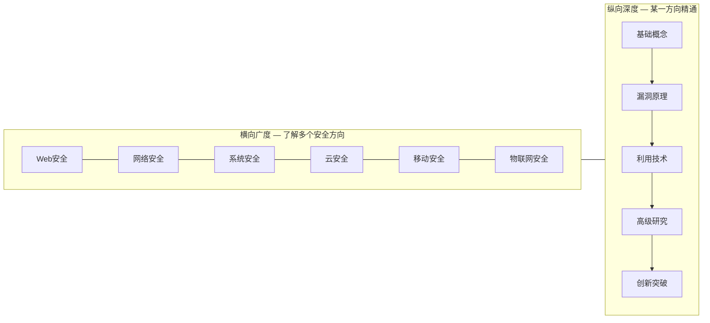
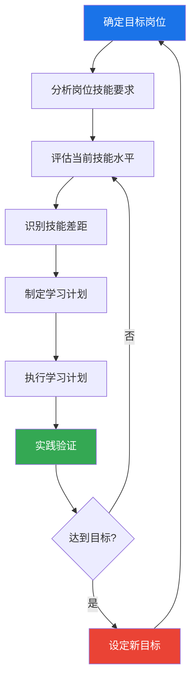

## 三、技能要求分析

信息安全从业者的技能要求是一个多层次、多维度的体系。理解这个体系不仅帮助你明确学习方向，更能让你在职业发展中做出高效的能力投资决策。本节从技术技能、软技能、能力模型三个维度展开，构建一个完整的技能分析框架，并提供可操作的自我评估与提升路径。

### 3.1 技术技能体系

技术技能是安全从业者的立身之本。但"技术技能"本身是一个庞大的集合，需要分层拆解才能有效掌握。我们将其分为基础层、核心层和高级层三个层级，每一层都建立在前一层的基础之上。

#### 3.1.1 基础层：计算机科学通用知识

基础层是所有安全技术的根基。没有扎实的基础，安全技能就是空中楼阁。

**计算机网络**

网络安全的第一步是理解网络本身。你需要掌握的内容包括：

- **TCP/IP协议栈**：不仅要知道TCP三次握手，还要理解SYN Flood攻击为什么能利用半连接队列、TCP序列号预测攻击的原理、以及IP分片重组中的安全问题（如Teardrop攻击）
- **HTTP/HTTPS协议**：理解HTTP请求的完整生命周期、Header各字段的含义与安全影响（如Host头注入、X-Forwarded-For伪造）、TLS握手过程及其降级攻击（如POODLE、DROWN）
- **DNS协议**：掌握DNS查询流程、DNS缓存投毒原理（Kaminsky攻击）、DNS重绑定攻击、以及DNS在C2通信中的滥用方式
- **网络架构**：理解DMZ、VLAN划分、防火墙策略、IDS/IPS部署位置，这些决定了渗透测试的攻击面和路径选择

**操作系统**

安全事件发生在操作系统上，必须深入理解操作系统的运行机制：

- **Linux**：文件权限体系（SUID/SGID/Sticky Bit的安全影响）、进程管理与特权提升路径、日志系统（/var/log各文件的含义）、内核模块加载机制、Namespace和Cgroup隔离原理
- **Windows**：Active Directory架构与攻击面、Windows认证协议（NTLM/Kerberos）的漏洞利用、注册表的安全意义、组策略（GPO）在横向移动中的作用、Windows事件日志（Security/System/Application）的分析
- **操作系统安全机制**：ASLR、DEP/NX、Stack Canary、Control Flow Integrity（CFI）等缓解措施的原理与绕过方法

**数据库**

数据库存储着最敏感的数据，也是攻击者的首要目标：

- **关系型数据库（MySQL/PostgreSQL/MSSQL/Oracle）**：SQL注入的各类变种（Union注入、盲注、时间盲注、带外注入）、数据库权限模型、存储过程的安全风险、数据库提权技术
- **NoSQL数据库（MongoDB/Redis/Elasticsearch）**：NoSQL注入的特殊语法、MongoDB的未授权访问问题、Redis的主从复制RCE利用、Elasticsearch的数据泄露风险
- **数据库安全配置**：最小权限原则的实施、审计日志的启用与分析、加密存储（TDE）的配置

**编程语言**

编程能力决定了安全研究的深度和自动化效率：

| 语言 | 安全领域应用 | 优先级 | 学习重点 |
|------|-------------|--------|---------|
| Python | 安全工具开发、漏洞PoC编写、自动化脚本、数据分析 | ★★★★★ | requests库、scapy网络包构造、pwntools二进制利用框架 |
| C/C++ | 二进制漏洞研究、逆向工程、漏洞利用开发 | ★★★★☆ | 内存布局、指针操作、编译优化对安全的影响 |
| JavaScript | Web安全研究、XSS利用、浏览器安全机制 | ★★★★☆ | DOM操作、CSP绕过、原型链污染 |
| Go | 云安全工具开发、高性能扫描器 | ★★★☆☆ | 并发模型、网络编程、CGO安全 |
| Rust | 安全工具开发（内存安全优势） | ★★★☆☆ | 所有权模型、unsafe的使用场景 |
| Assembly | 漏洞利用开发、Shellcode编写 | ★★★☆☆ | x86/x64指令集、调用约定、系统调用 |
| PowerShell/Bash | 系统管理、红队后渗透 | ★★★★☆ | 管道操作、远程执行、防御绕过 |

编程学习的关键不是背语法，而是理解语言的安全特性。例如，Python的`eval()`为什么危险、C语言的`strcpy()`为什么是缓冲区溢出的根源、JavaScript的`innerHTML`为什么导致XSS。

#### 3.1.2 核心层：安全专业技能

核心层是区别安全从业者与其他IT从业者的关键。

**漏洞原理与利用**

这是安全技能的核心中的核心：

- **Web漏洞**：OWASP Top 10覆盖的漏洞类型（注入、XSS、CSRF、SSRF、文件包含、反序列化等），每种漏洞需要理解其成因、利用方法、危害等级和修复方案。不仅要会用工具扫漏洞，更要理解漏洞背后的代码逻辑
- **二进制漏洞**：栈溢出、堆溢出、格式化字符串、Use-After-Free、Double-Free等内存破坏类漏洞。需要理解程序的内存布局、编译器的行为、以及操作系统安全缓解措施的绕过
- **逻辑漏洞**：越权访问、竞态条件、业务逻辑缺陷。这类漏洞无法被自动化工具发现，需要深入理解业务逻辑

**渗透测试方法论**

渗透测试不是随意扫描和攻击，而是有方法论指导的系统化过程：



常用的渗透测试框架包括：

- **OWASP Testing Guide**：Web应用测试的权威指南，覆盖信息收集、认证测试、授权测试、会话管理、输入验证等12个测试大类
- **PTES（Penetration Testing Execution Standard）**：从前期交互到报告的完整流程标准
- **OSSTMM（Open Source Security Testing Methodology Manual）**：偏重于网络和通信安全测试
- **NIST SP 800-115**：美国国家标准技术研究所的技术安全测试指南

**安全工具使用**

工具是技能的延伸，但要理解工具背后的原理：

- **代理与抓包**：Burp Suite（Web应用测试必备，理解其各模块功能和自定义插件开发）、Wireshark（网络流量分析，掌握过滤语法和协议解析）
- **漏洞扫描**：Nessus/OpenVAS（网络漏洞扫描）、Nuclei（基于模板的漏洞扫描，理解模板编写）、sqlmap（SQL注入自动化利用，理解Tamper脚本的工作原理）
- **渗透测试框架**：Metasploit（漏洞利用框架，理解模块架构和自定义模块开发）、Cobalt Strike（红队协作框架，理解Beacon的通信机制）
- **信息收集**：Shodan/Censys（互联网资产测绘）、Subfinder/Amass（子域名枚举）、httpx（HTTP探测）、Nmap（端口扫描与服务识别）

**代码审计**

代码审计是从代码层面发现漏洞的能力：

- **审计方法**：白盒审计（源代码审查）、灰盒审计（结合架构理解的代码审查）、黑盒审计（仅从外部测试）
- **审计重点**：用户输入处理点（Controller/Handler层）、数据访问层（SQL查询构造）、认证与授权逻辑、文件操作、反序列化点、外部API调用
- **审计工具**：Semgrep（语义级代码扫描，支持自定义规则）、CodeQL（GitHub的代码查询语言，可以像查询数据库一样查询代码）、SonarQube（持续代码质量检查）
- **审计思维**：学会追踪数据流（Source → Sanitization → Sink），理解不同框架的安全特性差异

**逆向工程**

逆向工程是理解软件内部运行机制的能力：

- **静态分析**：使用IDA Pro/Ghidra/ Binary Ninja反汇编和反编译，理解控制流图、数据流分析、符号执行
- **动态分析**：使用GDB/WinDbg/x64dbg调试器，OllyDbg、Frida动态插桩框架，理解断点设置、内存监视、Hook技术
- **应用场景**：恶意软件分析、漏洞研究、协议逆向、软件保护绕过

#### 3.1.3 高级层：深度专业方向

高级层是区分普通安全从业者与顶尖专家的分水岭。

**漏洞挖掘**

漏洞挖掘是从防御者视角发现未知漏洞的能力：

- **Fuzzing技术**：理解变异型Fuzzing（AFL/LibFuzzer）和生成型Fuzzing（Peach/AFL++的Grammr模式）的原理，学习编写高效的Fuzzing Harness
- **符号执行**：使用KLEE/Angr等工具进行程序路径探索，自动发现触发漏洞的输入
- **补丁对比**：通过diff分析厂商的安全补丁，推断未公开漏洞的利用方法（1-day/N-day漏洞）
- **协议分析**：对私有协议进行逆向和模糊测试，发现协议实现中的安全缺陷

**恶意软件分析**

分析恶意软件的行为、传播机制和对抗技术：

- **分析环境搭建**：隔离的分析沙箱、网络模拟环境、反调试对抗措施的处理
- **分析流程**：样本获取 → 静态分析（文件特征、字符串、导入表）→ 动态分析（行为监控、网络通信）→ 深入分析（反混淆、解密算法还原）
- **威胁情报关联**：将分析结果与MITRE ATT&CK框架映射，提取IOC（Indicators of Compromise），构建威胁画像

**密码学应用**

密码学是安全的数学基础：

- **密码算法**：对称加密（AES、ChaCha20）、非对称加密（RSA、ECC）、哈希函数（SHA-256、BLAKE3）、消息认证码（HMAC）
- **协议安全**：TLS 1.3协议分析、证书验证链的安全意义、密钥交换协议（Diffie-Hellman）的安全假设
- **实际攻击**：Padding Oracle攻击、时序攻击、密钥重用攻击、量子计算对密码学的威胁（后量子密码学）

**安全架构设计**

从架构层面构建安全系统：

- **安全设计原则**：最小权限原则、纵深防御、默认安全、失败安全、职责分离
- **威胁建模**：使用STRIDE模型系统化地识别威胁，使用DREAD模型评估风险等级
- **零信任架构**：理解"永不信任、始终验证"的核心理念，实施微分段、持续验证、最小权限访问
- **云原生安全**：容器安全（镜像扫描、运行时防护）、Kubernetes安全（RBAC、NetworkPolicy、PodSecurityPolicy）、Serverless安全

### 3.2 软技能

技术能力决定你能不能做安全，软技能决定你能做多好、走多远。很多技术出众的安全从业者在职业发展中遇到瓶颈，往往不是因为技术不够强，而是软技能不足。

#### 3.2.1 沟通能力

安全工作的核心是降低风险，而降低风险需要说服决策者投入资源。这意味着沟通能力直接影响安全工作的效果。

**向上沟通：向管理层汇报**

管理层不关心技术细节，关心的是业务影响。你需要学会"翻译"：

- ❌ "我们的Web应用存在SQL注入漏洞，CVSS评分9.8"
- ✅ "攻击者可以通过搜索框直接下载全部用户数据，包括500万用户的手机号和身份证号，预计泄露后的合规罚款在2000万元以上"

**向上沟通的结构化方法——SCQA框架**：

- **Situation（背景）**：我们的电商平台在去年双十一期间遭受了DDoS攻击
- **Complication（冲突）**：当时没有DDoS防护，损失了约300万销售额
- **Question（问题）**：如何在下次大促前建立有效的DDoS防护能力？
- **Answer（方案）**：建议采购云清洗服务，预算约XX万，可在X周内部署完成

**横向沟通：与开发/运维团队协作**

安全与开发/运维之间天然存在张力——安全要求"加防护"，开发要求"快上线"。有效的沟通需要：

- **理解对方的KPI**：开发团队的核心指标是交付速度和功能完整度，不要用安全问题来阻碍交付，而是帮他们找到既安全又高效的方案
- **提供可执行的建议**：不要只说"这个有漏洞"，要给出具体的修复代码或配置方案
- **用数据说话**：统计安全漏洞在各团队的分布、修复时长、回归率，用数据驱动改进而非靠争论

**技术写作：安全报告**

安全报告是渗透测试工作的最终交付物，其质量直接影响客户对安全服务价值的认知。

一份高质量的渗透测试报告应包含：

1. **执行摘要**（给管理层看）：业务影响、风险等级、关键发现概述
2. **技术细节**（给开发团队看）：漏洞复现步骤、代码级根因分析、修复方案
3. **风险矩阵**：按可能性和影响程度排列的漏洞优先级
4. **附录**：工具配置、测试范围、合规映射

#### 3.2.2 学习能力

信息安全是所有IT领域中变化最快的之一。每一年都有新的攻击技术、新的防御方案、新的合规要求。学习能力不是"愿不愿意学"的问题，而是"会不会学"的问题。

**构建个人知识管理系统**

零散的笔记和收藏无法形成有效的知识积累。你需要一个结构化的知识管理系统：

- **工具选择**：Obsidian（双向链接、本地Markdown）、Notion（数据库视图、协作能力强）、或自建Wiki
- **知识分类**：按攻击类型、技术栈、工具、案例四个维度交叉索引
- **定期复习**：每周花30分钟回顾本周学习的内容，用费曼技巧检验理解深度——如果你不能用简单的话向别人解释清楚，说明你还没有真正理解

**高效学习方法**

| 方法 | 适用场景 | 操作步骤 |
|------|---------|---------|
| 靶机实战 | 学习新漏洞类型 | 在HackTheBox/TryHackMe上找对应靶机，先独立尝试，卡住时看Writeup学习思路 |
| 源码阅读 | 深入理解漏洞原理 | 找到漏洞对应的历史commit，对比补丁前后代码，理解漏洞的成因和修复逻辑 |
| 论文精读 | 跟踪前沿研究 | 读USENIX Security、IEEE S&P、CCS、Black Hat会议论文，提取核心思想并实验验证 |
| 工具逆向 | 掌握高级工具用法 | 用Wireshark抓取安全工具的网络流量，理解其通信协议和工作原理 |
| Writeup写作 | 固化知识、建立影响力 | 每完成一个靶机或漏洞研究，写一篇详细的Writeup发布到博客或社区 |

#### 3.2.3 团队合作

现代安全工作很少是单打独斗。一个典型的安全团队可能包含渗透测试、安全运营、安全研发、合规审计等多个角色。

**知识分享文化**

安全团队的战斗力取决于团队整体水平，而不是个人英雄主义：

- **内部技术分享**：每周或双周一次的技术分享会，轮流讲解新学到的技术、分析的真实事件
- **Writeup共享**：建立团队内部的Writeup知识库，新的攻击技术或工具使用心得及时沉淀
- **复盘文化**：每次安全事件或渗透测试项目结束后，进行结构化复盘——哪些做得好、哪些可以改进、哪些流程需要优化

**跨团队协作**

安全团队需要与开发、运维、产品、法务等多个团队协作：

- **安全左移（Shift Left）**：将安全能力嵌入开发流程，在设计阶段介入而非等到上线前才做安全测试
- **DevSecOps**：将安全工具集成到CI/CD管道中，实现安全检查的自动化
- **安全文化建设**：通过安全培训、钓鱼演练、CTF竞赛等方式提升全员安全意识

#### 3.2.4 问题解决能力

安全问题往往是非结构化的——没有标准答案，需要创造性思维。

**结构化分析方法**

面对复杂的安全问题，避免陷入"到处试试"的混乱状态：

- **分解法**：将大问题拆解为小问题。例如"这个系统安全吗？"可以拆解为网络层安全、应用层安全、数据层安全、运维安全四个子问题
- **假设驱动**：先提出假设，然后设计验证方法。例如"可能存在SQL注入"→"在登录框输入单引号测试"→"观察返回的错误信息"
- **思维导图**：用思维导图梳理攻击面，从网络拓扑、系统组件、人员因素三个维度系统化地枚举

**逆向思维**

安全研究的本质是逆向思维——站在攻击者的角度思考防御的弱点：

- 如果我是攻击者，这个系统最大的价值是什么？（确定目标资产）
- 最容易的入口在哪里？（最小阻力路径）
- 防御者最可能忽略什么？（盲区利用）
- 一旦进入，我能横向移动到哪里？（攻击路径规划）

### 3.3 能力模型

有了具体的技能清单，还需要一个框架来组织和评估这些技能。能力模型帮助你回答"我现在处于什么水平"和"下一步应该学什么"这两个关键问题。

#### 3.3.1 T型能力模型

T型模型是安全行业广泛认可的能力发展框架：



**T型发展的三个阶段**：

**阶段一：建立广度（0-2年）**

这个阶段的目标是对安全领域的各个方向有基本认知，找到自己感兴趣和擅长的方向。具体做法：

- 参加CTF竞赛，接触Web、Crypto、Pwn、Reverse、Misc等各类题目
- 在HackTheBox、TryHackMe上完成不同类型的靶机
- 阅读各方向的入门书籍和博客，建立知识框架
- 参加安全社区活动（安全沙龙、线上分享），了解不同方向的工作内容

**阶段二：深化专业（2-5年）**

选定一个方向后，开始深度学习和积累：

- 系统学习选定方向的知识体系（参考后续章节的技能树）
- 在Bug Bounty平台（HackerOne、Bugcrowd）上实战
- 开始写技术博客，分享学习心得和研究成果
- 参加该方向的专业会议（Black Hat、DEF CON、国内的KCon、看雪安全峰会等）
- 考取相关认证（参考认证体系章节）

**阶段三：拓展影响力（5年+）**

在专业深度的基础上，拓展广度和影响力：

- 在专业方向上有独到的见解和创新（发现新漏洞、提出新方法、开发新工具）
- 通过演讲、博客、开源项目建立个人品牌
- 向相邻方向扩展（例如从Web安全扩展到云安全、API安全）
- 培养指导初级从业者的能力

#### 3.3.2 能力成熟度模型

用五个等级来评估自己在每个技能领域的水平：

| 等级 | 名称 | 特征 | 典型表现 |
|------|------|------|---------|
| L1 | 入门级 | 了解概念，能使用工具 | 能用sqlmap跑出SQL注入，但不理解其工作原理 |
| L2 | 初级 | 理解原理，能独立实践 | 能手动构造SQL注入Payload，理解不同数据库的差异 |
| L3 | 中级 | 深入理解，能创新应用 | 能在WAF/过滤器绕过场景下构造Payload，能审计代码发现注入点 |
| L4 | 高级 | 精通领域，能产出知识 | 能发现新的注入变种或绕过方法，能设计安全的数据库访问架构 |
| L5 | 专家 | 引领方向，能创新突破 | 能提出新的防御方案或检测技术，能定义行业最佳实践 |

**自我评估方法**：

1. **技能矩阵**：列出你的所有技能，用L1-L5标记当前水平
2. **目标岗位对标**：找到你目标岗位的能力要求（参考第7节"各安全岗位详细能力要求"），找出差距
3. **360度反馈**：向你的同事、上级、下属收集对你能力的评价
4. **实战检验**：通过CTF排名、Bug Bounty战绩、认证考试成绩等客观指标验证自己的水平

#### 3.3.3 技能发展路径规划

基于T型模型和能力成熟度模型，制定具体的学习路径：



**学习计划的SMART原则**：

- **Specific（具体）**：不是"学Web安全"，而是"掌握OWASP Top 10中的SQL注入和XSS"
- **Measurable（可衡量）**：不是"提高渗透测试能力"，而是"在HackTheBox上完成20台Medium难度靶机"
- **Achievable（可实现）**：不要一上来就定"三个月挖到CVE"的目标，先从CTF和靶机开始
- **Relevant（相关）**：确保学习内容与你的职业目标相关，避免盲目追逐热门技术
- **Time-bound（有时限）**：为每个学习目标设定明确的截止日期

### 3.4 常见技能误区与纠正

在技能发展的过程中，很多从业者会陷入一些常见的误区。识别并纠正这些误区，能让你少走弯路。

#### 误区一：工具依赖症

**表现**：会用Nmap、Burp Suite、sqlmap等工具，但不理解工具背后的工作原理。一旦工具被拦截或环境发生变化，就束手无策。

**纠正方法**：

- 学习工具的工作原理。例如，sqlmap的盲注原理是通过二分法逐字符判断数据，理解了这个原理，你就能在sqlmap无法使用时手动编写盲注脚本
- 尝试自己编写安全工具。哪怕是很简单的端口扫描器、HTTP Fuzzer，编写过程会让你深入理解底层机制
- 在受限环境下练习。例如在有WAF的靶机上练习渗透测试，学习绕过技术

#### 误区二：广而不精

**表现**：什么都知道一点，但没有一个方向能达到专业水平。在求职面试时无法深入回答任何方向的问题。

**纠正方法**：

- 在T型模型的指导下，先在一个方向上建立深度，再逐步拓展广度
- 使用"500小时法则"：在一个方向上投入至少500小时的刻意练习，通常可以达到中级水平
- 建立作品集：通过CTF成绩、Bug Bounty战绩、技术博客、开源贡献等可量化的方式证明自己的专业深度

#### 误区三：忽视软技能

**表现**：技术能力很强，但无法有效地与团队沟通、无法写出高质量的报告、无法向管理层解释安全风险。

**纠正方法**：

- 每次做完安全测试或分析后，强迫自己写一份完整的报告，即使没有人要求
- 在安全社区（FreeBuf、先知、看雪）发表技术文章，锻炼技术写作能力
- 主动参与跨团队的安全评审会议，练习在非技术人员面前讲解技术问题

#### 误区四：只攻不防

**表现**：只会进攻性的渗透测试技术，不理解防御视角。这限制了你在蓝队、安全架构、安全运营等方向的发展。

**纠正方法**：

- 学习安全运营（SOC）的工作流程：告警分诊、事件响应、威胁狩猎
- 了解安全产品（WAF、IDS/IPS、EDR、SIEM）的工作原理和配置
- 练习"攻击-防御映射"：每学一种攻击技术，同时学习对应的检测和防御方法
- 参考MITRE ATT&CK框架，它将攻击技术与检测方法系统化地对应

#### 误区五：闭门造车

**表现**：只通过自学和看博客学习，不参与社区互动，不与同行交流。错过行业最新动态，也无法获得反馈和指导。

**纠正方法**：

- 加入安全社区：国内（看雪论坛、先知社区、FreeBuf、T00ls）、国际（Reddit r/netsec、HackerOne社区、OWASP本地分会）
- 参加安全会议：线上（各种安全Webinar）、线下（KCon、看雪峰会、补天白帽大会、各地安全沙龙）
- 找到导师或学习伙伴：加入安全学习小组，定期讨论和分享
- 参加CTF竞赛：团队CTF是最好的学习和社交方式之一

### 3.5 技能评估实战：构建个人技能矩阵

将上述理论转化为可操作的自我评估工具。

#### 步骤一：技能清单

根据你的目标方向，从以下模板中选取技能项：

```text
基础技能：
  [ ] TCP/IP协议栈               [ ] Linux系统管理
  [ ] Windows系统管理             [ ] SQL数据库操作
  [ ] Python编程                  [ ] C/C++编程
  [ ] JavaScript编程              [ ] Shell脚本编写

安全技能：
  [ ] Web漏洞原理与利用           [ ] 渗透测试方法论
  [ ] 代码审计                    [ ] 逆向工程基础
  [ ] 漏洞扫描工具使用            [ ] 渗透测试框架使用
  [ ] 安全报告编写                [ ] 安全架构设计
  [ ] 威胁建模                    [ ] 事件响应

软技能：
  [ ] 技术文档写作                [ ] 演讲与展示
  [ ] 项目管理                    [ ] 跨团队协作
  [ ] 持续学习习惯                [ ] 问题分析与解决
```

#### 步骤二：能力评分

对每项技能用L1-L5评分，并记录评估依据（考试成绩、项目经验、同事反馈等）。

#### 步骤三：差距分析

将你的当前水平与目标岗位要求对比，计算每个技能项的差距等级。优先级排序规则：

1. 差距大且为核心技能 → 立即投入学习
2. 差距大但非核心技能 → 列入中长期计划
3. 差距小且为核心技能 → 通过实战巩固提升
4. 差距小且非核心技能 → 维持现状，定期复查

#### 步骤四：制定行动计划

为每个高优先级技能差距制定具体的行动计划，包含：

- 学习资源（书籍、课程、靶机、项目）
- 时间投入（每周X小时，共Y周）
- 里程碑（第Z周完成某个具体目标）
- 验证方式（认证考试、CTF成绩、项目交付）

这个技能矩阵不是一成不变的。建议每三个月重新评估一次，根据职业目标的变化和技术趋势的演进动态调整。

### 3.6 本节小结

技能要求分析不是一个静态的清单，而是一个动态的框架。它帮助你回答三个核心问题：

1. **学什么**：通过三层技术技能体系和T型模型明确学习方向
2. **怎么学**：通过能力成熟度模型和SMART学习计划提高学习效率
3. **学到什么程度**：通过技能矩阵和差距分析量化评估学习效果

技术技能是入场券，软技能是加速器，能力模型是导航仪。三者缺一不可，只有系统化地发展这三个维度的能力，才能在信息安全这条道路上走得更远、更稳。
