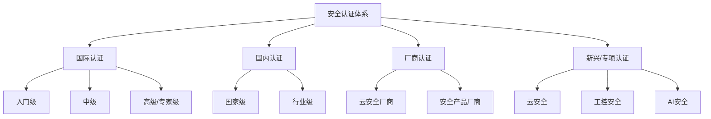
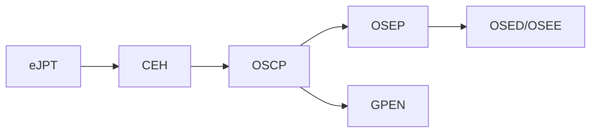
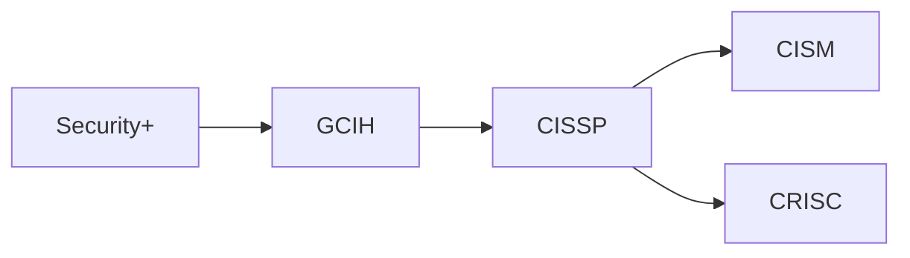
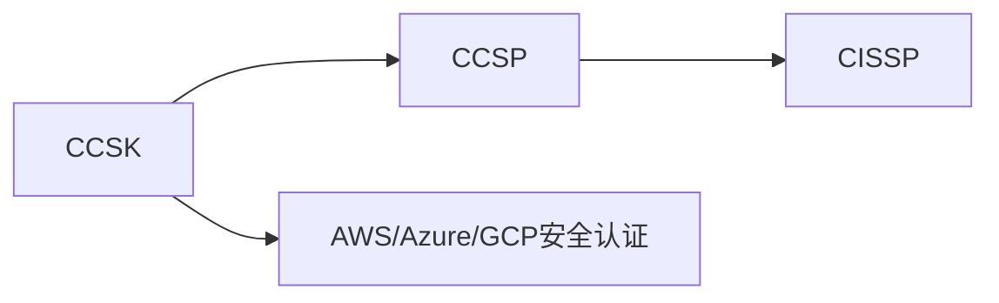
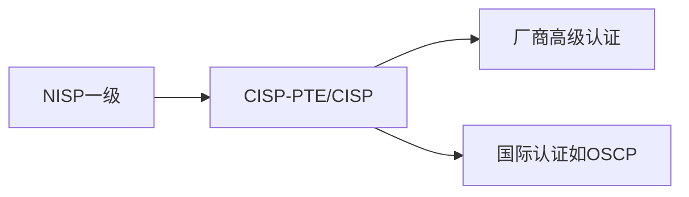

## 四、认证体系

信息安全行业的认证体系是职业发展的重要组成部分。与许多技术领域不同，网络安全领域的认证不仅衡量知识水平，更直接关联到雇主的信任度、薪资谈判筹码以及合规性要求。理解整个认证版图——从入门到专家级、从国际到国内、从通用到专项——是制定职业发展路线的基础。

### 4.1 认证体系总览

认证的价值并非只是一张证书。它代表三件事：**系统化的知识框架**（你不是零散地学，而是沿着一条被验证过的路径走）、**行业信任背书**（雇主无需自行验证你的能力底线）、**持续学习的驱动力**（续证机制迫使你跟上技术演进）。

但认证也有明确的局限：它无法替代实战经验，无法衡量创造性解决问题的能力，也无法反映你在真实攻防对抗中的表现。认证是起点，不是终点。

### 4.2 国际认证：入门级

入门级认证适合两类人：刚进入安全领域的新人，以及需要安全基础知识背书的非安全岗位从业者（开发、运维、管理）。

#### 4.2.1 CompTIA Security+

Security+ 是全球范围内最被广泛认可的安全基础认证，由美国计算技术行业协会（CompTIA）颁发。

**基本信息：**

| 项目 | 详情 |
|------|------|
| 考试代码 | SY0-701（2024年更新） |
| 题目数量 | 最多90道 |
| 题型 | 选择题 + 绩效题（Performance-based） |
| 考试时长 | 90分钟 |
| 通过分数 | 750/900 |
| 费用 | 约404美元 |
| 有效期 | 3年（需续证） |
| 前置要求 | 无，但建议Network+或等效经验 |

**核心考试领域（SY0-701）：**

1. **威胁、漏洞和缓解措施**（22%）：威胁行为者类型、攻击向量、社会工程学、恶意软件分类、缓解技术
2. **安全架构**（18%）：安全框架、基础设施安全、云安全概念、零信任架构
3. **安全运营**（28%）：监控、事件响应、数字取证基础、数据安全
4. **安全程序与治理**（14%）：风险管理、合规性、安全策略、业务连续性
5. **安全管理与控制**（18%）：身份与访问管理、加密技术、PKI

**备考策略：**

- **学习周期**：有IT基础的人通常需要2-3个月，零基础需要4-6个月
- **核心教材**：CompTIA Security+ Get Certified Get Ahead（Darril Gibson著）是公认的最佳备考书
- **实践平台**：Professor Messer的免费视频课程 + Jason Dion的Udemy课程
- **模拟考试**：至少完成3套完整的模拟考试，每次达到85%以上再约考
- **绩效题准备**：熟悉防火墙规则配置、ACL设置、日志分析的基本操作界面

**续证要求：** 3年内获得50个CEU（继续教育单元），可通过参加培训、发表文章、参与安全会议、获得更高级认证等方式获取。

**适用场景：** 美国联邦政府岗位（符合DoD 8570/8140要求）、企业安全分析师入门、IT转安全的敲门砖。

#### 4.2.2 CEH（Certified Ethical Hacker）

CEH 由 EC-Council 颁发，是全球知名度最高的道德黑客认证。

**基本信息：**

| 项目 | 详情 |
|------|------|
| 版本 | CEH v13（2024年更新） |
| 题目数量 | 125道 |
| 题型 | 多选题 |
| 考试时长 | 4小时 |
| 通过分数 | 60%-85%（根据题目难度动态调整） |
| 费用 | 考试费约1199美元（含培训则更高） |
| 有效期 | 3年 |

**考试模块（20个模块）：**

CEH v13覆盖从信息收集到IoT攻击的完整攻击链：

1. 信息收集与侦察
2. 扫描网络
3. 枚举
4. 漏洞分析
5. 系统攻击
6. 恶意软件威胁
7. Sniffing（嗅探）
8. 社会工程学
9. 拒绝服务攻击
10. 会话劫持
11. 入侵检测系统、防火墙与蜜罐
12. Web服务器攻击
13. Web应用攻击
14. SQL注入
15. 无线网络攻击
16. 移动平台攻击
17. IoT与OT攻击
18. 云计算攻击
19. 密码学
20. AI与机器学习攻击

**CEH实践考试（CEH Practical）：** EC-Council还提供了6小时的实操考试版本，在真实环境中完成20个挑战，难度远高于笔试。持有CEH Practical在业内认可度更高。

**争议与现实：**

CEH在业内评价两极分化。支持者认为它提供了攻击技术的全景视角，适合管理层和需要广度的人；批评者认为它过于理论化，工具教学停留在表面，与OSCP等实战认证相比含金量不足。

**建议：** 如果目标是渗透测试工程师，CEH可以作为知识广度的补充，但不应作为唯一或首要认证。如果目标是安全管理、合规、售前等岗位，CEH的知名度和品牌价值仍然很高。

#### 4.2.3 eJPT（eLearnSecurity Junior Penetration Tester）

eJPT 由 INE（原eLearnSecurity）颁发，是少有的完全基于实操的入门级渗透测试认证。

**基本信息：**

| 项目 | 详情 |
|------|------|
| 题目数量 | 35道实操题 |
| 考试环境 | 提供VPN接入的虚拟网络 |
| 考试时长 | 48小时（实际可在20小时内完成） |
| 通过分数 | 15/35（约43%） |
| 费用 | 约249美元（含课程） |
| 有效期 | 永久 |

**考试内容：**

考生需要在48小时内对一个模拟网络进行渗透测试，涵盖：
- 网络侦察与信息收集
- 主机发现与端口扫描
- 服务识别与漏洞发现
- Web应用渗透
- 后渗透与横向移动
- 报告撰写

**优势：** 永久有效、价格亲民、完全实操、难度适中（适合初学者建立信心）、无前置要求。

**备考路径：** INE的Penetration Testing Student（PTS）课程是官方推荐的备考材料，课程本身免费（INE提供免费基础账户），考试券需要单独购买。

### 4.3 国际认证：中级

中级认证是安全从业者职业发展的核心区间。这些认证不仅要求扎实的知识基础，还要求一定的实战经验。

#### 4.3.1 OSCP（Offensive Security Certified Professional）

OSCP 是渗透测试领域含金量最高的认证之一，由 Offensive Security（现为 OffSec）颁发。

**基本信息：**

| 项目 | 详情 |
|------|------|
| 考试环境 | 独立AD域 + 独立机器 |
| 题目 | 3台独立主机 + 1个AD集（2台+DC） |
| 总分 | 100分（独立主机各20/25/25分，AD集30分） |
| 通过分数 | 70分 |
| 考试时长 | 23小时45分钟 |
| 报告提交 | 考试结束后24小时内 |
| 费用 | 课程+考试约1599-2499美元（取决于套餐） |
| 有效期 | 永久 |

**为什么OSCP被视为行业标杆：**

1. **完全实操**：没有任何选择题，你必须真正攻破机器才能得分
2. **时间压力**：24小时的考试模拟了真实的渗透测试时间约束
3. **证明材料**：通过者需要提交详细的渗透测试报告，展示了文档能力
4. **课程质量**：PEN-200课程（原PWK）本身就是优秀的渗透测试教材
5. **OffSec品牌**：Offensive Security在安全社区的声誉无出其右

**PEN-200课程内容：**

- 渗透测试方法论与工作流程
- 信息收集与侦察
- 扫描与枚举
- Web应用攻击
- 缓冲区溢出（Windows + Linux）
- 客户端攻击
- 权限提升（Windows + Linux）
- 密码攻击
- 端口转发与隧道
- Active Directory攻击
- 防病毒规避基础
- 漏洞利用与报告撰写

**备考建议（建议总投入3-6个月）：**

1. **课程阶段（1-2个月）**：完成PEN-200所有课程章节和练习
2. **实验室阶段（1-2个月）**：至少攻破30台实验室机器，重点练习独立发现漏洞（不是看WriteUp）
3. **练习阶段（1-2个月）**：在PG Practice、HackTheBox、TryHackMe上大量练习
4. **考前冲刺（1-2周）**：整理笔记、复习提权方法、确保AD攻击链熟练

**常见失败原因：**

- 权限提升能力不足（只会在初始访问阶段卡住）
- 缺乏系统化的枚举流程（遗漏关键信息）
- 时间管理不当（在一台机器上耗时过长）
- 报告撰写不规范（明明攻破了但报告没写好，丢失分数）

**后续路径：** OSCP → OSEP（PEN-300，高级渗透）→ OSED（EXP-301，漏洞利用开发）→ OSEE（EXP-401，高级漏洞利用，OffSec最高级别认证）。

#### 4.3.2 GPEN（GIAC Penetration Tester）

GPEN 由 SANS/GIAC 颁发，侧重于渗透测试方法论和最佳实践。

**基本信息：**

| 项目 | 详情 |
|------|------|
| 题目数量 | 82道 |
| 题型 | 多选题 + 在线实操（部分版本） |
| 考试时长 | 3小时 |
| 通过分数 | 75% |
| 费用 | 约949美元（考试费），SANS培训另计（通常6000-8000美元） |
| 有效期 | 4年 |

**GPEN vs OSCP：**

| 维度 | GPEN | OSCP |
|------|------|------|
| 考试形式 | 选择题为主 | 完全实操 |
| 侧重点 | 方法论、合规、最佳实践 | 动手攻破能力 |
| 培训质量 | SANS课程体系（业界顶级） | OffSec课程 |
| 费用 | 极高（含培训约7000-9000美元） | 中高（1500-2500美元） |
| 企业认可度 | 在大企业和政府中极高 | 在技术社区和创业公司中极高 |
| 适合人群 | 企业安全团队、顾问 | 渗透测试工程师、红队成员 |

**备考策略：** 如果公司提供SANS培训预算，强烈建议先参加SEC560（Network Penetration Testing and Ethical Hacking）课程。SANS的课程材料质量在业界首屈一指，500-700页的课程手册就是最好的备考材料。

#### 4.3.3 GCIH（GIAC Certified Incident Handler）

GCIH 专注于事件响应和安全事件处理，由 SANS/GIAC 颁发。

**核心能力域：**

- 事件响应流程与框架（PICERL模型）
- 网络流量分析与取证
- 内存取证基础
- Windows/Linux事件分析
- 恶意软件分析基础
- 日志分析与SIEM使用
- 威胁猎捕（Threat Hunting）入门

**适合人群：** SOC分析师、事件响应工程师、蓝队成员、安全运维工程师。

**备考建议：** SANS SEC504课程（Incident Handling, Hacker Techniques, and Incident Response）是官方推荐课程。课程涵盖了攻击技术和对应的检测响应方法，这种"以攻促防"的教学方式非常实用。

#### 4.3.4 CISSP（Certified Information Systems Security Professional）

CISSP 由 (ISC)² 颁发，是信息安全领域最权威的管理级认证。

**基本信息：**

| 项目 | 详情 |
|------|------|
| 题目数量 | 125-175道（自适应考试CAT） |
| 题型 | 多选题 + 高级创新题 |
| 考试时长 | 4小时 |
| 通过分数 | 700/1000 |
| 费用 | 749美元 |
| 有效期 | 3年 |
| 前置要求 | 至少5年相关工作经验（或4年+学位） |

**八大知识域（CISSP CBK）：**

1. **安全与风险管理**：安全治理、合规、法律、风险管理、供应链安全
2. **资产安全**：数据分类、数据生命周期、隐私保护
3. **安全架构与工程**：安全模型、密码学、物理安全
4. **通信与网络安全**：网络协议安全、安全架构、传输加密
5. **身份与访问管理（IAM）**：身份治理、认证机制、授权模型
6. **安全评估与测试**：审计、漏洞评估、渗透测试管理
7. **安全运营**：事件响应、灾难恢复、调查
8. **软件开发安全**：SDLC安全、代码审查、应用安全

**CISSP的真正价值：**

CISSP不考察你是否会配置防火墙或编写漏洞利用代码。它考察的是你能否从**管理层视角**理解和管理信息安全风险。持有CISSP意味着你具备CISO级别的安全思维框架。

在薪资方面，CISSP持有者的平均年薪在全球范围内通常比未持有者高出20-30%。根据(ISC)²的年度调查，CISSP持有者的平均年薪约为12-15万美元（北美市场）。

**备考策略：**

- **学习周期**：通常需要3-6个月
- **核心教材**：CISSP Official Study Guide（Sybex）、CISSP All-in-One Exam Guide（Shon Harris/Fernando Maymí）
- **题库**：Boson CISSP Practice Exams、CCCure
- **关键思维转变**：不要用技术思维答题，要用"管理者会选择什么"的思维答题
- **考试技巧**：CISSP考试考的是"最佳"答案，四个选项可能都对，但只有一个在管理层面最合理

### 4.4 国际认证：高级/专家级

高级认证面向拥有丰富经验的安全专业人士，考试形式以实操为主，难度极高。

#### 4.4.1 OSEP（Offensive Security Experienced Penetration Tester）

OSEP 对应 OffSec 的 PEN-300 课程，专注于高级渗透测试技术。

**核心内容：**

- 高级客户端攻击（Office宏、HTA、JavaScript）
- 防病毒规避与免杀技术
- AppLocker和CLM绕过
- 高级横向移动技术
- 域森林攻击
- 组策略对象（GPO）滥用
- 漏洞利用开发基础（C#、Python）

**考试形式：** 48小时实操考试，需要攻破一个包含多层防御的AD环境，提交详细报告。

#### 4.4.2 OSED（Offensive Security Exploit Developer）

OSED 对应 OffSec 的 EXP-301 课程，专注于Windows漏洞利用开发。

**核心内容：**

- Windows内存保护机制（DEP、ASLR、CFG、ACG）
- SEH链利用
- ROP（Return Oriented Programming）
- 自定义Shellcode编写
- 漏洞发现与利用的完整流程

**前置要求：** 建议已有OSCP和一定的C/C++编程能力。

#### 4.4.3 GXPN（GIAC Exploit Researcher and Advanced Penetration Tester）

GXPN 是 SANS/GIAC 体系中的最高级渗透测试认证，对应 SEC660课程。

**核心能力域：**

- 网络攻击高级技术
- 密码学攻击
- Python/Go漏洞利用开发
- 内存保护绕过
- fuzzing与漏洞发现
- 高级Web应用攻击

#### 4.4.4 CISM（Certified Information Security Manager）

CISM 由 ISACA 颁发，面向信息安全管理者。

**四大知识域：**

1. 信息安全治理（17%）
2. 信息风险管理（20%）
3. 信息安全程序开发与管理（33%）
4. 信息安全事件管理（30%）

**CISM vs CISSP：**

| 维度 | CISM | CISSP |
|------|------|-------|
| 颁发机构 | ISACA | (ISC)² |
| 侧重点 | 信息安全管理 | 信息安全综合 |
| 知识域数量 | 4个 | 8个 |
| 适合人群 | 安全经理、CISO | 安全架构师、顾问 |
| 前置要求 | 5年信息安全管理经验 | 5年安全相关经验 |
| 企业偏好 | 审计、合规团队 | 综合安全团队 |

### 4.5 国内认证体系

国内安全认证体系分为国家级认证和厂商认证两大类。对于在国内发展的安全从业者，了解并获取适当的国内认证同样重要。

#### 4.5.1 CISP系列

CISP（注册信息安全专业人员）由中国信息安全测评中心颁发，是国内最权威的信息安全认证。

**CISP家族：**

| 认证名称 | 适合人群 | 核心内容 | 费用 |
|----------|----------|----------|------|
| CISP | 安全管理人员 | 信息安全管理、技术、法规 | 约9600元（含培训） |
| CISP-PTE | 渗透测试工程师 | Web渗透、内网渗透、应急响应 | 约12800元（含培训） |
| CISP-PTS | 高级渗透测试专家 | 高级渗透技术、代码审计 | 约16800元（含培训） |
| CISP-IRE | 应急响应工程师 | 事件响应、取证分析 | 约12800元（含培训） |
| CISP-DSG | 数据安全治理 | 数据安全体系、合规 | 约9600元（含培训） |
| CISP-A | 审计师 | 信息安全审计 | 约9600元（含培训） |

**CISP考试信息：**

- 题型：100道单选题
- 时长：2小时
- 通过分数：70分
- 有效期：3年（需续证）

**CISP-PTE的独特价值：**

CISP-PTE是国内少有的渗透测试实操认证。考试包含实操题，考生需要在真实环境中完成Web渗透任务。在国内企业（特别是甲方安全团队）招聘中，CISP-PTE的认可度逐年上升。

**备考建议：** CISP系列认证必须通过授权培训机构报名（不接受个人直接报考）。选择培训机构时，关注讲师的实战经验，而不仅仅是通过率。培训通常为5天集中授课。

#### 4.5.2 NISP（国家信息安全水平考试）

NISP 由中国信息安全测评中心推出，面向在校学生和初级从业者。

**三个级别：**

| 级别 | 适合人群 | 考试形式 | 前置要求 |
|------|----------|----------|----------|
| NISP一级 | 在校大学生 | 线上机考，50道选择题 | 无 |
| NISP二级 | 安全从业者 | 线下机考，100道选择题 | NISP一级或同等 |
| NISP三级 | 高级安全人才 | 综合评审 | NISP二级+工作经验 |

**NISP一级的独特价值：** 费用低（约480元）、门槛低（在校生即可报考）、线上考试方便。对于安全专业的在校生，这是成本最低的入门认证。通过NISP一级后，可以免培训直接报考CISP（正常CISP需要授权培训）。

#### 4.5.3 厂商认证

国内主要安全厂商也推出了自己的认证体系，这些认证与特定产品深度绑定。

**华为安全认证：**

| 级别 | 认证名称 | 核心内容 |
|------|----------|----------|
| HCIA-Security | 华为认证安全工程师 | 防火墙基础、IPSec VPN、安全策略 |
| HCIP-Security | 华为认证安全高级工程师 | 入侵防御、内容安全、终端安全 |
| HCIE-Security | 华为认证安全专家 | 安全方案设计、高级攻防技术 |

**阿里云安全认证：**
- ACA（Alibaba Cloud Certified Associate）：云安全基础
- ACP（Alibaba Cloud Certified Professional）：云安全架构
- ACE（Alibaba Cloud Certified Expert）：云安全专家

**其他厂商认证：**
- 深信服安全技术认证
- 奇安信安全认证
- 绿盟科技安全认证

**厂商认证的使用场景：** 如果你在甲方负责特定厂商的安全产品运维，或者在乙方/集成商工作，厂商认证有直接的实际价值。但如果你的目标是通用安全能力，厂商认证的优先级应低于通用认证。

### 4.6 新兴与专项认证

随着安全领域的细分，一批新兴的专项认证正在崛起。

#### 4.6.1 云安全认证

| 认证 | 颁发机构 | 核心内容 |
|------|----------|----------|
| CCSP | (ISC)² | 云安全架构、数据安全、合规 |
| AWS Security Specialty | AWS | AWS安全服务、IAM、加密 |
| Azure Security Engineer Associate | Microsoft | Azure安全中心、Sentinel、IAM |
| Google Professional Cloud Security Engineer | Google Cloud | GCP安全配置、组织策略 |
| CCSK | CSA | 云安全知识体系 |

#### 4.6.2 工控安全认证

| 认证 | 颁发机构 | 核心内容 |
|------|----------|----------|
| GICSP | SANS/GIAC | 工控系统安全 |
| CSSA | GIAC | SCADA安全架构 |
| ISA/IEC 62443认证 | ISA | 工控安全标准 |

#### 4.6.3 AI安全与新兴方向

AI安全领域目前尚未形成成熟的认证体系，但以下方向值得关注：
- (ISC)² 的 CC（Certified in Cybersecurity）——面向AI安全的入门认证正在规划中
- 各大云厂商正在将AI安全纳入其云安全认证
- CompTIA 在 Security+ SY0-701中已增加了AI安全相关考点

### 4.7 认证选择策略

认证不是越多越好。盲目堆砌证书不仅浪费时间和金钱，还可能给雇主留下"纸上谈兵"的印象。选择认证应该基于职业目标、当前阶段和投入产出比。

#### 4.7.1 按职业方向选择

**渗透测试/红队路径：**

**安全管理/蓝队路径：**

**云安全路径：**

**国内发展路径：**

#### 4.7.2 按职业阶段选择

| 阶段 | 经验 | 推荐认证 | 预算 |
|------|------|----------|------|
| 入门（0-1年） | 在校生/转行 | Security+、NISP一级、eJPT | < 5000元 |
| 初级（1-3年） | 初级工程师 | CEH、CISP-PTE、OSCP | 1-2万元 |
| 中级（3-5年） | 中级工程师 | OSCP、GPEN、CISSP、CISP | 2-5万元 |
| 高级（5-10年） | 高级/管理 | CISSP、CISM、OSEP | 按需 |
| 专家（10年+） | 专家/CISO | OSEE、GXPN、行业特定认证 | 按需 |

#### 4.7.3 认证投资回报分析

不同认证的投入产出比差异显著：

| 认证 | 总投入（时间+费用） | 薪资提升预期 | ROI评估 |
|------|---------------------|-------------|---------|
| Security+ | 3个月 + 3000元 | 5-10% | 高（低成本高回报） |
| OSCP | 6个月 + 15000元 | 15-30% | 极高（渗透测试岗位标配） |
| CISSP | 6个月 + 6000元 | 20-30% | 高（管理层必备） |
| CISP | 1个月 + 9600元 | 5-15% | 中高（国内甲方刚需） |
| GPEN | 3个月 + 50000元 | 10-20% | 中（费用过高） |
| CCSP | 3个月 + 5000元 | 10-20% | 高（云安全需求增长） |

### 4.8 认证备考通用方法论

无论考什么认证，备考方法论是通用的。

#### 4.8.1 三阶段备考法

**第一阶段：知识构建（40%时间）**
- 通读官方教材或推荐教材，不求全部记住，建立知识框架
- 用思维导图整理每个知识域的核心概念
- 标记不确定和不理解的部分

**第二阶段：深度学习（40%时间）**
- 针对第一阶段标记的部分进行深度研究
- 动手实验（搭建虚拟环境，验证书上的每个概念）
- 完成课后练习和实验
- 开始做章节练习题

**第三阶段：冲刺复习（20%时间）**
- 做完整的模拟考试（至少3套）
- 分析错题，回到知识点查漏补缺
- 整理速查笔记（考试前最后一天看这个）
- 确保考试环境（网络、证件、考场地址）准备就绪

#### 4.8.2 学习资源获取

| 资源类型 | 推荐渠道 | 费用 |
|----------|----------|------|
| 官方教材 | 认证机构官网 | 中-高 |
| 第三方书籍 | Amazon/京东 | 低 |
| 视频课程 | Udemy、Coursera、INE | 低-中 |
| 社区讨论 | Reddit(r/cissp等)、Discord | 免费 |
| 模拟考试 | Boson、Pocket Prep | 低 |
| 实验环境 | HackTheBox、TryHackMe、PG Practice | 低 |

#### 4.8.3 续证与持续学习

大多数认证都有续证要求，这意味着获取认证只是开始：

- **CPE（持续专业教育）**：CISSP需要每年40个CPE，CISM每年20个CPE
- **续证费用**：CISSP每年125美元AMF，CISM每年45-85美元
- **获取CPE的方式**：参加会议、培训、发表文章、自学（有上限）、教学、志愿者服务

**建议：** 建立一个简单的表格追踪你的CPE进度，避免续证时才发现学时不够。

### 4.9 认证的误区与纠正

#### 误区一：认证越多越好

**现实：** 3-5个精心选择的认证比10个随意考的认证更有价值。雇主看重的是你选择了哪些认证（反映了你的职业定位和深度），而不是数量。

#### 误区二：考完认证就代表有能力

**现实：** 认证证明的是你在某个时间点通过了某个考核标准。能力需要在实际工作中持续证明。很多持有OSCP的人在实际渗透测试中表现平庸，因为他们只做了"刷题"式的备考，没有真正理解方法论。

#### 误区三：必须先考入门级再考高级

**现实：** 大多数认证没有严格的前置要求。如果你有足够的经验，可以直接挑战高级认证。很多人直接考OSCP而跳过了CEH和eJPT。

#### 误区四：国内认证没用

**现实：** 在甲方安全岗位、政府项目、等保测评等场景中，CISP是硬性要求。如果你在国内发展，特别是面向甲方或政府市场，CISP几乎是必须的。

#### 误区五：在线开卷考试没有含金量

**现实：** OSCP等认证虽然是开卷考试（可以查资料），但在24小时内攻破目标机器的能力远比在2小时内做对100道选择题更能说明问题。开卷不等于简单。

### 4.10 本节小结

认证体系是安全职业发展的导航地图，而非目的地。关键原则：

1. **先定方向，再选认证**——不要盲目跟风，根据职业目标选择
2. **实战认证 > 理论认证**——在技术岗位上，能证明动手能力的认证更有价值
3. **投入产出比优先**——考虑时间成本、金钱成本和预期收益
4. **认证是起点不是终点**——拿到认证后继续深耕，用实际成果证明自己
5. **国内外认证互补**——在国内发展需要兼顾国际认证（能力证明）和国内认证（合规需求）

选择认证的本质是选择一条学习路径。最好的认证是那个能推动你系统化学习、并且在你的目标市场有认可度的认证。
