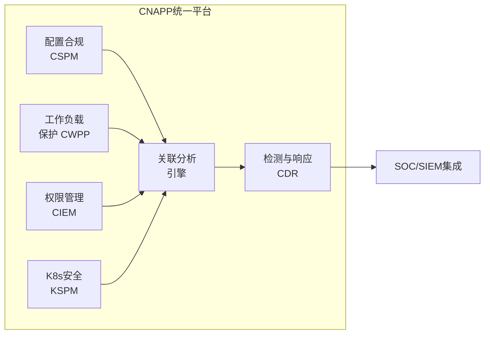
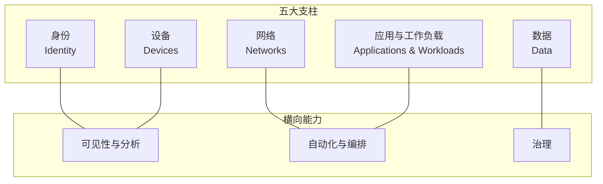
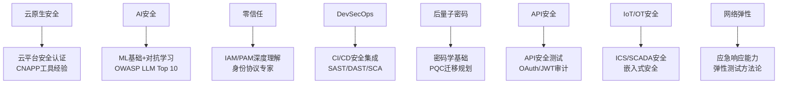

## 五、行业趋势

信息安全行业正处于多重变革叠加的关键时期。云计算重塑了基础设施，AI 重新定义了攻防对抗的方式，量子计算对现有密码体系构成根本性威胁，供应链安全事件频发暴露了软件生态的系统性风险。理解这些趋势不仅帮助你把握行业方向，更直接决定了你的技能投资策略和职业选择——**在正确的时间掌握正确的技术，价值远超埋头苦干**。

本节将从三个维度系统梳理行业趋势：**技术趋势**（哪些技术正在改变行业）、**市场趋势**（行业格局如何演变）、**新兴与细分趋势**（哪些新领域正在快速崛起）。

### 5.1 技术趋势

#### 5.1.1 云原生安全

云安全已经从"锦上添花"变成了企业安全的核心战场。根据 CrowdStrike 2026 年云安全调查报告，**94% 的组织经历过导致数据暴露的云安全事件**，73% 的组织无法保证一致地检测到云入侵，68% 的组织需要超过 15 分钟才能检测到云入侵。

**CNAPP（云原生应用保护平台）** 正在成为云安全的标准架构。它将以下能力整合到统一平台中：

| 能力 | 全称 | 核心功能 | 代表工具 |
|------|------|----------|----------|
| CSPM | Cloud Security Posture Management | 云配置合规检查、错误配置检测 | Wiz, Prisma Cloud, Orca |
| CWPP | Cloud Workload Protection Platform | 运行时工作负载保护、漏洞管理 | Aqua Security, CrowdStrike Falcon |
| CIEM | Cloud Infrastructure Entitlement Management | 云权限管理、最小权限审计 | Ermetic, Zscaler |
| KSPM | Kubernetes Security Posture Management | K8s 集群配置与安全评估 | Armo, Kubescape |

CNAPP 市场预计 2027 年达到 **193 亿美元**，年复合增长率 19.9%（MarketsandMarkets）。

**关键挑战与机遇：**

- **AI 工作负载安全**：83% 的组织在云中运行 AI/ML 工作负载，但 81% 的组织经历过针对云 AI/ML 环境的安全事件。保护训练数据、模型权重和推理服务成为全新课题
- **云检测与响应（CDR）**：作为独立安全学科快速崛起，专注于云环境中的实时威胁检测与自动化响应
- **无服务器安全**：Lambda/Cloud Functions 等无服务器架构的攻击面与传统服务器完全不同，需要专门的安全方案

**对从业者的影响：**

掌握至少一个主流云平台（AWS/Azure/GCP）的安全配置能力已成为"标配"而非"加分项"。建议考取 AWS Security Specialty 或 Azure Security Engineer Associate 等云安全专项认证。CNAPP 相关工具的使用经验正在成为安全工程师岗位的硬性要求。

#### 5.1.2 AI 安全（攻防双向）

AI 与安全的关系是双向的：AI 既是安全防御的利器，也是全新的攻击面。这个方向正在以惊人的速度发展，是当前安全行业最具变革潜力的领域。

**AI 作为安全工具：**

- **AI 驱动的威胁检测**：机器学习模型可以分析海量日志和网络流量，发现传统规则引擎无法捕捉的异常模式。CrowdStrike、SentinelOne、Darktrace 等厂商已将 AI 深度集成到检测引擎中
- **自动化安全运营（AI SOC）**：AI 可以自动对告警进行分级、关联和初步调查，解决 SOC 分析师长期面临的告警疲劳问题。IBM《2025 年数据泄露成本报告》显示，广泛使用 AI 安全工具的组织平均节省 **190 万美元** 的数据泄露成本
- **AI 辅助漏洞挖掘**：Google 的 Big Sleep、Microsoft Security Copilot 等工具正在用 AI 发现传统方法难以发现的漏洞

**AI 作为攻击面：**

- **LLM 安全**：提示注入（Prompt Injection）、越狱（Jailbreak）、数据泄露等攻击方式构成了全新的威胁图谱。OWASP 已发布《大语言模型应用 Top 10 安全风险》，涵盖提示注入、不安全的输出处理、训练数据投毒等关键风险
- **AI Agent 身份安全**：AI 代理（Agent）正在获得 OAuth 令牌和 API 密钥，但现有的身份体系无法准确表达"人+AI代理"的复合身份关系。CrowdStrike 识别了 4 种 AI Agent 身份模式（交互式、离线式、自动化、传递式），每种都有不同的访问控制需求
- **Shadow AI 问题**：IBM 报告显示，63% 的组织缺乏 AI 治理策略，员工在未经授权的情况下使用 AI 工具处理敏感数据，构成重大合规风险
- **深度伪造（Deepfake）**：AI 生成的音视频被用于社工攻击和欺诈。该检测市场预计从 8.57 亿美元增长到 2030 年的 **72.7 亿美元**，复合增长率 42.8%

**GenAI 安全市场数据：**

| 指标 | 数值 | 来源 |
|------|------|------|
| GenAI 网络安全市场规模（2025） | 86.5 亿美元 | MarketsandMarkets |
| 预计市场规模（2030） | 355 亿美元 | MarketsandMarkets |
| 年复合增长率 | 26.5% | MarketsandMarkets |
| OWASP GenAI 安全专家组规模 | 600+ 名专家 | OWASP |

**对从业者的影响：**

AI 安全是目前增长最快的细分方向之一。如果你有机器学习基础，进入 AI 安全领域的门槛相对较低且竞争较少。即使是纯安全背景的从业者，也需要理解 AI 系统的基本工作原理，才能有效评估和防御 AI 相关威胁。推荐阅读 OWASP LLM Top 10，使用 Adversarial Robustness Toolbox（ART）等工具实践对抗性机器学习。

#### 5.1.3 零信任架构

零信任（Zero Trust）已经从营销概念走向实际落地。美国 CISA 发布的零信任成熟度模型 V2.0（2023）定义了 5 大支柱和 4 级成熟度，为组织实施零信任提供了可操作的框架：

**成熟度等级：**

| 等级 | 特征 | 典型状态 |
|------|------|----------|
| 传统级（Traditional） | 基于边界的安全模型 | 静态防火墙、VPN、城堡护城河模式 |
| 初始级（Initial） | 开始引入零信任组件 | MFA 部署、基础网络分段 |
| 进阶级（Advanced） | 零信任策略自动化执行 | 持续验证、动态访问控制、微隔离 |
| 最优级（Optimal） | 全面零信任、自适应安全 | 实时风险评估、自动化响应、数据级访问控制 |

**核心演变趋势：**

- **从"基于位置"到"基于数据"**：访问决策不再依赖网络位置（内网/外网），而是基于身份状态、设备健康度、数据敏感性等多维因素
- **身份优先安全（Identity-First Security）**：身份成为安全的控制平面，而非网络边界。机器身份（工作负载、服务、AI Agent）的数量已经远超人类身份
- **持续验证**：不再一次认证后永久信任，而是在整个会话过程中持续评估信任等级

**对从业者的影响：**

零信任架构师是目前市场上最稀缺的安全角色之一。建议深入理解身份与访问管理（IAM）、特权访问管理（PAM）、微隔离（Micro-segmentation）等核心技术。对于中国市场，零信任在金融和互联网行业已有较多落地案例，是值得深耕的方向。

#### 5.1.4 DevSecOps 与安全左移

安全左移（Shift Left）意味着将安全检测和防护从运维阶段前移到开发阶段，从源头减少安全缺陷。DevSecOps 不是简单地在 CI/CD 流水线中加入安全工具，而是将安全思维融入整个软件开发生命周期。

**安全左移的实践层次：**

| 阶段 | 安全活动 | 典型工具 |
|------|----------|----------|
| 需求设计 | 威胁建模、安全需求分析 | Microsoft Threat Modeling Tool, OWASP Threat Dragon |
| 编码 | 安全编码规范、IDE 安全插件 | SonarLint, Snyk Code, Semgrep |
| 代码提交 | 预提交钩子、密钥扫描 | GitLeaks, TruffleHog, Husky |
| 构建 | SAST、SCA、SBOM 生成 | CodeQL, Dependabot, Syft |
| 测试 | DAST、IAST、模糊测试 | OWASP ZAP, Burp Suite, AFL++ |
| 部署 | 容器镜像扫描、IaC 安全 | Trivy, Checkov, tfsec |
| 运行时 | RASP、WAF、运行时保护 | Sqreen, Signal Sciences |

**关键推动力——合规法规：**

- **欧盟网络弹性法案（EU CRA）**：要求软件制造商对产品全生命周期的安全负责，强制 SBOM 和漏洞披露流程
- **中国《数据安全法》《个人信息保护法》**：对数据处理活动提出全生命周期安全要求
- **美国 SEC 网络安全披露规则**：上市公司必须在 4 个工作日内披露重大网络安全事件

**SBOM 与供应链安全框架：**

SBOM（Software Bill of Materials，软件物料清单）已成为供应链安全的基础设施。SLSA（Supply-chain Levels for Software Artifacts）框架定义了 4 级供应链完整性保证：

| SLSA 等级 | 保证内容 | 适用场景 |
|-----------|----------|----------|
| Level 1 | 构建过程有文档记录 | 开源项目入门 |
| Level 2 | 使用托管构建服务、生成溯源证明 | 企业内部项目 |
| Level 3 | 构建平台隔离、溯源证明不可伪造 | 关键基础设施 |
| Level 4 | 双人审核、可复现构建 | 高安全要求系统 |

供应链攻击在近年来增长了 **650%**（SLSA 官方引用数据）。XZ Utils 后门事件（2024）是典型案例——攻击者通过社会工程学渗透了开源维护者，在广泛使用的压缩库中植入后门，差点影响数百万 Linux 系统。

**对从业者的影响：**

DevSecOps 工程师是当前需求量增长最快的安全岗位之一。建议掌握至少一种 CI/CD 平台（Jenkins/GitLab CI/GitHub Actions）的安全集成能力，熟悉 SAST/DAST/SCA 工具的部署和调优。对于有开发背景的转型者，这是最自然的切入点。

#### 5.1.5 后量子密码学

量子计算对现有密码体系的威胁不是科幻小说，而是正在逼近的现实。NIST 在 2024 年 8 月正式发布了首批 3 个后量子密码标准（PQC），这是历时 8 年、评估了来自 25 个国家的 82 个算法后达成的里程碑。

**NIST 后量子密码标准：**

| 标准编号 | 算法名称 | 用途 | 基于的数学问题 |
|----------|----------|------|---------------|
| FIPS 203 | ML-KEM (Kyber) | 密钥封装/加密 | 模格（Module Lattices） |
| FIPS 204 | ML-DSA (Dilithium) | 数字签名 | 模格（Module Lattices） |
| FIPS 205 | SLH-DSA (SPHINCS+) | 数字签名（无状态哈希） | 哈希函数 |

**威胁时间线：**

- **"先收集，后解密"（Harvest Now, Decrypt Later）攻击**：国家级攻击者已经在收集加密数据，等待量子计算机成熟后解密。这意味着今天传输的敏感数据面临未来的量子威胁
- **"密码学相关"量子计算机可能在 10 年内出现**：量子计算机可以在数小时或数天内破解当前需要经典计算机数十亿年才能破解的加密算法
- **NIST 建议组织立即开始密码敏捷性迁移**：从现在开始评估现有密码资产，制定迁移到后量子算法的路线图

**对从业者的影响：**

密码学研究员和后量子密码迁移专家是极度稀缺的人才。即使不深入密码学理论，安全从业者也需要理解后量子迁移的基本概念：评估现有系统中使用了哪些密码算法、理解加密敏捷性（Crypto Agility）的设计原则、能够制定迁移计划。量子经济发展联盟（QEDC）已有 250+ 成员组织，说明产业界已经在积极准备。

#### 5.1.6 IoT/OT 安全融合

IT（信息技术）与 OT（运营技术）的融合正在创造新的安全挑战。工业控制系统（ICS）、物联网设备、关键基础设施的安全防护远比传统 IT 安全复杂。

**核心挑战：**

- **遗留系统**：OT 设备的生命周期通常为 10-20 年，很多系统运行的是不再接收安全更新的操作系统，且无法轻易停机修补
- **可用性优先**：在 OT 环境中，可用性（Availability）的优先级通常高于机密性（Confidentiality），这与传统 IT 安全的优先级相反
- **攻击面扩大**：IT/OT 融合使得原本隔离的工业控制系统暴露在网络攻击之下。Colonial Pipeline 勒索软件攻击（2021）和 Florida 水处理设施入侵（2021）都是典型案例
- **数字孪生安全测试**：利用数字孪生技术在虚拟环境中模拟 OT 系统，进行安全测试而不影响实际生产

**对从业者的影响：**

OT 安全是一个人才极度稀缺的细分领域，薪资溢价明显。如果你有工业自动化、嵌入式系统或 SCADA 系统的背景，转向 OT 安全是高价值的职业选择。建议学习 IEC 62443（工业自动化安全标准）和 NIST SP 800-82（工业控制系统安全指南）。

#### 5.1.7 身份优先安全

身份（Identity）正在成为安全的控制平面。随着云原生架构、微服务和 AI Agent 的普及，机器身份的数量已经远超人类身份，传统的身份管理方式面临根本性挑战。

**身份安全的关键演变：**

| 维度 | 传统模式 | 新范式 |
|------|----------|--------|
| 控制平面 | 网络边界 | 身份 |
| 信任模型 | 一次认证，永久信任 | 持续验证，动态信任 |
| 身份类型 | 以人类身份为主 | 机器身份远超人类身份 |
| 权限管理 | 静态角色分配 | 最小权限 + JIT（即时权限） |
| 身份联盟 | 企业内部目录 | 跨云、跨组织、跨实体 |

**AI Agent 身份是最新挑战：**

CrowdStrike 在 2024 年指出，AI Agent 身份是身份安全领域最紧迫的新挑战。AI Agent 需要代表用户执行操作（调用 API、访问数据），但现有的 OAuth/JWT 令牌体系是为单一主体设计的，无法准确表达"用户委托 AI Agent"的复合关系。这导致了权限过度授予、审计追溯困难等安全问题。

**对从业者的影响：**

IAM（身份与访问管理）和 PAM（特权访问管理）是身份安全的核心技术栈。CIEM（云基础设施权限管理）是云原生环境下的新兴方向。建议深入理解 OAuth 2.0、OIDC、SAML 等身份协议，以及 SCIM（跨域身份管理）等标准。

### 5.2 市场趋势

#### 5.2.1 市场规模与增长

全球网络安全市场正在持续高速增长，这种增长不是短期波动，而是由数字化转型、合规要求、安全事件频发等结构性因素驱动的长期趋势。

**全球市场数据：**

| 指标 | 数值 | 来源 |
|------|------|------|
| 2025 年全球市场规模 | 2,275.9 亿美元 | MarketsandMarkets |
| 2030 年预计市场规模 | 3,519.2 亿美元 | MarketsandMarkets |
| 年复合增长率（CAGR） | 9.1% | MarketsandMarkets |
| 增长最快的地区 | 印度（CAGR 14.5%）、中国（CAGR 10.4%） | MarketsandMarkets |

**中国市场特殊驱动因素：**

- 《网络安全法》《数据安全法》《个人信息保护法》三法并行，对企业的合规要求持续升级
- 等级保护 2.0 标准全面推行，覆盖所有网络运营者
- 关键基础设施保护条例要求重点行业加大安全投入
- 国产化替代需求推动国内安全厂商快速发展

#### 5.2.2 人才缺口

安全行业的人才缺口是一个全球性问题，且在持续扩大。这意味着具备专业技能的安全人才长期处于"卖方市场"。

**全球人才数据：**

| 指标 | 数值 | 来源 |
|------|------|------|
| 全球网络安全从业者 | 约 550 万 | ISC2 2024 |
| 全球人才缺口 | 约 480 万 | ISC2 2024 |
| 全球未填补职位 | 约 350 万 | Cybersecurity Ventures |
| 中国人才缺口 | 150 万+ | 教育部/工信部 |
| 经验型人才失业率 | 接近 0% | ISC2 |
| 人才缺口年增长率 | 约 15% | ISC2 |

**最紧缺的技能方向（2025-2026）：**

1. **云安全**：CNAPP、CSPM、CWPP 相关经验
2. **AI/ML 安全**：AI 系统安全评估、对抗性机器学习
3. **身份与访问管理**：IAM、零信任架构实施
4. **安全运营与事件响应**：SIEM/SOAR 高级分析师、威胁狩猎
5. **应用安全**：SAST/DAST 工具链、安全代码审计
6. **合规与风险管理**：数据隐私、GDPR/PIPL 合规

#### 5.2.3 并购与行业整合

安全行业正在经历剧烈的整合浪潮。大型科技公司通过收购补齐安全能力，安全厂商通过合并扩大产品线，"平台化"成为主旋律。

**近年重大并购案例：**

| 收购方 | 被收购方 | 金额 | 时间 | 战略意义 |
|--------|----------|------|------|----------|
| Google | Wiz | 320 亿美元 | 2025 | 史上最大安全收购，补强云安全能力 |
| Cisco | Splunk | 280 亿美元 | 2024 | 安全可观测性与数据分析 |
| HPE | Juniper | 140 亿美元 | 2024 | 网络安全与 AI 网络 |
| Palo Alto Networks | Salt Security | — | 2025 | API 安全 |
| Akamai | Noname Security | — | 2024 | API 安全 |

**整合趋势的影响：**

- **平台化**：企业倾向于选择少数集成平台而非大量单点工具，推动"最佳组合"向"最佳平台"转变
- **初创退出路径**：安全初创公司的主要退出路径是被大厂收购，这影响了创业者的策略选择
- **岗位集中化**：并购后可能出现裁员，但也创造了在大平台工作的机会

#### 5.2.4 风险投资与创业

安全行业的投融资在经历了 2022-2023 年的低谷后开始复苏。AI 安全是当前最热的投资主题。

**投融资数据：**

- 2024 年全球网络安全风险投资约 **80-90 亿美元**，从 2022-2023 年的低谷回升
- AI 安全是增长最快的融资类别
- 主要投资领域：AI 安全、云安全、身份安全、供应链安全
- 以色列特拉维夫是全球安全创业最密集的城市之一
- 中国市场安全创业集中在数据安全、隐私计算、工控安全等方向

#### 5.2.5 合规驱动增长

法规合规是安全投入的最大驱动力之一。全球各地不断强化的网络安全法规直接推动了企业的安全预算增长。

**主要法规框架：**

| 地区 | 关键法规 | 核心要求 | 对企业的影响 |
|------|----------|----------|------------|
| 中国 | 《网络安全法》《数据安全法》《个保法》 | 等保合规、数据分类分级、个人信息保护 | 安全预算提升 30-50% |
| 欧盟 | GDPR、NIS2、DORA、AI Act | 数据保护、关键实体安全、金融韧性、AI 治理 | 跨国企业必须合规 |
| 美国 | SEC 网络安全规则、CMMC 2.0 | 上市公司安全披露、国防供应链安全 | 合规团队需求激增 |
| 全球 | ISO 27001、SOC 2 | 信息安全管理体系、服务组织控制 | 国际业务准入门槛 |

#### 5.2.6 薪资趋势

安全领域的薪资持续上涨，特别是具备云安全、AI 安全等新兴技能的人才。

**薪资参考（2025-2026）：**

| 区域 | 初级（0-2年） | 中级（3-5年） | 高级（5-10年） | 专家/管理层 |
|------|-------------|-------------|---------------|------------|
| 中国一线城市 | 12-25 万/年 | 25-50 万/年 | 50-100 万/年 | 80-200+ 万/年 |
| 美国 | $80-120K | $120-190K | $190-300K | $250-450K+ |
| 以色列 | ₪180-300K | ₪300-500K | ₪500-800K | ₪800K+ |
| 欧洲 | €40-65K | €65-100K | €100-160K | €150-250K+ |

**薪资溢价最高的技能方向：**
- 云安全：溢价 15-25%
- AI 安全：溢价 20-30%
- 零信任架构：溢价 15-20%
- 后量子密码学：溢价 25-35%（极度稀缺）

### 5.3 新兴与细分趋势

#### 5.3.1 LLM 安全与 AI 红队

随着大语言模型（LLM）被广泛集成到企业应用中，AI 红队（AI Red Teaming）成为一个全新的安全学科。

**OWASP LLM 应用 Top 10 安全风险：**

| 排名 | 风险 | 说明 |
|------|------|------|
| LLM01 | 提示注入（Prompt Injection） | 通过恶意输入操纵 LLM 执行非预期操作 |
| LLM02 | 不安全的输出处理 | LLM 输出未经验证直接用于下游操作 |
| LLM03 | 训练数据投毒 | 在训练数据中植入恶意样本影响模型行为 |
| LLM04 | 模型拒绝服务 | 通过精心设计的输入消耗模型计算资源 |
| LLM05 | 供应链漏洞 | 预训练模型、第三方插件的安全风险 |
| LLM06 | 敏感信息泄露 | 模型在输出中泄露训练数据中的敏感信息 |
| LLM07 | 不安全的插件设计 | LLM 插件缺乏输入验证和权限控制 |
| LLM08 | 过度授权 | LLM Agent 被授予超出需要的权限 |
| LLM09 | 过度依赖 | 对 LLM 输出缺乏人工验证 |
| LLM10 | 模型窃取 | 通过 API 查询逆向模型参数 |

**主要玩家：** Lakera（提示注入防护）、Adversa AI（AI 安全测试）、TrojAI（模型完整性保护）、DeepKeep（AI 治理平台）

**职业机会：** AI 红队专家、LLM 安全审计师、AI 治理顾问。这些岗位目前人才极度稀缺，薪资溢价显著。

#### 5.3.2 API 安全

API 安全正在从应用安全的子领域演变为独立的安全学科。现代应用的攻击面已经从用户界面转移到了 API 层。

**市场数据：**

- API 安全市场规模预计 2028 年达到 **30 亿美元**，年复合增长率 32.5%
- Salt Security 和 Noname Security 分别被 Palo Alto Networks 和 Akamai 收购，验证了这一赛道的价值
- Gartner 预测到 2025 年，API 滥用将成为最常见的攻击向量

**关键挑战：**

- **影子 API（Shadow APIs）**：未被文档记录的 API 端点构成隐藏的攻击面
- **API 认证与授权**：OAuth 2.0 配置错误、JWT 签名验证缺陷、过度授权
- **业务逻辑漏洞**：API 的业务逻辑缺陷无法被传统 WAF 检测
- **GraphQL 特有风险**：内省泄露、嵌套查询拒绝服务、批量分配

**对从业者的影响：** API 安全测试能力（包括 REST 和 GraphQL）正在成为渗透测试和应用安全工程师的必备技能。建议学习 OWASP API Security Top 10，并在实际项目中实践 API 安全测试。

#### 5.3.3 汽车网络安全

随着智能网联汽车的普及，车辆网络安全成为强制性要求。UNECE WP.29 法规（联合国第 29 条工作组）要求所有新车型必须通过网络安全型式认证。

**关键要求：**

- 车辆制造商必须建立网络安全管理体系（CSMS）
- 必须进行威胁分析和风险评估（TARA）
- 必须具备软件更新管理能力（SUMS）
- 必须在整个车辆生命周期内维护安全

**市场规模：** 汽车网络安全市场预计 2028 年达到 **60 亿美元**，年复合增长率 18.5%。以色列是该领域创业公司的集中地。

**对从业者的影响：** 汽车网络安全需要嵌入式系统安全、CAN 总线协议安全、V2X 通信安全等专业技能。如果你有嵌入式开发或汽车电子背景，这是一个高价值的转型方向。

#### 5.3.4 区块链与 DeFi 安全

尽管加密货币市场波动，区块链安全审计的需求持续增长。智能合约漏洞造成的资金损失推动了对专业审计的需求。

**市场数据：**

- 区块链安全市场预计增长到 **374 亿美元**，年复合增长率 65.5%（所有安全细分中最高）
- CertiK、Trail of Bits、OpenZeppelin 是领先的智能合约审计公司
- 高级智能合约审计师年薪 **$150K-$400K+**
- 2024 年 DeFi 安全事件造成的损失仍超过数十亿美元

**对从业者的影响：** 这个领域需要 Solidity/Rust 智能合约开发经验加上深厚的安全审计功底。进入门槛较高，但薪资回报也极为可观。建议从 Ethernaut、Damn Vulnerable DeFi 等靶场开始练习。

#### 5.3.5 空间与卫星网络安全

太空基础设施正在成为新的攻击面。卫星通信系统、GPS/GNSS 定位系统、地面控制站都面临网络安全威胁。

**关键数据：**

- 关键基础设施保护（CIP）市场中，空间安全是增长最快的部分之一，整体市场规模约 **1,540 亿美元**
- 小型卫星市场年增长率 25-28%
- SpiderOak 等公司专注于太空网络安全解决方案

**对从业者的影响：** 这是一个极度小众但快速增长的领域，主要就业机会在国防承包商和航天企业。需要通信安全、嵌入式系统和遥测安全等专业技能。

#### 5.3.6 隐私增强技术（PETs）

随着全球隐私法规的加强，隐私增强技术正在从学术研究走向商业应用。

**主要技术方向：**

| 技术 | 原理 | 应用场景 | 成熟度 |
|------|------|----------|--------|
| 同态加密（HE） | 在加密数据上直接计算 | 云计算中的隐私保护数据处理 | 早期商用 |
| 零知识证明（ZKP） | 证明某个声明为真而不泄露具体信息 | 身份验证、区块链隐私 | 快速成熟 |
| 差分隐私（DP） | 在数据中添加可控噪声 | 统计分析、机器学习 | 已商用 |
| 安全多方计算（MPC） | 多方协作计算而不泄露各方数据 | 联合风控、医疗数据共享 | 早期商用 |
| 联邦学习（FL） | 数据不出域的分布式机器学习 | 医疗AI、金融风控 | 快速普及 |
| 可信执行环境（TEE） | 硬件级数据隔离 | 机密计算 | 已商用 |

**市场规模：** 隐私管理软件市场预计 2028 年达到 **152 亿美元**，年复合增长率 41.9%。主要厂商包括 OneTrust、Securiti.ai、BigID。

**对从业者的影响：** 隐私工程（Privacy Engineering）是一个将安全与合规结合的新兴方向。对于有密码学背景或数据安全经验的从业者，PETs 是高价值的专业方向。

#### 5.3.7 网络弹性

网络弹性（Cyber Resilience）正在取代传统的"预防优先"安全理念。核心思想是：**假设入侵已经发生或即将发生，重点是快速检测、限制损害和恢复业务**。

**与传统安全的对比：**

| 维度 | 传统安全 | 网络弹性 |
|------|----------|----------|
| 核心理念 | 防止入侵发生 | 假设入侵已发生，快速恢复 |
| 投资重点 | 防火墙、IDS/IPS | 检测、响应、恢复能力 |
| 成功指标 | 未发生安全事件 | MTTD、MTTR、业务中断时间 |
| 组织文化 | 安全团队负责 | 全组织共同承担 |
| 经典口号 | "阻止攻击者进来" | "假设攻击者已经在里面" |

**推动框架：**

- **NIST CSF 2.0**（2024）：在原有的识别、保护、检测、响应基础上新增"恢复"（Recovery）和"治理"（Governance）功能
- **欧盟 DORA**（数字运营韧性法案，2025 年全面生效）：要求金融机构具备数字化运营韧性，包括弹性测试、第三方风险管理等

**对从业者的影响：** 弹性测试（如 TIBER-EU、CBEST）正在成为金融等关键行业的标准实践。应急响应、灾难恢复、业务连续性规划（BCP）等技能的重要性进一步提升。

#### 5.3.8 安全代码审计的 AI 化

AI 生成代码的比例正在快速增长，但 AI 生成的代码并不比人类代码更安全——事实上，多项研究表明 AI 生成代码中存在安全缺陷的比例更高。

**关键数据：**

- 应用安全市场预计从 410 亿美元增长到 2030 年的 **660 亿美元**
- AI 辅助安全代码审计工具（如 Snyk Code、GitHub Copilot 的安全建议、Semgrep Pro）正在快速进化
- "审计 AI 生成的代码"正在成为安全工程师的新兴职责

**对从业者的影响：** 理解 AI 代码生成工具的局限性（如常见的安全反模式、训练数据中的已知漏洞模式）将成为应用安全工程师的核心能力。

### 5.4 趋势对职业选择的影响

理解行业趋势的最终目的是指导你的职业决策。以下是不同趋势方向对应的高价值技能投资建议：

**技能投资优先级建议（按回报率排序）：**

| 优先级 | 方向 | 入门门槛 | 市场需求 | 薪资溢价 | 推荐认证/学习路径 |
|--------|------|----------|----------|----------|-----------------|
| ★★★★★ | 云安全 | 中 | 极高 | 15-25% | AWS/Azure Security Specialty |
| ★★★★★ | AI 安全 | 高 | 快速增长 | 20-30% | OWASP GenAI 项目 + ML 基础 |
| ★★★★☆ | DevSecOps | 中 | 高 | 10-20% | GIAC GCSA + CI/CD 实践 |
| ★★★★☆ | 身份安全 | 中高 | 高 | 15-20% | CIAM + CISSP 身份域 |
| ★★★★☆ | API 安全 | 中 | 中高 | 10-15% | OWASP API Top 10 实践 |
| ★★★☆☆ | 后量子密码 | 极高 | 未来增长 | 25-35% | 密码学研究生 + NIST PQC |
| ★★★☆☆ | IoT/OT 安全 | 高 | 中 | 20-30% | IEC 62443 + GICSP |
| ★★★☆☆ | 区块链安全 | 极高 | 中 | 30-50% | 智能合约审计实践 |

### 5.5 如何持续跟踪行业趋势

信息安全行业的变化速度远超大多数技术领域。以下是保持敏锐度的实用方法：

**必读报告与年度出版物：**

- **CrowdStrike Global Threat Report**：全球威胁态势的权威年度报告
- **IBM Cost of a Data Breach Report**：数据泄露成本的基准数据
- **Verizon Data Breach Investigations Report (DBIR)**：安全事件趋势的综合分析
- **ISC2 Cybersecurity Workforce Study**：人才市场和技能需求的年度调研
- **OWASP Top 10 / LLM Top 10**：应用安全和 AI 安全的关键风险清单

**高质量信息源：**

| 类型 | 推荐来源 | 更新频率 |
|------|----------|----------|
| 威胁情报 | CrowdStrike Blog, Mandiant Blog, Recorded Future | 每日 |
| 技术研究 | Google Project Zero, Microsoft SRC, Trail of Bits | 每周 |
| 行业分析 | Gartner, Forrester, IDC | 季度 |
| 开源安全 | OpenSSF, CNCF Security TAG | 持续 |
| 国内安全 | FreeBuf, 安全客, 先知社区, 看雪论坛 | 每日 |
| 学术会议 | USENIX Security, IEEE S&P, CCS, NDSS | 年度 |

**持续学习习惯：**

1. **每日 15 分钟**：浏览安全新闻源（Hacker News Security、FreeBuf、安全客）
2. **每周 2 小时**：阅读一篇深度技术博客或研究报告
3. **每月 1 次**：参加线上/线下安全社区活动（如 OWASP 本地分会、安全沙龙）
4. **每季度 1 次**：学习一项新工具或新技术的小型实践项目
5. **每年 1 次**：评估自己的技能栈是否跟上行业趋势，调整学习方向

### 5.6 常见认知误区

**误区一："学好一个方向就够了，不用管趋势"**

错误。安全行业的特点是，你今天精通的技术可能在 3 年后被淘汰。云安全取代了传统网络安全的很多工作，AI 正在重新定义威胁检测。你需要在深耕专业方向的同时，保持对宏观趋势的敏感度——不是要成为所有领域的专家，而是要知道"风往哪里吹"。

**误区二："趋势就是炒作，过几年就消失了"**

部分正确但通常误判。确实有安全概念经历了过度炒作（如某些早期的 SOAR 宣传），但底层趋势——云化、AI 化、身份化——是不可逆的。区分"短期炒作"和"长期趋势"的关键是看背后是否有结构性驱动力（法规要求、技术架构变革、攻击方式演变）。

**误区三："我只做技术，不需要关心市场和商业趋势"**

错误。理解市场趋势帮助你选择正确的公司和行业，理解合规趋势帮助你预判企业的需求变化，理解并购趋势帮助你评估雇主的稳定性。纯粹的技术能力在安全行业很重要，但结合商业视野的技术能力更有价值。

**误区四："AI 会取代安全从业者"**

不准确。AI 更可能增强而非取代安全从业者。AI 可以自动化大量重复性工作（告警分诊、日志分析、漏洞扫描），但安全决策、威胁建模、红队对抗、合规治理等需要人类判断力的工作不会被取代。正如 IBM 报告显示，AI 安全工具节省了成本，但组织仍然需要大量专业人员来部署、调优和监督这些工具。

**误区五："国际趋势跟中国市场关系不大"**

部分错误。虽然法规环境不同，但技术趋势是全球性的。中国的云安全、AI 安全、零信任等方向与全球同步发展，甚至在某些领域（如隐私计算、AI 应用）更为领先。国际安全社区的漏洞研究、攻防技术对国内市场同样适用。

---

> **核心观点**：行业趋势不是用来"了解"的，而是用来"利用"的。理解趋势的目的是让你在技能投资、职业选择和学习方向上做出更明智的决策。选择一个或两个你最感兴趣且与你现有技能互补的趋势方向深入投入，比浅尝辄止地了解所有趋势更有价值。**趋势是风，你的技能是帆——帆的方向决定了风是助力还是阻力。**
