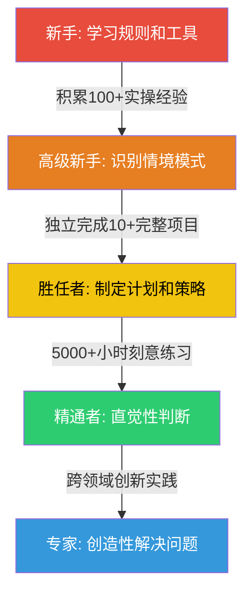
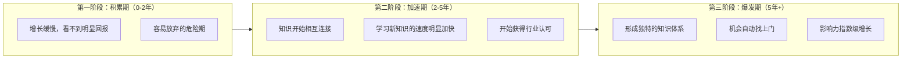

## 六、职业发展理论

理论不是空中楼阁——它是经过验证的路径图，帮你理解自己当前在哪里、下一步该往哪走、以及为什么有些人的成长速度远超同侪。本节系统梳理七个对网络安全从业者最具指导意义的职业发展理论，每个理论都附带安全领域的具体应用方法和实操建议。

### 6.1 Dreyfus 技能获取模型

Dreyfus 兄弟（Stuart Dreyfus 和 Hubert Dreyfus）在 1980 年提出技能获取五阶段模型，这是理解"从新手到专家"成长路径最经典的框架。该模型的核心洞察是：技能的提升不仅是知识量的增加，更是思维方式的根本转变。

#### 6.1.1 五个阶段详解

**阶段一：新手（Novice）**

新手依赖明确的规则和指令，不具备判断情境的能力。他们需要"照着手册操作"，遇到规则未覆盖的情况就会卡住。

在安全领域，新手的典型表现：

- 照着教程使用 Nmap 扫描，不理解每个参数的含义
- 用 SQLMap 跑注入，但无法解释为什么某个注入点有效
- 按照 CTF Writeup 复现解题过程，换一道题就不会
- 使用 Burp Suite 的默认配置，不知道如何根据目标调整策略

新手阶段通常持续 0-12 个月。关键标志是：你需要别人告诉你"下一步做什么"。

**阶段二：高级新手（Advanced Beginner）**

高级新手开始识别情境模式，能够区分不同场景下应该使用不同的规则。他们开始建立"在什么情况下用什么方法"的模式库，但仍然以规则为主要行动依据。

在安全领域的典型表现：

- 能根据目标的 Web 服务器类型选择相应的扫描策略
- 开始理解不同漏洞类型之间的关联（如 XSS 与 CSRF 的配合）
- 能识别常见的安全架构模式，知道从哪里开始测试
- 参加实战攻防演练时，能完成分配的固定任务

高级新手阶段通常持续 1-3 年。关键标志是：你知道"做什么"，但不一定理解"为什么这样做最优"。

**阶段三：胜任者（Competent）**

胜任者能够主动制定计划和目标，开始从全局视角分析问题。面对复杂环境时，胜任者能区分重要和不重要的信息，做出合理的优先级判断。这个阶段出现了情感投入——胜任者开始对工作结果承担个人责任。

在安全领域的典型表现：

- 能独立制定渗透测试方案，规划测试范围和优先级
- 能识别复杂系统中的攻击面，评估哪些入口点最值得投入精力
- 在红蓝对抗中，能根据蓝队的防御策略实时调整攻击路径
- 能独立撰写有深度的安全评估报告，而不仅仅是列漏洞清单

胜任者阶段通常需要 3-5 年积累。关键标志是：你能制定计划并对结果负责，但面对突发情况时仍需要时间分析。

**阶段四：精通者（Proficient）**

精通者的关键转变是从分析式思维转向直觉式思维。他们能"一眼看出"问题所在，因为大量经验已经内化为模式识别能力。精通者同时具备全局视野——能从整体情境中识别关键因素，然后用分析方法制定具体方案。

在安全领域的典型表现：

- 浏览一个 Web 应用，凭直觉就能感知"这里不太对"
- 能快速判断一个 0day 漏洞的实际影响范围和利用难度
- 在安全事件响应中，能迅速定位关键证据，还原攻击全链条
- 能预判攻击者的行为模式，在蓝队防御中做到"未卜先知"

精通者阶段通常需要 5-8 年积累。关键标志是：你的直觉往往是正确的，你用分析来验证直觉而非从零开始分析。

**阶段五：专家（Expert）**

专家超越了规则和直觉的层次，进入创造性解决问题的境界。他们不只是应用已知方法，而是能发明新方法。专家的判断往往是整体性的、非分析性的——他们"就是知道"应该怎么做，就像大师棋手的棋感。

在安全领域的典型表现：

- 发现全新的攻击向量或漏洞类别，而非仅利用已知漏洞
- 设计出突破行业标准的安全架构
- 在极端复杂和不确定的场景中（如国家级 APT 对抗）做出正确判断
- 能将安全知识迁移到完全陌生的领域（如 IoT、量子计算）并快速建立攻击模型
- 创造性地组合多种技术，产生 1+1>2 的效果

专家阶段通常需要 8-10 年以上的持续精进。关键标志是：你不再受限于已有框架，能创造新的框架。

#### 6.1.2 阶段转换的关键瓶颈

| 转换路径 | 核心瓶颈 | 突破方法 |
|---------|---------|---------|
| 新手→高级新手 | 不会区分情境 | 大量接触不同类型的靶场环境，刻意练习模式识别 |
| 高级新手→胜任者 | 被动执行，缺乏主见 | 主动承担项目负责人角色，参与完整的渗透测试项目 |
| 胜任者→精通者 | 分析式思维太慢 | 深度复盘每次攻防经验，建立直觉模式库 |
| 精通者→专家 | 直觉固化，缺乏创新 | 接触跨领域知识，挑战根本性假设 |

#### 6.1.3 安全从业者的 Dreyfus 实操路线



**关键原则：阶段不能跳过，但可以加速。** 加速的核心方法是在每个阶段刻意寻找超出当前能力 10-20% 的挑战——太简单没有成长，太困难产生挫败。具体来说：

- 新手期：不要只做教程练习，尝试修改教程中的参数看会发生什么
- 高级新手期：不要只完成分配的任务，主动问"如果攻击者不走这条路呢"
- 胜任期：不要只关注技术细节，开始思考"这个漏洞对业务的实际影响是什么"
- 精通期：不要只依赖经验直觉，定期挑战自己的假设
- 专家期：不要只在安全领域思考，从其他学科寻找灵感

### 6.2 舒适区理论与学习区管理

心理学家 Lev Vygotsky 提出的"最近发展区"（Zone of Proximal Development）概念，后来被广泛应用于职业发展领域，形成了通俗的"三区理论"。

#### 6.2.1 三个区域的定义与识别

**舒适区（Comfort Zone）**：你已经熟练掌握的技能和知识范围。在这个区域里，一切都是可预测的，你做事高效且没有压力。

舒适区的陷阱：
- 重复执行相同类型的任务（比如永远只做 Web 渗透，不碰内网）
- 使用相同的工具集而不尝试新工具
- 在同一个技术栈里打转
- 工作十年，但第一年的经验重复了九次

**学习区（Learning Zone）**：略超出你当前能力的范围。在这里你感到一定的挑战和不适，但通过努力可以理解和掌握。这是成长发生的地方。

学习区的信号：
- 做某件事时需要有意识地思考，而非自动化执行
- 遇到问题需要查阅资料或请教他人
- 完成任务的速度比舒适区慢，但你能感受到进步
- 偶尔犯错，但能从错误中学到东西

**恐慌区（Panic Zone）**：远超你当前能力的范围。在这里你感到严重的焦虑和无助，大脑进入应激状态，学习效率急剧下降。

恐慌区的信号：
- 完全不理解任务要求，不知道从哪里开始
- 持续的挫败感和自我怀疑
- 无法从错误中提取有意义的经验
- 产生逃避心理（拖延、找借口不做）

#### 6.2.2 安全从业者的三区实例

| 阶段 | 舒适区 | 学习区 | 恐慌区 |
|-----|--------|--------|--------|
| 入门(0-1年) | 按教程操作已知工具 | 尝试新工具、新类型的靶场 | 直接参加实战攻防演练 |
| 初级(1-3年) | Web 渗透的基本流程 | 内网渗透、代码审计 | 逆向工程 APT 样本 |
| 中级(3-5年) | 标准渗透测试项目 | 漏洞挖掘、安全架构设计 | 独立负责企业整体安全体系 |
| 高级(5年+) | 常规安全运营 | 0day 研究、安全产品创新 | 领导国家级安全应急响应 |

#### 6.2.3 学习区管理的实操方法

**方法一：挑战梯度法**

将大目标分解为一系列渐进式小挑战，每个小挑战比上一个略难。例如学习二进制漏洞利用的梯度：

1. 用 pwn 靶场练习基础栈溢出（ret2text）
2. 学习 ROP 链构造（ret2libc）
3. 绕过 ASLR（信息泄露 + 部分覆盖）
4. 绕过 Canary（泄露 Canary 值）
5. 绕过 Full RELROP（格式化字符串 + GOT 覆写）
6. 堆利用入门（unlink、tcache poisoning）
7. 内核漏洞利用基础
8. 真实软件的 CVE 复现

每个步骤都是对上一个步骤的 10-20% 延伸，避免一步跳到恐慌区。

**方法二：80/20 时间分配**

将每周的学习时间按以下比例分配：
- 80% 用于学习区内容（有挑战但可以完成）
- 20% 用于复习和巩固舒适区内容（防止技能退化）
- 每月尝试 1-2 次略入恐慌区的内容（拓展边界）

**方法三：配对学习**

找一个水平略高于你的伙伴一起练习。对方的存在会自然地将任务难度调整到你的学习区——既不会因为太简单而无聊，也不会因为太难而挫败。

**方法四：刻意不适**

每周给自己安排一个"不舒服任务"：
- 如果你擅长 Web，本周尝试一个内网靶场
- 如果你习惯 GUI 工具，本周只用命令行
- 如果你总是单打独斗，本周参加一次团队 CTF
- 如果你只做攻击，本周尝试做一次防御（写检测规则）

### 6.3 复利效应与知识积累

爱因斯坦（据传）说过："复利是世界第八大奇迹。"这个在金融领域被反复引用的概念，在技能学习领域同样成立，甚至更加显著。

#### 6.3.1 安全领域复利效应的机制

安全知识的复利效应来源于三个核心机制：

**机制一：知识网络效应**

每一个新知识点都不是孤立存在的，它会与你已有的知识形成连接。已有的知识越多，新知识能建立的连接就越多，理解深度和记忆强度就越强。

具体例子：
- 学习 Web 安全时理解了 HTTP 协议 → 后来学 API 安全时直接跳过协议基础，聚焦安全特性
- 学习网络渗透时掌握了 TCP/IP 协议栈 → 后来学无线安全、IoT 安全时能快速理解底层通信机制
- 学习逆向工程时理解了内存布局 → 后来学 WebAssembly 安全、浏览器安全时拥有天然优势
- 学习密码学时理解了数学基础 → 后来学区块链安全、零知识证明时事半功倍

**机制二：技能迁移效应**

在一个领域掌握的思维模式和方法论，可以迁移到看似不相关的领域。

迁移例子：
- 渗透测试中的"攻击面枚举"思维 → 用于安全架构评审
- CTF 中的"快速原型验证"能力 → 用于漏洞研究中的 PoC 开发
- 恶意软件分析中的"行为模式识别" → 用于威胁情报分析
- 代码审计中的"数据流追踪" → 用于 DevSecOps 中的 SAST 规则编写

**机制三：声誉积累效应**

在安全行业，技术声誉是复利增长的。早期的一篇高质量博文、一个开源工具、一次成功的演讲，会在后续几年持续带来机会（猎头联系、会议邀请、合作请求）。这些机会又进一步扩大你的声誉和能力，形成正向循环。

#### 6.3.2 复利曲线的三个阶段



**第一阶段：积累期（0-2 年）**

这是复利曲线中最平坦的阶段，也是最多人放弃的阶段。你在大量输入知识，但还没有足够的存量来产生连接。感觉像是在黑暗中挖隧道——看不到尽头。

这个阶段的正确心态是：接受"看不到效果"是正常的，重点是确保每天都在积累，而不是评估"值不值得继续"。

**第二阶段：加速期（2-5 年）**

知识网络达到临界密度后，新知识的学习速度开始指数增长。你发现很多新概念"一看就懂"，因为底层原理你已经掌握。同时，你的实操能力开始产生可感知的成果——挖到第一个有价值的漏洞、获得第一次安全社区认可、收到第一份有竞争力的 offer。

**第三阶段：爆发期（5 年+）**

你的知识体系形成独特的结构，别人需要从零学习的东西，你能从已有知识中快速推导。你的行业声誉开始产生"被动收入"效应——好的机会主动找到你，而不是你去找机会。

#### 6.3.3 如何最大化复利效应

**原则一：建立知识连接而非堆积知识碎片**

每学一个新知识点，强迫自己回答三个问题：
1. 这和我已经知道的哪些东西有关联？
2. 这个知识可以应用在哪些场景？
3. 如果我教给别人，我会怎么解释？

**原则二：选择具有长期价值的基础知识**

并非所有知识的"复利率"相同。基础知识的复利率最高，因为它们是上层知识的根基。

高复利率知识（优先投入）：
- 操作系统原理（进程、内存管理、系统调用）
- 网络协议栈（TCP/IP、HTTP/HTTPS、DNS、TLS/SSL）
- 密码学基础（对称/非对称加密、哈希、数字签名）
- 编程语言原理（编译、解释、内存模型、类型系统）
- 数据结构与算法

低复利率知识（按需学习）：
- 特定工具的使用技巧（会随版本更新而过时）
- 特定厂商的安全产品配置（会随产品更替而失效）
- 特定 CVE 的利用细节（有生命周期，会随修复而贬值）

**原则三：保持连续性**

复利的最大敌人是中断。中断意味着知识遗忘（根据艾宾浩斯遗忘曲线，不复习的知识一个月后仅剩 20%），而且重新开始时需要额外的"启动成本"。

实操建议：
- 每天至少投入 30 分钟，保持连续性比偶尔爆发更重要
- 建立固定的学习时间（如每天早起 1 小时或通勤时间）
- 用间隔重复工具（Anki）维护已学知识的记忆强度
- 建立个人知识库（Obsidian、Notion），记录学习笔记和知识连接

### 6.4 T 型技能模型

T 型技能模型最早由 McKinsey 在 20 世纪 80 年代提出，后来被 IDEO 等设计公司广泛推广。在安全领域，这个模型被证明是规划技术能力结构的最佳框架之一。

#### 6.4.1 T 型模型的结构

```text
广度（横向）：了解安全领域的各个方向
━━━━━━━━━━━━━━━━━━━━━━━━━━━━━━━━━━━━━━━━━━━━━━
Web安全 | 内网渗透 | 逆向工程 | 云安全 | 移动安全 | 安全运营 | ...
                                                          |
深度（纵向）：                    你的专长方向             |
                                                          |
                                                           ▼
                                                    漏洞挖掘
                                                    ████████████
                                                    ████████████
                                                    ████████████
                                                    ████████████
```

**横杠（广度）**：对安全领域多个方向有基本了解。这不是"什么都会一点"的浅尝辄止，而是具备足够的知识来理解其他方向的人在说什么，能在跨方向协作中有效沟通。

**竖杠（深度）**：在一个方向上有深入的专业能力。这是你的核心竞争力，是别人付费请你做事的理由。

#### 6.4.2 安全从业者的 T 型发展路径

**阶段一：建立广度（0-2 年）**

先广泛接触安全领域的各个方向，了解它们的基本概念、核心工具、典型工作内容。这个阶段的目标不是精通任何方向，而是：

- 知道每个方向"在做什么"
- 识别自己对哪些方向有兴趣和天赋
- 建立全局视野，理解各方向之间的关系

建议做法：
- 完成各方向的入门 CTF 题（Web、Crypto、Reverse、Pwn、Misc）
- 阅读各方向的经典入门书籍各一本
- 参加安全社区活动，听不同方向的分享
- 尝试不同类型的安全实习或兼职项目

**阶段二：选择深挖方向（2-3 年）**

根据兴趣、天赋和市场需求，选择一个方向作为自己的主攻方向。选择标准：

- **兴趣**：你愿意在没有报酬的情况下也投入时间研究的领域
- **天赋**：你比大多数人学得更快、理解更深的方向
- **市场**：有明确的岗位需求和薪资回报
- **壁垒**：入门门槛较高，不是短期培训就能替代的

**阶段三：深度突破（3-5 年）**

在选定的方向上持续深挖，目标是达到行业前 20% 的水平。这个阶段需要：

- 该方向的完整知识体系（不只是工具使用，还有底层原理）
- 能独立发现和解决该方向的新问题
- 在该方向上有可展示的成果（漏洞发现、工具开发、论文发表）
- 被该方向的同行认可为"靠谱的专业人士"

**阶段四：扩展为 π 型或梳型（5 年+）**

在主攻方向达到一定深度后，开始培养第二个（甚至第三个）有深度的方向，形成 π 型技能结构。这在安全领域特别有价值，因为很多突破性工作发生在方向的交叉地带：

- Web 安全 + 密码学 = 区块链安全
- 逆向工程 + 机器学习 = AI 恶意软件检测
- 内网渗透 + 云安全 = 云环境攻防
- 移动安全 + IoT = 智能设备安全

#### 6.4.3 常见误区

**误区一：广而不精（倒 T 型）**

什么都学一点，什么都不深入。这种人在面试中能说出很多名词，但无法在任何一个方向上展示深度。

诊断方法：问自己"如果有人出钱请我做某个方向的项目，我能独立交付吗？"如果答案是否，说明深度不够。

**误区二：精而不广（竖线型）**

只在自己的方向上深耕，对其他方向一无所知。这种人在独立工作时能力很强，但在团队协作中经常出现沟通障碍。

诊断方法：问自己"我能和 Web 开发工程师讨论他们的安全需求吗？我能理解运维团队的痛点吗？"如果答案是否，说明广度不够。

### 6.5 刻意练习理论

心理学家 K. Anders Ericsson 通过研究小提琴手、象棋手、运动员等领域的顶尖高手，提出了"刻意练习"（Deliberate Practice）理论。这个理论挑战了"天赋决定论"，证明卓越表现主要来源于高质量的训练而非天生才能。

#### 6.5.1 刻意练习的四个核心要素

**要素一：明确的、超出当前能力的目标**

不是"今天练渗透"这种模糊目标，而是"今天用 3 种不同方法绕过同一个 WAF"这种具体目标。目标必须略超出你当前的舒适区。

**要素二：全神贯注的投入**

心不在焉的练习等于没有练习。Ericsson 的研究表明，顶尖选手每天真正高质量的练习时间通常不超过 4 小时。关键是专注度，不是时长。

**要素三：即时反馈**

你需要知道自己做得对不对、哪里可以改进。没有反馈的练习是在巩固错误。

**要素四：大量重复和修正**

知道正确方法后，通过重复将它内化为自动化技能。每次重复都针对上一次发现的弱点进行修正。

#### 6.5.2 安全领域的刻意练习方法

**方法一：靶场刻意练习法**

不是"把靶场打完"就完了，而是：

1. 选择一个超出当前能力 10-20% 的靶场或挑战
2. 不看任何提示，独立尝试 30-60 分钟
3. 记录自己的思路过程和卡住的地方
4. 查看提示或 Writeup，找到自己的思路盲区
5. 不看提示重新做一遍，确保完全理解
6. 用文字记录"为什么这个方法有效"以及"我的思路哪里出了问题"
7. 一周后不看笔记重新做一遍，验证是否内化

**方法二：漏洞分析刻意练习法**

选取公开的 CVE 漏洞报告：

1. 只看漏洞描述，不看 PoC，尝试自己构造利用方法
2. 如果 1 小时内无法完成，查看 PoC 但不运行，先理解原理
3. 自己从零编写 PoC（不复制粘贴）
4. 分析这个漏洞的根本原因——是设计缺陷还是实现缺陷？
5. 思考：有哪些类似的功能可能存在同样的问题？
6. 写一篇技术分析，发布到博客或安全社区

**方法三：代码审计刻意练习法**

1. 选择一个中小型开源项目（5000-20000 行代码）
2. 不使用自动化工具，纯手工审计
3. 按照数据流追踪的方法，从入口点追踪到敏感操作
4. 记录所有可疑点，但不急于下结论
5. 对每个可疑点编写测试用例验证
6. 完成后用工具扫描，对比自己的发现率
7. 分析"工具找到了但自己漏掉的"和"自己找到但工具漏掉的"

#### 6.5.3 关于"一万小时"的真相

Ericsson 的研究经常被简化为"一万小时定律"，但实际情况更加复杂：

- 一万小时是该领域顶尖选手的平均训练量，不是一个魔法数字
- 关键不是小时数，而是训练质量。低质量的一万小时可能不如高质量的三千小时
- 不同子领域的"精通门槛"不同。Web 安全入门相对快，二进制安全需要更长时间
- 一万小时指的是高质量的刻意练习，不包括开会、写报告、处理邮件等工作时间

### 6.6 双阶梯职业模型

在安全行业，技术人员面临一个经典的职业岔路口：继续走技术路线，还是转向管理路线？双阶梯模型（Dual Career Ladder）为这个选择提供了分析框架。

#### 6.6.1 技术阶梯 vs 管理阶梯

| 维度 | 技术阶梯 | 管理阶梯 |
|-----|---------|---------|
| 核心价值 | 解决最难的技术问题 | 通过团队解决更大的问题 |
| 影响力方式 | 深度（单个问题的极致解决方案） | 广度（协调多人完成系统工程） |
| 评价标准 | 技术成果的质量和影响力 | 团队的产出和成长 |
| 典型职位路径 | 安全研究员→首席研究员→Fellow | 安全工程师→安全经理→CSO/CISO |
| 收入天花板 | 顶级技术专家：年薪 150-300 万 | CISO：年薪 200-500 万 |
| 职业风险 | 技术过时、被更年轻的专家替代 | 管理失当、政治斗争 |
| 工作满足感 | 来源于解决技术难题的成就感 | 来源于团队成长和组织影响力 |
| 时间分配 | 70%+ 技术工作 | 70%+ 沟通、协调、决策 |

#### 6.6.2 如何选择

**适合走技术路线的特征：**

- 对技术问题有强烈的好奇心和钻研欲
- 能够长时间独立思考和工作
- 对"管理人"这件事没有热情，甚至觉得麻烦
- 更看重个人技术成就而非团队规模
- 能接受较长的"默默无闻"积累期

**适合走管理路线的特征：**

- 善于沟通，能协调不同背景的人合作
- 对组织运作和战略规划有兴趣
- 能在信息不完整的情况下做出决策
- 享受培养团队成员成长的过程
- 能平衡多方利益相关者的诉求

#### 6.6.3 安全行业的特殊性

安全行业的双阶梯有一个独特之处：技术路线的天花板比很多其他技术领域更高。原因如下：

- 安全对抗的本质决定了技术能力永远稀缺——防御者需要比攻击者更强
- 高级安全技术人才（如能发现 0day 的研究员）的市场供给极其有限
- 安全产品公司需要技术领军人物作为核心竞争力
- 很多安全公司的 CTO/首席科学家就是顶级技术专家，兼具技术深度和战略视野

因此，安全行业的技术人员不必急于转向管理。一条可行的路径是：先在技术路线上建立深厚的根基（5-8 年），然后再根据个人偏好选择继续深耕技术或者转型管理。而且，即使是管理岗位（如 CISO），深厚的技术背景也是不可替代的优势。

#### 6.6.4 第三条路：技术领导力

近年来，安全行业出现了越来越多"技术领导力"角色——不需要直接管理人，但通过技术影响力引领团队方向：

- **首席安全架构师**：制定技术架构标准和最佳实践
- **安全研究员/Scientist**：专注前沿研究，产出论文和专利
- **技术布道师（Technical Evangelist）**：在行业传播技术思想和方法论
- **独立安全顾问**：以个人品牌和专业能力为多家企业提供咨询服务

这条路适合那些既不想放弃技术深度，又希望产生更大影响力的人。

### 6.7 技能叠加理论

技能叠加（Skill Stacking）是由 Scott Adams（《呆伯特》漫画作者）推广的概念。核心思想是：你不需要在单一技能上成为世界顶级，但可以通过组合多个"前 25%"的技能来创造独特的竞争力。

#### 6.7.1 为什么叠加比单点突破更有效

在安全领域，成为某个单一方向的全球 Top 1% 需要极端的天赋和时间投入，而且竞争者众多。但如果你能在两到三个相关方向上都达到前 25%，你的组合能力可能是独一无二的。

具体对比：

**单点突破路径**：Web 安全 Top 1% → 与全球数千名顶尖 Web 安全研究员竞争 → 只有少数人能脱颖而出

**技能叠加路径**：Web 安全（前 25%）+ 云安全（前 25%）+ 安全写作能力（前 25%）→ 成为"能写清楚云原生 Web 安全问题"的专家 → 竞争对手极少

#### 6.7.2 高价值技能组合

以下是一些在安全领域经过验证的高价值技能组合：

**组合一：技术 + 写作**

能够在技术深度和可读性之间找到平衡的安全写作者极其稀缺。这类人的博客、书籍、技术报告能产生巨大的行业影响力，同时也能为企业输出高质量的安全文档。

代表人物：很多知名安全博主和安全图书作者都是这个组合。

**组合二：安全 + 开发**

既能发现安全问题，又能开发工具来解决安全问题的人。这个组合的价值在于：你不仅知道"问题是什么"，还能"动手解决"。

典型产出：开源安全工具、自动化渗透测试平台、安全检测引擎。

**组合三：安全 + 业务理解**

不仅从技术角度理解安全问题，还能从业务风险的角度解释安全问题的商业影响。这个组合让你能够有效说服决策层投入安全资源。

典型角色：安全顾问、CISO、安全产品经理。

**组合四：攻防 + 教学**

不仅自己能做安全，还能教会别人做安全。安全培训市场巨大，而真正有深度又善于教学的人并不多。

典型产出：安全课程、培训讲师、安全社区领袖。

**组合五：逆向 + AI/ML**

能用机器学习方法分析恶意软件、检测异常行为、自动化漏洞发现。这个交叉领域目前人才极度稀缺。

典型应用：AI 驱动的威胁检测、自动化恶意软件分类、智能 fuzzing。

#### 6.7.3 构建个人技能栈的实操步骤

**第一步：盘点现有技能**

列出你目前掌握的所有技能，评估每个技能的水平（前 50%、前 25%、前 10%、前 5%）。

**第二步：识别组合机会**

找出你已经有前 25% 水平的技能，思考哪个第二技能的叠加能创造最大价值。

**第三步：制定学习计划**

为第二技能制定 6-12 个月的学习计划。目标不是从零到精通，而是达到前 25% 的"够用"水平。

**第四步：验证市场价值**

在安全社区、招聘市场、行业会议中观察：你这个技能组合是否有人需要？是否有人已经占据这个位置？

**第五步：持续迭代**

当核心技能组合稳定后，开始发展第三个技能点，形成更独特的个人定位。

### 6.8 职业生命周期理论

借鉴产品生命周期和行业生命周期的框架，安全从业者的职业生涯也可以划分为几个典型阶段。每个阶段有不同的核心任务、主要挑战和关键决策。

#### 6.8.1 四个阶段

**阶段一：探索期（0-2 年）**

核心任务：找到适合自己的安全方向，建立基本功。

主要挑战：
- 信息过载，不知道从哪里开始
- 看到高手的差距容易焦虑和自卑
- 不确定自己是否适合这个领域

关键决策：选择主攻方向（Web/内网/逆向/云安全等）。

成功标志：能独立完成一个中等难度的渗透测试或安全项目。

**阶段二：成长期（2-5 年）**

核心任务：在选定方向上快速成长，建立专业声誉。

主要挑战：
- 技术瓶颈期，感觉自己进步变慢
- 工作和学习的时间分配矛盾
- 在团队中找到自己的定位

关键决策：选择技术路线还是管理路线。

成功标志：在专业方向上有可展示的成果（漏洞发现、工具开发、技术分享），获得行业认可。

**阶段三：成熟期（5-10 年）**

核心任务：成为领域专家，产生行业影响力。

主要挑战：
- 避免"舒适区陷阱"——用已有经验吃饭而不继续成长
- 技术深度和管理责任的平衡
- 新技术浪潮（AI 安全、量子安全等）的适应

关键决策：深耕技术 vs 转向管理 vs 创业。

成功标志：在行业内有稳定的个人品牌和专业声誉，有选择权。

**阶段四：收获期（10 年+）**

核心任务：将积累转化为更大的影响力和价值。

主要挑战：
- 避免成为"过时的专家"——技术在变，思维方式也要变
- 如何将个人能力转化为组织能力（培养团队）
- 如何从"做事的人"变成"做决策的人"

关键决策：继续在组织内发展 vs 创业 vs 独立咨询 vs 行业领袖。

成功标志：你的名字就是某个方向的"代名词"，机会主动找你。

#### 6.8.2 阶段间的转换信号

判断你是否应该进入下一阶段的信号：

- 当前阶段的任务对你来说已经缺乏挑战性
- 你开始对当前工作感到无聊或倦怠
- 你的学习曲线明显变平
- 身边同阶段的人都已经在转变
- 市场对你的期望已经开始超出当前阶段

转换期的注意事项：

- 不要操之过急——在当前阶段没有充分积累就跳到下一阶段，会导致根基不稳
- 不要过于保守——明明准备好了却迟迟不敢迈步，会错过最佳窗口期
- 转换期通常伴随收入的短期波动或职位的暂时"降级"，这是正常的投资成本

### 6.9 理论的综合应用

以上七个理论不是独立存在的，它们从不同维度描述了同一个成长过程。将它们组合起来，可以形成一个完整的职业发展指导框架。

#### 6.9.1 理论间的对应关系

| 你的状态 | Dreyfus 模型 | 舒适区 | 复利效应 | T 型模型 |
|---------|-------------|--------|---------|---------|
| 刚入行 | 新手 | 恐慌区边缘 | 积累期 | 建立广度 |
| 工作 2 年 | 高级新手→胜任者 | 学习区中心 | 积累→加速过渡 | 选择深度方向 |
| 工作 5 年 | 胜任者→精通者 | 舒适区边缘外推 | 加速期 | 深度突破 |
| 工作 8 年+ | 精通者→专家 | 持续在学习区 | 爆发期 | 扩展为 π 型 |

#### 6.9.2 个人发展规划模板

用以下模板制定你的年度职业发展计划：

```markdown
## 年度职业发展规划

### 当前定位
- Dreyfus 阶段：______
- T 型模型阶段：______
- 舒适区边界：______
- 复利效应阶段：______

### 本年度目标
1. 主攻方向的深化目标：______
2. 广度扩展目标：______
3. 技能叠加目标：______

### 季度里程碑
Q1: ______
Q2: ______
Q3: ______
Q4: ______

### 刻意练习计划
- 每周练习时间：______ 小时
- 练习内容：______
- 反馈来源：______

### 舒适区管理
- 舒适区内的任务（维持）：______
- 学习区的任务（增长）：______
- 恐慌区的挑战（拓展）：______
```

#### 6.9.3 本节核心要点回顾

1. **Dreyfus 模型**告诉你当前处于哪个成长阶段以及下一阶段的突破点
2. **舒适区理论**帮你管理学习难度，确保持续在高效成长区
3. **复利效应**让你理解为什么前期积累缓慢但后期会爆发，以及如何最大化这个效应
4. **T 型模型**帮你规划技能结构——先广后深，然后扩展为 π 型
5. **刻意练习**提供高质量训练的方法论——有目标、有反馈、有重复
6. **双阶梯模型**帮你在技术路线和管理路线之间做出理性选择
7. **技能叠加**告诉你如何通过组合多个"前 25%"技能创造独特竞争力
8. **职业生命周期**帮你预判各阶段的核心任务和关键决策点

理论的价值不在于记住它们，而在于用它们来诊断自己的状态、规划下一步行动。如果你读完本节后能清晰地回答"我现在在哪里、我下一步该往哪走、我该怎么做"，那么这些理论就完成了它们的使命。
