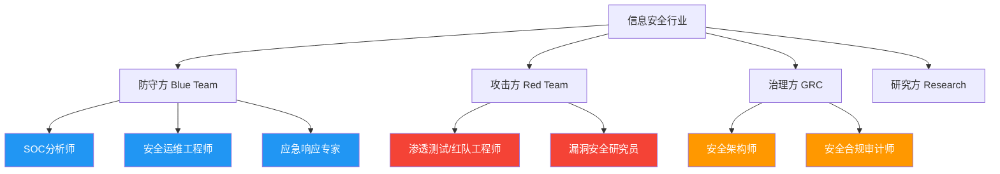
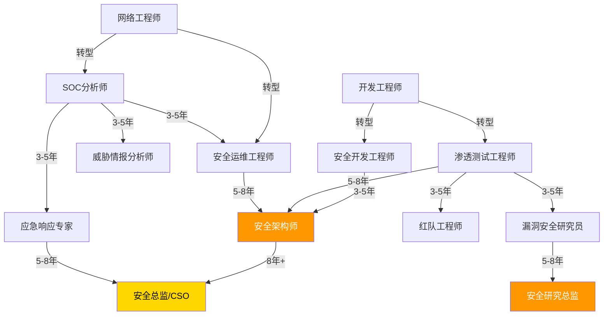

## 七、各安全岗位详细能力要求

信息安全行业涵盖多个细分方向，每个方向对从业者的知识结构、技术深度和软技能要求各不相同。本章从七大核心安全岗位出发，逐一拆解其职责定位、能力模型、工具栈、成长路径和薪资区间，帮助读者建立清晰的职业画像。

### 7.0 七大岗位全景对照

在深入每个岗位之前，先通过一张对照表建立全局认知：

| 维度 | SOC分析师 | 安全运维工程师 | 渗透测试/红队工程师 | 漏洞安全研究员 | 应急响应专家 | 安全架构师 | 安全合规审计师 |
|------|----------|--------------|-------------------|--------------|------------|----------|--------------|
| 核心职能 | 监控、检测、分诊 | 防御体系建设与维护 | 模拟攻击、发现弱点 | 深度漏洞研究与利用 | 事件处置与取证 | 安全体系顶层设计 | 合规评估与审计 |
| 技术深度 | 中等 | 中等 | 高 | 极高 | 高 | 高（广度优先） | 中等 |
| 技术广度 | 高 | 高 | 中等 | 低-中（专精方向） | 高 | 极高 | 中等 |
| 编程要求 | 脚本级 | 脚本级 | 中高级 | 高级 | 中级 | 中级 | 低 |
| 沟通要求 | 中等 | 低-中 | 中等 | 低 | 极高 | 高 | 极高 |
| 典型认证 | Security+, GCIA | PCNSA, CCNP Sec | OSCP, GPEN | GREM, OSED | GCIH, GCFA | CISSP, TOGAF | CISA, ISO LA |
| 入行门槛 | 较低 | 较低 | 中等 | 较高 | 中等 | 较高 | 中等 |
| 薪资区间(月) | 8-40K | 10-45K | 15-60K | 20-80K+ | 15-50K | 30-80K+ | 12-50K |



### 7.1 SOC分析师（安全运营中心分析师）

SOC（Security Operations Center）是企业安全防御体系的神经中枢，SOC分析师是安全事件的第一道防线。这个岗位的核心价值在于——再先进的安全设备，也需要人来判断告警的真伪、评估事件的严重程度、决定响应的优先级。

#### 7.1.1 岗位层级与职责

**L1 SOC分析师（初级，0-2年经验）**

L1是SOC的"眼睛和耳朵"，负责7×24小时监控安全设备产生的告警。工作内容看似重复，但扎实的L1经验是后续所有安全职业的基础。

核心职责：
- 监控SIEM告警面板，按照预定义的分类标准对告警进行初步分诊（Triage）
- 区分真实安全事件与误报（False Positive），将误报反馈给规则维护团队优化检测规则
- 对确认的安全事件按标准操作流程（SOP）进行初步处置，如封禁恶意IP、隔离受感染终端
- 记录安全事件工单，确保时间线、影响范围、处置动作等关键信息完整
- 执行威胁情报查询：根据IP、域名、文件哈希等IOC在VirusTotal、AlienVault OTX、微步在线等平台查询关联信息
- 编写每日/每周安全运营报告，包括告警趋势、事件统计、待跟进事项

技能要求：
- 网络协议基础：理解TCP/IP三次握手与四次挥手过程，能看懂HTTP请求/响应的头部字段，了解DNS解析流程和常见DNS攻击类型（DNS劫持、DNS隧道）
- 操作系统日志：熟悉Windows安全日志（Event ID 4624登录成功、4625登录失败、4720账户创建等关键事件ID），熟悉Linux的/var/log/auth.log、/var/log/syslog等日志位置和格式
- SIEM工具操作：掌握Splunk的SPL查询语法（至少能写基本的search、stats、timechart命令），或ELK Stack的KQL查询；能创建仪表板和告警规则
- 常见攻击类型识别：能识别暴力破解（短时间内大量登录失败）、端口扫描（SYN扫描特征）、钓鱼邮件（发件人伪装、URL异常）、恶意软件通信（C2心跳包特征）等常见攻击模式
- 脚本能力：能用Bash编写简单的日志处理脚本，能用Python进行基础的数据解析和API调用

**L2 SOC分析师（中级，2-5年经验）**

L2处理L1无法解决的复杂事件，需要具备深入调查和关联分析能力。从"看到告警"升级到"理解攻击全貌"。

核心职责：
- 深入调查L1升级的安全事件，还原攻击者的完整行为链
- 关联多个告警源和数据源（SIEM日志、EDR遥测、网络流量、威胁情报），构建攻击时间线
- 进行恶意软件初步分析：通过静态分析（查看PE头、字符串、导入表）和动态分析（沙箱运行、行为监控）判断恶意软件类型和功能
- 编写和优化SIEM检测规则，将新的攻击模式转化为可检测的规则逻辑
- 参与威胁狩猎（Threat Hunting）：基于假设驱动的主动搜索，例如"如果攻击者已经通过钓鱼邮件进入了内网，我们能从哪些日志中发现痕迹？"

技能要求：
- 网络流量分析：能使用Wireshark进行深度包分析，理解TCP流重组、HTTP/HTTPS流量分析、DNS查询模式分析
- 恶意软件行为分析：了解常见恶意软件家族的行为特征（如勒索软件的文件加密行为、远控木马的键盘记录和屏幕截图功能），能使用Any.Run、Joe Sandbox等在线沙箱
- MITRE ATT&CK框架：熟悉ATT&CK的战术和技术分类，能将实际攻击行为映射到ATT&CK矩阵，用于检测覆盖率评估和攻击面分析
- 高级SIEM能力：能编写复杂的关联规则（如"同一源IP在5分钟内触发3个不同战术的告警"），理解SIEM的性能优化（索引策略、数据保留策略）

**L3 SOC分析师（高级/专家，5年以上经验）**

L3是SOC的技术天花板，负责处理最复杂的安全事件，推动检测能力的持续演进。

核心职责：
- 处理APT（高级持续性威胁）事件：APT攻击者通常使用零日漏洞、合法工具（Living off the Land）、加密通信等高级技术，需要L3具备深度调查能力
- 进行深度威胁狩猎：基于威胁情报报告、行业通告或自身经验，主动搜索尚未触发告警的隐蔽攻击行为
- 开发自动化检测和响应工具：用Python/Go开发自动化脚本或平台功能，提升SOC运营效率（如自动化IOC enrichment、自动化事件分诊）
- 指导L1/L2分析师的技术成长，建设团队知识库和SOP文档
- 参与安全架构评审，从SOC运营视角提出检测和监控需求

技能要求：
- 威胁情报分析：能理解战术级、运营级和战略级情报的区别，能将情报转化为检测能力
- APT组织跟踪：了解主要APT组织（如APT28、APT29、Lazarus Group）的TTP，能跟踪其演变
- 安全工具开发：具备用Python/Go开发安全工具的能力
- 事件指挥能力：在重大安全事件中担任事件指挥官（Incident Commander），协调多个团队的响应动作

#### 7.1.2 SOC分析师的工具栈

| 类别 | 工具 | 用途 |
|------|------|------|
| SIEM | Splunk、IBM QRadar、Microsoft Sentinel、ELK Stack | 日志聚合、告警管理、关联分析 |
| EDR | CrowdStrike Falcon、Carbon Black、Microsoft Defender for Endpoint | 终端行为监控、恶意软件检测 |
| 威胁情报 | VirusTotal、微步在线、AlienVault OTX、MISP | IOC查询、情报共享 |
| 网络分析 | Wireshark、Zeek(Bro)、NetworkMiner | 流量捕获和分析 |
| 沙箱 | Any.Run、Joe Sandbox、Cuckoo Sandbox | 恶意软件动态分析 |
| SOAR | Phantom、Demisto(XSOAR)、Shuffle | 安全编排自动化响应 |

#### 7.1.3 SOC分析师的典型工作日

以L2分析师的一天为例，帮助读者建立真实的工作场景认知：

- 09:00-09:30：查看过夜告警摘要，确认是否有高优先级事件需要跟进
- 09:30-11:00：调查一个L1升级的可疑PowerShell执行事件——通过EDR遥测还原命令行参数，发现是攻击者利用混淆的PowerShell下载器（LOLBins技术），关联网络日志确认C2服务器地址，提交IOC到威胁情报平台
- 11:00-12:00：编写一条新的SIEM检测规则，检测利用certutil.exe下载文件的异常行为
- 14:00-16:00：参与威胁狩猎活动，基于近期APT报告中的IOC在SIEM中搜索历史数据，发现一台服务器在两周前曾与已知APT C2地址通信
- 16:00-17:30：编写调查报告，更新事件时间线，与应急响应团队交接

### 7.2 安全运维工程师

安全运维工程师是企业安全防御体系的"建造者和维护者"。如果说SOC分析师是监测火警的监控室，安全运维工程师就是安装和维护消防设备的工程团队。他们的核心工作是确保所有安全设备正常运行、安全策略有效执行、安全基线持续达标。

#### 7.2.1 核心职责详解

**安全设备管理**
- 防火墙策略管理：不仅仅是"开/关端口"，而是需要理解业务流量模式，制定最小权限的访问控制策略。例如，一个Web应用服务器只需要开放80/443端口，数据库服务器只允许来自应用服务器的3306端口访问
- IDS/IPS规则调优：默认规则集通常会产生大量误报，安全运维需要根据业务环境调优规则阈值、添加白名单、禁用不适用的规则
- WAF配置：针对每个Web应用定制WAF规则，平衡安全防护和业务可用性（过于严格的规则会阻断正常业务请求）

**安全策略管理**
- 制定和执行终端安全策略：密码复杂度要求、屏幕锁定策略、USB设备管控、软件安装白名单
- 网络分段策略：将网络划分为不同安全区域（DMZ、内网、管理网），控制区域间的流量
- 补丁管理流程：建立补丁评估、测试、部署的完整流程，确保关键漏洞在SLA时间内修复

**安全监控与运维**
- 监控安全设备的运行状态：CPU/内存使用率、磁盘空间、规则库版本、许可证到期时间
- 安全设备故障应急：防火墙HA切换、IDS传感器故障恢复、日志采集中断排查
- 安全基线检查：定期扫描服务器和终端的安全配置是否符合基线要求

#### 7.2.2 技能要求详解

**网络安全部分**
- 防火墙策略配置：精通Palo Alto、Fortinet FortiGate、华为USG等主流防火墙的策略配置。理解状态检测防火墙的工作原理，能配置NAT规则、VPN隧道（IPSec/SSL VPN）、高可用集群
- IDS/IPS规则管理：理解Snort/Suricata规则语法，能编写自定义检测规则。掌握规则调优方法——通过分析误报原因调整检测阈值、添加条件过滤
- 负载均衡与DDoS防护：了解L4/L7负载均衡的工作原理，能配置WAF和CDN的DDoS防护策略。理解SYN Flood、HTTP Flood、DNS Amplification等攻击的防护方法
- 网络流量分析：能使用Wireshark、tcpdump进行流量捕获和分析，理解NetFlow/sFlow在网络监控中的应用

**终端安全部分**
- EDR部署与管理：了解EDR（Endpoint Detection and Response）的工作原理——通过内核驱动或Agent监控终端行为，将遥测数据发送到云端分析。能配置检测策略、响应动作（隔离终端、终止进程、删除文件）
- 终端安全基线：根据CIS Benchmark等标准制定终端安全配置基线，使用GPO（Windows）或Ansible（Linux）批量下发
- 恶意软件处置：能处理常见的恶意软件感染场景——确认感染范围、隔离受感染终端、清除恶意文件和注册表项、修复被修改的系统配置、验证清除彻底性

**云安全部分**
- 云平台安全配置：理解AWS Security Group与NACL的区别（SG是有状态的实例级防火墙，NACL是无状态的子网级防火墙），能配置Azure NSG、阿里云安全组
- 容器安全：了解容器逃逸的原理和防护方法，能配置镜像扫描（Trivy、Clair）、运行时安全（Falco）、Pod安全策略（Kubernetes Pod Security Standards）
- CSPM工具：使用云安全态势管理工具（如AWS Security Hub、Azure Security Center、Prisma Cloud）持续评估云环境的安全配置是否符合最佳实践

#### 7.2.3 认证路径

| 阶段 | 认证 | 定位 |
|------|------|------|
| 入门 | CompTIA Security+、CCNA Security | 建立安全基础概念和网络基础 |
| 中级 | CISP（注册信息安全专业人员）、CISSP（信息系统安全专业认证）、PCNSA（Palo Alto认证网络安全管理员） | 证明专业能力和行业认可 |
| 高级 | CCNP Security、PCNSE（Palo Alto认证网络安全专家）、CKS（Kubernetes安全专家） | 技术深度证明 |

#### 7.2.4 安全运维的常见误区

**误区一：只管设备不管策略**
很多安全运维工程师把精力花在确保设备"不宕机"上，却忽略了策略的有效性。一个配置了默认规则的防火墙和没有防火墙几乎没有区别——因为默认规则通常是"允许所有"。

纠正方法：建立定期策略审查机制，每季度审查一次防火墙规则，删除不再需要的规则，收紧过于宽松的规则。使用"零信任"思维——默认拒绝所有流量，只允许明确需要的通信。

**误区二：补丁管理拖延症**
"生产环境不能随便打补丁"是常见的借口，但实际上不打补丁的风险远大于打补丁的风险。WannaCry勒索病毒爆发时，微软早在两个月前就发布了对应补丁（MS17-010），大量未及时修补的系统被感染。

纠正方法：建立分级补丁管理流程——紧急补丁（在野利用的零日漏洞）24小时内部署，重要补丁一周内部署，普通补丁在月度维护窗口部署。先在测试环境验证，再逐步推广到生产环境。

### 7.3 渗透测试与红队工程师

渗透测试工程师（Penetration Tester）和红队工程师（Red Team Operator）是安全行业中"以攻促防"的核心角色。虽然两者都模拟攻击者的行为，但存在本质区别：渗透测试以覆盖面为目标，在有限时间内尽可能多地发现漏洞；红队以达成特定目标为目标（如获取域管理员权限、窃取敏感数据），模拟真实APT攻击者的全流程行为。

#### 7.3.1 岗位层级与职责

**初级渗透测试工程师（0-2年）**
- 在高级工程师指导下执行渗透测试任务
- 使用自动化工具（Nmap、Nessus、Burp Suite）进行漏洞扫描
- 验证扫描发现的漏洞是否可利用
- 编写渗透测试报告，描述漏洞详情和修复建议
- 在靶机环境（HackTheBox、TryHackMe）中持续练习

技能要求：
- 扎实的网络基础：理解TCP/IP协议栈、子网划分、路由原理
- Web安全基础：理解OWASP Top 10漏洞类型（SQL注入、XSS、CSRF、文件上传、命令注入等），能使用Burp Suite进行手动测试
- 操作系统基础：熟悉Windows和Linux的命令行操作、用户管理、权限模型
- 工具使用：熟练使用Nmap进行端口扫描和服务识别，使用Nessus/OpenVAS进行漏洞扫描，使用Metasploit进行基本的漏洞利用
- 报告编写：能清晰描述漏洞的技术细节、复现步骤、风险等级和修复建议

**中级渗透测试工程师（2-5年）**
- 独立负责渗透测试项目，从信息收集到报告交付全流程
- 能够进行内网渗透测试：域渗透、横向移动、权限提升
- 掌握至少一个专业方向的深度技术（Web、内网、移动应用）
- 能够绕过基础的安全防御措施（WAF、IDS、EDR）
- 指导初级工程师的技术成长

技能要求：
- 内网渗透技术：理解Active Directory的认证机制（Kerberos协议），掌握常见的AD攻击手法（Kerberoasting、AS-REP Roasting、Pass-the-Hash、Golden Ticket）
- 权限提升：熟悉Windows和Linux的本地提权方法（SUID滥用、内核漏洞、服务配置错误、Token窃取）
- Web安全深入：掌握Java反序列化、PHP代码执行、SSRF到RCE的利用链、JWT安全等高级Web漏洞
- 绕过技术：理解WAF的工作原理，掌握常见的WAF绕过方法（编码变换、参数污染、分块传输）

**高级渗透测试工程师/红队工程师（5年以上）**
- 主导大型渗透测试项目和红队演练
- 开发自定义的攻击工具和C2框架
- 绕过高级安全防御（EDR、AMSI、AppLocker）
- 能够模拟特定APT组织的攻击手法
- 参与安全架构评审，从攻击者视角提出安全改进建议

技能要求：
- 高级红队技术：C2框架开发和定制（Cobalt Strike、Sliver、自研C2）、EDR绕过（Unhooking、Direct Syscalls、Kernel Callbacks清除）、AMSI绕过（内存补丁、DLL劫持）
- 漏洞利用开发：能够针对发现的漏洞编写可靠的利用代码，处理不同环境下的兼容性问题
- 社会工程：理解钓鱼攻击的技术实现（邮件伪造、宏代码投递、HTML Smuggling）
- OPSEC意识：了解防御方的检测能力，确保攻击行动不被发现（流量加密、域名前置、合法服务滥用）

#### 7.3.2 渗透测试的标准流程

一个完整的渗透测试项目通常包含以下阶段：


**阶段一：授权与范围确认**
这是法律层面的关键步骤。渗透测试必须获得书面授权（授权书/合同），明确测试范围（IP范围、域名、应用）、测试时间窗口、禁止操作（如禁止进行DoS测试、禁止访问生产数据库）、紧急联系人。没有授权的渗透测试就是非法入侵。

**阶段二：信息收集**
信息收集的质量直接决定后续攻击的成败。被动信息收集（不与目标直接交互）包括：WHOIS查询、DNS记录枚举、搜索引擎信息收集（Google Dorking）、GitHub代码泄露搜索、社交媒体信息收集。主动信息收集包括：端口扫描（Nmap）、服务版本识别、Web应用指纹识别（Wappalyzer）、子域名爆破（Subfinder、Amass）、目录爆破（Gobuster、Feroxbuster）。

**阶段三：漏洞扫描与分析**
使用自动化工具（Nessus、Nuclei、Burp Suite Scanner）进行漏洞扫描，但自动化工具只能发现已知漏洞模式。需要结合人工分析发现逻辑漏洞（如越权访问、业务逻辑绕过）。

**阶段四：漏洞利用与渗透**
将发现的漏洞转化为实际的系统访问。这一阶段需要处理很多实际问题：漏洞利用代码在目标环境上的兼容性、防御设备的干扰（WAF阻断、EDR终止进程）、利用链的构建（从一个低危漏洞逐步获取更高权限）。

**阶段五：后渗透与横向移动**
获取初始访问权限后，进一步扩大战果：权限提升（从普通用户提升到管理员）、凭证收集（从内存中提取密码哈希、从浏览器/文件中查找保存的密码）、横向移动（利用获取的凭证访问其他系统）、持久化（创建后门账户、计划任务、WMI事件订阅）。

**阶段六：报告编写与交付**
渗透测试报告是最终交付物，一份好的报告应该包含：执行摘要（面向管理层，说明整体风险水平）、技术详情（面向技术团队，包含漏洞的完整复现步骤）、风险评估（CVSS评分、业务影响分析）、修复建议（具体可操作的修复方案，而不是"建议加强安全"这样的废话）。

#### 7.3.3 渗透测试工具栈

| 类别 | 工具 | 用途 |
|------|------|------|
| 信息收集 | Nmap、Subfinder、Amass、Shodan、Censys、theHarvester | 端口扫描、子域名枚举、互联网资产搜索 |
| Web测试 | Burp Suite、sqlmap、XSStrike、ffuf | Web漏洞扫描和利用 |
| 漏洞扫描 | Nessus、Nuclei、OpenVAS | 自动化漏洞扫描 |
| 漏洞利用 | Metasploit、Cobalt Strike、Sliver、pwntools | 漏洞利用和后渗透 |
| 密码攻击 | Hashcat、John the Ripper、CrackMapExec | 密码破解和凭证利用 |
| 社会工程 | GoPhish、Evilginx2 | 钓鱼攻击模拟 |
| 操作系统 | Kali Linux、Parrot OS | 渗透测试专用操作系统 |

#### 7.3.4 红队与渗透测试的区别

| 维度 | 渗透测试 | 红队演练 |
|------|---------|---------|
| 目标 | 尽可能多地发现漏洞 | 达成特定攻击目标（如获取域控） |
| 时间 | 1-4周 | 2-8周甚至更长 |
| 范围 | 明确的测试范围 | 可能包括物理入侵、社会工程 |
| 对蓝队 | 通常不通知蓝队 | 蓝队完全不知情（全面测试检测能力） |
| 检测规避 | 不特别关注 | 核心要求（OPSEC） |
| 报告重点 | 漏洞列表和修复建议 | 攻击路径和防御差距分析 |

### 7.4 漏洞安全研究员

漏洞安全研究员是信息安全领域技术深度最高的岗位之一。他们的工作是发现软件和系统中尚未被公开的安全漏洞（零日漏洞），并研究如何利用这些漏洞。这个岗位需要极强的底层技术功底、耐心和创造力。

#### 7.4.1 核心职责详解

**漏洞研究与发现**
- 对目标软件进行深度安全审计，发现未知漏洞
- 开发漏洞概念验证代码（PoC），证明漏洞的可利用性
- 编写漏洞分析报告，描述漏洞的根因、影响范围和修复建议
- 参与漏洞赏金计划（Bug Bounty），在HackerOne、Bugcrowd等平台提交漏洞

**漏洞利用开发**
- 将发现的漏洞转化为可靠的利用代码（Exploit）
- 处理不同环境下的兼容性问题（不同操作系统版本、不同编译选项）
- 绕过各种漏洞利用缓解措施（ASLR、DEP、CFG、Shadow Stack）

**研究成果输出**
- 在安全会议（Black Hat、DEF CON、POC、KCon）上发表演讲
- 在学术期刊或技术博客上发表研究论文
- 将研究成果转化为检测规则，帮助防御方提升检测能力

#### 7.4.2 技能要求详解

**逆向工程能力**
- 汇编语言：精通x86/x64汇编，能够阅读和理解编译器生成的机器代码。理解函数调用约定（cdecl、stdcall、fastcall）、栈帧结构、异常处理机制
- 反编译工具：熟练使用IDA Pro（业界标准的反汇编器）、Ghidra（NSA开源的逆向工具，反编译效果优秀）、Binary Ninja（现代化的逆向平台）
- 动态调试：掌握GDB（Linux调试器，配合GEF/pwndbg插件提升效率）、WinDbg（Windows内核调试器）、x64dbg（Windows用户态调试器）
- 文件格式：深入理解ELF（Linux可执行文件）、PE（Windows可执行文件）、Mach-O（macOS可执行文件）的内部结构，能手动解析节表、导入表、重定位表

**漏洞挖掘技术**
- 模糊测试（Fuzzing）：理解基于变异的Fuzzing（对已有输入进行随机变异）和基于生成的Fuzzing（根据输入格式规范生成测试用例）。掌握主流Fuzzer如AFL++、LibFuzzer、Honggfuzz的使用和定制
- 静态分析：能使用CodeQL、Semgrep等工具编写自定义的安全查询规则，在源代码中搜索特定的漏洞模式
- 符号执行：理解符号执行的原理，能使用angr等框架进行自动化漏洞挖掘
- 内存破坏漏洞：精通各种内存破坏漏洞类型——栈溢出、堆溢出、Use-After-Free、Double Free、类型混淆、整数溢出

**漏洞利用开发**
- 栈溢出利用：从最基础的覆盖返回地址，到ROP（Return-Oriented Programming）链构造，理解如何在开启DEP（数据执行保护）的环境中执行任意代码
- 堆利用技术：理解glibc malloc的实现机制（chunk结构、bins链表、tcache），掌握常见的堆利用手法（House of系列技术）
- 绕过缓解措施：ASLR绕过（信息泄露、部分覆盖）、Stack Canary绕过（泄露canary值、格式化字符串漏洞泄露）、CFI（Control Flow Integrity）绕过
- 内核漏洞利用：理解Windows/Linux内核的内存管理机制，掌握内核提权漏洞的利用方法（Token窃取、SMEP/SMAP绕过）

#### 7.4.3 研究方向细分

漏洞安全研究是一个高度专业化的领域，研究者通常需要选择一个方向深入：

| 方向 | 研究对象 | 典型成果 | 代表人物/团队 |
|------|---------|---------|-------------|
| Web安全研究 | 浏览器引擎、Web框架、JavaScript引擎 | Chrome V8引擎漏洞、Spring框架RCE | Google Project Zero |
| 二进制安全研究 | 操作系统、应用软件、内核 | Windows内核提权、Office格式漏洞 | 360 Vulcan Team |
| IoT安全研究 | 路由器、摄像头、工业控制系统 | 固件提取和分析、协议逆向 | SENRIO实验室 |
| 移动安全研究 | Android/iOS系统、移动应用 | 系统提权漏洞、沙箱逃逸 | 腾讯玄武实验室 |
| 密码学研究 | 密码算法实现、密码协议 | 侧信道攻击、Padding Oracle攻击 | 密码学顶级会议论文 |

#### 7.4.4 漏洞赏金实战建议

对于想进入漏洞研究领域的新人，Bug Bounty是一个极好的实践平台：

- 选择合适的平台：HackerOne和Bugcrowd是国际主流平台，国内有补天、漏洞盒子。建议先从补天开始，中文环境更容易上手
- 选择合适的目标：不要一开始就挑战Google、Apple这样的大厂，它们的漏洞已经被无数人反复挖掘。选择中小型但有赏金计划的公司，竞争较小
- 关注业务逻辑漏洞：自动化工具已经能发现大部分技术漏洞（SQL注入、XSS），但业务逻辑漏洞（如优惠券重复使用、订单金额篡改、越权访问他人数据）需要人工分析，是高价值漏洞的富矿
- 保持耐心和纪律：漏洞研究可能几周甚至几个月都没有收获，这是正常的。建立系统化的研究流程，每次研究都做好笔记，积累经验

### 7.5 应急响应专家

应急响应专家是安全事件发生时的"消防队长"。他们的核心价值在于——在最短时间内控制事件影响范围、恢复业务运行、保留取证证据、找出根因并防止再次发生。这个岗位对技术能力、沟通能力和抗压能力都有极高的要求。

#### 7.5.1 核心职责详解

**事件响应**
应急响应遵循业界标准的PICERL流程（Preparation准备→Identification识别→Containment遏制→Eradication根除→Recovery恢复→Lessons Learned总结），每个阶段都有具体的工作内容和注意事项。

**数字取证**
取证分析是应急响应的技术基础，需要在不破坏证据完整性的前提下，从各种数字介质中提取和分析证据。

**威胁溯源**
通过分析攻击者的TTP（战术、技术和过程），追踪攻击者的身份和动机，评估事件的严重程度和影响范围。

#### 7.5.2 技能要求详解

**事件响应能力**
- PICERL流程精通：准备阶段包括建立事件响应团队、准备取证工具包、制定响应预案；识别阶段包括确认事件真实性、评估严重程度、确定事件类型；遏制阶段包括短期遏制（隔离受感染主机、封禁恶意IP）和长期遏制（修补漏洞、加强监控）；根除阶段包括清除恶意软件、删除后门账户、修复被篡改的配置；恢复阶段包括恢复业务系统、持续监控确认攻击者未返回；总结阶段包括编写事后报告、更新检测规则和响应流程
- 网络取证：能从网络流量中提取攻击证据——分析PCAP文件中的C2通信、数据外泄流量、横向移动痕迹
- 内存取证：能从内存转储（Memory Dump）中提取运行中的进程列表、网络连接、注册表键值、加密密钥、恶意代码片段

**数字取证能力**

| 取证类型 | 核心工具 | 分析内容 |
|---------|---------|---------|
| 磁盘取证 | FTK、EnCase、Autopsy、X-Ways | 文件恢复、时间线分析、注册表分析、浏览器历史 |
| 内存取证 | Volatility 3、Rekall | 进程列表、网络连接、DLL加载、恶意代码注入 |
| 网络取证 | Wireshark、NetworkMiner、Zeek | 流量分析、会话重组、文件提取、协议分析 |
| 日志分析 | Splunk、ELK、LogParser | 事件关联、行为时间线、异常检测 |
| 移动取证 | Cellebrite UFED、Magnet AXIOM | 通话记录、短信、应用数据、位置信息 |

**Volatility内存取证实战示例**

Volatility是内存取证领域最核心的开源工具。以下是一个典型的内存取证分析流程：

```bash
# 1. 识别内存镜像的操作系统类型和版本
vol3 -f memory.dmp windows.info

# 2. 列出所有运行中的进程，寻找异常进程
vol3 -f memory.dmp windows.pslist
# 关注：父子进程关系异常（如word.exe创建了cmd.exe）
# 关注：路径异常（如在Temp目录下的可执行文件）
# 关注：名称伪装（如svch0st.exe，用数字0替代字母o）

# 3. 查看进程的命令行参数
vol3 -f memory.dmp windows.cmdline
# 攻击者常用的PowerShell混淆命令会在这里留下痕迹

# 4. 查看网络连接，识别C2通信
vol3 -f memory.dmp windows.netstat
# 关注：外部IP连接、非常用端口、已知恶意IP

# 5. 列出加载的DLL，寻找DLL注入
vol3 -f memory.dmp windows.dlllist --pid <可疑进程PID>

# 6. 提取恶意文件样本
vol3 -f memory.dmp windows.filescan | grep <可疑文件名>
vol3 -f memory.dmp windows.dumpfiles --virtaddr <文件虚拟地址>
```

**沟通协调能力**

应急响应专家的沟通能力和技术能力同等重要，因为他们需要在高压环境下与多个利益相关方沟通：

- 向CEO/CTO汇报：用业务语言解释事件影响——"客户数据泄露可能影响10万用户，预计合规罚款XXX万元，建议立即启动危机公关"
- 与法务团队协调：确保证据保全符合法律要求，配合律师评估法律风险
- 与公关团队协作：对外口径统一，避免信息泄露引发二次危机
- 与执法机构合作：在中国可向公安机关网安部门报案，需要提供规范的电子证据链
- 编写事件报告：技术报告详细记录攻击时间线、IOC、根因分析和改进建议

#### 7.5.3 应急响应的常见误区

**误区一：急于恢复系统而忽略取证**
业务部门总是催促尽快恢复系统，但如果不先做内存转储和磁盘镜像，攻击者的痕迹就会永久丢失。

正确做法：在遏制阶段先进行"活取证"——在系统关机前捕获内存镜像（使用WinPmem或LiME），记录当前的网络连接和运行进程。然后做磁盘镜像（使用dd或FTK Imager），最后才进行系统恢复。

**误区二：只处理症状不找根因**
清除恶意文件是必要的，但如果不找出攻击者是如何进来的，他们还会用同样的方法再次入侵。

正确做法：在根除阶段，必须回答以下问题——攻击者的初始入口是什么（钓鱼邮件？漏洞利用？弱密码？）→ 攻击者利用了哪些漏洞或配置缺陷 → 这些漏洞是否在其他系统上也存在 → 如何防止同类攻击再次发生。

### 7.6 安全架构师

安全架构师是信息安全领域的"总设计师"，负责从顶层设计企业或产品的安全体系。这个岗位要求既有深厚的技术功底，又有宏观的战略视野，能够在安全需求和业务需求之间找到最优平衡点。

#### 7.6.1 核心职责详解

**安全架构设计**
- 设计企业整体安全架构，包括网络安全架构、应用安全架构、数据安全架构、身份安全架构
- 制定安全技术标准和规范，如加密算法选型标准、安全编码规范、密钥管理规范
- 评审系统和应用的安全设计，在项目早期发现和修复安全缺陷（左移安全）

**安全技术决策**
- 评估新技术和产品的安全影响，为技术选型提供安全建议
- 设计安全架构的演进路线，确保安全能力随业务增长而同步提升
- 处理安全架构中的技术争议，做出合理的技术决策

**安全治理**
- 指导安全团队的技术方向，确保团队的技术投入与安全战略一致
- 与业务部门沟通安全需求，推动安全左移（Shift Left Security）
- 参与行业安全标准的制定和推广

#### 7.6.2 技能要求详解

**架构设计能力**

零信任架构（Zero Trust Architecture）是当前最主流的安全架构理念。其核心原则是"永不信任，始终验证"——不再依赖网络位置来决定信任关系，每次访问都需要经过身份验证、设备验证和授权。

零信任架构的关键组件：
- 身份提供者（IdP）：统一管理用户身份，支持多因素认证（MFA）
- 策略引擎（Policy Engine）：根据用户身份、设备状态、访问上下文（时间、地点、行为）动态决定是否授权
- 策略执行点（PEP）：在网络层面执行访问控制决策，可以是SDP网关或API网关
- 微隔离（Micro-segmentation）：将网络划分为极细粒度的安全区域，限制横向移动

微服务安全架构的核心关注点：
- 服务间认证（mTLS）：使用双向TLS确保服务间通信的身份真实性
- API安全：API网关的认证授权、速率限制、输入验证
- 密钥管理：使用Vault等密钥管理服务统一管理密钥和证书
- 容器安全：镜像安全扫描、运行时安全监控、Pod安全策略

**安全标准和框架**

| 框架/标准 | 定位 | 核心内容 |
|----------|------|---------|
| NIST CSF | 网络安全框架 | 识别、保护、检测、响应、恢复五大功能 |
| ISO 27001/27002 | 信息安全管理体系 | ISMS建立、实施、维护和持续改进 |
| TOGAF | 企业架构框架 | 业务架构、数据架构、应用架构、技术架构 |
| SABSA | 安全架构框架 | 分层安全架构设计方法论 |
| PCI DSS | 支付卡行业数据安全标准 | 处理、存储或传输信用卡数据的安全要求 |
| 等保2.0 | 中国网络安全等级保护 | 分级保护、安全建设和测评 |

**技术广度要求**

安全架构师需要对安全的各个子领域都有深入理解，但不需要在每个方向都是最顶尖的专家：

- 网络安全：防火墙策略设计、IDS/IPS部署架构、网络分段方案、DDoS防护体系
- 应用安全：SAST（静态代码分析）、DAST（动态应用测试）、IAST（交互式应用测试）的集成方案，DevSecOps流水线设计
- 数据安全：数据分类分级、加密方案设计（传输加密、存储加密、密钥管理）、DLP（数据防泄漏）策略、数据脱敏方案
- 身份安全：IAM（身份和访问管理）架构、PAM（特权访问管理）方案、SSO（单点登录）实现、RBAC/ABAC权限模型设计

#### 7.6.3 安全架构师的核心产出物

安全架构师的主要工作产出包括：
- 安全架构蓝图：描述企业安全体系的整体结构，包括各安全组件之间的关系和数据流
- 安全技术标准：定义企业在各技术领域的安全要求和规范
- 安全设计评审报告：对具体项目的安全设计进行评审，指出风险和改进建议
- 安全架构演进路线图：规划未来2-3年的安全能力建设路径

### 7.7 安全合规审计师

安全合规审计师是信息安全治理体系的"守门人"。他们的核心工作是评估企业的安全控制措施是否符合法规、标准和行业规范的要求，识别合规差距，并推动整改。在数据保护法规日趋严格的今天（中国的《数据安全法》《个人信息保护法》、欧盟的GDPR），合规审计师的需求持续增长。

#### 7.7.1 核心职责详解

**合规评估与审计**
- 根据适用的法规和标准，评估企业的安全控制措施是否满足要求
- 进行现场审计，通过访谈、文档审查、技术测试等方式收集审计证据
- 识别合规差距，评估差距的风险等级
- 编写审计报告，描述发现的问题、风险评估和整改建议

**合规整改支持**
- 协助企业制定合规整改方案，明确整改措施、责任人和时间表
- 跟踪整改进度，验证整改措施的有效性
- 在企业准备正式审计（如ISO 27001认证审计）前进行预审计

**合规持续管理**
- 跟踪法规和标准的变化，评估变化对企业合规状态的影响
- 维护合规文档体系（策略、流程、记录）
- 开展合规培训，提升全员合规意识

#### 7.7.2 主要合规标准详解

**等级保护2.0（等保2.0）**

等保是中国网络安全的基本制度，所有在中国运营的信息系统都需要按照等级保护要求进行安全建设。等保2.0将信息系统分为五个安全保护等级（一级自主保护→五级专控保护），大多数企业系统属于二级或三级。

等保2.0的安全要求分为十大类：安全物理环境、安全通信网络、安全区域边界、安全计算环境、安全管理中心、安全管理制度、安全管理机构、安全管理人员、安全建设管理、安全运维管理。每个类别下有详细的技术要求和管理要求。

三级等保的核心要求包括：
- 身份鉴别：登录失败处理（账户锁定）、双因素认证
- 访问控制：最小权限原则、默认拒绝
- 安全审计：审计日志保存至少6个月、审计记录不可篡改
- 入侵防范：网络入侵检测、恶意代码防范
- 数据完整性/保密性：传输和存储过程中的数据保护

**ISO 27001**

ISO 27001是国际认可的信息安全管理体系（ISMS）标准。其核心思想是通过建立、实施、维护和持续改进ISMS，系统化地管理信息安全风险。

ISO 27001认证审计通常分两个阶段：
- 第一阶段（文档审查）：审核ISMS文档是否符合标准要求
- 第二阶段（现场审核）：验证ISMS的实际运行是否符合文档描述

**GDPR（通用数据保护条例）**

GDPR适用于处理欧盟居民个人数据的所有组织，不论组织是否在欧盟境内。GDPR的核心要求包括：
- 数据处理的合法性基础（同意、合同、法律义务等）
- 数据主体权利（访问权、更正权、删除权、可携带权）
- 数据保护影响评估（DPIA）
- 数据泄露通知（72小时内通知监管机构）

#### 7.7.3 审计技能详解

**审计方法论**

合规审计通常遵循以下流程：

1. 审计计划制定：确定审计范围、标准、时间表、资源需求
2. 审计准备：收集相关文档（安全策略、系统架构图、以往审计报告），制定审计检查清单
3. 现场审计：通过访谈（了解实际操作流程）、文档审查（验证文档的完整性和准确性）、技术测试（验证技术控制的有效性）、观察（观察实际操作是否符合流程）收集审计证据
4. 审计发现分析：将审计证据与标准要求进行比对，识别差距和不符合项
5. 审计报告编写：描述审计发现、风险评估、整改建议
6. 整改跟踪：跟踪整改进度，验证整改效果

**证据收集与保全**

审计证据的质量直接决定审计结论的可信度。审计证据应该满足以下要求：
- 充分性：证据数量足以支持审计结论
- 适当性：证据与审计目标相关
- 可靠性：证据来源可信，不易被篡改

#### 7.7.4 行业合规差异化要求

不同行业有额外的合规要求：

| 行业 | 特殊合规要求 | 核心关注点 |
|------|------------|----------|
| 金融行业 | 等保三级+、PCI DSS、银保监会监管要求 | 交易安全、客户数据保护、业务连续性 |
| 医疗行业 | HIPAA、等保三级+、医疗数据安全管理办法 | 患者隐私保护、医疗设备安全 |
| 政府机构 | 等保三级/四级、涉密信息系统分级保护 | 国家秘密保护、政务数据安全 |
| 互联网行业 | 个人信息保护法、数据安全法、APP合规 | 用户隐私保护、数据跨境传输 |
| 教育行业 | 等保二级+、教育数据安全规范 | 学生信息保护、在线教育平台安全 |

### 7.8 职业转型路径与跨岗位发展

安全行业的各个岗位之间并非完全割裂，很多从业者会在职业生涯中转型到不同的方向。以下是常见的转型路径：



**转型建议**

- SOC→应急响应：最自然的转型路径。SOC的告警分析和事件分诊经验是应急响应的基础，需要补充取证分析和事件管理能力
- 渗透测试→红队：技术深度的提升。渗透测试关注漏洞发现，红队关注完整的攻击链和OPSEC，需要补充C2框架使用、防御绕过和社会工程能力
- 开发→安全开发/渗透测试：开发背景在安全领域是巨大优势。理解代码逻辑让安全测试更高效，理解安全漏洞让开发更安全
- 运维→安全运维/安全架构：运维背景对安全运维岗位有天然优势。理解系统运维让安全策略更贴近实际，需要补充安全工具和安全框架知识
- 任何方向→安全架构师：安全架构师通常需要在安全的多个子领域都有实践经验，建议先在某个方向积累深度，再逐步扩展广度

### 7.9 本节小结

七大安全岗位构成了信息安全行业的核心岗位体系。每个岗位都有其独特的价值和不可替代性：

- **SOC分析师**是安全防御的"第一道防线"，通过持续监控和告警分诊确保安全事件不被遗漏
- **安全运维工程师**是安全基础设施的"建造者"，确保安全设备和策略的有效运行
- **渗透测试/红队工程师**是"以攻促防"的实践者，通过模拟攻击发现防御体系的薄弱环节
- **漏洞安全研究员**是安全技术的"最前沿"，发现和研究未知漏洞推动整个行业的安全水平提升
- **应急响应专家**是安全事件的"消防队长"，在危机时刻控制影响、恢复业务、保留证据
- **安全架构师**是安全体系的"总设计师"，从顶层设计确保安全与业务的平衡发展
- **安全合规审计师**是安全治理的"守门人"，确保企业满足法规和标准的要求

选择哪个方向，取决于个人的技术兴趣、能力特长和职业目标。无论选择哪个方向，扎实的基础知识（网络、操作系统、编程）都是必不可少的。在此基础上，选择一个方向深入，逐步建立自己的专业壁垒，是安全从业者最现实的职业发展策略。
