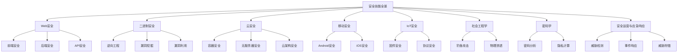
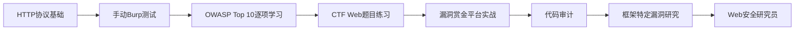
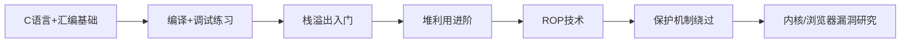
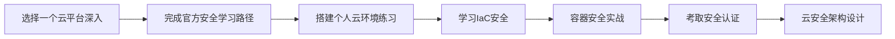

## 八、安全技能树详解

安全领域涵盖面极广，从Web应用到内核漏洞，从云原生到物联网，从社会工程学到密码学——没有任何一个人能在所有方向上同时精通。理解安全技能树的全貌，有助于你找到自己的定位，规划学习路径，避免盲目学习导致的"样样通、样样松"。

本章将安全领域拆解为八大技能树，每棵树从基础到进阶逐层展开，帮助你建立完整的知识地图。

### 8.0 安全技能全景图

各技能树之间并非孤立存在。Web安全与云安全高度重叠（云原生应用本身就是Web应用），二进制安全是所有漏洞利用的底层基础，密码学贯穿加密通信、身份认证、数据保护的每个环节，社会工程学则是绕过所有技术防线的"最后一公里"。选择主攻方向时，建议以一棵树为主干，再根据职业需要嫁接其他树枝。

---

### 8.1 Web安全技能树

Web安全是入门门槛最低、岗位需求最大的安全方向。绝大多数初级安全岗位（渗透测试工程师、安全服务工程师、Web安全研究员）都以Web安全为核心技能。

#### 8.1.1 基础知识层

**HTTP/HTTPS协议**是Web安全的根基。你需要掌握的不仅是"GET和POST的区别"，而是：

- HTTP请求的完整生命周期：DNS解析 → TCP握手 → TLS握手 → 请求发送 → 服务端处理 → 响应返回
- 请求头和响应头中每个安全相关字段的含义：`Content-Security-Policy`、`X-Frame-Options`、`Strict-Transport-Security`、`Set-Cookie`的`HttpOnly`/`Secure`/`SameSite`属性
- HTTP方法的安全语义：PUT/DELETE/PATCH/OPTIONS在RESTful API中的权限含义
- HTTP/2和HTTP/3带来的新攻击面：头部压缩导致的CRIME/BREACH攻击、多路复用带来的资源耗尽风险

**前端技术**（HTML/CSS/JavaScript）：不要求你成为前端工程师，但必须能读懂JavaScript代码，理解DOM操作、事件处理、同源策略、CORS机制。这些是理解XSS、CSRF等漏洞的前提。

**服务端语言**（PHP/Java/Python/Go）：至少精通一门，了解两到三门。重点不是语法，而是各语言的安全特性：

| 语言 | 安全特性 | 常见陷阱 |
|------|---------|---------|
| PHP | `htmlspecialchars()`输出编码、`PDO`参数化查询 | `eval()`、`unserialize()`、`include`路径穿越、旧版本默认不安全 |
| Java | `PreparedStatement`、Spring Security框架 | 反序列化漏洞（Apache Commons Collections）、OGNL表达式注入、JNDI注入 |
| Python | Django ORM自动参数化、`mark_safe`标记 | `pickle`反序列化、`eval()`/`exec()`、Jinja2 SSTI |
| Go | 原生不支持动态代码执行、`html/template`自动转义 | `fmt.Sprintf`拼接SQL、路径穿越（`filepath.Clean`不够） |

**数据库**：理解SQL注入的原理，前提是你理解SQL的执行模型。掌握MySQL、PostgreSQL的权限模型和存储过程安全，了解MongoDB等NoSQL数据库的注入方式（`$gt`、`$ne`操作符注入）。

**Web服务器**：Nginx/Apache的配置安全——目录遍历、路径解析差异（Nginx的`alias`配置错误导致路径穿越）、反向代理配置不当导致的内网访问。

#### 8.1.2 漏洞类型层

**OWASP Top 10（2021版）**是Web安全的核心知识框架，但仅了解分类远远不够，每个类别下需要掌握：

**注入漏洞**：
- SQL注入：联合查询注入、布尔盲注、时间盲注、堆叠注入、带外注入（DNS/HTTP外带）
- NoSQL注入：MongoDB的JSON注入、操作符注入
- OS命令注入：管道符`|`、反引号`` ` ``、`$()`、分号`;`等注入方式，以及Windows与Linux的差异
- LDAP注入：`*`通配符注入、过滤器逻辑绕过

关键理解点：注入漏洞的本质是"数据被当作代码执行"。所有防御措施（参数化查询、输入验证、最小权限）都围绕"分离数据和代码"这一原则展开。

**认证漏洞**：
- 弱密码和默认凭据：为什么`admin/admin`仍然有效——暴力破解防护缺失
- 会话管理：Session固定攻击、Session劫持、JWT的`alg:none`攻击、JWT密钥混淆（RS256→HS256）
- MFA绕过：SIM交换攻击、TOTP重放、备用代码泄露、OAuth回调劫持

**XSS（跨站脚本）**：
- 反射型XSS：URL参数直接输出到页面
- 存储型XSS：恶意脚本持久化存储在服务端（论坛帖子、用户资料、评论区）
- DOM型XSS：JavaScript直接操作DOM触发，服务端完全无感知（`innerHTML`、`document.write`、`eval`）
- 变种：Mutation XSS（利用浏览器HTML解析差异）、mXSS（DOMPurify绕过案例）

**访问控制**：
- IDOR（不安全的直接对象引用）：`/api/user/123/profile`改为`/api/user/124/profile`即可越权
- 垂直越权：普通用户访问管理员接口
- 水平越权：用户A访问用户B的数据
- 功能级访问控制缺失：前端隐藏了管理按钮，但后端API未做权限校验

**SSRF（服务端请求伪造）**：
- 基础SSRF：通过服务端发起请求访问内网资源
- 盲SSRF：无回显，通过时间延迟或DNS查询判断
- 绕过技巧：`http://127.0.0.1` → `http://[::1]`、`http://0177.0.0.1`（八进制）、`http://0x7f000001`（十六进制）、DNS重绑定、`file://`协议读取本地文件、`gopher://`协议攻击内网Redis/MySQL

**反序列化漏洞**：
- PHP：`unserialize()`触发`__wakeup()`/`__destruct()`魔术方法
- Java：Apache Commons Collections、Fastjson、Jackson反序列化链
- Python：`pickle.loads()`执行任意代码
- Ruby：`Marshal.load()`、`YAML.load()`（非`safe_load`）

#### 8.1.3 工具使用层

工具是手的延伸，但工具背后的理解更重要：

**代理工具**：
- Burp Suite：Web安全测试的事实标准。核心模块——Proxy（拦截修改）、Repeater（手动重放）、Intruder（自动化攻击）、Scanner（漏洞扫描）。Community版免费但功能受限（无Scanner、Intruder限速），Professional版年费约$449
- OWASP ZAP：免费开源替代品。适合预算有限的个人和小型团队。自动化扫描能力不错，但手动测试体验不如Burp

**自动化扫描器**：
- Nuclei：基于YAML模板的漏洞扫描器，社区模板库3000+覆盖常见漏洞。优点是速度快、可定制，缺点是依赖模板质量
- sqlmap：SQL注入自动化利用工具，支持几乎所有数据库类型。核心能力——自动识别注入点、枚举数据库、提取数据、写入Webshell
- Nikto：Web服务器扫描器，检查已知漏洞、配置错误、过期软件

**信息收集**：
- 子域名枚举：Subfinder（被动）、Amass（主动+被动）、SecurityTrails API
- 存活探测：httpx（批量HTTP探测）、masscan（端口扫描）、nmap（服务识别）
- 目录扫描：Gobuster（Go编写，速度快）、Dirsearch（Python，字典丰富）、Ffuf（Fuzzer模式，支持模糊匹配）

**学习建议**：工具会过时，原理不会。先理解HTTP协议和Web架构，再学工具。推荐学习顺序：Burp Suite → sqlmap → Nuclei → Ffuf → 自己写脚本。

#### 8.1.4 防御技术层

Web安全不只是攻击，理解防御才能更好地进攻：

- **输入验证**：白名单优于黑名单，服务端验证优于客户端验证。正则表达式要防御ReDoS（正则表达式拒绝服务）
- **输出编码**：HTML上下文、JavaScript上下文、URL上下文、CSS上下文需要不同的编码方式
- **参数化查询**：永远不要拼接SQL字符串。ORM不是万能的——raw query和`extra()`可能绕过ORM保护
- **WAF配置**：了解ModSecurity、AWS WAF、Cloudflare WAF的规则编写。掌握WAF绕过技术（编码变换、分块传输、HTTP参数污染）反过来帮助你测试WAF的有效性
- **CSP（内容安全策略）**：`Content-Security-Policy`头部的编写，`nonce`和`hash`机制，常见绕过方式（JSONP回调、AngularJS模板注入、base-uri覆盖）

#### 8.1.5 学习路径

推荐练习平台：DVWA（入门）、WebGoat（OWASP官方）、Pikachu（中文）、PortSwigger Web Security Academy（免费在线，质量最高）、Hack The Box Web挑战（进阶）。

---

### 8.2 二进制安全技能树

二进制安全是安全领域技术门槛最高的方向之一，也是薪资天花板最高的方向。顶级漏洞研究、APT分析、内核安全、浏览器安全都以二进制安全为基础。

#### 8.2.1 基础知识层

**C/C++语言**：这是二进制安全的核心语言。你需要深入理解：

- 指针与内存地址的关系：`int *p = &x`在栈上如何布局
- `malloc`/`free`的底层实现：ptmalloc2的bin机制（fastbin、unsorted bin、small bin、large bin）、tcache（glibc 2.26+）
- 栈帧结构：函数调用时的`push ebp`/`mov ebp, esp`、局部变量布局、返回地址位置
- 编译器优化对安全分析的影响：`-O2`优化可能改变栈布局、内联函数消除调用点

**汇编语言**：不需要手写复杂汇编，但必须能流畅阅读x86-64汇编。关键指令集：
- 数据传送：`mov`、`lea`、`push`、`pop`
- 算术运算：`add`、`sub`、`xor`（常用于加密/混淆）
- 控制流：`jmp`、`je`/`jne`、`call`、`ret`
- 系统调用：`syscall`（Linux x86-64）、`int 0x80`（Linux x86）、`svc`（ARM）

**操作系统原理**：
- 虚拟内存管理：页表、TLB、内存映射（`mmap`）
- 进程内存布局：代码段（.text）→ 数据段（.data/.bss）→ 堆（heap）→ 栈（stack）
- 系统调用与用户态/内核态切换
- 动态链接：PLT/GOT机制、LD_PRELOAD劫持

**编译原理**：理解词法分析、语法分析、语义分析、代码生成的基本流程。了解LLVM IR有助于理解跨平台漏洞分析工具（如KLEE符号执行引擎）。

#### 8.2.2 逆向工程层

**静态分析**——不运行程序，通过分析二进制文件结构理解程序逻辑：

- **IDA Pro**：逆向工程的行业标准。核心能力——交互式反汇编、函数识别、交叉引用分析、FLIRT签名识别。支持x86/x64/ARM/MIPS等几乎所有架构。缺点：价格昂贵（Pro版约$1,000+/年）
- **Ghidra**：NSA开源的逆向工具，功能接近IDA Pro，免费。反编译器质量不错，支持协作分析。学习曲线较陡但社区资源丰富
- **Binary Ninja**：现代化UI，API设计优秀，适合自动化分析。价格介于Ghidra（免费）和IDA之间

**动态分析**——运行程序并观察其行为：

- **GDB + 插件**：Linux下的标准调试器。配合`pwndbg`/`GEF`/`peda`插件，可以可视化堆布局、自动分析ROP链、显示寄存器和内存状态
- **WinDbg**：Windows内核和用户态调试的标准工具。`!analyze -v`自动分析崩溃，`!heap`分析堆状态
- **x64dbg**：Windows用户态调试器，UI友好，适合初学者
- **插桩技术**：Intel PIN（动态二进制插桩框架）、Frida（动态插桩工具包，支持iOS/Android/Windows/Linux/macOS）

**文件格式**：
- **ELF**（Linux）：ELF头 → 程序头表 → 节头表。理解`readelf`、`objdump`的输出
- **PE**（Windows）：DOS头 → PE头 → 节表。理解导入表/导出表、重定位表
- **Mach-O**（macOS/iOS）：Header → Load Commands → Sections

#### 8.2.3 漏洞挖掘层

**内存破坏漏洞**——二进制安全的核心：

| 漏洞类型 | 原理 | 利用难度 | 典型案例 |
|---------|------|---------|---------|
| 栈溢出 | 写入超出栈缓冲区边界，覆盖返回地址 | 入门 | Heartbleed的变体、各种CTF题目 |
| 堆溢出 | 写入超出堆缓冲区边界，破坏堆元数据 | 中等 | Chrome tcache poisoning |
| 整数溢出 | 算术运算结果超出整数范围 | 中等 | ImageMagick整数溢出导致堆溢出 |
| 格式化字符串 | `printf(user_input)`中的`%x`/`%n`读写内存 | 入门-中等 | 早期各种服务端程序 |
| Use-After-Free | 释放后继续使用指针 | 较高 | 浏览器DOM对象UAF、内核UAF |
| Double Free | 同一块内存释放两次 | 较高 | tcache double free → 任意地址写 |
| 类型混淆 | 将一种类型对象当作另一种类型处理 | 高 | JavaScript引擎类型混淆（V8） |

**模糊测试（Fuzzing）**——自动化漏洞发现的最有效手段：

- **AFL/AFL++**：覆盖率引导的模糊测试。通过编译时插桩获取代码覆盖率，变异输入探索新路径。AFL++是AFL的社区增强版，支持QEMU模式（无需源码）、字典注入、结构化变异
- **LibFuzzer**：进程内Fuzzer，速度极快（每秒数万次执行），适合库函数测试。需要编写target harness
- **Honggfuzz**：支持硬件反馈（Intel PT），适合系统级Fuzzer

模糊测试的核心技巧：
1. 选择合适的target——优先选择解析器、解码器等处理不可信输入的代码
2. 编写高质量的harness——最小化初始化开销，最大化代码覆盖率
3. 准备种子语料——从功能测试用例、PoC样本中收集
4. 字典/语法感知——为格式化输入（JSON、XML、图片）提供关键字典或语法生成器

**静态分析工具**：
- **CodeQL**：GitHub的语义代码分析引擎。将代码转化为可查询的数据库，编写QL语句查找漏洞模式。支持C/C++/Java/Python/JavaScript等。免费用于开源项目
- **Semgrep**：轻量级静态分析，规则编写简单。支持跨文件分析和污点追踪
- **符号执行**：KLEE（基于LLVM）、angr（Python框架）。将程序中的变量视为符号，探索所有可能的执行路径。理论上能找到所有可达漏洞，但面临路径爆炸问题

#### 8.2.4 漏洞利用层

**基础利用技术**：
- 栈溢出利用：覆盖返回地址 → 跳转到shellcode或system函数
- ROP（Return-Oriented Programming）：利用程序中已有的代码片段（gadgets）拼接执行流，绕过DEP/NX
- Shellcode编写：`execve("/bin/sh", NULL, NULL)`的x86-64汇编实现，注意避免null字节

**防御绕过技术**：

| 防御机制 | 作用 | 绕过方法 |
|---------|------|---------|
| DEP/NX（数据执行保护） | 标记数据页不可执行 | ROP、JIT Spray、mprotect修改权限 |
| ASLR（地址空间布局随机化） | 随机化内存布局 | 信息泄露、部分覆盖（Partial overwrite）、Brute force（32位） |
| Stack Canary（栈保护） | 检测栈溢出 | 泄露canary值、覆盖canary之前的数据、格式化字符串泄露 |
| CFI（控制流完整性） | 限制间接跳转目标 | 利用合法的CFI白名单gadget、类型混淆绕过 |
| 沙箱 | 限制系统调用和资源访问 | 内核漏洞逃逸、利用允许的系统调用组合、共享内存攻击 |

**高级利用领域**：
- **内核漏洞利用**：提权的核心技术。Linux内核利用涉及`commit_creds(prepare_kernel_cred(0))`提权链、`modprobe_path`覆盖、`msg_msg`堆喷射等技术
- **浏览器漏洞利用**：V8引擎类型混淆 → 任意地址读写 → 越狱渲染器沙箱 → 浏览器进程RCE。Chrome的Mojo IPC是新的攻击面
- **虚拟机逃逸**：QEMU/KVM设备模拟层漏洞 → Host OS提权。难度极高但影响巨大
- **固件漏洞利用**：路由器/NAS/IoT设备固件的静态分析和动态调试

#### 8.2.5 学习路径

推荐资源：《Hacking: The Art of Exploitation》（入门）、《The Shellcoder's Handbook》（进阶）、《A Guide to Kernel Exploitation》（内核）、LiveOverflow/John Hammond的YouTube频道（视频教程）、pwn.college（在线练习平台）。

---

### 8.3 云安全技能树

随着企业上云加速，云安全已成为增长最快的安全方向。AWS Certified Security Specialty、Azure Security Engineer等认证的持有者供不应求。

#### 8.3.1 云平台基础

云安全的第一课是理解**共享责任模型**（Shared Responsibility Model）：

- **IaaS**（EC2、ECS）：云厂商负责物理安全和虚拟化层；用户负责OS、应用、数据、网络配置
- **PaaS**（RDS、Lambda）：云厂商负责运行时和中间件；用户负责应用代码和数据
- **SaaS**（Office 365、Salesforce）：云厂商负责大部分安全；用户负责访问控制和数据分类

这意味着在IaaS模式下，配置错误完全由用户承担。AWS S3桶公开泄露、Azure Blob Storage未授权访问——这些都不是云厂商的漏洞，而是用户的配置失误。

**各云平台安全服务对比**：

| 安全领域 | AWS | Azure | GCP | 阿里云 |
|---------|-----|-------|-----|--------|
| 身份管理 | IAM | Azure AD | Cloud IAM | RAM |
| 密钥管理 | KMS | Key Vault | Cloud KMS | KMS |
| 网络安全 | Security Groups / NACLs | NSG / Azure Firewall | VPC Firewall | 安全组 / WAF |
| 日志审计 | CloudTrail | Azure Monitor | Cloud Audit Logs | ActionTrail |
| 漏洞扫描 | Inspector | Defender for Cloud | Security Scanner | 云安全中心 |
| 合规 | Config | Policy | Security Command Center | 合规中心 |

#### 8.3.2 容器安全

容器安全是云安全中实践性最强的子领域：

**Docker安全**：
- **镜像安全**：使用最小基础镜像（`alpine`/`distroless`）、定期扫描已知漏洞（Trivy、Grype）、不使用`latest`标签、验证镜像签名（Docker Content Trust）
- **运行时安全**：不要以root运行容器（`USER`指令）、限制容器能力（`--cap-drop ALL --cap-add`需要的能力）、只读文件系统（`--read-only`）、限制资源（`--memory`、`--cpus`）
- **Dockerfile安全**：不要在镜像中硬编码密钥、使用多阶段构建减小攻击面、最小化安装包数量

**Kubernetes安全**：
- **RBAC配置**：最小权限原则，避免使用`cluster-admin`绑定。审计`RoleBinding`和`ClusterRoleBinding`中的通配符权限
- **Pod安全**：Pod Security Standards（替代已废弃的PodSecurityPolicy）——`Privileged`、`Baseline`、`Restricted`三个级别
- **网络策略**：默认拒绝所有入站/出站流量（`default-deny`），按需开放。Calico、Cilium等CNI支持NetworkPolicy
- **Secret管理**：不要在Pod spec中硬编码Secret，使用外部密钥管理（HashiCorp Vault、AWS Secrets Manager、Sealed Secrets）
- **供应链安全**：验证镜像来源（cosign签名）、准入控制（OPA/Gatekeeper、Kyverno）、运行时监控（Falco）

#### 8.3.3 无服务器安全

Serverless（Lambda/Cloud Functions）带来了新的安全挑战：

- **事件注入**：Lambda通过API Gateway、S3事件、SQS消息等触发。如果函数未验证输入来源和格式，可能遭受注入攻击
- **权限过大**：Lambda默认执行角色常被授予过宽权限（`s3:*`而非`s3:GetObject`特定桶）
- **冷启动攻击**：利用Lambda执行环境的复用特性，在/tmp目录留下持久化数据
- **依赖漏洞**：Lambda Layers和依赖包的已知漏洞管理

#### 8.3.4 云安全架构

**零信任架构**（Zero Trust）的核心原则——"永不信任，始终验证"：

1. **身份验证**：每个请求必须经过身份验证，无论来源是内网还是外网
2. **最小权限**：仅授予完成任务所需的最小权限，Just-In-Time（JIT）权限提升
3. **微分段**：网络不再按"内网/外网"划分，每个工作负载独立隔离
4. **持续验证**：不是一次认证后永久信任，而是持续评估上下文（设备状态、地理位置、行为模式）

**云安全架构设计原则**：
- 加密传输（TLS 1.3）和加密存储（AES-256-GCM），密钥由KMS管理
- 日志全量采集（CloudTrail + VPC Flow Logs + 应用日志），集中分析
- 基础设施即代码（IaC），安全策略通过Terraform/Pulumi/CloudFormation固化，代码审查纳入安全检查
- 自动化合规检查（AWS Config Rules、Azure Policy、GCP Organization Policies）

#### 8.3.5 学习路径

推荐资源：AWS Well-Architected Framework Security Pillar、CloudGoat（AWS漏洞环境）、flAWS.cloud（AWS安全挑战）、Kubernetes Goat（K8s安全练习）。

---

### 8.4 移动安全技能树

移动安全分为Android和iOS两大阵营，两者的安全模型差异显著。

#### 8.4.1 Android安全

**基础知识**：
- Android架构：Linux内核 → HAL → 原生库 → Android Runtime → Framework → 应用层
- 应用组件：Activity、Service、BroadcastReceiver、ContentProvider——每个组件都可能成为攻击面
- 权限模型：运行时权限（Android 6.0+）、Scoped Storage（Android 10+）

**APK逆向分析**：
- 反编译工具：apktool（资源解码）、jadx（Java反编译）、JEB（商业级分析平台）
- 动态分析：Frida（注入任意JavaScript到应用进程）、Objection（基于Frida的快速分析框架）、Xposed Framework（系统级Hook）
- 混淆对抗：ProGuard/R8混淆、字符串加密、控制流混淆、Dex整体加密（梆梆安全、360加固等）

**常见漏洞**：
- 不安全的数据存储：SharedPreferences明文存储敏感数据、SQLite数据库未加密、日志泄露
- 不安全的通信：未使用证书固定（Certificate Pinning）、允许自签名证书、HTTP明文传输
- 组件暴露：导出的Activity/Service/ContentProvider未做权限校验
- WebView漏洞：`addJavascriptInterface`远程代码执行、`setAllowFileAccess`文件读取

**安全测试工具链**：
- MobSF（Mobile Security Framework）：自动化安全测试平台，支持Android/iOS
- Drozer：Android安全测试框架，测试组件暴露、权限提升
- Magisk：Root方案，Magisk Hide绕过Root检测

#### 8.4.2 iOS安全

**安全架构特点**：
- 沙箱机制：每个应用运行在独立沙箱中，文件系统隔离
- 代码签名：所有可执行代码必须经过Apple签名（包括第三方应用）
- Secure Enclave：硬件级密钥存储，Touch ID/Face ID数据隔离
- App Transport Security（ATS）：强制HTTPS

**越狱与安全研究**：
- 越狱类型：半越狱（重启后失效）、完全越狱、无根越狱（rootless jailbreak）
- 越狱工具：checkra1n（硬件漏洞，A7-A11芯片）、palera1n（iOS 15+）、Dopamine（iOS 15-16.6.1）
- 安全研究：checkm8（BootROM漏洞，无法通过软件更新修复）、Pegasus间谍软件分析

**iOS应用安全测试**：
- 逆向工具：class-dump（导出头文件）、Hopper Disassembler、Ghidra
- 动态分析：Frida（同样支持iOS）、Cycript（运行时探索）
- 关键测试点：Keychain数据保护、本地认证绕过、URL Scheme劫持、Clip URL验证

#### 8.4.3 学习建议

| 阶段 | Android | iOS |
|------|---------|-----|
| 入门 | 安装Android Studio + MobSF，分析恶意APK | 了解iOS安全模型，使用Xcode模拟器 |
| 进阶 | Frida + Drozer实战，逆向加固应用 | 越狱设备 + Frida，分析商业应用 |
| 高级 | 自研脱壳工具，漏洞挖掘 | 内核漏洞研究，安全架构分析 |

---

### 8.5 IoT安全技能树

物联网安全是一个跨学科领域，涉及硬件、固件、无线协议、云平台和移动应用的全栈安全。

#### 8.5.1 固件安全

**固件获取**：
- 官方下载：厂商支持页面直接下载固件更新包
- 物理提取：通过UART/JTAG/SPI接口直接读取Flash芯片
- OTA拦截：抓取设备固件更新过程中的网络流量
- 设备拆解：拆开设备找到Flash芯片，使用编程器（如CH341A）读取

**固件分析流程**：
1. **识别文件系统**：`binwalk -e firmware.bin`提取文件系统（SquashFS、JFFS2、UBIFS等）
2. **分析架构**：`file`命令识别CPU架构（MIPS、ARM、PowerPC）
3. **硬编码凭据搜索**：`grep -r "password\|passwd\|secret\|key" etc/`查找明文密码
4. **Web服务分析**：检查嵌入式Web服务器（lighttpd、mini_httpd、GoAhead）的配置和CGI脚本
5. **二进制分析**：使用Ghidra加载固件中的ELF二进制文件，识别命令注入、缓冲区溢出等漏洞

#### 8.5.2 无线协议安全

| 协议 | 频段 | 典型应用 | 主要安全风险 |
|------|------|---------|------------|
| Wi-Fi | 2.4/5/6 GHz | 家庭/企业网络 | WPA2 KRACK、Evil Twin、PMKID攻击 |
| Bluetooth/BLE | 2.4 GHz | 可穿戴设备、IoT | KNOB攻击、BlueBorne、BLE重放 |
| Zigbee | 2.4 GHz | 智能家居 | 密钥嗅探、重放攻击、设备劫持 |
| Z-Wave | 868/908 MHz | 家庭自动化 | S0密钥泄露、降级攻击 |
| LoRaWAN | Sub-GHz | 远程IoT | ABP密钥泄露、重放、干扰 |
| MQTT | TCP 1883/8883 | IoT消息传输 | 匿名连接、明文凭据、ACL缺失 |

#### 8.5.3 硬件安全基础

- **调试接口**：UART（串口）是最常见的调试接口，波特率通常为115200。通过USB转TTL适配器连接TX/RX/GND即可获取shell
- **JTAG**：芯片级调试接口，可以读取/修改内存、设置断点。OpenOCD + J-Link是常用工具链
- **侧信道分析**：通过功耗分析（SPA/DPA）、电磁辐射分析获取密钥信息。ChipWhisperer是入门级侧信道分析平台
- **故障注入**：通过电压毛刺（Voltage Glitching）或电磁脉冲触发芯片异常行为，绕过安全启动或读取受保护存储。Raspberry Pi Pico可低成本实现

#### 8.5.4 学习路径

推荐入门设备：TP-Link WR841N（便宜、社区分析充分）、Raspberry Pi（学习Linux安全）、ESP32（学习嵌入式开发）。

实践平台：IoTGoat（OWASP IoT漏洞环境）、DVID（Damn Vulnerable IoT Device）。

---

### 8.6 社会工程学技能树

社会工程学不是"骗术"——它是一门基于心理学、行为科学和信息收集的系统化技术。所有技术防线都可能被一个授权的内部人员绕过。

#### 8.6.1 信息收集（OSINT）

社会工程学的第一步是尽可能多地了解目标：

- **人员信息**：LinkedIn（职位、同事关系、技术栈）、社交媒体（Facebook/微博/抖音——个人习惯、出行规律）、企业官网（组织架构、邮箱格式）
- **技术信息**：Shodan/Censys（暴露的设备和服务）、DNS记录（子域名、邮件服务器）、WHOIS（域名注册信息）、GitHub（代码泄露、凭据提交历史）
- **物理信息**：Google Maps（办公楼布局、出入口）、公司公告（搬迁、招聘——暗示技术和人员变化）

工具链：Maltego（关系图谱分析）、SpiderFoot（自动化OSINT）、theHarvester（邮箱/子域名收集）、Recon-ng（模块化侦察框架）。

#### 8.6.2 钓鱼攻击

钓鱼是社会工程学最常见的实施方式：

**钓鱼邮件设计原则**：
1. 发件人地址与目标期望的发件人高度相似（`support@microsft.com`）
2. 主题制造紧迫感（"您的账户将在24小时内被锁定"）
3. 正文模仿目标组织的邮件风格（Logo、字体、签名格式）
4. 链接指向仿冒登录页面（URL使用同形异义字符攻击：`аpple.com`中的`а`是西里尔字母）
5. 附件使用常见文档格式（.docx利用宏、.pdf利用JavaScript）

**高级钓鱼技术**：
- 鱼叉式钓鱼（Spear Phishing）：针对特定个人定制攻击，结合OSINT信息增加可信度
- 水坑攻击（Watering Hole）：感染目标常访问的网站
- BEC（商业邮件诈骗）：冒充CEO/CFO指示财务部门转账

**防御意识测试工具**：GoPhish（开源钓鱼模拟平台）、King Phisher。

#### 8.6.3 物理渗透

物理渗透测试评估组织的物理安全控制：

- **尾随进入**：跟随授权人员通过门禁
- **社会工程学预文本**：伪装成IT支持人员、快递员、审计人员
- **锁具技术**：了解弹子锁原理、锁枪（Bump Key）、开锁工具使用（合法渗透测试场景下）
- **无线攻击**：Rogue AP（恶意接入点）、Wi-Fi Deauth攻击强制连接到恶意AP、Bash Bunny/USB Rubber Ducky（HID攻击设备）

#### 8.6.4 伦理边界

社会工程学测试必须在合法授权范围内进行：
- 必须有书面授权（渗透测试协议/ROE）
- 不得造成实际经济损失或个人伤害
- 收集的敏感信息必须安全销毁
- 发现的安全问题通过正规渠道报告

---

### 8.7 密码学技能树

密码学是安全的数学基础。你不需要推导数学证明，但必须理解密码原语的安全属性和常见误用。

#### 8.7.1 基础知识

**对称加密**：
- AES（Advanced Encryption Standard）：128/192/256位密钥，分组大小128位
- 加密模式：ECB（不安全，相同明文→相同密文）、CBC（需要IV，存在Padding Oracle攻击）、GCM（认证加密，推荐）、CTR（流密码模式，不能重用nonce）
- 常见错误：ECB模式加密图片（企鹅图问题）、IV重用、密钥硬编码在客户端

**非对称加密**：
- RSA：基于大数分解困难性。密钥长度≥2048位（推荐4096位）。常见误用——教科书RSA（无填充）不安全，必须使用OAEP填充
- ECC（椭圆曲线密码学）：相同安全强度下密钥更短（256位ECC ≈ 3072位RSA）。曲线选择很重要——P-256/P-384安全，secp256k1（比特币使用）也安全，但要避免自定义曲线
- Ed25519：基于Curve25519的签名方案，性能优异，抗侧信道攻击

**哈希函数**：
- SHA-256/SHA-3：用于数据完整性校验
- 密码存储：永远不要用普通哈希存储密码。使用bcrypt（推荐）、scrypt、Argon2id（最新推荐，抗GPU攻击）
- 常见错误：MD5/SHA-1已不安全（碰撞攻击可行）、彩虹表破解普通哈希、加盐不够（盐必须唯一且随机）

**密钥交换**：
- Diffie-Hellman：在不安全信道上协商共享密钥。注意使用足够大的安全参数（≥2048位）
- ECDH：椭圆曲线版本，TLS 1.3默认使用X25519
- 前向保密（Forward Secrecy）：每次会话使用临时密钥对，即使长期私钥泄露也不影响历史会话

#### 8.7.2 密码学应用

**TLS/SSL**：
- TLS 1.3（2018年标准化）：移除了所有不安全的密码套件，强制前向保密，握手从2-RTT简化到1-RTT（甚至0-RTT）
- 证书验证：不要禁用证书验证（`verify=False`）。理解证书链、CT（Certificate Transparency）日志
- 常见攻击：BEAST（CBC模式）、CRIME/BREACH（压缩信息泄露）、POODLE（SSL 3.0降级）、ROBOT（RSA Bleichenbacher攻击）

**数字签名**：
- 用途：身份认证、数据完整性、不可否认性
- 算法：RSA-PSS（推荐）、ECDSA、EdDSA（Ed25519）
- 应用场景：代码签名、邮件签名（S/MIME）、区块链交易

#### 8.7.3 进阶领域

- **隐私计算**：同态加密（在密文上直接计算）、零知识证明（证明自己知道某个值而不泄露值本身，ZK-SNARKs/ZK-STARKs）、安全多方计算（多方联合计算而不暴露各自输入）
- **后量子密码学**：量子计算机可能破解RSA和ECC。NIST正在标准化抗量子算法：CRYSTALS-Kyber（密钥封装）、CRYSTALS-Dilithium（数字签名）
- **密码分析**：差分密码分析、线性密码分析、侧信道攻击（时间/功耗/电磁辐射）

---

### 8.8 安全运营与应急响应技能树

安全运营（SecOps）是企业安全的日常运行基础，也是安全岗位需求量最大的方向之一。

#### 8.8.1 威胁检测

**SIEM（安全信息和事件管理）**：
- 核心能力：日志收集 → 标准化 → 关联分析 → 告警 → 工单
- 主流产品：Splunk（功能最全，价格最贵）、Elastic Security（开源方案，灵活但运维成本高）、Microsoft Sentinel（云原生SIEM，与Azure深度集成）、Wazuh（开源HIDS+SIEM）

**检测规则编写**：
- 基于规则的检测：Sigma（通用检测规则格式，可编译为Splunk/ELK/QRadar等平台查询语言）
- 基于行为的检测：MITRE ATT&CK框架映射——将告警关联到ATT&CK技术编号（T1059-Command and Scripting Interpreter）
- 基于机器学习的检测：异常行为基线、用户和实体行为分析（UEBA）

**EDR（端点检测与响应）**：
- 核心能力：进程监控、文件完整性监控、网络连接监控、内存扫描
- 主流产品：CrowdStrike Falcon、SentinelOne、Microsoft Defender for Endpoint、开源方案Wazuh+Osquery

#### 8.8.2 事件响应

**事件响应流程**（NIST SP 800-61）：

1. **准备**：建立事件响应团队（CSIRT）、制定响应计划、准备工具和环境
2. **检测与分析**：确认安全事件、确定范围和影响、收集证据
3. **遏制、消除与恢复**：
   - 短期遏制：隔离受感染主机、封锁恶意IP/域名
   - 长期遏制：修补漏洞、重置凭据、加强监控
   - 消除：清除恶意软件、修复受损系统
   - 恢复：恢复服务、验证系统完整性
4. **事后总结**：编写事件报告、更新检测规则、改进响应流程

**数字取证基础**：
- 证据保全：创建磁盘镜像（`dd`、FTK Imager）、计算哈希值验证完整性
- 内存取证：Volatility框架分析内存转储——进程列表、网络连接、注册表、恶意代码
- 日志分析：Windows事件日志（4624登录成功、4625登录失败、4720账户创建）、Linux日志（/var/log/auth.log、/var/log/syslog）
- 网络取证：PCAP分析（Wireshark）、Zeek/Bro网络安全监控

#### 8.8.3 威胁狩猎

威胁狩猎（Threat Hunting）是主动搜索已绕过自动化检测的威胁：

- **假设驱动**：基于ATT&CK技术假设攻击者可能的行为，然后在日志/终端数据中验证
- **情报驱动**：基于威胁情报（IoC、TTP）搜索环境中的匹配活动
- **异常驱动**：发现统计异常后深入调查——异常的DNS查询频率、异常的PowerShell执行、异常的数据外传

工具链：
- Sigma规则（跨平台检测规则）
- YARA规则（恶意软件特征匹配）
- osquery（SQL查询终端状态）
- Velociraptor（终端取证和监控）

#### 8.8.4 安全自动化（SOAR）

SOAR（Security Orchestration, Automation and Response）将手动响应流程自动化：

- 自动化剧本（Playbook）：收到钓鱼邮件 → 提取附件/URL → 提交沙箱分析 → 判断恶意 → 隔离邮件 + 封锁URL + 通知用户
- 工具集成：TheHive（事件管理平台）、Cortex（分析引擎）、Shuffle（开源SOAR平台）
- API编排：通过Python脚本连接SIEM、EDR、威胁情报平台、邮件网关

#### 8.8.5 学习路径

推荐认证：CompTIA Security+（入门）→ CySA+（安全分析师）→ GCIA/GCIH（SANS高级认证）。

---

### 8.9 恶意软件分析技能树

恶意软件分析是安全研究的核心技能，贯穿应急响应、威胁情报和漏洞研究。

#### 8.9.1 静态分析

不运行恶意样本，通过分析文件结构判断其行为：

- **基础分析**：文件类型识别（`file`命令）、字符串提取（`strings`）、哈希计算（`sha256sum`）、VirusTotal在线查杀
- **PE分析**：导入函数分析（关注`WinExec`、`CreateRemoteThread`、`VirtualAllocEx`等高危API）、节表异常检测（可执行的数据节、熵值异常）
- **反混淆**：UPX脱壳（`upx -d`）、自定义脱壳器编写、FLARE Obfuscated String Solver（FLOSS）自动提取混淆字符串
- **文档恶意宏**：oletools提取VBA宏代码、分析Auto_Open/Document_Open触发函数

#### 8.9.2 动态分析

在受控环境中运行恶意样本观察其行为：

- **沙箱环境**：Cuckoo Sandbox（开源自动化沙箱）、ANY.RUN（在线交互式沙箱）、CAPE Sandbox（支持自动脱壳和配置提取）
- **行为监控**：Procmon（文件/注册表/网络操作监控）、Process Explorer（进程树和DLL加载）、Wireshark（网络流量捕获）
- **网络行为分析**：DNS查询（C2通信）、HTTP/HTTPS流量（数据外传）、协议异常检测

#### 8.9.3 高级分析

- **IDA Pro/Ghidra深入分析**：反编译关键函数、追踪数据流、识别加密算法和C2协议
- **内核级恶意软件**：Rootkit分析、DKOM（直接内核对象操作）检测、驱动加载行为分析
- **无文件恶意软件**：PowerShell内存攻击、WMI持久化、注册表隐藏
- **恶意软件家族分类**：基于代码相似性（SSDEEP模糊哈希）、C2基础设施关联、TTP映射到ATT&CK

---

### 8.10 数据安全与隐私保护技能树

数据安全是安全领域的"终局"——所有攻击的最终目标都是数据，所有防御的最终目的也是保护数据。

#### 8.10.1 数据安全治理

- **数据分类分级**：根据敏感程度将数据分为公开、内部、机密、绝密四级。每级有不同的保护要求（加密、访问控制、审计）
- **数据全生命周期管理**：创建 → 存储 → 使用 → 共享 → 归档 → 销毁，每个环节的安全控制不同
- **DLP（数据防泄漏）**：网络DLP（监控出站流量）、终端DLP（监控文件操作）、云DLP（监控SaaS应用中的数据共享）

#### 8.10.2 隐私合规

- **GDPR**（欧盟通用数据保护条例）：数据最小化、用户知情同意、被遗忘权、数据可携带权。罚款上限2000万欧元或全球营收4%
- **CCPA/CPRA**（加州消费者隐私法）：消费者有权知道、删除、拒绝出售个人信息
- **中国《个人信息保护法》**：处理个人信息需要合法目的、最小必要、知情同意。跨境数据传输需要安全评估
- **合规技术实现**：隐私影响评估（PIA）、数据保护官（DPO）角色、隐私设计（Privacy by Design）

#### 8.10.3 数据库安全

- **加密方案**：TDE（透明数据加密，保护静态数据）、列级加密（保护特定敏感字段）、应用层加密（最灵活但增加复杂度）
- **访问控制**：行级安全策略（PostgreSQL RLS）、动态数据脱敏（查询结果自动遮盖敏感字段）
- **审计**：数据库审计日志记录所有查询操作，用于合规和事件调查
- **备份安全**：备份文件同样需要加密和访问控制——泄露的备份比泄露的数据库更危险（完整历史数据）

---

### 8.11 技能树选择指南

面对八大技能树，初学者常犯的错误是"什么都想学"。以下是基于职业方向的推荐组合：

| 目标岗位 | 主技能树 | 辅助技能树 | 优先级 |
|---------|---------|-----------|--------|
| 渗透测试工程师 | Web安全 | 社会工程学 + 二进制基础 | 先Web后扩大 |
| 安全研究员 | 二进制安全 | 密码学 + Web安全 | 深度优先 |
| 云安全工程师 | 云安全 | Web安全 + 安全运营 | 平台驱动 |
| SOC分析师 | 安全运营 | Web安全 + 恶意软件分析 | 运营导向 |
| 移动安全工程师 | 移动安全 | 二进制安全 + Web安全 | 平台专精 |
| IoT安全研究员 | IoT安全 | 二进制安全 + 密码学 | 硬件+软件 |
| 安全架构师 | 全栈了解 | 云安全 + 密码学 + 安全运营 | 广度优先 |
| 安全合规/治理 | 数据安全 | 安全运营 + 云安全 | 合规驱动 |

**核心原则**：先选一棵树扎到足够深（能独立完成该领域的实际项目），再横向扩展。一棵树种好了，嫁接其他树枝时会快得多——因为安全思维是相通的，底层原理是共享的。

---

### 8.12 本节小结

安全技能树的本质是一张"知识地图"——它不会告诉你每条路怎么走，但会告诉你有哪些路，以及它们之间如何连接。选择比努力更重要：根据自身背景、兴趣和职业目标，选择主攻方向，制定学习路线，然后在一个方向上持续深耕。

下一节将聚焦"面试准备详细指南"，将本章的技能知识转化为面试中的实际竞争力。
